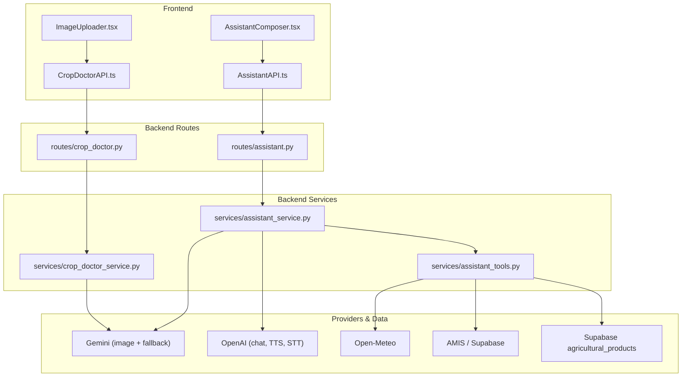
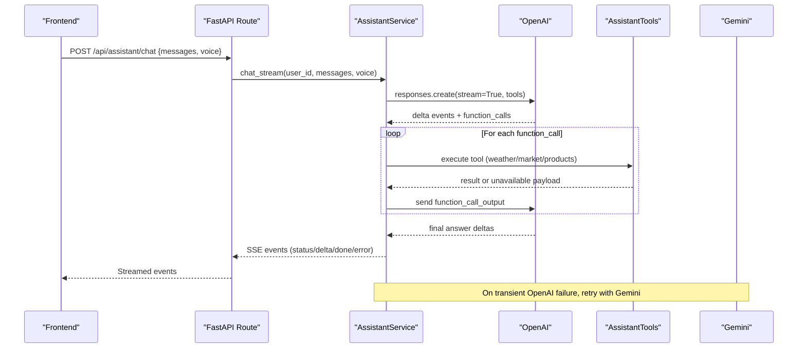
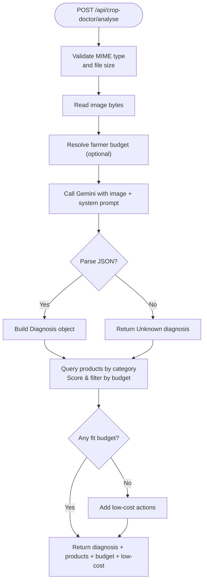
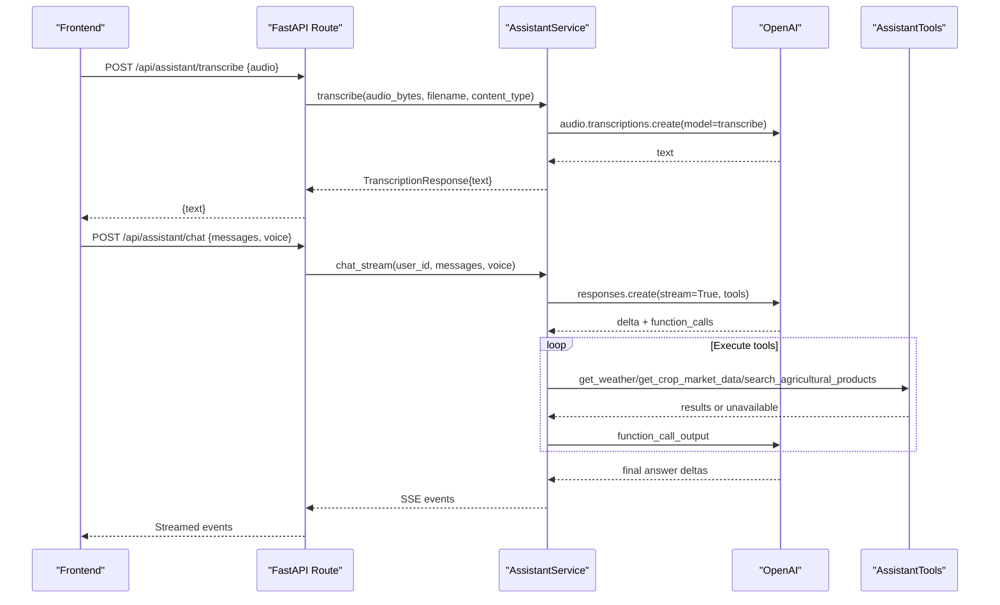
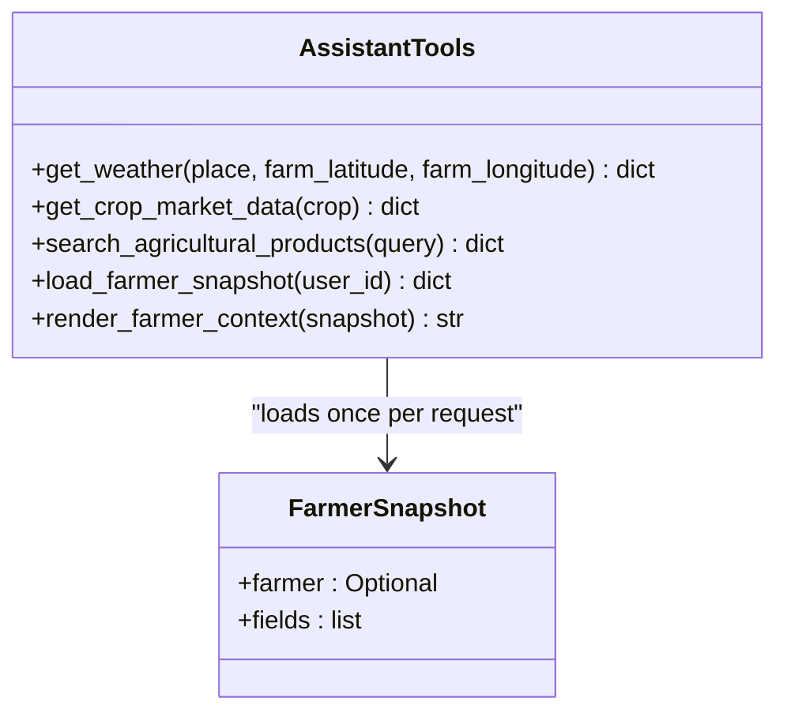
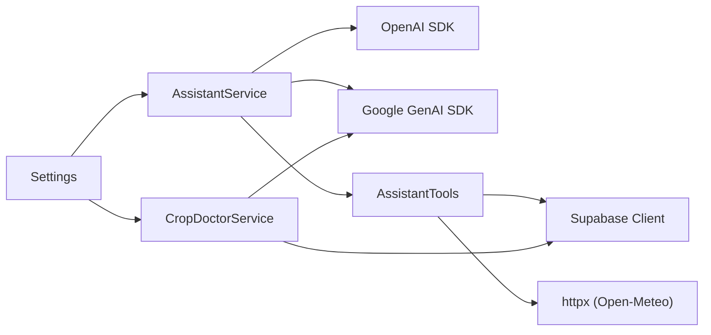

# AI Integration

<cite>
**Referenced Files in This Document**
- [crop_doctor_service.py](file://Backend/services/crop_doctor_service.py)
- [assistant_service.py](file://Backend/services/assistant_service.py)
- [assistant_tools.py](file://Backend/services/assistant_tools.py)
- [crop_doctor.py](file://Backend/routes/crop_doctor.py)
- [assistant.py](file://Backend/routes/assistant.py)
- [settings.py](file://Backend/config/settings.py)
- [crop_doctor.py (schemas)](file://Backend/schemas/crop_doctor.py)
- [assistant.py (schemas)](file://Backend/schemas/assistant.py)
- [CropDoctorAPI.ts](file://Frontend/greenflora/services/CropDoctorAPI.ts)
- [AssistantAPI.ts](file://Frontend/greenflora/services/AssistantAPI.ts)
- [ImageUploader.tsx](file://Frontend/greenflora/components/cropDoctor/ImageUploader.tsx)
- [AssistantComposer.tsx](file://Frontend/greenflora/components/assistant/AssistantComposer.tsx)
</cite>

## Table of Contents
1. Introduction
2. Project Structure
3. Core Components
4. Architecture Overview
5. Detailed Component Analysis
6. Dependency Analysis
7. Performance Considerations
8. Troubleshooting Guide
9. Conclusion
10. Appendices

## Introduction
This document explains Green Flora’s multimodal AI integration that powers:
- Plant disease detection via Gemini image analysis and structured diagnosis with budget-aware product recommendations.
- A voice-first assistant using OpenAI for streaming chat, tool calling, speech-to-text, and text-to-speech, with a Gemini fallback.
- Contextual tools that fetch weather, market prices, and agricultural products to produce grounded, farmer-friendly answers.

It covers prompt engineering, request/response flows, error handling, fallbacks, and implementation examples across backend services, routes, schemas, and frontend integrations.

## Project Structure
The AI features are implemented as layered components:
- Frontend UI and API clients handle uploads, audio capture, SSE streaming, and user interactions.
- Backend routes validate inputs and delegate to service modules.
- Services orchestrate provider calls (OpenAI primary, Gemini fallback), tool execution, and response formatting.
- Schemas define typed requests/responses for robust contracts.
- Settings centralize environment configuration for models and timeouts.

**Diagram sources**
- [crop_doctor_service.py:118-165](file://Backend/services/crop_doctor_service.py#L118-L165)
- [assistant_service.py:106-287](file://Backend/services/assistant_service.py#L106-L287)
- [assistant_tools.py:116-187](file://Backend/services/assistant_tools.py#L116-L187)
- [crop_doctor.py:48-124](file://Backend/routes/crop_doctor.py#L48-L124)
- [assistant.py:68-112](file://Backend/routes/assistant.py#L68-L112)
- [CropDoctorAPI.ts:47-106](file://Frontend/greenflora/services/CropDoctorAPI.ts#L47-L106)
- [AssistantAPI.ts:231-305](file://Frontend/greenflora/services/AssistantAPI.ts#L231-L305)

**Section sources**
- [crop_doctor_service.py:118-165](file://Backend/services/crop_doctor_service.py#L118-L165)
- [assistant_service.py:106-287](file://Backend/services/assistant_service.py#L106-L287)
- [assistant_tools.py:116-187](file://Backend/services/assistant_tools.py#L116-L187)
- [crop_doctor.py:48-124](file://Backend/routes/crop_doctor.py#L48-L124)
- [assistant.py:68-112](file://Backend/routes/assistant.py#L68-L112)
- [CropDoctorAPI.ts:47-106](file://Frontend/greenflora/services/CropDoctorAPI.ts#L47-L106)
- [AssistantAPI.ts:231-305](file://Frontend/greenflora/services/AssistantAPI.ts#L231-L305)

## Core Components
- Crop Doctor Service: Multimodal image analysis with Gemini, structured JSON parsing, product matching, budget filtering, and low-cost fallback actions.
- Assistant Service: Streaming chat with OpenAI Responses API, tool calling, web search, Gemini fallback, speech-to-text, text-to-speech, and greeting generation.
- Assistant Tools: Weather via Open-Meteo, market data via AMIS/Supabase, and agricultural product search; returns honest “unavailable” payloads when data is missing.
- Routes: Thin FastAPI endpoints validating inputs, resolving user context, and delegating to services.
- Schemas: Typed request/response models ensuring consistent contracts.
- Settings: Centralized environment variables for API keys, model names, and timeouts.

**Section sources**
- [crop_doctor_service.py:118-165](file://Backend/services/crop_doctor_service.py#L118-L165)
- [assistant_service.py:106-287](file://Backend/services/assistant_service.py#L106-L287)
- [assistant_tools.py:116-187](file://Backend/services/assistant_tools.py#L116-L187)
- [crop_doctor.py:48-124](file://Backend/routes/crop_doctor.py#L48-L124)
- [assistant.py:68-112](file://Backend/routes/assistant.py#L68-L112)
- [settings.py:84-114](file://Backend/config/settings.py#L84-L114)

## Architecture Overview
Green Flora uses a provider strategy:
- Primary: OpenAI for streaming chat, tool calling, speech-to-text, and text-to-speech.
- Fallback: Gemini for chat when OpenAI experiences transient failures.
- Tools: Internal functions for weather, market, and products; optional web search grounding.

**Diagram sources**
- [assistant_service.py:175-287](file://Backend/services/assistant_service.py#L175-L287)
- [assistant_service.py:293-425](file://Backend/services/assistant_service.py#L293-L425)
- [assistant_service.py:431-540](file://Backend/services/assistant_service.py#L431-L540)
- [assistant_tools.py:518-575](file://Backend/services/assistant_tools.py#L518-L575)

## Detailed Component Analysis

### Gemini-Based Plant Disease Detection (Crop Doctor)
- Image upload processing: The route validates MIME type and size, reads bytes, resolves optional farmer budget, and calls the service.
- Prompt engineering: A system prompt instructs Gemini to return strict JSON describing crop, problem, type, confidence, severity, symptoms, and explanation.
- Response parsing: The service strips markdown fences, parses JSON, validates enums, and falls back to a safe Unknown diagnosis if parsing fails.
- Product matching: Based on problem type, it queries agricultural products, scores by keyword overlap, filters by budget, and returns top matches. Low-cost actions are provided when no suitable product fits.

**Diagram sources**
- [crop_doctor.py:48-124](file://Backend/routes/crop_doctor.py#L48-L124)
- [crop_doctor_service.py:131-165](file://Backend/services/crop_doctor_service.py#L131-L165)
- [crop_doctor_service.py:171-258](file://Backend/services/crop_doctor_service.py#L171-L258)
- [crop_doctor_service.py:264-339](file://Backend/services/crop_doctor_service.py#L264-L339)
- [crop_doctor_service.py:409-416](file://Backend/services/crop_doctor_service.py#L409-L416)

**Section sources**
- [crop_doctor.py:48-124](file://Backend/routes/crop_doctor.py#L48-L124)
- [crop_doctor_service.py:131-165](file://Backend/services/crop_doctor_service.py#L131-L165)
- [crop_doctor_service.py:171-258](file://Backend/services/crop_doctor_service.py#L171-L258)
- [crop_doctor_service.py:264-339](file://Backend/services/crop_doctor_service.py#L264-L339)
- [crop_doctor_service.py:409-416](file://Backend/services/crop_doctor_service.py#L409-L416)
- [crop_doctor.py (schemas):21-61](file://Backend/schemas/crop_doctor.py#L21-L61)
- [crop_doctor.py (schemas):68-123](file://Backend/schemas/crop_doctor.py#L68-L123)
- [CropDoctorAPI.ts:47-106](file://Frontend/greenflora/services/CropDoctorAPI.ts#L47-L106)
- [ImageUploader.tsx:28-55](file://Frontend/greenflora/components/cropDoctor/ImageUploader.tsx#L28-L55)

### Voice-First Assistant with OpenAI GPT and Tool Calling
- Conversation management: The assistant maintains conversation history, sanitizes messages, loads farmer snapshot, and builds a system prompt with contextual notes.
- Tool calling: The model can call internal tools (weather, market, products) and optionally use web search. Each tool call emits status events and executes via shared tool executor.
- Speech-to-text: Transcription uses OpenAI audio transcription with flexible MIME detection and timeout handling.
- Text-to-speech: TTS renders MP3 audio with voice selection and instructions for natural delivery.

**Diagram sources**
- [assistant_service.py:591-633](file://Backend/services/assistant_service.py#L591-L633)
- [assistant_service.py:635-677](file://Backend/services/assistant_service.py#L635-L677)
- [assistant_service.py:175-287](file://Backend/services/assistant_service.py#L175-L287)
- [assistant_service.py:293-425](file://Backend/services/assistant_service.py#L293-L425)
- [assistant_tools.py:220-319](file://Backend/services/assistant_tools.py#L220-L319)
- [assistant_tools.py:361-428](file://Backend/services/assistant_tools.py#L361-L428)
- [assistant_tools.py:435-508](file://Backend/services/assistant_tools.py#L435-L508)

**Section sources**
- [assistant_service.py:175-287](file://Backend/services/assistant_service.py#L175-L287)
- [assistant_service.py:293-425](file://Backend/services/assistant_service.py#L293-L425)
- [assistant_service.py:591-677](file://Backend/services/assistant_service.py#L591-L677)
- [assistant_tools.py:220-319](file://Backend/services/assistant_tools.py#L220-L319)
- [assistant_tools.py:361-428](file://Backend/services/assistant_tools.py#L361-L428)
- [assistant_tools.py:435-508](file://Backend/services/assistant_tools.py#L435-L508)
- [assistant.py:68-112](file://Backend/routes/assistant.py#L68-L112)
- [assistant.py:119-173](file://Backend/routes/assistant.py#L119-L173)
- [AssistantAPI.ts:231-305](file://Frontend/greenflora/services/AssistantAPI.ts#L231-L305)
- [AssistantAPI.ts:315-345](file://Frontend/greenflora/services/AssistantAPI.ts#L315-L345)
- [AssistantAPI.ts:357-385](file://Frontend/greenflora/services/AssistantAPI.ts#L357-L385)
- [AssistantComposer.tsx:44-62](file://Frontend/greenflora/components/assistant/AssistantComposer.tsx#L44-L62)

### Assistant Tools System
- Weather: Geocodes place names or uses saved farm coordinates; returns current conditions and 7-day forecast with WMO codes.
- Market: Normalizes crop names (including Urdu/Roman-Urdu aliases), matches AMIS commodities, and returns latest price bundle with trend summary and per-market comparison.
- Products: Searches agricultural products dataset by keywords; sanitizes query terms to prevent injection; returns factual records only.

**Diagram sources**
- [assistant_tools.py:116-187](file://Backend/services/assistant_tools.py#L116-L187)
- [assistant_tools.py:220-319](file://Backend/services/assistant_tools.py#L220-L319)
- [assistant_tools.py:361-428](file://Backend/services/assistant_tools.py#L361-L428)
- [assistant_tools.py:435-508](file://Backend/services/assistant_tools.py#L435-L508)

**Section sources**
- [assistant_tools.py:116-187](file://Backend/services/assistant_tools.py#L116-L187)
- [assistant_tools.py:220-319](file://Backend/services/assistant_tools.py#L220-L319)
- [assistant_tools.py:361-428](file://Backend/services/assistant_tools.py#L361-L428)
- [assistant_tools.py:435-508](file://Backend/services/assistant_tools.py#L435-L508)

### Implementation Examples and Error Handling

#### Example: Image Upload and Analysis Flow
- Frontend: User selects an image via ImageUploader; validation ensures acceptable types and size.
- Client: CropDoctorAPI sends multipart/form-data to /api/crop-doctor/analyse with optional auth token and timeout.
- Backend: Route validates input, resolves budget, calls service; service calls Gemini, parses JSON, matches products, and returns structured response.
- Errors: Network, timeout, validation, server errors are classified and surfaced to the UI with friendly messages.

**Section sources**
- [ImageUploader.tsx:28-55](file://Frontend/greenflora/components/cropDoctor/ImageUploader.tsx#L28-L55)
- [CropDoctorAPI.ts:47-106](file://Frontend/greenflora/services/CropDoctorAPI.ts#L47-L106)
- [crop_doctor.py:48-124](file://Backend/routes/crop_doctor.py#L48-L124)
- [crop_doctor_service.py:131-165](file://Backend/services/crop_doctor_service.py#L131-L165)

#### Example: Streaming Chat with Tool Calls
- Frontend: AssistantComposer collects text or voice input; AssistantAPI streams SSE events from /api/assistant/chat.
- Backend: AssistantService orchestrates OpenAI streaming, handles function calls, executes tools, and yields status/delta/done events.
- Fallback: If OpenAI fails transiently, the service retries with Gemini; link/stream sanitization prevents malformed links mid-stream.
- Errors: AssistantError and transient exceptions are converted into SSE error events with retryable flags.

**Section sources**
- [AssistantComposer.tsx:44-62](file://Frontend/greenflora/components/assistant/AssistantComposer.tsx#L44-L62)
- [AssistantAPI.ts:231-305](file://Frontend/greenflora/services/AssistantAPI.ts#L231-L305)
- [assistant_service.py:175-287](file://Backend/services/assistant_service.py#L175-L287)
- [assistant_service.py:293-425](file://Backend/services/assistant_service.py#L293-L425)
- [assistant_service.py:431-540](file://Backend/services/assistant_service.py#L431-L540)

#### Example: Speech-to-Text and Text-to-Speech
- STT: Frontend sends recorded audio to /api/assistant/transcribe; backend transcribes using OpenAI with MIME detection and timeouts.
- TTS: Frontend requests /api/assistant/speak with text and voice; backend generates MP3 audio with voice selection and instructions.
- Errors: Timeouts and unsupported formats raise friendly AssistantError; endpoints return appropriate HTTP statuses.

**Section sources**
- [AssistantAPI.ts:315-345](file://Frontend/greenflora/services/AssistantAPI.ts#L315-L345)
- [AssistantAPI.ts:357-385](file://Frontend/greenflora/services/AssistantAPI.ts#L357-L385)
- [assistant_service.py:591-677](file://Backend/services/assistant_service.py#L591-L677)
- [assistant.py:119-173](file://Backend/routes/assistant.py#L119-L173)

### Prompt Templates and Customization
- Crop Doctor system prompt: Instructs Gemini to analyze images and return strict JSON with fields like crop, problem, problem_type, confidence, severity, symptoms, and explanation. It enforces constraints such as not inventing product names/prices and keeping language simple for farmers.
- Assistant system prompt: Built dynamically from farmer snapshot and entity extraction hints; includes rules to avoid fabricating weather/prices/products and to report “unavailable” when data is missing.
- Utility prompts: Greeting generation uses a concise prompt to produce localized, time-of-day greetings; entity extraction uses a structured schema to normalize voice input.

Customization options:
- Model selection via settings (main, utility, transcribe, tts, fallback).
- Timeout tuning for streaming and audio endpoints.
- Tool definitions can be extended to add new capabilities while preserving provider-neutral descriptions.

**Section sources**
- [crop_doctor_service.py:42-64](file://Backend/services/crop_doctor_service.py#L42-L64)
- [assistant_service.py:205-221](file://Backend/services/assistant_service.py#L205-L221)
- [assistant_service.py:683-735](file://Backend/services/assistant_service.py#L683-L735)
- [assistant_service.py:741-785](file://Backend/services/assistant_service.py#L741-L785)
- [settings.py:84-114](file://Backend/config/settings.py#L84-L114)

## Dependency Analysis
- Provider coupling: AssistantService depends on OpenAI SDK and optionally Google GenAI SDK; CropDoctorService depends on google.generativeai.
- Data dependencies: AssistantTools depends on httpx for Open-Meteo and Supabase client for market/product data; CropDoctorService also uses Supabase for product matching.
- Configuration: Settings centralizes API keys and model names; all services read from this single source.
- Frontend-backend contract: Schemas define request/response shapes; frontend services enforce timeouts and classify errors consistently.

**Diagram sources**
- [settings.py:84-114](file://Backend/config/settings.py#L84-L114)
- [assistant_service.py:106-127](file://Backend/services/assistant_service.py#L106-L127)
- [crop_doctor_service.py:118-125](file://Backend/services/crop_doctor_service.py#L118-L125)
- [assistant_tools.py:23-31](file://Backend/services/assistant_tools.py#L23-L31)

**Section sources**
- [settings.py:84-114](file://Backend/config/settings.py#L84-L114)
- [assistant_service.py:106-127](file://Backend/services/assistant_service.py#L106-L127)
- [crop_doctor_service.py:118-125](file://Backend/services/crop_doctor_service.py#L118-L125)
- [assistant_tools.py:23-31](file://Backend/services/assistant_tools.py#L23-L31)

## Performance Considerations
- Streaming chat reduces perceived latency by emitting deltas immediately; tool budgets limit excessive hops to keep responses responsive.
- Audio endpoints have shorter timeouts than chat to avoid long waits for STT/TTS.
- Image analysis sets a generous timeout due to potential Gemini processing time; frontend enforces its own timeout and abort controller.
- Product matching uses keyword scoring and limits results to reduce database load.
- Greeting caching avoids repeated AI calls for dashboard greetings within a short TTL.

[No sources needed since this section provides general guidance]

## Troubleshooting Guide
Common issues and resolutions:
- Missing API keys: Ensure GEMINI_API_KEY and OPENAI_API_KEY are set in environment; services degrade gracefully when keys are absent.
- Unsupported image types: Only JPEG/PNG/WebP are accepted; ensure correct MIME type and size under 10 MB.
- Transcription failures: Check audio format and duration; supported formats include webm/mp3/mp4/wav/ogg; timeouts may occur if too long.
- Tool unavailability: Weather, market, or product tools may return “unavailable” payloads; the assistant will inform users honestly rather than fabricate data.
- Streaming interruptions: SSE streams may be interrupted by proxies; frontend handles buffering and frame parsing robustly.

**Section sources**
- [crop_doctor.py:60-87](file://Backend/routes/crop_doctor.py#L60-L87)
- [assistant_service.py:591-633](file://Backend/services/assistant_service.py#L591-L633)
- [assistant_tools.py:220-319](file://Backend/services/assistant_tools.py#L220-L319)
- [assistant_tools.py:361-428](file://Backend/services/assistant_tools.py#L361-L428)
- [assistant_tools.py:435-508](file://Backend/services/assistant_tools.py#L435-L508)

## Conclusion
Green Flora’s AI integration combines multimodal image analysis and conversational assistants to deliver actionable insights for farmers. The architecture emphasizes reliability through provider fallbacks, robust error handling, and grounded tool usage. Prompt engineering ensures consistent, farmer-friendly outputs, while configuration-driven customization allows easy model swaps and tuning.

[No sources needed since this section summarizes without analyzing specific files]

## Appendices

### API Endpoints Summary
- POST /api/crop-doctor/analyse: Accepts image upload; returns diagnosis, products, budget context, and low-cost actions.
- POST /api/assistant/chat: Streams assistant replies via SSE; supports voice mode and tool calls.
- POST /api/assistant/transcribe: Converts audio to text using STT.
- POST /api/assistant/speak: Converts text to MP3 audio using TTS.
- GET /api/assistant/greeting: Returns localized greeting based on time of day and language.

**Section sources**
- [crop_doctor.py:48-124](file://Backend/routes/crop_doctor.py#L48-L124)
- [assistant.py:68-112](file://Backend/routes/assistant.py#L68-L112)
- [assistant.py:119-173](file://Backend/routes/assistant.py#L119-L173)
- [assistant.py:180-208](file://Backend/routes/assistant.py#L180-L208)