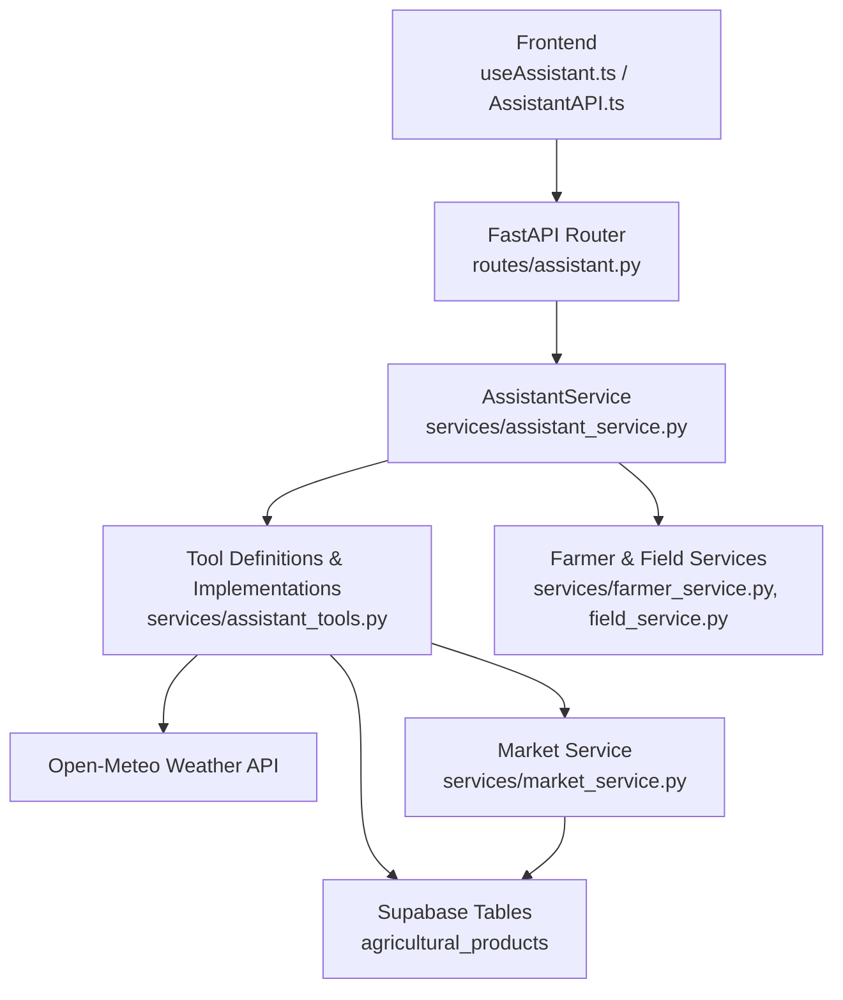
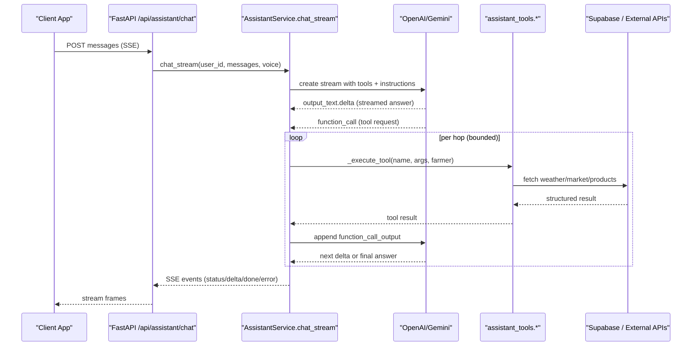
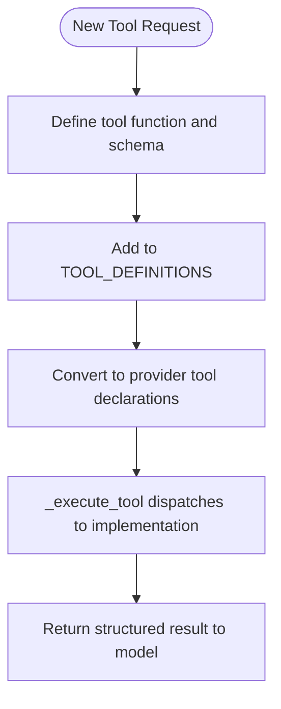
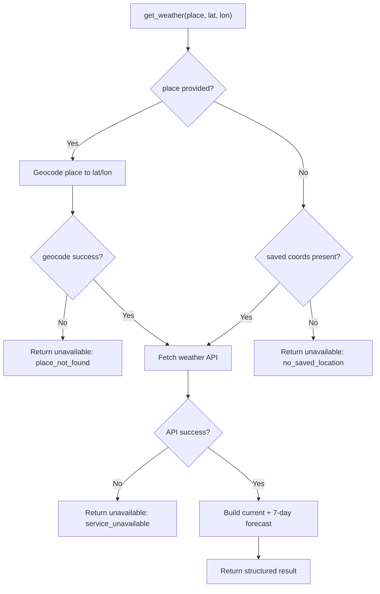
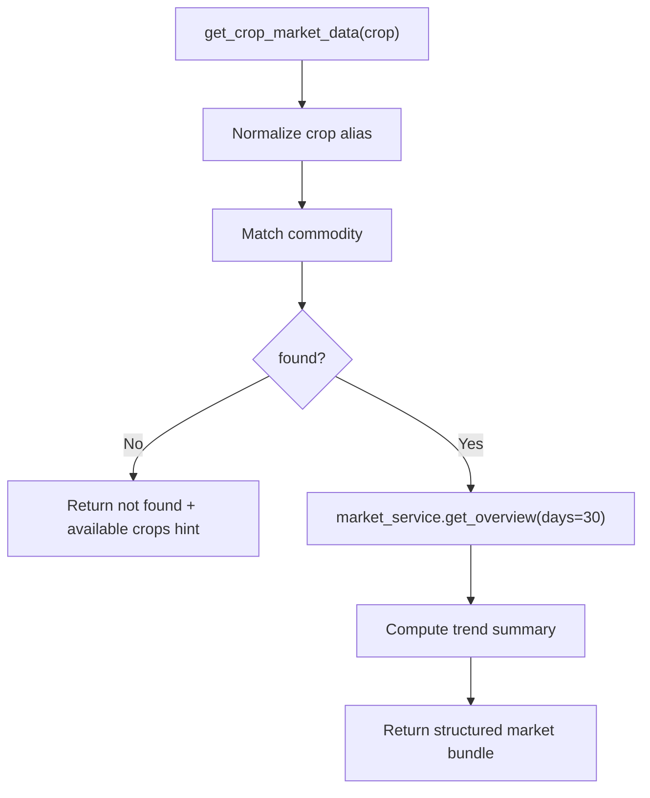
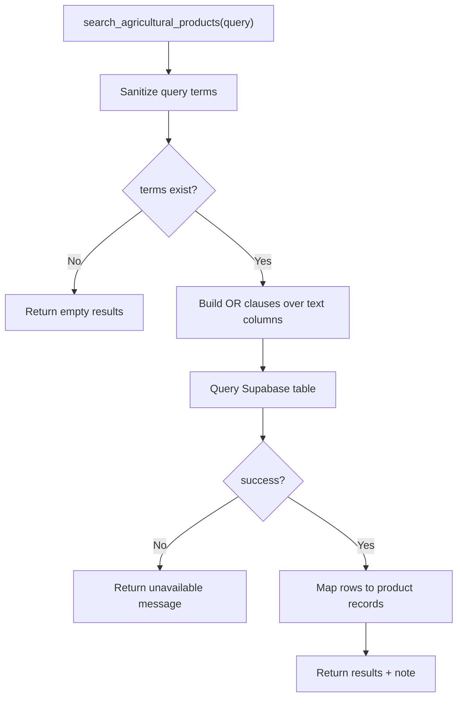
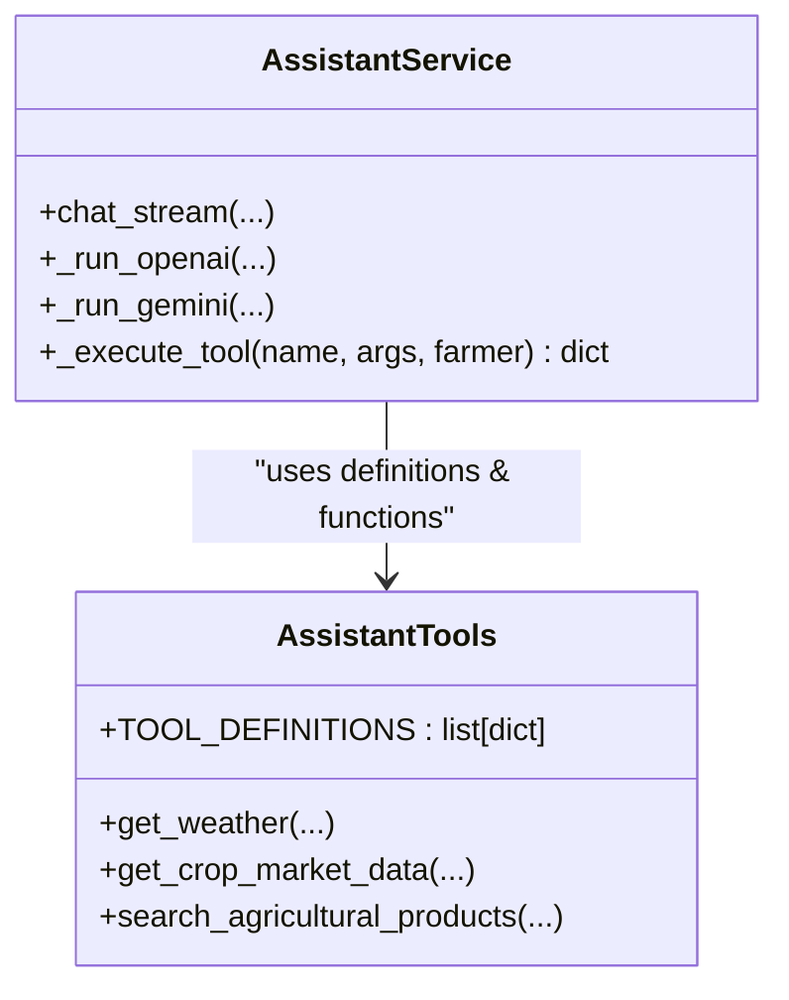
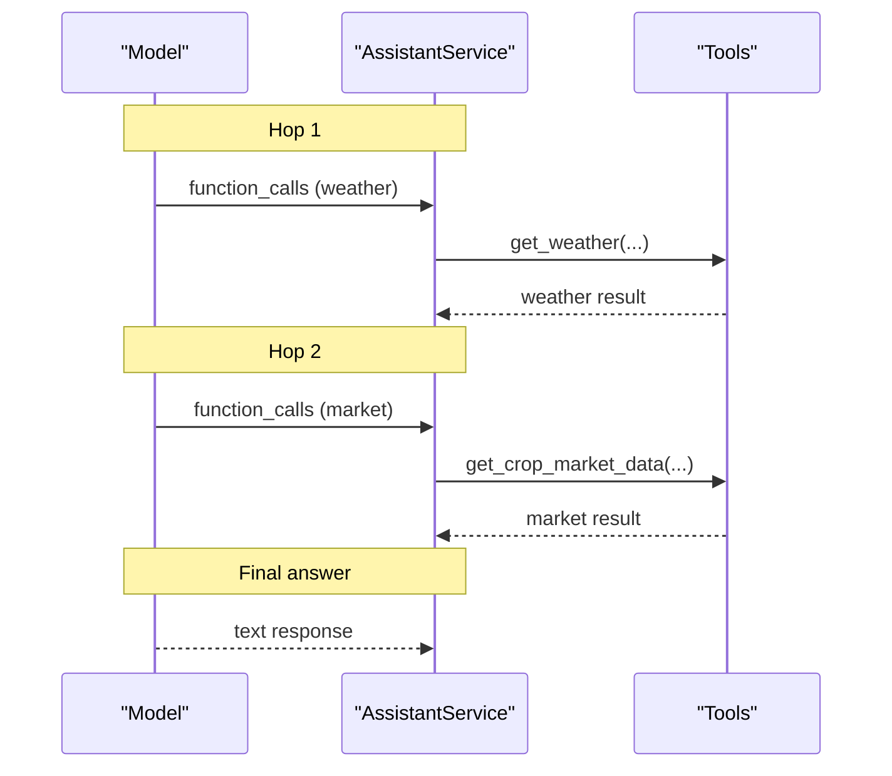
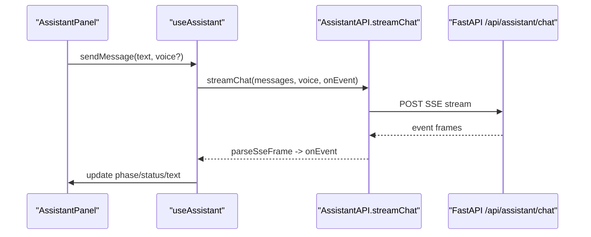
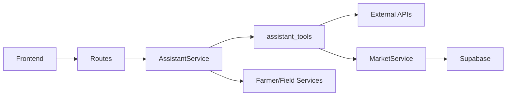

# Assistant Tools System

<cite>
**Referenced Files in This Document**
- [assistant_tools.py](file://Backend/services/assistant_tools.py)
- [assistant_service.py](file://Backend/services/assistant_service.py)
- [assistant.py](file://Backend/routes/assistant.py)
- [assistant.py (schemas)](file://Backend/schemas/assistant.py)
- [market_service.py](file://Backend/services/market_service.py)
- [farmer_service.py](file://Backend/services/farmer_service.py)
- [field_service.py](file://Backend/services/field_service.py)
- [settings.py](file://Backend/config/settings.py)
- [AssistantAPI.ts](file://Frontend/greenflora/services/AssistantAPI.ts)
- [useAssistant.ts](file://Frontend/greenflora/Hooks/useAssistant.ts)
- [AssistantPanel.tsx](file://Frontend/greenflora/components/assistant/AssistantPanel.tsx)
</cite>

## Table of Contents
1. [Introduction](#introduction)
2. [Project Structure](#project-structure)
3. [Core Components](#core-components)
4. [Architecture Overview](#architecture-overview)
5. [Detailed Component Analysis](#detailed-component-analysis)
6. [Dependency Analysis](#dependency-analysis)
7. [Performance Considerations](#performance-considerations)
8. [Troubleshooting Guide](#troubleshooting-guide)
9. [Conclusion](#conclusion)
10. [Appendices](#appendices)

## Introduction
This document explains the assistant tools system that powers contextual responses for Green Flora using farm data, weather conditions, and market information. It covers how tools are registered and discovered, how each tool works, how tool execution is orchestrated, and how to extend the system with custom tools. It also includes guidance on testing, debugging, performance tuning, and tool chaining for complex multi-step operations.

## Project Structure
The assistant tools system spans backend services, routes, schemas, and frontend integration:

- Backend orchestration and tool execution live in the assistant service layer.
- Tool implementations access external APIs and internal data sources.
- Routes expose streaming chat endpoints and voice features.
- Frontend streams events from the server and renders status, deltas, and completion.

**Diagram sources**
- [assistant.py:68-112](file://Backend/routes/assistant.py#L68-L112)
- [assistant_service.py:175-287](file://Backend/services/assistant_service.py#L175-L287)
- [assistant_tools.py:518-575](file://Backend/services/assistant_tools.py#L518-L575)
- [market_service.py:47-653](file://Backend/services/market_service.py#L47-L653)

**Section sources**
- [assistant.py:68-112](file://Backend/routes/assistant.py#L68-L112)
- [assistant_service.py:175-287](file://Backend/services/assistant_service.py#L175-L287)
- [assistant_tools.py:518-575](file://Backend/services/assistant_tools.py#L518-L575)

## Core Components
- Tool definitions and implementations: central registry of available tools and their parameter schemas; concrete functions fetch weather, market prices, and product data.
- Assistant service: orchestrates provider calls (OpenAI primary, Gemini fallback), executes tools, handles retries, and streams results via SSE.
- Market service: reads AMIS-ingested Supabase tables, computes trends, signals, and insights with caching.
- Farmer and field services: provide farmer profile and fields context used by tools and prompts.
- Frontend: parses SSE events, updates UI state, supports voice input and playback.

Key responsibilities:
- Tool registration: a canonical list of tool definitions shared across providers.
- Tool discovery: assistant service builds provider-specific tool payloads from the canonical definitions.
- Tool execution: argument parsing, validation, invocation, and error handling.
- Response formatting: consistent JSON-like structures returned to the model and surfaced to the UI.

**Section sources**
- [assistant_tools.py:518-575](file://Backend/services/assistant_tools.py#L518-L575)
- [assistant_service.py:300-426](file://Backend/services/assistant_service.py#L300-L426)
- [market_service.py:47-653](file://Backend/services/market_service.py#L47-L653)
- [farmer_service.py:51-96](file://Backend/services/farmer_service.py#L51-L96)
- [field_service.py:327-335](file://Backend/services/field_service.py#L327-L335)

## Architecture Overview
The assistant uses a provider strategy with tool calling:

- OpenAI Responses API is the primary provider; it supports function tools and web search.
- Gemini Flash is the fallback when OpenAI experiences transient failures.
- Tools are declared once and converted into provider-specific declarations.
- The assistant loops up to a bounded number of “hops” to execute requested tools and feed results back until the model returns text or the budget is exhausted.

**Diagram sources**
- [assistant_service.py:175-287](file://Backend/services/assistant_service.py#L175-L287)
- [assistant_service.py:293-426](file://Backend/services/assistant_service.py#L293-L426)
- [assistant_tools.py:220-319](file://Backend/services/assistant_tools.py#L220-L319)
- [assistant_tools.py:361-428](file://Backend/services/assistant_tools.py#L361-L428)
- [assistant_tools.py:435-508](file://Backend/services/assistant_tools.py#L435-L508)

## Detailed Component Analysis

### Tool Registration and Discovery
- Canonical tool definitions are defined centrally with name, description, and parameters.
- The assistant service converts these definitions into:
  - OpenAI function tools payload for Responses API.
  - Gemini FunctionDeclaration objects for fallback.
- Web search is appended alongside internal tools for both providers.

Adding a new tool:
1. Implement the tool function in the tools module with clear inputs and outputs.
2. Add a canonical definition entry to the tool definitions list.
3. Update the tool executor to route the new tool name to your implementation.
4. Optionally add a user-facing label for status display during tool execution.

**Diagram sources**
- [assistant_tools.py:518-575](file://Backend/services/assistant_tools.py#L518-L575)
- [assistant_service.py:300-308](file://Backend/services/assistant_service.py#L300-L308)
- [assistant_service.py:556-585](file://Backend/services/assistant_service.py#L556-L585)

**Section sources**
- [assistant_tools.py:518-575](file://Backend/services/assistant_tools.py#L518-L575)
- [assistant_service.py:300-308](file://Backend/services/assistant_service.py#L300-L308)
- [assistant_service.py:556-585](file://Backend/services/assistant_service.py#L556-L585)

### Tool: Weather Lookup
- Purpose: current conditions and 7-day forecast for a location.
- Inputs: optional place name; otherwise uses farmer’s saved farm coordinates.
- Behavior:
  - Geocodes place names via an external geocoding endpoint.
  - Fetches current and daily weather from a public forecast API.
  - Returns structured data including conditions, temperatures, precipitation, and wind.
  - Handles missing locations and service errors gracefully with explicit “unavailable” payloads.

**Diagram sources**
- [assistant_tools.py:194-319](file://Backend/services/assistant_tools.py#L194-L319)

**Section sources**
- [assistant_tools.py:194-319](file://Backend/services/assistant_tools.py#L194-L319)

### Tool: Market Price Retrieval
- Purpose: latest official mandi price bundle for a crop, including trend summary, signal, highest/lowest markets, and per-market comparison.
- Inputs: crop name (supports English, Urdu, Roman-Urdu aliases).
- Behavior:
  - Normalizes crop names and matches against commodities list.
  - Retrieves overview from market service (AMIS ingested data).
  - Computes trend summary and market comparisons.
  - Returns honest “unavailable” or “not found” payloads when data is missing.

**Diagram sources**
- [assistant_tools.py:326-428](file://Backend/services/assistant_tools.py#L326-L428)
- [market_service.py:158-343](file://Backend/services/market_service.py#L158-L343)

**Section sources**
- [assistant_tools.py:326-428](file://Backend/services/assistant_tools.py#L326-L428)
- [market_service.py:158-343](file://Backend/services/market_service.py#L158-L343)

### Tool: Agricultural Product Search
- Purpose: search Green Flora’s agricultural product dataset for recommendations (pesticides, fertilizers, etc.).
- Inputs: query keywords (problem, pest, disease, crop).
- Behavior:
  - Sanitizes terms to avoid unsafe PostgREST grammar characters.
  - Builds OR clauses across multiple searchable columns.
  - Returns matching products with brand, dosage, and pricing info.
  - Handles configuration and database errors with friendly messages.

**Diagram sources**
- [assistant_tools.py:435-508](file://Backend/services/assistant_tools.py#L435-L508)

**Section sources**
- [assistant_tools.py:435-508](file://Backend/services/assistant_tools.py#L435-L508)

### Tool Execution Framework
- Argument parsing: JSON arguments parsed with safe defaults.
- Dispatch: centralized executor routes to specific tool functions.
- Error handling: exceptions logged; consistent “unavailable” responses returned so the model can explain honestly.
- Status labels: user-facing progress labels map tool names to friendly messages.

**Diagram sources**
- [assistant_service.py:556-585](file://Backend/services/assistant_service.py#L556-L585)
- [assistant_tools.py:518-575](file://Backend/services/assistant_tools.py#L518-L575)

**Section sources**
- [assistant_service.py:556-585](file://Backend/services/assistant_service.py#L556-L585)
- [assistant_tools.py:518-575](file://Backend/services/assistant_tools.py#L518-L575)

### Tool Chaining Capabilities
- The assistant runs in bounded hops to support multi-step reasoning:
  - Each hop can request one or more tools.
  - Results are appended to the conversation context before the next model call.
  - If the tool budget is exhausted, the model answers based on gathered data.
- This enables complex workflows such as:
  - Check weather, then check market prices for a crop, then search products for a pest.
  - Combine farmer context (profile and active fields) with external data to tailor advice.

**Diagram sources**
- [assistant_service.py:312-426](file://Backend/services/assistant_service.py#L312-L426)

**Section sources**
- [assistant_service.py:312-426](file://Backend/services/assistant_service.py#L312-L426)

### Frontend Integration
- Streaming chat:
  - Parses SSE frames into typed events (status, delta, done, error).
  - Updates UI state for thinking, generating, and completion.
  - Supports voice mode and auto-speak after completion.
- Voice:
  - Captures audio, transcribes via backend, sends transcribed text with voice flag.
  - Reads replies aloud if enabled; failures do not break text experience.

**Diagram sources**
- [AssistantAPI.ts:157-305](file://Frontend/greenflora/services/AssistantAPI.ts#L157-L305)
- [useAssistant.ts:285-455](file://Frontend/greenflora/Hooks/useAssistant.ts#L285-L455)
- [assistant.py:68-112](file://Backend/routes/assistant.py#L68-L112)

**Section sources**
- [AssistantAPI.ts:157-305](file://Frontend/greenflora/services/AssistantAPI.ts#L157-L305)
- [useAssistant.ts:285-455](file://Frontend/greenflora/Hooks/useAssistant.ts#L285-L455)
- [assistant.py:68-112](file://Backend/routes/assistant.py#L68-L112)

## Dependency Analysis
- Assistant service depends on:
  - Settings for model names and timeouts.
  - Assistant tools for data retrieval.
  - Farmer and field services for context.
- Market service depends on Supabase tables and caches frequently accessed lists.
- Weather tool depends on external geocoding and forecast APIs.
- Frontend depends on SSE parsing and robust error handling.

**Diagram sources**
- [assistant_service.py:175-287](file://Backend/services/assistant_service.py#L175-L287)
- [assistant_tools.py:220-319](file://Backend/services/assistant_tools.py#L220-L319)
- [market_service.py:47-653](file://Backend/services/market_service.py#L47-L653)
- [assistant.py:68-112](file://Backend/routes/assistant.py#L68-L112)

**Section sources**
- [assistant_service.py:175-287](file://Backend/services/assistant_service.py#L175-L287)
- [assistant_tools.py:220-319](file://Backend/services/assistant_tools.py#L220-L319)
- [market_service.py:47-653](file://Backend/services/market_service.py#L47-L653)
- [assistant.py:68-112](file://Backend/routes/assistant.py#L68-L112)

## Performance Considerations
- Caching strategies:
  - Market service caches commodities and markets lookup with TTL to reduce database load.
  - Greeting cache avoids repeated AI calls for dashboard greetings.
- Rate limiting and timeouts:
  - HTTP requests use explicit timeouts to prevent hanging.
  - Assistant service sets streaming timeouts for AI calls.
- Concurrent tool execution:
  - Tool calls are executed sequentially within a hop to maintain deterministic context; this simplifies error handling and ensures stable conversation state.
- Optimization opportunities:
  - Increase cache TTLs cautiously based on data freshness requirements.
  - Batch or limit tool results (e.g., max markets, max products) to reduce payload size.
  - Use efficient queries and indexes in Supabase for faster lookups.

[No sources needed since this section provides general guidance]

## Troubleshooting Guide
Common issues and resolutions:
- Weather tool unavailable:
  - Place not found: verify spelling or suggest nearby city.
  - No saved location: prompt farmer to set farm coordinates in profile.
  - Service unavailable: retry later; logs indicate network or API errors.
- Market tool unavailable:
  - Crop not found: return available crops list; ensure AMIS ingestion has run.
  - Database not configured: check Supabase credentials and connection.
- Product search unavailable:
  - Configuration missing: ensure Supabase client is initialized.
  - Query errors: sanitize terms and validate column names.
- Assistant streaming interruptions:
  - Transient AI errors trigger fallback to Gemini; partial answers are preserved.
  - Network drops surface as retryable errors; UI offers retry action.

Debugging tips:
- Inspect SSE events in the browser network tab to see status, tool usage, and deltas.
- Check backend logs for tool execution warnings and exceptions.
- Validate tool definitions and executor mapping when adding new tools.

**Section sources**
- [assistant_tools.py:220-319](file://Backend/services/assistant_tools.py#L220-L319)
- [assistant_tools.py:361-428](file://Backend/services/assistant_tools.py#L361-L428)
- [assistant_tools.py:435-508](file://Backend/services/assistant_tools.py#L435-L508)
- [assistant_service.py:228-287](file://Backend/services/assistant_service.py#L228-L287)
- [assistant_service.py:293-426](file://Backend/services/assistant_service.py#L293-L426)

## Conclusion
The assistant tools system provides a robust, extensible framework for contextual farming advice. Tools are centrally defined and executed through a resilient orchestration layer that supports provider fallbacks, bounded tool chaining, and graceful error handling. With built-in caching, timeouts, and structured responses, the system delivers reliable, farmer-friendly interactions while remaining easy to extend with new capabilities.

[No sources needed since this section summarizes without analyzing specific files]

## Appendices

### Adding a Custom Tool: Step-by-Step
1. Implement the tool function in the tools module with clear inputs and outputs.
2. Add a canonical definition entry to the tool definitions list.
3. Update the tool executor to route the new tool name to your implementation.
4. Optionally add a user-facing label for status display during tool execution.
5. Test via the chat endpoint and inspect SSE events for correct behavior.

**Section sources**
- [assistant_tools.py:518-575](file://Backend/services/assistant_tools.py#L518-L575)
- [assistant_service.py:556-585](file://Backend/services/assistant_service.py#L556-L585)

### Integrating External APIs
- Use httpx with explicit timeouts for external calls.
- Handle network errors and malformed responses gracefully.
- Return structured “unavailable” payloads when data cannot be retrieved.
- Log warnings for diagnostics without exposing internals to clients.

**Section sources**
- [assistant_tools.py:220-319](file://Backend/services/assistant_tools.py#L220-L319)

### Testing Tools
- Use the chat endpoint with test messages that trigger specific tools.
- Verify SSE events include correct status labels and tool usage metadata.
- Validate tool outputs for structure and completeness.
- Simulate failures (network errors, missing data) to confirm graceful degradation.

**Section sources**
- [assistant.py:68-112](file://Backend/routes/assistant.py#L68-L112)
- [AssistantAPI.ts:157-305](file://Frontend/greenflora/services/AssistantAPI.ts#L157-L305)

### Optimizing Tool Performance
- Leverage market service caching for frequent lookups.
- Limit result sizes (markets, products) to reduce payload overhead.
- Tune timeouts and tool budgets based on expected complexity.
- Monitor logs for slow queries or external API latency.

**Section sources**
- [market_service.py:47-653](file://Backend/services/market_service.py#L47-L653)
- [assistant_service.py:47-57](file://Backend/services/assistant_service.py#L47-L57)