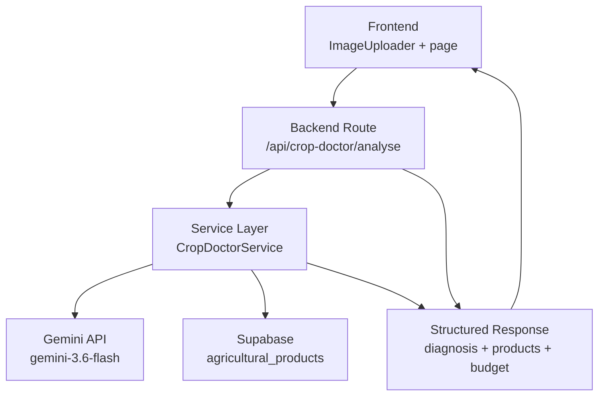
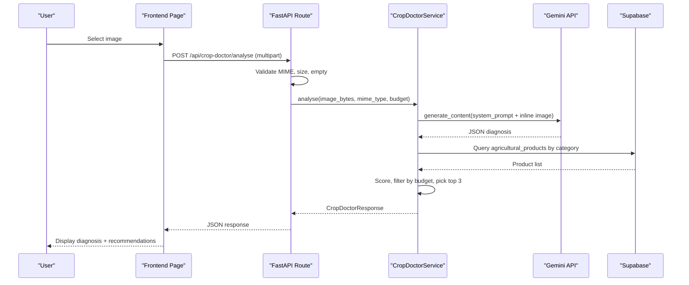
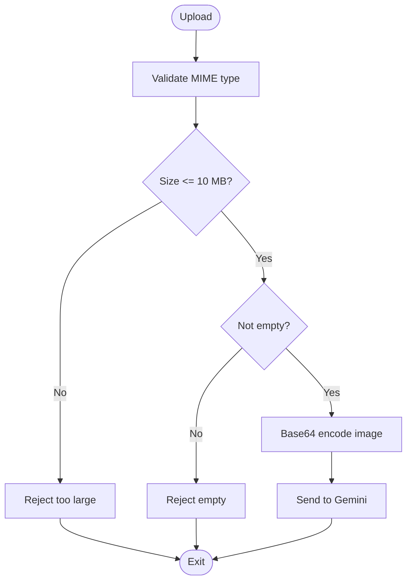
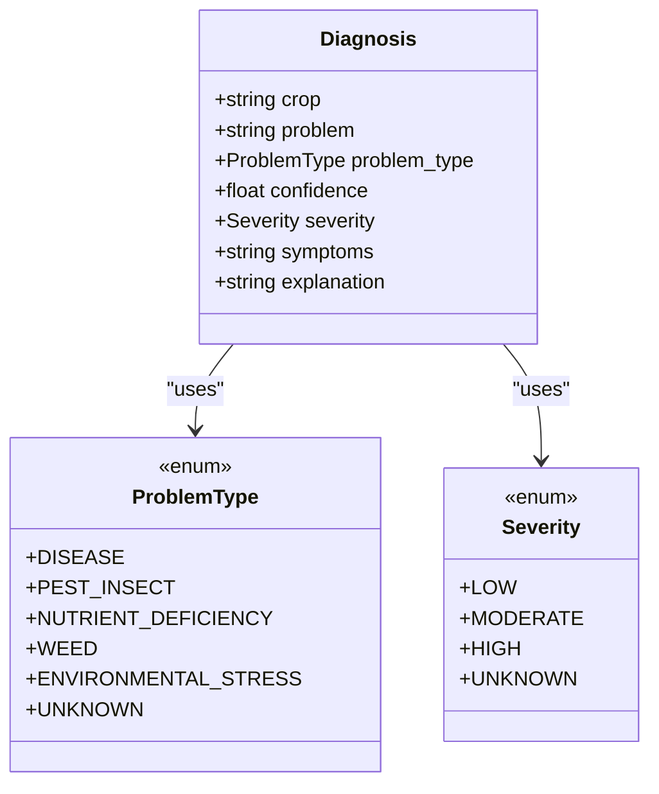
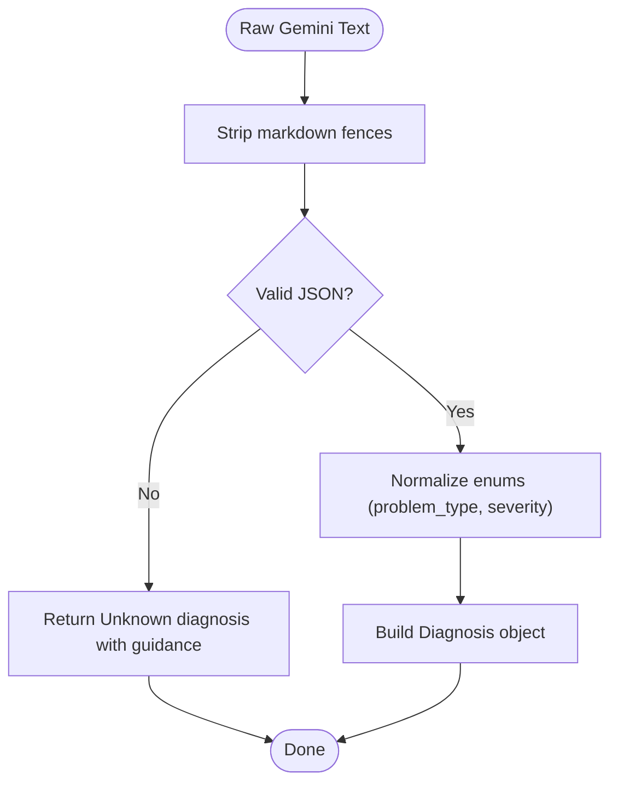
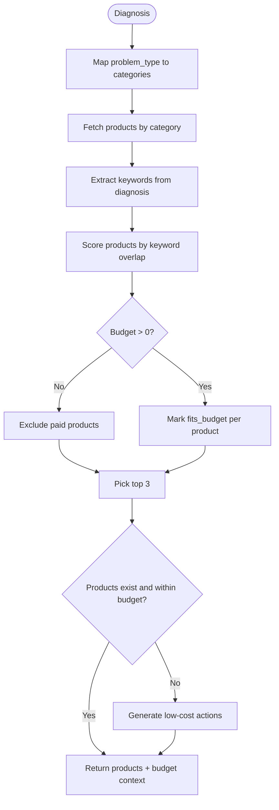
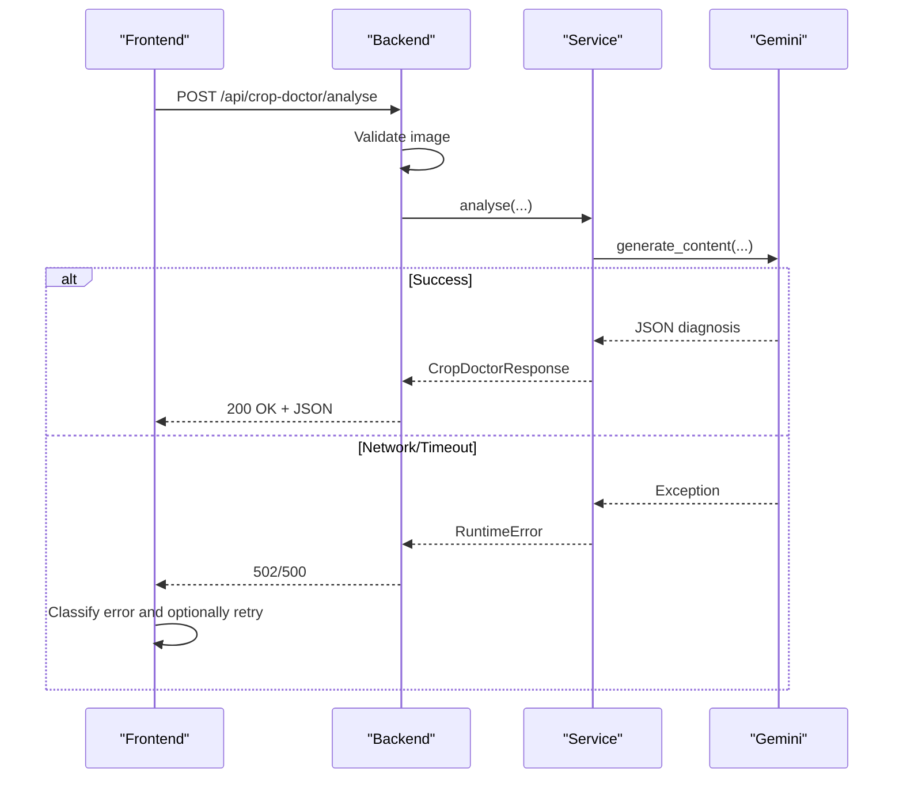
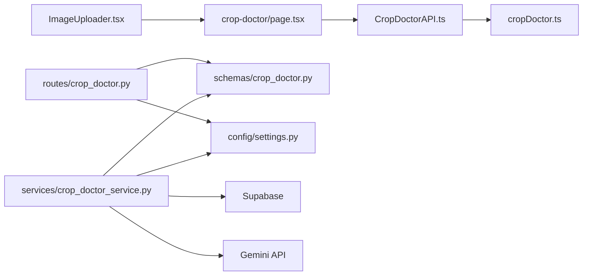

# Gemini API Integration

<cite>
**Referenced Files in This Document**
- [crop_doctor.py](file://Backend/routes/crop_doctor.py)
- [crop_doctor_service.py](file://Backend/services/crop_doctor_service.py)
- [crop_doctor.py (schemas)](file://Backend/schemas/crop_doctor.py)
- [settings.py](file://Backend/config/settings.py)
- [CropDoctorAPI.ts](file://Frontend/greenflora/services/CropDoctorAPI.ts)
- [cropDoctor.ts (types)](file://Frontend/greenflora/types/cropDoctor.ts)
- [ImageUploader.tsx](file://Frontend/greenflora/components/cropDoctor/ImageUploader.tsx)
- [page.tsx (crop-doctor)](file://Frontend/greenflora/app/crop-doctor/page.tsx)
- [DiagnosisCard.tsx](file://Frontend/greenflora/components/cropDoctor/DiagnosisCard.tsx)
- [RecommendationsCard.tsx](file://Frontend/greenflora/components/cropDoctor/RecommendationsCard.tsx)
</cite>

## Table of Contents
1. [Introduction](#introduction)
2. [Project Structure](#project-structure)
3. [Core Components](#core-components)
4. [Architecture Overview](#architecture-overview)
5. [Detailed Component Analysis](#detailed-component-analysis)
6. [Dependency Analysis](#dependency-analysis)
7. [Performance Considerations](#performance-considerations)
8. [Troubleshooting Guide](#troubleshooting-guide)
9. [Conclusion](#conclusion)
10. [Appendices](#appendices)

## Introduction
This document explains the end-to-end integration with the Gemini API for plant disease detection in Green Flora. It covers how images are uploaded and validated, how they are encoded and sent to Gemini, how prompts are engineered for agricultural analysis, how responses are parsed into structured diagnoses, and how recommendations are generated based on a farmer’s budget. It also includes implementation examples, error handling, timeouts, retry guidance, schema definitions, performance tips, and troubleshooting strategies.

## Project Structure
The Crop Doctor feature spans frontend and backend:
- Frontend: image upload UI, client-side validation, API call with timeout and error classification, and result rendering.
- Backend: FastAPI route that validates uploads, calls the service layer, integrates with Gemini, queries product database, and returns structured results.

**Diagram sources**
- [crop_doctor.py:48-125](file://Backend/routes/crop_doctor.py#L48-L125)
- [crop_doctor_service.py:131-165](file://Backend/services/crop_doctor_service.py#L131-L165)
- [crop_doctor_service.py:171-205](file://Backend/services/crop_doctor_service.py#L171-L205)
- [CropDoctorAPI.ts:47-106](file://Frontend/greenflora/services/CropDoctorAPI.ts#L47-L106)

**Section sources**
- [crop_doctor.py:48-125](file://Backend/routes/crop_doctor.py#L48-L125)
- [crop_doctor_service.py:131-165](file://Backend/services/crop_doctor_service.py#L131-L165)
- [CropDoctorAPI.ts:47-106](file://Frontend/greenflora/services/CropDoctorAPI.ts#L47-L106)

## Core Components
- Image upload and validation:
  - Frontend enforces allowed MIME types and maximum file size before sending.
  - Backend validates MIME type, size, and emptiness, then forwards to service.
- Gemini integration:
  - Service encodes image as base64 inline data and sends it with a system prompt instructing JSON output.
  - Response is parsed into a strict Diagnosis model; fallbacks ensure robustness.
- Recommendations:
  - Products are matched by problem category and text similarity, scored, filtered by budget, and returned up to three top matches.
  - Low-cost actions are provided when no paid option fits or budget is zero.

**Section sources**
- [ImageUploader.tsx:28-56](file://Frontend/greenflora/components/cropDoctor/ImageUploader.tsx#L28-L56)
- [crop_doctor.py:60-118](file://Backend/routes/crop_doctor.py#L60-L118)
- [crop_doctor_service.py:171-205](file://Backend/services/crop_doctor_service.py#L171-L205)
- [crop_doctor_service.py:264-339](file://Backend/services/crop_doctor_service.py#L264-L339)

## Architecture Overview
The request flow:
1. User selects an image in the frontend; validation runs locally.
2. Frontend sends multipart/form-data to /api/crop-doctor/analyse with optional auth token.
3. Backend validates the file, resolves farmer budget if available, and calls the service.
4. Service calls Gemini with a system prompt and inline image data; parses JSON into Diagnosis.
5. Service queries Supabase for matching products, scores them, applies budget filtering, and composes low-cost actions.
6. Backend returns a structured response including diagnosis, products, budget context, and low-cost actions.

**Diagram sources**
- [crop_doctor.py:48-125](file://Backend/routes/crop_doctor.py#L48-L125)
- [crop_doctor_service.py:131-165](file://Backend/services/crop_doctor_service.py#L131-L165)
- [crop_doctor_service.py:171-205](file://Backend/services/crop_doctor_service.py#L171-L205)
- [crop_doctor_service.py:264-339](file://Backend/services/crop_doctor_service.py#L264-L339)
- [CropDoctorAPI.ts:47-106](file://Frontend/greenflora/services/CropDoctorAPI.ts#L47-L106)

## Detailed Component Analysis

### Image Upload and Processing Workflow
- Frontend validation:
  - Accepts JPEG, PNG, WebP; rejects unsupported types and oversized files; prevents empty uploads.
  - Generates preview via FileReader and passes File object to API.
- Backend validation:
  - Enforces allowed MIME types, max 10 MB, non-empty content.
  - Resolves farmer budget from user profile or demo mode.
- Base64 encoding and preprocessing:
  - Backend encodes raw bytes to base64 inline data for Gemini.
  - No explicit image resizing/compression is performed; rely on size limits and supported formats.

**Diagram sources**
- [ImageUploader.tsx:28-56](file://Frontend/greenflora/components/cropDoctor/ImageUploader.tsx#L28-L56)
- [crop_doctor.py:60-87](file://Backend/routes/crop_doctor.py#L60-L87)
- [crop_doctor_service.py:171-182](file://Backend/services/crop_doctor_service.py#L171-L182)

**Section sources**
- [ImageUploader.tsx:28-56](file://Frontend/greenflora/components/cropDoctor/ImageUploader.tsx#L28-L56)
- [crop_doctor.py:60-87](file://Backend/routes/crop_doctor.py#L60-L87)
- [crop_doctor_service.py:171-182](file://Backend/services/crop_doctor_service.py#L171-L182)

### Prompt Engineering Strategies for Agricultural Analysis
- System prompt:
  - Instructs Gemini to act as an agricultural crop-health analyst focused on crops grown in Pakistan.
  - Requires a single JSON object with specific keys: crop, problem, problem_type, confidence, severity, symptoms, explanation.
  - Sets rules for clarity, confidence thresholds, and avoiding invented product names/prices.
- Generation configuration:
  - Uses temperature 0.3 for deterministic outputs.
  - Requests application/json response format to simplify parsing.
- Few-shot examples:
  - Not implemented in code; relies on strong system instructions and constraints.

**Diagram sources**
- [crop_doctor.py (schemas):21-35](file://Backend/schemas/crop_doctor.py#L21-L35)
- [crop_doctor.py (schemas):41-62](file://Backend/schemas/crop_doctor.py#L41-L62)

**Section sources**
- [crop_doctor_service.py:42-64](file://Backend/services/crop_doctor_service.py#L42-L64)
- [crop_doctor_service.py:184-196](file://Backend/services/crop_doctor_service.py#L184-L196)
- [crop_doctor.py (schemas):21-62](file://Backend/schemas/crop_doctor.py#L21-L62)

### Diagnosis Result Parsing
- Raw response cleaning:
  - Strips markdown fences if present.
  - Parses JSON; on failure, returns a low-confidence Unknown diagnosis with helpful symptoms and explanation.
- Validation:
  - Normalizes problem_type and severity to enums; defaults to Unknown on invalid values.
  - Ensures numeric confidence within 0–100 via schema validation.

**Diagram sources**
- [crop_doctor_service.py:207-258](file://Backend/services/crop_doctor_service.py#L207-L258)
- [crop_doctor.py (schemas):41-62](file://Backend/schemas/crop_doctor.py#L41-L62)

**Section sources**
- [crop_doctor_service.py:207-258](file://Backend/services/crop_doctor_service.py#L207-L258)
- [crop_doctor.py (schemas):41-62](file://Backend/schemas/crop_doctor.py#L41-L62)

### Recommendations and Budget Context
- Category mapping:
  - Maps problem_type to preferred product categories (e.g., Disease → Fungicide).
- Matching strategy:
  - Fetches products by category from Supabase.
  - Extracts keywords from diagnosis and scores products by text overlap and direct target match.
  - Filters out paid products when budget is zero; marks fits_budget per product.
  - Returns top three scored products.
- Low-cost actions:
  - Provides safe, generic actions per problem type when no suitable paid product exists or budget is insufficient.

**Diagram sources**
- [crop_doctor_service.py:71-115](file://Backend/services/crop_doctor_service.py#L71-L115)
- [crop_doctor_service.py:264-339](file://Backend/services/crop_doctor_service.py#L264-L339)
- [crop_doctor_service.py:409-416](file://Backend/services/crop_doctor_service.py#L409-L416)

**Section sources**
- [crop_doctor_service.py:71-115](file://Backend/services/crop_doctor_service.py#L71-L115)
- [crop_doctor_service.py:264-339](file://Backend/services/crop_doctor_service.py#L264-L339)
- [crop_doctor_service.py:409-416](file://Backend/services/crop_doctor_service.py#L409-L416)

### Implementation Examples: API Calls, Error Handling, Timeouts, Retry Logic
- Frontend call:
  - Sends FormData with image to /api/crop-doctor/analyse.
  - Includes Authorization header if token exists.
  - Uses AbortController with 60-second timeout; classifies errors as network, timeout, validation, server, or unknown.
- Backend error handling:
  - Validates input and raises HTTP exceptions for unsupported media, too large, or empty images.
  - Catches runtime errors from Gemini and maps to 502 Bad Gateway; other exceptions map to 500 Internal Server Error.
- Retry logic:
  - No automatic retry in current code. Implement exponential backoff on the frontend for transient errors (network/timeout/server).
  - Example pattern: catch CropDoctorApiError with type timeout or server, wait with backoff, and retry up to N times.

**Diagram sources**
- [CropDoctorAPI.ts:47-106](file://Frontend/greenflora/services/CropDoctorAPI.ts#L47-L106)
- [crop_doctor.py:106-125](file://Backend/routes/crop_doctor.py#L106-L125)
- [crop_doctor_service.py:184-205](file://Backend/services/crop_doctor_service.py#L184-L205)

**Section sources**
- [CropDoctorAPI.ts:47-106](file://Frontend/greenflora/services/CropDoctorAPI.ts#L47-L106)
- [crop_doctor.py:106-125](file://Backend/routes/crop_doctor.py#L106-L125)
- [crop_doctor_service.py:184-205](file://Backend/services/crop_doctor_service.py#L184-L205)

### Schema Definitions and Validation Rules
- Request:
  - Multipart/form-data with field image (JPEG/PNG/WebP, max 10 MB).
- Response models:
  - Diagnosis: crop, problem, problem_type (enum), confidence (0–100), severity (enum), symptoms, explanation.
  - ProductRecommendation: id, category, local_problem_target, scientific_target_action, best_local_brand, company, formulation_active_ingredient, dosage_per_acre, approx_price_pkr, min_price_pkr, max_price_pkr, fits_budget.
  - BudgetContext: budget_pkr, within_budget.
  - LowCostAction: action.
  - CropDoctorResponse: diagnosis, products, budget, low_cost_actions, disclaimer.

**Section sources**
- [crop_doctor.py (schemas):21-123](file://Backend/schemas/crop_doctor.py#L21-L123)
- [cropDoctor.ts (types):8-64](file://Frontend/greenflora/types/cropDoctor.ts#L8-L64)

## Dependency Analysis
- Frontend dependencies:
  - CropDoctorAPI depends on AuthAPI for token retrieval and uses AbortController for timeouts.
  - UI components consume typed responses to render diagnosis and recommendations.
- Backend dependencies:
  - Route depends on service layer and schemas; reads settings for demo mode and Gemini key.
  - Service depends on Gemini SDK, Supabase client, and schemas; initializes model once at startup.

**Diagram sources**
- [CropDoctorAPI.ts:9-10](file://Frontend/greenflora/services/CropDoctorAPI.ts#L9-L10)
- [crop_doctor.py:26-30](file://Backend/routes/crop_doctor.py#L26-L30)
- [crop_doctor_service.py:22-34](file://Backend/services/crop_doctor_service.py#L22-L34)
- [settings.py:84-86](file://Backend/config/settings.py#L84-L86)

**Section sources**
- [CropDoctorAPI.ts:9-10](file://Frontend/greenflora/services/CropDoctorAPI.ts#L9-L10)
- [crop_doctor.py:26-30](file://Backend/routes/crop_doctor.py#L26-L30)
- [crop_doctor_service.py:22-34](file://Backend/services/crop_doctor_service.py#L22-L34)
- [settings.py:84-86](file://Backend/config/settings.py#L84-L86)

## Performance Considerations
- Image compression:
  - Not implemented in current code; consider compressing images on the frontend before upload to reduce payload size and improve latency.
- Caching strategies:
  - Cache repeated diagnoses keyed by image hash to avoid redundant Gemini calls.
  - Cache product lookups by category/problem_type to reduce database load.
- Concurrent processing:
  - The service processes one image per request; consider queuing heavy workloads and returning async job IDs for long-running analyses.
- Model tuning:
  - Temperature set to 0.3 for stable outputs; adjust if needed for creativity vs determinism trade-offs.
- Database efficiency:
  - Limit product queries to relevant categories; index category and target fields for faster matching.

[No sources needed since this section provides general guidance]

## Troubleshooting Guide
- Network timeouts:
  - Frontend sets a 60-second timeout; classify as timeout and suggest retry with smaller image.
  - Implement exponential backoff retries for transient failures.
- Invalid images:
  - Reject unsupported MIME types, oversized files, and empty uploads with clear messages.
  - Encourage well-lit, close-up photos for better accuracy.
- API rate limits:
  - If Gemini returns rate-limit errors, implement client-side retry with backoff and queue requests.
- Missing configuration:
  - Ensure GEMINI_API_KEY is set in environment; otherwise, service raises a runtime error indicating missing configuration.
- Database issues:
  - If Supabase is unavailable, product lookup is skipped; low-cost actions still provided.

**Section sources**
- [CropDoctorAPI.ts:33-39](file://Frontend/greenflora/services/CropDoctorAPI.ts#L33-L39)
- [crop_doctor.py:60-87](file://Backend/routes/crop_doctor.py#L60-L87)
- [crop_doctor_service.py:171-177](file://Backend/services/crop_doctor_service.py#L171-L177)
- [crop_doctor_service.py:280-282](file://Backend/services/crop_doctor_service.py#L280-L282)

## Conclusion
The Crop Doctor feature integrates Gemini for robust plant disease detection with structured JSON outputs, enabling reliable downstream processing. The system validates inputs, engineers precise prompts, parses responses safely, and delivers budget-aware recommendations with low-cost alternatives. With added caching, compression, and retry logic, the solution can scale efficiently while maintaining responsiveness and reliability.

[No sources needed since this section summarizes without analyzing specific files]

## Appendices

### API Endpoint Reference
- Method: POST
- Path: /api/crop-doctor/analyse
- Content-Type: multipart/form-data
- Fields:
  - image: File (JPEG/PNG/WebP, max 10 MB)
- Authentication: Optional Bearer token
- Responses:
  - 200 OK: CropDoctorResponse
  - 400 Bad Request: Empty image
  - 413 Request Entity Too Large: Image exceeds 10 MB
  - 415 Unsupported Media Type: Invalid MIME type
  - 502 Bad Gateway: Gemini analysis failed
  - 500 Internal Server Error: Unexpected error

**Section sources**
- [crop_doctor.py:48-125](file://Backend/routes/crop_doctor.py#L48-L125)

### Environment Variables
- GEMINI_API_KEY: Required for Gemini integration
- DEMO_MODE: Enables demo behavior when database or external services are unavailable
- Other AI-related settings: Models and timeouts for assistant features

**Section sources**
- [settings.py:84-114](file://Backend/config/settings.py#L84-L114)