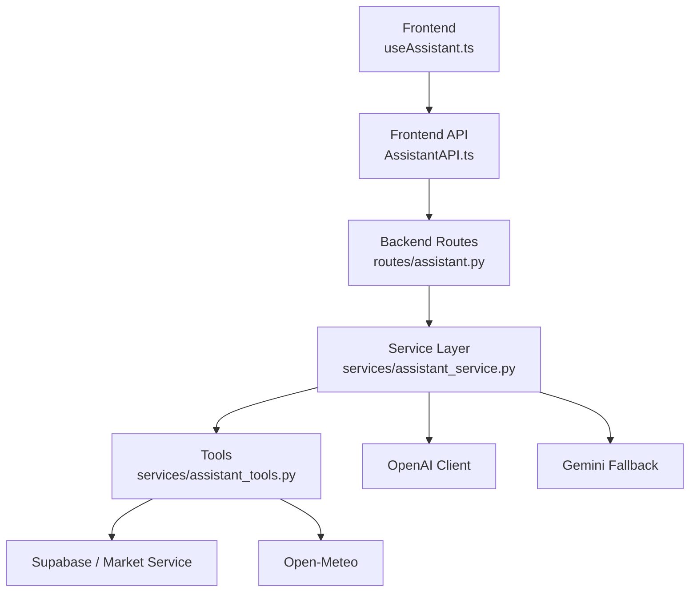
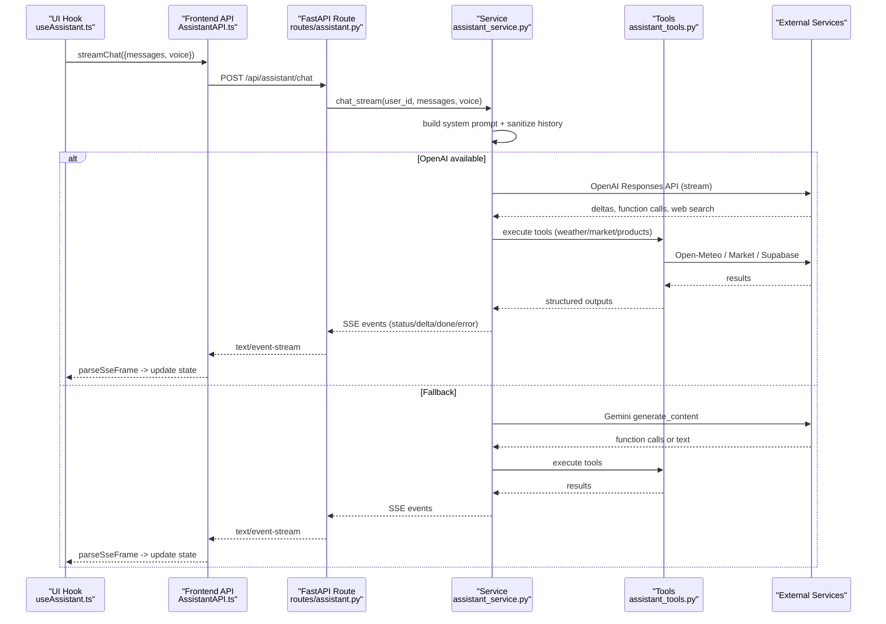
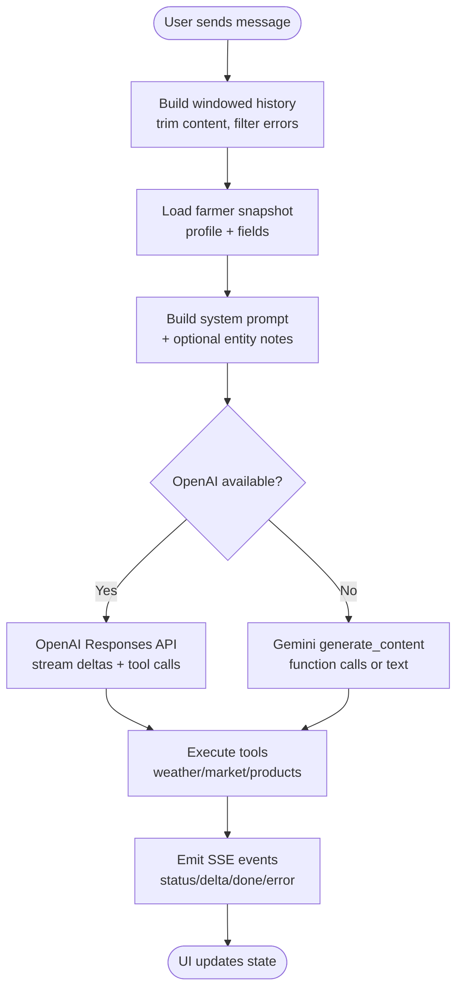
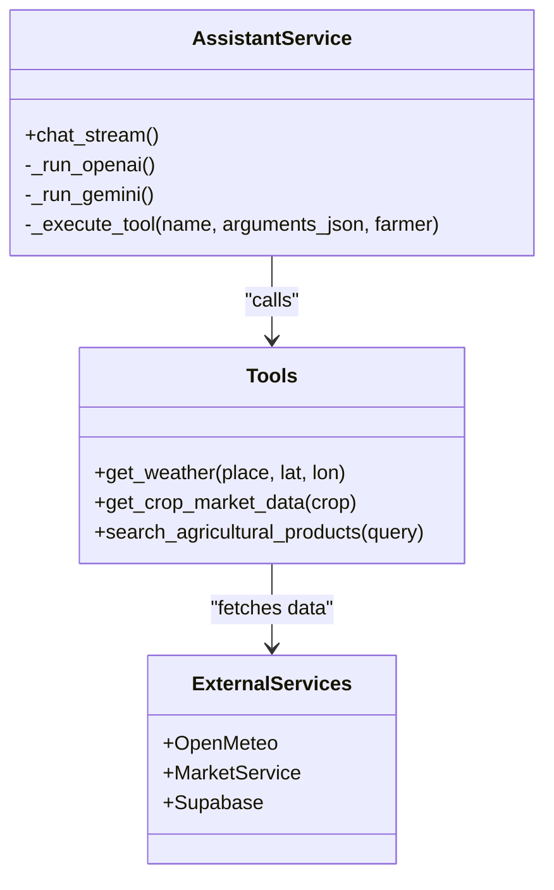
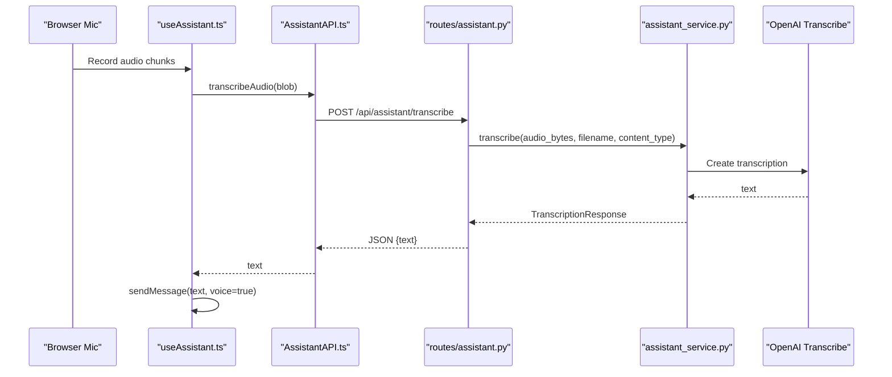
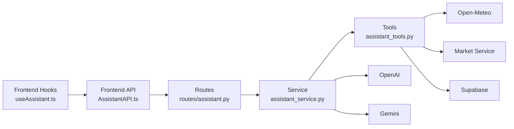

# OpenAI Assistant Integration

<cite>
**Referenced Files in This Document**
- [assistant.py](file://Backend/routes/assistant.py)
- [assistant_service.py](file://Backend/services/assistant_service.py)
- [assistant_tools.py](file://Backend/services/assistant_tools.py)
- [settings.py](file://Backend/config/settings.py)
- [schemas/assistant.py](file://Backend/schemas/assistant.py)
- [AssistantAPI.ts](file://Frontend/greenflora/services/AssistantAPI.ts)
- [useAssistant.ts](file://Frontend/greenflora/Hooks/useAssistant.ts)
- [AssistantPanel.tsx](file://Frontend/greenflora/components/assistant/AssistantPanel.tsx)
- [types/assistant.ts](file://Frontend/greenflora/types/assistant.ts)
</cite>

## Table of Contents
1. [Introduction](#introduction)
2. [Project Structure](#project-structure)
3. [Core Components](#core-components)
4. [Architecture Overview](#architecture-overview)
5. [Detailed Component Analysis](#detailed-component-analysis)
6. [Dependency Analysis](#dependency-analysis)
7. [Performance Considerations](#performance-considerations)
8. [Troubleshooting Guide](#troubleshooting-guide)
9. [Conclusion](#conclusion)
10. [Appendices](#appendices)

## Introduction
This document explains the Green Flora AI assistant integration that powers conversational AI for farmers. It focuses on:
- Conversation management: session handling, context maintenance, and message threading
- Tool calling: accessing real-time weather, market prices, and agricultural product data
- Speech-to-text pipeline: audio input, language handling (Urdu/English/mixed), and transcription reliability
- Response generation: streaming answers with status updates and provider fallbacks
- Configuration: model selection, timeouts, and system instructions
- Error handling: API failures, content filtering considerations, and conversation recovery
- Extensibility: adding new tools and customizing behavior for agricultural scenarios

The assistant uses a primary OpenAI provider for reasoning and tool use, with a Gemini fallback when transient errors occur. A speech layer provides transcription and text-to-speech to support voice-first interactions.

## Project Structure
The assistant spans backend routes, services, tools, configuration, and frontend hooks/APIs:
- Backend routes expose SSE chat, transcribe, speak, and greeting endpoints
- The service orchestrates providers, tools, speech, and error flows
- Tools encapsulate weather, market, and product data access
- Frontend manages state, streams events, records audio, and plays TTS



**Diagram sources**
- [assistant.py:68-112](file://Backend/routes/assistant.py#L68-L112)
- [assistant_service.py:175-287](file://Backend/services/assistant_service.py#L175-L287)
- [assistant_tools.py:220-319](file://Backend/services/assistant_tools.py#L220-L319)
- [AssistantAPI.ts:231-305](file://Frontend/greenflora/services/AssistantAPI.ts#L231-L305)
- [useAssistant.ts:285-455](file://Frontend/greenflora/Hooks/useAssistant.ts#L285-L455)

**Section sources**
- [assistant.py:1-208](file://Backend/routes/assistant.py#L1-L208)
- [assistant_service.py:1-926](file://Backend/services/assistant_service.py#L1-L926)
- [assistant_tools.py:1-576](file://Backend/services/assistant_tools.py#L1-L576)
- [settings.py:48-123](file://Backend/config/settings.py#L48-L123)
- [AssistantAPI.ts:1-386](file://Frontend/greenflora/services/AssistantAPI.ts#L1-L386)
- [useAssistant.ts:1-699](file://Frontend/greenflora/Hooks/useAssistant.ts#L1-L699)

## Core Components
- Streaming chat endpoint: POST /api/assistant/chat returns Server-Sent Events with status, delta, done, and error events
- Transcription endpoint: POST /api/assistant/transcribe accepts multipart audio and returns text
- Text-to-speech endpoint: POST /api/assistant/speak returns MP3 audio
- Dashboard greeting: GET /api/assistant/greeting returns localized greeting
- Service orchestration: provider selection, tool execution, entity extraction, and fallback logic
- Tools: weather via Open-Meteo, market via AMIS-backed service, products via Supabase
- Frontend hook: state machine for phases (listening, transcribing, thinking, generating, speaking)
- Frontend API: SSE parsing, timeouts, auth headers, and friendly errors

Key responsibilities:
- Keep routes thin; delegate validation and business logic to services
- Stream responses to keep UI responsive
- Provide robust fallbacks and graceful degradation
- Maintain farmer context across messages and tools
- Support voice-first workflows with minimal friction

**Section sources**
- [assistant.py:68-208](file://Backend/routes/assistant.py#L68-L208)
- [assistant_service.py:106-926](file://Backend/services/assistant_service.py#L106-L926)
- [assistant_tools.py:116-576](file://Backend/services/assistant_tools.py#L116-L576)
- [AssistantAPI.ts:137-386](file://Frontend/greenflora/services/AssistantAPI.ts#L137-L386)
- [useAssistant.ts:160-657](file://Frontend/greenflora/Hooks/useAssistant.ts#L160-L657)

## Architecture Overview
The assistant follows a layered architecture:
- Presentation: React components and hooks manage UI state and user interactions
- API layer: FastAPI routes validate inputs and stream SSE
- Service layer: Orchestrates providers, tools, and speech
- Data layer: Tools fetch from external APIs and databases
- Configuration: Centralized settings control models, timeouts, and feature flags



**Diagram sources**
- [assistant_service.py:175-287](file://Backend/services/assistant_service.py#L175-L287)
- [assistant_service.py:293-426](file://Backend/services/assistant_service.py#L293-L426)
- [assistant_service.py:431-541](file://Backend/services/assistant_service.py#L431-L541)
- [assistant_tools.py:220-319](file://Backend/services/assistant_tools.py#L220-L319)
- [AssistantAPI.ts:231-305](file://Frontend/greenflora/services/AssistantAPI.ts#L231-L305)
- [useAssistant.ts:285-455](file://Frontend/greenflora/Hooks/useAssistant.ts#L285-L455)

## Detailed Component Analysis

### Conversation Management and Context Maintenance
- Message threading: The frontend maintains a conversation window limited to a fixed number of recent messages to control context size and cost
- History sanitization: Messages are trimmed to character limits and filtered to exclude empty or errored assistant replies before sending
- Farmer context: Each request loads a snapshot of the farmer profile and fields once, used by both the system prompt and tools
- System prompt: Built from farmer context and optional voice-entity hints to improve accuracy for noisy transcriptions
- Provider strategy: Primary OpenAI streaming with Gemini fallback; if OpenAI fails mid-stream after emitting text, the UI shows an interruption error instead of restarting mid-sentence



**Diagram sources**
- [useAssistant.ts:285-455](file://Frontend/greenflora/Hooks/useAssistant.ts#L285-L455)
- [assistant_service.py:175-287](file://Backend/services/assistant_service.py#L175-L287)
- [assistant_service.py:293-426](file://Backend/services/assistant_service.py#L293-L426)
- [assistant_service.py:431-541](file://Backend/services/assistant_service.py#L431-L541)

**Section sources**
- [useAssistant.ts:285-455](file://Frontend/greenflora/Hooks/useAssistant.ts#L285-L455)
- [assistant_service.py:175-287](file://Backend/services/assistant_service.py#L175-L287)
- [assistant_tools.py:116-187](file://Backend/services/assistant_tools.py#L116-L187)

### Tool Calling Mechanism
- Tool definitions: Provider-neutral descriptions converted into OpenAI function tools and Gemini function declarations
- Execution flow: When the model requests tools, the service executes them, appends results back into the conversation, and continues until no more tools are requested or budget is exhausted
- Weather tool: Uses Open-Meteo geocoding and forecast endpoints; supports place names and farmer’s saved farm coordinates; returns current conditions and 7-day forecast
- Market tool: Normalizes crop names (including Urdu/Roman-Urdu aliases), matches AMIS commodities, and returns price overview, trend summary, and per-market comparisons
- Product tool: Searches agricultural products dataset by problem/crop/category keywords; returns brands, dosages, and price ranges



**Diagram sources**
- [assistant_service.py:556-585](file://Backend/services/assistant_service.py#L556-L585)
- [assistant_tools.py:220-319](file://Backend/services/assistant_tools.py#L220-L319)
- [assistant_tools.py:361-428](file://Backend/services/assistant_tools.py#L361-L428)
- [assistant_tools.py:435-508](file://Backend/services/assistant_tools.py#L435-L508)

**Section sources**
- [assistant_service.py:293-426](file://Backend/services/assistant_service.py#L293-L426)
- [assistant_service.py:431-541](file://Backend/services/assistant_service.py#L431-L541)
- [assistant_tools.py:518-576](file://Backend/services/assistant_tools.py#L518-L576)

### Speech-to-Text Processing Pipeline
- Audio capture: Frontend uses MediaRecorder to record audio in supported formats (webm/mp4)
- Upload and validation: Multipart upload to /api/assistant/transcribe with size and MIME checks
- Transcription: OpenAI audio transcription model handles Urdu/English/mixed speech; returns cleaned text
- Entity extraction: Optional structured output from utility model extracts farming entities (crops, location, market, date/time references, activities, diseases, intents) to improve main model responses
- Error handling: Friendly messages for timeouts, empty recordings, and unsupported formats; never blocks typing experience



**Diagram sources**
- [useAssistant.ts:457-556](file://Frontend/greenflora/Hooks/useAssistant.ts#L457-L556)
- [AssistantAPI.ts:315-346](file://Frontend/greenflora/services/AssistantAPI.ts#L315-L346)
- [assistant.py:119-143](file://Backend/routes/assistant.py#L119-L143)
- [assistant_service.py:591-633](file://Backend/services/assistant_service.py#L591-L633)

**Section sources**
- [assistant.py:119-143](file://Backend/routes/assistant.py#L119-L143)
- [assistant_service.py:591-633](file://Backend/services/assistant_service.py#L591-L633)
- [assistant_service.py:737-800](file://Backend/services/assistant_service.py#L737-L800)
- [AssistantAPI.ts:315-346](file://Frontend/greenflora/services/AssistantAPI.ts#L315-L346)
- [useAssistant.ts:457-556](file://Frontend/greenflora/Hooks/useAssistant.ts#L457-L556)

### Response Generation and Streaming
- SSE events: Status (thinking/searching/tool/connecting_backup), delta (text chunks), done (provider/tools_used/web_search), error (message/retryable)
- Link stripping: Intermediate buffer removes Markdown links and citation markers to prevent leaking URLs in streamed text
- Provider fallback: If OpenAI fails transiently and no text has been emitted, switch to Gemini; otherwise surface interruption error
- Completion: Final metadata includes provider name, tools used, and whether web search was engaged

```mermaid
sequenceDiagram
participant UI as "useAssistant.ts"
participant API as "AssistantAPI.ts"
participant Route as "routes/assistant.py"
participant Svc as "assistant_service.py"
UI->>API : streamChat({messages, voice})
API->>Route : POST /api/assistant/chat
Route->>Svc : chat_stream(...)
loop For each SSE frame
Svc-->>Route : event {type, ...}
Route-->>API : event frame
API-->>UI : parseSseFrame -> update phase/state
end
Note over UI,Svc : Delta events append text; status updates show progress; done marks completion
```

**Diagram sources**
- [assistant_service.py:129-170](file://Backend/services/assistant_service.py#L129-L170)
- [assistant_service.py:175-287](file://Backend/services/assistant_service.py#L175-L287)
- [AssistantAPI.ts:161-220](file://Frontend/greenflora/services/AssistantAPI.ts#L161-L220)
- [useAssistant.ts:360-411](file://Frontend/greenflora/Hooks/useAssistant.ts#L360-L411)

**Section sources**
- [assistant_service.py:129-170](file://Backend/services/assistant_service.py#L129-L170)
- [assistant_service.py:175-287](file://Backend/services/assistant_service.py#L175-L287)
- [AssistantAPI.ts:161-220](file://Frontend/greenflora/services/AssistantAPI.ts#L161-L220)
- [useAssistant.ts:360-411](file://Frontend/greenflora/Hooks/useAssistant.ts#L360-L411)

### Assistant Configuration Options
- Models: Main reasoning model, utility model for entity extraction and greetings, transcription model, TTS model, and fallback model
- Timeouts: Streaming timeout for chat and audio timeout for transcription/TTS
- Demo mode: Enables demo data when database or external services are unavailable
- CORS: Configurable origins for development
- Keys: OpenAI and Gemini keys loaded from environment variables

Configuration impacts:
- Model selection affects capabilities and costs
- Timeouts influence responsiveness and retry behavior
- Demo mode allows local testing without external dependencies

**Section sources**
- [settings.py:48-123](file://Backend/config/settings.py#L48-L123)

### Error Handling Strategies
- API failures: Transient errors trigger fallback to Gemini; non-transient errors return friendly messages with retry flags
- Content filtering: Not explicitly implemented; ensure prompts and tool outputs avoid sensitive content; consider adding filters if required
- Conversation state recovery: Frontend retains partial streamed text; errors attach to messages with retry actions; clear conversation resets state
- Voice failures: TTS failures do not break text replies; transcription failures show notices but allow typing

**Section sources**
- [assistant_service.py:228-287](file://Backend/services/assistant_service.py#L228-L287)
- [assistant_service.py:556-585](file://Backend/services/assistant_service.py#L556-L585)
- [assistant.py:91-102](file://Backend/routes/assistant.py#L91-L102)
- [useAssistant.ts:416-455](file://Frontend/greenflora/Hooks/useAssistant.ts#L416-L455)

### Extending the Assistant with New Tools
To add a new tool:
1. Define tool schema in tool definitions with name, description, and parameters
2. Implement tool function in assistant_tools with error handling and “unavailable” payloads for missing data
3. Add routing in assistant_service._execute_tool to call the new function
4. Update labels for status display if needed
5. Test with OpenAI and Gemini flows to ensure function calling works

Best practices:
- Return explicit “available: false” when data is missing
- Sanitize inputs to prevent injection or malformed queries
- Log exceptions and provide farmer-friendly messages
- Limit result sizes to control context and performance

**Section sources**
- [assistant_tools.py:518-576](file://Backend/services/assistant_tools.py#L518-L576)
- [assistant_service.py:556-585](file://Backend/services/assistant_service.py#L556-L585)

### Customizing Response Behavior for Agricultural Scenarios
- System prompt: Include farmer context, soil type, irrigation method, current crop stage, and budget to tailor advice
- Entity extraction: Use structured output to detect crops, locations, markets, dates, activities, and diseases from voice input
- Tool hints: Encourage model to prefer internal tools over web search when sufficient data exists
- Language: Respect preferred language and script; maintain exact language in TTS instructions

**Section sources**
- [assistant_tools.py:140-187](file://Backend/services/assistant_tools.py#L140-L187)
- [assistant_service.py:205-221](file://Backend/services/assistant_service.py#L205-L221)
- [assistant_service.py:65-69](file://Backend/services/assistant_service.py#L65-L69)

## Dependency Analysis
The assistant integrates multiple layers and external services:
- Frontend depends on hooks and API utilities for state and networking
- Routes depend on schemas for validation and services for logic
- Service depends on tools and providers (OpenAI/Gemini)
- Tools depend on external APIs (Open-Meteo, Market Service, Supabase)



**Diagram sources**
- [useAssistant.ts:285-455](file://Frontend/greenflora/Hooks/useAssistant.ts#L285-L455)
- [AssistantAPI.ts:231-305](file://Frontend/greenflora/services/AssistantAPI.ts#L231-L305)
- [assistant.py:68-112](file://Backend/routes/assistant.py#L68-L112)
- [assistant_service.py:175-287](file://Backend/services/assistant_service.py#L175-L287)
- [assistant_tools.py:220-319](file://Backend/services/assistant_tools.py#L220-L319)

**Section sources**
- [assistant_service.py:106-128](file://Backend/services/assistant_service.py#L106-L128)
- [assistant_tools.py:23-43](file://Backend/services/assistant_tools.py#L23-L43)

## Performance Considerations
- Context window: Limit conversation history to reduce token usage and latency
- Tool budget: Cap tool-call rounds to prevent excessive loops and ensure timely responses
- Streaming: Use SSE to render incremental text and status updates for better perceived performance
- Caching: Cache greetings to reduce unnecessary AI calls
- Timeouts: Configure appropriate timeouts for streaming and audio endpoints
- Result limits: Restrict number of markets, products, and crops returned to control payload size

[No sources needed since this section provides general guidance]

## Troubleshooting Guide
Common issues and resolutions:
- No response or interrupted stream: Check network connectivity; retry action available on error messages; partial text preserved
- Transcription failures: Ensure microphone permissions; verify audio format and size; retry with shorter recordings
- TTS unavailability: Voice reply disabled gracefully; text remains visible; check server availability
- Tool failures: Tools return “unavailable” messages; model instructed to avoid fabricating data; retry later
- Provider fallback: If OpenAI fails transiently, Gemini takes over; monitor status events for “connecting_backup”

**Section sources**
- [assistant_service.py:228-287](file://Backend/services/assistant_service.py#L228-L287)
- [assistant_service.py:591-633](file://Backend/services/assistant_service.py#L591-L633)
- [assistant_service.py:635-678](file://Backend/services/assistant_service.py#L635-L678)
- [assistant.py:91-102](file://Backend/routes/assistant.py#L91-L102)
- [useAssistant.ts:416-455](file://Frontend/greenflora/Hooks/useAssistant.ts#L416-L455)

## Conclusion
The Green Flora AI assistant provides a robust, voice-enabled conversational interface tailored for agricultural scenarios. It combines streaming responses, multi-provider resilience, and rich tool integrations to deliver accurate, contextual advice. With careful configuration, extensible tools, and comprehensive error handling, it scales to diverse farming needs while maintaining reliability and user experience.

[No sources needed since this section summarizes without analyzing specific files]

## Appendices

### API Endpoints Summary
- POST /api/assistant/chat: Streams assistant replies via SSE
- POST /api/assistant/transcribe: Transcribes audio to text
- POST /api/assistant/speak: Generates MP3 audio from text
- GET /api/assistant/greeting: Returns localized dashboard greeting

**Section sources**
- [assistant.py:68-208](file://Backend/routes/assistant.py#L68-L208)
- [schemas/assistant.py:14-56](file://Backend/schemas/assistant.py#L14-L56)

### Frontend Types and Events
- AssistantChatMessage: Role and content for conversation turns
- AssistantEvent: Union of status, delta, done, and error events
- AssistantVoice: Supported TTS voices
- AssistantStatusState: Progress states for UI feedback

**Section sources**
- [types/assistant.ts:9-107](file://Frontend/greenflora/types/assistant.ts#L9-L107)