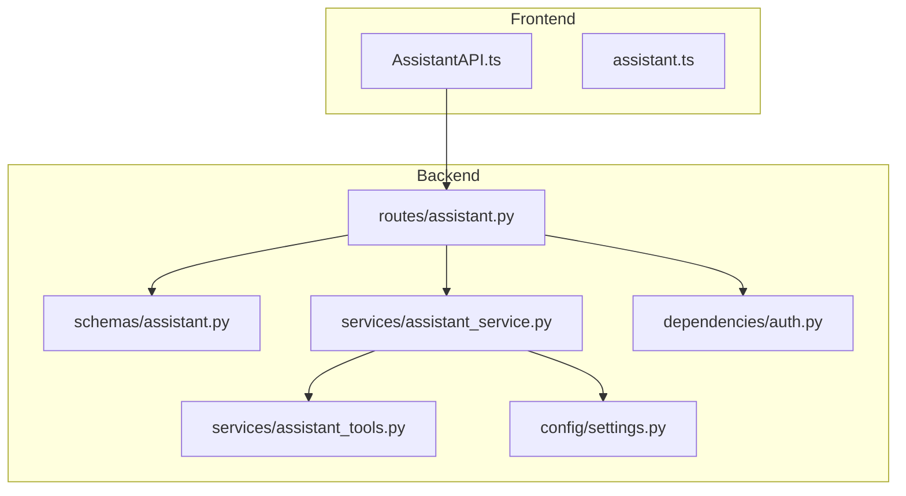
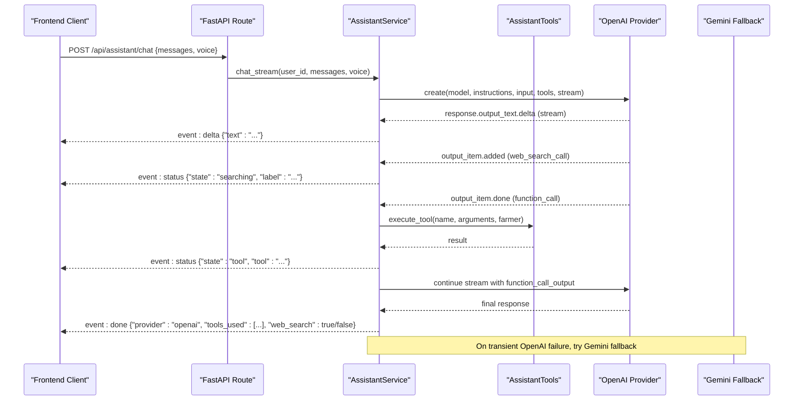
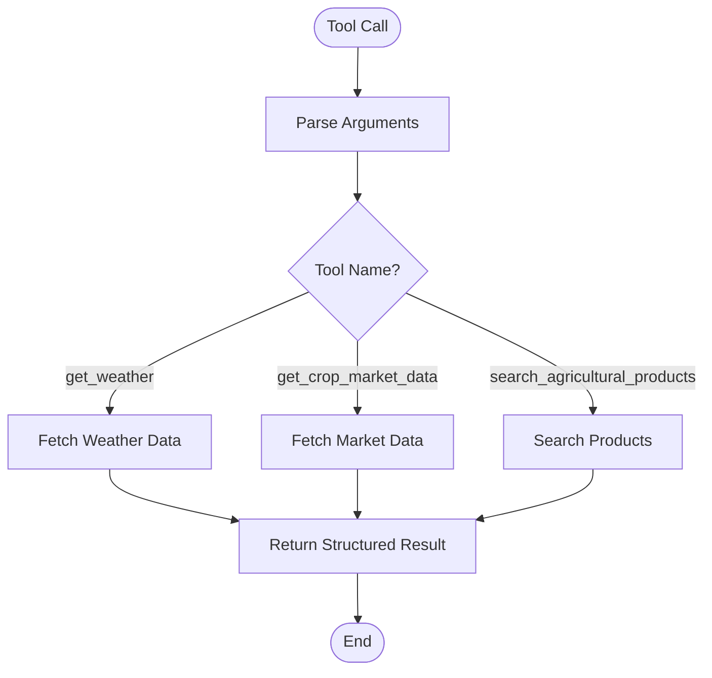
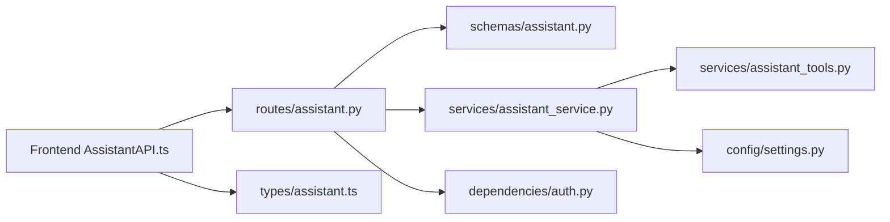

# Assistant API

<cite>
**Referenced Files in This Document**
- [assistant.py](file://Backend/routes/assistant.py)
- [assistant_service.py](file://Backend/services/assistant_service.py)
- [assistant_tools.py](file://Backend/services/assistant_tools.py)
- [settings.py](file://Backend/config/settings.py)
- [auth.py](file://Backend/dependencies/auth.py)
- [assistant_schemas.py](file://Backend/schemas/assistant.py)
- [AssistantAPI.ts](file://Frontend/greenflora/services/AssistantAPI.ts)
- [assistant_types.ts](file://Frontend/greenflora/types/assistant.ts)
</cite>

## Table of Contents
1. [Introduction](#introduction)
2. [Project Structure](#project-structure)
3. [Core Components](#core-components)
4. [Architecture Overview](#architecture-overview)
5. [Detailed Component Analysis](#detailed-component-analysis)
6. [Dependency Analysis](#dependency-analysis)
7. [Performance Considerations](#performance-considerations)
8. [Troubleshooting Guide](#troubleshooting-guide)
9. [Conclusion](#conclusion)
10. [Appendices](#appendices)

## Introduction
This document provides detailed API documentation for Green-Flora’s conversational assistant endpoints that power AI-driven agricultural advice and voice interactions. It covers:
- HTTP methods to initiate conversations, send messages, receive streamed responses, and manage conversation context
- Request/response schemas for chat, transcription (speech-to-text), text-to-speech, and dashboard greeting
- Integration with OpenAI models for reasoning, tool calling, web search, speech-to-text, and text-to-speech
- Multi-language support for Urdu and English
- Authentication, conversation state management, error handling, rate limiting considerations, and troubleshooting guidance

The assistant uses a primary OpenAI provider for streaming chat with function tools and web search, and a Gemini fallback when OpenAI experiences transient failures. Voice features use dedicated OpenAI audio models.

## Project Structure
The assistant feature spans backend routes, services, schemas, configuration, authentication dependencies, and frontend client integration.

**Diagram sources**
- [assistant.py:1-208](file://Backend/routes/assistant.py#L1-L208)
- [assistant_service.py:1-926](file://Backend/services/assistant_service.py#L1-L926)
- [assistant_tools.py:1-576](file://Backend/services/assistant_tools.py#L1-L576)
- [settings.py:1-123](file://Backend/config/settings.py#L1-L123)
- [auth.py:1-101](file://Backend/dependencies/auth.py#L1-L101)
- [AssistantAPI.ts:1-386](file://Frontend/greenflora/services/AssistantAPI.ts#L1-L386)
- [assistant_types.ts:1-107](file://Frontend/greenflora/types/assistant.ts#L1-L107)

**Section sources**
- [assistant.py:1-208](file://Backend/routes/assistant.py#L1-L208)
- [assistant_service.py:1-926](file://Backend/services/assistant_service.py#L1-L926)
- [assistant_tools.py:1-576](file://Backend/services/assistant_tools.py#L1-L576)
- [settings.py:1-123](file://Backend/config/settings.py#L1-L123)
- [auth.py:1-101](file://Backend/dependencies/auth.py#L1-L101)
- [AssistantAPI.ts:1-386](file://Frontend/greenflora/services/AssistantAPI.ts#L1-L386)
- [assistant_types.ts:1-107](file://Frontend/greenflora/types/assistant.ts#L1-L107)

## Core Components
- Routes: Define REST endpoints for chat (SSE stream), transcribe (audio upload), speak (TTS MP3), and greeting (localized dashboard greeting).
- Service: Orchestrates AI providers (OpenAI primary, Gemini fallback), manages tool calls, handles streaming events, and integrates speech modules.
- Tools: Provide weather, market data, and product search capabilities; include localization helpers for crop names and robust error handling.
- Schemas: Define request/response shapes for chat, transcription, TTS, and greeting.
- Frontend Client: Implements SSE parsing, streaming chat, audio transcription, and TTS playback with friendly errors and timeouts.

Key responsibilities:
- Route layer validates input via Pydantic schemas and delegates to the service layer.
- Service layer implements provider strategy, tool execution, and SSE event emission.
- Tool layer ensures data integrity by returning explicit “unavailable” payloads when data is missing.
- Frontend client handles streaming events, user feedback, and error classification.

**Section sources**
- [assistant.py:1-208](file://Backend/routes/assistant.py#L1-L208)
- [assistant_service.py:1-926](file://Backend/services/assistant_service.py#L1-L926)
- [assistant_tools.py:1-576](file://Backend/services/assistant_tools.py#L1-L576)
- [assistant_schemas.py:1-56](file://Backend/schemas/assistant.py#L1-L56)
- [AssistantAPI.ts:1-386](file://Frontend/greenflora/services/AssistantAPI.ts#L1-L386)

## Architecture Overview
The assistant architecture follows a layered approach:
- HTTP routes expose endpoints and handle authentication and validation.
- The service orchestrates AI providers and tools, emitting SSE events for real-time UI updates.
- Tools fetch external or internal data (weather, markets, products) and return structured results.
- Frontend consumes SSE streams and renders status, deltas, and completion metadata.

**Diagram sources**
- [assistant.py:68-112](file://Backend/routes/assistant.py#L68-L112)
- [assistant_service.py:175-287](file://Backend/services/assistant_service.py#L175-L287)
- [assistant_service.py:293-425](file://Backend/services/assistant_service.py#L293-L425)
- [assistant_service.py:431-540](file://Backend/services/assistant_service.py#L431-L540)
- [assistant_tools.py:518-575](file://Backend/services/assistant_tools.py#L518-L575)

## Detailed Component Analysis

### Chat Endpoint (POST /api/assistant/chat)
- Purpose: Stream an assistant reply using Server-Sent Events.
- Request body:
  - messages: list of conversation turns with role and content
  - voice: boolean indicating if the newest message came from speech
- Response: Streaming text/event-stream with events:
  - status: thinking/searching/tool/connecting_backup with labels
  - delta: incremental answer text chunks
  - done: final metadata including provider, tools used, and web search usage
  - error: friendly message with retryable flag
- Authentication: Bearer token required unless demo mode is enabled.
- Provider strategy:
  - Primary: OpenAI Responses API with function tools and web search
  - Fallback: Gemini with Google Search grounding when OpenAI fails transiently
- Conversation context:
  - Sanitized messages with history limits
  - Farmer snapshot loaded once per request for system prompt and tools
  - Optional entity extraction for voice inputs to improve understanding

Example call:
- Send a question about wheat prices in Lahore with voice=true to enable entity hints.
- Receive status events for thinking/searching/tool, then delta chunks, and finally done with provider and tools_used.

**Section sources**
- [assistant.py:68-112](file://Backend/routes/assistant.py#L68-L112)
- [assistant_service.py:175-287](file://Backend/services/assistant_service.py#L175-L287)
- [assistant_service.py:293-425](file://Backend/services/assistant_service.py#L293-L425)
- [assistant_service.py:431-540](file://Backend/services/assistant_service.py#L431-L540)
- [assistant_schemas.py:14-31](file://Backend/schemas/assistant.py#L14-L31)
- [assistant_types.ts:9-21](file://Frontend/greenflora/types/assistant.ts#L9-L21)
- [AssistantAPI.ts:146-305](file://Frontend/greenflora/services/AssistantAPI.ts#L146-L305)

### Transcription Endpoint (POST /api/assistant/transcribe)
- Purpose: Convert recorded speech (Urdu/English/mixed) to text.
- Request: multipart/form-data with file field containing audio (webm/mp3/mp4/wav).
- Response: JSON with text field containing transcribed text.
- Validation:
  - Audio size limit enforced
  - MIME type inferred from filename if not provided
  - Empty or invalid audio raises friendly errors
- Authentication: Bearer token required unless demo mode is enabled.

Example call:
- Upload a short voice recording asking about irrigation schedules for cotton.
- Receive transcribed text to append to conversation history.

**Section sources**
- [assistant.py:119-143](file://Backend/routes/assistant.py#L119-L143)
- [assistant_service.py:591-633](file://Backend/services/assistant_service.py#L591-L633)
- [assistant_schemas.py:34-37](file://Backend/schemas/assistant.py#L34-L37)
- [assistant_types.ts:23-26](file://Frontend/greenflora/types/assistant.ts#L23-L26)
- [AssistantAPI.ts:315-346](file://Frontend/greenflora/services/AssistantAPI.ts#L315-L346)

### Text-to-Speech Endpoint (POST /api/assistant/speak)
- Purpose: Render text to MP3 audio for voice replies.
- Request body:
  - text: string to be spoken
  - voice: optional voice selection among supported voices
- Response: audio/mpeg blob containing MP3 audio.
- Constraints:
  - Text length capped
  - Voice validated against supported set
  - Friendly errors on failure without breaking text experience

Example call:
- Request TTS for the latest assistant answer with voice="alloy".
- Play returned MP3 blob in the frontend.

**Section sources**
- [assistant.py:150-173](file://Backend/routes/assistant.py#L150-L173)
- [assistant_service.py:635-677](file://Backend/services/assistant_service.py#L635-L677)
- [assistant_schemas.py:40-47](file://Backend/schemas/assistant.py#L40-L47)
- [assistant_types.ts:28-41](file://Frontend/greenflora/types/assistant.ts#L28-L41)
- [AssistantAPI.ts:357-385](file://Frontend/greenflora/services/AssistantAPI.ts#L357-L385)

### Greeting Endpoint (GET /api/assistant/greeting)
- Purpose: Return a localized, time-of-day greeting for the dashboard hero.
- Response:
  - greeting: short welcome message
  - language: "en" or "ur"
  - time_of_day: "morning", "afternoon", or "evening"
- Behavior:
  - Uses farmer profile preferences when available
  - Falls back to hardcoded greetings if AI generation fails
  - Never blocks dashboard loading

Example call:
- Fetch greeting on dashboard load to display personalized welcome.

**Section sources**
- [assistant.py:180-208](file://Backend/routes/assistant.py#L180-L208)
- [assistant_service.py:683-735](file://Backend/services/assistant_service.py#L683-L735)
- [assistant_schemas.py:50-55](file://Backend/schemas/assistant.py#L50-L55)
- [assistant_types.ts:43-48](file://Frontend/greenflora/types/assistant.ts#L43-L48)

### Tool Integrations
The assistant can call integrated tools during conversation:
- Weather: Current conditions and 7-day forecast using Open-Meteo
- Market data: Latest AMIS mandi prices with trends and comparisons
- Product search: Agricultural products dataset queries for pests, diseases, crops

Tool definitions are provider-neutral and converted to OpenAI function tools and Gemini function declarations. Each tool returns structured data with availability flags and messages when data is missing.

**Diagram sources**
- [assistant_service.py:556-585](file://Backend/services/assistant_service.py#L556-L585)
- [assistant_tools.py:220-319](file://Backend/services/assistant_tools.py#L220-L319)
- [assistant_tools.py:361-428](file://Backend/services/assistant_tools.py#L361-L428)
- [assistant_tools.py:435-508](file://Backend/services/assistant_tools.py#L435-L508)

**Section sources**
- [assistant_tools.py:518-575](file://Backend/services/assistant_tools.py#L518-L575)
- [assistant_service.py:556-585](file://Backend/services/assistant_service.py#L556-L585)

## Dependency Analysis
The assistant has clear separation between routes, services, tools, and configuration:
- Routes depend on schemas for validation and services for business logic
- Services depend on tools for data access and settings for model configuration
- Authentication dependency provides optional user resolution based on demo mode
- Frontend client depends on types for compile-time safety and consistent API usage

**Diagram sources**
- [assistant.py:1-208](file://Backend/routes/assistant.py#L1-L208)
- [assistant_service.py:1-926](file://Backend/services/assistant_service.py#L1-L926)
- [assistant_tools.py:1-576](file://Backend/services/assistant_tools.py#L1-L576)
- [settings.py:1-123](file://Backend/config/settings.py#L1-L123)
- [auth.py:1-101](file://Backend/dependencies/auth.py#L1-L101)
- [AssistantAPI.ts:1-386](file://Frontend/greenflora/services/AssistantAPI.ts#L1-L386)
- [assistant_types.ts:1-107](file://Frontend/greenflora/types/assistant.ts#L1-L107)

**Section sources**
- [assistant.py:1-208](file://Backend/routes/assistant.py#L1-L208)
- [assistant_service.py:1-926](file://Backend/services/assistant_service.py#L1-L926)
- [assistant_tools.py:1-576](file://Backend/services/assistant_tools.py#L1-L576)
- [settings.py:1-123](file://Backend/config/settings.py#L1-L123)
- [auth.py:1-101](file://Backend/dependencies/auth.py#L1-L101)
- [AssistantAPI.ts:1-386](file://Frontend/greenflora/services/AssistantAPI.ts#L1-L386)
- [assistant_types.ts:1-107](file://Frontend/greenflora/types/assistant.ts#L1-L107)

## Performance Considerations
- Streaming efficiency: SSE streaming reduces perceived latency and enables progressive rendering
- Tool budget: Limited tool-call rounds prevent excessive API calls and maintain responsiveness
- Context limits: Message history is truncated to avoid overwhelming the model
- Caching: Dashboard greeting uses short-term caching to reduce AI calls
- Timeouts: Configurable timeouts for streaming and audio operations balance responsiveness and reliability
- Provider fallback: Automatic fallback to Gemini minimizes downtime impact
- Data integrity: Tools return explicit unavailable states rather than fabricated data

Recommendations:
- Monitor tool usage patterns to optimize query parameters
- Adjust timeout values based on network conditions and expected tool complexity
- Implement client-side retry logic for transient errors marked as retryable
- Cache frequently accessed data at the application layer where appropriate

[No sources needed since this section provides general guidance]

## Troubleshooting Guide
Common issues and resolutions:
- Authentication failures: Ensure valid Bearer token is included in requests; check token expiration
- Network timeouts: Verify connectivity and adjust timeout settings; implement retry logic
- Model unavailability: Check environment configuration for API keys; verify provider status
- Tool failures: Inspect tool-specific errors; ensure required data (like farm location) is configured
- Speech processing issues: Validate audio format and size; check microphone permissions

Error handling patterns:
- Service layer raises friendly AssistantError exceptions for user-facing messages
- Routes convert service errors to appropriate HTTP status codes
- Frontend classifies errors into categories (network, timeout, validation, server, auth)
- SSE streams emit error events with retryable flags for graceful recovery

**Section sources**
- [assistant_service.py:93-99](file://Backend/services/assistant_service.py#L93-L99)
- [assistant_service.py:188-203](file://Backend/services/assistant_service.py#L188-L203)
- [assistant_service.py:235-287](file://Backend/services/assistant_service.py#L235-L287)
- [assistant_service.py:591-633](file://Backend/services/assistant_service.py#L591-L633)
- [assistant_service.py:635-677](file://Backend/services/assistant_service.py#L635-L677)
- [assistant.py:134-141](file://Backend/routes/assistant.py#L134-L141)
- [assistant.py:160-167](file://Backend/routes/assistant.py#L160-L167)
- [AssistantAPI.ts:30-93](file://Frontend/greenflora/services/AssistantAPI.ts#L30-L93)

## Conclusion
Green-Flora’s Assistant API provides a robust foundation for AI-powered agricultural advice with voice interaction capabilities. The architecture separates concerns effectively, supports multiple AI providers, and includes comprehensive error handling. The streaming approach enhances user experience while maintaining performance through careful resource management and provider fallbacks.

Key strengths:
- Multi-provider strategy ensures reliability
- Rich tool integrations provide actionable agricultural insights
- Voice support enables accessibility for diverse users
- Comprehensive error handling and monitoring capabilities
- Clean separation between presentation, business logic, and data access

Future enhancements could include additional language support, expanded tool catalog, and advanced analytics for conversation patterns.

[No sources needed since this section summarizes without analyzing specific files]

## Appendices

### Authentication Requirements
- Bearer token authentication via Authorization header
- Demo mode allows unauthenticated access for development
- Optional user resolution enables flexible deployment scenarios
- Token validation through Supabase Auth service

### Conversation State Management
- Messages array maintains conversation history with role/content structure
- Farmer context loaded once per request for system prompt and tools
- Entity extraction enhances voice input understanding
- Tool usage tracked for transparency and debugging

### Rate Limiting Considerations
- Provider-specific rate limits apply (OpenAI, Gemini)
- Tool budget prevents excessive API calls within single conversation
- Timeout configurations balance responsiveness and reliability
- Client-side retry logic should respect provider rate limits

### Multi-Language Support
- Urdu and English supported throughout the assistant
- Crop name normalization handles Urdu/Roman-Urdu variations
- Greeting personalization based on farmer preferences
- Voice transcription supports mixed language inputs

**Section sources**
- [auth.py:36-101](file://Backend/dependencies/auth.py#L36-L101)
- [assistant_service.py:196-221](file://Backend/services/assistant_service.py#L196-L221)
- [assistant_service.py:787-800](file://Backend/services/assistant_service.py#L787-L800)
- [assistant_tools.py:50-88](file://Backend/services/assistant_tools.py#L50-L88)
- [settings.py:87-114](file://Backend/config/settings.py#L87-L114)