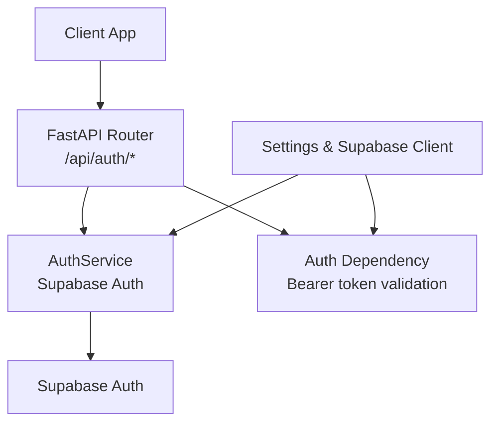
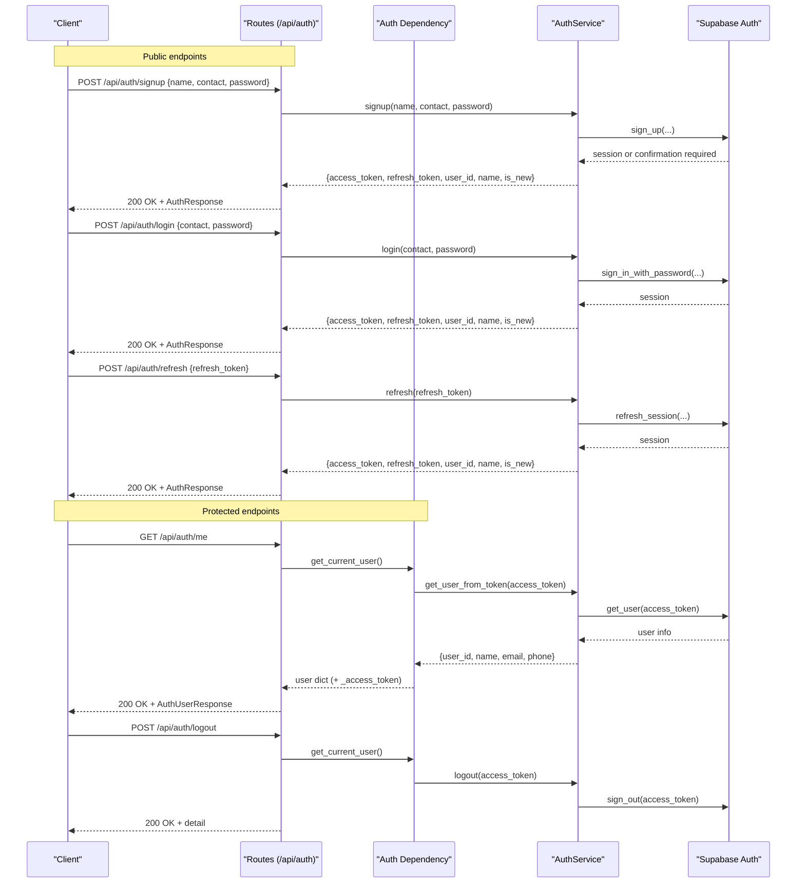
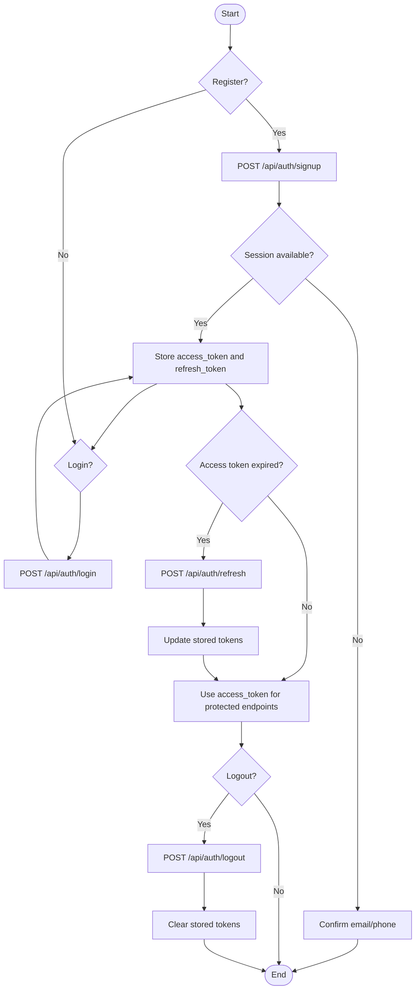
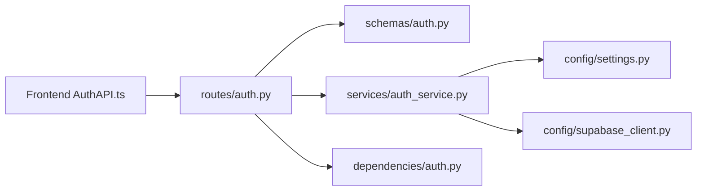

# Authentication API

<cite>
**Referenced Files in This Document**
- [main.py](file://Backend/main.py)
- [auth.py](file://Backend/routes/auth.py)
- [auth.py](file://Backend/schemas/auth.py)
- [auth_service.py](file://Backend/services/auth_service.py)
- [auth.py](file://Backend/dependencies/auth.py)
- [settings.py](file://Backend/config/settings.py)
- [supabase_client.py](file://Backend/config/supabase_client.py)
- [AuthAPI.ts](file://Frontend/greenflora/services/AuthAPI.ts)
- [auth.ts](file://Frontend/greenflora/types/auth.ts)
</cite>

## Table of Contents
1. [Introduction](#introduction)
2. [Project Structure](#project-structure)
3. [Core Components](#core-components)
4. [Architecture Overview](#architecture-overview)
5. [Detailed Component Analysis](#detailed-component-analysis)
6. [Dependency Analysis](#dependency-analysis)
7. [Performance Considerations](#performance-considerations)
8. [Troubleshooting Guide](#troubleshooting-guide)
9. [Conclusion](#conclusion)
10. [Appendices](#appendices)

## Introduction
This document provides comprehensive API documentation for Green-Flora’s authentication endpoints focused on user account management and session handling. It covers:
- POST /api/auth/signup: new user registration
- POST /api/auth/login: user authentication
- POST /api/auth/refresh: token refresh
- POST /api/auth/logout: session termination (protected)
- GET /api/auth/me: current user information retrieval (protected)

It also documents request/response schemas, validation rules, error responses, the authentication flow, JWT token management, security considerations, example requests, common use cases, and troubleshooting guidance.

## Project Structure
The authentication feature is implemented across several backend modules and a frontend client:
- Routes define HTTP endpoints under /api/auth
- Schemas define request/response models and validation
- Services implement business logic using Supabase Auth
- Dependencies provide reusable auth middleware for protected routes
- Configuration centralizes environment variables and Supabase client setup
- Frontend service encapsulates calls to these endpoints and manages tokens

**Diagram sources**
- [auth.py:1-132](file://Backend/routes/auth.py#L1-L132)
- [auth_service.py:1-193](file://Backend/services/auth_service.py#L1-L193)
- [auth.py:1-101](file://Backend/dependencies/auth.py#L1-L101)
- [settings.py:1-123](file://Backend/config/settings.py#L1-L123)
- [supabase_client.py:1-47](file://Backend/config/supabase_client.py#L1-L47)

**Section sources**
- [main.py:1-57](file://Backend/main.py#L1-L57)
- [auth.py:1-132](file://Backend/routes/auth.py#L1-L132)

## Core Components
- Routes: Define endpoints, validate input via Pydantic schemas, delegate to AuthService, and return standardized responses.
- Schemas: Define request payloads and response shapes with validation rules.
- Services: Encapsulate Supabase Auth operations (signup, login, refresh, logout, get_user_from_token).
- Dependencies: Provide FastAPI dependencies to enforce authentication on protected routes by validating Bearer tokens.
- Configuration: Centralize environment settings and initialize the Supabase client.
- Frontend: A TypeScript service that calls the backend endpoints, persists tokens, and handles errors.

Key responsibilities:
- Input validation and normalization at the schema layer
- Business logic and external integration in the service layer
- Reusable auth enforcement in dependencies
- Clear separation between public and protected endpoints

**Section sources**
- [auth.py:1-132](file://Backend/routes/auth.py#L1-L132)
- [auth.py:1-100](file://Backend/schemas/auth.py#L1-L100)
- [auth_service.py:1-193](file://Backend/services/auth_service.py#L1-L193)
- [auth.py:1-101](file://Backend/dependencies/auth.py#L1-L101)
- [settings.py:1-123](file://Backend/config/settings.py#L1-L123)
- [supabase_client.py:1-47](file://Backend/config/supabase_client.py#L1-L47)
- [AuthAPI.ts:1-179](file://Frontend/greenflora/services/AuthAPI.ts#L1-L179)
- [auth.ts:1-36](file://Frontend/greenflora/types/auth.ts#L1-L36)

## Architecture Overview
Authentication flows are handled as follows:
- Public endpoints (/signup, /login, /refresh) accept credentials or tokens and return access/refresh tokens and user info.
- Protected endpoints (/logout, /me) require a valid Bearer token validated by the dependency layer.
- The service layer interacts with Supabase Auth to manage sessions and user data.
- The frontend stores tokens in localStorage and attaches them to requests where needed.

**Diagram sources**
- [auth.py:1-132](file://Backend/routes/auth.py#L1-L132)
- [auth_service.py:1-193](file://Backend/services/auth_service.py#L1-L193)
- [auth.py:1-101](file://Backend/dependencies/auth.py#L1-L101)

## Detailed Component Analysis

### Endpoints

#### POST /api/auth/signup
- Purpose: Create a new user account and optionally return an active session if no email confirmation is required.
- Request body fields:
  - name: string, length 1–100
  - contact: string, length 3–100; must be a valid email or phone number format
  - password: string, minimum length 8, maximum length 128
- Response body fields:
  - access_token: string
  - refresh_token: string
  - user_id: string
  - name: string or null
  - is_new: boolean (true for newly created accounts)
- Validation:
  - Contact field validates either email-like or phone-like formats
- Error responses:
  - 400 Bad Request: invalid payload or known auth error (e.g., duplicate contact)
  - 503 Service Unavailable: Supabase not configured or unreachable
  - 500 Internal Server Error: unexpected error

Example curl:
- curl -X POST http://localhost:8000/api/auth/signup -H "Content-Type: application/json" -d '{"name":"Jane Doe","contact":"jane@example.com","password":"SecurePass123"}'

**Section sources**
- [auth.py:68-76](file://Backend/routes/auth.py#L68-L76)
- [auth.py:42-60](file://Backend/schemas/auth.py#L42-L60)
- [auth_service.py:51-92](file://Backend/services/auth_service.py#L51-L92)

#### POST /api/auth/login
- Purpose: Authenticate a user with contact (email or phone) and password.
- Request body fields:
  - contact: string, length 3–100
  - password: string, minimum length 1
- Response body fields:
  - access_token: string
  - refresh_token: string
  - user_id: string
  - name: string or null
  - is_new: boolean (false for existing users)
- Error responses:
  - 400 Bad Request: invalid credentials or unknown auth error
  - 503 Service Unavailable: Supabase not configured or unreachable
  - 500 Internal Server Error: unexpected error

Example curl:
- curl -X POST http://localhost:8000/api/auth/login -H "Content-Type: application/json" -d '{"contact":"jane@example.com","password":"SecurePass123"}'

**Section sources**
- [auth.py:79-87](file://Backend/routes/auth.py#L79-L87)
- [auth.py:62-71](file://Backend/schemas/auth.py#L62-L71)
- [auth_service.py:94-125](file://Backend/services/auth_service.py#L94-L125)

#### POST /api/auth/refresh
- Purpose: Exchange a refresh token for a new session (new access and refresh tokens).
- Request body fields:
  - refresh_token: string, minimum length 1
- Response body fields:
  - access_token: string
  - refresh_token: string
  - user_id: string
  - name: string or null
  - is_new: boolean (false)
- Error responses:
  - 400 Bad Request: expired or invalid refresh token
  - 503 Service Unavailable: Supabase not configured or unreachable
  - 500 Internal Server Error: unexpected error

Example curl:
- curl -X POST http://localhost:8000/api/auth/refresh -H "Content-Type: application/json" -d '{"refresh_token":"YOUR_REFRESH_TOKEN"}'

**Section sources**
- [auth.py:90-98](file://Backend/routes/auth.py#L90-L98)
- [auth.py:73-77](file://Backend/schemas/auth.py#L73-L77)
- [auth_service.py:127-154](file://Backend/services/auth_service.py#L127-L154)

#### POST /api/auth/logout (Protected)
- Purpose: Sign out the current user. Best-effort operation; returns success even if Supabase sign-out fails.
- Authorization: Requires a valid Bearer token in the Authorization header.
- Response body:
  - detail: string indicating successful sign-out
- Error responses:
  - 401 Unauthorized: missing or invalid/expired token
  - 503 Service Unavailable: Supabase not configured or unreachable

Example curl:
- curl -X POST http://localhost:8000/api/auth/logout -H "Authorization: Bearer YOUR_ACCESS_TOKEN"

**Section sources**
- [auth.py:105-120](file://Backend/routes/auth.py#L105-L120)
- [auth.py:36-69](file://Backend/dependencies/auth.py#L36-L69)
- [auth_service.py:180-189](file://Backend/services/auth_service.py#L180-L189)

#### GET /api/auth/me (Protected)
- Purpose: Retrieve current authenticated user information.
- Authorization: Requires a valid Bearer token in the Authorization header.
- Response body fields:
  - user_id: string
  - name: string or null
  - email: string or null
  - phone: string or null
- Error responses:
  - 401 Unauthorized: missing or invalid/expired token
  - 503 Service Unavailable: Supabase not configured or unreachable

Example curl:
- curl -X GET http://localhost:8000/api/auth/me -H "Authorization: Bearer YOUR_ACCESS_TOKEN"

**Section sources**
- [auth.py:123-131](file://Backend/routes/auth.py#L123-L131)
- [auth.py:93-100](file://Backend/schemas/auth.py#L93-L100)
- [auth.py:36-69](file://Backend/dependencies/auth.py#L36-L69)
- [auth_service.py:156-178](file://Backend/services/auth_service.py#L156-L178)

### Request/Response Schemas

#### SignupRequest
- Fields:
  - name: string (min 1, max 100)
  - contact: string (min 3, max 100; must be email-like or phone-like)
  - password: string (min 8, max 128)
- Validation:
  - Contact must contain "@" for email or match a basic phone pattern

#### LoginRequest
- Fields:
  - contact: string (min 3, max 100)
  - password: string (min 1)

#### TokenRefreshRequest
- Fields:
  - refresh_token: string (min 1)

#### AuthResponse
- Fields:
  - access_token: string
  - refresh_token: string
  - user_id: string
  - name: string or null
  - is_new: boolean

#### AuthUserResponse
- Fields:
  - user_id: string
  - name: string or null
  - email: string or null
  - phone: string or null

**Section sources**
- [auth.py:42-100](file://Backend/schemas/auth.py#L42-L100)

### Authentication Flow and Token Management
- Registration:
  - On successful signup, the service may return a session (if email confirmation is disabled) or indicate confirmation is required.
  - Clients should store both access_token and refresh_token upon receiving a session.
- Login:
  - Returns a session with access_token and refresh_token.
  - Clients should persist tokens securely (frontend uses localStorage).
- Refresh:
  - Use refresh_token to obtain a new session when access_token expires.
  - Replace stored tokens with the new ones returned.
- Logout:
  - Send a protected request with the current access_token to terminate the session.
  - Clear local tokens after successful logout.
- Current User:
  - Attach access_token in Authorization header to retrieve profile info.

[No sources needed since this diagram shows conceptual workflow, not actual code structure]

### Security Considerations
- Tokens:
  - Access tokens are short-lived and used for authorization on protected endpoints.
  - Refresh tokens are used to obtain new sessions without re-authentication.
- Transport:
  - Always use HTTPS in production to protect tokens in transit.
- Storage:
  - Frontend stores tokens in localStorage; consider secure storage strategies based on threat model.
- CORS:
  - Configure allowed origins via environment variables to restrict cross-origin requests.
- Validation:
  - Input validation occurs at the schema layer to prevent malformed requests.
- Errors:
  - Generic error messages avoid leaking sensitive details; specific errors are mapped to appropriate HTTP status codes.

**Section sources**
- [settings.py:64-73](file://Backend/config/settings.py#L64-L73)
- [auth.py:45-61](file://Backend/routes/auth.py#L45-L61)
- [auth.py:36-69](file://Backend/dependencies/auth.py#L36-L69)

## Dependency Analysis
The authentication system has clear separation of concerns:
- Routes depend on schemas for validation and services for business logic.
- Services depend on configuration and Supabase client.
- Dependencies provide reusable auth checks for protected routes.
- Frontend depends on backend endpoints and types for consistent contracts.

**Diagram sources**
- [auth.py:1-132](file://Backend/routes/auth.py#L1-L132)
- [auth.py:1-100](file://Backend/schemas/auth.py#L1-L100)
- [auth_service.py:1-193](file://Backend/services/auth_service.py#L1-L193)
- [settings.py:1-123](file://Backend/config/settings.py#L1-L123)
- [supabase_client.py:1-47](file://Backend/config/supabase_client.py#L1-L47)
- [AuthAPI.ts:1-179](file://Frontend/greenflora/services/AuthAPI.ts#L1-L179)

**Section sources**
- [auth.py:1-132](file://Backend/routes/auth.py#L1-L132)
- [auth_service.py:1-193](file://Backend/services/auth_service.py#L1-L193)
- [auth.py:1-101](file://Backend/dependencies/auth.py#L1-L101)

## Performance Considerations
- Network timeouts:
  - Supabase client uses explicit timeouts to avoid hanging connections.
- Connection pooling:
  - HTTP client limits and keepalive settings help maintain stable connections.
- Middleware timing:
  - X-Process-Time header added to responses aids performance debugging.
- Best practices:
  - Minimize unnecessary network calls by caching tokens locally and refreshing only when needed.
  - Handle errors gracefully to avoid repeated failed requests.

[No sources needed since this section provides general guidance]

## Troubleshooting Guide
Common issues and resolutions:
- Invalid or expired token:
  - Ensure Authorization header includes a valid Bearer token.
  - Use /api/auth/refresh to obtain a new session if the access token has expired.
- Supabase not configured:
  - Set SUPABASE_URL and SUPABASE_SERVICE_KEY environment variables.
  - Check for 503 Service Unavailable responses indicating missing configuration.
- Duplicate contact:
  - If signup reports an existing account, verify the contact value and attempt login instead.
- Email confirmation required:
  - Some signup flows may require confirming email/phone before returning a session; follow confirmation instructions.
- CORS errors:
  - Configure CORS_ORIGINS to include your frontend origin during development.

**Section sources**
- [auth_service.py:24-45](file://Backend/services/auth_service.py#L24-L45)
- [auth_service.py:71-84](file://Backend/services/auth_service.py#L71-L84)
- [auth_service.py:111-114](file://Backend/services/auth_service.py#L111-L114)
- [auth_service.py:135-144](file://Backend/services/auth_service.py#L135-L144)
- [auth.py:45-61](file://Backend/routes/auth.py#L45-L61)
- [settings.py:64-73](file://Backend/config/settings.py#L64-L73)

## Conclusion
Green-Flora’s authentication API provides a robust, layered implementation for user account management and session handling. By separating concerns across routes, schemas, services, and dependencies, it ensures maintainability and clarity. The use of Supabase Auth enables secure token-based authentication with support for email and phone contacts. Proper configuration, validation, and error handling contribute to a reliable and user-friendly experience.

[No sources needed since this section summarizes without analyzing specific files]

## Appendices

### Example Requests and Responses

- Signup
  - Request:
    - Method: POST
    - Path: /api/auth/signup
    - Body: {"name": "Jane Doe", "contact": "jane@example.com", "password": "SecurePass123"}
  - Response:
    - Status: 200 OK
    - Body: {"access_token": "...", "refresh_token": "...", "user_id": "...", "name": "Jane Doe", "is_new": true}

- Login
  - Request:
    - Method: POST
    - Path: /api/auth/login
    - Body: {"contact": "jane@example.com", "password": "SecurePass123"}
  - Response:
    - Status: 200 OK
    - Body: {"access_token": "...", "refresh_token": "...", "user_id": "...", "name": "Jane Doe", "is_new": false}

- Refresh
  - Request:
    - Method: POST
    - Path: /api/auth/refresh
    - Body: {"refresh_token": "..."}
  - Response:
    - Status: 200 OK
    - Body: {"access_token": "...", "refresh_token": "...", "user_id": "...", "name": "Jane Doe", "is_new": false}

- Logout (Protected)
  - Request:
    - Method: POST
    - Path: /api/auth/logout
    - Headers: Authorization: Bearer <access_token>
  - Response:
    - Status: 200 OK
    - Body: {"detail": "Signed out successfully."}

- Get Me (Protected)
  - Request:
    - Method: GET
    - Path: /api/auth/me
    - Headers: Authorization: Bearer <access_token>
  - Response:
    - Status: 200 OK
    - Body: {"user_id": "...", "name": "Jane Doe", "email": "jane@example.com", "phone": null}

[No sources needed since this section provides examples without analyzing specific files]