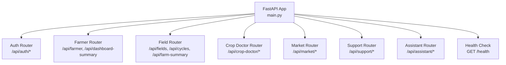
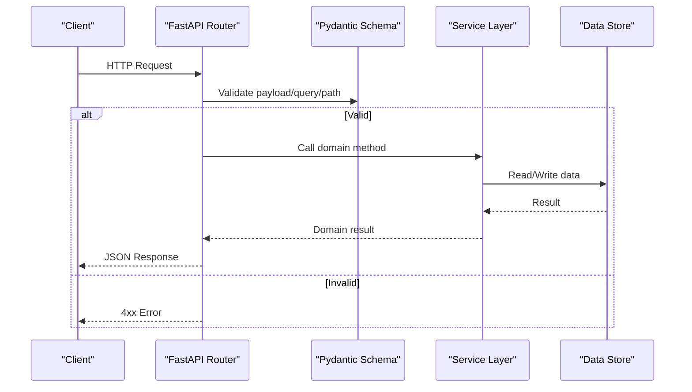
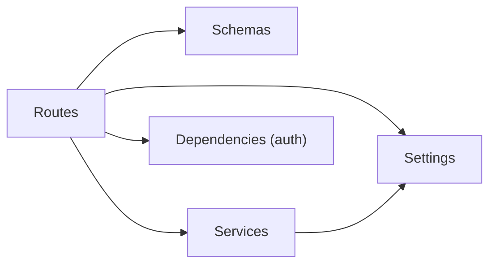

# Backend API Reference

<cite>
**Referenced Files in This Document**
- [main.py](file://Backend/main.py)
- [routes/auth.py](file://Backend/routes/auth.py)
- [routes/farmer.py](file://Backend/routes/farmer.py)
- [routes/field.py](file://Backend/routes/field.py)
- [routes/crop_doctor.py](file://Backend/routes/crop_doctor.py)
- [routes/market.py](file://Backend/routes/market.py)
- [routes/support.py](file://Backend/routes/support.py)
- [routes/assistant.py](file://Backend/routes/assistant.py)
- [schemas/auth.py](file://Backend/schemas/auth.py)
- [schemas/farmer.py](file://Backend/schemas/farmer.py)
- [schemas/field.py](file://Backend/schemas/field.py)
- [schemas/crop_doctor.py](file://Backend/schemas/crop_doctor.py)
- [schemas/market.py](file://Backend/schemas/market.py)
- [schemas/support.py](file://Backend/schemas/support.py)
- [schemas/assistant.py](file://Backend/schemas/assistant.py)
</cite>

## Table of Contents
1. Introduction
2. Project Structure
3. Core Components
4. Architecture Overview
5. Detailed Component Analysis
6. Dependency Analysis
7. Performance Considerations
8. Troubleshooting Guide
9. Conclusion
10. Appendices

## Introduction
This document provides a comprehensive reference for Green Flora’s backend RESTful APIs. It covers all public endpoints, HTTP methods, URL patterns, request/response schemas, authentication requirements, validation rules, and error responses. It also includes example requests using curl, guidance on rate limiting and security, versioning strategy, and client implementation patterns for each API group: authentication, farmer profile management, field operations, crop doctor image analysis, market data retrieval, assistant conversations, and government support services.

## Project Structure
The backend is built with FastAPI. The application registers routers for each feature area and exposes a health check endpoint. CORS middleware is configured to allow frontend development servers. A timing middleware adds an X-Process-Time header to every response.

**Diagram sources**
- [main.py:15-47](file://Backend/main.py#L15-L47)
- [main.py:50-52](file://Backend/main.py#L50-L52)

**Section sources**
- [main.py:1-57](file://Backend/main.py#L1-L57)

## Core Components
- Authentication: signup, login, refresh, logout, current user info.
- Farmer Profile: get/update profile and dashboard summary.
- Fields: farm summary, fields CRUD, crop cycles CRUD.
- Crop Doctor: analyze uploaded images and return diagnosis + recommendations.
- Market Intelligence: list commodities and get detailed overview per commodity.
- Government Support: retrieve active government support information.
- AI Assistant: chat (SSE), transcription, text-to-speech, greeting.

Authentication model:
- Public endpoints: auth signup/login/refresh, market, support.
- Protected endpoints: farmer, fields, crop doctor, assistant use optional user resolution; live mode requires Bearer token, demo mode serves demo context.

**Section sources**
- [routes/auth.py:1-132](file://Backend/routes/auth.py#L1-L132)
- [routes/farmer.py:1-161](file://Backend/routes/farmer.py#L1-L161)
- [routes/field.py:1-287](file://Backend/routes/field.py#L1-L287)
- [routes/crop_doctor.py:1-125](file://Backend/routes/crop_doctor.py#L1-L125)
- [routes/market.py:1-108](file://Backend/routes/market.py#L1-L108)
- [routes/support.py:1-57](file://Backend/routes/support.py#L1-L57)
- [routes/assistant.py:1-208](file://Backend/routes/assistant.py#L1-L208)

## Architecture Overview
The API follows a thin router pattern: routes validate input via Pydantic schemas, delegate business logic to service modules, and shape responses. Schemas define the external contract; models are internal.

**Diagram sources**
- [routes/auth.py:68-98](file://Backend/routes/auth.py#L68-L98)
- [routes/farmer.py:75-128](file://Backend/routes/farmer.py#L75-L128)
- [routes/field.py:73-182](file://Backend/routes/field.py#L73-L182)
- [routes/crop_doctor.py:48-124](file://Backend/routes/crop_doctor.py#L48-L124)
- [routes/market.py:38-107](file://Backend/routes/market.py#L38-L107)
- [routes/support.py:32-56](file://Backend/routes/support.py#L32-L56)
- [routes/assistant.py:68-112](file://Backend/routes/assistant.py#L68-L112)

## Detailed Component Analysis

### Authentication API
- Base path: /api/auth
- Methods and URLs:
  - POST /api/auth/signup
  - POST /api/auth/login
  - POST /api/auth/refresh
  - POST /api/auth/logout (protected)
  - GET /api/auth/me (protected)

Authentication:
- signup/login/refresh: public
- logout/me: protected (Bearer token required)

Request/Response Schemas:
- SignupRequest: name (string, 1–100), contact (email or phone, 3–100), password (8–128)
- LoginRequest: contact (3–100), password (min length 1)
- TokenRefreshRequest: refresh_token (non-empty)
- AuthResponse: access_token, refresh_token, user_id, name (optional), is_new (bool)
- AuthUserResponse: user_id, name/email/phone (optional)

Validation Rules:
- Contact must be email-like or phone-like; validated by schema validators.
- Password constraints enforced by field validators.

Error Responses:
- 400 Bad Request for invalid credentials or malformed payloads.
- 503 Service Unavailable if downstream auth service is down.
- 500 Internal Server Error for unexpected errors.

Example Requests:
- Signup:
  - curl -X POST http://localhost:8000/api/auth/signup -H "Content-Type: application/json" -d '{"name":"Muhammad Asif","contact":"muhammad@example.com","password":"securepass123"}'
- Login:
  - curl -X POST http://localhost:8000/api/auth/login -H "Content-Type: application/json" -d '{"contact":"muhammad@example.com","password":"securepass123"}'
- Refresh:
  - curl -X POST http://localhost:8000/api/auth/refresh -H "Content-Type: application/json" -d '{"refresh_token":"your-refresh-token"}'
- Logout (protected):
  - curl -X POST http://localhost:8000/api/auth/logout -H "Authorization: Bearer your-access-token"
- Me (protected):
  - curl -X GET http://localhost:8000/api/auth/me -H "Authorization: Bearer your-access-token"

Notes:
- Demo mode allows unauthenticated access to certain features; auth endpoints remain as defined above.

**Section sources**
- [routes/auth.py:1-132](file://Backend/routes/auth.py#L1-L132)
- [schemas/auth.py:1-100](file://Backend/schemas/auth.py#L1-L100)

### Farmer Profile API
- Base path: /api
- Methods and URLs:
  - GET /api/farmer
  - PUT /api/farmer
  - GET /api/dashboard-summary

Authentication:
- Optional user; live mode requires Bearer token; demo mode serves demo context.

Request/Response Schemas:
- FarmerUpdateRequest: partial update fields (name, phone_number, preferred_language, location, farm_name, farm_area_acres, soil_type, irrigation_method, ownership_status, current_crop, crop_stage, budget_pkr, farm_latitude, farm_longitude). Validators enforce allowed languages, irrigation methods, ownership statuses, and numeric bounds.
- FarmerResponse: full profile including id, name, phone_number, preferred_language, location, farm_name, farm_area_acres, soil_type, irrigation_method, ownership_status, current_crop, crop_stage, budget_pkr, farm_latitude, farm_longitude, is_demo.
- DashboardSummaryResponse: farmer_name, location, farm_area_acres, current_crop, crop_stage, is_demo.

Validation Rules:
- Language must be one of ur/en/pa/sd.
- Irrigation method must be canal/tubewell/drip/sprinkler/rainfed.
- Ownership status must be owned/leased/shared.
- Numeric fields bounded appropriately.

Error Responses:
- 401 Unauthorized when missing token in live mode.
- 400 Bad Request when no fields provided to update.
- 500 Internal Server Error for failures.

Example Requests:
- Get profile:
  - curl -X GET http://localhost:8000/api/farmer -H "Authorization: Bearer your-access-token"
- Update profile:
  - curl -X PUT http://localhost:8000/api/farmer -H "Content-Type: application/json" -H "Authorization: Bearer your-access-token" -d '{"current_crop":"Rice","budget_pkr":200000}'
- Dashboard summary:
  - curl -X GET http://localhost:8000/api/dashboard-summary -H "Authorization: Bearer your-access-token"

**Section sources**
- [routes/farmer.py:1-161](file://Backend/routes/farmer.py#L1-L161)
- [schemas/farmer.py:1-165](file://Backend/schemas/farmer.py#L1-L165)

### Field Operations API
- Base path: /api
- Methods and URLs:
  - GET /api/farm-summary
  - GET /api/fields
  - POST /api/fields
  - PUT /api/fields/{field_id}
  - DELETE /api/fields/{field_id}
  - GET /api/fields/{field_id}/cycles
  - POST /api/fields/{field_id}/cycles
  - PUT /api/cycles/{cycle_id}
  - DELETE /api/cycles/{cycle_id}

Authentication:
- Optional user; live mode requires Bearer token; demo mode serves demo context.

Request/Response Schemas:
- FieldCreateRequest: name (required), area_acres (0–100000), latitude (-90..90), longitude (-180..180), boundary_geojson (optional), soil_type (max 50), irrigation_method (allowed set), status (active/fallow/inactive).
- FieldUpdateRequest: partial fields with same validations as create.
- FieldResponse: id, farm_id, name, area_acres, latitude, longitude, boundary_geojson, soil_type, irrigation_method, status, is_demo, active_crop_cycle (optional).
- FarmWithFieldsResponse: farm_id, farm_name, location, farm_latitude, farm_longitude, total_area_acres, fields array, total_fields, total_field_area_acres, crop_distribution map.
- CropCycleCreateRequest: crop_name (required), variety (max 50), crop_stage (max 50), planting_date (optional), expected_harvest_date (optional), status (active/harvested/cancelled).
- CropCycleUpdateRequest: partial fields with same validations.
- CropCycleResponse: id, field_id, crop_name, variety, crop_stage, planting_date, expected_harvest_date, status, is_demo.

Validation Rules:
- Status enums enforced for fields and cycles.
- Irrigation method enum enforced.
- Geographic coordinates bounded.

Error Responses:
- 404 Not Found for missing farms/fields/cycles.
- 400 Bad Request when no fields provided to update.
- 500 Internal Server Error for failures.

Example Requests:
- List fields:
  - curl -X GET http://localhost:8000/api/fields -H "Authorization: Bearer your-access-token"
- Create field:
  - curl -X POST http://localhost:8000/api/fields -H "Content-Type: application/json" -H "Authorization: Bearer your-access-token" -d '{"name":"North Plot","area_acres":10,"irrigation_method":"canal"}'
- Update field:
  - curl -X PUT http://localhost:8000/api/fields/{field_id} -H "Content-Type: application/json" -H "Authorization: Bearer your-access-token" -d '{"status":"inactive"}'
- Delete field:
  - curl -X DELETE http://localhost:8000/api/fields/{field_id} -H "Authorization: Bearer your-access-token"
- List cycles:
  - curl -X GET http://localhost:8000/api/fields/{field_id}/cycles -H "Authorization: Bearer your-access-token"
- Create cycle:
  - curl -X POST http://localhost:8000/api/fields/{field_id}/cycles -H "Content-Type: application/json" -H "Authorization: Bearer your-access-token" -d '{"crop_name":"Wheat","planting_date":"2025-01-15"}'
- Update cycle:
  - curl -X PUT http://localhost:8000/api/cycles/{cycle_id} -H "Content-Type: application/json" -H "Authorization: Bearer your-access-token" -d '{"status":"harvested"}'
- Delete cycle:
  - curl -X DELETE http://localhost:8000/api/cycles/{cycle_id} -H "Authorization: Bearer your-access-token"
- Farm summary:
  - curl -X GET http://localhost:8000/api/farm-summary -H "Authorization: Bearer your-access-token"

**Section sources**
- [routes/field.py:1-287](file://Backend/routes/field.py#L1-L287)
- [schemas/field.py:1-195](file://Backend/schemas/field.py#L1-L195)

### Crop Doctor API
- Base path: /api/crop-doctor
- Methods and URLs:
  - POST /api/crop-doctor/analyse

Authentication:
- Optional user; live mode requires Bearer token; demo mode serves demo context.

Request:
- Multipart/form-data with file field named image.
- Allowed MIME types: image/jpeg, image/jpg, image/png, image/webp.
- Max size: 10 MB.

Response Schema:
- Diagnosis: crop, problem, problem_type (enum), confidence (0–100), severity (enum), symptoms, explanation.
- Products: list of ProductRecommendation (id, category, local_problem_target, scientific_target_action, best_local_brand, company, formulation_active_ingredient, dosage_per_acre, approx_price_pkr, min_price_pkr, max_price_pkr, fits_budget).
- Budget: budget_pkr, within_budget.
- LowCostActions: list of actions.
- Disclaimer string.

Validation Rules:
- Image type and size enforced.
- Empty image rejected.

Error Responses:
- 415 Unsupported Media Type for invalid image types.
- 413 Request Entity Too Large for oversized images.
- 400 Bad Request for empty image.
- 502 Bad Gateway for downstream analysis failures.
- 500 Internal Server Error for unexpected errors.

Example Request:
- curl -X POST http://localhost:8000/api/crop-doctor/analyse -H "Authorization: Bearer your-access-token" -F "image=@path/to/image.jpg"

**Section sources**
- [routes/crop_doctor.py:1-125](file://Backend/routes/crop_doctor.py#L1-L125)
- [schemas/crop_doctor.py:1-123](file://Backend/schemas/crop_doctor.py#L1-L123)

### Market Intelligence API
- Base path: /api/market
- Methods and URLs:
  - GET /api/market/commodities
  - GET /api/market/overview

Authentication:
- Public endpoints; no authentication required.

Query Parameters:
- Commodities: refresh (boolean, default false).
- Overview: commodity_id (required), days (1–365, default 180), market_id (optional).

Response Schemas:
- MarketCommoditiesResponse: commodities array (id, name, category, unit, latest_date, latest_price, markets_reporting), total count, data_available flag.
- MarketOverviewResponse: commodity_id, commodity_name, category, unit, latest_date, first_date, days_of_data, markets_reporting, current_price, price_basis, change_pct, change_period_days, signal (enum), highest_market, lowest_market, spread_abs, spread_pct, trend array, trend_market_id, market_comparison array, distribution object, insights array.

Validation Rules:
- Days parameter constrained to 1–365.

Error Responses:
- 503 Service Unavailable when market data is temporarily unavailable.
- 404 Not Found for unknown commodity.
- 500 Internal Server Error for unexpected errors.

Example Requests:
- List commodities:
  - curl -X GET "http://localhost:8000/api/market/commodities?refresh=false"
- Get overview:
  - curl -X GET "http://localhost:8000/api/market/overview?commodity_id=UUID&days=180&market_id=OPTIONAL_UUID"

**Section sources**
- [routes/market.py:1-108](file://Backend/routes/market.py#L1-L108)
- [schemas/market.py:1-132](file://Backend/schemas/market.py#L1-L132)

### Government Support API
- Base path: /api/support
- Methods and URLs:
  - GET /api/support/government

Authentication:
- Public endpoint; no authentication required.

Response Schema:
- GovernmentSupportResponse: support (optional object with id, name, organization, phone, description, hours), data_available flag.

Error Responses:
- 503 Service Unavailable when support data is temporarily unavailable.
- 500 Internal Server Error for unexpected errors.

Example Request:
- curl -X GET http://localhost:8000/api/support/government

**Section sources**
- [routes/support.py:1-57](file://Backend/routes/support.py#L1-L57)
- [schemas/support.py:1-41](file://Backend/schemas/support.py#L1-L41)

### AI Assistant API
- Base path: /api/assistant
- Methods and URLs:
  - POST /api/assistant/chat (Server-Sent Events stream)
  - POST /api/assistant/transcribe
  - POST /api/assistant/speak
  - GET /api/assistant/greeting

Authentication:
- Optional user; live mode requires Bearer token; demo mode serves demo context.

Request/Response Schemas:
- ChatRequest: messages array (role: user|assistant, content 1–4000), voice boolean.
- TranscriptionResponse: text string.
- TTSRequest: text (1–3000), voice (optional, default alloy).
- GreetingResponse: greeting string, language (en|ur), time_of_day (morning|afternoon|evening).

Streaming Behavior:
- Chat returns SSE events:
  - event: status (thinking/searching/tool/...)
  - event: delta (text chunk)
  - event: done (provider info)
  - event: error (message, retryable)

Error Responses:
- 400 Bad Request for invalid inputs or assistant errors.
- 503 Service Unavailable for transcription/TTS unavailability.
- 500 Internal Server Error for unexpected errors.

Example Requests:
- Chat (SSE):
  - curl -N -X POST http://localhost:8000/api/assistant/chat -H "Content-Type: application/json" -H "Authorization: Bearer your-access-token" -d '{"messages":[{"role":"user","content":"How do I treat wheat rust?"}],"voice":false}'
- Transcribe:
  - curl -X POST http://localhost:8000/api/assistant/transcribe -H "Authorization: Bearer your-access-token" -F "file=@audio.webm"
- Speak:
  - curl -X POST http://localhost:8000/api/assistant/speak -H "Content-Type: application/json" -H "Authorization: Bearer your-access-token" -d '{"text":"Assalam-o-Alaikum! How can Green Flora help your farm today?","voice":"alloy"}'
- Greeting:
  - curl -X GET http://localhost:8000/api/assistant/greeting -H "Authorization: Bearer your-access-token"

**Section sources**
- [routes/assistant.py:1-208](file://Backend/routes/assistant.py#L1-L208)
- [schemas/assistant.py:1-56](file://Backend/schemas/assistant.py#L1-L56)

## Dependency Analysis
Feature routers depend on:
- Schemas for request/response validation.
- Services for business logic and data access.
- Settings for environment configuration (e.g., demo_mode, CORS origins).
- Dependencies for authentication helpers.

**Diagram sources**
- [routes/auth.py:20-34](file://Backend/routes/auth.py#L20-L34)
- [routes/farmer.py:28-39](file://Backend/routes/farmer.py#L28-L39)
- [routes/field.py:25-40](file://Backend/routes/field.py#L25-L40)
- [routes/crop_doctor.py:14-30](file://Backend/routes/crop_doctor.py#L14-L30)
- [routes/market.py:18-27](file://Backend/routes/market.py#L18-L27)
- [routes/support.py:16-21](file://Backend/routes/support.py#L16-L21)
- [routes/assistant.py:23-38](file://Backend/routes/assistant.py#L23-L38)

**Section sources**
- [main.py:1-57](file://Backend/main.py#L1-L57)

## Performance Considerations
- Use GET endpoints for read-only data to leverage caching where appropriate.
- For streaming chat, ensure clients handle SSE properly and avoid buffering proxies.
- Limit large uploads (Crop Doctor enforces 10 MB limit).
- Monitor X-Process-Time header added by middleware for performance diagnostics.
- Prefer minimal payloads (e.g., dashboard summary vs full profile) to reduce bandwidth.

[No sources needed since this section provides general guidance]

## Troubleshooting Guide
Common issues and resolutions:
- 401 Unauthorized: Ensure Bearer token is present for protected endpoints; verify token validity.
- 400 Bad Request: Check payload against schema constraints (e.g., contact format, allowed enums).
- 415 Unsupported Media Type: Upload correct image types for Crop Doctor.
- 413 Request Entity Too Large: Reduce image size below 10 MB.
- 503 Service Unavailable: Temporary issues with market data, transcription, or TTS; retry later.
- 502 Bad Gateway: Downstream AI analysis failure; retry or adjust input.
- 500 Internal Server Error: Unexpected server error; log details and retry.

Debugging tips:
- Inspect X-Process-Time header to identify slow endpoints.
- Use demo mode to test without authentication when enabled.
- Validate request bodies using OpenAPI docs generated by FastAPI.

**Section sources**
- [routes/auth.py:45-61](file://Backend/routes/auth.py#L45-L61)
- [routes/farmer.py:50-68](file://Backend/routes/farmer.py#L50-L68)
- [routes/field.py:51-66](file://Backend/routes/field.py#L51-L66)
- [routes/crop_doctor.py:60-87](file://Backend/routes/crop_doctor.py#L60-L87)
- [routes/market.py:51-62](file://Backend/routes/market.py#L51-L62)
- [routes/support.py:45-56](file://Backend/routes/support.py#L45-L56)
- [routes/assistant.py:45-55](file://Backend/routes/assistant.py#L45-L55)

## Conclusion
Green Flora’s backend exposes a well-structured set of RESTful APIs organized by feature. Each router validates inputs via schemas, delegates to services, and returns consistent responses. Authentication is flexible with demo mode support. Clients should follow the documented request/response formats, handle errors gracefully, and respect rate limits and security considerations.

[No sources needed since this section summarizes without analyzing specific files]

## Appendices

### Security Considerations
- Use HTTPS in production.
- Protect sensitive endpoints with Bearer tokens.
- Enforce input validation via schemas.
- Limit upload sizes and types.
- Avoid logging secrets or tokens.

[No sources needed since this section provides general guidance]

### Rate Limiting
- No explicit rate limiting is implemented in the provided codebase.
- Implement rate limiting at the gateway/proxy layer if needed.
- Monitor usage and adjust limits based on capacity.

[No sources needed since this section provides general guidance]

### Versioning Strategy
- API version is declared in the app metadata (version "0.1.0").
- Consider prefixing routes with /v1 when introducing breaking changes.
- Maintain backward compatibility where possible.

**Section sources**
- [main.py:15-19](file://Backend/main.py#L15-L19)

### Client Implementation Guidelines
- Authentication:
  - Obtain tokens via signup/login/refresh.
  - Include Authorization header for protected endpoints.
- Farmer and Fields:
  - Use partial updates to minimize payload size.
  - Handle 401/404 appropriately.
- Crop Doctor:
  - Validate image type and size before upload.
  - Handle 415/413 errors gracefully.
- Market:
  - Cache commodities list to reduce repeated calls.
  - Use query parameters to scope trends.
- Assistant:
  - Implement SSE client for chat streaming.
  - Handle audio formats for transcribe/speak.
- Support:
  - Display fallback UI when data is unavailable.

[No sources needed since this section provides general guidance]