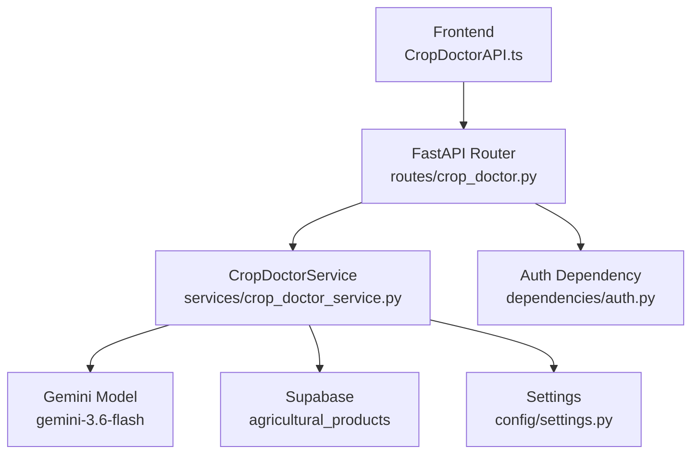
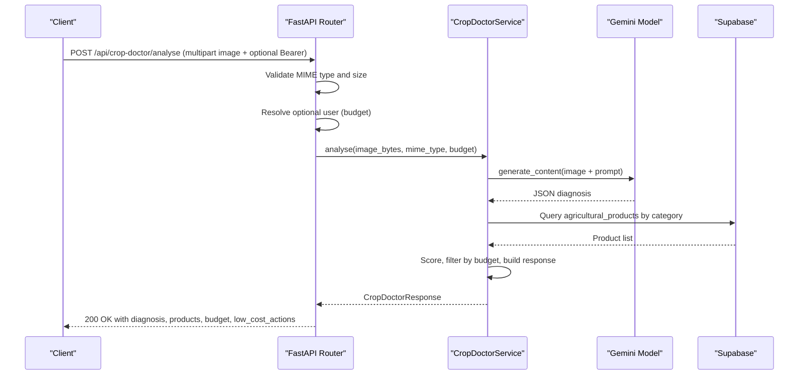
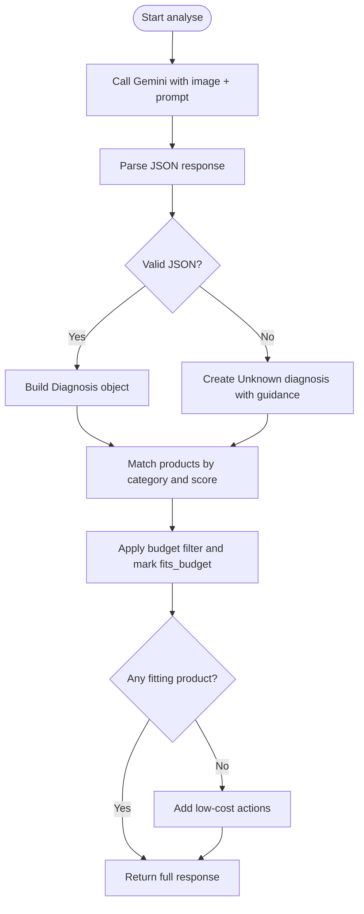
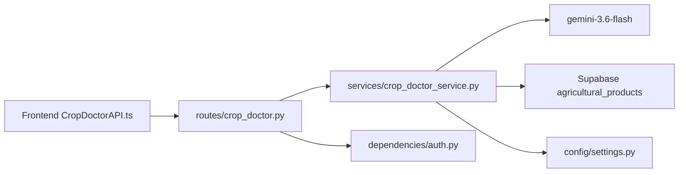

# Crop Doctor API

<cite>
**Referenced Files in This Document**
- [main.py](file://Backend/main.py)
- [crop_doctor.py](file://Backend/routes/crop_doctor.py)
- [crop_doctor_service.py](file://Backend/services/crop_doctor_service.py)
- [crop_doctor.py (schemas)](file://Backend/schemas/crop_doctor.py)
- [settings.py](file://Backend/config/settings.py)
- [auth.py](file://Backend/dependencies/auth.py)
- [CropDoctorAPI.ts](file://Frontend/greenflora/services/CropDoctorAPI.ts)
- [cropDoctor.ts](file://Frontend/greenflora/types/cropDoctor.ts)
</cite>

## Table of Contents
1. [Introduction](#introduction)
2. [Project Structure](#project-structure)
3. [Core Components](#core-components)
4. [Architecture Overview](#architecture-overview)
5. [Detailed Component Analysis](#detailed-component-analysis)
6. [Dependency Analysis](#dependency-analysis)
7. [Performance Considerations](#performance-considerations)
8. [Troubleshooting Guide](#troubleshooting-guide)
9. [Conclusion](#conclusion)

## Introduction
This document provides detailed API documentation for Green-Flora’s Crop Doctor endpoints that perform AI-powered plant disease detection and treatment recommendations. It covers the image upload and analysis workflow, supported formats and size limits, request/response schemas, Gemini integration details, authentication behavior, error handling, performance tips, and troubleshooting guidance.

## Project Structure
The Crop Doctor feature is implemented as a FastAPI route that accepts multipart image uploads, validates them, calls an internal service to analyze the image with Gemini, matches products from a database, applies budget filtering, and returns structured results to the frontend. The frontend sends multipart/form-data requests with an optional Bearer token and handles timeouts and errors.

**Diagram sources**
- [crop_doctor.py:48-125](file://Backend/routes/crop_doctor.py#L48-L125)
- [crop_doctor_service.py:118-165](file://Backend/services/crop_doctor_service.py#L118-L165)
- [settings.py:84-86](file://Backend/config/settings.py#L84-L86)
- [auth.py:72-100](file://Backend/dependencies/auth.py#L72-L100)
- [CropDoctorAPI.ts:47-106](file://Frontend/greenflora/services/CropDoctorAPI.ts#L47-L106)

**Section sources**
- [main.py:15-47](file://Backend/main.py#L15-L47)
- [crop_doctor.py:1-125](file://Backend/routes/crop_doctor.py#L1-L125)

## Core Components
- Route handler: Validates uploads, resolves optional user context, invokes service, and maps exceptions to HTTP responses.
- Service: Orchestrates Gemini analysis, product matching, budget context, and low-cost fallback actions.
- Schemas: Define strict response structures for diagnosis, products, budget, and low-cost actions.
- Settings: Provide Gemini API key and other environment configuration.
- Auth dependency: Optional bearer token extraction for budget-aware personalization.
- Frontend client: Sends multipart image uploads, attaches optional auth header, and classifies errors.

**Section sources**
- [crop_doctor.py:48-125](file://Backend/routes/crop_doctor.py#L48-L125)
- [crop_doctor_service.py:118-165](file://Backend/services/crop_doctor_service.py#L118-L165)
- [crop_doctor.py (schemas):21-123](file://Backend/schemas/crop_doctor.py#L21-L123)
- [settings.py:84-86](file://Backend/config/settings.py#L84-L86)
- [auth.py:72-100](file://Backend/dependencies/auth.py#L72-L100)
- [CropDoctorAPI.ts:47-106](file://Frontend/greenflora/services/CropDoctorAPI.ts#L47-L106)

## Architecture Overview
The Crop Doctor endpoint follows a clear pipeline:
1. Client uploads an image via multipart/form-data.
2. Backend validates MIME type and size.
3. Optional user context is resolved to fetch farmer budget if available.
4. Image is sent to Gemini with a system prompt requesting structured JSON output.
5. Gemini response is parsed into a Diagnosis object.
6. Products are matched by category and scored against diagnosis keywords.
7. Budget filtering marks whether each product fits the farmer’s budget.
8. Low-cost actions are provided when no suitable paid option fits or none exist.
9. A unified response is returned to the client.

**Diagram sources**
- [crop_doctor.py:48-125](file://Backend/routes/crop_doctor.py#L48-L125)
- [crop_doctor_service.py:131-165](file://Backend/services/crop_doctor_service.py#L131-L165)
- [crop_doctor_service.py:171-205](file://Backend/services/crop_doctor_service.py#L171-L205)
- [crop_doctor_service.py:264-339](file://Backend/services/crop_doctor_service.py#L264-L339)

## Detailed Component Analysis

### Endpoint: POST /api/crop-doctor/analyse
- Purpose: Analyse a crop image and return diagnosis plus product recommendations.
- Authentication: Optional Bearer token; used only to resolve farmer budget.
- Request:
  - Content-Type: multipart/form-data
  - Field: image (required) — JPEG/JPG, PNG, WebP; max 10 MB; non-empty
- Response: Structured JSON defined by schemas.

Key behaviors:
- Rejects unsupported MIME types with 415.
- Rejects oversized images with 413.
- Rejects empty uploads with 400.
- Maps Gemini/runtime failures to 502 or 500 with descriptive messages.

**Section sources**
- [crop_doctor.py:36-45](file://Backend/routes/crop_doctor.py#L36-L45)
- [crop_doctor.py:48-125](file://Backend/routes/crop_doctor.py#L48-L125)

### Request and Response Schemas
- Diagnosis fields:
  - crop: string
  - problem: string
  - problem_type: enum (Disease, Pest/Insect, Nutrient Deficiency, Weed, Environmental/Physical Stress, Unknown)
  - confidence: number 0–100
  - severity: enum (Low, Moderate, High, Unknown)
  - symptoms: string
  - explanation: string
- ProductRecommendation fields:
  - id: string
  - category: string
  - local_problem_target: string | null
  - scientific_target_action: string | null
  - best_local_brand: string
  - company: string | null
  - formulation_active_ingredient: string | null
  - dosage_per_acre: string | null
  - approx_price_pkr: number | null
  - min_price_pkr: number | null
  - max_price_pkr: number | null
  - fits_budget: boolean
- BudgetContext fields:
  - budget_pkr: number
  - within_budget: boolean
- LowCostAction fields:
  - action: string
- CropDoctorResponse fields:
  - diagnosis: Diagnosis
  - products: list[ProductRecommendation]
  - budget: BudgetContext
  - low_cost_actions: list[LowCostAction]
  - disclaimer: string

**Section sources**
- [crop_doctor.py (schemas):21-123](file://Backend/schemas/crop_doctor.py#L21-L123)
- [cropDoctor.ts:8-64](file://Frontend/greenflora/types/cropDoctor.ts#L8-L64)

### Gemini Integration and Prompt Engineering
- Model: gemini-3.6-flash
- Configuration: API key loaded from settings; model initialized once at service level.
- Prompt strategy:
  - System prompt instructs Gemini to return a single JSON object with strict keys and constrained enums.
  - Inline image data is passed alongside the text prompt.
  - Generation config sets temperature and response_mime_type to application/json for reliable parsing.
- Parsing:
  - Strips markdown fences if present.
  - Parses JSON into Diagnosis with safe defaults for missing or invalid fields.
  - Falls back to a low-confidence “Unknown” diagnosis on parse failure to ensure the client always receives a result.

**Diagram sources**
- [crop_doctor_service.py:118-165](file://Backend/services/crop_doctor_service.py#L118-L165)
- [crop_doctor_service.py:171-205](file://Backend/services/crop_doctor_service.py#L171-L205)
- [crop_doctor_service.py:207-258](file://Backend/services/crop_doctor_service.py#L207-L258)
- [crop_doctor_service.py:264-339](file://Backend/services/crop_doctor_service.py#L264-L339)
- [crop_doctor_service.py:409-416](file://Backend/services/crop_doctor_service.py#L409-L416)

**Section sources**
- [crop_doctor_service.py:42-64](file://Backend/services/crop_doctor_service.py#L42-L64)
- [crop_doctor_service.py:118-126](file://Backend/services/crop_doctor_service.py#L118-L126)
- [crop_doctor_service.py:171-205](file://Backend/services/crop_doctor_service.py#L171-L205)
- [crop_doctor_service.py:207-258](file://Backend/services/crop_doctor_service.py#L207-L258)

### Product Matching and Budget Filtering
- Category mapping:
  - Disease → Fungicide
  - Pest/Insect → Insecticide
  - Nutrient Deficiency → Fertilizer, Tonics
  - Weed → Weedicide
  - Environmental/Physical Stress → Tonics, Fertilizer
  - Unknown → no category filter
- Matching process:
  - Fetch products by categories from Supabase.
  - Extract keywords from diagnosis (problem name and type).
  - Score products based on keyword overlap and direct problem-name matching.
  - Sort by score and select top 3.
  - Compute effective price and set fits_budget based on farmer budget.
  - Exclude paid products when budget is zero.
- Low-cost actions:
  - If no products or none fit budget, provide safe generic actions per problem type.

**Section sources**
- [crop_doctor_service.py:71-78](file://Backend/services/crop_doctor_service.py#L71-L78)
- [crop_doctor_service.py:85-115](file://Backend/services/crop_doctor_service.py#L85-L115)
- [crop_doctor_service.py:264-339](file://Backend/services/crop_doctor_service.py#L264-L339)
- [crop_doctor_service.py:341-355](file://Backend/services/crop_doctor_service.py#L341-L355)
- [crop_doctor_service.py:357-403](file://Backend/services/crop_doctor_service.py#L357-L403)
- [crop_doctor_service.py:409-416](file://Backend/services/crop_doctor_service.py#L409-L416)

### Authentication and Rate Limiting
- Authentication:
  - The endpoint uses an optional bearer token dependency to resolve farmer budget when available.
  - If no token is present, the endpoint still works but without personalized budget filtering.
- Rate limiting:
  - No explicit rate limiting middleware is configured in the main app or router.
  - Clients should implement retries with backoff and respect server responses.

**Section sources**
- [auth.py:72-100](file://Backend/dependencies/auth.py#L72-L100)
- [crop_doctor.py:48-52](file://Backend/routes/crop_doctor.py#L48-L52)
- [main.py:21-28](file://Backend/main.py#L21-L28)

### Error Handling
- Validation errors:
  - Unsupported media type: 415
  - Too large: 413
  - Empty image: 400
- Service errors:
  - Gemini runtime failures: 502 with detail message
  - Unexpected errors: 500 with generic message
- Frontend error classification:
  - Network, timeout (408/504), validation (4xx), server (5xx), unknown
  - Timeout handled via AbortController with 60s limit

**Section sources**
- [crop_doctor.py:63-87](file://Backend/routes/crop_doctor.py#L63-L87)
- [crop_doctor.py:106-125](file://Backend/routes/crop_doctor.py#L106-L125)
- [CropDoctorAPI.ts:17-39](file://Frontend/greenflora/services/CropDoctorAPI.ts#L17-L39)
- [CropDoctorAPI.ts:53-55](file://Frontend/greenflora/services/CropDoctorAPI.ts#L53-L55)
- [CropDoctorAPI.ts:71-106](file://Frontend/greenflora/services/CropDoctorAPI.ts#L71-L106)

## Dependency Analysis
The Crop Doctor feature depends on several components:
- FastAPI router for request handling and validation.
- Optional auth dependency for budget resolution.
- Gemini model for image analysis.
- Supabase for product catalog queries.
- Settings for environment variables (Gemini API key, CORS, etc.).
- Frontend client for multipart uploads and error handling.

**Diagram sources**
- [crop_doctor.py:48-125](file://Backend/routes/crop_doctor.py#L48-L125)
- [crop_doctor_service.py:118-165](file://Backend/services/crop_doctor_service.py#L118-L165)
- [settings.py:84-86](file://Backend/config/settings.py#L84-L86)
- [CropDoctorAPI.ts:47-106](file://Frontend/greenflora/services/CropDoctorAPI.ts#L47-L106)

**Section sources**
- [crop_doctor.py:48-125](file://Backend/routes/crop_doctor.py#L48-L125)
- [crop_doctor_service.py:118-165](file://Backend/services/crop_doctor_service.py#L118-L165)
- [settings.py:84-86](file://Backend/config/settings.py#L84-L86)
- [CropDoctorAPI.ts:47-106](file://Frontend/greenflora/services/CropDoctorAPI.ts#L47-L106)

## Performance Considerations
- Image size: Enforced maximum of 10 MB to avoid excessive processing time and memory usage.
- Timeout: Frontend uses a 60-second timeout to handle slow Gemini responses.
- Model selection: Uses a fast Gemini model optimized for quick inference.
- Caching: No caching layer is implemented; consider caching frequent diagnoses or products if needed.
- Database query: Queries all products in relevant categories; consider indexing or pagination if the catalog grows significantly.
- Headers: Server adds X-Process-Time to help monitor latency.

[No sources needed since this section provides general guidance]

## Troubleshooting Guide
Common issues and resolutions:
- Unsupported image type: Ensure the uploaded file is JPEG, JPG, PNG, or WebP.
- Image too large: Reduce image size to under 10 MB.
- Empty image: Re-select a valid photo before uploading.
- Gemini not configured: Set GEMINI_API_KEY in backend environment.
- Poor diagnosis quality: Upload clearer, well-lit, close-up photos of affected plants.
- No products found: Check Supabase configuration and product catalog categories.
- Timeouts: Retry with smaller images or later; network issues may also cause timeouts.

**Section sources**
- [crop_doctor.py:63-87](file://Backend/routes/crop_doctor.py#L63-L87)
- [crop_doctor_service.py:171-205](file://Backend/services/crop_doctor_service.py#L171-L205)
- [crop_doctor_service.py:207-258](file://Backend/services/crop_doctor_service.py#L207-L258)
- [CropDoctorAPI.ts:71-106](file://Frontend/greenflora/services/CropDoctorAPI.ts#L71-L106)

## Conclusion
The Crop Doctor API provides a robust, structured workflow for AI-powered plant disease detection and treatment recommendations. It enforces strict input validation, integrates Gemini for reliable image analysis, matches products from a database, and personalizes recommendations using farmer budgets. With clear error handling, performance considerations, and comprehensive schemas, it offers a solid foundation for scalable agriculture diagnostics.

[No sources needed since this section summarizes without analyzing specific files]