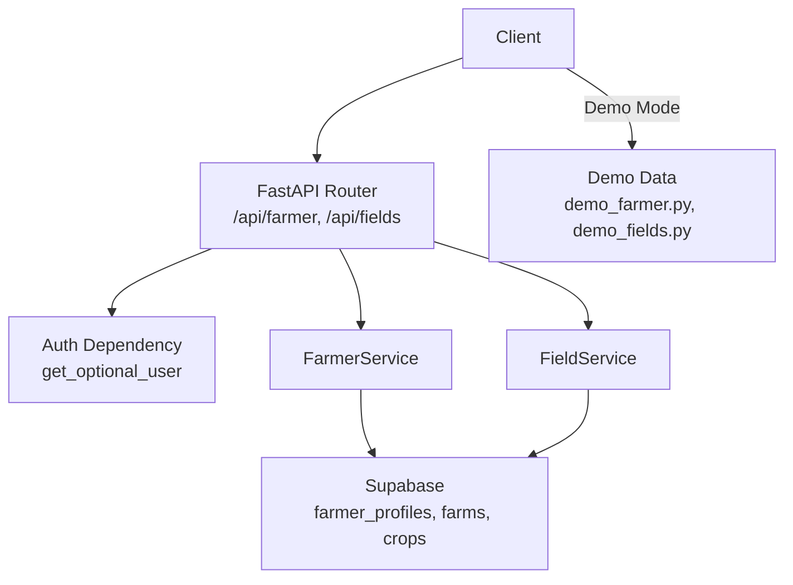
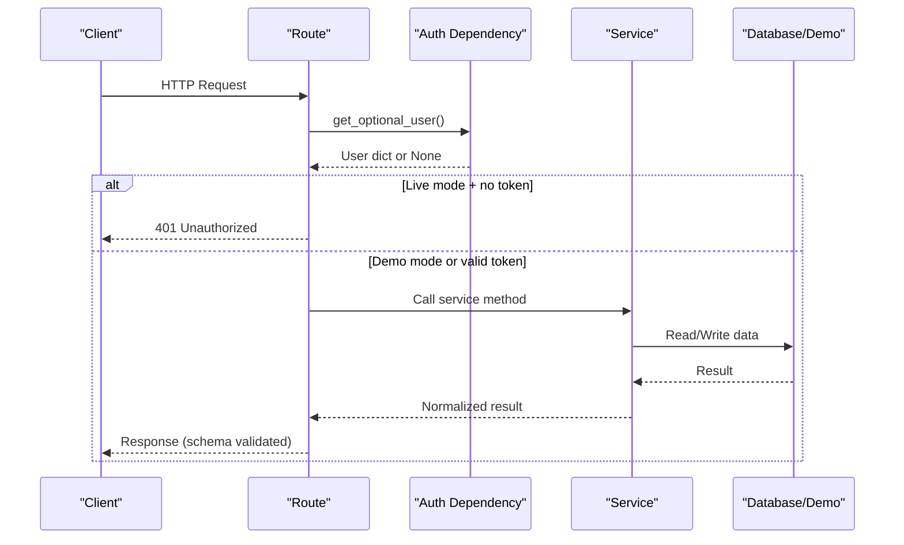
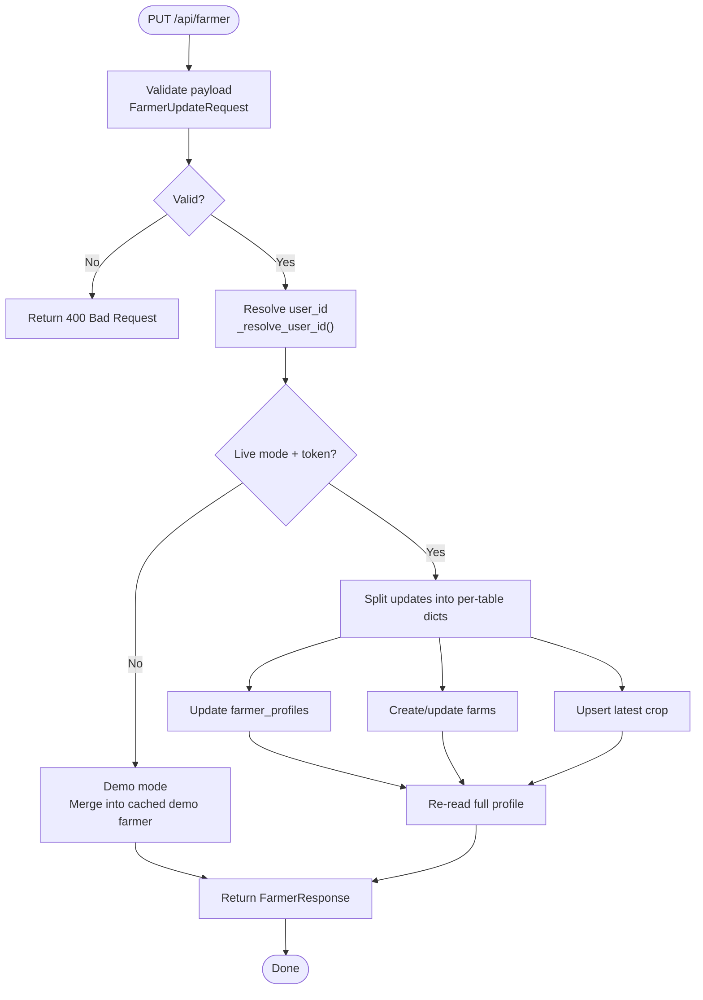
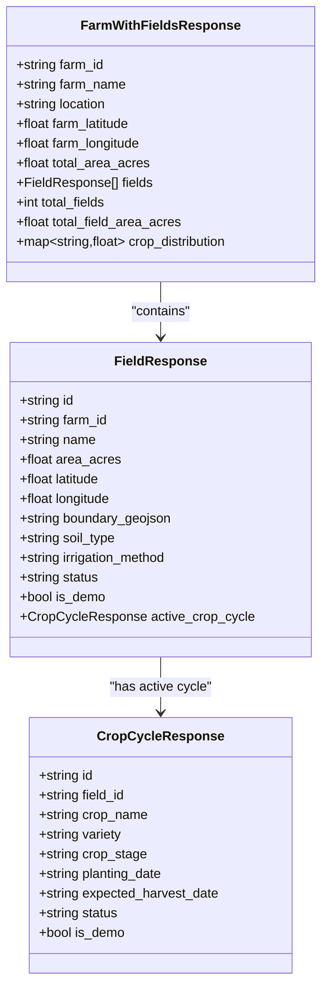
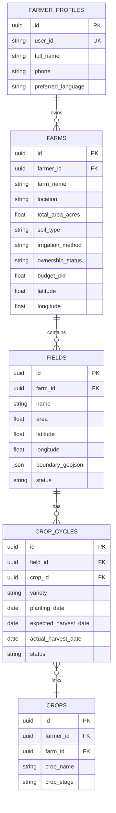
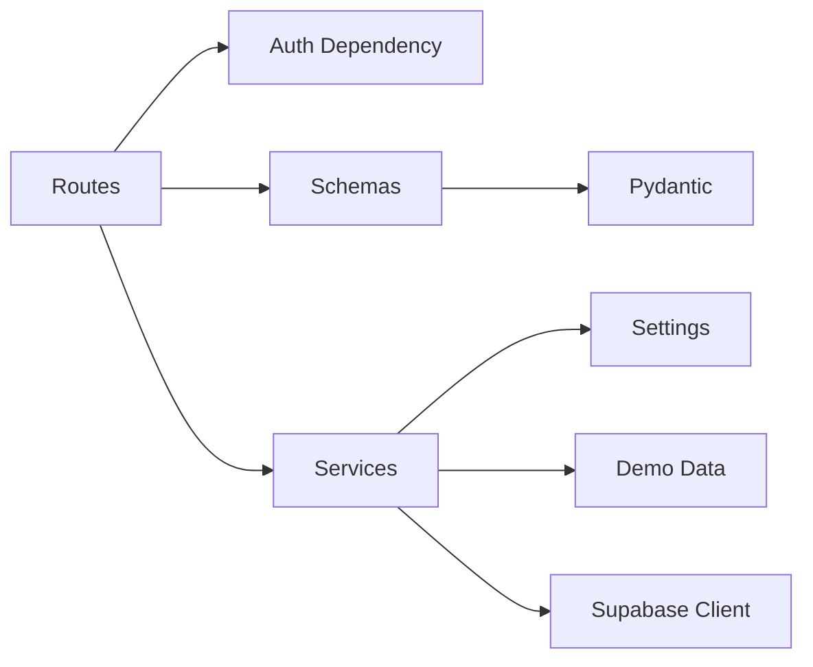

# Farmer Management API

<cite>
**Referenced Files in This Document**
- [farmer.py](file://Backend/routes/farmer.py)
- [field.py](file://Backend/routes/field.py)
- [auth.py](file://Backend/dependencies/auth.py)
- [farmer_service.py](file://Backend/services/farmer_service.py)
- [field_service.py](file://Backend/services/field_service.py)
- [farmer.py (schemas)](file://Backend/schemas/farmer.py)
- [field.py (schemas)](file://Backend/schemas/field.py)
- [farmer.py (models)](file://Backend/models/farmer.py)
- [settings.py](file://Backend/config/settings.py)
- [demo_farmer.py](file://Backend/data/demo_farmer.py)
- [demo_fields.py](file://Backend/data/demo_fields.py)
</cite>

## Table of Contents
1. [Introduction](#introduction)
2. [Project Structure](#project-structure)
3. [Core Components](#core-components)
4. [Architecture Overview](#architecture-overview)
5. [Detailed Component Analysis](#detailed-component-analysis)
6. [Dependency Analysis](#dependency-analysis)
7. [Performance Considerations](#performance-considerations)
8. [Troubleshooting Guide](#troubleshooting-guide)
9. [Conclusion](#conclusion)

## Introduction
This document provides detailed API documentation for Green-Flora’s farmer profile management endpoints. It covers HTTP methods to create, read, update, and delete farmer profiles; manage farm details including fields and crop cycles; and access user preferences such as preferred language. It includes request/response schemas, validation rules, business logic constraints, authentication and authorization requirements, error handling patterns, and troubleshooting guidance.

The backend is a FastAPI application with thin routes that validate inputs via Pydantic schemas, delegate business logic to service layers, and return responses shaped by response schemas. Data is persisted in Supabase PostgreSQL when live mode is enabled; otherwise, demo data is served when DEMO_MODE is true.

## Project Structure
The farmer management functionality spans routes, services, schemas, models, configuration, and demo data:

- Routes define HTTP endpoints under /api and enforce authentication behavior based on environment settings.
- Services implement business logic, including auto-provisioning, ownership checks, and database operations.
- Schemas define the external API contract for requests and responses, including validation rules.
- Models define internal data shapes used across the backend.
- Configuration centralizes environment variables like DEMO_MODE and Supabase credentials.
- Demo data provides seeded records for development and testing without a live database.

**Diagram sources**
- [farmer.py:75-160](file://Backend/routes/farmer.py#L75-L160)
- [field.py:73-286](file://Backend/routes/field.py#L73-L286)
- [auth.py:36-100](file://Backend/dependencies/auth.py#L36-L100)
- [farmer_service.py:68-116](file://Backend/services/farmer_service.py#L68-L116)
- [field_service.py:327-473](file://Backend/services/field_service.py#L327-L473)
- [demo_farmer.py:19-46](file://Backend/data/demo_farmer.py#L19-L46)
- [demo_fields.py:20-133](file://Backend/data/demo_fields.py#L20-L133)

**Section sources**
- [farmer.py:1-161](file://Backend/routes/farmer.py#L1-L161)
- [field.py:1-287](file://Backend/routes/field.py#L1-L287)
- [settings.py:48-122](file://Backend/config/settings.py#L48-L122)

## Core Components
- Farmer Profile Endpoints:
  - GET /api/farmer: Returns the full farmer profile.
  - PUT /api/farmer: Partially updates the farmer profile.
  - GET /api/dashboard-summary: Returns a lightweight overview for the dashboard.
- Field and Crop Cycle Endpoints:
  - GET /api/farm-summary: Farm overview with fields and stats.
  - GET /api/fields: List all fields for the farmer’s farm.
  - POST /api/fields: Create a new field.
  - PUT /api/fields/{field_id}: Update an existing field.
  - DELETE /api/fields/{field_id}: Delete a field and its crop cycles.
  - GET /api/fields/{field_id}/cycles: List crop cycles for a field.
  - POST /api/fields/{field_id}/cycles: Create a crop cycle.
  - PUT /api/cycles/{cycle_id}: Update a crop cycle.
  - DELETE /api/cycles/{cycle_id}: Delete a crop cycle.

Authentication model:
- Routes use get_optional_user to support both demo mode (no auth required) and live mode (Bearer token required).
- In live mode without a valid token, routes raise 401 Unauthorized.
- In demo mode, routes serve seeded demo data.

Validation and business logic:
- Request payloads are validated using Pydantic schemas with allowed values and bounds.
- Service layer enforces farm ownership and normalizes flat updates into per-table writes.
- Auto-provisioning creates farmer_profiles and farms rows lazily when needed.

**Section sources**
- [farmer.py:75-160](file://Backend/routes/farmer.py#L75-L160)
- [field.py:73-286](file://Backend/routes/field.py#L73-L286)
- [auth.py:72-100](file://Backend/dependencies/auth.py#L72-L100)
- [farmer_service.py:68-116](file://Backend/services/farmer_service.py#L68-L116)
- [field_service.py:111-220](file://Backend/services/field_service.py#L111-L220)

## Architecture Overview
The system follows a layered architecture:

- Routes: Thin handlers that validate input and call services.
- Services: Business logic, including auto-provisioning, ownership checks, and database operations.
- Schemas: External API contracts with validation rules.
- Models: Internal data shapes.
- Configuration: Centralized environment variables controlling behavior (e.g., DEMO_MODE).
- Demo Data: Seeded records for development/testing.

**Diagram sources**
- [farmer.py:75-128](file://Backend/routes/farmer.py#L75-L128)
- [field.py:73-182](file://Backend/routes/field.py#L73-L182)
- [auth.py:72-100](file://Backend/dependencies/auth.py#L72-L100)
- [farmer_service.py:68-116](file://Backend/services/farmer_service.py#L68-L116)
- [field_service.py:327-473](file://Backend/services/field_service.py#L327-L473)

## Detailed Component Analysis

### Farmer Profile Endpoints
- GET /api/farmer
  - Purpose: Return the current farmer’s full profile.
  - Authentication: Optional Bearer token; in live mode without token, returns 401.
  - Response schema: FarmerResponse with fields including id, name, phone_number, preferred_language, location, farm_name, farm_area_acres, soil_type, irrigation_method, ownership_status, current_crop, crop_stage, budget_pkr, farm_latitude, farm_longitude, is_demo.
  - Validation: Response validated against FarmerResponse schema.
  - Business logic: In demo mode, returns cached demo farmer; in live mode, fetches from Supabase or auto-provisions if missing.

- PUT /api/farmer
  - Purpose: Partially update the farmer profile.
  - Authentication: Same as GET.
  - Request schema: FarmerUpdateRequest with optional fields and validators for allowed languages, irrigation methods, and ownership statuses.
  - Response schema: FarmerResponse.
  - Business logic: Merges partial updates; in live mode, splits updates into per-table writes (farmer_profiles, farms, crops) and persists changes.

- GET /api/dashboard-summary
  - Purpose: Lightweight overview for the dashboard page.
  - Authentication: Same as GET.
  - Response schema: DashboardSummaryResponse with farmer_name, location, farm_area_acres, current_crop, crop_stage, is_demo.
  - Business logic: Fetches farmer profile and projects only necessary fields.

**Diagram sources**
- [farmer.py:95-128](file://Backend/routes/farmer.py#L95-L128)
- [farmer_service.py:97-208](file://Backend/services/farmer_service.py#L97-L208)

**Section sources**
- [farmer.py:75-160](file://Backend/routes/farmer.py#L75-L160)
- [farmer_service.py:68-208](file://Backend/services/farmer_service.py#L68-L208)
- [farmer.py (schemas):40-165](file://Backend/schemas/farmer.py#L40-L165)

### Field and Crop Cycle Endpoints
- GET /api/farm-summary
  - Purpose: Farm overview with fields and stats.
  - Authentication: Optional Bearer token; in live mode without token, returns 401.
  - Response schema: FarmWithFieldsResponse with farm_id, farm_name, location, coordinates, total_area_acres, fields list, totals, and crop_distribution.
  - Business logic: Aggregates fields and active crop cycles; computes crop distribution by area.

- GET /api/fields
  - Purpose: List all fields for the farmer’s farm.
  - Authentication: Same as above.
  - Response schema: List of FieldResponse with nested active_crop_cycle.

- POST /api/fields
  - Purpose: Create a new field.
  - Request schema: FieldCreateRequest with name, area_acres, coordinates, boundary_geojson, soil_type, irrigation_method, status.
  - Response schema: FieldResponse.
  - Business logic: Validates allowed irrigation methods and status; creates field in demo or live mode.

- PUT /api/fields/{field_id}
  - Purpose: Update an existing field (partial).
  - Request schema: FieldUpdateRequest with optional fields and validators.
  - Response schema: FieldResponse.
  - Business logic: Enforces field ownership; updates only provided fields.

- DELETE /api/fields/{field_id}
  - Purpose: Delete a field and all its crop cycles.
  - Authentication: Same as above.
  - Business logic: Deletes associated crop cycles first, then the field.

- GET /api/fields/{field_id}/cycles
  - Purpose: List crop cycles for a specific field.
  - Response schema: List of CropCycleResponse.

- POST /api/fields/{field_id}/cycles
  - Purpose: Create a new crop cycle on a field.
  - Request schema: CropCycleCreateRequest with crop_name, variety, crop_stage, dates, status.
  - Response schema: CropCycleResponse.
  - Business logic: Links crop to crops table; validates status.

- PUT /api/cycles/{cycle_id}
  - Purpose: Update an existing crop cycle (partial).
  - Request schema: CropCycleUpdateRequest with optional fields and validators.
  - Response schema: CropCycleResponse.
  - Business logic: Updates crop linkage if crop_name changes.

- DELETE /api/cycles/{cycle_id}
  - Purpose: Delete a crop cycle.
  - Business logic: Removes cycle record.

**Diagram sources**
- [field.py (schemas):32-195](file://Backend/schemas/field.py#L32-L195)

**Section sources**
- [field.py:73-286](file://Backend/routes/field.py#L73-L286)
- [field_service.py:327-788](file://Backend/services/field_service.py#L327-L788)
- [field.py (schemas):32-195](file://Backend/schemas/field.py#L32-L195)

### Data Model Structure and Relationships
- Farmer model includes identity, contact, preferences, farm details, crop info, and metadata.
- Fields belong to a farm and can have multiple crop cycles.
- Crop cycles link to crops via crop_id and track lifecycle stages.
- Relationships:
  - farmer_profiles → farms → fields → crop_cycles → crops

**Diagram sources**
- [farmer_service.py:34-48](file://Backend/services/farmer_service.py#L34-L48)
- [field_service.py:42-64](file://Backend/services/field_service.py#L42-L64)

**Section sources**
- [farmer.py (models):21-48](file://Backend/models/farmer.py#L21-L48)
- [farmer_service.py:34-48](file://Backend/services/farmer_service.py#L34-L48)
- [field_service.py:42-64](file://Backend/services/field_service.py#L42-L64)

### Authentication and Authorization
- Authentication:
  - Bearer token via Authorization header.
  - get_optional_user returns user info if token is valid; otherwise None.
  - In live mode without token, routes raise 401 Unauthorized.
  - In demo mode, no token required; demo data served.
- Authorization:
  - Farm ownership enforced for field and crop cycle operations.
  - Ownership verified by querying farms and linking to fields/cycles.

**Section sources**
- [auth.py:36-100](file://Backend/dependencies/auth.py#L36-L100)
- [field_service.py:111-220](file://Backend/services/field_service.py#L111-L220)

### Error Handling Patterns
- Validation errors:
  - Pydantic validators raise ValueError for invalid enum values or out-of-range fields.
  - Routes convert these to 400 Bad Request.
- Authentication errors:
  - Missing or invalid token raises 401 Unauthorized.
- Not found errors:
  - Missing fields or cycles raise 404 Not Found.
- Server errors:
  - Unexpected exceptions log and return 500 Internal Server Error.

**Section sources**
- [farmer.py:85-128](file://Backend/routes/farmer.py#L85-L128)
- [field.py:82-182](file://Backend/routes/field.py#L82-L182)

## Dependency Analysis
- Routes depend on:
  - Auth dependency for user resolution.
  - Service layer for business logic.
  - Schemas for request/response validation.
- Services depend on:
  - Configuration (DEMO_MODE, Supabase settings).
  - Demo data in demo mode.
  - Supabase client for live mode operations.
- Schemas depend on:
  - Pydantic for validation and serialization.
  - Allowed value sets for enums.

**Diagram sources**
- [farmer.py:28-43](file://Backend/routes/farmer.py#L28-L43)
- [field.py:25-44](file://Backend/routes/field.py#L25-L44)
- [farmer_service.py:24-31](file://Backend/services/farmer_service.py#L24-L31)
- [field_service.py:18-31](file://Backend/services/field_service.py#L18-L31)
- [settings.py:48-122](file://Backend/config/settings.py#L48-L122)

**Section sources**
- [farmer.py:28-43](file://Backend/routes/farmer.py#L28-L43)
- [field.py:25-44](file://Backend/routes/field.py#L25-L44)
- [farmer_service.py:24-31](file://Backend/services/farmer_service.py#L24-L31)
- [field_service.py:18-31](file://Backend/services/field_service.py#L18-L31)

## Performance Considerations
- Demo mode uses in-memory caching for demo farmer and fields to avoid database calls.
- Live mode performs targeted queries and upserts to minimize overhead.
- Flat update translation reduces unnecessary writes by mapping only changed fields.
- Dashboard summary endpoint returns lightweight data to reduce payload size.

[No sources needed since this section provides general guidance]

## Troubleshooting Guide
Common issues and resolutions:
- 401 Unauthorized:
  - Ensure Bearer token is present and valid in live mode.
  - Check Supabase Auth configuration and token expiration.
- 400 Bad Request:
  - Validate request payload against schema constraints (allowed values, ranges).
  - Ensure required fields are provided where applicable.
- 404 Not Found:
  - Verify field or cycle IDs exist and belong to the authenticated user’s farm.
  - Check farm ownership enforcement in service layer.
- 500 Internal Server Error:
  - Inspect server logs for unexpected exceptions.
  - Verify Supabase connectivity and credentials.

**Section sources**
- [farmer.py:85-128](file://Backend/routes/farmer.py#L85-L128)
- [field.py:82-182](file://Backend/routes/field.py#L82-L182)
- [farmer_service.py:82-116](file://Backend/services/farmer_service.py#L82-L116)
- [field_service.py:111-220](file://Backend/services/field_service.py#L111-L220)

## Conclusion
Green-Flora’s farmer management API provides a robust set of endpoints for managing farmer profiles, farm details, and crop cycles. The layered architecture ensures clear separation of concerns, while demo mode enables development without a live database. Authentication and authorization protect user data, and comprehensive validation ensures data integrity. Use this guide to integrate with the API effectively and troubleshoot common issues.

[No sources needed since this section summarizes without analyzing specific files]