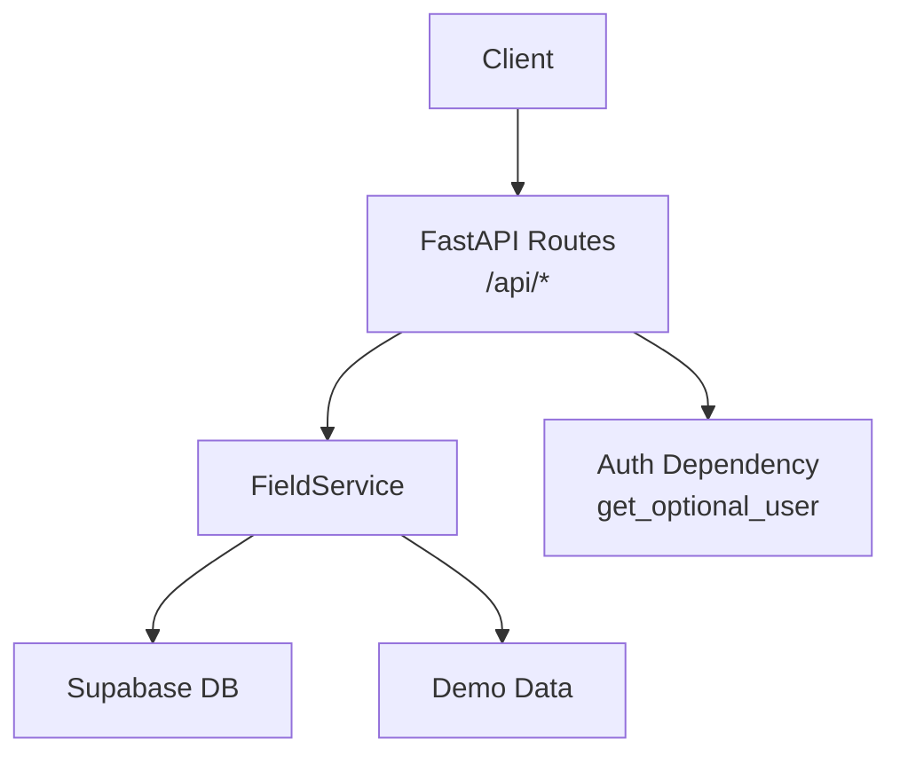
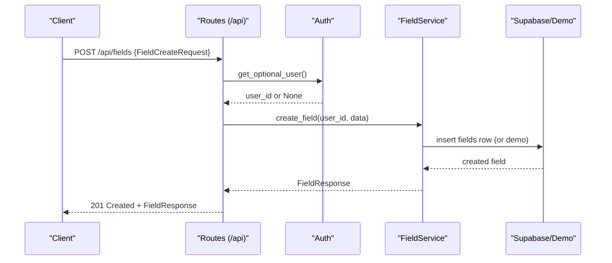
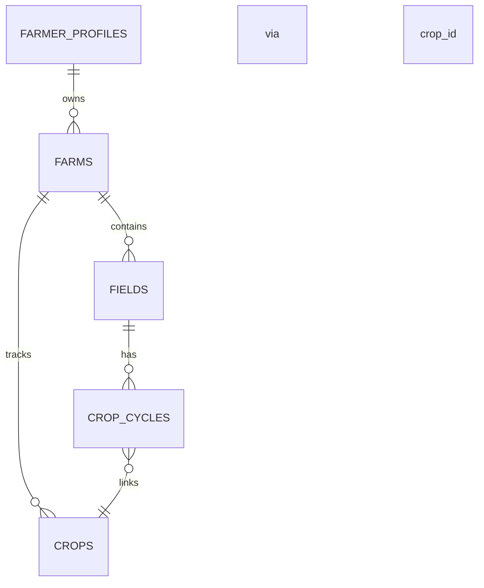
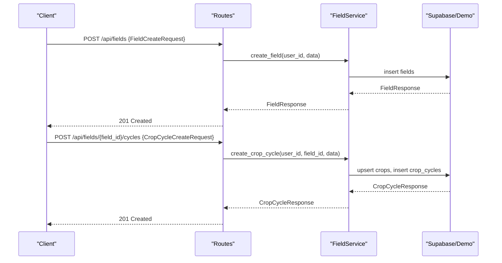
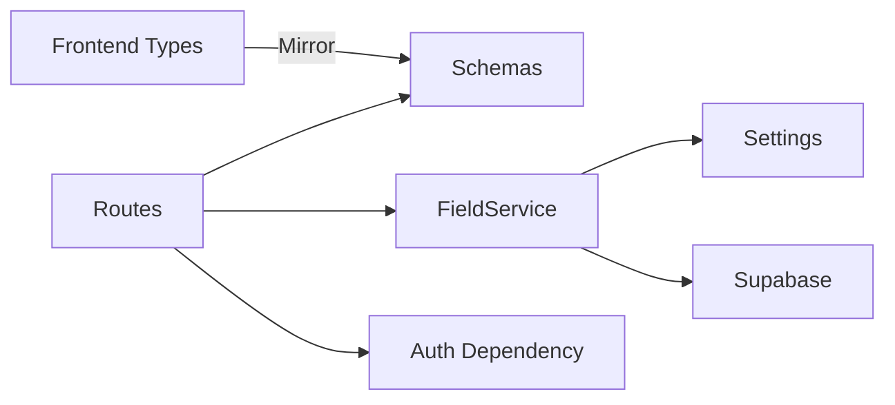

# Field Management API

<cite>
**Referenced Files in This Document**
- [field.py](file://Backend/routes/field.py)
- [field_service.py](file://Backend/services/field_service.py)
- [field.py (schemas)](file://Backend/schemas/field.py)
- [field.py (models)](file://Backend/models/field.py)
- [auth.py](file://Backend/dependencies/auth.py)
- [settings.py](file://Backend/config/settings.py)
- [demo_fields.py](file://Backend/data/demo_fields.py)
- [FieldAPI.ts](file://Frontend/greenflora/services/FieldAPI.ts)
- [field.ts (types)](file://Frontend/greenflora/types/field.ts)
</cite>

## Table of Contents
1. [Introduction](#introduction)
2. [Project Structure](#project-structure)
3. [Core Components](#core-components)
4. [Architecture Overview](#architecture-overview)
5. [Detailed Component Analysis](#detailed-component-analysis)
6. [Dependency Analysis](#dependency-analysis)
7. [Performance Considerations](#performance-considerations)
8. [Troubleshooting Guide](#troubleshooting-guide)
9. [Conclusion](#conclusion)
10. [Appendices](#appendices)

## Introduction
This document provides comprehensive API documentation for Green-Flora’s field management endpoints focused on agricultural land tracking and crop cycle operations. It covers all field-related HTTP methods for creating fields, managing crop cycles, tracking planting schedules, and monitoring field status. It includes detailed request/response schemas covering field attributes, crop cycle parameters, soil data, and irrigation information. The document also explains the field data model, relationships with farmer profiles, and crop lifecycle management, along with authentication, authorization, validation rules, business logic constraints, error handling patterns, and common workflows.

## Project Structure
The backend exposes a FastAPI router under /api that handles farm summary, fields CRUD, and crop cycles CRUD. Schemas define strict validation for requests and responses. A service layer encapsulates business logic and data access (Supabase or demo mode). Authentication is optional per route and enforced by a helper that returns 401 in live mode when no token is present.

**Diagram sources**
- [field.py:1-287](file://Backend/routes/field.py#L1-L287)
- [field_service.py:1-788](file://Backend/services/field_service.py#L1-L788)
- [auth.py:1-101](file://Backend/dependencies/auth.py#L1-L101)
- [settings.py:1-123](file://Backend/config/settings.py#L1-L123)

**Section sources**
- [field.py:1-287](file://Backend/routes/field.py#L1-L287)
- [field_service.py:1-788](file://Backend/services/field_service.py#L1-L788)
- [auth.py:1-101](file://Backend/dependencies/auth.py#L1-L101)
- [settings.py:1-123](file://Backend/config/settings.py#L1-L123)

## Core Components
- Routes: Thin handlers that validate payloads via Pydantic schemas, call the service layer, and return typed responses. They implement farm summary, fields CRUD, and crop cycles CRUD.
- Schemas: Define allowed values and validation rules for fields and crop cycles, including statuses, irrigation methods, area bounds, and coordinate ranges.
- Service: Encapsulates business logic, ownership checks, auto-provisioning of farmer profiles and farms, linking crops to cycles, and data translation between API keys and database columns.
- Authentication: Optional bearer token; in live mode without a token, routes return 401. In demo mode, requests proceed without auth.
- Frontend integration: TypeScript types mirror backend schemas; a client library wraps fetch calls with timeouts and error classification.

**Section sources**
- [field.py (schemas):1-195](file://Backend/schemas/field.py#L1-L195)
- [field_service.py:1-788](file://Backend/services/field_service.py#L1-L788)
- [field.py:1-287](file://Backend/routes/field.py#L1-L287)
- [auth.py:1-101](file://Backend/dependencies/auth.py#L1-L101)
- [field.ts (types):1-78](file://Frontend/greenflora/types/field.ts#L1-L78)
- [FieldAPI.ts:1-171](file://Frontend/greenflora/services/FieldAPI.ts#L1-L171)

## Architecture Overview
The API follows a layered architecture:
- Presentation layer (routes) validates input and delegates to services.
- Service layer enforces business rules, ownership, and data mapping.
- Data layer uses Supabase tables (fields, crop_cycles, crops, farms, farmer_profiles) or in-memory demo data.

**Diagram sources**
- [field.py:114-136](file://Backend/routes/field.py#L114-L136)
- [field_service.py:336-359](file://Backend/services/field_service.py#L336-L359)
- [auth.py:72-101](file://Backend/dependencies/auth.py#L72-L101)

## Detailed Component Analysis

### Farm Summary
- Endpoint: GET /api/farm-summary
- Purpose: Returns farm overview including all fields and crop distribution totals.
- Behavior:
  - In demo mode: returns seeded farm center, fields, and computed crop distribution.
  - In live mode: auto-provisions farmer profile and farm if missing, then aggregates fields and active crop cycles to compute totals and distribution.
- Response schema: FarmWithFieldsResponse (farm identifiers, location, total areas, fields list, counts, crop_distribution map).

Example call:
- GET http://localhost:8000/api/farm-summary
- Headers: Authorization: Bearer <token> (live mode); optional in demo mode.

Response fields include farm_id, farm_name, location, coordinates, total_area_acres, fields array, total_fields, total_field_area_acres, and crop_distribution.

**Section sources**
- [field.py:73-89](file://Backend/routes/field.py#L73-L89)
- [field_service.py:479-545](file://Backend/services/field_service.py#L479-L545)
- [field.py (schemas):175-195](file://Backend/schemas/field.py#L175-L195)

### Fields CRUD

#### List Fields
- Endpoint: GET /api/fields
- Purpose: Return all fields for the authenticated farmer’s farm.
- Response: Array of FieldResponse objects, each optionally including an active_crop_cycle.

Example call:
- GET http://localhost:8000/api/fields
- Headers: Authorization: Bearer <token> (live mode)

Response fields include id, farm_id, name, area_acres, latitude, longitude, boundary_geojson, soil_type, irrigation_method, status, is_demo, and active_crop_cycle.

**Section sources**
- [field.py:96-111](file://Backend/routes/field.py#L96-L111)
- [field_service.py:327-335](file://Backend/services/field_service.py#L327-L335)
- [field.py (schemas):32-49](file://Backend/schemas/field.py#L32-L49)

#### Create Field
- Endpoint: POST /api/fields
- Purpose: Create a new field on the farmer’s farm.
- Request schema: FieldCreateRequest (name required; area_acres, coordinates, boundary_geojson, soil_type, irrigation_method, status optional).
- Validation rules:
  - name: min_length=1, max_length=100
  - area_acres: ge=0, le=100000
  - latitude: ge=-90, le=90
  - longitude: ge=-180, le=180
  - irrigation_method: must be one of canal, tubewell, drip, sprinkler, rainfed
  - status: must be one of active, fallow, inactive
- Response: FieldResponse with 201 Created.

Example call:
- POST http://localhost:8000/api/fields
- Body: {"name": "Wheat Field", "area_acres": 5.0, "soil_type": "Loamy", "irrigation_method": "canal", "status": "active"}
- Headers: Authorization: Bearer <token> (live mode)

Business logic:
- Live mode: auto-provisions farmer profile and farm if missing; inserts into fields table; translates API keys to DB columns; returns enriched response with active_crop_cycle set to null initially.
- Demo mode: appends to in-memory demo fields and returns with is_demo=true.

**Section sources**
- [field.py:114-136](file://Backend/routes/field.py#L114-L136)
- [field_service.py:336-359](file://Backend/services/field_service.py#L336-L359)
- [field.py (schemas):51-80](file://Backend/schemas/field.py#L51-L80)

#### Update Field
- Endpoint: PUT /api/fields/{field_id}
- Purpose: Partial update of an existing field.
- Request schema: FieldUpdateRequest (all fields optional; same validation rules as create where provided).
- Validation: If no fields are provided, returns 400 Bad Request.
- Ownership: Verifies field belongs to the authenticated user’s farm.
- Response: Updated FieldResponse.

Example call:
- PUT http://localhost:8000/api/fields/{field_id}
- Body: {"status": "fallow", "irrigation_method": "drip"}
- Headers: Authorization: Bearer <token> (live mode)

Behavior:
- Live mode: updates only provided fields; returns current state with active_crop_cycle attached.
- Demo mode: merges non-null updates into in-memory field.

**Section sources**
- [field.py:138-164](file://Backend/routes/field.py#L138-L164)
- [field_service.py:361-377](file://Backend/services/field_service.py#L361-L377)
- [field.py (schemas):82-111](file://Backend/schemas/field.py#L82-L111)

#### Delete Field
- Endpoint: DELETE /api/fields/{field_id}
- Purpose: Delete a field and all its crop cycles.
- Ownership: Verifies field belongs to the authenticated user’s farm.
- Response: 204 No Content on success.

Example call:
- DELETE http://localhost:8000/api/fields/{field_id}
- Headers: Authorization: Bearer <token> (live mode)

Behavior:
- Live mode: deletes associated crop_cycles first, then the field.
- Demo mode: removes from in-memory lists.

**Section sources**
- [field.py:167-182](file://Backend/routes/field.py#L167-L182)
- [field_service.py:379-395](file://Backend/services/field_service.py#L379-L395)

### Crop Cycles CRUD

#### List Crop Cycles
- Endpoint: GET /api/fields/{field_id}/cycles
- Purpose: Return all crop cycles for a specific field.
- Ownership: Verifies field belongs to the authenticated user’s farm.
- Response: Array of CropCycleResponse objects.

Example call:
- GET http://localhost:8000/api/fields/{field_id}/cycles
- Headers: Authorization: Bearer <token> (live mode)

Response fields include id, field_id, crop_name, variety, crop_stage, planting_date, expected_harvest_date, status, is_demo.

**Section sources**
- [field.py:189-210](file://Backend/routes/field.py#L189-L210)
- [field_service.py:401-415](file://Backend/services/field_service.py#L401-L415)
- [field.py (schemas):117-129](file://Backend/schemas/field.py#L117-L129)

#### Create Crop Cycle
- Endpoint: POST /api/fields/{field_id}/cycles
- Purpose: Start a new crop cycle on a field.
- Request schema: CropCycleCreateRequest (crop_name required; variety, crop_stage, planting_date, expected_harvest_date, status optional).
- Validation:
  - crop_name: min_length=1, max_length=50
  - status: must be one of active, harvested, cancelled
- Business logic:
  - Links to crops table via upsert to ensure crop_name and crop_stage are persisted and retrievable.
  - Ensures field belongs to the authenticated user’s farm.
- Response: CropCycleResponse with 201 Created.

Example call:
- POST http://localhost:8000/api/fields/{field_id}/cycles
- Body: {"crop_name": "Wheat", "variety": "FSD-08", "planting_date": "2025-11-15", "expected_harvest_date": "2026-04-20", "status": "active"}
- Headers: Authorization: Bearer <token> (live mode)

**Section sources**
- [field.py:213-237](file://Backend/routes/field.py#L213-L237)
- [field_service.py:417-442](file://Backend/services/field_service.py#L417-L442)
- [field.py (schemas):131-149](file://Backend/schemas/field.py#L131-L149)

#### Update Crop Cycle
- Endpoint: PUT /api/cycles/{cycle_id}
- Purpose: Partial update of an existing crop cycle.
- Request schema: CropCycleUpdateRequest (all fields optional; same validation rules as create where provided).
- Validation: If no fields are provided, returns 400 Bad Request.
- Ownership: Verifies cycle belongs to a field within the authenticated user’s farm.
- Business logic: If crop_name changes, upserts crops link and updates existing crops row name if necessary.
- Response: Updated CropCycleResponse.

Example call:
- PUT http://localhost:8000/api/cycles/{cycle_id}
- Body: {"status": "harvested", "expected_harvest_date": "2026-04-20"}
- Headers: Authorization: Bearer <token> (live mode)

**Section sources**
- [field.py:240-266](file://Backend/routes/field.py#L240-L266)
- [field_service.py:444-460](file://Backend/services/field_service.py#L444-L460)
- [field.py (schemas):151-169](file://Backend/schemas/field.py#L151-L169)

#### Delete Crop Cycle
- Endpoint: DELETE /api/cycles/{cycle_id}
- Purpose: Delete a crop cycle.
- Ownership: Verifies cycle belongs to a field within the authenticated user’s farm.
- Response: 204 No Content on success.

Example call:
- DELETE http://localhost:8000/api/cycles/{cycle_id}
- Headers: Authorization: Bearer <token> (live mode)

**Section sources**
- [field.py:269-286](file://Backend/routes/field.py#L269-L286)
- [field_service.py:462-473](file://Backend/services/field_service.py#L462-L473)

### Data Model and Relationships
- Farmer Profile → Farm → Fields → Crop Cycles → Crops
- Auto-provisioning ensures first-time users can add fields without pre-existing records.
- Field attributes include area, geographic coordinates, boundary GeoJSON, soil type, irrigation method, and status.
- Crop cycle attributes include crop name, variety, stage, planting date, expected harvest date, and status.

**Diagram sources**
- [field_service.py:111-183](file://Backend/services/field_service.py#L111-L183)
- [field_service.py:241-295](file://Backend/services/field_service.py#L241-L295)

**Section sources**
- [field_service.py:111-183](file://Backend/services/field_service.py#L111-L183)
- [field_service.py:241-295](file://Backend/services/field_service.py#L241-L295)
- [field.py (models):18-53](file://Backend/models/field.py#L18-L53)

### Authentication and Authorization
- Authentication:
  - Bearer token via Authorization header.
  - get_optional_user returns user info if token is valid; otherwise None.
  - In live mode, _resolve_user_id raises 401 if no token is present.
- Authorization:
  - Farm ownership enforced at service level for field and cycle operations.
  - Auto-provisioning of farmer profile and farm ensures seamless onboarding.

Example headers:
- Authorization: Bearer <token>

Error responses:
- 401 Unauthorized: Missing or invalid token in live mode.
- 404 Not Found: Resource not found or does not belong to your farm.
- 400 Bad Request: Empty update payload.
- 500 Internal Server Error: Unexpected failures.

**Section sources**
- [field.py:51-66](file://Backend/routes/field.py#L51-L66)
- [auth.py:72-101](file://Backend/dependencies/auth.py#L72-L101)
- [field_service.py:185-220](file://Backend/services/field_service.py#L185-L220)

### Data Validation Rules
- Field statuses: active, fallow, inactive
- Crop cycle statuses: active, harvested, cancelled
- Irrigation methods: canal, tubewell, drip, sprinkler, rainfed
- Area bounds: 0 to 100000 acres
- Coordinates: latitude -90 to 90; longitude -180 to 180
- Name lengths: enforced via min/max length validators

**Section sources**
- [field.py (schemas):23-26](file://Backend/schemas/field.py#L23-L26)
- [field.py (schemas):51-80](file://Backend/schemas/field.py#L51-L80)
- [field.py (schemas):131-149](file://Backend/schemas/field.py#L131-L149)

### Business Logic Constraints
- Ownership checks ensure resources belong to the authenticated user’s farm.
- Crop linkage via crops table ensures consistent crop names and stages across cycles.
- Demo mode provides in-memory behavior without requiring database configuration.

**Section sources**
- [field_service.py:185-220](file://Backend/services/field_service.py#L185-L220)
- [field_service.py:241-295](file://Backend/services/field_service.py#L241-L295)
- [field_service.py:327-335](file://Backend/services/field_service.py#L327-L335)

### Common Workflows

#### Create Field and Plant Crop
1. Create a field via POST /api/fields.
2. Create a crop cycle via POST /api/fields/{field_id}/cycles.
3. Optionally update crop cycle status to harvested upon completion.

**Diagram sources**
- [field.py:114-136](file://Backend/routes/field.py#L114-L136)
- [field.py:213-237](file://Backend/routes/field.py#L213-L237)
- [field_service.py:336-359](file://Backend/services/field_service.py#L336-L359)
- [field_service.py:417-442](file://Backend/services/field_service.py#L417-L442)

#### Harvest Tracking
- Update crop cycle status to harvested via PUT /api/cycles/{cycle_id}.
- Expected harvest date can be updated alongside status.

Example call:
- PUT http://localhost:8000/api/cycles/{cycle_id}
- Body: {"status": "harvested", "expected_harvest_date": "2026-04-20"}

**Section sources**
- [field.py:240-266](file://Backend/routes/field.py#L240-L266)
- [field_service.py:444-460](file://Backend/services/field_service.py#L444-L460)

#### Field Analytics
- Use GET /api/farm-summary to retrieve aggregated metrics:
  - Total fields and total field area
  - Crop distribution map (crop_name → total acres planted)
  - Active crop cycles attached to fields

Example call:
- GET http://localhost:8000/api/farm-summary
- Headers: Authorization: Bearer <token> (live mode)

**Section sources**
- [field.py:73-89](file://Backend/routes/field.py#L73-L89)
- [field_service.py:479-545](file://Backend/services/field_service.py#L479-L545)

## Dependency Analysis
- Routes depend on schemas for validation and service for business logic.
- Service depends on settings for demo mode and Supabase client for data access.
- Authentication dependency provides optional user resolution.
- Frontend types mirror backend schemas to ensure consistency.

**Diagram sources**
- [field.py:1-287](file://Backend/routes/field.py#L1-L287)
- [field_service.py:1-788](file://Backend/services/field_service.py#L1-L788)
- [settings.py:1-123](file://Backend/config/settings.py#L1-L123)
- [field.ts (types):1-78](file://Frontend/greenflora/types/field.ts#L1-L78)

**Section sources**
- [field.py:1-287](file://Backend/routes/field.py#L1-L287)
- [field_service.py:1-788](file://Backend/services/field_service.py#L1-L788)
- [settings.py:1-123](file://Backend/config/settings.py#L1-L123)
- [field.ts (types):1-78](file://Frontend/greenflora/types/field.ts#L1-L78)

## Performance Considerations
- Demo mode avoids database overhead and is suitable for development/testing.
- Service layer batches queries where possible (e.g., listing fields with active cycles).
- Frontend client includes timeout handling to prevent hanging requests.
- Avoid unnecessary updates by sending partial payloads with only changed fields.

[No sources needed since this section provides general guidance]

## Troubleshooting Guide
Common errors and resolutions:
- 401 Unauthorized: Ensure a valid Bearer token is included in live mode.
- 404 Not Found: Verify resource exists and belongs to your farm; check field_id or cycle_id.
- 400 Bad Request: Provide at least one field in update payloads; ensure enum values are valid.
- 500 Internal Server Error: Check server logs for unexpected exceptions; verify database connectivity.

Frontend error classification:
- Network errors: Connection issues or DNS failures.
- Timeout errors: Requests exceeding configured timeout.
- Validation errors: Invalid payloads or enum mismatches.
- Server errors: Backend exceptions or database failures.

**Section sources**
- [field.py:51-66](file://Backend/routes/field.py#L51-L66)
- [field.py:138-164](file://Backend/routes/field.py#L138-L164)
- [field.py:240-266](file://Backend/routes/field.py#L240-L266)
- [FieldAPI.ts:40-46](file://Frontend/greenflora/services/FieldAPI.ts#L40-L46)

## Conclusion
Green-Flora’s field management API provides robust endpoints for managing agricultural fields and crop cycles with strong validation, ownership enforcement, and flexible demo/live modes. The layered architecture ensures maintainability and scalability, while clear schemas and error handling facilitate reliable integrations. Use the documented workflows to create fields, plant crops, track harvests, and analyze farm performance.

[No sources needed since this section summarizes without analyzing specific files]

## Appendices

### API Endpoints Summary
- GET /api/farm-summary: Farm overview with fields and crop distribution.
- GET /api/fields: List all fields for the farmer’s farm.
- POST /api/fields: Create a new field.
- PUT /api/fields/{field_id}: Update an existing field.
- DELETE /api/fields/{field_id}: Delete a field and its crop cycles.
- GET /api/fields/{field_id}/cycles: List crop cycles for a field.
- POST /api/fields/{field_id}/cycles: Create a new crop cycle.
- PUT /api/cycles/{cycle_id}: Update an existing crop cycle.
- DELETE /api/cycles/{cycle_id}: Delete a crop cycle.

**Section sources**
- [field.py:1-287](file://Backend/routes/field.py#L1-L287)

### Request/Response Schemas
- FieldCreateRequest: name, area_acres, latitude, longitude, boundary_geojson, soil_type, irrigation_method, status.
- FieldUpdateRequest: Partial update with same fields as create.
- CropCycleCreateRequest: crop_name, variety, crop_stage, planting_date, expected_harvest_date, status.
- CropCycleUpdateRequest: Partial update with same fields as create.
- FieldResponse: Includes active_crop_cycle for convenience.
- CropCycleResponse: Standard cycle attributes.
- FarmWithFieldsResponse: Aggregated farm metrics and fields.

**Section sources**
- [field.py (schemas):32-195](file://Backend/schemas/field.py#L32-L195)

### Example Calls
- Create Field:
  - POST /api/fields
  - Body: {"name": "Wheat Field", "area_acres": 5.0, "soil_type": "Loamy", "irrigation_method": "canal", "status": "active"}
- Plant Crop:
  - POST /api/fields/{field_id}/cycles
  - Body: {"crop_name": "Wheat", "variety": "FSD-08", "planting_date": "2025-11-15", "expected_harvest_date": "2026-04-20", "status": "active"}
- Harvest Tracking:
  - PUT /api/cycles/{cycle_id}
  - Body: {"status": "harvested", "expected_harvest_date": "2026-04-20"}
- Field Analytics:
  - GET /api/farm-summary

**Section sources**
- [field.py:114-136](file://Backend/routes/field.py#L114-L136)
- [field.py:213-237](file://Backend/routes/field.py#L213-L237)
- [field.py:240-266](file://Backend/routes/field.py#L240-L266)
- [field.py:73-89](file://Backend/routes/field.py#L73-L89)