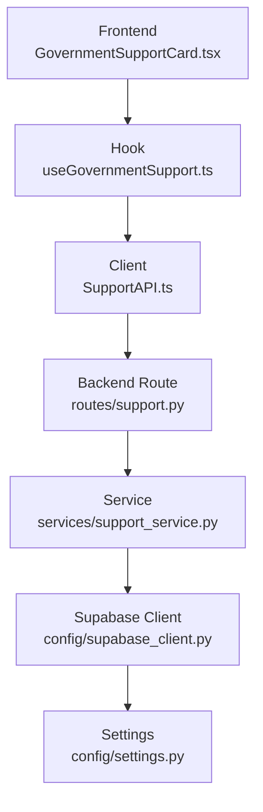
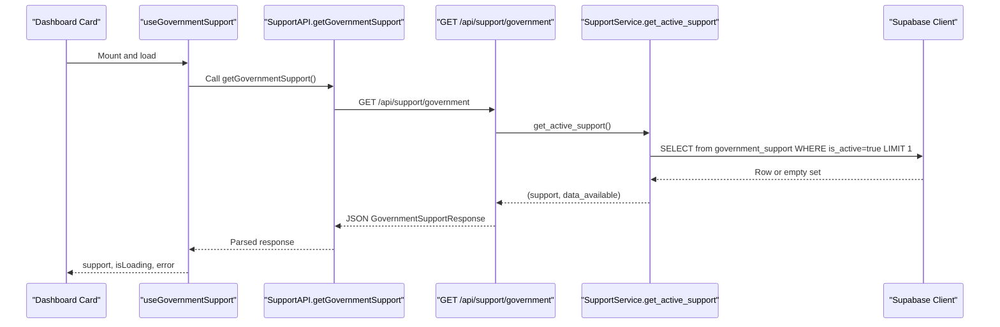
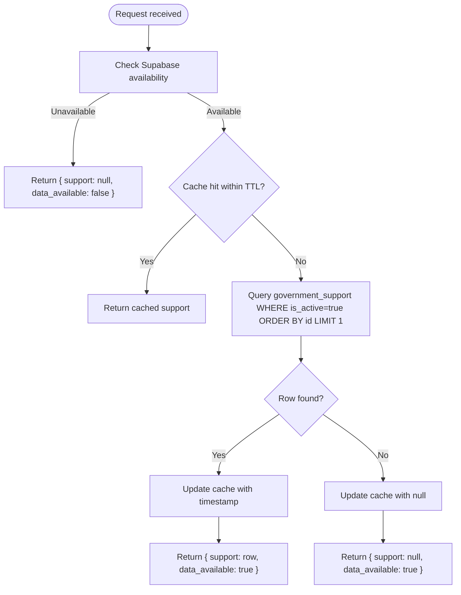
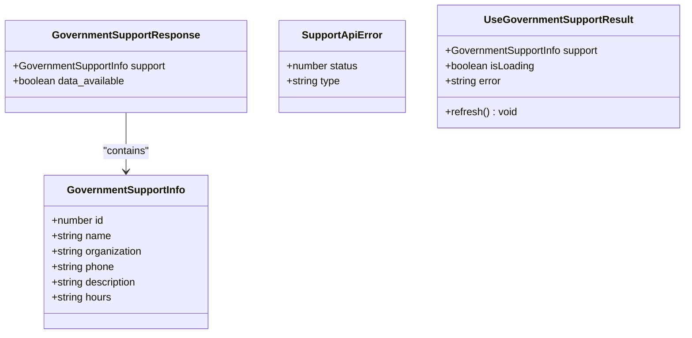
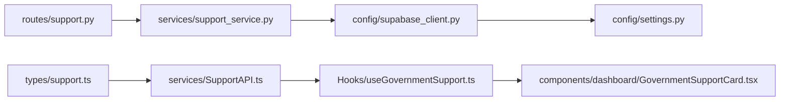

# Government Support API

<cite>
**Referenced Files in This Document**
- [support.py](file://Backend/routes/support.py)
- [support_service.py](file://Backend/services/support_service.py)
- [support.py (schemas)](file://Backend/schemas/support.py)
- [supabase_client.py](file://Backend/config/supabase_client.py)
- [settings.py](file://Backend/config/settings.py)
- [SupportAPI.ts](file://Frontend/greenflora/services/SupportAPI.ts)
- [support.ts (types)](file://Frontend/greenflora/types/support.ts)
- [useGovernmentSupport.ts](file://Frontend/greenflora/Hooks/useGovernmentSupport.ts)
- [GovernmentSupportCard.tsx](file://Frontend/greenflora/components/dashboard/GovernmentSupportCard.tsx)
</cite>

## Table of Contents
1. [Introduction](#introduction)
2. [Project Structure](#project-structure)
3. [Core Components](#core-components)
4. [Architecture Overview](#architecture-overview)
5. [Detailed Component Analysis](#detailed-component-analysis)
6. [Dependency Analysis](#dependency-analysis)
7. [Performance Considerations](#performance-considerations)
8. [Troubleshooting Guide](#troubleshooting-guide)
9. [Conclusion](#conclusion)

## Introduction
This document provides comprehensive API documentation for Green-Flora’s government support endpoints that expose agricultural helpline access and resource discovery services. The current implementation exposes a single public endpoint to retrieve the active official government support record used by the dashboard card. It returns contact details such as service name, organization, phone number, hours, and description sourced from the Supabase database table `government_support`.

The API is designed to be simple, reliable, and safe: it does not require authentication because the data is public reference information, and it degrades gracefully when the database is unavailable or when no active record exists.

## Project Structure
The government support feature spans backend routes, service logic, schemas, configuration, and frontend integration:

- Backend route defines the HTTP endpoint and error mapping.
- Service layer reads the active record from Supabase with caching.
- Schemas define response shapes for both backend and frontend.
- Configuration centralizes Supabase client setup and environment variables.
- Frontend types mirror backend schemas; a hook and API client call the endpoint; a dashboard component renders the result.

**Diagram sources**
- [GovernmentSupportCard.tsx:1-130](file://Frontend/greenflora/components/dashboard/GovernmentSupportCard.tsx#L1-L130)
- [useGovernmentSupport.ts:1-52](file://Frontend/greenflora/Hooks/useGovernmentSupport.ts#L1-L52)
- [SupportAPI.ts:1-102](file://Frontend/greenflora/services/SupportAPI.ts#L1-L102)
- [support.py:1-57](file://Backend/routes/support.py#L1-L57)
- [support_service.py:1-95](file://Backend/services/support_service.py#L1-L95)
- [supabase_client.py:1-47](file://Backend/config/supabase_client.py#L1-L47)
- [settings.py:1-123](file://Backend/config/settings.py#L1-L123)

**Section sources**
- [support.py:1-57](file://Backend/routes/support.py#L1-L57)
- [support_service.py:1-95](file://Backend/services/support_service.py#L1-L95)
- [support.py (schemas):1-41](file://Backend/schemas/support.py#L1-L41)
- [supabase_client.py:1-47](file://Backend/config/supabase_client.py#L1-L47)
- [settings.py:1-123](file://Backend/config/settings.py#L1-L123)
- [SupportAPI.ts:1-102](file://Frontend/greenflora/services/SupportAPI.ts#L1-L102)
- [support.ts (types):1-30](file://Frontend/greenflora/types/support.ts#L1-L30)
- [useGovernmentSupport.ts:1-52](file://Frontend/greenflora/Hooks/useGovernmentSupport.ts#L1-L52)
- [GovernmentSupportCard.tsx:1-130](file://Frontend/greenflora/components/dashboard/GovernmentSupportCard.tsx#L1-L130)

## Core Components
- Endpoint: GET /api/support/government
  - Purpose: Return the active official government support service (helpline) used by the dashboard card.
  - Authentication: Not required. Data is public reference information.
  - Response model: GovernmentSupportResponse containing an optional GovernmentSupportInfo and a boolean flag indicating whether data is available.

- Data source: Supabase table `government_support`
  - Query filters: Only rows where `is_active` is true are returned.
  - Fields selected: id, name, organization, phone, description, hours.

- Caching: In-memory cache with a short TTL to reduce database load.

- Error handling:
  - Database failures map to 503 Service Unavailable with a user-friendly message.
  - Unexpected errors map to 500 Internal Server Error.
  - When Supabase is not configured, the response includes data_available=false and support=null.

**Section sources**
- [support.py:28-57](file://Backend/routes/support.py#L28-L57)
- [support_service.py:33-95](file://Backend/services/support_service.py#L33-L95)
- [support.py (schemas):16-41](file://Backend/schemas/support.py#L16-L41)

## Architecture Overview
The request flow starts at the frontend dashboard card, which uses a React hook to fetch data via a typed API client. The backend route validates input (none needed), delegates to the service layer, which queries Supabase with filtering and ordering, caches the result briefly, and returns the structured response. Errors are caught and mapped to appropriate HTTP status codes.

**Diagram sources**
- [GovernmentSupportCard.tsx:61-129](file://Frontend/greenflora/components/dashboard/GovernmentSupportCard.tsx#L61-L129)
- [useGovernmentSupport.ts:22-51](file://Frontend/greenflora/Hooks/useGovernmentSupport.ts#L22-L51)
- [SupportAPI.ts:45-101](file://Frontend/greenflora/services/SupportAPI.ts#L45-L101)
- [support.py:32-57](file://Backend/routes/support.py#L32-L57)
- [support_service.py:51-90](file://Backend/services/support_service.py#L51-L90)
- [supabase_client.py:19-47](file://Backend/config/supabase_client.py#L19-L47)

## Detailed Component Analysis

### HTTP API: GET /api/support/government
- Method: GET
- Path: /api/support/government
- Headers: None required. Optional Authorization header is ignored by this endpoint.
- Query parameters: None.
- Request body: None.
- Success response: 200 OK with JSON GovernmentSupportResponse.
- Error responses:
  - 503 Service Unavailable when database operations fail.
  - 500 Internal Server Error for unexpected exceptions.
  - If Supabase is not configured, returns 200 with data_available=false and support=null.

#### Request examples
- Basic request without authentication:
  - GET http://localhost:8000/api/support/government
- With optional bearer token (ignored by endpoint):
  - GET http://localhost:8000/api/support/government
    - Authorization: Bearer <token>

#### Response schema
- GovernmentSupportResponse
  - support: GovernmentSupportInfo | null
  - data_available: boolean

- GovernmentSupportInfo
  - id: integer
  - name: string
  - organization: string
  - phone: string
  - description: string | null
  - hours: string | null

#### Example responses
- Active support present:
  - { "support": { "id": 1, "name": "Punjab Agriculture Helpline", "organization": "Agriculture Department, Government of Punjab", "phone": "0800-17000", "description": "Official helpline for farmers.", "hours": "8:00 AM - 8:00 PM" }, "data_available": true }
- No active record:
  - { "support": null, "data_available": true }
- Database not configured:
  - { "support": null, "data_available": false }

**Section sources**
- [support.py:28-57](file://Backend/routes/support.py#L28-L57)
- [support_service.py:51-90](file://Backend/services/support_service.py#L51-L90)
- [support.py (schemas):16-41](file://Backend/schemas/support.py#L16-L41)

### Data Model and Source
- Source table: government_support
- Filter: is_active = true
- Selected fields: id, name, organization, phone, description, hours
- Ordering: by id ascending, limited to one row
- Integrity rules:
  - Never fabricate helpline numbers, organizations, or hours.
  - If no active record exists, return null so the UI can render a fallback state.

**Diagram sources**
- [support_service.py:51-90](file://Backend/services/support_service.py#L51-L90)

**Section sources**
- [support_service.py:1-95](file://Backend/services/support_service.py#L1-L95)

### Frontend Integration
- Types: TypeScript interfaces mirror backend schemas for strong typing across the stack.
- API client: Centralized request helper with timeout, network error classification, and optional auth header injection.
- Hook: Encapsulates loading state, error handling, and refresh capability for the dashboard card.
- Dashboard card: Renders skeleton while loading, fallback when unavailable, and a dialable tel link using the phone number from the database.

**Diagram sources**
- [support.ts (types):10-29](file://Frontend/greenflora/types/support.ts#L10-L29)
- [SupportAPI.ts:21-43](file://Frontend/greenflora/services/SupportAPI.ts#L21-L43)
- [useGovernmentSupport.ts:15-20](file://Frontend/greenflora/Hooks/useGovernmentSupport.ts#L15-L20)

**Section sources**
- [support.ts (types):1-30](file://Frontend/greenflora/types/support.ts#L1-L30)
- [SupportAPI.ts:1-102](file://Frontend/greenflora/services/SupportAPI.ts#L1-L102)
- [useGovernmentSupport.ts:1-52](file://Frontend/greenflora/Hooks/useGovernmentSupport.ts#L1-L52)
- [GovernmentSupportCard.tsx:1-130](file://Frontend/greenflora/components/dashboard/GovernmentSupportCard.tsx#L1-L130)

## Dependency Analysis
- Route depends on service layer for business logic and data retrieval.
- Service depends on Supabase client configured via settings.
- Frontend types mirror backend schemas to ensure contract consistency.
- Frontend components depend on the hook and API client for data fetching and rendering.

**Diagram sources**
- [support.py:1-57](file://Backend/routes/support.py#L1-L57)
- [support_service.py:1-95](file://Backend/services/support_service.py#L1-L95)
- [supabase_client.py:1-47](file://Backend/config/supabase_client.py#L1-L47)
- [settings.py:1-123](file://Backend/config/settings.py#L1-L123)
- [support.ts (types):1-30](file://Frontend/greenflora/types/support.ts#L1-L30)
- [SupportAPI.ts:1-102](file://Frontend/greenflora/services/SupportAPI.ts#L1-L102)
- [useGovernmentSupport.ts:1-52](file://Frontend/greenflora/Hooks/useGovernmentSupport.ts#L1-L52)
- [GovernmentSupportCard.tsx:1-130](file://Frontend/greenflora/components/dashboard/GovernmentSupportCard.tsx#L1-L130)

**Section sources**
- [support.py:1-57](file://Backend/routes/support.py#L1-L57)
- [support_service.py:1-95](file://Backend/services/support_service.py#L1-L95)
- [supabase_client.py:1-47](file://Backend/config/supabase_client.py#L1-L47)
- [settings.py:1-123](file://Backend/config/settings.py#L1-L123)
- [support.ts (types):1-30](file://Frontend/greenflora/types/support.ts#L1-L30)
- [SupportAPI.ts:1-102](file://Frontend/greenflora/services/SupportAPI.ts#L1-L102)
- [useGovernmentSupport.ts:1-52](file://Frontend/greenflora/Hooks/useGovernmentSupport.ts#L1-L52)
- [GovernmentSupportCard.tsx:1-130](file://Frontend/greenflora/components/dashboard/GovernmentSupportCard.tsx#L1-L130)

## Performance Considerations
- In-memory caching: The service caches the active support record for a short TTL to minimize database calls.
- Minimal payload: Only necessary fields are selected from the database.
- Lightweight route: The route performs validation and error mapping only, keeping request processing fast.
- Frontend timeouts: The client enforces a request timeout to avoid hanging requests.

[No sources needed since this section provides general guidance]

## Troubleshooting Guide
Common issues and resolutions:

- 503 Service Unavailable:
  - Cause: Database query failed or runtime exception during support retrieval.
  - Action: Retry after a short delay; check Supabase connectivity and credentials.

- 500 Internal Server Error:
  - Cause: Unexpected exception in the route or service layer.
  - Action: Inspect server logs for stack traces; verify environment configuration.

- data_available=false:
  - Cause: Supabase client not configured (missing URL or service key).
  - Action: Set SUPABASE_URL and SUPABASE_SERVICE_KEY in environment; restart the backend.

- support=null:
  - Cause: No active record found in the database.
  - Action: Ensure a row exists in government_support with is_active=true.

- Frontend errors:
  - Network or timeout errors are classified and surfaced to the UI; users see a fallback state when data is unavailable.
  - Refresh functionality allows re-fetching data if transient issues occur.

**Section sources**
- [support.py:45-57](file://Backend/routes/support.py#L45-L57)
- [support_service.py:62-90](file://Backend/services/support_service.py#L62-L90)
- [SupportAPI.ts:37-93](file://Frontend/greenflora/services/SupportAPI.ts#L37-L93)
- [useGovernmentSupport.ts:27-43](file://Frontend/greenflora/Hooks/useGovernmentSupport.ts#L27-L43)
- [GovernmentSupportCard.tsx:47-70](file://Frontend/greenflora/components/dashboard/GovernmentSupportCard.tsx#L47-L70)

## Conclusion
Green-Flora’s government support API provides a minimal, robust endpoint to retrieve the active official agricultural helpline information. It emphasizes data integrity, graceful degradation, and clear error signaling. The frontend integrates seamlessly with strong typing and resilient error handling, ensuring users always see meaningful states even when data is temporarily unavailable.

[No sources needed since this section summarizes without analyzing specific files]