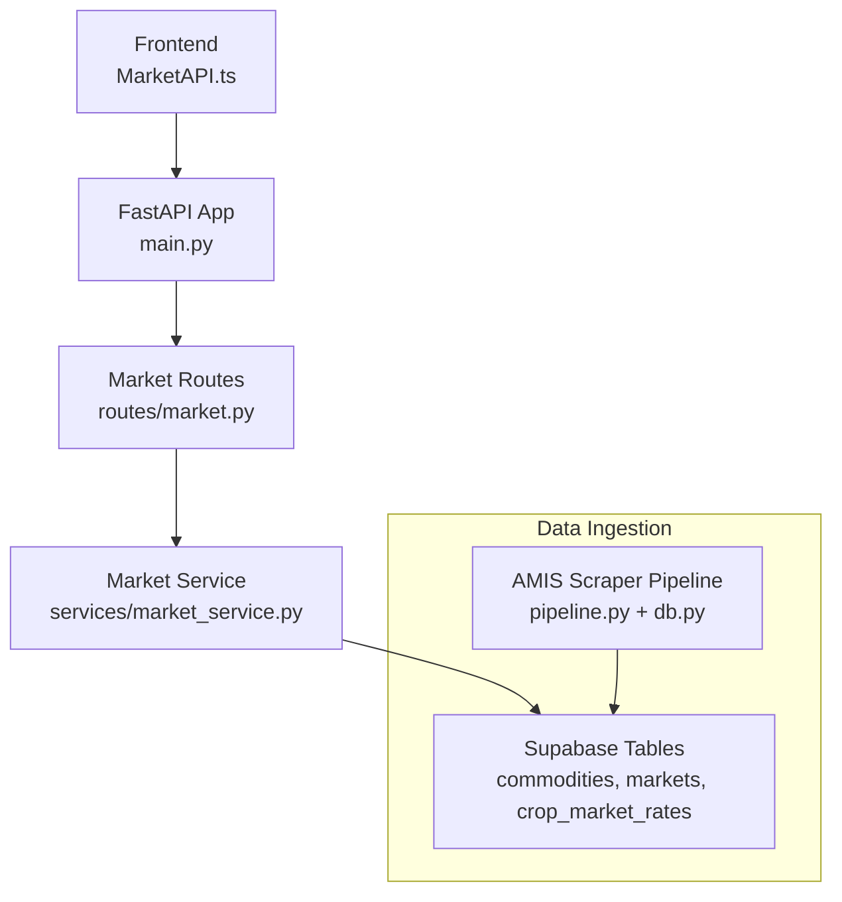
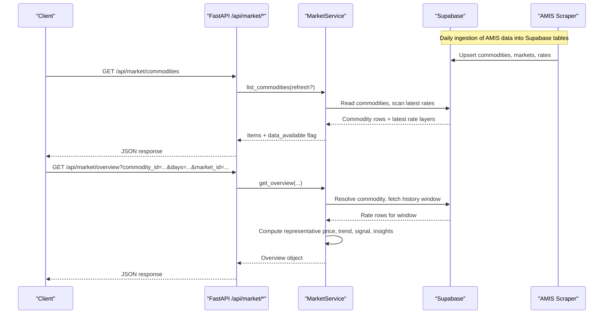
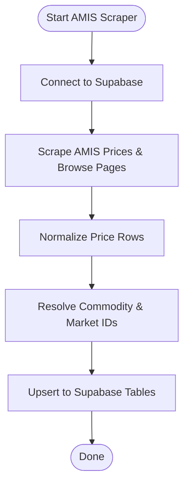
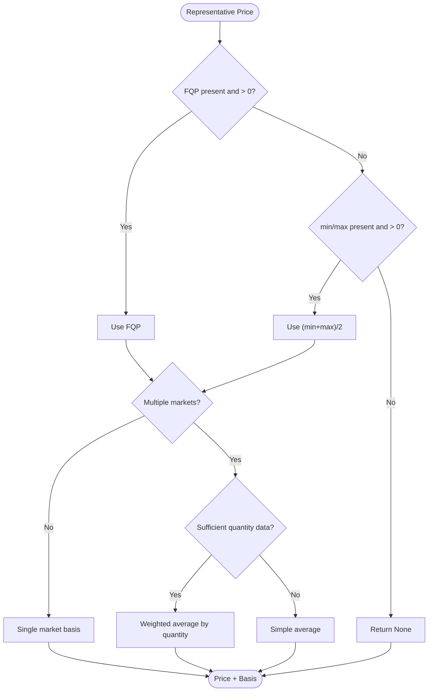
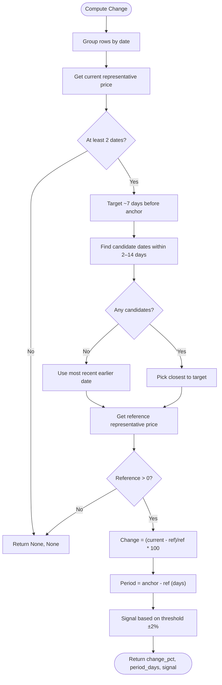
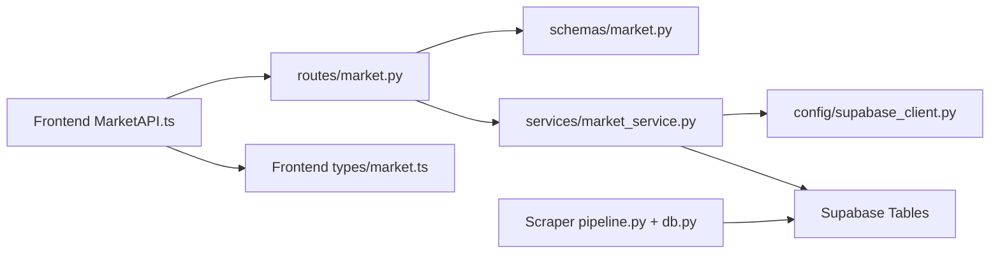

# Market Data API

<cite>
**Referenced Files in This Document**
- [main.py](file://Backend/main.py)
- [market.py](file://Backend/routes/market.py)
- [market_service.py](file://Backend/services/market_service.py)
- [market.py (schemas)](file://Backend/schemas/market.py)
- [supabase_client.py](file://Backend/config/supabase_client.py)
- [MarketAPI.ts](file://Frontend/greenflora/services/MarketAPI.ts)
- [market.ts (types)](file://Frontend/greenflora/types/market.ts)
- [config.py (Scraper)](file://Scraper/config.py)
- [pipeline.py (Scraper)](file://Scraper/pipeline.py)
- [db.py (Scraper)](file://Scraper/db.py)
</cite>

## Table of Contents
1. [Introduction](#introduction)
2. [Project Structure](#project-structure)
3. [Core Components](#core-components)
4. [Architecture Overview](#architecture-overview)
5. [Detailed Component Analysis](#detailed-component-analysis)
6. [Dependency Analysis](#dependency-analysis)
7. [Performance Considerations](#performance-considerations)
8. [Troubleshooting Guide](#troubleshooting-guide)
9. [Conclusion](#conclusion)
10. [Appendices](#appendices)

## Introduction
This document provides comprehensive API documentation for Green-Flora’s market data endpoints that expose commodity pricing, trend analysis, and market intelligence services. The endpoints serve public AMIS (Agriculture Marketing Information Service) reference data ingested into a Supabase database by a daily scraper pipeline. They enable clients to:
- List available commodities with latest prices
- Retrieve current prices, price changes, signals, and market comparisons
- Fetch historical price trends over configurable windows
- Compare prices across markets and view arrivals distribution

Authentication is not required for these endpoints because the data is public government reference data.

## Project Structure
The market feature spans backend routes, service logic, schemas, and frontend integration:
- Backend routes define HTTP endpoints under /api/market
- A service layer reads from Supabase tables populated by the AMIS scraper
- Schemas define request/response contracts
- Frontend types mirror backend schemas and provide typed client calls

**Diagram sources**
- [main.py:15-47](file://Backend/main.py#L15-L47)
- [market.py:31-108](file://Backend/routes/market.py#L31-L108)
- [market_service.py:47-653](file://Backend/services/market_service.py#L47-L653)
- [pipeline.py:56-187](file://Scraper/pipeline.py#L56-L187)
- [db.py:145-307](file://Scraper/db.py#L145-L307)

**Section sources**
- [main.py:15-47](file://Backend/main.py#L15-L47)
- [market.py:31-108](file://Backend/routes/market.py#L31-L108)
- [market_service.py:47-653](file://Backend/services/market_service.py#L47-L653)

## Core Components
- Market routes: Thin FastAPI endpoints that validate inputs and delegate to the service layer.
- Market service: Business logic that queries Supabase, computes representative prices, trends, signals, and insights.
- Schemas: Pydantic models defining response structures for consumers.
- Frontend integration: TypeScript client with typed requests and error classification.

Key responsibilities:
- Commodities list: Returns crops with latest date and representative price for selection UI.
- Market overview: Returns full intelligence bundle for one crop including current price, change, signal, highest/lowest markets, spread, trend series, market comparison, distribution, and insights.

**Section sources**
- [market.py:38-108](file://Backend/routes/market.py#L38-L108)
- [market_service.py:59-343](file://Backend/services/market_service.py#L59-L343)
- [market.py (schemas):22-132](file://Backend/schemas/market.py#L22-L132)
- [MarketAPI.ts:100-127](file://Frontend/greenflora/services/MarketAPI.ts#L100-L127)
- [market.ts (types):11-120](file://Frontend/greenflora/types/market.ts#L11-L120)

## Architecture Overview
The system integrates an external data source (AMIS) via a scraper pipeline that populates Supabase tables. The backend exposes read-only endpoints that compute derived metrics on top of this data.

**Diagram sources**
- [market.py:38-108](file://Backend/routes/market.py#L38-L108)
- [market_service.py:59-343](file://Backend/services/market_service.py#L59-L343)
- [pipeline.py:56-187](file://Scraper/pipeline.py#L56-L187)

## Detailed Component Analysis

### Endpoints

#### GET /api/market/commodities
- Purpose: Return all crops with AMIS price data, including latest date and representative price for the crop selector.
- Query parameters:
  - refresh: boolean (default false). When true, bypasses in-memory cache to force a fresh read.
- Response schema: MarketCommoditiesResponse
  - commodities: array of MarketCommodityItem
  - total: integer count of items
  - data_available: boolean indicating whether any AMIS data has been ingested
- Authentication: Not required (public AMIS data)
- Error handling:
  - 503 Service Unavailable when underlying data cannot be loaded
  - 500 Internal Server Error for unexpected failures

Example call:
- GET /api/market/commodities
- GET /api/market/commodities?refresh=true

**Section sources**
- [market.py:38-62](file://Backend/routes/market.py#L38-L62)
- [market_service.py:59-152](file://Backend/services/market_service.py#L59-L152)
- [market.py (schemas):22-44](file://Backend/schemas/market.py#L22-L44)

#### GET /api/market/overview
- Purpose: Return complete market-intelligence bundle for one crop: current price, change, signal, highest/lowest markets, spread, trend series, market comparison, arrivals distribution, and farmer insights.
- Query parameters:
  - commodity_id: string (required). UUID of the commodity.
  - days: integer (optional, default 180). History window in days; validated between 1 and 365.
  - market_id: string (optional). UUID to scope the trend series to a single market.
- Response schema: MarketOverviewResponse
  - commodity_id, commodity_name, category, unit
  - latest_date, first_date, days_of_data, markets_reporting
  - current_price, price_basis, change_pct, change_period_days, signal
  - highest_market, lowest_market, spread_abs, spread_pct
  - trend: array of MarketTrendPoint
  - trend_market_id: optional market UUID or null for all-market average
  - market_comparison: array of MarketComparisonEntry
  - distribution: optional MarketDistribution
  - insights: array of strings
- Authentication: Not required (public AMIS data)
- Error handling:
  - 404 Not Found when commodity or market ID is invalid
  - 503 Service Unavailable when data cannot be loaded
  - 500 Internal Server Error for unexpected failures

Example calls:
- GET /api/market/overview?commodity_id=<uuid>&days=180
- GET /api/market/overview?commodity_id=<uuid>&days=30&market_id=<uuid>

**Section sources**
- [market.py:69-108](file://Backend/routes/market.py#L69-L108)
- [market_service.py:158-343](file://Backend/services/market_service.py#L158-L343)
- [market.py (schemas):50-132](file://Backend/schemas/market.py#L50-L132)

### Request and Response Schemas

#### Commodities List
- MarketCommodityItem fields:
  - id: string
  - name: string
  - category: string | null
  - unit: string | null
  - latest_date: string | null (ISO date)
  - latest_price: number | null
  - markets_reporting: integer
- MarketCommoditiesResponse fields:
  - commodities: array of MarketCommodityItem
  - total: integer
  - data_available: boolean

**Section sources**
- [market.py (schemas):22-44](file://Backend/schemas/market.py#L22-L44)

#### Market Overview
- MarketComparisonEntry fields:
  - market_id: string
  - name: string
  - price: number
  - min_price: number | null
  - max_price: number | null
  - quantity: number | null
  - date: string | null
- MarketTrendPoint fields:
  - date: string
  - price: number
- MarketDistributionEntry fields:
  - market_id: string
  - name: string
  - quantity: number
  - share_pct: number
- MarketDistribution fields:
  - entries: array of MarketDistributionEntry
  - total_quantity: number
- MarketSignal values: "rising", "falling", "stable", "insufficient_data"
- MarketOverviewResponse fields:
  - commodity_id, commodity_name, category, unit
  - latest_date, first_date, days_of_data, markets_reporting
  - current_price, price_basis ("weighted" | "average" | "single" | "unknown")
  - change_pct, change_period_days, signal
  - highest_market, lowest_market, spread_abs, spread_pct
  - trend: array of MarketTrendPoint
  - trend_market_id: string | null
  - market_comparison: array of MarketComparisonEntry
  - distribution: MarketDistribution | null
  - insights: array of strings

**Section sources**
- [market.py (schemas):50-132](file://Backend/schemas/market.py#L50-L132)

### Data Freshness Indicators
- data_available: Indicates whether any AMIS data has been ingested yet.
- latest_date: Most recent date with reported prices for the selected commodity.
- days_of_data: Number of distinct dates with price data in the fetched window.
- markets_reporting: Number of markets reporting prices on the latest date.
- price_basis: How the current price was derived (e.g., weighted average, simple average, single market, unknown).

**Section sources**
- [market.py (schemas):22-44](file://Backend/schemas/market.py#L22-L44)
- [market.py (schemas):92-132](file://Backend/schemas/market.py#L92-L132)
- [market_service.py:59-152](file://Backend/services/market_service.py#L59-L152)
- [market_service.py:158-343](file://Backend/services/market_service.py#L158-L343)

### Integration with AMIS
- Data source: AMIS (Punjab Agriculture Marketing) website.
- Ingestion: A Python scraper pipeline runs daily to scrape AMIS pages, normalize data, resolve commodity and market IDs, and upsert into Supabase tables (commodities, markets, crop_market_rates).
- Configuration: Base URLs, timeouts, retries, user agent, and table names are defined in the scraper configuration.
- Database access: Backend uses a centralized Supabase client configured with HTTP/1.1 and connection limits to avoid intermittent errors.

**Diagram sources**
- [pipeline.py:56-187](file://Scraper/pipeline.py#L56-L187)
- [db.py:145-307](file://Scraper/db.py#L145-L307)
- [config.py (Scraper):18-70](file://Scraper/config.py#L18-L70)

**Section sources**
- [config.py (Scraper):18-70](file://Scraper/config.py#L18-L70)
- [pipeline.py:56-187](file://Scraper/pipeline.py#L56-L187)
- [db.py:145-307](file://Scraper/db.py#L145-L307)
- [supabase_client.py:16-47](file://Backend/config/supabase_client.py#L16-L47)

### Caching Strategies and Update Frequencies
- In-memory caches:
  - Commodities list cached for 10 minutes to keep the crop selector snappy.
  - Markets lookup map cached for 10 minutes.
- Cache bypass:
  - The commodities endpoint supports a refresh parameter to force re-fetching from the database.
- Update frequency:
  - AMIS data is updated daily by the scraper pipeline; therefore, caches are suitable for short TTLs.

**Section sources**
- [market_service.py:36-44](file://Backend/services/market_service.py#L36-L44)
- [market_service.py:59-152](file://Backend/services/market_service.py#L59-L152)
- [market_service.py:626-640](file://Backend/services/market_service.py#L626-L640)

### Processing Logic

#### Representative Price Calculation
- Preferred FQP (Fair Quality Price) when present and positive.
- If FQP is absent, use midpoint of min/max prices when both are provided and at least one is positive.
- For multiple markets on the same date:
  - Weighted average if sufficient markets report positive quantities (threshold: at least two or 80% of entries).
  - Otherwise, simple average across markets.
- Basis labels: "weighted", "average", "single", "unknown".

**Diagram sources**
- [market_service.py:349-392](file://Backend/services/market_service.py#L349-L392)

**Section sources**
- [market_service.py:349-392](file://Backend/services/market_service.py#L349-L392)

#### Trend Series and Change Signal
- Trend series:
  - Daily price points for either a specific market (if market_id provided) or all-market average.
  - Built by grouping rate rows by date and computing representative price per day.
- Percent change:
  - Compares current representative price to a reference point approximately 7 days earlier (acceptable range 2–14 days), falling back to the most recent earlier date if necessary.
  - Returns change percentage and period length in days.
- Signal:
  - "rising" if change >= +2%
  - "falling" if change <= -2%
  - "stable" otherwise
  - "insufficient_data" when not enough data to compute

**Diagram sources**
- [market_service.py:398-468](file://Backend/services/market_service.py#L398-L468)

**Section sources**
- [market_service.py:398-468](file://Backend/services/market_service.py#L398-L468)

### Frontend Integration
- MarketAPI.ts provides typed functions to call backend endpoints:
  - getMarketCommodities(): returns commodities list
  - getMarketOverview(params): returns overview with optional market scoping
- Error handling:
  - Classifies errors as network, timeout, validation, server, or unknown
  - Enforces a 30-second request timeout
- Optional Authorization header:
  - Includes stored access token if present, though authentication is not required for market endpoints

**Section sources**
- [MarketAPI.ts:1-127](file://Frontend/greenflora/services/MarketAPI.ts#L1-L127)
- [market.ts (types):11-120](file://Frontend/greenflora/types/market.ts#L11-L120)

## Dependency Analysis
- Routes depend on schemas and service layer.
- Service depends on Supabase client and reads from three tables: commodities, markets, crop_market_rates.
- Frontend types mirror backend schemas to ensure type safety.
- Scraper pipeline writes to the same tables used by the service.

**Diagram sources**
- [market.py:23-27](file://Backend/routes/market.py#L23-L27)
- [market_service.py:31-32](file://Backend/services/market_service.py#L31-L32)
- [supabase_client.py:16-47](file://Backend/config/supabase_client.py#L16-L47)
- [MarketAPI.ts:11-14](file://Frontend/greenflora/services/MarketAPI.ts#L11-L14)
- [market.ts (types):1-120](file://Frontend/greenflora/types/market.ts#L1-L120)
- [pipeline.py:56-187](file://Scraper/pipeline.py#L56-L187)
- [db.py:145-307](file://Scraper/db.py#L145-L307)

**Section sources**
- [market.py:23-27](file://Backend/routes/market.py#L23-L27)
- [market_service.py:31-32](file://Backend/services/market_service.py#L31-L32)
- [supabase_client.py:16-47](file://Backend/config/supabase_client.py#L16-L47)
- [MarketAPI.ts:11-14](file://Frontend/greenflora/services/MarketAPI.ts#L11-L14)
- [market.ts (types):1-120](file://Frontend/greenflora/types/market.ts#L1-L120)
- [pipeline.py:56-187](file://Scraper/pipeline.py#L56-L187)
- [db.py:145-307](file://Scraper/db.py#L145-L307)

## Performance Considerations
- In-memory caching:
  - Commodities list and markets map cached for 10 minutes to reduce database load and improve responsiveness.
- Pagination:
  - Rate scans use page sizes capped at 1000 rows to prevent large payloads.
- Row limits:
  - Commodities list scan limited to 15000 rows.
  - Overview history limited to 25000 rows per commodity.
- Connection tuning:
  - Supabase client uses HTTP/1.1 with explicit timeouts and connection limits to avoid socket errors.
- Process timing:
  - Global middleware adds X-Process-Time header to responses for debugging performance.

Recommendations:
- Use refresh=false for normal operations to benefit from caching.
- Limit days to reasonable windows (e.g., 7–180) to control payload size and query time.
- Monitor X-Process-Time to identify slow endpoints and optimize as needed.

**Section sources**
- [market_service.py:36-44](file://Backend/services/market_service.py#L36-L44)
- [market_service.py:98-131](file://Backend/services/market_service.py#L98-L131)
- [market_service.py:599-624](file://Backend/services/market_service.py#L599-L624)
- [supabase_client.py:21-47](file://Backend/config/supabase_client.py#L21-L47)
- [main.py:31-38](file://Backend/main.py#L31-L38)

## Troubleshooting Guide
Common issues and resolutions:
- No data available:
  - data_available may be false if the AMIS pipeline has not ingested data yet. Wait for the next daily update.
- Empty overview:
  - Ensure commodity_id is valid and exists. Invalid IDs result in 404.
- Service unavailable:
  - 503 indicates temporary inability to load market data (e.g., database connectivity issues). Retry later.
- Unexpected errors:
  - 500 indicates internal server errors. Check logs and retry after a short delay.
- Frontend timeouts:
  - Requests timeout after 30 seconds. Verify network connectivity and consider reducing days or filtering by market_id.

Debugging tips:
- Use refresh=true on the commodities endpoint to bypass cache and verify live data.
- Inspect X-Process-Time header to measure endpoint latency.
- Validate commodity_id and market_id formats (UUIDs) before calling overview.

**Section sources**
- [market.py:51-62](file://Backend/routes/market.py#L51-L62)
- [market.py:94-108](file://Backend/routes/market.py#L94-L108)
- [market_service.py:67-68](file://Backend/services/market_service.py#L67-L68)
- [market_service.py:176-192](file://Backend/services/market_service.py#L176-L192)
- [MarketAPI.ts:38-93](file://Frontend/greenflora/services/MarketAPI.ts#L38-L93)

## Conclusion
Green-Flora’s Market Data API provides reliable access to AMIS-derived commodity pricing, trends, and market intelligence through two primary endpoints. The service layer computes representative prices, trends, and signals while maintaining honest empty states when data is missing. Caching and pagination ensure responsive performance, and clear error codes help clients handle unavailability gracefully. The daily AMIS scraper pipeline keeps data fresh, enabling accurate insights for farmers and applications.

## Appendices

### Example API Calls

- List commodities:
  - GET /api/market/commodities
  - GET /api/market/commodities?refresh=true

- Get market overview (all markets):
  - GET /api/market/overview?commodity_id=<uuid>&days=180

- Get market overview (specific market):
  - GET /api/market/overview?commodity_id=<uuid>&days=30&market_id=<uuid>

**Section sources**
- [market.py:38-108](file://Backend/routes/market.py#L38-L108)
- [MarketAPI.ts:100-127](file://Frontend/greenflora/services/MarketAPI.ts#L100-L127)