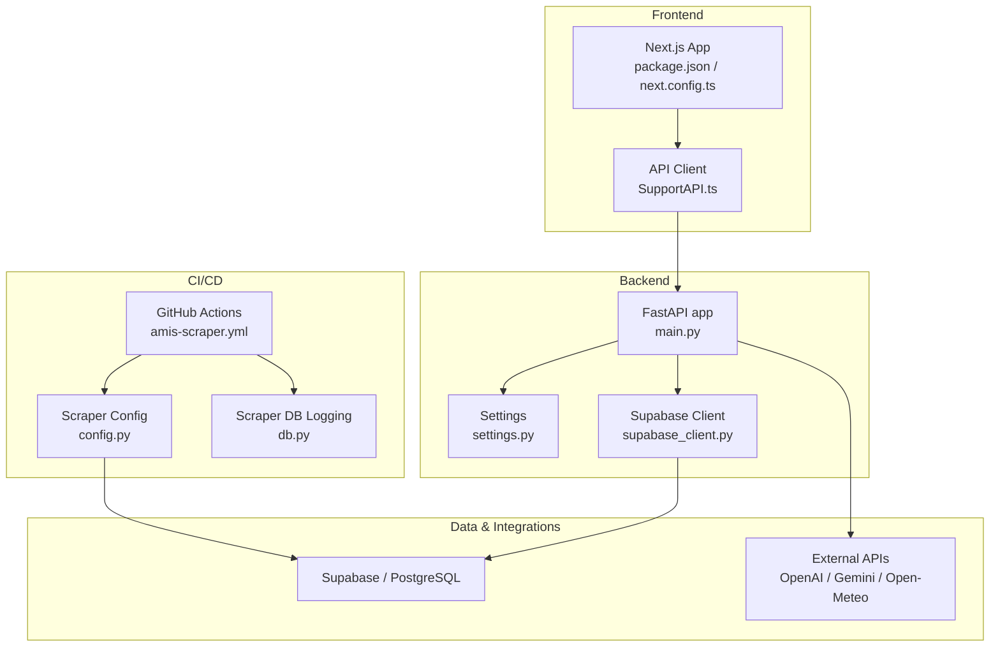
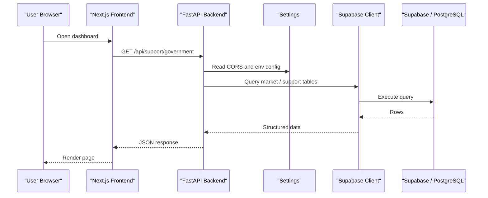
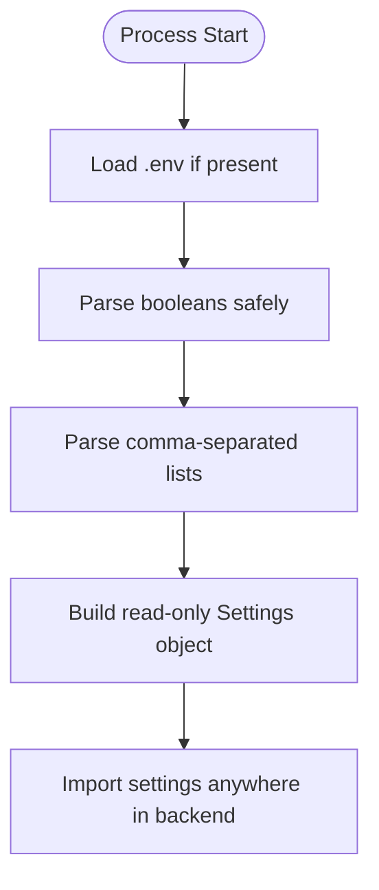
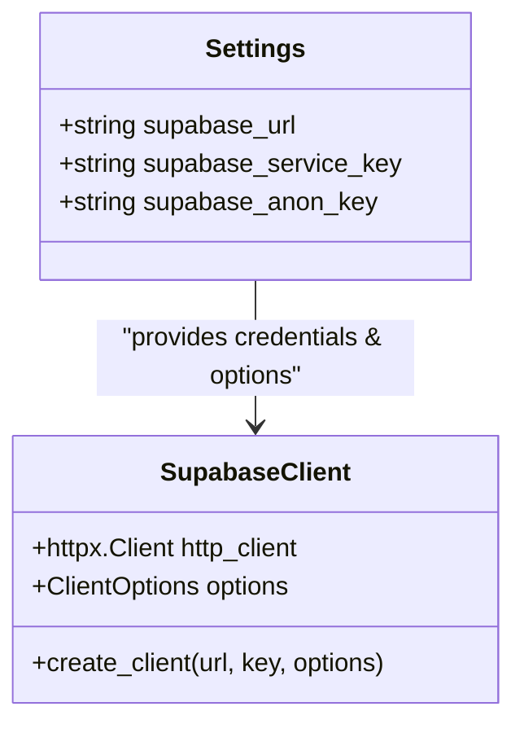
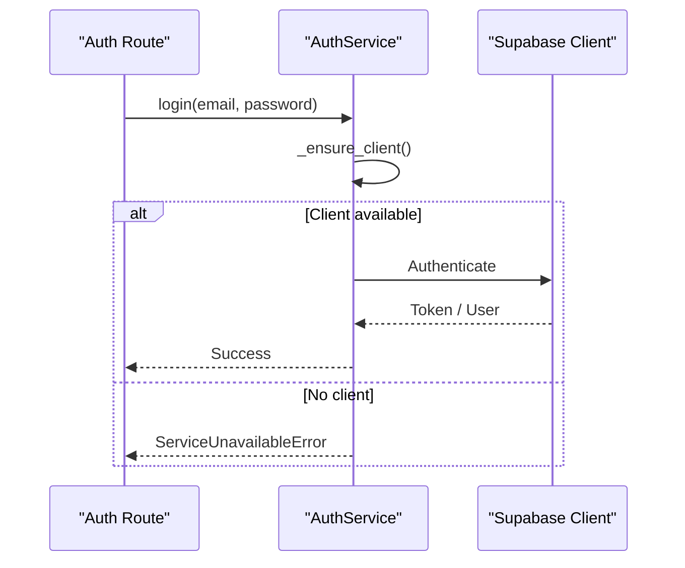
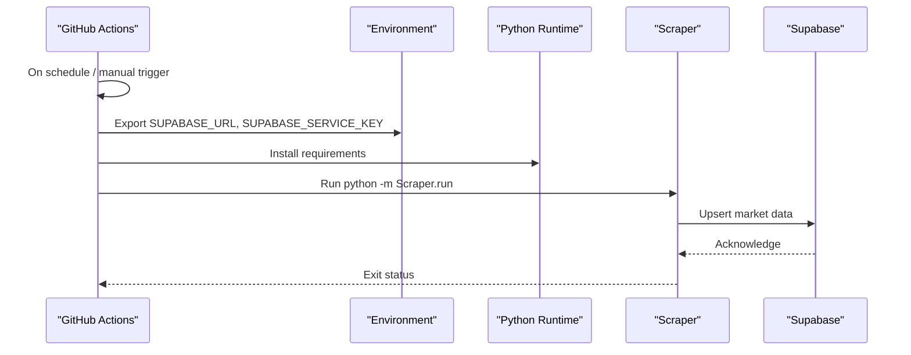
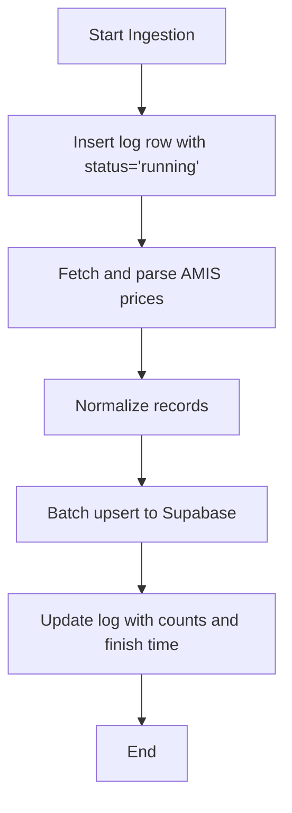
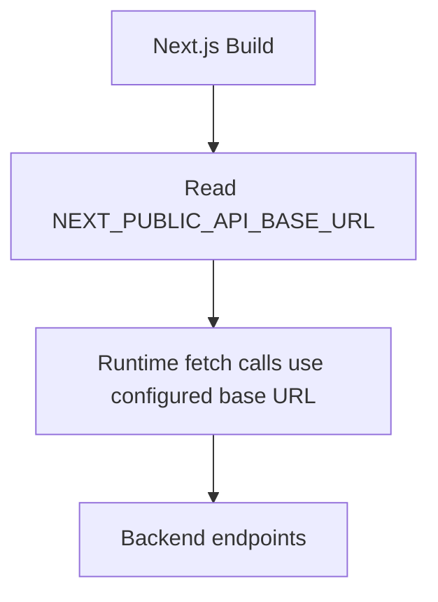
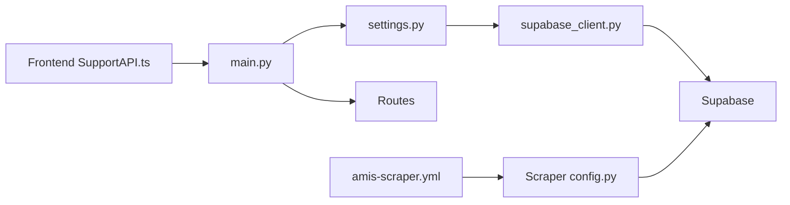

# Configuration and Deployment

<cite>
**Referenced Files in This Document**
- [settings.py](file://Backend/config/settings.py)
- [supabase_client.py](file://Backend/config/supabase_client.py)
- [main.py](file://Backend/main.py)
- [amis-scraper.yml](file://.github/workflows/amis-scraper.yml)
- [config.py](file://Scraper/config.py)
- [db.py](file://Scraper/db.py)
- [requirements.txt](file://Scraper/requirements.txt)
- [package.json](file://Frontend/greenflora/package.json)
- [next.config.ts](file://Frontend/greenflora/next.config.ts)
- [SupportAPI.ts](file://Frontend/greenflora/services/SupportAPI.ts)
- [auth_service.py](file://Backend/services/auth_service.py)
- [architechture.md](file://architechture.md)
- [README.md](file://README.md)
</cite>

## Table of Contents
1. Introduction
2. Project Structure
3. Core Components
4. Architecture Overview
5. Detailed Component Analysis
6. Dependency Analysis
7. Performance Considerations
8. Troubleshooting Guide
9. Conclusion
10. Appendices

## Introduction
This document explains how Green Flora is configured and deployed across development, staging, and production environments. It covers centralized configuration management, environment variable handling, secret management practices, Supabase client setup for database connections and authentication, CI/CD automation with GitHub Actions, deployment strategies, monitoring and logging, error tracking, performance monitoring, scaling considerations, backups, and disaster recovery planning.

## Project Structure
Green Flora consists of:
- Backend (FastAPI): Centralized settings and Supabase client initialization; routes and services depend on these modules.
- Frontend (Next.js): Builds and runs the user interface; communicates with the backend via a configurable base URL.
- Scraper (Python): Scheduled ingestion job that scrapes market data from AMIS and writes to Supabase.
- CI/CD: GitHub Actions workflow that runs the scraper on a schedule or manually.

**Diagram sources**
- [main.py:15-57](file://Backend/main.py#L15-L57)
- [settings.py:48-122](file://Backend/config/settings.py#L48-L122)
- [supabase_client.py:16-47](file://Backend/config/supabase_client.py#L16-L47)
- [package.json:5-10](file://Frontend/greenflora/package.json#L5-L10)
- [next.config.ts:1-8](file://Frontend/greenflora/next.config.ts#L1-L8)
- [SupportAPI.ts:16-18](file://Frontend/greenflora/services/SupportAPI.ts#L16-L18)
- [amis-scraper.yml:15-45](file://.github/workflows/amis-scraper.yml#L15-L45)
- [config.py:22-63](file://Scraper/config.py#L22-L63)
- [db.py:424-496](file://Scraper/db.py#L424-L496)

**Section sources**
- [architechture.md:1-80](file://architechture.md#L1-L80)
- [README.md:53-70](file://README.md#L53-L70)

## Core Components
- Centralized Settings: All backend configuration is loaded from environment variables into a single read-only instance used throughout the application.
- Supabase Client: A shared HTTPX-backed Supabase client is created only when credentials are present, with explicit timeouts and connection limits.
- FastAPI Application: Registers CORS middleware using configured origins, includes routers, exposes a health endpoint, and adds request timing headers.
- Frontend API Base URL: The Next.js frontend uses an environment variable to point to the backend API, defaulting to localhost for development.
- CI/CD Workflow: A scheduled GitHub Action runs the Python scraper daily, installs dependencies, and executes ingestion against Supabase using secrets.

**Section sources**
- [settings.py:24-122](file://Backend/config/settings.py#L24-L122)
- [supabase_client.py:16-47](file://Backend/config/supabase_client.py#L16-L47)
- [main.py:15-57](file://Backend/main.py#L15-L57)
- [SupportAPI.ts:16-18](file://Frontend/greenflora/services/SupportAPI.ts#L16-L18)
- [amis-scraper.yml:15-45](file://.github/workflows/amis-scraper.yml#L15-L45)

## Architecture Overview
The system follows a clear separation between UI, API, data, and external integrations. The backend centralizes configuration and provides a stable Supabase client. The frontend calls the backend through a configurable base URL. Market data is ingested by a scheduled job into Supabase, which both the UI and AI assistant consume.

**Diagram sources**
- [SupportAPI.ts:45-101](file://Frontend/greenflora/services/SupportAPI.ts#L45-L101)
- [main.py:21-52](file://Backend/main.py#L21-L52)
- [settings.py:64-73](file://Backend/config/settings.py#L64-L73)
- [supabase_client.py:19-47](file://Backend/config/supabase_client.py#L19-L47)

## Detailed Component Analysis

### Centralized Configuration Management
- Environment Loading: The backend loads variables from a local .env file at startup and reads them via os.getenv with sensible defaults.
- Types and Helpers: Boolean parsing and list parsing helpers normalize environment values consistently.
- Key Settings:
  - Demo mode toggle
  - Database URL
  - CORS origins
  - Supabase URL and keys
  - External API keys (weather, Alibaba, Gemini, OpenAI)
  - AI model selection and timeouts
  - Application name and environment label

Secrets are never hard-coded; they are provided via environment variables or platform secret stores.

**Diagram sources**
- [settings.py:24-46](file://Backend/config/settings.py#L24-L46)
- [settings.py:48-122](file://Backend/config/settings.py#L48-L122)

**Section sources**
- [settings.py:24-122](file://Backend/config/settings.py#L24-L122)

### Supabase Client Configuration
- Conditional Initialization: The client is created only when both URL and service key are set, enabling graceful degradation in demo mode.
- HTTP Tuning: Uses a dedicated HTTPX client with HTTP/1.1 disabled for HTTP/2 issues, plus explicit connect/read/write/pool timeouts and connection limits.
- Client Options: PostgREST, Storage, and Function timeouts are set to ensure predictable behavior under load.

**Diagram sources**
- [settings.py:70-73](file://Backend/config/settings.py#L70-L73)
- [supabase_client.py:19-47](file://Backend/config/supabase_client.py#L19-L47)

**Section sources**
- [supabase_client.py:1-47](file://Backend/config/supabase_client.py#L1-L47)

### Authentication Setup
- Service Layer: Authentication logic is encapsulated in a service that raises specific errors when Supabase is not configured or unreachable, allowing routes to respond gracefully.
- Error Handling: Distinct exceptions distinguish service unavailability from authentication failures.

**Diagram sources**
- [auth_service.py:1-43](file://Backend/services/auth_service.py#L1-L43)

**Section sources**
- [auth_service.py:1-43](file://Backend/services/auth_service.py#L1-L43)

### CI/CD Pipeline Automation
- Schedule and Trigger: Runs daily at a fixed time and supports manual dispatch.
- Secrets: Reads Supabase URL and service key from GitHub Secrets.
- Steps: Checks out code, sets up Python, installs requirements, and runs the scraper module.

**Diagram sources**
- [amis-scraper.yml:15-45](file://.github/workflows/amis-scraper.yml#L15-L45)
- [requirements.txt:1-5](file://Scraper/requirements.txt#L1-L5)

**Section sources**
- [amis-scraper.yml:1-46](file://.github/workflows/amis-scraper.yml#L1-L46)
- [requirements.txt:1-5](file://Scraper/requirements.txt#L1-L5)

### Scraper Configuration and Ingestion Logging
- Configuration: Centralized constants for URLs, timeouts, retries, batch size, table names, and ingestion source identifier.
- Logging: Inserts a “running” log entry at start and updates it with final counts and timestamps upon completion, including optional error messages.

**Diagram sources**
- [config.py:22-63](file://Scraper/config.py#L22-L63)
- [db.py:424-496](file://Scraper/db.py#L424-L496)

**Section sources**
- [config.py:1-70](file://Scraper/config.py#L1-L70)
- [db.py:424-496](file://Scraper/db.py#L424-L496)

### Frontend Configuration and API Base URL
- Scripts: Standard dev/build/start/lint scripts for Next.js.
- API Base URL: The frontend uses an environment variable to configure the backend base URL, defaulting to localhost for local development.

**Diagram sources**
- [package.json:5-10](file://Frontend/greenflora/package.json#L5-L10)
- [SupportAPI.ts:16-18](file://Frontend/greenflora/services/SupportAPI.ts#L16-L18)

**Section sources**
- [package.json:1-32](file://Frontend/greenflora/package.json#L1-L32)
- [SupportAPI.ts:16-18](file://Frontend/greenflora/services/SupportAPI.ts#L16-L18)

## Dependency Analysis
- Backend depends on centralized settings and a conditionally initialized Supabase client.
- Routes import routers and rely on CORS and middleware configured in the main application.
- Frontend depends on environment variables to locate the backend API.
- CI/CD depends on GitHub Secrets and Python runtime to run the scraper.

**Diagram sources**
- [main.py:15-57](file://Backend/main.py#L15-L57)
- [settings.py:48-122](file://Backend/config/settings.py#L48-L122)
- [supabase_client.py:16-47](file://Backend/config/supabase_client.py#L16-L47)
- [SupportAPI.ts:16-18](file://Frontend/greenflora/services/SupportAPI.ts#L16-L18)
- [amis-scraper.yml:15-45](file://.github/workflows/amis-scraper.yml#L15-L45)
- [config.py:22-63](file://Scraper/config.py#L22-L63)

**Section sources**
- [architechture.md:150-189](file://architechture.md#L150-L189)

## Performance Considerations
- Backend Timing Header: Every response includes a processing time header to aid debugging and performance analysis.
- Supabase HTTP Tuning: Explicit timeouts and connection limits reduce socket errors and improve stability under load.
- CORS and Middleware: Minimal overhead; origins are configurable per environment.
- Frontend Timeouts: API clients enforce request timeouts to avoid hanging UI.

Recommendations:
- Add structured logging with correlation IDs for requests.
- Introduce metrics endpoints (e.g., Prometheus) for latency and error rates.
- Use connection pooling and caching where appropriate for repeated queries.

**Section sources**
- [main.py:31-38](file://Backend/main.py#L31-L38)
- [supabase_client.py:21-41](file://Backend/config/supabase_client.py#L21-L41)
- [SupportAPI.ts:45-93](file://Frontend/greenflora/services/SupportAPI.ts#L45-L93)

## Troubleshooting Guide
Common issues and resolutions:
- Supabase client not initialized: Occurs when URL or service key are missing. Ensure environment variables are set in the runtime environment.
- Authentication unavailable: The auth service raises a specific error when the client is not configured; verify Supabase configuration and network access.
- Frontend cannot reach backend: Check NEXT_PUBLIC_API_BASE_URL and CORS settings; ensure the backend allows the frontend origin.
- Scraper fails to write logs: If log insertion fails, ingestion continues but finalization may be incomplete; check Supabase permissions and schema.

Operational checks:
- Health endpoint: Verify backend availability via the health route.
- CI/CD logs: Inspect GitHub Actions logs for dependency installation and execution errors.

**Section sources**
- [auth_service.py:24-43](file://Backend/services/auth_service.py#L24-L43)
- [main.py:50-52](file://Backend/main.py#L50-L52)
- [SupportAPI.ts:37-93](file://Frontend/greenflora/services/SupportAPI.ts#L37-L93)
- [db.py:424-496](file://Scraper/db.py#L424-L496)

## Conclusion
Green Flora’s configuration and deployment are designed around centralized settings, secure secret handling, and robust integration with Supabase. The CI/CD pipeline automates market data ingestion, while the frontend remains flexible via environment-based configuration. For production, ensure strict secret management, tuned timeouts, comprehensive logging, and observability. Plan backups and disaster recovery for Supabase, and monitor external API reliability with fallbacks.

## Appendices

### Environment Variables Reference
- Backend (.env or platform secrets):
  - DEMO_MODE
  - DATABASE_URL
  - CORS_ORIGINS
  - SUPABASE_URL
  - SUPABASE_SERVICE_KEY
  - SUPABASE_ANON_KEY
  - OPENWEATHER_API_KEY
  - ALIBABA_MODEL_STUDIO_KEY
  - ALIBABA_OSS_KEY
  - ALIBABA_OSS_SECRET
  - GEMINI_API_KEY
  - OPENAI_API_KEY
  - AI_MAIN_MODEL
  - AI_UTILITY_MODEL
  - AI_TRANSCRIBE_MODEL
  - AI_TTS_MODEL
  - AI_FALLBACK_MODEL
  - AI_STREAM_TIMEOUT_SECONDS
  - AI_AUDIO_TIMEOUT_SECONDS
  - ENVIRONMENT
- Frontend (build/runtime):
  - NEXT_PUBLIC_API_BASE_URL
- CI/CD (GitHub Secrets):
  - SUPABASE_URL
  - SUPABASE_SERVICE_KEY

**Section sources**
- [settings.py:55-118](file://Backend/config/settings.py#L55-L118)
- [SupportAPI.ts:16-18](file://Frontend/greenflora/services/SupportAPI.ts#L16-L18)
- [amis-scraper.yml:28-30](file://.github/workflows/amis-scraper.yml#L28-L30)

### Deployment Strategies by Environment
- Development:
  - Run backend locally with reload enabled; set CORS to allow localhost frontend.
  - Set NEXT_PUBLIC_API_BASE_URL to local backend URL.
  - Optional: Enable DEMO_MODE to operate without external services.
- Staging:
  - Deploy backend to a staging host; configure CORS for staging domain.
  - Provide Supabase credentials for a staging project.
  - Configure AI provider keys and models for testing.
- Production:
  - Harden CORS to exact production origins.
  - Use strong secrets management (platform secret store).
  - Tune timeouts and connection limits; enable structured logging and metrics.
  - Ensure HTTPS termination at the edge.

**Section sources**
- [main.py:21-28](file://Backend/main.py#L21-L28)
- [settings.py:64-68](file://Backend/config/settings.py#L64-L68)
- [architechture.md:758-787](file://architechture.md#L758-L787)

### Monitoring, Logging, and Error Tracking
- Request Timing: Backend adds X-Process-Time to responses for quick diagnostics.
- Scraper Logs: Ingestion logs record start/end times, counts, and errors for auditability.
- Error Classification: Frontend classifies API errors into network, timeout, validation, server, and unknown types to guide user feedback.

Recommended additions:
- Centralized structured logging with trace IDs.
- Metrics collection (latency, error rates, throughput).
- Error tracking integration (e.g., Sentry) for backend and frontend.

**Section sources**
- [main.py:31-38](file://Backend/main.py#L31-L38)
- [db.py:424-496](file://Scraper/db.py#L424-L496)
- [SupportAPI.ts:37-93](file://Frontend/greenflora/services/SupportAPI.ts#L37-L93)

### Scaling, Backups, and Disaster Recovery
- Scaling:
  - Horizontal scaling of stateless FastAPI instances behind a reverse proxy/load balancer.
  - Connection pooling and rate limiting at the gateway layer.
  - Cache frequently accessed data (e.g., weather, market summaries) where appropriate.
- Backups:
  - Rely on Supabase managed backups; define retention policies aligned with compliance needs.
  - Validate restore procedures periodically.
- Disaster Recovery:
  - Define RTO/RPO targets; test failover to alternate regions if supported.
  - Maintain runbooks for common failure modes (external API outages, database connectivity).

[No sources needed since this section provides general guidance]