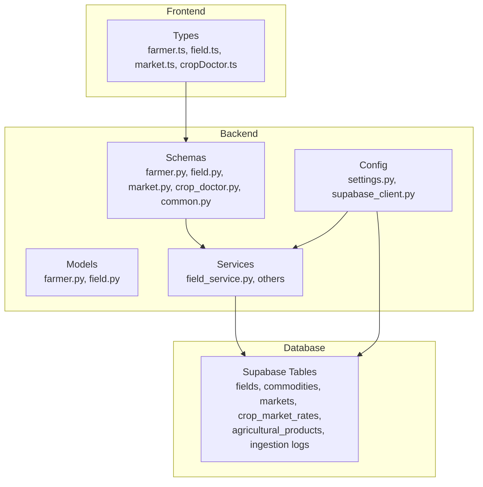
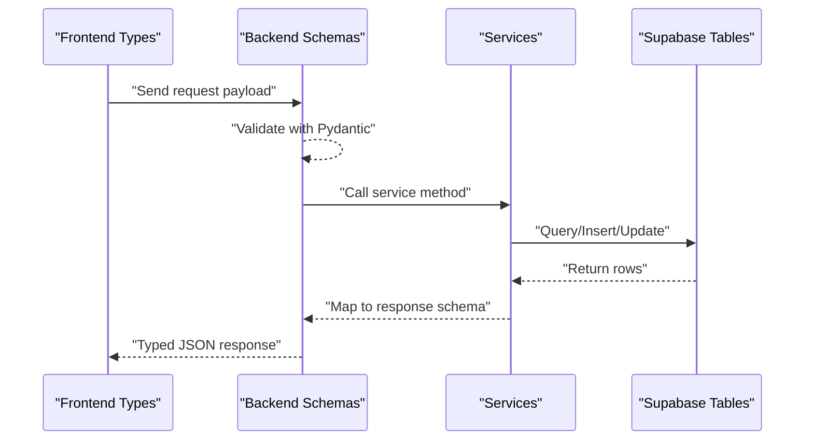
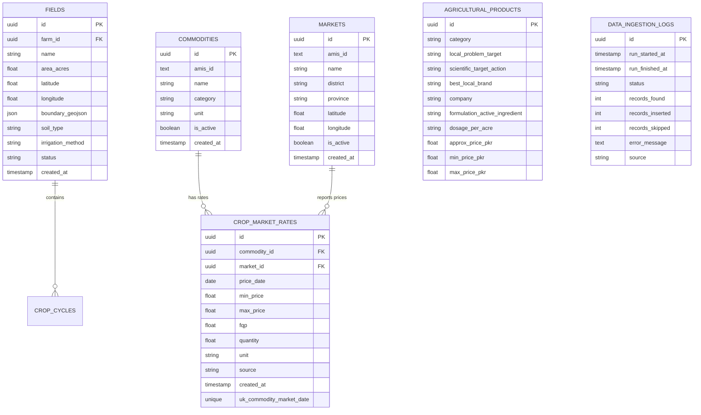
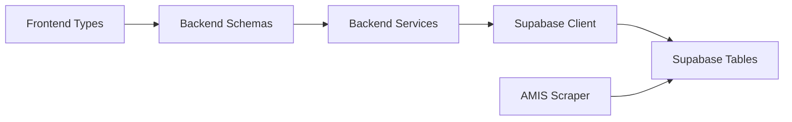

# Data Models and Database Schema

<cite>
**Referenced Files in This Document**
- [farmer.py](file://Backend/models/farmer.py)
- [field.py](file://Backend/models/field.py)
- [farmer.py](file://Backend/schemas/farmer.py)
- [field.py](file://Backend/schemas/field.py)
- [market.py](file://Backend/schemas/market.py)
- [crop_doctor.py](file://Backend/schemas/crop_doctor.py)
- [common.py](file://Backend/schemas/common.py)
- [settings.py](file://Backend/config/settings.py)
- [supabase_client.py](file://Backend/config/supabase_client.py)
- [field_service.py](file://Backend/services/field_service.py)
- [db.py](file://Scraper/db.py)
- [farmer.ts](file://Frontend/greenflora/types/farmer.ts)
- [field.ts](file://Frontend/greenflora/types/field.ts)
- [market.ts](file://Frontend/greenflora/types/market.ts)
- [cropDoctor.ts](file://Frontend/greenflora/types/cropDoctor.ts)
</cite>

## Table of Contents
1. Introduction
2. Project Structure
3. Core Components
4. Architecture Overview
5. Detailed Component Analysis
6. Dependency Analysis
7. Performance Considerations
8. Troubleshooting Guide
9. Conclusion
10. Appendices

## Introduction
This document describes the data models and database schema for Green-Flora, focusing on core entities such as Farmer profiles, Farm locations, Field plots, Crop cycles, Market prices, and Diagnosis records. It explains how Pydantic schemas enforce validation rules, how TypeScript interfaces maintain type safety across the frontend, and how the backend interacts with Supabase tables. It also covers relationships, constraints, indexing strategies inferred from usage, migration approaches via the AMIS scraper, and security considerations for farmer data.

## Project Structure
The project separates concerns into:
- Backend models (internal shapes), schemas (API contracts), services (business logic), routes (HTTP endpoints), and configuration (environmental settings and Supabase client).
- Frontend TypeScript types mirroring backend schemas to ensure end-to-end type safety.
- A Scraper pipeline that ingests market data into Supabase tables used by the Market Intelligence feature.

**Diagram sources**
- [settings.py:48-122](file://Backend/config/settings.py#L48-L122)
- [supabase_client.py:16-47](file://Backend/config/supabase_client.py#L16-L47)
- [field_service.py:567-599](file://Backend/services/field_service.py#L567-L599)
- [db.py:17-26](file://Scraper/db.py#L17-L26)

**Section sources**
- [settings.py:48-122](file://Backend/config/settings.py#L48-L122)
- [supabase_client.py:16-47](file://Backend/config/supabase_client.py#L16-L47)
- [field_service.py:567-599](file://Backend/services/field_service.py#L567-L599)
- [db.py:17-26](file://Scraper/db.py#L17-L26)

## Core Components
This section outlines the primary data entities and their responsibilities.

- Farmer profile: Captures personal and farm-level attributes including location, area, soil type, irrigation method, ownership status, current crop, crop stage, budget, and coordinates.
- Field plot: Represents a distinct land parcel within a farm, including area, coordinates, boundary geometry, soil type, irrigation method, and status.
- Crop cycle: Links a field to a specific crop over a season or period, tracking variety, stage, planting date, expected harvest date, and status.
- Market prices: Aggregated price intelligence sourced from AMIS ingestion into Supabase tables for commodities, markets, and crop market rates.
- Diagnosis records: AI-generated assessments for crop health issues, including problem type, severity, confidence, symptoms, explanation, and product recommendations.

Validation and typing:
- Backend uses Pydantic models and schemas to validate inputs and define response shapes.
- Frontend uses TypeScript interfaces aligned with backend schemas to ensure compile-time checks and consistent UI behavior.

**Section sources**
- [farmer.py:21-48](file://Backend/models/farmer.py#L21-L48)
- [field.py:18-53](file://Backend/models/field.py#L18-L53)
- [farmer.py:40-165](file://Backend/schemas/farmer.py#L40-L165)
- [field.py:32-195](file://Backend/schemas/field.py#L32-L195)
- [market.py:22-132](file://Backend/schemas/market.py#L22-L132)
- [crop_doctor.py:21-123](file://Backend/schemas/crop_doctor.py#L21-L123)
- [farmer.ts:22-75](file://Frontend/greenflora/types/farmer.ts#L22-L75)
- [field.ts:8-78](file://Frontend/greenflora/types/field.ts#L8-L78)
- [market.ts:10-120](file://Frontend/greenflora/types/market.ts#L10-L120)
- [cropDoctor.ts:18-64](file://Frontend/greenflora/types/cropDoctor.ts#L18-L64)

## Architecture Overview
Green-Flora’s data architecture centers around Supabase as the persistence layer. The backend exposes typed APIs using Pydantic schemas, while the frontend consumes these APIs with matching TypeScript types. Market data is ingested by a dedicated Scraper pipeline that writes to Supabase tables, which the backend then serves through Market Intelligence endpoints.

**Diagram sources**
- [field_service.py:567-599](file://Backend/services/field_service.py#L567-L599)
- [db.py:320-378](file://Scraper/db.py#L320-L378)
- [market.py:92-132](file://Backend/schemas/market.py#L92-L132)

## Detailed Component Analysis

### Farmer Profile Model and Schema
- Internal model defines core fields for a farmer, including identifiers, contact info, language preference, farm details, and geolocation.
- Response and update schemas enforce allowed values for language, irrigation method, and ownership status; they also constrain numeric ranges and string lengths.
- Frontend types mirror these structures, ensuring consistent handling across the UI.

Key validations:
- Allowed languages: ur, en, pa, sd
- Allowed irrigation methods: canal, tubewell, drip, sprinkler, rainfed
- Allowed ownership statuses: owned, leased, shared
- Numeric bounds for area and budget; latitude/longitude range checks

Relationships:
- Farmer owns a farm; farm contains fields; fields contain crop cycles.

**Section sources**
- [farmer.py:21-48](file://Backend/models/farmer.py#L21-L48)
- [farmer.py:40-165](file://Backend/schemas/farmer.py#L40-L165)
- [farmer.ts:22-75](file://Frontend/greenflora/types/farmer.ts#L22-L75)

### Field Plot and Crop Cycle Model and Schema
- Field model captures plot-level attributes like area, coordinates, boundary geometry, soil type, irrigation method, and status.
- Crop cycle model links a field to a crop over time, tracking variety, stage, dates, and status.
- Schemas provide create/update requests with validators for status enums and irrigation methods; responses include nested active crop cycle for convenience.
- Frontend types align with backend schemas for fields and crop cycles.

Constraints:
- Field status: active, fallow, inactive
- Crop cycle status: active, harvested, cancelled
- Area bounds and coordinate ranges validated at the schema level

Relationships:
- Field belongs to a farm; crop cycle belongs to a field.

**Section sources**
- [field.py:18-53](file://Backend/models/field.py#L18-L53)
- [field.py:32-195](file://Backend/schemas/field.py#L32-L195)
- [field.ts:8-78](file://Frontend/greenflora/types/field.ts#L8-L78)

### Market Prices Data Model
- Market schemas define commodity items, overview responses, trend points, distribution entries, and signals.
- Data originates from AMIS ingestion into Supabase tables for commodities, markets, and crop market rates.
- Frontend types mirror these structures, including period filters and derived metrics.

Data coverage:
- Latest date, first date, days of data, markets reporting
- Current price, change percentage, signal, highest/lowest markets, spread metrics
- Trend series and distribution across markets

**Section sources**
- [market.py:22-132](file://Backend/schemas/market.py#L22-L132)
- [market.ts:10-120](file://Frontend/greenflora/types/market.ts#L10-L120)
- [db.py:17-26](file://Scraper/db.py#L17-L26)

### Diagnosis Records (Crop Doctor)
- Diagnosis schema includes crop name, problem, problem type, confidence, severity, symptoms, and explanation.
- Product recommendations are sourced from agricultural products table; budget context indicates whether recommended products fit the farmer’s budget.
- Low-cost actions are suggested when budgets are constrained.
- Frontend types reflect diagnosis, product recommendations, budget context, and low-cost actions.

Security note:
- Gemini API key is kept server-side; frontend never sees it.

**Section sources**
- [crop_doctor.py:21-123](file://Backend/schemas/crop_doctor.py#L21-L123)
- [cropDoctor.ts:18-64](file://Frontend/greenflora/types/cropDoctor.ts#L18-L64)
- [settings.py:84-86](file://Backend/config/settings.py#L84-L86)

### Database Schema and Relationships
Inferred from service code and scraper documentation:
- Fields table: stores field records linked to farms; accessed via Supabase table “fields”.
- Commodities, Markets, Crop Market Rates tables: store market intelligence data with unique constraints for idempotent upserts.
- Agricultural Products table: referenced by Crop Doctor for product recommendations.
- Ingestion Logs table: tracks AMIS pipeline runs.

**Diagram sources**
- [field_service.py:567-599](file://Backend/services/field_service.py#L567-L599)
- [db.py:17-26](file://Scraper/db.py#L17-L26)
- [db.py:320-378](file://Scraper/db.py#L320-L378)

**Section sources**
- [field_service.py:567-599](file://Backend/services/field_service.py#L567-L599)
- [db.py:17-26](file://Scraper/db.py#L17-L26)
- [db.py:320-378](file://Scraper/db.py#L320-L378)

### Indexing Strategies
- Unique constraint on crop_market_rates ensures idempotent upserts by (commodity_id, market_id, price_date).
- Queries on fields filter by farm_id and order by created_at; indexes on farm_id and created_at would improve performance for listing fields per farm.
- Market queries likely benefit from indexes on commodity_id, market_id, and price_date for trend and comparison computations.

[No sources needed since this section provides general guidance]

### Data Migration Approaches and Versioning
- The Scraper uses schema discovery to adapt to column changes at runtime, making ingestion resilient to missing optional columns.
- Upsert operations rely on database-level unique constraints where available; if constraints are missing, the pipeline falls back to row-by-row logic and logs warnings.
- Versioning strategy emphasizes backward compatibility by filtering payloads to existing columns and gracefully handling errors.

**Section sources**
- [db.py:62-80](file://Scraper/db.py#L62-L80)
- [db.py:320-378](file://Scraper/db.py#L320-L378)

### Backward Compatibility Considerations
- Pydantic schemas allow partial updates and optional fields, enabling clients to send minimal payloads without breaking changes.
- Frontend types use union types and nullability to handle evolving data gracefully.
- Scraper filters payloads to only include columns present in the target table, avoiding failures due to schema drift.

**Section sources**
- [farmer.py:86-144](file://Backend/schemas/farmer.py#L86-L144)
- [field.py:82-110](file://Backend/schemas/field.py#L82-L110)
- [db.py:345-351](file://Scraper/db.py#L345-L351)

### Data Security Measures
- Secrets management: All sensitive keys (database URL, Supabase keys, OpenAI/Gemini keys) are loaded from environment variables via centralized settings.
- Access controls: Authentication handled via Supabase Auth; service modules raise explicit errors when credentials are missing or unreachable.
- Privacy protections: Farmer PII (name, phone number, location, coordinates) is modeled explicitly; access should be restricted to authenticated users and enforced via Supabase RLS policies (not shown here but recommended).
- External API keys: Gemini and OpenAI keys are stored securely in environment variables and not exposed to the frontend.

**Section sources**
- [settings.py:61-88](file://Backend/config/settings.py#L61-L88)
- [auth_service.py:24-43](file://Backend/services/auth_service.py#L24-L43)
- [crop_doctor.py:11-13](file://Backend/schemas/crop_doctor.py#L11-L13)

## Dependency Analysis
The following diagram shows how components depend on each other:

**Diagram sources**
- [field_service.py:567-599](file://Backend/services/field_service.py#L567-L599)
- [supabase_client.py:16-47](file://Backend/config/supabase_client.py#L16-L47)
- [db.py:320-378](file://Scraper/db.py#L320-L378)

**Section sources**
- [field_service.py:567-599](file://Backend/services/field_service.py#L567-L599)
- [supabase_client.py:16-47](file://Backend/config/supabase_client.py#L16-L47)
- [db.py:320-378](file://Scraper/db.py#L320-L378)

## Performance Considerations
- Use database-level unique constraints for upserts to avoid duplicates and reduce application-level checks.
- Add indexes on frequently queried columns (e.g., farm_id, created_at, commodity_id, market_id, price_date) to optimize list and trend queries.
- Batch operations in the Scraper improve throughput; ensure connection timeouts and limits are tuned for stability.
- Keep payloads minimal by sending only changed fields in partial updates.

[No sources needed since this section provides general guidance]

## Troubleshooting Guide
Common issues and resolutions:
- Missing Supabase credentials: Authentication service raises a service unavailable error; configure environment variables for SUPABASE_URL and SUPABASE_SERVICE_KEY.
- Unique constraint missing on crop_market_rates: Scraper logs a warning and falls back to row-by-row upsert; add the constraint to restore batch efficiency.
- Schema drift: Scraper discovers columns at runtime and filters payloads accordingly; monitor logs for warnings about missing columns.

**Section sources**
- [auth_service.py:24-43](file://Backend/services/auth_service.py#L24-L43)
- [db.py:363-376](file://Scraper/db.py#L363-L376)
- [db.py:62-80](file://Scraper/db.py#L62-L80)

## Conclusion
Green-Flora’s data models are structured to support robust farmer-centric features with clear separation between internal models, API schemas, and frontend types. Validation rules in Pydantic schemas ensure data integrity, while TypeScript interfaces maintain consistency across the UI. The Supabase-backed architecture enables scalable storage and retrieval, with the AMIS scraper providing reliable market intelligence. Security is addressed through centralized secrets management and authentication integration. For production readiness, consider adding database indexes, enforcing Row Level Security policies, and formalizing migrations for schema evolution.

## Appendices

### API Response Wrappers
Standardized response wrappers provide consistent success/error structures across endpoints.

**Section sources**
- [common.py:12-26](file://Backend/schemas/common.py#L12-L26)