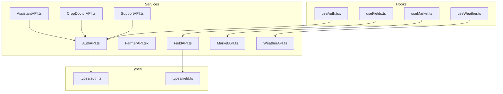
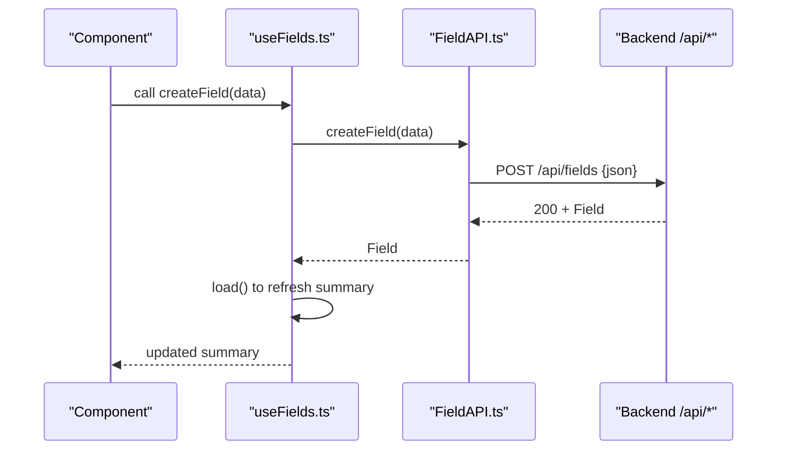
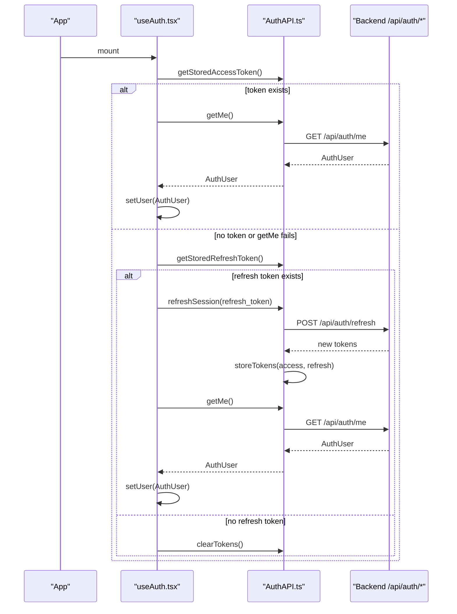
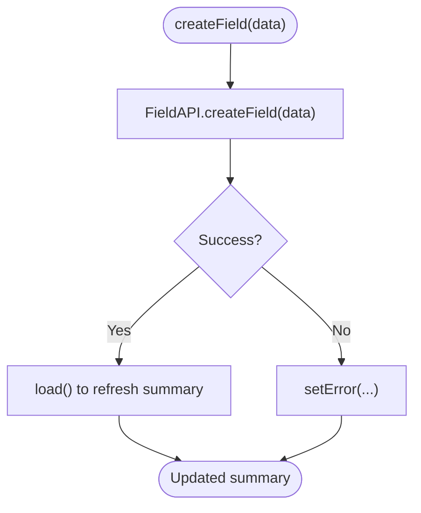
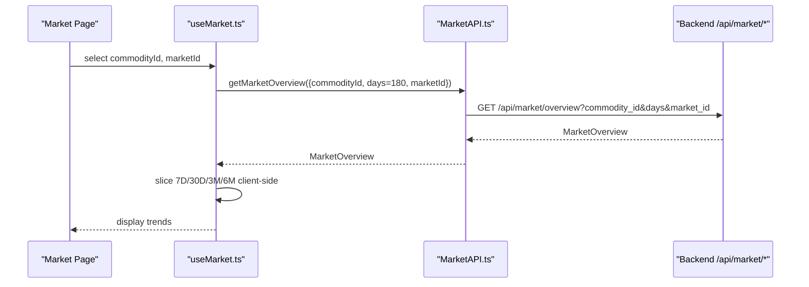
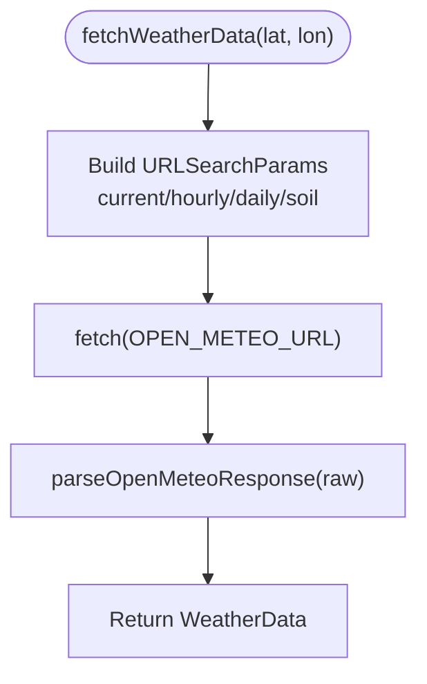
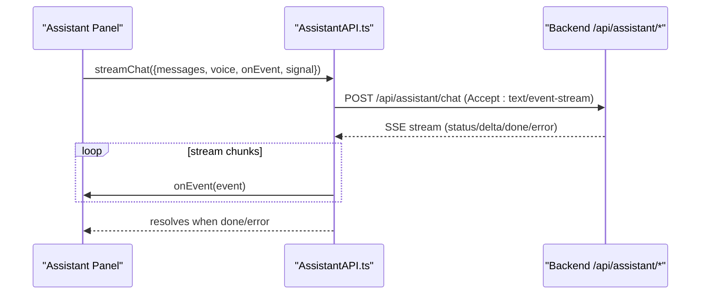
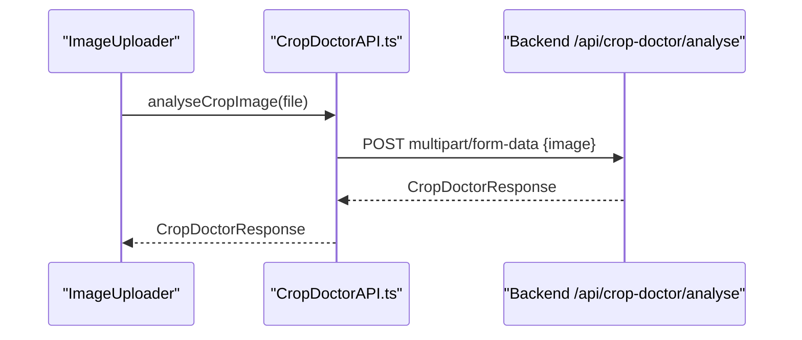
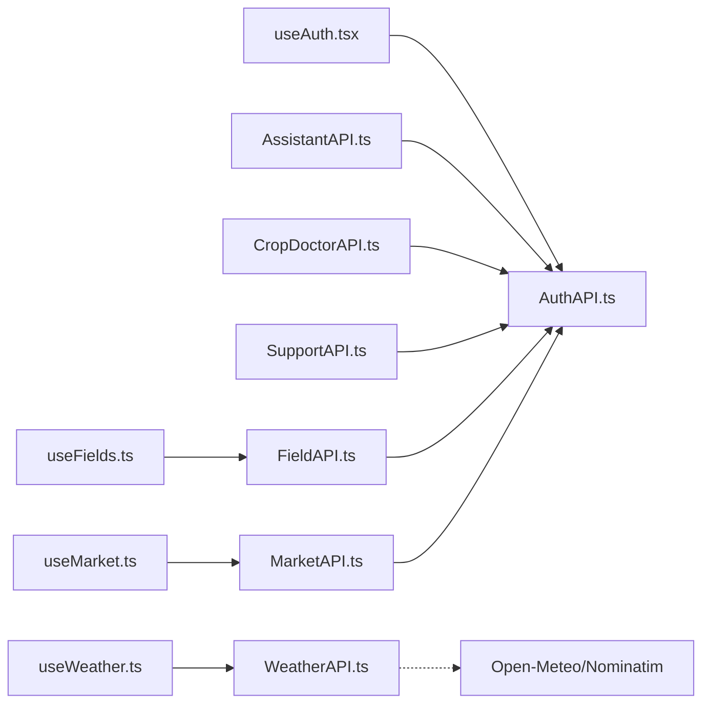

# API Integration

<cite>
**Referenced Files in This Document**
- [AuthAPI.ts](file://Frontend/greenflora/services/AuthAPI.ts)
- [FarmerAPI.tsx](file://Frontend/greenflora/services/FarmerAPI.tsx)
- [FieldAPI.ts](file://Frontend/greenflora/services/FieldAPI.ts)
- [MarketAPI.ts](file://Frontend/greenflora/services/MarketAPI.ts)
- [WeatherAPI.ts](file://Frontend/greenflora/services/WeatherAPI.ts)
- [AssistantAPI.ts](file://Frontend/greenflora/services/AssistantAPI.ts)
- [CropDoctorAPI.ts](file://Frontend/greenflora/services/CropDoctorAPI.ts)
- [SupportAPI.ts](file://Frontend/greenflora/services/SupportAPI.ts)
- [useAuth.tsx](file://Frontend/greenflora/Hooks/useAuth.tsx)
- [useFields.ts](file://Frontend/greenflora/Hooks/useFields.ts)
- [useMarket.ts](file://Frontend/greenflora/Hooks/useMarket.ts)
- [useWeather.ts](file://Frontend/greenflora/Hooks/useWeather.ts)
- [dataStates.ts](file://Frontend/greenflora/lib/dataStates.ts)
</cite>

## Table of Contents
1. [Introduction](#introduction)
2. [Project Structure](#project-structure)
3. [Core Components](#core-components)
4. [Architecture Overview](#architecture-overview)
5. [Detailed Component Analysis](#detailed-component-analysis)
6. [Dependency Analysis](#dependency-analysis)
7. [Performance Considerations](#performance-considerations)
8. [Troubleshooting Guide](#troubleshooting-guide)
9. [Conclusion](#conclusion)

## Introduction
This document explains the Green-Flora frontend API integration layer built around a service-oriented architecture. Each feature domain (auth, fields, market, weather, assistant, crop doctor, support) has a dedicated API service that encapsulates HTTP requests, response parsing, and error handling. The services centralize authentication header management, timeouts, and consistent error classification so UI components and hooks can focus on user experience rather than network details.

The design emphasizes:
- Request/response transformation via typed functions per domain
- Centralized auth token injection from local storage
- Robust error handling with clear categories (network, timeout, validation, server, auth)
- Predictable loading/error states exposed by React hooks
- Streaming chat via Server-Sent Events for real-time assistant interactions
- External integrations (Open-Meteo, Nominatim) handled within their own service

[No sources needed since this section provides general guidance]

## Project Structure
The frontend integrates with backend endpoints through a set of domain-specific services under services/. Hooks in Hooks/ orchestrate data fetching, state transitions, and refresh behavior. Types define request/response contracts and are kept in sync with backend schemas.

**Diagram sources**
- [AuthAPI.ts:16-179](file://Frontend/greenflora/services/AuthAPI.ts#L16-L179)
- [FarmerAPI.tsx:13-109](file://Frontend/greenflora/services/FarmerAPI.tsx#L13-L109)
- [FieldAPI.ts:19-171](file://Frontend/greenflora/services/FieldAPI.ts#L19-L171)
- [MarketAPI.ts:17-128](file://Frontend/greenflora/services/MarketAPI.ts#L17-L128)
- [WeatherAPI.ts:11-291](file://Frontend/greenflora/services/WeatherAPI.ts#L11-L291)
- [AssistantAPI.ts:23-386](file://Frontend/greenflora/services/AssistantAPI.ts#L23-L386)
- [CropDoctorAPI.ts:12-107](file://Frontend/greenflora/services/CropDoctorAPI.ts#L12-L107)
- [SupportAPI.ts:16-102](file://Frontend/greenflora/services/SupportAPI.ts#L16-L102)
- [useAuth.tsx:46-141](file://Frontend/greenflora/Hooks/useAuth.tsx#L46-L141)
- [useFields.ts:51-159](file://Frontend/greenflora/Hooks/useFields.ts#L51-L159)
- [useMarket.ts:33-135](file://Frontend/greenflora/Hooks/useMarket.ts#L33-L135)
- [useWeather.ts:21-58](file://Frontend/greenflora/Hooks/useWeather.ts#L21-L58)
- [types/auth.ts:8-36](file://Frontend/greenflora/types/auth.ts#L8-L36)
- [types/field.ts:8-78](file://Frontend/greenflora/types/field.ts#L8-L78)

**Section sources**
- [AuthAPI.ts:16-179](file://Frontend/greenflora/services/AuthAPI.ts#L16-L179)
- [useAuth.tsx:46-141](file://Frontend/greenflora/Hooks/useAuth.tsx#L46-L141)

## Core Components
- Service layer pattern: Each domain exposes typed functions that perform fetch calls, attach headers, handle timeouts, parse responses, and throw domain-specific errors.
- Authentication: AuthAPI manages tokens in localStorage and provides helpers to read them; other services inject Authorization headers when present.
- Error handling: Services classify errors into network, timeout, validation, server, and auth where applicable, providing friendly messages and status codes.
- Hooks: React hooks wrap services to manage loading, error, and data states, and expose refresh actions.

Key responsibilities:
- AuthAPI: signup/login/logout/refresh/getMe, token persistence, generic request helper with optional auth header injection.
- FarmerAPI: get/update farmer profile and dashboard summary.
- FieldAPI: farm summary, fields CRUD, crop cycles CRUD.
- MarketAPI: commodities list and market overview with query parameters.
- WeatherAPI: reverse geocoding and unified weather bundle from Open-Meteo.
- AssistantAPI: greeting, streaming chat over SSE, speech-to-text, text-to-speech.
- CropDoctorAPI: image analysis endpoint with multipart upload.
- SupportAPI: government support reference data.

**Section sources**
- [AuthAPI.ts:25-179](file://Frontend/greenflora/services/AuthAPI.ts#L25-L179)
- [FarmerAPI.tsx:18-109](file://Frontend/greenflora/services/FarmerAPI.tsx#L18-L109)
- [FieldAPI.ts:24-171](file://Frontend/greenflora/services/FieldAPI.ts#L24-L171)
- [MarketAPI.ts:22-128](file://Frontend/greenflora/services/MarketAPI.ts#L22-L128)
- [WeatherAPI.ts:127-291](file://Frontend/greenflora/services/WeatherAPI.ts#L127-L291)
- [AssistantAPI.ts:30-386](file://Frontend/greenflora/services/AssistantAPI.ts#L30-L386)
- [CropDoctorAPI.ts:17-107](file://Frontend/greenflora/services/CropDoctorAPI.ts#L17-L107)
- [SupportAPI.ts:21-102](file://Frontend/greenflora/services/SupportAPI.ts#L21-L102)

## Architecture Overview
The integration layer follows a clean separation:
- Services encapsulate all HTTP concerns and return typed results or throw typed errors.
- Hooks consume services, maintain UI state, and provide simple APIs to components.
- Types ensure compile-time alignment between frontend and backend contracts.

**Diagram sources**
- [useFields.ts:87-94](file://Frontend/greenflora/Hooks/useFields.ts#L87-L94)
- [FieldAPI.ts:119-124](file://Frontend/greenflora/services/FieldAPI.ts#L119-L124)

**Section sources**
- [useFields.ts:51-159](file://Frontend/greenflora/Hooks/useFields.ts#L51-L159)
- [FieldAPI.ts:48-101](file://Frontend/greenflora/services/FieldAPI.ts#L48-L101)

## Detailed Component Analysis

### Authentication Flow and Token Management
- AuthAPI stores access and refresh tokens in localStorage and exposes getters/setters.
- On app mount, useAuth restores session by calling getMe; if it fails, it attempts refreshSession using the stored refresh token and updates tokens.
- All protected endpoints automatically include Authorization header when a token is available.

**Diagram sources**
- [useAuth.tsx:51-88](file://Frontend/greenflora/Hooks/useAuth.tsx#L51-L88)
- [AuthAPI.ts:28-46](file://Frontend/greenflora/services/AuthAPI.ts#L28-L46)
- [AuthAPI.ts:150-179](file://Frontend/greenflora/services/AuthAPI.ts#L150-L179)

**Section sources**
- [useAuth.tsx:46-141](file://Frontend/greenflora/Hooks/useAuth.tsx#L46-L141)
- [AuthAPI.ts:25-179](file://Frontend/greenflora/services/AuthAPI.ts#L25-L179)

### Fields and Farm Data
- useFields loads FarmSummary on mount and exposes CRUD actions for fields and crop cycles.
- Mutations wrap calls in a shared wrapper that sets mutation state and then refreshes the summary to keep UI consistent.
- FieldAPI handles timeouts, auth header injection, and returns typed results or throws FieldApiError.

**Diagram sources**
- [useFields.ts:87-94](file://Frontend/greenflora/Hooks/useFields.ts#L87-L94)
- [FieldAPI.ts:119-124](file://Frontend/greenflora/services/FieldAPI.ts#L119-L124)

**Section sources**
- [useFields.ts:51-159](file://Frontend/greenflora/Hooks/useFields.ts#L51-L159)
- [FieldAPI.ts:48-171](file://Frontend/greenflora/services/FieldAPI.ts#L48-L171)

### Market Intelligence
- useMarketCommodities loads commodity list once and exposes refresh.
- useMarketOverview fetches a 180-day overview for the selected commodity and optional market filter; UI slices periods client-side for instant switching.
- MarketAPI builds query parameters and sends requests without requiring auth (public reference data), but still attaches token if present.

**Diagram sources**
- [useMarket.ts:80-135](file://Frontend/greenflora/Hooks/useMarket.ts#L80-L135)
- [MarketAPI.ts:116-128](file://Frontend/greenflora/services/MarketAPI.ts#L116-L128)

**Section sources**
- [useMarket.ts:33-135](file://Frontend/greenflora/Hooks/useMarket.ts#L33-L135)
- [MarketAPI.ts:17-128](file://Frontend/greenflora/services/MarketAPI.ts#L17-L128)

### Weather and Geocoding
- WeatherAPI combines current, hourly, daily, and soil data in a single request to Open-Meteo and parses into a clean WeatherData shape.
- Reverse geocoding uses Nominatim to convert coordinates to a readable location name with locality, district, province, country, and display name.
- useWeather fetches weather data based on latitude/longitude and exposes refresh.

**Diagram sources**
- [WeatherAPI.ts:141-222](file://Frontend/greenflora/services/WeatherAPI.ts#L141-L222)
- [WeatherAPI.ts:224-291](file://Frontend/greenflora/services/WeatherAPI.ts#L224-L291)

**Section sources**
- [WeatherAPI.ts:35-125](file://Frontend/greenflora/services/WeatherAPI.ts#L35-L125)
- [WeatherAPI.ts:141-291](file://Frontend/greenflora/services/WeatherAPI.ts#L141-L291)
- [useWeather.ts:21-58](file://Frontend/greenflora/Hooks/useWeather.ts#L21-L58)

### Assistant (Streaming Chat, Speech-to-Text, Text-to-Speech)
- AssistantAPI implements streaming chat over Server-Sent Events, parsing event frames and delivering typed events to the caller.
- It also supports transcribing audio blobs and generating speech audio blobs, with appropriate timeouts and error mapping.
- Requests include Authorization header when a token is present.

**Diagram sources**
- [AssistantAPI.ts:231-305](file://Frontend/greenflora/services/AssistantAPI.ts#L231-L305)

**Section sources**
- [AssistantAPI.ts:108-140](file://Frontend/greenflora/services/AssistantAPI.ts#L108-L140)
- [AssistantAPI.ts:161-220](file://Frontend/greenflora/services/AssistantAPI.ts#L161-L220)
- [AssistantAPI.ts:315-386](file://Frontend/greenflora/services/AssistantAPI.ts#L315-L386)

### Crop Doctor Image Analysis
- CropDoctorAPI uploads images as multipart/form-data to the backend for Gemini-powered analysis.
- It enforces a longer timeout due to AI processing time and maps errors to typed exceptions.

**Diagram sources**
- [CropDoctorAPI.ts:47-107](file://Frontend/greenflora/services/CropDoctorAPI.ts#L47-L107)

**Section sources**
- [CropDoctorAPI.ts:12-107](file://Frontend/greenflora/services/CropDoctorAPI.ts#L12-L107)

### Government Support
- SupportAPI fetches public reference data for government support contacts.
- Requests work with or without an auth token and follow the same error classification pattern.

**Section sources**
- [SupportAPI.ts:16-102](file://Frontend/greenflora/services/SupportAPI.ts#L16-L102)

## Dependency Analysis
- Services depend on types for request/response shapes and on AuthAPI for token retrieval.
- Hooks depend on services and expose simplified APIs to components.
- No circular dependencies observed; services are leaf modules focused on HTTP.

**Diagram sources**
- [useAuth.tsx:46-141](file://Frontend/greenflora/Hooks/useAuth.tsx#L46-L141)
- [useFields.ts:51-159](file://Frontend/greenflora/Hooks/useFields.ts#L51-L159)
- [useMarket.ts:33-135](file://Frontend/greenflora/Hooks/useMarket.ts#L33-L135)
- [useWeather.ts:21-58](file://Frontend/greenflora/Hooks/useWeather.ts#L21-L58)
- [AssistantAPI.ts:23-386](file://Frontend/greenflora/services/AssistantAPI.ts#L23-L386)
- [CropDoctorAPI.ts:12-107](file://Frontend/greenflora/services/CropDoctorAPI.ts#L12-L107)
- [SupportAPI.ts:16-102](file://Frontend/greenflora/services/SupportAPI.ts#L16-L102)
- [FieldAPI.ts:17-171](file://Frontend/greenflora/services/FieldAPI.ts#L17-L171)
- [MarketAPI.ts:15-128](file://Frontend/greenflora/services/MarketAPI.ts#L15-L128)
- [WeatherAPI.ts:11-291](file://Frontend/greenflora/services/WeatherAPI.ts#L11-L291)

**Section sources**
- [AuthAPI.ts:25-179](file://Frontend/greenflora/services/AuthAPI.ts#L25-L179)
- [FieldAPI.ts:17-171](file://Frontend/greenflora/services/FieldAPI.ts#L17-L171)
- [MarketAPI.ts:15-128](file://Frontend/greenflora/services/MarketAPI.ts#L15-L128)
- [WeatherAPI.ts:11-291](file://Frontend/greenflora/services/WeatherAPI.ts#L11-L291)
- [AssistantAPI.ts:23-386](file://Frontend/greenflora/services/AssistantAPI.ts#L23-L386)
- [CropDoctorAPI.ts:12-107](file://Frontend/greenflora/services/CropDoctorAPI.ts#L12-L107)
- [SupportAPI.ts:16-102](file://Frontend/greenflora/services/SupportAPI.ts#L16-L102)

## Performance Considerations
- Timeouts: Each service defines REQUEST_TIMEOUT_MS and uses AbortController to cancel long-running requests.
- Single-request bundling: WeatherAPI consolidates current, hourly, daily, and soil data into one call to minimize round-trips.
- Client-side slicing: Market hook fetches a wide window (180 days) once and slices periods client-side for instant UI changes.
- Mutation refresh strategy: Field hook refreshes summary after mutations to keep UI consistent without optimistic updates.
- Optional caching: No explicit in-memory cache is implemented; consider adding request deduplication and response caching at the hook level for frequently accessed data (e.g., commodities, weather).
- Real-time synchronization: Assistant chat uses SSE streaming for immediate feedback; other features rely on explicit refresh actions.

[No sources needed since this section provides general guidance]

## Troubleshooting Guide
Common issues and how they are handled:
- Network failures: Services catch transport-level errors and throw typed errors with type "network". UI should show a friendly message and offer retry.
- Timeouts: AbortController triggers AbortError; services map to "timeout" with user-friendly messages.
- API errors: Non-OK responses are parsed for detail messages and mapped to "validation", "server", or "auth" depending on status codes.
- Session restoration: If getMe fails, useAuth attempts refreshSession; if refresh fails, tokens are cleared and user is logged out.
- Streaming interruptions: Assistant streaming catches connection errors and throws a network error; callers can prompt retry.

Recommended patterns:
- Always surface error.message to users via UI components.
- Provide retry buttons that call hook.refresh().
- For mutations, reset error state before attempting and set isMutating while in flight.

**Section sources**
- [AuthAPI.ts:91-137](file://Frontend/greenflora/services/AuthAPI.ts#L91-L137)
- [FarmerAPI.tsx:42-90](file://Frontend/greenflora/services/FarmerAPI.tsx#L42-L90)
- [FieldAPI.ts:48-101](file://Frontend/greenflora/services/FieldAPI.ts#L48-L101)
- [MarketAPI.ts:46-94](file://Frontend/greenflora/services/MarketAPI.ts#L46-L94)
- [WeatherAPI.ts:187-222](file://Frontend/greenflora/services/WeatherAPI.ts#L187-L222)
- [AssistantAPI.ts:108-135](file://Frontend/greenflora/services/AssistantAPI.ts#L108-L135)
- [useAuth.tsx:51-88](file://Frontend/greenflora/Hooks/useAuth.tsx#L51-L88)

## Conclusion
Green-Flora’s frontend API integration layer uses a clear service-oriented architecture with dedicated services per domain, robust error handling, and predictable state management via hooks. Authentication is centralized, requests are consistently timed out and categorized, and real-time capabilities are supported through streaming. While caching and optimistic updates are not broadly implemented, the existing patterns make it straightforward to add request deduplication, response caching, and optimistic UI updates where beneficial.

[No sources needed since this section summarizes without analyzing specific files]