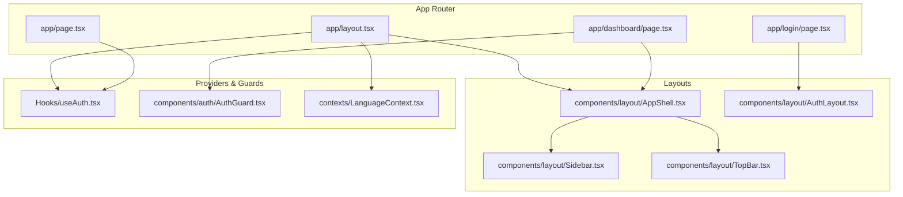
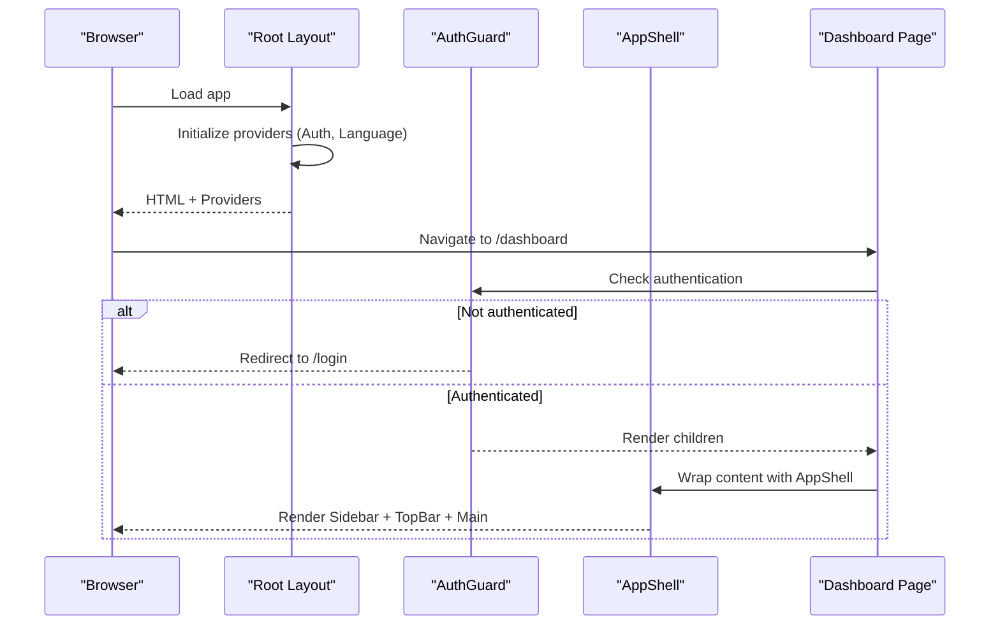
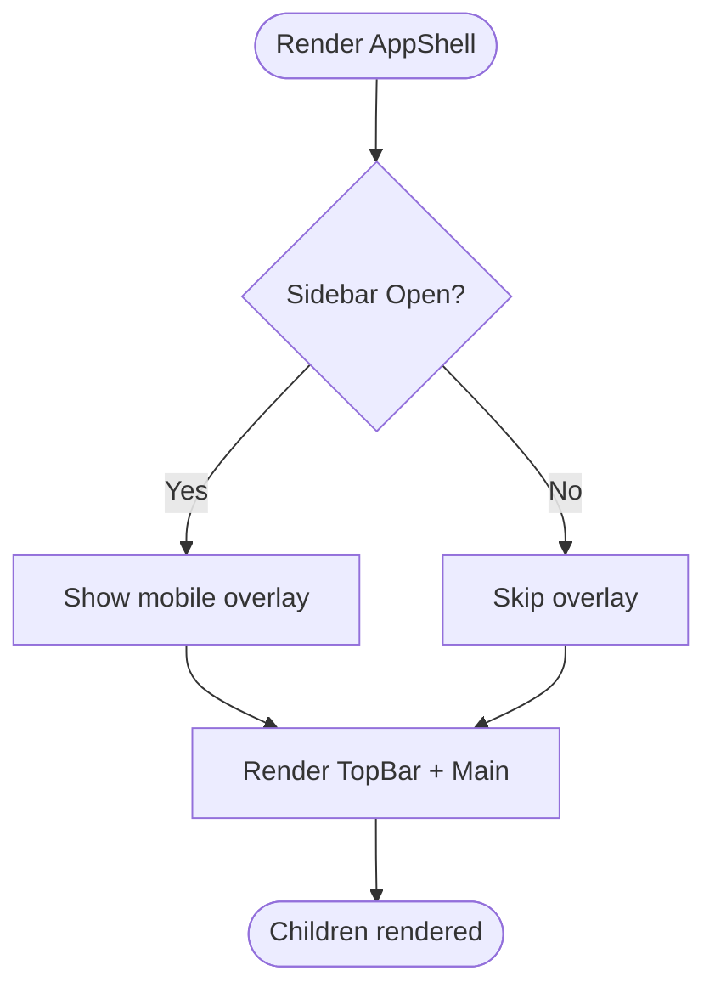
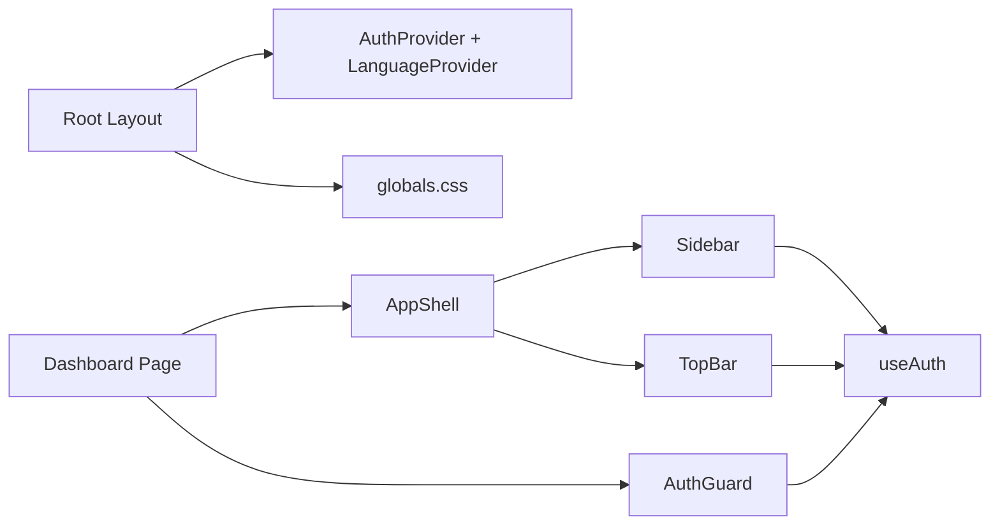

# Application Structure

<cite>
**Referenced Files in This Document**
- [layout.tsx](file://Frontend/greenflora/app/layout.tsx)
- [page.tsx](file://Frontend/greenflora/app/page.tsx)
- [globals.css](file://Frontend/greenflora/app/globals.css)
- [AppShell.tsx](file://Frontend/greenflora/components/layout/AppShell.tsx)
- [Sidebar.tsx](file://Frontend/greenflora/components/layout/Sidebar.tsx)
- [TopBar.tsx](file://Frontend/greenflora/components/layout/TopBar.tsx)
- [AuthLayout.tsx](file://Frontend/greenflora/components/layout/AuthLayout.tsx)
- [AuthGuard.tsx](file://Frontend/greenflora/components/auth/AuthGuard.tsx)
- [useAuth.tsx](file://Frontend/greenflora/Hooks/useAuth.tsx)
- [LanguageContext.tsx](file://Frontend/greenflora/contexts/LanguageContext.tsx)
- [dashboard/page.tsx](file://Frontend/greenflora/app/dashboard/page.tsx)
</cite>

## Table of Contents
1. [Introduction](#introduction)
2. [Project Structure](#project-structure)
3. [Core Components](#core-components)
4. [Architecture Overview](#architecture-overview)
5. [Detailed Component Analysis](#detailed-component-analysis)
6. [Dependency Analysis](#dependency-analysis)
7. [Performance Considerations](#performance-considerations)
8. [Troubleshooting Guide](#troubleshooting-guide)
9. [Conclusion](#conclusion)

## Introduction
This document explains the Green-Flora Next.js application structure with a focus on the App Router organization, layout hierarchy, and component composition patterns. It details how page-based routing is structured, how the shell layout provides consistent navigation and responsive behavior, and how global configuration (metadata, fonts, CSS, providers) is applied at the root level. The documentation also covers the modular component structure, file organization principles, and responsive design using Tailwind CSS breakpoints and mobile-first strategies.

## Project Structure
The application uses the Next.js App Router under Frontend/greenflora/app. Each feature area has its own directory containing a page.tsx that renders the route-specific UI. Shared layouts and reusable components live under components/, while cross-cutting concerns like authentication and language are provided via contexts and hooks.

Key structural highlights:
- Root layout defines global providers, fonts, and global styles.
- Route pages compose feature-specific content inside shared shells or auth layouts.
- A consistent AppShell wraps authenticated routes with Sidebar and TopBar for navigation and user controls.
- AuthLayout provides a full-screen branded experience for login/signup flows.
- Global CSS centralizes design tokens, animations, and theme integration with Tailwind v4.

**Diagram sources**
- [layout.tsx:23-67](file://Frontend/greenflora/app/layout.tsx#L23-L67)
- [page.tsx:15-33](file://Frontend/greenflora/app/page.tsx#L15-L33)
- [dashboard/page.tsx:95-236](file://Frontend/greenflora/app/dashboard/page.tsx#L95-L236)
- [AppShell.tsx:12-35](file://Frontend/greenflora/components/layout/AppShell.tsx#L12-L35)
- [Sidebar.tsx:71-188](file://Frontend/greenflora/components/layout/Sidebar.tsx#L71-L188)
- [TopBar.tsx:26-166](file://Frontend/greenflora/components/layout/TopBar.tsx#L26-L166)
- [AuthLayout.tsx:78-170](file://Frontend/greenflora/components/layout/AuthLayout.tsx#L78-L170)
- [useAuth.tsx:46-128](file://Frontend/greenflora/Hooks/useAuth.tsx#L46-L128)
- [AuthGuard.tsx:37-58](file://Frontend/greenflora/components/auth/AuthGuard.tsx#L37-L58)
- [LanguageContext.tsx:24-57](file://Frontend/greenflora/contexts/LanguageContext.tsx#L24-L57)

**Section sources**
- [layout.tsx:1-95](file://Frontend/greenflora/app/layout.tsx#L1-L95)
- [page.tsx:1-35](file://Frontend/greenflora/app/page.tsx#L1-L35)
- [dashboard/page.tsx:1-238](file://Frontend/greenflora/app/dashboard/page.tsx#L1-L238)
- [AppShell.tsx:1-36](file://Frontend/greenflora/components/layout/AppShell.tsx#L1-L36)
- [Sidebar.tsx:1-188](file://Frontend/greenflora/components/layout/Sidebar.tsx#L1-L188)
- [TopBar.tsx:1-166](file://Frontend/greenflora/components/layout/TopBar.tsx#L1-L166)
- [AuthLayout.tsx:1-171](file://Frontend/greenflora/components/layout/AuthLayout.tsx#L1-L171)
- [AuthGuard.tsx:1-59](file://Frontend/greenflora/components/auth/AuthGuard.tsx#L1-L59)
- [useAuth.tsx:1-141](file://Frontend/greenflora/Hooks/useAuth.tsx#L1-L141)
- [LanguageContext.tsx:1-66](file://Frontend/greenflora/contexts/LanguageContext.tsx#L1-L66)

## Core Components
- Root layout (layout.tsx): Sets up Google Fonts, injects global CSS, and wraps children with AuthProvider and LanguageProvider. It also configures a hidden Google Translate element and loads the translation script after interaction.
- Page routing (page.tsx): Redirects to /dashboard if authenticated, otherwise to /login, showing a minimal loading indicator during decision.
- AppShell: Provides a consistent shell for authenticated pages, including a responsive Sidebar and TopBar, and a centered main content area.
- Sidebar: Renders navigation links, active state based on current pathname, brand logo, and logout action. Mobile overlay toggles visibility.
- TopBar: Displays page title, mobile menu toggle, and a profile dropdown with actions including logout.
- AuthLayout: Full-screen branded layout for login/signup with decorative SVG elements and a centered card.
- AuthGuard: Client-side protection for protected routes; shows loading state and redirects unauthenticated users.
- useAuth: Context provider and hook managing authentication state, session restoration, login/signup/logout flows.
- LanguageContext: Manages language state (English/Urdu), persists selection, applies RTL and font changes globally, and exposes a translation helper.

**Section sources**
- [layout.tsx:23-95](file://Frontend/greenflora/app/layout.tsx#L23-L95)
- [page.tsx:15-33](file://Frontend/greenflora/app/page.tsx#L15-L33)
- [AppShell.tsx:12-35](file://Frontend/greenflora/components/layout/AppShell.tsx#L12-L35)
- [Sidebar.tsx:71-188](file://Frontend/greenflora/components/layout/Sidebar.tsx#L71-L188)
- [TopBar.tsx:26-166](file://Frontend/greenflora/components/layout/TopBar.tsx#L26-L166)
- [AuthLayout.tsx:78-170](file://Frontend/greenflora/components/layout/AuthLayout.tsx#L78-L170)
- [AuthGuard.tsx:37-58](file://Frontend/greenflora/components/auth/AuthGuard.tsx#L37-L58)
- [useAuth.tsx:46-128](file://Frontend/greenflora/Hooks/useAuth.tsx#L46-L128)
- [LanguageContext.tsx:24-57](file://Frontend/greenflora/contexts/LanguageContext.tsx#L24-L57)

## Architecture Overview
The app follows a layered architecture:
- Routing layer: Next.js App Router directories define routes.
- Layout layer: Root layout sets global providers and styles; feature layouts (AppShell, AuthLayout) wrap page content.
- Feature layer: Pages compose domain-specific components and data hooks.
- State layer: Contexts (auth, language) provide cross-cutting state.
- Presentation layer: Reusable UI components under components/ui and feature folders.

**Diagram sources**
- [layout.tsx:23-67](file://Frontend/greenflora/app/layout.tsx#L23-L67)
- [AuthGuard.tsx:37-58](file://Frontend/greenflora/components/auth/AuthGuard.tsx#L37-L58)
- [AppShell.tsx:12-35](file://Frontend/greenflora/components/layout/AppShell.tsx#L12-L35)
- [dashboard/page.tsx:95-236](file://Frontend/greenflora/app/dashboard/page.tsx#L95-L236)

## Detailed Component Analysis

### Root Layout and Global Configuration
- Fonts: Loads Geist Sans/Mono and Noto Nastaliq Urdu with CSS variables for theming.
- Providers: Wraps children with AuthProvider and LanguageProvider to expose auth and language context throughout the app.
- Global CSS: Imports globals.css which defines design tokens, Tailwind theme integration, base styles, animations, and accessibility features.
- Translation: Injects a hidden container and initializes Google Translate after interactive events to avoid blocking initial load.

Responsive and accessibility notes:
- Body uses neutral background and text colors from design tokens.
- Font families are exposed via CSS variables and integrated into Tailwind theme for consistent typography across components.

**Section sources**
- [layout.tsx:1-95](file://Frontend/greenflora/app/layout.tsx#L1-L95)
- [globals.css:1-175](file://Frontend/greenflora/app/globals.css#L1-L175)

### AppShell: Consistent Navigation Shell
Responsibilities:
- Maintains sidebar open/close state.
- Renders Sidebar and TopBar around the page content.
- Applies responsive offset for desktop to accommodate the fixed-width sidebar.

Mobile-first approach:
- On small screens, the sidebar is off-canvas and overlays when open.
- On medium+ screens, the sidebar is visible and content shifts right.

**Diagram sources**
- [AppShell.tsx:12-35](file://Frontend/greenflora/components/layout/AppShell.tsx#L12-L35)

**Section sources**
- [AppShell.tsx:1-36](file://Frontend/greenflora/components/layout/AppShell.tsx#L1-L36)

### Sidebar: Navigation and Branding
Features:
- Navigation items defined as a static array with labels, hrefs, and icons.
- Active link detection via pathname prefix matching.
- Logout flow triggers authentication service and navigates to login.
- Mobile overlay closes sidebar when tapped outside.

Accessibility:
- Uses aria-label for navigation and close button.
- Keyboard-friendly interactions via standard Link and Button semantics.

**Section sources**
- [Sidebar.tsx:22-64](file://Frontend/greenflora/components/layout/Sidebar.tsx#L22-L64)
- [Sidebar.tsx:71-188](file://Frontend/greenflora/components/layout/Sidebar.tsx#L71-L188)

### TopBar: Header and Profile Menu
Features:
- Displays page title and mobile menu toggle.
- Profile dropdown with user identity, navigation links, and logout.
- Closes dropdown on outside click or Escape key press.

Responsive behavior:
- Menu toggle visible only on small screens.
- Sticky header with backdrop blur for readability over content.

**Section sources**
- [TopBar.tsx:26-166](file://Frontend/greenflora/components/layout/TopBar.tsx#L26-L166)

### AuthLayout: Branded Authentication Experience
Features:
- Layered background with gradients, radial light spots, animated leaf SVGs, and grass silhouette.
- Centered card with branding and form content injected via children.
- Animations for entrance effects and floating elements.

Design system integration:
- Uses design tokens for colors and shadows.
- Leverages custom animations defined in global CSS.

**Section sources**
- [AuthLayout.tsx:78-170](file://Frontend/greenflora/components/layout/AuthLayout.tsx#L78-L170)
- [globals.css:277-367](file://Frontend/greenflora/app/globals.css#L277-L367)

### AuthGuard: Route Protection
Behavior:
- Shows a loading screen while determining authentication status.
- Redirects unauthenticated users to /login.
- Renders protected content only when authenticated.

Integration:
- Relies on useAuth context for state and router for navigation.

**Section sources**
- [AuthGuard.tsx:37-58](file://Frontend/greenflora/components/auth/AuthGuard.tsx#L37-L58)
- [useAuth.tsx:46-128](file://Frontend/greenflora/Hooks/useAuth.tsx#L46-L128)

### Dashboard Page: Composition Pattern Example
Composition:
- Wraps content with AuthGuard and AppShell.
- Composes feature components: DashboardHeader, FarmingInsights, AssistantPanel, StatCard, GovernmentSupportCard.
- Handles loading, error, empty states using shared UI components.

Data fetching:
- Uses hooks for farmer profile, fields summary, weather, market commodities, and AI greeting.
- Derives featured commodity based on active crops.

Responsive grid:
- Uses Tailwind responsive grids to adapt stat cards across breakpoints.

**Section sources**
- [dashboard/page.tsx:52-236](file://Frontend/greenflora/app/dashboard/page.tsx#L52-L236)

### Language Context: Internationalization
Capabilities:
- Persists selected language in localStorage.
- Applies document-level attributes (lang, dir) and CSS class for Urdu mode.
- Exposes t() helper for translations keyed by language.

Global impact:
- Changes font family and line-height for Urdu via CSS rules.
- Enables RTL layout automatically when Urdu is selected.

**Section sources**
- [LanguageContext.tsx:24-57](file://Frontend/greenflora/contexts/LanguageContext.tsx#L24-L57)
- [globals.css:218-256](file://Frontend/greenflora/app/globals.css#L218-L256)

## Dependency Analysis
Component relationships and coupling:
- Root layout depends on providers and global styles.
- AppShell composes Sidebar and TopBar; both depend on useAuth for user actions.
- Sidebar and TopBar use Next.js navigation utilities for routing and active state.
- AuthGuard depends on useAuth and router for protection logic.
- Dashboard page composes multiple feature components and relies on data hooks.

Potential circular dependencies:
- None observed between layout and page components; dependencies flow downward from layout to pages.

External integrations:
- Google Fonts loaded via next/font.
- Google Translate script loaded conditionally after interaction.
- Tailwind CSS v4 theme integrated via @theme in globals.css.

**Diagram sources**
- [layout.tsx:23-67](file://Frontend/greenflora/app/layout.tsx#L23-L67)
- [dashboard/page.tsx:95-236](file://Frontend/greenflora/app/dashboard/page.tsx#L95-L236)
- [AppShell.tsx:12-35](file://Frontend/greenflora/components/layout/AppShell.tsx#L12-L35)
- [Sidebar.tsx:71-188](file://Frontend/greenflora/components/layout/Sidebar.tsx#L71-L188)
- [TopBar.tsx:26-166](file://Frontend/greenflora/components/layout/TopBar.tsx#L26-L166)
- [AuthGuard.tsx:37-58](file://Frontend/greenflora/components/auth/AuthGuard.tsx#L37-L58)
- [useAuth.tsx:46-128](file://Frontend/greenflora/Hooks/useAuth.tsx#L46-L128)

**Section sources**
- [layout.tsx:23-67](file://Frontend/greenflora/app/layout.tsx#L23-L67)
- [dashboard/page.tsx:95-236](file://Frontend/greenflora/app/dashboard/page.tsx#L95-L236)
- [AppShell.tsx:12-35](file://Frontend/greenflora/components/layout/AppShell.tsx#L12-L35)
- [Sidebar.tsx:71-188](file://Frontend/greenflora/components/layout/Sidebar.tsx#L71-L188)
- [TopBar.tsx:26-166](file://Frontend/greenflora/components/layout/TopBar.tsx#L26-L166)
- [AuthGuard.tsx:37-58](file://Frontend/greenflora/components/auth/AuthGuard.tsx#L37-L58)
- [useAuth.tsx:46-128](file://Frontend/greenflora/Hooks/useAuth.tsx#L46-L128)

## Performance Considerations
- Script loading: Google Translate script is loaded after interactive to avoid blocking initial paint.
- Provider initialization: AuthProvider restores session on mount and handles token refresh gracefully.
- Responsive rendering: Tailwind utility classes minimize custom CSS and leverage browser optimizations.
- Animation performance: Custom animations respect reduced motion preferences to improve accessibility and performance on low-end devices.

[No sources needed since this section provides general guidance]

## Troubleshooting Guide
Common issues and resolutions:
- Unauthenticated redirect loop: Ensure AuthProvider is wrapping the app and that useAuth is used within its scope. Verify that AuthGuard checks isLoading before redirecting.
- Sidebar not closing on mobile: Confirm that the overlay click handler calls onClose and that the mobile-only classes are applied correctly.
- Language switching not applying: Check that LanguageProvider sets document.documentElement.lang/dir and toggles the urdu-mode class. Verify CSS rules for Urdu font and line-height.
- Google Translate conflicts: Ensure the hidden container exists and the script is loaded after interactive. Review overrides in globals.css to hide unwanted UI elements.

**Section sources**
- [useAuth.tsx:46-128](file://Frontend/greenflora/Hooks/useAuth.tsx#L46-L128)
- [AuthGuard.tsx:37-58](file://Frontend/greenflora/components/auth/AuthGuard.tsx#L37-L58)
- [Sidebar.tsx:90-131](file://Frontend/greenflora/components/layout/Sidebar.tsx#L90-L131)
- [LanguageContext.tsx:24-57](file://Frontend/greenflora/contexts/LanguageContext.tsx#L24-L57)
- [globals.css:259-272](file://Frontend/greenflora/app/globals.css#L259-L272)

## Conclusion
Green-Flora’s Next.js App Router setup emphasizes a clean separation of concerns: root layout manages global providers and styles, feature pages compose domain-specific UI within consistent shells, and shared components encapsulate reusable behaviors. The AppShell provides a robust, responsive navigation framework, while AuthLayout offers a branded experience for authentication flows. Global CSS integrates a cohesive design system with Tailwind v4, enabling consistent theming and animations. This structure supports scalability, maintainability, and a strong foundation for adding new features and pages.

[No sources needed since this section summarizes without analyzing specific files]