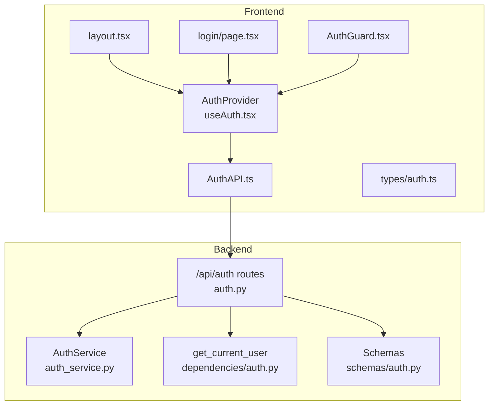
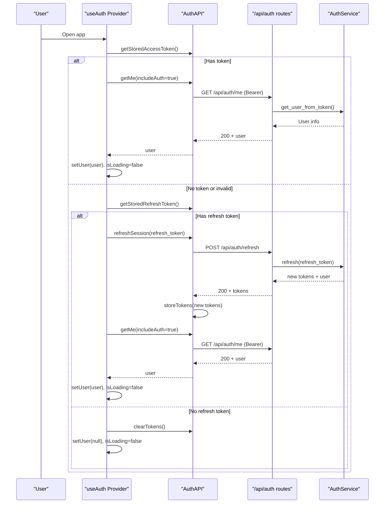
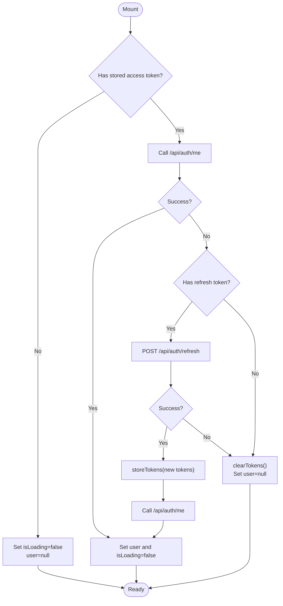
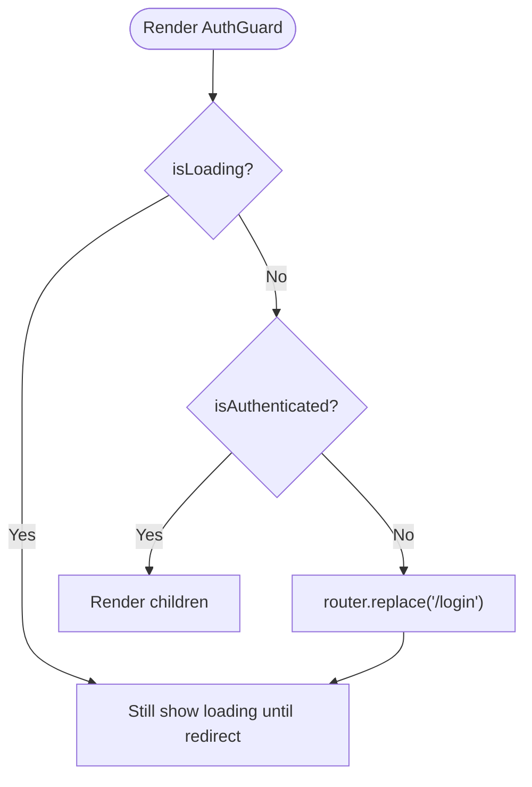
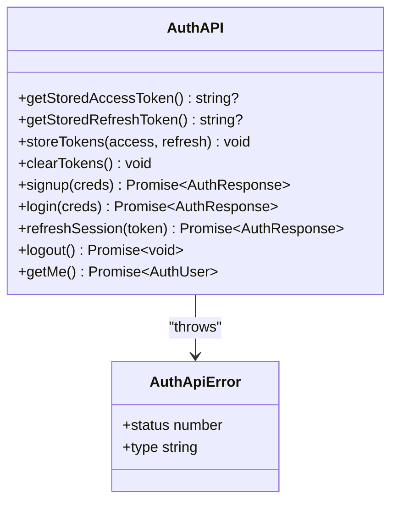
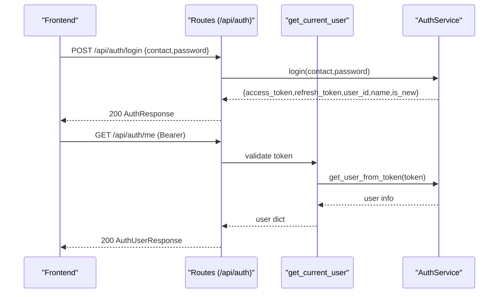
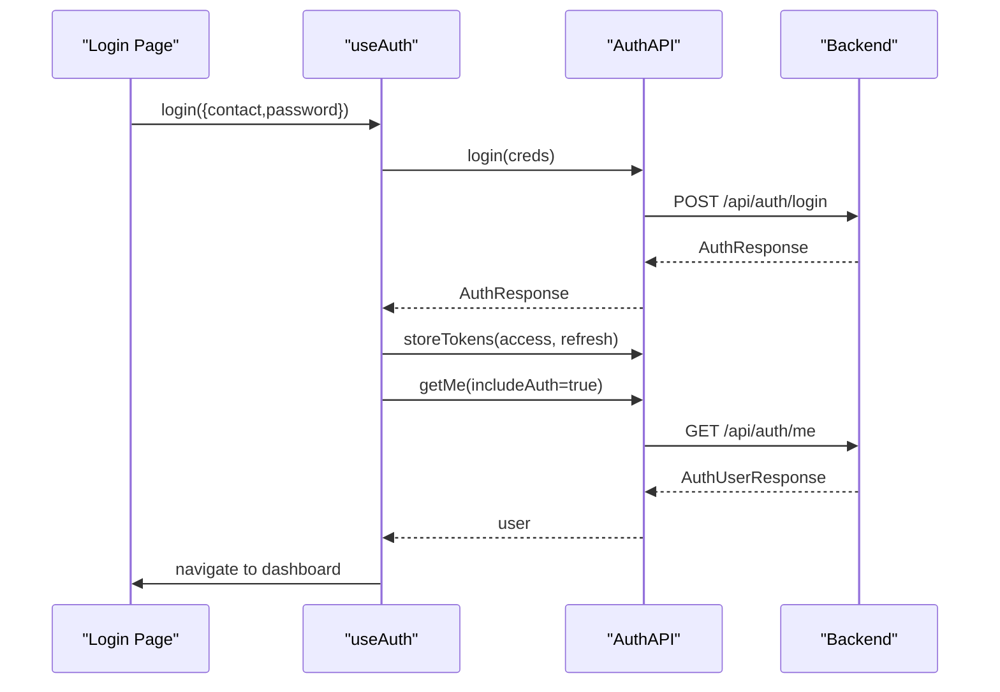
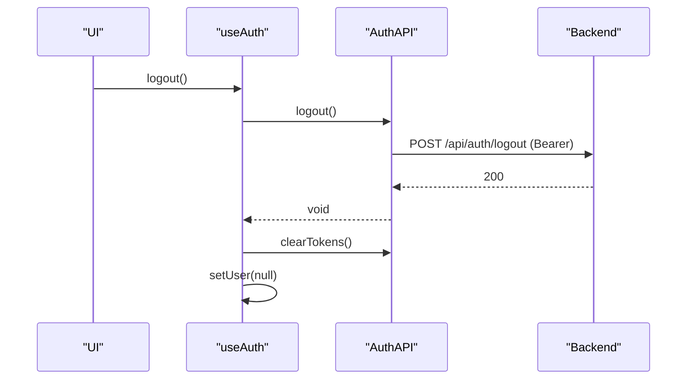
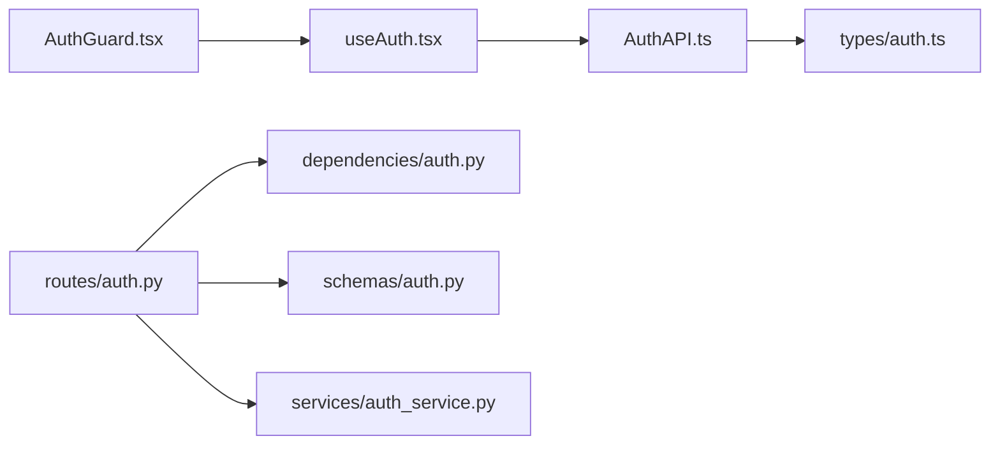

# Authentication System

<cite>
**Referenced Files in This Document**
- [useAuth.tsx](file://Frontend/greenflora/Hooks/useAuth.tsx)
- [AuthGuard.tsx](file://Frontend/greenflora/components/auth/AuthGuard.tsx)
- [AuthAPI.ts](file://Frontend/greenflora/services/AuthAPI.ts)
- [auth.ts](file://Frontend/greenflora/types/auth.ts)
- [layout.tsx](file://Frontend/greenflora/app/layout.tsx)
- [page.tsx (login)](file://Frontend/greenflora/app/login/page.tsx)
- [auth.py (routes)](file://Backend/routes/auth.py)
- [auth_service.py](file://Backend/services/auth_service.py)
- [auth.py (dependencies)](file://Backend/dependencies/auth.py)
- [auth.py (schemas)](file://Backend/schemas/auth.py)
</cite>

## Table of Contents
1. [Introduction](#introduction)
2. [Project Structure](#project-structure)
3. [Core Components](#core-components)
4. [Architecture Overview](#architecture-overview)
5. [Detailed Component Analysis](#detailed-component-analysis)
6. [Dependency Analysis](#dependency-analysis)
7. [Performance Considerations](#performance-considerations)
8. [Troubleshooting Guide](#troubleshooting-guide)
9. [Conclusion](#conclusion)

## Introduction
This document explains the Green-Flora authentication system with a focus on:
- The custom useAuth hook for state, session restoration, and actions
- Protected route protection via AuthGuard
- Token management strategy and automatic refresh
- Session handling and user state persistence
- The AuthAPI service layer for requests, errors, and responses
- Login/signup flows, logout behavior, and security considerations

The system uses JWT access and refresh tokens stored in localStorage, with a client-side provider that restores sessions on app start and redirects unauthenticated users to login.

## Project Structure
Authentication spans both frontend and backend:
- Frontend:
  - Hook and context: useAuth.tsx
  - Route guard: AuthGuard.tsx
  - API service: AuthAPI.ts
  - Types: auth.ts
  - App bootstrap: layout.tsx wraps the app in AuthProvider
  - Login page: page.tsx demonstrates usage of useAuth
- Backend:
  - Routes: /api/auth endpoints
  - Service: auth_service.py encapsulates Supabase Auth interactions
  - Dependencies: get_current_user dependency for protected routes
  - Schemas: request/response models

**Diagram sources**
- [useAuth.tsx:46-127](file://Frontend/greenflora/Hooks/useAuth.tsx#L46-L127)
- [AuthGuard.tsx:37-58](file://Frontend/greenflora/components/auth/AuthGuard.tsx#L37-L58)
- [AuthAPI.ts:16-178](file://Frontend/greenflora/services/AuthAPI.ts#L16-L178)
- [auth.ts:8-35](file://Frontend/greenflora/types/auth.ts#L8-L35)
- [layout.tsx:23-67](file://Frontend/greenflora/app/layout.tsx#L23-L67)
- [page.tsx (login):24-54](file://Frontend/greenflora/app/login/page.tsx#L24-L54)
- [auth.py (routes):68-131](file://Backend/routes/auth.py#L68-L131)
- [auth_service.py:51-193](file://Backend/services/auth_service.py#L51-L193)
- [auth.py (dependencies):36-100](file://Backend/dependencies/auth.py#L36-L100)
- [auth.py (schemas):42-100](file://Backend/schemas/auth.py#L42-L100)

**Section sources**
- [useAuth.tsx:46-127](file://Frontend/greenflora/Hooks/useAuth.tsx#L46-L127)
- [AuthGuard.tsx:37-58](file://Frontend/greenflora/components/auth/AuthGuard.tsx#L37-L58)
- [AuthAPI.ts:16-178](file://Frontend/greenflora/services/AuthAPI.ts#L16-L178)
- [auth.ts:8-35](file://Frontend/greenflora/types/auth.ts#L8-L35)
- [layout.tsx:23-67](file://Frontend/greenflora/app/layout.tsx#L23-L67)
- [page.tsx (login):24-54](file://Frontend/greenflora/app/login/page.tsx#L24-L54)
- [auth.py (routes):68-131](file://Backend/routes/auth.py#L68-L131)
- [auth_service.py:51-193](file://Backend/services/auth_service.py#L51-L193)
- [auth.py (dependencies):36-100](file://Backend/dependencies/auth.py#L36-L100)
- [auth.py (schemas):42-100](file://Backend/schemas/auth.py#L42-L100)

## Core Components
- useAuth hook and provider:
  - Provides user state, loading state, isAuthenticated flag, and login/signup/logout actions
  - Restores session on mount by reading stored tokens and calling /api/auth/me; if token is invalid, attempts refresh using stored refresh token
  - Persists tokens via AuthAPI.storeTokens and clears them on logout
- AuthGuard component:
  - Wraps protected pages; shows a loading screen while determining auth status
  - Redirects unauthenticated users to /login
- AuthAPI service:
  - Centralizes all authentication HTTP calls
  - Stores tokens in localStorage under consistent keys
  - Adds Authorization header when includeAuth is true
  - Throws typed AuthApiError with status and type for better error handling
- Backend routes and services:
  - Public endpoints: signup, login, refresh
  - Protected endpoints: logout, me (require valid Bearer token)
  - AuthService handles Supabase Auth operations and maps errors to HTTP statuses

**Section sources**
- [useAuth.tsx:46-127](file://Frontend/greenflora/Hooks/useAuth.tsx#L46-L127)
- [AuthGuard.tsx:37-58](file://Frontend/greenflora/components/auth/AuthGuard.tsx#L37-L58)
- [AuthAPI.ts:25-178](file://Frontend/greenflora/services/AuthAPI.ts#L25-L178)
- [auth.py (routes):68-131](file://Backend/routes/auth.py#L68-L131)
- [auth_service.py:51-193](file://Backend/services/auth_service.py#L51-L193)

## Architecture Overview
End-to-end flow for authentication and protected access:

**Diagram sources**
- [useAuth.tsx:51-88](file://Frontend/greenflora/Hooks/useAuth.tsx#L51-L88)
- [AuthAPI.ts:143-178](file://Frontend/greenflora/services/AuthAPI.ts#L143-L178)
- [auth.py (routes):79-131](file://Backend/routes/auth.py#L79-L131)
- [auth_service.py:94-193](file://Backend/services/auth_service.py#L94-L193)

## Detailed Component Analysis

### useAuth Hook and Provider
Responsibilities:
- Initialize user state and loading state
- On mount, restore session from stored tokens
  - If no token, mark as not authenticated
  - If token exists, call /api/auth/me; on failure, attempt refresh using stored refresh token
  - On successful refresh, persist new tokens and fetch user again
- Actions:
  - login: call /api/auth/login, store tokens, fetch user
  - signup: call /api/auth/signup, store tokens, fetch user
  - logout: call /api/auth/logout (best-effort), clear tokens, reset user

State shape:
- user: current user object or null
- isLoading: boolean indicating initialization/restore phase
- isAuthenticated: derived from user presence
- login, signup, logout: async functions

**Diagram sources**
- [useAuth.tsx:51-88](file://Frontend/greenflora/Hooks/useAuth.tsx#L51-L88)
- [AuthAPI.ts:28-46](file://Frontend/greenflora/services/AuthAPI.ts#L28-L46)
- [AuthAPI.ts:157-178](file://Frontend/greenflora/services/AuthAPI.ts#L157-L178)

**Section sources**
- [useAuth.tsx:46-127](file://Frontend/greenflora/Hooks/useAuth.tsx#L46-L127)

### AuthGuard Component
Behavior:
- Reads isAuthenticated and isLoading from useAuth
- While loading, renders a full-page loading skeleton
- If not authenticated after loading completes, redirects to /login
- Otherwise, renders children

**Diagram sources**
- [AuthGuard.tsx:37-58](file://Frontend/greenflora/components/auth/AuthGuard.tsx#L37-L58)

**Section sources**
- [AuthGuard.tsx:37-58](file://Frontend/greenflora/components/auth/AuthGuard.tsx#L37-L58)

### AuthAPI Service Layer
Key responsibilities:
- Token storage:
  - Keys: gf_access_token, gf_refresh_token
  - Functions: getStoredAccessToken, getStoredRefreshToken, storeTokens, clearTokens
- Request helper:
  - Base URL from environment variable with fallback
  - Timeout via AbortController
  - Optional Authorization header injection for protected calls
  - Parses response JSON; throws AuthApiError with status and type
- Endpoints:
  - signup, login, refreshSession, logout, getMe

Error classification:
- network: connection failures
- timeout: request exceeded timeout
- validation: client-side validation issues (not thrown here)
- server: 5xx responses
- auth: 400/401 responses
- unknown: other errors

**Diagram sources**
- [AuthAPI.ts:25-178](file://Frontend/greenflora/services/AuthAPI.ts#L25-L178)

**Section sources**
- [AuthAPI.ts:16-178](file://Frontend/greenflora/services/AuthAPI.ts#L16-L178)

### Backend Authentication Flow
Endpoints:
- POST /api/auth/signup: create account, return tokens and user info
- POST /api/auth/login: authenticate, return tokens and user info
- POST /api/auth/refresh: exchange refresh token for new session
- POST /api/auth/logout: best-effort sign out (protected)
- GET /api/auth/me: return current user (protected)

Protected routes:
- Use get_current_user dependency to validate Bearer token
- Returns user dict including raw token for logout usage

Service layer:
- AuthService interacts with Supabase Auth
- Handles email vs phone detection based on contact field
- Maps errors to appropriate HTTP statuses

**Diagram sources**
- [auth.py (routes):68-131](file://Backend/routes/auth.py#L68-L131)
- [auth_service.py:94-193](file://Backend/services/auth_service.py#L94-L193)
- [auth.py (dependencies):36-100](file://Backend/dependencies/auth.py#L36-L100)

**Section sources**
- [auth.py (routes):68-131](file://Backend/routes/auth.py#L68-L131)
- [auth_service.py:51-193](file://Backend/services/auth_service.py#L51-L193)
- [auth.py (dependencies):36-100](file://Backend/dependencies/auth.py#L36-L100)
- [auth.py (schemas):42-100](file://Backend/schemas/auth.py#L42-L100)

### Login/Signup Flows
- Login page:
  - Collects contact and password
  - Calls useAuth.login which invokes AuthAPI.login
  - On success, navigates to dashboard
  - Displays errors from AuthApiError
- Signup:
  - Similar flow via useAuth.signup
  - Stores tokens and sets user

**Diagram sources**
- [page.tsx (login):35-54](file://Frontend/greenflora/app/login/page.tsx#L35-L54)
- [useAuth.tsx:90-103](file://Frontend/greenflora/Hooks/useAuth.tsx#L90-L103)
- [AuthAPI.ts:150-178](file://Frontend/greenflora/services/AuthAPI.ts#L150-L178)
- [auth.py (routes):79-131](file://Backend/routes/auth.py#L79-L131)

**Section sources**
- [page.tsx (login):24-54](file://Frontend/greenflora/app/login/page.tsx#L24-L54)
- [useAuth.tsx:90-103](file://Frontend/greenflora/Hooks/useAuth.tsx#L90-L103)

### Logout Functionality
- useAuth.logout:
  - Attempts to call /api/auth/logout (protected)
  - Clears local tokens regardless of outcome
  - Resets user state to null
- Backend logout:
  - Best-effort sign out via Supabase
  - Always returns success response

**Diagram sources**
- [useAuth.tsx:105-113](file://Frontend/greenflora/Hooks/useAuth.tsx#L105-L113)
- [AuthAPI.ts:164-170](file://Frontend/greenflora/services/AuthAPI.ts#L164-L170)
- [auth.py (routes):105-120](file://Backend/routes/auth.py#L105-L120)

**Section sources**
- [useAuth.tsx:105-113](file://Frontend/greenflora/Hooks/useAuth.tsx#L105-L113)
- [AuthAPI.ts:164-170](file://Frontend/greenflora/services/AuthAPI.ts#L164-L170)
- [auth.py (routes):105-120](file://Backend/routes/auth.py#L105-L120)

## Dependency Analysis
Coupling and cohesion:
- useAuth depends on AuthAPI for all persistence and networking
- AuthGuard depends on useAuth for auth state
- AuthAPI depends on types/auth for shapes
- Backend routes depend on schemas/auth for validation and on dependencies/auth for protection
- Services encapsulate external Supabase interactions, keeping routes thin

External integrations:
- Supabase Auth via AuthService
- Environment-based API base URL for frontend

Potential circular dependencies:
- None observed; clear separation between hooks, components, services, and backend layers

**Diagram sources**
- [useAuth.tsx:46-127](file://Frontend/greenflora/Hooks/useAuth.tsx#L46-L127)
- [AuthGuard.tsx:37-58](file://Frontend/greenflora/components/auth/AuthGuard.tsx#L37-L58)
- [AuthAPI.ts:16-178](file://Frontend/greenflora/services/AuthAPI.ts#L16-L178)
- [auth.ts:8-35](file://Frontend/greenflora/types/auth.ts#L8-L35)
- [auth.py (routes):68-131](file://Backend/routes/auth.py#L68-L131)
- [auth.py (dependencies):36-100](file://Backend/dependencies/auth.py#L36-L100)
- [auth.py (schemas):42-100](file://Backend/schemas/auth.py#L42-L100)
- [auth_service.py:51-193](file://Backend/services/auth_service.py#L51-L193)

**Section sources**
- [useAuth.tsx:46-127](file://Frontend/greenflora/Hooks/useAuth.tsx#L46-L127)
- [AuthGuard.tsx:37-58](file://Frontend/greenflora/components/auth/AuthGuard.tsx#L37-L58)
- [AuthAPI.ts:16-178](file://Frontend/greenflora/services/AuthAPI.ts#L16-L178)
- [auth.ts:8-35](file://Frontend/greenflora/types/auth.ts#L8-L35)
- [auth.py (routes):68-131](file://Backend/routes/auth.py#L68-L131)
- [auth.py (dependencies):36-100](file://Backend/dependencies/auth.py#L36-L100)
- [auth.py (schemas):42-100](file://Backend/schemas/auth.py#L42-L100)
- [auth_service.py:51-193](file://Backend/services/auth_service.py#L51-L193)

## Performance Considerations
- Token retrieval and restoration occur once on app mount; subsequent renders are fast
- Requests include timeouts to avoid hanging UI
- AuthGuard prevents rendering protected content during redirects
- Best-effort logout avoids blocking UI on backend failures

[No sources needed since this section provides general guidance]

## Troubleshooting Guide
Common issues and resolutions:
- Invalid or expired token:
  - Frontend attempts refresh using stored refresh token
  - If refresh fails, tokens are cleared and user is logged out
  - Backend returns 401 for invalid/expired tokens
- Network errors:
  - AuthAPI throws AuthApiError with type "network"
  - UI should display connection-related messages
- Timeouts:
  - Requests abort after configured timeout
  - UI can prompt user to retry
- Service unavailable:
  - Backend may return 503 if Supabase is not configured
  - Frontend should handle gracefully and inform users

**Section sources**
- [AuthAPI.ts:98-136](file://Frontend/greenflora/services/AuthAPI.ts#L98-L136)
- [auth.py (routes):45-61](file://Backend/routes/auth.py#L45-L61)
- [auth_service.py:24-45](file://Backend/services/auth_service.py#L24-L45)

## Conclusion
Green-Flora’s authentication system centralizes token management in AuthAPI, manages user state and session restoration in useAuth, and protects routes with AuthGuard. The backend exposes well-defined endpoints with robust error mapping and protected route dependencies. Automatic refresh ensures seamless sessions, while best-effort logout and clear error handling improve resilience. Security considerations include storing tokens in localStorage, sending Bearer tokens only to protected endpoints, and validating inputs on the backend.

[No sources needed since this section summarizes without analyzing specific files]