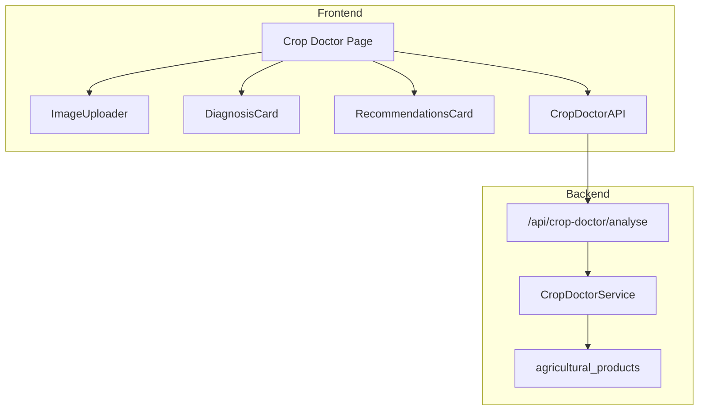
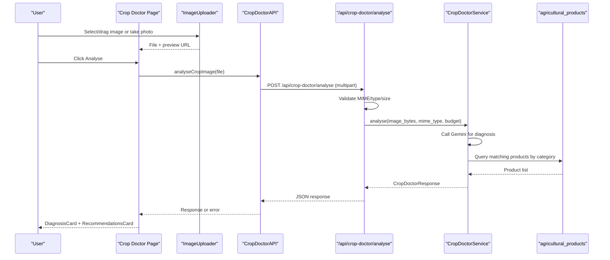
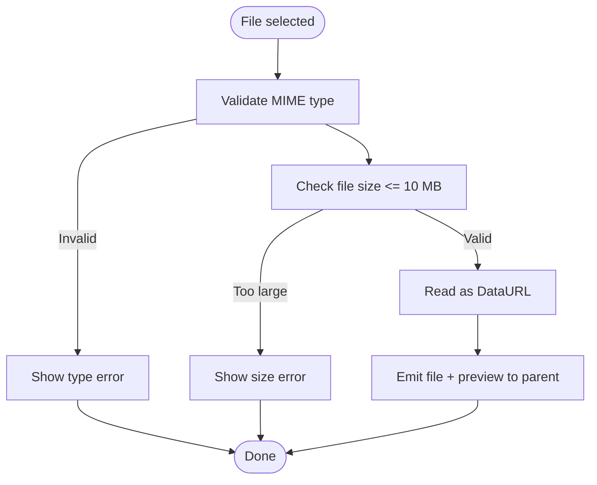
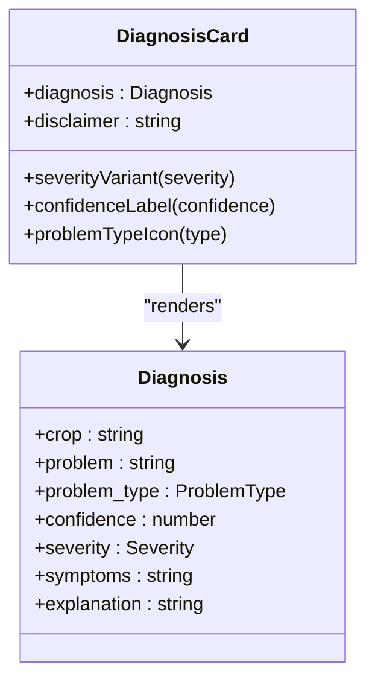
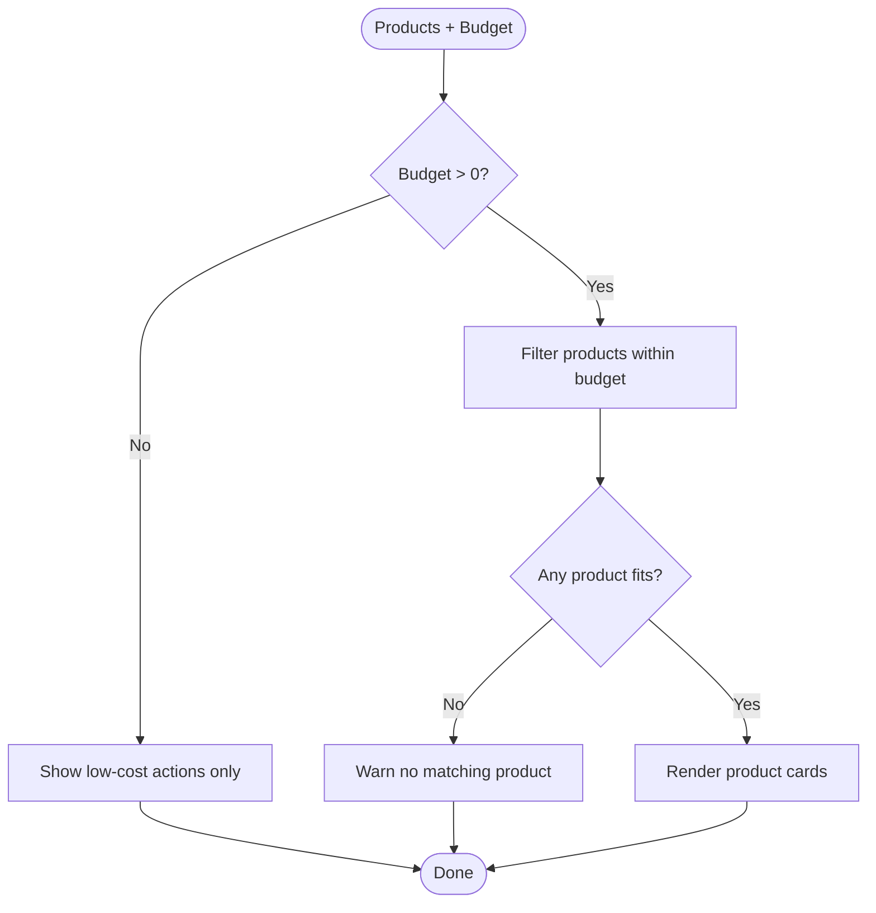
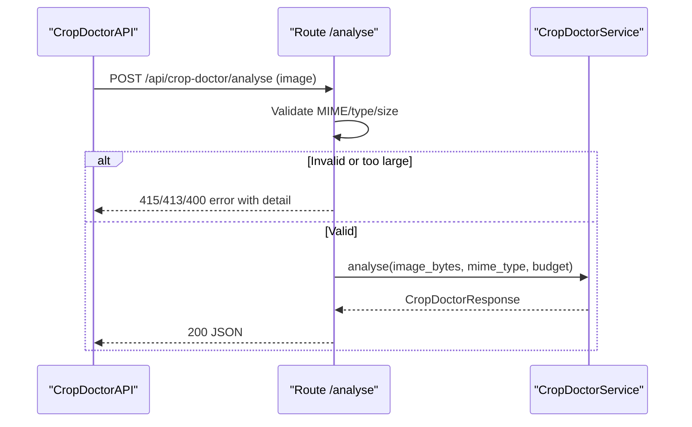
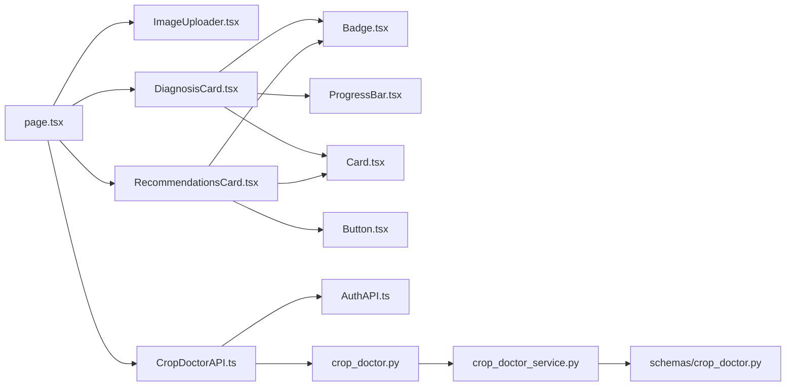

# Crop Doctor Module

<cite>
**Referenced Files in This Document**
- [page.tsx](file://Frontend/greenflora/app/crop-doctor/page.tsx)
- [ImageUploader.tsx](file://Frontend/greenflora/components/cropDoctor/ImageUploader.tsx)
- [DiagnosisCard.tsx](file://Frontend/greenflora/components/cropDoctor/DiagnosisCard.tsx)
- [RecommendationsCard.tsx](file://Frontend/greenflora/components/cropDoctor/RecommendationsCard.tsx)
- [CropDoctorAPI.ts](file://Frontend/greenflora/services/CropDoctorAPI.ts)
- [cropDoctor.ts](file://Frontend/greenflora/types/cropDoctor.ts)
- [crop_doctor.py](file://Backend/routes/crop_doctor.py)
- [crop_doctor_service.py](file://Backend/services/crop_doctor_service.py)
- [crop_doctor.py (schemas)](file://Backend/schemas/crop_doctor.py)
- [ProgressBar.tsx](file://Frontend/greenflora/components/ui/ProgressBar.tsx)
- [Badge.tsx](file://Frontend/greenflora/components/ui/Badge.tsx)
- [Card.tsx](file://Frontend/greenflora/components/ui/Card.tsx)
</cite>

## Table of Contents
1. [Introduction](#introduction)
2. [Project Structure](#project-structure)
3. [Core Components](#core-components)
4. [Architecture Overview](#architecture-overview)
5. [Detailed Component Analysis](#detailed-component-analysis)
6. [Dependency Analysis](#dependency-analysis)
7. [Performance Considerations](#performance-considerations)
8. [Troubleshooting Guide](#troubleshooting-guide)
9. [Conclusion](#conclusion)

## Introduction
The Crop Doctor module provides AI-powered plant disease detection through image analysis. Users upload a photo of their crop, the system analyzes it using a multimodal model, and returns a diagnosis with confidence, severity, symptoms, explanation, and budget-aware treatment recommendations. It also offers low-cost actions when paid products are not suitable or available. The module is designed for mobile-first usage, supporting drag-and-drop, file browsing, and direct camera capture on mobile devices.

## Project Structure
The feature spans both frontend and backend:
- Frontend page orchestrates the user workflow and composes UI components for upload, diagnosis display, and recommendations.
- A dedicated API service handles multipart image uploads, timeouts, and error classification.
- Backend routes validate inputs, resolve farmer budget context, and call the service layer.
- Service layer performs AI analysis, product matching against a database, and constructs the final response.

**Diagram sources**
- [page.tsx:26-174](file://Frontend/greenflora/app/crop-doctor/page.tsx#L26-L174)
- [CropDoctorAPI.ts:47-106](file://Frontend/greenflora/services/CropDoctorAPI.ts#L47-L106)
- [crop_doctor.py:48-125](file://Backend/routes/crop_doctor.py#L48-L125)
- [crop_doctor_service.py:131-165](file://Backend/services/crop_doctor_service.py#L131-L165)

**Section sources**
- [page.tsx:26-174](file://Frontend/greenflora/app/crop-doctor/page.tsx#L26-L174)
- [crop_doctor.py:48-125](file://Backend/routes/crop_doctor.py#L48-L125)
- [crop_doctor_service.py:131-165](file://Backend/services/crop_doctor_service.py#L131-L165)

## Core Components
- ImageUploader: Validates files, supports drag-and-drop, preview, and camera capture; enforces size and type constraints.
- DiagnosisCard: Displays AI-generated diagnosis including crop, problem, confidence score, severity, symptoms, explanation, and category badge.
- RecommendationsCard: Shows budget-aware product recommendations and low-cost actions; guides users to set budget if missing.
- CropDoctorAPI: Multipart upload client with timeout handling and structured error classification.
- Backend route and service: Validate input, call Gemini for diagnosis, match products from database, and return a unified response.

**Section sources**
- [ImageUploader.tsx:28-56](file://Frontend/greenflora/components/cropDoctor/ImageUploader.tsx#L28-L56)
- [DiagnosisCard.tsx:21-64](file://Frontend/greenflora/components/cropDoctor/DiagnosisCard.tsx#L21-L64)
- [RecommendationsCard.tsx:91-204](file://Frontend/greenflora/components/cropDoctor/RecommendationsCard.tsx#L91-L204)
- [CropDoctorAPI.ts:47-106](file://Frontend/greenflora/services/CropDoctorAPI.ts#L47-L106)
- [crop_doctor.py:48-125](file://Backend/routes/crop_doctor.py#L48-L125)
- [crop_doctor_service.py:131-165](file://Backend/services/crop_doctor_service.py#L131-L165)

## Architecture Overview
End-to-end flow from upload to diagnosis and recommendations:

**Diagram sources**
- [page.tsx:43-66](file://Frontend/greenflora/app/crop-doctor/page.tsx#L43-L66)
- [CropDoctorAPI.ts:47-106](file://Frontend/greenflora/services/CropDoctorAPI.ts#L47-L106)
- [crop_doctor.py:48-125](file://Backend/routes/crop_doctor.py#L48-L125)
- [crop_doctor_service.py:131-165](file://Backend/services/crop_doctor_service.py#L131-L165)

## Detailed Component Analysis

### ImageUploader
Responsibilities:
- Accepts images via drag-and-drop, file picker, or camera capture on mobile.
- Validates MIME types and maximum file size; shows inline errors.
- Generates a preview URL and passes the selected file up to the parent component.
- Disables interactions during analysis to prevent duplicate submissions.

Key behaviors:
- Accepted types: JPEG, PNG, WebP.
- Maximum size: 10 MB.
- Preview rendering with clear action.
- Camera capture uses environment-facing camera on mobile.

**Diagram sources**
- [ImageUploader.tsx:28-56](file://Frontend/greenflora/components/cropDoctor/ImageUploader.tsx#L28-L56)
- [ImageUploader.tsx:169-185](file://Frontend/greenflora/components/cropDoctor/ImageUploader.tsx#L169-L185)

**Section sources**
- [ImageUploader.tsx:28-56](file://Frontend/greenflora/components/cropDoctor/ImageUploader.tsx#L28-L56)
- [ImageUploader.tsx:86-108](file://Frontend/greenflora/components/cropDoctor/ImageUploader.tsx#L86-L108)
- [ImageUploader.tsx:110-195](file://Frontend/greenflora/components/cropDoctor/ImageUploader.tsx#L110-L195)

### DiagnosisCard
Displays:
- Detected crop and problem with an icon based on problem type.
- Confidence percentage with color-coded label and progress bar.
- Severity badge mapped to danger/warning/success.
- Symptoms and explanation sections.
- Category badge and disclaimer text.

Behavioral highlights:
- Low-confidence warning guidance encourages re-upload with better photos.
- Uses shared UI primitives (Badge, ProgressBar, Card).

**Diagram sources**
- [DiagnosisCard.tsx:16-64](file://Frontend/greenflora/components/cropDoctor/DiagnosisCard.tsx#L16-L64)
- [cropDoctor.ts:18-27](file://Frontend/greenflora/types/cropDoctor.ts#L18-L27)

**Section sources**
- [DiagnosisCard.tsx:21-64](file://Frontend/greenflora/components/cropDoctor/DiagnosisCard.tsx#L21-L64)
- [DiagnosisCard.tsx:64-193](file://Frontend/greenflora/components/cropDoctor/DiagnosisCard.tsx#L64-L193)
- [cropDoctor.ts:18-27](file://Frontend/greenflora/types/cropDoctor.ts#L18-L27)

### RecommendationsCard
Displays:
- Budget context and link to set budget if missing.
- Product cards showing brand, company, target, dosage, price range, and budget fit.
- Low-cost actions when no paid option fits or budget is zero.

Behavioral highlights:
- Filters out paid products when budget is zero.
- Communicates when no matching product fits the budget.
- Uses responsive grid layout for product cards.

**Diagram sources**
- [RecommendationsCard.tsx:91-204](file://Frontend/greenflora/components/cropDoctor/RecommendationsCard.tsx#L91-L204)

**Section sources**
- [RecommendationsCard.tsx:91-204](file://Frontend/greenflora/components/cropDoctor/RecommendationsCard.tsx#L91-L204)

### API Integration and Error Handling
Frontend:
- Sends multipart/form-data with the image to the backend endpoint.
- Adds Authorization header when token exists.
- Enforces a 60-second timeout and classifies errors into network, timeout, validation, server, or unknown.
- Propagates structured errors to the page for user-friendly messages.

Backend:
- Validates MIME type and size; rejects unsupported or oversized files.
- Resolves farmer budget from profile or demo mode.
- Calls Gemini with a strict JSON prompt and parses results robustly.
- Matches products from the agricultural_products table and applies budget filtering.
- Returns a unified response including diagnosis, products, budget context, and low-cost actions.

**Diagram sources**
- [CropDoctorAPI.ts:47-106](file://Frontend/greenflora/services/CropDoctorAPI.ts#L47-L106)
- [crop_doctor.py:48-125](file://Backend/routes/crop_doctor.py#L48-L125)
- [crop_doctor_service.py:131-165](file://Backend/services/crop_doctor_service.py#L131-L165)

**Section sources**
- [CropDoctorAPI.ts:47-106](file://Frontend/greenflora/services/CropDoctorAPI.ts#L47-L106)
- [crop_doctor.py:48-125](file://Backend/routes/crop_doctor.py#L48-L125)
- [crop_doctor_service.py:171-205](file://Backend/services/crop_doctor_service.py#L171-L205)

### Data Models and Types
- Frontend types define Diagnosis, ProductRecommendation, BudgetContext, LowCostAction, and full response shape.
- Backend schemas mirror these structures with Pydantic models and enums for problem type and severity.

**Section sources**
- [cropDoctor.ts:8-64](file://Frontend/greenflora/types/cropDoctor.ts#L8-L64)
- [crop_doctor.py (schemas):21-123](file://Backend/schemas/crop_doctor.py#L21-L123)

## Dependency Analysis
- Page depends on ImageUploader, DiagnosisCard, RecommendationsCard, and CropDoctorAPI.
- ImageUploader depends on shared UI Button and renders previews.
- DiagnosisCard depends on Badge, ProgressBar, and Card.
- RecommendationsCard depends on Card, Badge, Button, and Next.js Link.
- CropDoctorAPI depends on AuthAPI for tokens and calls the backend endpoint.
- Backend route depends on auth dependency, farmer service for budget, and crop_doctor_service.
- Service depends on Gemini SDK and Supabase client for product lookup.

**Diagram sources**
- [page.tsx:6-18](file://Frontend/greenflora/app/crop-doctor/page.tsx#L6-L18)
- [DiagnosisCard.tsx:11-14](file://Frontend/greenflora/components/cropDoctor/DiagnosisCard.tsx#L11-L14)
- [RecommendationsCard.tsx:13-20](file://Frontend/greenflora/components/cropDoctor/RecommendationsCard.tsx#L13-L20)
- [CropDoctorAPI.ts:9-10](file://Frontend/greenflora/services/CropDoctorAPI.ts#L9-L10)
- [crop_doctor.py:26-30](file://Backend/routes/crop_doctor.py#L26-L30)
- [crop_doctor_service.py:22-34](file://Backend/services/crop_doctor_service.py#L22-L34)

**Section sources**
- [page.tsx:6-18](file://Frontend/greenflora/app/crop-doctor/page.tsx#L6-L18)
- [crop_doctor.py:26-30](file://Backend/routes/crop_doctor.py#L26-L30)
- [crop_doctor_service.py:22-34](file://Backend/services/crop_doctor_service.py#L22-L34)

## Performance Considerations
- Client-side validation prevents uploading oversized or unsupported files early, reducing unnecessary network requests.
- Backend enforces the same limits and returns explicit status codes for invalid inputs.
- Timeout handling avoids long hangs when Gemini processing is slow; suggests retrying with smaller images.
- Product matching queries only relevant categories and scores results to limit database load and response size.
- Low-cost actions provide immediate value even when product lookup fails or does not fit budget.

[No sources needed since this section provides general guidance]

## Troubleshooting Guide
Common issues and resolutions:
- Unsupported image type: Ensure JPEG, PNG, or WebP; the backend will reject other types with a specific error.
- Image too large: Keep under 10 MB; the frontend validates and the backend enforces the same limit.
- Empty image: Re-select a valid file; both sides check for empty payloads.
- Network or timeout errors: Retry after checking connectivity; consider compressing or resizing the image before upload.
- No matching products: Set or increase your treatment budget to see more options; otherwise use low-cost actions provided.
- Low confidence result: Re-upload a clearer, well-lit close-up photo of the affected part.

**Section sources**
- [crop_doctor.py:63-87](file://Backend/routes/crop_doctor.py#L63-L87)
- [CropDoctorAPI.ts:33-39](file://Frontend/greenflora/services/CropDoctorAPI.ts#L33-L39)
- [crop_doctor_service.py:207-258](file://Backend/services/crop_doctor_service.py#L207-L258)

## Conclusion
The Crop Doctor module delivers a complete diagnostic workflow: intuitive image capture and validation, robust AI-driven analysis, and actionable, budget-aware recommendations. It balances performance and reliability through strict input validation, timeouts, and fallback low-cost actions. The modular design separates concerns across UI, API, routing, and service layers, making it maintainable and extensible for future enhancements such as additional product integrations or improved recommendation algorithms.