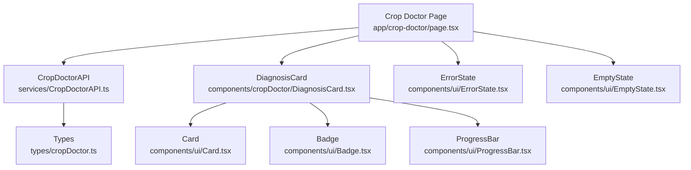
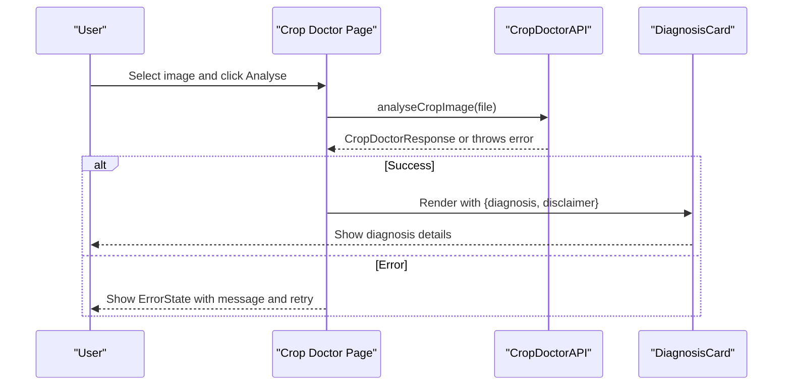
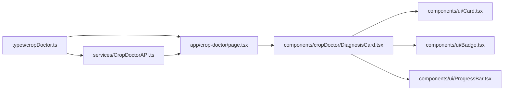
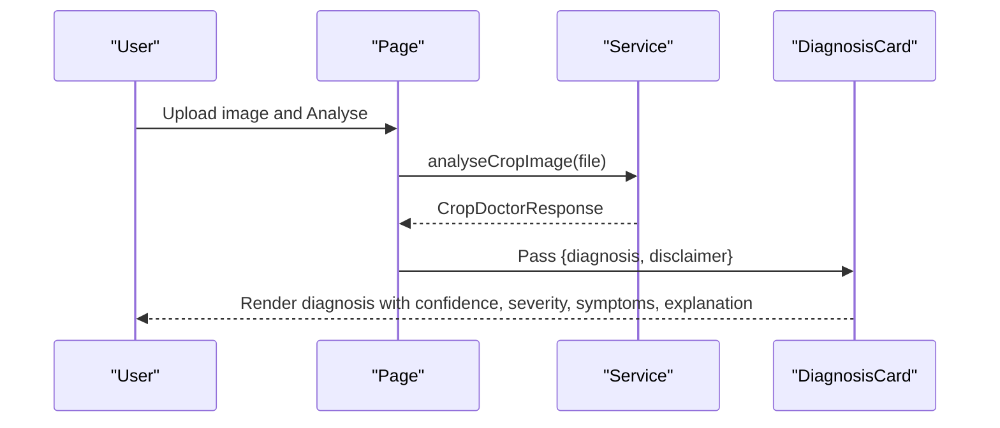
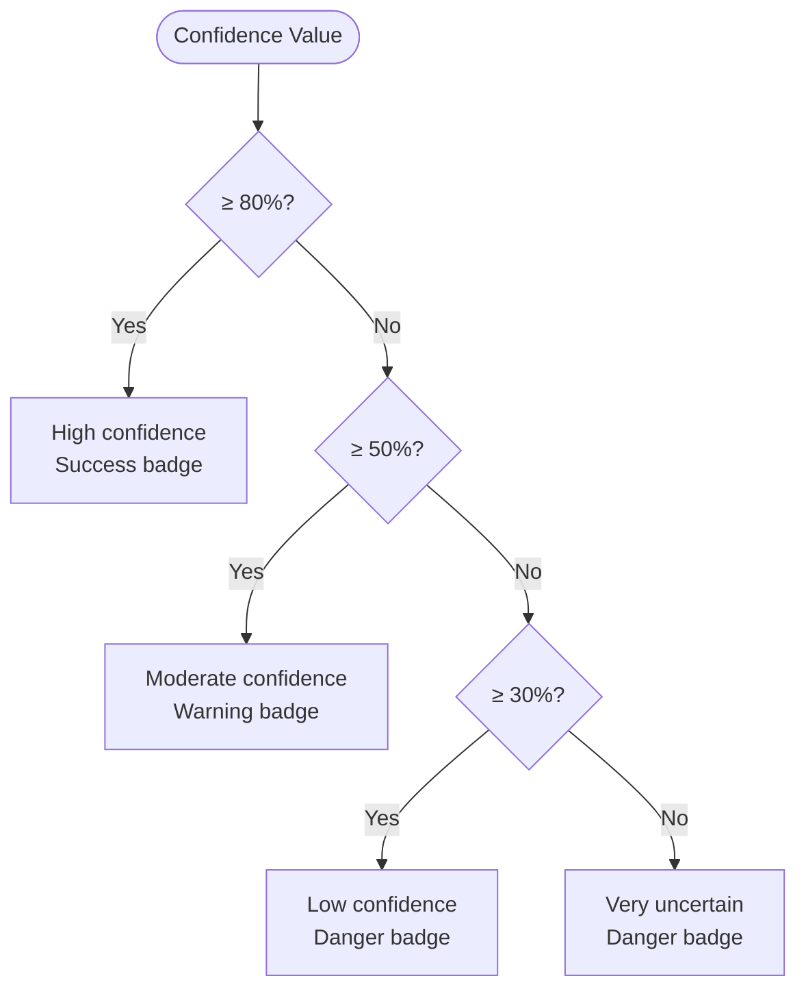

# Diagnosis Display Component

<cite>
**Referenced Files in This Document**
- [DiagnosisCard.tsx](file://Frontend/greenflora/components/cropDoctor/DiagnosisCard.tsx)
- [cropDoctor.ts](file://Frontend/greenflora/types/cropDoctor.ts)
- [page.tsx](file://Frontend/greenflora/app/crop-doctor/page.tsx)
- [CropDoctorAPI.ts](file://Frontend/greenflora/services/CropDoctorAPI.ts)
- [ProgressBar.tsx](file://Frontend/greenflora/components/ui/ProgressBar.tsx)
- [Badge.tsx](file://Frontend/greenflora/components/ui/Badge.tsx)
- [Card.tsx](file://Frontend/greenflora/components/ui/Card.tsx)
- [ErrorState.tsx](file://Frontend/greenflora/components/ui/ErrorState.tsx)
- [EmptyState.tsx](file://Frontend/greenflora/components/ui/EmptyState.tsx)
- [globals.css](file://Frontend/greenflora/app/globals.css)
</cite>

## Table of Contents
1. [Introduction](#introduction)
2. [Project Structure](#project-structure)
3. [Core Components](#core-components)
4. [Architecture Overview](#architecture-overview)
5. [Detailed Component Analysis](#detailed-component-analysis)
6. [Dependency Analysis](#dependency-analysis)
7. [Performance Considerations](#performance-considerations)
8. [Troubleshooting Guide](#troubleshooting-guide)
9. [Conclusion](#conclusion)
10. [Appendices](#appendices)

## Introduction
This document provides detailed documentation for the DiagnosisCard component, which displays AI-generated plant disease diagnosis results. It explains the props interface (disease name, confidence scores, severity levels, and problem type), visual representation (progress bars, color-coded severity indicators, confidence metrics), responsive design patterns, TypeScript integration, loading/error/empty states, accessibility considerations, and example scenarios such as high-confidence matches, ambiguous results, and system errors.

## Project Structure
The Diagnosis feature is implemented in the Crop Doctor page and composed from reusable UI components:
- The page orchestrates image upload, analysis state, and renders the DiagnosisCard on success.
- DiagnosisCard composes Card, Badge, ProgressBar, and icons to present diagnosis details.
- Types define the shape of diagnosis data and API responses.
- The service layer handles network requests and error classification.

**Diagram sources**
- [page.tsx:1-174](file://Frontend/greenflora/app/crop-doctor/page.tsx#L1-L174)
- [CropDoctorAPI.ts:1-107](file://Frontend/greenflora/services/CropDoctorAPI.ts#L1-L107)
- [DiagnosisCard.tsx:1-193](file://Frontend/greenflora/components/cropDoctor/DiagnosisCard.tsx#L1-L193)
- [Card.tsx:1-39](file://Frontend/greenflora/components/ui/Card.tsx#L1-L39)
- [Badge.tsx:1-31](file://Frontend/greenflora/components/ui/Badge.tsx#L1-L31)
- [ProgressBar.tsx:1-50](file://Frontend/greenflora/components/ui/ProgressBar.tsx#L1-L50)
- [ErrorState.tsx:1-39](file://Frontend/greenflora/components/ui/ErrorState.tsx#L1-L39)
- [EmptyState.tsx:1-34](file://Frontend/greenflora/components/ui/EmptyState.tsx#L1-L34)
- [cropDoctor.ts:1-64](file://Frontend/greenflora/types/cropDoctor.ts#L1-L64)

**Section sources**
- [page.tsx:1-174](file://Frontend/greenflora/app/crop-doctor/page.tsx#L1-L174)
- [CropDoctorAPI.ts:1-107](file://Frontend/greenflora/services/CropDoctorAPI.ts#L1-L107)
- [DiagnosisCard.tsx:1-193](file://Frontend/greenflora/components/cropDoctor/DiagnosisCard.tsx#L1-L193)
- [cropDoctor.ts:1-64](file://Frontend/greenflora/types/cropDoctor.ts#L1-L64)

## Core Components
- DiagnosisCard: Renders a single diagnosis result with crop, problem, problem type, confidence, severity, symptoms, explanation, category badge, and disclaimer. It also shows a low-confidence warning when applicable.
- ProgressBar: Visualizes confidence percentage with color-coded fill based on thresholds.
- Badge: Displays severity and category labels with semantic colors.
- Card: Provides consistent container styling and padding variants.
- ErrorState and EmptyState: Used by the page to communicate loading, error, and idle states.

Key responsibilities:
- Map backend types to UI visuals.
- Provide clear confidence and severity signals.
- Maintain accessible structure and readable content hierarchy.

**Section sources**
- [DiagnosisCard.tsx:16-193](file://Frontend/greenflora/components/cropDoctor/DiagnosisCard.tsx#L16-L193)
- [ProgressBar.tsx:1-50](file://Frontend/greenflora/components/ui/ProgressBar.tsx#L1-L50)
- [Badge.tsx:1-31](file://Frontend/greenflora/components/ui/Badge.tsx#L1-L31)
- [Card.tsx:1-39](file://Frontend/greenflora/components/ui/Card.tsx#L1-L39)
- [ErrorState.tsx:1-39](file://Frontend/greenflora/components/ui/ErrorState.tsx#L1-L39)
- [EmptyState.tsx:1-34](file://Frontend/greenflora/components/ui/EmptyState.tsx#L1-L34)

## Architecture Overview
The Crop Doctor page manages user interactions and state transitions:
- Idle: Shows empty state and upload area.
- Analyzing: Shows a loading indicator while calling the API.
- Success: Renders DiagnosisCard and recommendations.
- Error: Shows an error message with retry option.

Data flow:
- User uploads an image → page calls analyseCropImage → API returns CropDoctorResponse → page sets success state → DiagnosisCard renders diagnosis details.

**Diagram sources**
- [page.tsx:43-66](file://Frontend/greenflora/app/crop-doctor/page.tsx#L43-L66)
- [CropDoctorAPI.ts:47-106](file://Frontend/greenflora/services/CropDoctorAPI.ts#L47-L106)
- [DiagnosisCard.tsx:64-193](file://Frontend/greenflora/components/cropDoctor/DiagnosisCard.tsx#L64-L193)

## Detailed Component Analysis

### Props Interface and Data Model
- DiagnosisCard props:
  - diagnosis: typed as Diagnosis from types/cropDoctor.ts
  - disclaimer: string passed through from the API response
- Diagnosis fields used by the component:
  - crop: detected crop name
  - problem: identified issue name
  - problem_type: one of Disease, Pest/Insect, Nutrient Deficiency, Weed, Environmental/Physical Stress, Unknown
  - confidence: numeric percentage used for progress bar and badges
  - severity: Low, Moderate, High, or Unknown mapped to semantic badge variants
  - symptoms: descriptive text shown under “What we noticed”
  - explanation: descriptive text shown under “Possible cause”

Type safety ensures that any mismatch between backend and frontend shapes is caught at compile time.

**Section sources**
- [DiagnosisCard.tsx:16-19](file://Frontend/greenflora/components/cropDoctor/DiagnosisCard.tsx#L16-L19)
- [cropDoctor.ts:8-27](file://Frontend/greenflora/types/cropDoctor.ts#L8-L27)

### Visual Representation of Accuracy and Severity
- Confidence:
  - Numeric percentage displayed prominently
  - Color-coded label via Badge (success/warning/danger thresholds)
  - Progress bar reflects confidence value with color changes based on thresholds
- Severity:
  - Mapped to semantic Badge variants (danger/warning/success/neutral)
  - Clear textual label for quick scanning
- Problem Type:
  - Iconography varies by problem_type to provide immediate context
  - Category badge displays the problem_type string

These visual cues help users quickly understand reliability and urgency.

**Section sources**
- [DiagnosisCard.tsx:21-62](file://Frontend/greenflora/components/cropDoctor/DiagnosisCard.tsx#L21-L62)
- [DiagnosisCard.tsx:106-181](file://Frontend/greenflora/components/cropDoctor/DiagnosisCard.tsx#L106-L181)
- [ProgressBar.tsx:16-24](file://Frontend/greenflora/components/ui/ProgressBar.tsx#L16-L24)
- [Badge.tsx:9-16](file://Frontend/greenflora/components/ui/Badge.tsx#L9-L16)

### Responsive Design Patterns
- Layout uses CSS grid with two columns for key metrics (confidence and severity). On smaller screens, this collapses gracefully due to Tailwind’s responsive utilities.
- Typography scales appropriately across sizes using utility classes.
- The card container adapts padding and spacing consistently.
- Animations are defined globally and can be reduced for users who prefer reduced motion.

Note: The DiagnosisCard itself does not include explicit breakpoints; it relies on the parent layout and shared UI primitives for responsiveness.

**Section sources**
- [DiagnosisCard.tsx:86-139](file://Frontend/greenflora/components/cropDoctor/DiagnosisCard.tsx#L86-L139)
- [Card.tsx:12-23](file://Frontend/greenflora/components/ui/Card.tsx#L12-L23)
- [globals.css:277-355](file://Frontend/greenflora/app/globals.css#L277-L355)
- [globals.css:482-500](file://Frontend/greenflora/app/globals.css#L482-L500)

### Integration with TypeScript Types
- The page imports and uses CropDoctorResponse to strongly type the API result.
- DiagnosisCard receives a Diagnosis object, ensuring all fields are available and correctly typed.
- Service layer enforces return type CropDoctorResponse, aligning frontend expectations with backend schema.

This tight typing reduces runtime errors and improves developer experience.

**Section sources**
- [page.tsx:17-24](file://Frontend/greenflora/app/crop-doctor/page.tsx#L17-L24)
- [CropDoctorAPI.ts:9-10](file://Frontend/greenflora/services/CropDoctorAPI.ts#L9-L10)
- [cropDoctor.ts:56-63](file://Frontend/greenflora/types/cropDoctor.ts#L56-L63)

### Loading States, Error Displays, and Empty State Handling
- Loading:
  - While analysing, the page shows a spinner and status text.
- Error:
  - Errors thrown by the API are caught and rendered via ErrorState with a retry action.
  - Network, timeout, validation, and server errors are classified and surfaced with appropriate messages.
- Empty:
  - When no image is selected, EmptyState guides the user to upload a photo.

These states ensure clear feedback throughout the workflow.

**Section sources**
- [page.tsx:116-145](file://Frontend/greenflora/app/crop-doctor/page.tsx#L116-L145)
- [ErrorState.tsx:11-36](file://Frontend/greenflora/components/ui/ErrorState.tsx#L11-L36)
- [EmptyState.tsx:12-31](file://Frontend/greenflora/components/ui/EmptyState.tsx#L12-L31)
- [CropDoctorAPI.ts:17-39](file://Frontend/greenflora/services/CropDoctorAPI.ts#L17-L39)
- [CropDoctorAPI.ts:71-106](file://Frontend/greenflora/services/CropDoctorAPI.ts#L71-L106)

### Accessibility Considerations
- Semantic headings and paragraphs structure the content for screen readers.
- ErrorState uses role="alert" to announce errors to assistive technologies.
- Icons are decorative or contextual; they do not carry critical meaning alone, complemented by text labels.
- Focus management is handled by the surrounding page and buttons; keyboard navigation works via standard HTML elements.
- Reduced motion preferences are respected globally, disabling animations when requested.

To further improve accessibility:
- Add aria-labels to icon-only elements if needed.
- Ensure contrast ratios meet WCAG guidelines for all text and badges.
- Consider adding skip links if additional sections are added later.

**Section sources**
- [ErrorState.tsx:17-25](file://Frontend/greenflora/components/ui/ErrorState.tsx#L17-L25)
- [globals.css:482-500](file://Frontend/greenflora/app/globals.css#L482-L500)

### Example Scenarios
- High-confidence match:
  - Confidence ≥ 80%: success-colored badge and progress bar; severity may be High/Moderate/Low depending on diagnosis.
- Ambiguous result:
  - Confidence < 30%: low-confidence warning banner appears advising better image quality.
  - Confidence between 30–79%: warning or neutral badge indicating moderate uncertainty.
- System error:
  - Network or server errors display ErrorState with a retry button; timeouts indicate large images or slow connections.

These scenarios guide user expectations and next steps.

**Section sources**
- [DiagnosisCard.tsx:34-45](file://Frontend/greenflora/components/cropDoctor/DiagnosisCard.tsx#L34-L45)
- [DiagnosisCard.tsx:141-155](file://Frontend/greenflora/components/cropDoctor/DiagnosisCard.tsx#L141-L155)
- [CropDoctorAPI.ts:33-39](file://Frontend/greenflora/services/CropDoctorAPI.ts#L33-L39)
- [CropDoctorAPI.ts:87-106](file://Frontend/greenflora/services/CropDoctorAPI.ts#L87-L106)

## Dependency Analysis
- DiagnosisCard depends on:
  - Card, Badge, ProgressBar for presentation
  - Types from cropDoctor.ts for strong typing
  - Icons from lucide-react for visual cues
- Page depends on:
  - ImageUploader, RecommendationsCard, ErrorState, EmptyState for full workflow
  - CropDoctorAPI for data fetching and error handling
- Service depends on:
  - Auth token retrieval for authenticated requests
  - Environment variable for base URL

**Diagram sources**
- [cropDoctor.ts:1-64](file://Frontend/greenflora/types/cropDoctor.ts#L1-L64)
- [page.tsx:1-174](file://Frontend/greenflora/app/crop-doctor/page.tsx#L1-L174)
- [CropDoctorAPI.ts:1-107](file://Frontend/greenflora/services/CropDoctorAPI.ts#L1-L107)
- [DiagnosisCard.tsx:1-193](file://Frontend/greenflora/components/cropDoctor/DiagnosisCard.tsx#L1-L193)
- [Card.tsx:1-39](file://Frontend/greenflora/components/ui/Card.tsx#L1-L39)
- [Badge.tsx:1-31](file://Frontend/greenflora/components/ui/Badge.tsx#L1-L31)
- [ProgressBar.tsx:1-50](file://Frontend/greenflora/components/ui/ProgressBar.tsx#L1-L50)

**Section sources**
- [cropDoctor.ts:1-64](file://Frontend/greenflora/types/cropDoctor.ts#L1-L64)
- [page.tsx:1-174](file://Frontend/greenflora/app/crop-doctor/page.tsx#L1-L174)
- [CropDoctorAPI.ts:1-107](file://Frontend/greenflora/services/CropDoctorAPI.ts#L1-L107)
- [DiagnosisCard.tsx:1-193](file://Frontend/greenflora/components/cropDoctor/DiagnosisCard.tsx#L1-L193)

## Performance Considerations
- Avoid unnecessary re-renders by keeping DiagnosisCard pure and stateless; it only renders provided props.
- Use memoization in the parent page if multiple instances are rendered.
- Keep images optimized before upload to reduce network time and avoid timeouts.
- The API includes a timeout to prevent long waits; consider client-side image compression if needed.

[No sources needed since this section provides general guidance]

## Troubleshooting Guide
Common issues and resolutions:
- Timeout errors:
  - Large or complex images may exceed the request timeout; advise users to use smaller or clearer images.
- Network errors:
  - Check internet connectivity and backend availability; the service classifies network failures distinctly.
- Validation/server errors:
  - Backend may reject malformed requests or encounter internal errors; surface the detail message to the user.
- Low confidence results:
  - Prompt users to upload a well-lit, close-up photo of the affected part for improved accuracy.

Operational tips:
- Inspect the error type from the API error class to tailor messaging.
- Use retry actions to allow users to reattempt after correcting input.

**Section sources**
- [CropDoctorAPI.ts:17-39](file://Frontend/greenflora/services/CropDoctorAPI.ts#L17-L39)
- [CropDoctorAPI.ts:71-106](file://Frontend/greenflora/services/CropDoctorAPI.ts#L71-L106)
- [DiagnosisCard.tsx:141-155](file://Frontend/greenflora/components/cropDoctor/DiagnosisCard.tsx#L141-L155)

## Conclusion
The DiagnosisCard component delivers a clear, accessible, and type-safe presentation of AI-generated plant disease diagnoses. It combines confidence metrics, severity indicators, and contextual icons to communicate both accuracy and urgency. Integrated with robust state management and error handling in the Crop Doctor page, it supports a smooth user experience across different scenarios. Adhering to the project’s design system and accessibility practices ensures consistency and usability.

[No sources needed since this section summarizes without analyzing specific files]

## Appendices

### Data Flow Sequence for Diagnosis Rendering

**Diagram sources**
- [page.tsx:43-66](file://Frontend/greenflora/app/crop-doctor/page.tsx#L43-L66)
- [CropDoctorAPI.ts:47-86](file://Frontend/greenflora/services/CropDoctorAPI.ts#L47-L86)
- [DiagnosisCard.tsx:64-193](file://Frontend/greenflora/components/cropDoctor/DiagnosisCard.tsx#L64-L193)

### Confidence Threshold Logic

**Diagram sources**
- [DiagnosisCard.tsx:34-45](file://Frontend/greenflora/components/cropDoctor/DiagnosisCard.tsx#L34-L45)
- [ProgressBar.tsx:16-24](file://Frontend/greenflora/components/ui/ProgressBar.tsx#L16-L24)