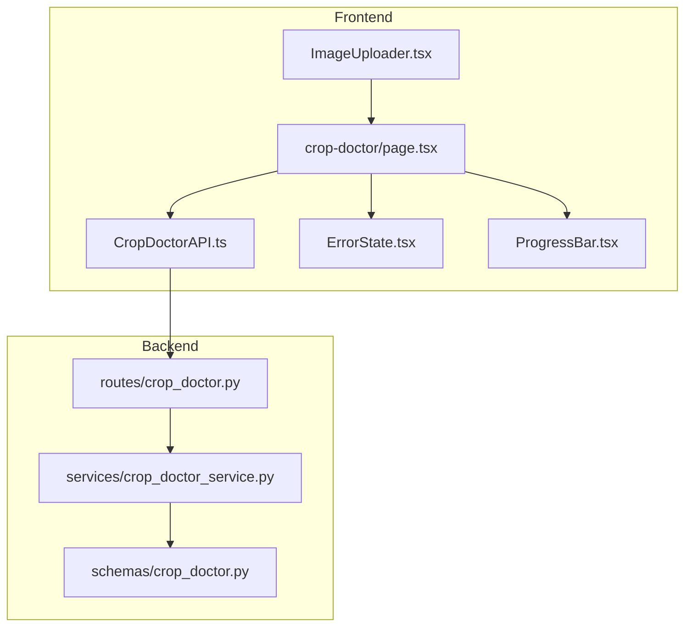
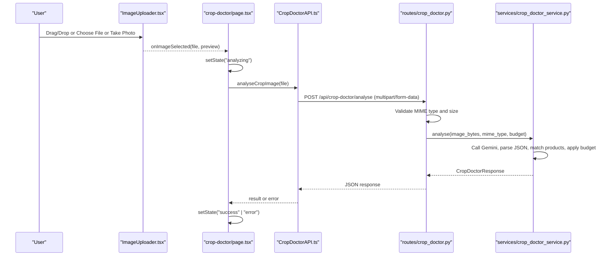
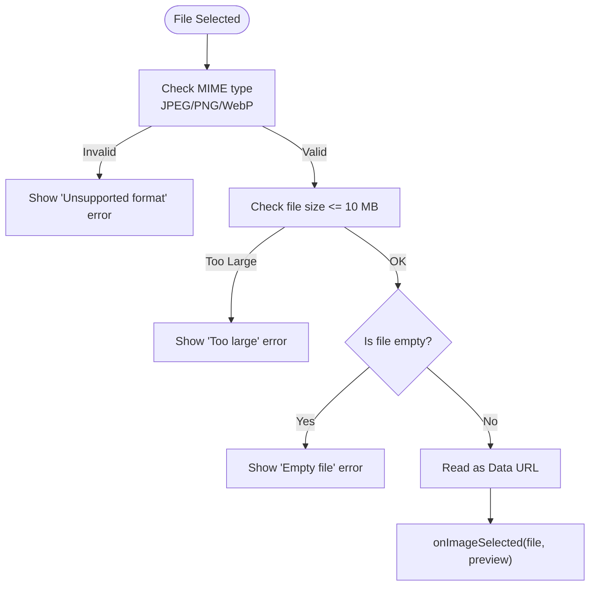
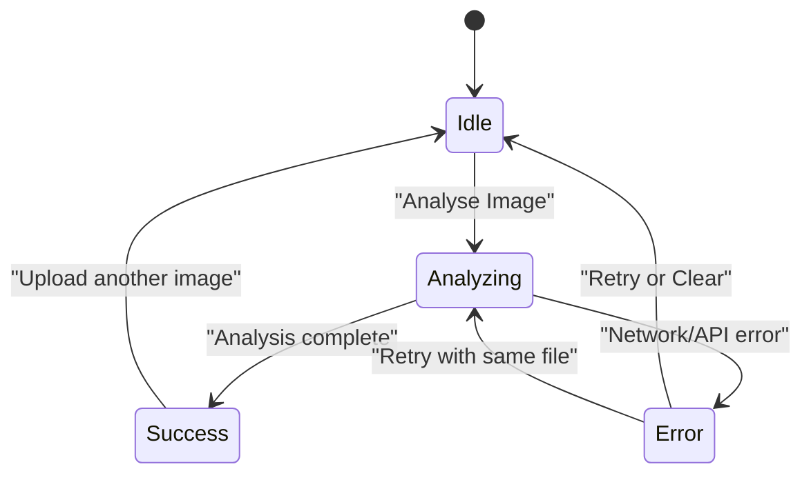
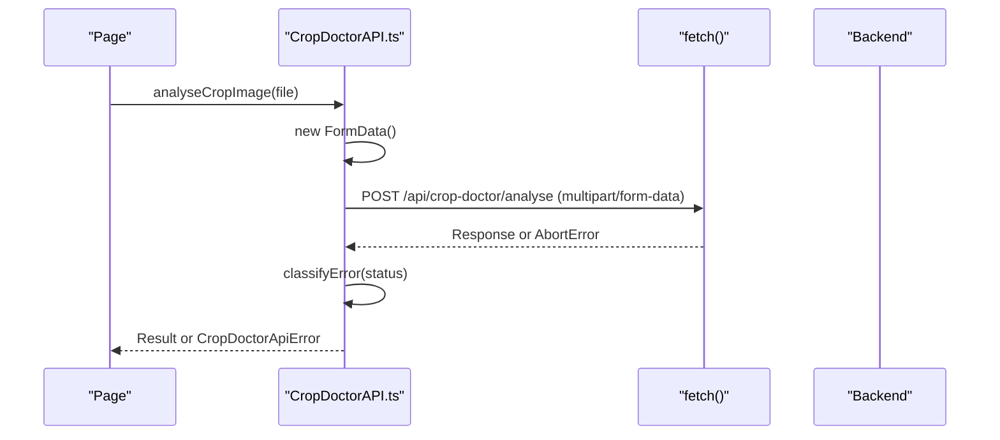
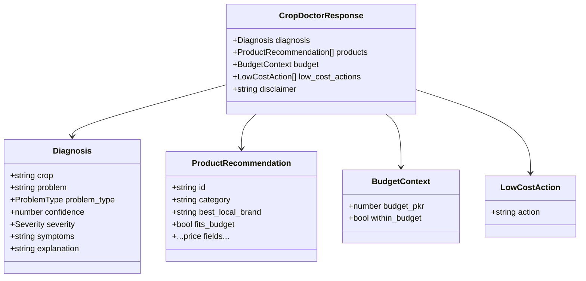

# Image Upload Component

<cite>
**Referenced Files in This Document**
- [ImageUploader.tsx](file://Frontend/greenflora/components/cropDoctor/ImageUploader.tsx)
- [CropDoctorAPI.ts](file://Frontend/greenflora/services/CropDoctorAPI.ts)
- [cropDoctor.ts](file://Frontend/greenflora/types/cropDoctor.ts)
- [page.tsx](file://Frontend/greenflora/app/crop-doctor/page.tsx)
- [crop_doctor.py](file://Backend/routes/crop_doctor.py)
- [crop_doctor_service.py](file://Backend/services/crop_doctor_service.py)
- [crop_doctor.py (schemas)](file://Backend/schemas/crop_doctor.py)
- [ProgressBar.tsx](file://Frontend/greenflora/components/ui/ProgressBar.tsx)
- [ErrorState.tsx](file://Frontend/greenflora/components/ui/ErrorState.tsx)
</cite>

## Table of Contents
1. [Introduction](#introduction)
2. [Project Structure](#project-structure)
3. [Core Components](#core-components)
4. [Architecture Overview](#architecture-overview)
5. [Detailed Component Analysis](#detailed-component-analysis)
6. [Dependency Analysis](#dependency-analysis)
7. [Performance Considerations](#performance-considerations)
8. [Troubleshooting Guide](#troubleshooting-guide)
9. [Conclusion](#conclusion)

## Introduction
This document explains the ImageUpload component used for plant disease detection within the Crop Doctor feature. It covers file validation, preview behavior, upload flow, error handling, mobile camera integration, API integration with the CropDoctorAPI service, and performance considerations for large images. It also provides practical usage patterns such as drag-and-drop, file selection dialogs, and error recovery flows.

## Project Structure
The image upload experience spans a React client component, a page-level controller, an API service layer, and backend routes and services that perform analysis using Gemini and return structured results.

**Diagram sources**
- [ImageUploader.tsx:1-195](file://Frontend/greenflora/components/cropDoctor/ImageUploader.tsx#L1-L195)
- [page.tsx:1-174](file://Frontend/greenflora/app/crop-doctor/page.tsx#L1-L174)
- [CropDoctorAPI.ts:1-107](file://Frontend/greenflora/services/CropDoctorAPI.ts#L1-L107)
- [crop_doctor.py:1-125](file://Backend/routes/crop_doctor.py#L1-L125)
- [crop_doctor_service.py:1-435](file://Backend/services/crop_doctor_service.py#L1-L435)
- [crop_doctor.py (schemas):1-123](file://Backend/schemas/crop_doctor.py#L1-L123)
- [ErrorState.tsx:1-39](file://Frontend/greenflora/components/ui/ErrorState.tsx#L1-L39)
- [ProgressBar.tsx:1-50](file://Frontend/greenflora/components/ui/ProgressBar.tsx#L1-L50)

**Section sources**
- [ImageUploader.tsx:1-195](file://Frontend/greenflora/components/cropDoctor/ImageUploader.tsx#L1-L195)
- [page.tsx:1-174](file://Frontend/greenflora/app/crop-doctor/page.tsx#L1-L174)
- [CropDoctorAPI.ts:1-107](file://Frontend/greenflora/services/CropDoctorAPI.ts#L1-L107)
- [crop_doctor.py:1-125](file://Backend/routes/crop_doctor.py#L1-L125)
- [crop_doctor_service.py:1-435](file://Backend/services/crop_doctor_service.py#L1-L435)
- [crop_doctor.py (schemas):1-123](file://Backend/schemas/crop_doctor.py#L1-L123)
- [ErrorState.tsx:1-39](file://Frontend/greenflora/components/ui/ErrorState.tsx#L1-L39)
- [ProgressBar.tsx:1-50](file://Frontend/greenflora/components/ui/ProgressBar.tsx#L1-L50)

## Core Components
- ImageUploader: Client-side component that validates files, supports drag-and-drop and camera capture, shows previews, and emits selected files to the parent.
- Page Controller: Orchestrates state transitions (idle, analyzing, success, error), triggers analysis, and renders diagnosis and recommendations.
- CropDoctorAPI: Sends multipart image uploads to the backend with timeout and network error handling; returns typed responses.
- Backend Route: Validates MIME type and size, reads budget context, and delegates analysis to the service.
- Service: Calls Gemini, parses structured JSON, matches products, applies budget filtering, and returns low-cost actions when needed.

Key responsibilities and boundaries are enforced on both frontend and backend to ensure consistent validation and robust error handling.

**Section sources**
- [ImageUploader.tsx:1-195](file://Frontend/greenflora/components/cropDoctor/ImageUploader.tsx#L1-L195)
- [page.tsx:1-174](file://Frontend/greenflora/app/crop-doctor/page.tsx#L1-L174)
- [CropDoctorAPI.ts:1-107](file://Frontend/greenflora/services/CropDoctorAPI.ts#L1-L107)
- [crop_doctor.py:1-125](file://Backend/routes/crop_doctor.py#L1-L125)
- [crop_doctor_service.py:1-435](file://Backend/services/crop_doctor_service.py#L1-L435)

## Architecture Overview
End-to-end flow from user interaction to diagnosis and recommendations:

**Diagram sources**
- [ImageUploader.tsx:28-65](file://Frontend/greenflora/components/cropDoctor/ImageUploader.tsx#L28-L65)
- [page.tsx:43-66](file://Frontend/greenflora/app/crop-doctor/page.tsx#L43-L66)
- [CropDoctorAPI.ts:47-106](file://Frontend/greenflora/services/CropDoctorAPI.ts#L47-L106)
- [crop_doctor.py:48-124](file://Backend/routes/crop_doctor.py#L48-L124)
- [crop_doctor_service.py:131-165](file://Backend/services/crop_doctor_service.py#L131-L165)

## Detailed Component Analysis

### ImageUploader Component
Responsibilities:
- File validation:
  - Supported formats: JPEG, PNG, WebP.
  - Size limit: up to 10 MB.
  - Rejects empty files.
- Preview generation:
  - Uses FileReader to create a data URL for immediate preview.
- Interaction modes:
  - Drag-and-drop zone with visual feedback.
  - File picker via hidden input.
  - Camera capture via hidden input with environment capture attribute for mobile devices.
- Error display:
  - Shows inline error messages for invalid files.

Notes:
- No server-side progress tracking is implemented in this component; it only handles local validation and preview.
- Cropping is not implemented in this component; it passes the original file to the parent for further processing if needed.

**Diagram sources**
- [ImageUploader.tsx:28-56](file://Frontend/greenflora/components/cropDoctor/ImageUploader.tsx#L28-L56)
- [ImageUploader.tsx:67-84](file://Frontend/greenflora/components/cropDoctor/ImageUploader.tsx#L67-L84)
- [ImageUploader.tsx:169-185](file://Frontend/greenflora/components/cropDoctor/ImageUploader.tsx#L169-L185)

**Section sources**
- [ImageUploader.tsx:14-16](file://Frontend/greenflora/components/cropDoctor/ImageUploader.tsx#L14-L16)
- [ImageUploader.tsx:28-56](file://Frontend/greenflora/components/cropDoctor/ImageUploader.tsx#L28-L56)
- [ImageUploader.tsx:67-84](file://Frontend/greenflora/components/cropDoctor/ImageUploader.tsx#L67-L84)
- [ImageUploader.tsx:86-108](file://Frontend/greenflora/components/cropDoctor/ImageUploader.tsx#L86-L108)
- [ImageUploader.tsx:110-192](file://Frontend/greenflora/components/cropDoctor/ImageUploader.tsx#L110-L192)

### Page Controller (Crop Doctor Page)
Responsibilities:
- Maintains analysis state machine: idle, analyzing, success, error.
- Wires ImageUploader callbacks to set selected file and preview.
- Triggers analysis and displays loading, error, and success states.
- Provides retry logic and clear/reset functionality.

**Diagram sources**
- [page.tsx:20-24](file://Frontend/greenflora/app/crop-doctor/page.tsx#L20-L24)
- [page.tsx:43-66](file://Frontend/greenflora/app/crop-doctor/page.tsx#L43-L66)

**Section sources**
- [page.tsx:26-66](file://Frontend/greenflora/app/crop-doctor/page.tsx#L26-L66)
- [page.tsx:68-174](file://Frontend/greenflora/app/crop-doctor/page.tsx#L68-L174)

### CropDoctorAPI Service
Responsibilities:
- Builds FormData with the image file.
- Attaches optional Authorization header from stored token.
- Enforces request timeout (60 seconds).
- Classifies errors into network, timeout, validation, server, unknown.
- Parses error bodies when available.

**Diagram sources**
- [CropDoctorAPI.ts:47-106](file://Frontend/greenflora/services/CropDoctorAPI.ts#L47-L106)

**Section sources**
- [CropDoctorAPI.ts:1-107](file://Frontend/greenflora/services/CropDoctorAPI.ts#L1-L107)

### Backend Route and Service
Route responsibilities:
- Accepts multipart/form-data image.
- Validates MIME type against allowed list.
- Enforces maximum file size (10 MB).
- Rejects empty uploads.
- Resolves farmer budget (optional) and calls service.

Service responsibilities:
- Encodes image and calls Gemini with a strict JSON prompt.
- Parses Gemini’s JSON output into a Diagnosis model.
- Matches agricultural products based on problem type and keywords.
- Applies budget constraints and marks fits_budget.
- Returns low-cost actions when no suitable product fits.

**Diagram sources**
- [crop_doctor.py (schemas):41-123](file://Backend/schemas/crop_doctor.py#L41-L123)

**Section sources**
- [crop_doctor.py:36-124](file://Backend/routes/crop_doctor.py#L36-L124)
- [crop_doctor_service.py:131-165](file://Backend/services/crop_doctor_service.py#L131-L165)
- [crop_doctor_service.py:171-258](file://Backend/services/crop_doctor_service.py#L171-L258)
- [crop_doctor_service.py:264-339](file://Backend/services/crop_doctor_service.py#L264-L339)
- [crop_doctor_service.py:409-416](file://Backend/services/crop_doctor_service.py#L409-L416)

## Dependency Analysis
- ImageUploader depends on UI primitives and emits events to the parent page.
- The page depends on ImageUploader, API service, and UI components for states.
- CropDoctorAPI depends on authentication helper and types.
- Backend route depends on auth dependency, service, and schemas.
- Service depends on Gemini SDK, Supabase client, and schemas.

**Diagram sources**
- [ImageUploader.tsx:1-195](file://Frontend/greenflora/components/cropDoctor/ImageUploader.tsx#L1-L195)
- [page.tsx:1-174](file://Frontend/greenflora/app/crop-doctor/page.tsx#L1-L174)
- [CropDoctorAPI.ts:1-107](file://Frontend/greenflora/services/CropDoctorAPI.ts#L1-L107)
- [crop_doctor.py:1-125](file://Backend/routes/crop_doctor.py#L1-L125)
- [crop_doctor_service.py:1-435](file://Backend/services/crop_doctor_service.py#L1-L435)
- [crop_doctor.py (schemas):1-123](file://Backend/schemas/crop_doctor.py#L1-L123)

**Section sources**
- [ImageUploader.tsx:1-195](file://Frontend/greenflora/components/cropDoctor/ImageUploader.tsx#L1-L195)
- [page.tsx:1-174](file://Frontend/greenflora/app/crop-doctor/page.tsx#L1-L174)
- [CropDoctorAPI.ts:1-107](file://Frontend/greenflora/services/CropDoctorAPI.ts#L1-L107)
- [crop_doctor.py:1-125](file://Backend/routes/crop_doctor.py#L1-L125)
- [crop_doctor_service.py:1-435](file://Backend/services/crop_doctor_service.py#L1-L435)
- [crop_doctor.py (schemas):1-123](file://Backend/schemas/crop_doctor.py#L1-L123)

## Performance Considerations
Current implementation characteristics:
- Frontend validation enforces a 10 MB size limit and supported formats before any upload.
- Preview uses FileReader to generate a data URL; this can be memory-intensive for very large images.
- No client-side compression or resizing is performed prior to upload.
- Backend enforces the same 10 MB limit and rejects unsupported types.
- Request timeout is set to 60 seconds to handle slow Gemini responses.

Recommendations for optimization:
- Client-side compression:
  - Decode the image into a canvas, resize to a target dimension (e.g., max width 1920px), and re-encode at reduced quality (e.g., JPEG 0.7–0.85) before upload to reduce payload size and improve upload speed.
- Memory management:
  - Revoke object URLs after use to free memory.
  - Avoid storing large base64 strings in state beyond necessary; prefer temporary references during upload.
- Progressive feedback:
  - Implement upload progress by leveraging XMLHttpRequest or fetch with readable streams to update a ProgressBar component.
- Caching and retries:
  - For failed uploads due to transient network issues, implement exponential backoff retries with user-visible status.
- Backend scaling:
  - Ensure Gemini calls are rate-limited and cached where appropriate to avoid redundant analysis for identical images.

[No sources needed since this section provides general guidance]

## Troubleshooting Guide
Common issues and resolutions:
- Unsupported file type:
  - Symptom: Inline error indicating unsupported format.
  - Cause: File MIME type not in allowed list.
  - Resolution: Convert to JPEG, PNG, or WebP.
- File too large:
  - Symptom: Inline error stating maximum size exceeded.
  - Cause: File size > 10 MB.
  - Resolution: Compress or resize image before upload.
- Empty file:
  - Symptom: Inline error about empty image.
  - Cause: Zero-byte file selected.
  - Resolution: Select a valid image file.
- Network failure:
  - Symptom: Error message indicating cannot reach service.
  - Cause: Network connectivity issue or CORS/blocking.
  - Resolution: Check internet connection and retry.
- Timeout:
  - Symptom: Error message indicating analysis timed out.
  - Cause: Gemini response exceeded 60 seconds.
  - Resolution: Retry with a smaller or less complex image.
- Server error:
  - Symptom: Generic server error message.
  - Cause: Backend internal error or misconfiguration.
  - Resolution: Retry later; if persistent, contact support.

UI helpers:
- ErrorState provides a consistent error display with optional retry button.
- ProgressBar can be integrated to show upload progress once stream-based uploads are implemented.

**Section sources**
- [ImageUploader.tsx:28-56](file://Frontend/greenflora/components/cropDoctor/ImageUploader.tsx#L28-L56)
- [CropDoctorAPI.ts:33-39](file://Frontend/greenflora/services/CropDoctorAPI.ts#L33-L39)
- [CropDoctorAPI.ts:87-106](file://Frontend/greenflora/services/CropDoctorAPI.ts#L87-L106)
- [ErrorState.tsx:1-39](file://Frontend/greenflora/components/ui/ErrorState.tsx#L1-L39)
- [ProgressBar.tsx:1-50](file://Frontend/greenflora/components/ui/ProgressBar.tsx#L1-L50)

## Conclusion
The ImageUpload component provides a robust, user-friendly interface for selecting and validating images for plant disease detection. It integrates seamlessly with the CropDoctorAPI service and backend pipeline to deliver AI-powered diagnoses and actionable recommendations. While current implementation focuses on validation and preview without client-side compression, the architecture supports future enhancements such as progressive uploads, compression, and richer progress feedback. Following the recommended optimizations will improve performance and reliability, especially for large images and constrained networks.