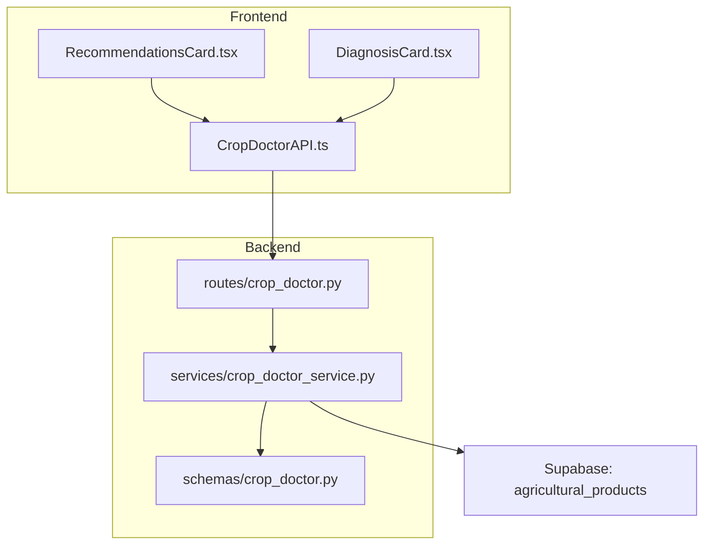
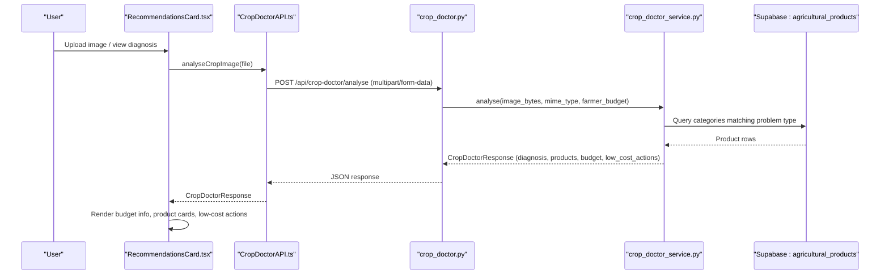
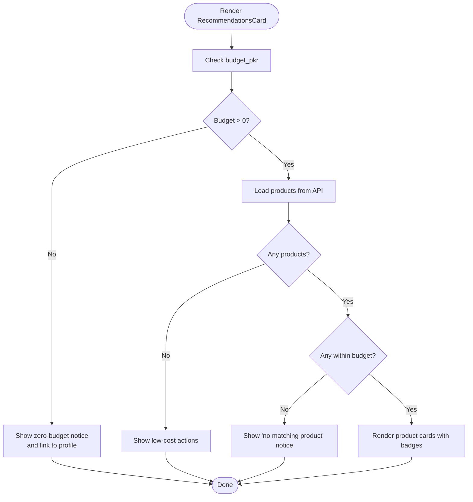
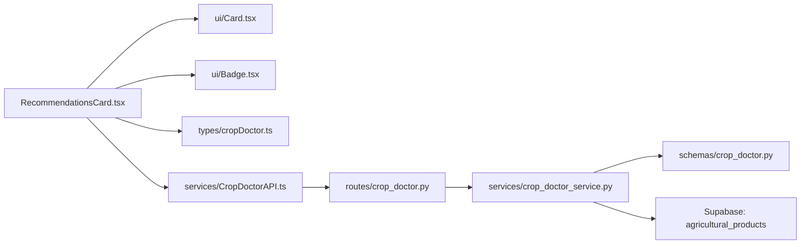

# Recommendations Card Component

<cite>
**Referenced Files in This Document**
- [RecommendationsCard.tsx](file://Frontend/greenflora/components/cropDoctor/RecommendationsCard.tsx)
- [cropDoctor.ts](file://Frontend/greenflora/types/cropDoctor.ts)
- [CropDoctorAPI.ts](file://Frontend/greenflora/services/CropDoctorAPI.ts)
- [crop_doctor.py](file://Backend/routes/crop_doctor.py)
- [crop_doctor_service.py](file://Backend/services/crop_doctor_service.py)
- [crop_doctor.py (schemas)](file://Backend/schemas/crop_doctor.py)
- [DiagnosisCard.tsx](file://Frontend/greenflora/components/cropDoctor/DiagnosisCard.tsx)
- [Card.tsx](file://Frontend/greenflora/components/ui/Card.tsx)
- [Badge.tsx](file://Frontend/greenflora/components/ui/Badge.tsx)
- [architechture.md](file://architechture.md)
</cite>

## Table of Contents
1. [Introduction](#introduction)
2. [Project Structure](#project-structure)
3. [Core Components](#core-components)
4. [Architecture Overview](#architecture-overview)
5. [Detailed Component Analysis](#detailed-component-analysis)
6. [Dependency Analysis](#dependency-analysis)
7. [Performance Considerations](#performance-considerations)
8. [Troubleshooting Guide](#troubleshooting-guide)
9. [Conclusion](#conclusion)
10. [Appendices](#appendices)

## Introduction
This document provides comprehensive documentation for the RecommendationsCard component, which presents treatment suggestions and preventive measures for detected plant diseases. It explains how recommendations are structured, categorized by urgency, cost effectiveness, and environmental impact, and how they integrate with external agricultural databases to provide up-to-date product information. The component also supports responsive layouts and accessible formatting for technical agricultural terms.

## Project Structure
The RecommendationsCard is part of the Crop Doctor feature, which analyzes uploaded crop images to diagnose problems and recommend treatments. The frontend displays diagnosis results and budget-aware product recommendations alongside low-cost actions when paid options do not fit the user’s budget.

**Diagram sources**
- [RecommendationsCard.tsx:91-203](file://Frontend/greenflora/components/cropDoctor/RecommendationsCard.tsx#L91-L203)
- [CropDoctorAPI.ts:47-106](file://Frontend/greenflora/services/CropDoctorAPI.ts#L47-L106)
- [crop_doctor.py:48-124](file://Backend/routes/crop_doctor.py#L48-L124)
- [crop_doctor_service.py:131-165](file://Backend/services/crop_doctor_service.py#L131-L165)
- [crop_doctor_service.py:264-339](file://Backend/services/crop_doctor_service.py#L264-L339)
- [crop_doctor.py (schemas):112-123](file://Backend/schemas/crop_doctor.py#L112-L123)

**Section sources**
- [RecommendationsCard.tsx:91-203](file://Frontend/greenflora/components/cropDoctor/RecommendationsCard.tsx#L91-L203)
- [CropDoctorAPI.ts:47-106](file://Frontend/greenflora/services/CropDoctorAPI.ts#L47-L106)
- [crop_doctor.py:48-124](file://Backend/routes/crop_doctor.py#L48-L124)
- [crop_doctor_service.py:131-165](file://Backend/services/crop_doctor_service.py#L131-L165)
- [crop_doctor_service.py:264-339](file://Backend/services/crop_doctor_service.py#L264-L339)
- [crop_doctor.py (schemas):112-123](file://Backend/schemas/crop_doctor.py#L112-L123)

## Core Components
- RecommendationsCard: Displays budget context, product recommendations from the database, and low-cost actions. It adapts messaging based on whether products fit the user’s budget.
- DiagnosisCard: Presents AI-generated diagnosis details including confidence, severity, symptoms, and explanation.
- CropDoctorAPI: Handles image upload, authentication, timeouts, and error classification when calling the backend.
- Backend route and service: Validate uploads, call Gemini for diagnosis, match products from Supabase, apply budget filtering, and return structured responses.

Key responsibilities:
- Budget-aware presentation: Shows “Within budget” or “Above budget” badges per product and contextual messages when no products fit.
- Low-cost fallback: Provides safe, problem-specific actions when there are no products or none fit the budget.
- Responsive layout: Uses grid classes to adapt product cards across screen sizes.

**Section sources**
- [RecommendationsCard.tsx:22-26](file://Frontend/greenflora/components/cropDoctor/RecommendationsCard.tsx#L22-L26)
- [RecommendationsCard.tsx:28-89](file://Frontend/greenflora/components/cropDoctor/RecommendationsCard.tsx#L28-L89)
- [RecommendationsCard.tsx:91-203](file://Frontend/greenflora/components/cropDoctor/RecommendationsCard.tsx#L91-L203)
- [DiagnosisCard.tsx:21-39](file://Frontend/greenflora/components/cropDoctor/DiagnosisCard.tsx#L21-L39)
- [CropDoctorAPI.ts:17-39](file://Frontend/greenflora/services/CropDoctorAPI.ts#L17-L39)
- [crop_doctor_service.py:85-115](file://Backend/services/crop_doctor_service.py#L85-L115)

## Architecture Overview
The RecommendationsCard integrates with the Crop Doctor pipeline to present actionable treatment guidance grounded in real product data and farmer budgets.

**Diagram sources**
- [CropDoctorAPI.ts:47-106](file://Frontend/greenflora/services/CropDoctorAPI.ts#L47-L106)
- [crop_doctor.py:48-124](file://Backend/routes/crop_doctor.py#L48-L124)
- [crop_doctor_service.py:131-165](file://Backend/services/crop_doctor_service.py#L131-L165)
- [crop_doctor_service.py:264-339](file://Backend/services/crop_doctor_service.py#L264-L339)

## Detailed Component Analysis

### RecommendationsCard Component
Responsibilities:
- Show budget context and prompt users to set a budget if missing.
- Display product recommendations with brand, target, dosage, price range, and category.
- Indicate whether each product fits the user’s budget using a badge.
- Present low-cost actions when no paid option fits or when budget is zero.
- Provide responsive grid layout for product cards.

Data model usage:
- Consumes ProductRecommendation[], BudgetContext, and LowCostAction[] types.
- Renders price display logic that handles approximate vs min/max ranges.

Budget categorization:
- Within budget: success badge indicates affordability.
- Above budget: warning badge signals higher cost; contextual message suggests adjusting budget or trying low-cost actions.

Low-cost actions:
- Sourced from backend based on problem type; includes cultural practices like removing affected leaves, improving air circulation, hand-picking pests, mulching, and crop rotation.

Responsive behavior:
- Uses responsive grid classes to show one column on small screens and multiple columns on larger screens.

Accessibility and readability:
- Clear labels and icons for quick scanning.
- Structured sections with headings and concise descriptions.

Interactive features:
- Links to profile for setting or updating budget.
- Expandable sections and bookmarking/sharing are not implemented in this component; they can be added via additional UI state and handlers.

**Diagram sources**
- [RecommendationsCard.tsx:96-166](file://Frontend/greenflora/components/cropDoctor/RecommendationsCard.tsx#L96-L166)
- [RecommendationsCard.tsx:168-200](file://Frontend/greenflora/components/cropDoctor/RecommendationsCard.tsx#L168-L200)

**Section sources**
- [RecommendationsCard.tsx:22-26](file://Frontend/greenflora/components/cropDoctor/RecommendationsCard.tsx#L22-L26)
- [RecommendationsCard.tsx:28-89](file://Frontend/greenflora/components/cropDoctor/RecommendationsCard.tsx#L28-L89)
- [RecommendationsCard.tsx:91-203](file://Frontend/greenflora/components/cropDoctor/RecommendationsCard.tsx#L91-L203)
- [cropDoctor.ts:29-54](file://Frontend/greenflora/types/cropDoctor.ts#L29-L54)

### Data Models and Types
- Diagnosis: Captures crop, problem, problem_type, confidence, severity, symptoms, explanation.
- ProductRecommendation: Includes category, targets, brand, company, active ingredient, dosage, price fields, and fits_budget flag.
- BudgetContext: Holds budget_pkr and within_budget boolean.
- LowCostAction: Contains a single action string.

These types ensure consistent data flow between frontend and backend and enable precise rendering and logic in RecommendationsCard.

**Section sources**
- [cropDoctor.ts:8-27](file://Frontend/greenflora/types/cropDoctor.ts#L8-L27)
- [cropDoctor.ts:29-54](file://Frontend/greenflora/types/cropDoctor.ts#L29-L54)
- [crop_doctor.py (schemas):41-61](file://Backend/schemas/crop_doctor.py#L41-L61)
- [crop_doctor.py (schemas):68-83](file://Backend/schemas/crop_doctor.py#L68-L83)
- [crop_doctor.py (schemas):89-95](file://Backend/schemas/crop_doctor.py#L89-L95)
- [crop_doctor.py (schemas):102-105](file://Backend/schemas/crop_doctor.py#L102-L105)

### Backend Processing and External Database Integration
- Route validation: Ensures supported MIME types, size limits, and non-empty uploads.
- Service orchestration: Calls Gemini for diagnosis, queries Supabase for products, applies budget filtering, and returns structured response.
- Product matching: Filters by category mapped from problem type, scores relevance via keyword overlap, marks budget fit, and returns top matches.
- Low-cost actions: Provides safe, generic steps tailored to problem type when paid options are unavailable or unaffordable.

Database integration:
- Uses Supabase table agricultural_products containing category, target/problem, brand/company, active ingredient, dosage, and price information.

**Section sources**
- [crop_doctor.py:48-124](file://Backend/routes/crop_doctor.py#L48-L124)
- [crop_doctor_service.py:131-165](file://Backend/services/crop_doctor_service.py#L131-L165)
- [crop_doctor_service.py:264-339](file://Backend/services/crop_doctor_service.py#L264-L339)
- [crop_doctor_service.py:341-355](file://Backend/services/crop_doctor_service.py#L341-L355)
- [architechture.md:322-330](file://architechture.md#L322-L330)

### Frontend API Integration and Error Handling
- Multipart form submission with optional bearer token.
- Timeout handling with AbortController to manage long-running Gemini analysis.
- Error classification into network, timeout, validation, server, and unknown types for better UX.

**Section sources**
- [CropDoctorAPI.ts:47-106](file://Frontend/greenflora/services/CropDoctorAPI.ts#L47-L106)

## Dependency Analysis
The RecommendationsCard depends on:
- UI primitives: Card and Badge components for consistent styling and variants.
- Types: cropDoctor.ts shapes for strong typing and consistency.
- Services: CropDoctorAPI.ts for fetching diagnosis and recommendations.
- Backend: routes and services that coordinate Gemini analysis and Supabase queries.

**Diagram sources**
- [RecommendationsCard.tsx:13-20](file://Frontend/greenflora/components/cropDoctor/RecommendationsCard.tsx#L13-L20)
- [Card.tsx:1-39](file://Frontend/greenflora/components/ui/Card.tsx#L1-L39)
- [Badge.tsx:1-31](file://Frontend/greenflora/components/ui/Badge.tsx#L1-L31)
- [cropDoctor.ts:29-54](file://Frontend/greenflora/types/cropDoctor.ts#L29-L54)
- [CropDoctorAPI.ts:47-106](file://Frontend/greenflora/services/CropDoctorAPI.ts#L47-L106)
- [crop_doctor.py:48-124](file://Backend/routes/crop_doctor.py#L48-L124)
- [crop_doctor_service.py:264-339](file://Backend/services/crop_doctor_service.py#L264-L339)
- [crop_doctor.py (schemas):112-123](file://Backend/schemas/crop_doctor.py#L112-L123)

**Section sources**
- [RecommendationsCard.tsx:13-20](file://Frontend/greenflora/components/cropDoctor/RecommendationsCard.tsx#L13-L20)
- [Card.tsx:1-39](file://Frontend/greenflora/components/ui/Card.tsx#L1-L39)
- [Badge.tsx:1-31](file://Frontend/greenflora/components/ui/Badge.tsx#L1-L31)
- [cropDoctor.ts:29-54](file://Frontend/greenflora/types/cropDoctor.ts#L29-L54)
- [CropDoctorAPI.ts:47-106](file://Frontend/greenflora/services/CropDoctorAPI.ts#L47-L106)
- [crop_doctor.py:48-124](file://Backend/routes/crop_doctor.py#L48-L124)
- [crop_doctor_service.py:264-339](file://Backend/services/crop_doctor_service.py#L264-L339)
- [crop_doctor.py (schemas):112-123](file://Backend/schemas/crop_doctor.py#L112-L123)

## Performance Considerations
- Image size limit: Enforced at the backend to prevent large uploads and reduce processing time.
- Timeout management: Frontend uses a 60-second timeout to avoid hanging requests during Gemini analysis.
- Product query optimization: Backend filters by category and scores relevance before returning top results, minimizing payload size.
- Rendering efficiency: RecommendationsCard renders only necessary sections based on budget and product availability.

[No sources needed since this section provides general guidance]

## Troubleshooting Guide
Common issues and resolutions:
- Unsupported image type: Ensure JPEG, PNG, or WebP formats are used.
- Image too large: Reduce file size below the maximum allowed.
- Empty image: Re-select a valid photo.
- Network errors: Check internet connectivity and retry.
- Timeout errors: Use smaller images or try again later.
- No matching product: Adjust budget or use low-cost actions provided.

Backend error mapping:
- Validation errors: 4xx status codes with descriptive details.
- Server errors: 5xx status codes with generic messages.
- Network errors: Status 0 with helpful hints.

**Section sources**
- [crop_doctor.py:63-87](file://Backend/routes/crop_doctor.py#L63-L87)
- [crop_doctor.py:113-124](file://Backend/routes/crop_doctor.py#L113-L124)
- [CropDoctorAPI.ts:17-39](file://Frontend/greenflora/services/CropDoctorAPI.ts#L17-L39)
- [CropDoctorAPI.ts:71-106](file://Frontend/greenflora/services/CropDoctorAPI.ts#L71-L106)

## Conclusion
The RecommendationsCard delivers clear, budget-aware treatment suggestions and preventive measures for detected plant diseases. It integrates with external agricultural databases to provide accurate product recommendations and offers low-cost alternatives when needed. The component maintains responsiveness and readability while supporting robust error handling and performance considerations. Future enhancements could include expandable sections, bookmarking, sharing capabilities, and tooltips for technical terms.

[No sources needed since this section summarizes without analyzing specific files]

## Appendices

### Example Recommendation Scenarios
- Chemical treatments: Products such as fungicides or insecticides matched to disease or pest problems, with dosage and pricing displayed.
- Biological controls: Categories like tonics or fertilizers for nutrient deficiencies or environmental stress, emphasizing cultural practices.
- Cultural practices: Low-cost actions including removing affected leaves, improving air circulation, hand-picking pests, mulching, and crop rotation.

These scenarios are driven by the backend’s problem-type mapping and low-cost action sets, ensuring appropriate guidance for each diagnosis.

**Section sources**
- [crop_doctor_service.py:71-78](file://Backend/services/crop_doctor_service.py#L71-L78)
- [crop_doctor_service.py:85-115](file://Backend/services/crop_doctor_service.py#L85-L115)
- [RecommendationsCard.tsx:182-200](file://Frontend/greenflora/components/cropDoctor/RecommendationsCard.tsx#L182-L200)