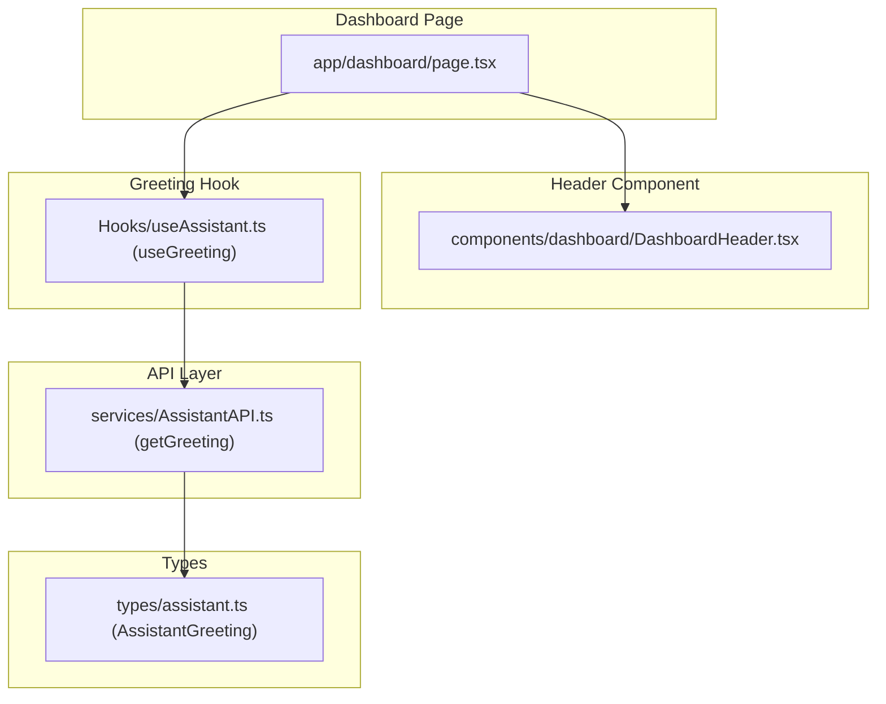
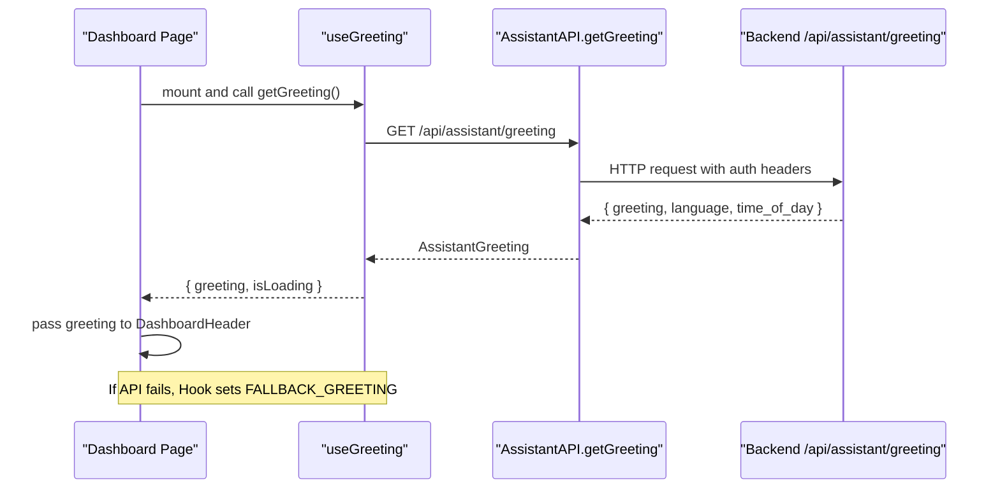
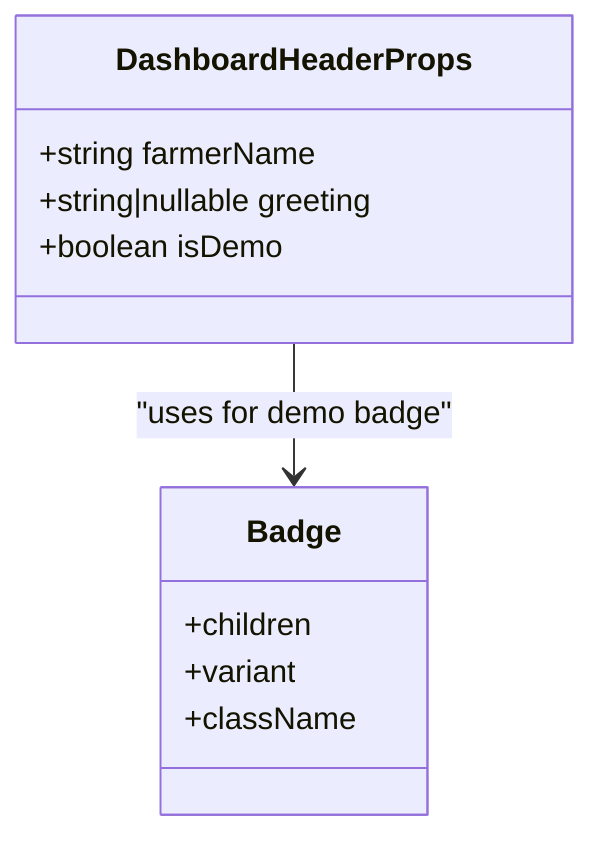
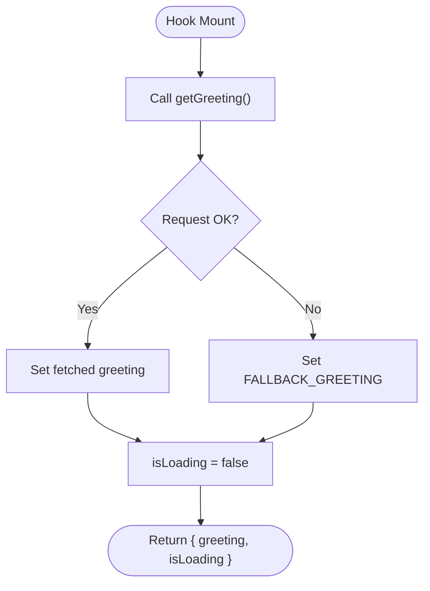
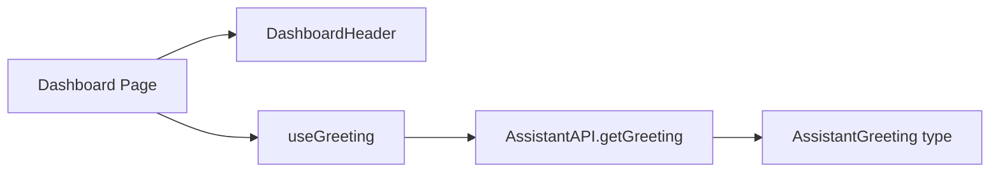

# Dashboard Header & AI Greeting

<cite>
**Referenced Files in This Document**
- [DashboardHeader.tsx](file://Frontend/greenflora/components/dashboard/DashboardHeader.tsx)
- [page.tsx](file://Frontend/greenflora/app/dashboard/page.tsx)
- [useAssistant.ts](file://Frontend/greenflora/Hooks/useAssistant.ts)
- [AssistantAPI.ts](file://Frontend/greenflora/services/AssistantAPI.ts)
- [assistant.ts](file://Frontend/greenflora/types/assistant.ts)
- [Badge.tsx](file://Frontend/greenflora/components/ui/Badge.tsx)
</cite>

## Table of Contents
1. [Introduction](#introduction)
2. [Project Structure](#project-structure)
3. [Core Components](#core-components)
4. [Architecture Overview](#architecture-overview)
5. [Detailed Component Analysis](#detailed-component-analysis)
6. [Dependency Analysis](#dependency-analysis)
7. [Performance Considerations](#performance-considerations)
8. [Troubleshooting Guide](#troubleshooting-guide)
9. [Conclusion](#conclusion)

## Introduction
This document explains the dashboard header component and its AI-powered greeting system for farmers. It covers how the DashboardHeader displays the farmer’s name, renders a dynamic greeting generated by the useGreeting hook, and handles demo mode. It also details the AI greeting flow that provides localized, time-aware greetings, including loading states, fallback behavior when the AI service is unavailable, and integration with the overall dashboard experience. Accessibility considerations and responsive design patterns used in the header are included.

## Project Structure
The dashboard header lives under the dashboard components and is consumed by the dashboard page. The greeting logic is implemented in a custom hook that calls an assistant API to fetch a localized, time-of-day greeting. Types define the shape of the greeting response.

**Diagram sources**
- [page.tsx:127-131](file://Frontend/greenflora/app/dashboard/page.tsx#L127-L131)
- [DashboardHeader.tsx:19-23](file://Frontend/greenflora/components/dashboard/DashboardHeader.tsx#L19-L23)
- [useAssistant.ts:660-699](file://Frontend/greenflora/Hooks/useAssistant.ts#L660-L699)
- [AssistantAPI.ts:137-140](file://Frontend/greenflora/services/AssistantAPI.ts#L137-L140)
- [assistant.ts:43-48](file://Frontend/greenflora/types/assistant.ts#L43-L48)

**Section sources**
- [page.tsx:1-150](file://Frontend/greenflora/app/dashboard/page.tsx#L1-L150)
- [DashboardHeader.tsx:1-238](file://Frontend/greenflora/components/dashboard/DashboardHeader.tsx#L1-L238)
- [useAssistant.ts:660-699](file://Frontend/greenflora/Hooks/useAssistant.ts#L660-L699)
- [AssistantAPI.ts:104-140](file://Frontend/greenflora/services/AssistantAPI.ts#L104-L140)
- [assistant.ts:43-48](file://Frontend/greenflora/types/assistant.ts#L43-L48)

## Core Components
- DashboardHeader: A client-side React component that renders the hero banner with rotating farm scenes, date, contextual message, and optional demo badge. It accepts props for farmerName, greeting, and isDemo.
- useGreeting: A hook that loads a localized, time-of-day greeting from the backend and returns both the greeting object and a loading flag. It falls back to a static greeting if the service is unavailable.
- AssistantAPI.getGreeting: Makes a GET request to the assistant endpoint and returns a typed greeting.
- Types: AssistantGreeting defines the greeting payload structure.

Key responsibilities:
- Display farmer name contextually within the dashboard header area.
- Show a dynamic greeting string provided by the hook while handling loading states gracefully.
- Render a demo badge when isDemo is true.
- Maintain accessibility attributes and responsive layout across devices.

**Section sources**
- [DashboardHeader.tsx:19-23](file://Frontend/greenflora/components/dashboard/DashboardHeader.tsx#L19-L23)
- [DashboardHeader.tsx:95-238](file://Frontend/greenflora/components/dashboard/DashboardHeader.tsx#L95-L238)
- [useAssistant.ts:660-699](file://Frontend/greenflora/Hooks/useAssistant.ts#L660-L699)
- [AssistantAPI.ts:137-140](file://Frontend/greenflora/services/AssistantAPI.ts#L137-L140)
- [assistant.ts:43-48](file://Frontend/greenflora/types/assistant.ts#L43-L48)

## Architecture Overview
The greeting flows from the dashboard page into the header via props, while the hook independently fetches the greeting data. The API layer handles authentication headers and error classification. The types ensure consistent payloads.

**Diagram sources**
- [page.tsx:61-66](file://Frontend/greenflora/app/dashboard/page.tsx#L61-L66)
- [page.tsx:127-131](file://Frontend/greenflora/app/dashboard/page.tsx#L127-L131)
- [useAssistant.ts:673-699](file://Frontend/greenflora/Hooks/useAssistant.ts#L673-L699)
- [AssistantAPI.ts:137-140](file://Frontend/greenflora/services/AssistantAPI.ts#L137-L140)

## Detailed Component Analysis

### DashboardHeader Component
Responsibilities:
- Accepts props: farmerName (string), greeting (optional string or null), isDemo (boolean).
- Renders a rotating hero scene with images, messages, and accents based on app language mode.
- Shows a demo badge when isDemo is true.
- Displays localized date and contextual bottom message.
- Uses aria attributes for accessibility and responsive classes for mobile-first layout.

Props interface:
- farmerName: string — used to personalize the header context (e.g., displayed elsewhere in the dashboard; the header receives it as part of its contract).
- greeting?: string | null — optional greeting text passed from the dashboard page; can be null during loading.
- isDemo?: boolean — shows a “Demo data” badge when true.

Implementation highlights:
- Scene rotation: interval-based transitions with fade and transform effects.
- Language-aware rendering: detects Urdu mode and adjusts direction and alignment.
- Demo mode: conditional rendering of a warning badge using the shared Badge component.
- Accessibility: uses aria-hidden for decorative elements and aria-label for meaningful regions.

Integration with greeting:
- The dashboard page passes greetingLoading state to control whether a greeting string is available. When loading, null is passed so the header can handle absence gracefully.

**Section sources**
- [DashboardHeader.tsx:19-23](file://Frontend/greenflora/components/dashboard/DashboardHeader.tsx#L19-L23)
- [DashboardHeader.tsx:175-179](file://Frontend/greenflora/components/dashboard/DashboardHeader.tsx#L175-L179)
- [DashboardHeader.tsx:140-238](file://Frontend/greenflora/components/dashboard/DashboardHeader.tsx#L140-L238)
- [page.tsx:127-131](file://Frontend/greenflora/app/dashboard/page.tsx#L127-L131)

#### Class Diagram: Props and Dependencies

**Diagram sources**
- [DashboardHeader.tsx:19-23](file://Frontend/greenflora/components/dashboard/DashboardHeader.tsx#L19-L23)
- [Badge.tsx:1-31](file://Frontend/greenflora/components/ui/Badge.tsx#L1-L31)

### useGreeting Hook
Responsibilities:
- Fetches a localized, time-of-day greeting from the backend.
- Manages loading state and ensures the UI always has a greeting via a fallback.
- Returns a stable greeting object even during errors.

Behavior:
- On mount, calls getGreeting().
- On success, sets the greeting.
- On failure, sets a predefined fallback greeting.
- Always sets isLoading to false after completion.

Fallback mechanism:
- A constant fallback greeting is defined locally in the hook to guarantee the dashboard never breaks due to AI service unavailability.

Error handling:
- Catches network or server errors and substitutes the fallback greeting.
- Ensures cleanup via cancellation flag to avoid state updates after unmount.

**Section sources**
- [useAssistant.ts:72-76](file://Frontend/greenflora/Hooks/useAssistant.ts#L72-L76)
- [useAssistant.ts:673-699](file://Frontend/greenflora/Hooks/useAssistant.ts#L673-L699)

#### Flowchart: Greeting Load and Fallback

**Diagram sources**
- [useAssistant.ts:673-699](file://Frontend/greenflora/Hooks/useAssistant.ts#L673-L699)
- [useAssistant.ts:72-76](file://Frontend/greenflora/Hooks/useAssistant.ts#L72-L76)

### AssistantAPI.getGreeting
Responsibilities:
- Performs a GET request to the assistant greeting endpoint.
- Adds Authorization header when a token is present.
- Applies a timeout and converts transport-level failures to friendly errors.

Error classification:
- Distinguishes between network, timeout, validation, server, and auth errors.
- Provides user-friendly messages for failures.

Endpoint:
- GET /api/assistant/greeting returns AssistantGreeting.

**Section sources**
- [AssistantAPI.ts:95-102](file://Frontend/greenflora/services/AssistantAPI.ts#L95-L102)
- [AssistantAPI.ts:108-135](file://Frontend/greenflora/services/AssistantAPI.ts#L108-L135)
- [AssistantAPI.ts:137-140](file://Frontend/greenflora/services/AssistantAPI.ts#L137-L140)

### Types: AssistantGreeting
Defines the shape of the greeting response:
- greeting: string
- language: "en" | "ur"
- time_of_day: "morning" | "afternoon" | "evening"

These fields enable localization and time-aware messaging in the UI.

**Section sources**
- [assistant.ts:43-48](file://Frontend/greenflora/types/assistant.ts#L43-L48)

## Dependency Analysis
The dashboard page orchestrates data fetching and composes the header with greeting data. The hook encapsulates greeting logic and delegates to the API layer. The API layer centralizes error handling and authentication.

**Diagram sources**
- [page.tsx:61-66](file://Frontend/greenflora/app/dashboard/page.tsx#L61-L66)
- [page.tsx:127-131](file://Frontend/greenflora/app/dashboard/page.tsx#L127-L131)
- [useAssistant.ts:673-699](file://Frontend/greenflora/Hooks/useAssistant.ts#L673-L699)
- [AssistantAPI.ts:137-140](file://Frontend/greenflora/services/AssistantAPI.ts#L137-L140)
- [assistant.ts:43-48](file://Frontend/greenflora/types/assistant.ts#L43-L48)

**Section sources**
- [page.tsx:52-150](file://Frontend/greenflora/app/dashboard/page.tsx#L52-L150)
- [useAssistant.ts:660-699](file://Frontend/greenflora/Hooks/useAssistant.ts#L660-L699)
- [AssistantAPI.ts:104-140](file://Frontend/greenflora/services/AssistantAPI.ts#L104-L140)

## Performance Considerations
- Greeting fetch runs once on hook mount; no repeated polling reduces unnecessary network requests.
- Fallback greeting prevents blocking UI and avoids layout shifts caused by missing content.
- Hero scene rotation uses CSS transitions and opacity changes to minimize reflows.
- Interval-based animation is cleaned up on unmount to prevent memory leaks.

[No sources needed since this section provides general guidance]

## Troubleshooting Guide
Common issues and resolutions:
- AI greeting unavailable:
  - Symptom: No dynamic greeting shown initially.
  - Resolution: The hook automatically sets a fallback greeting; verify network connectivity and backend availability.
- Authentication errors:
  - Symptom: Network or auth error during greeting fetch.
  - Resolution: Ensure stored access token exists; check API base URL configuration.
- Demo mode not visible:
  - Symptom: Missing “Demo data” badge.
  - Resolution: Verify isDemo prop is true and Badge component renders correctly.

Operational checks:
- Confirm the dashboard page passes greetingLoading state appropriately to avoid undefined greeting strings.
- Validate that the API endpoint responds with the expected AssistantGreeting shape.

**Section sources**
- [useAssistant.ts:673-699](file://Frontend/greenflora/Hooks/useAssistant.ts#L673-L699)
- [AssistantAPI.ts:95-102](file://Frontend/greenflora/services/AssistantAPI.ts#L95-L102)
- [page.tsx:127-131](file://Frontend/greenflora/app/dashboard/page.tsx#L127-L131)

## Conclusion
The dashboard header integrates a robust AI-powered greeting system that enhances the farmer’s experience with localized, time-aware messages. The useGreeting hook ensures reliability through fallbacks and clear loading states, while the DashboardHeader component focuses on presentation, accessibility, and responsiveness. Together, they provide a resilient and user-friendly entry point to the dashboard.

[No sources needed since this section summarizes without analyzing specific files]