# Dashboard Layout & Structure

<cite>
**Referenced Files in This Document**
- [page.tsx](file://Frontend/greenflora/app/dashboard/page.tsx)
- [AuthGuard.tsx](file://Frontend/greenflora/components/auth/AuthGuard.tsx)
- [AppShell.tsx](file://Frontend/greenflora/components/layout/AppShell.tsx)
- [ErrorState.tsx](file://Frontend/greenflora/components/ui/ErrorState.tsx)
- [LoadingState.tsx](file://Frontend/greenflora/components/ui/LoadingState.tsx)
- [EmptyState.tsx](file://Frontend/greenflora/components/ui/EmptyState.tsx)
- [StatCard.tsx](file://Frontend/greenflora/components/dashboard/StatCard.tsx)
- [LanguageSwitcher.tsx](file://Frontend/greenflora/components/LanguageSwitcher.tsx)
- [layout.tsx](file://Frontend/greenflora/app/layout.tsx)
- [useFarmer.ts](file://Frontend/greenflora/Hooks/useFarmer.ts)
- [globals.css](file://Frontend/greenflora/app/globals.css)
</cite>

## Table of Contents
1. Introduction
2. Project Structure
3. Core Components
4. Architecture Overview
5. Detailed Component Analysis
6. Dependency Analysis
7. Performance Considerations
8. Troubleshooting Guide
9. Conclusion

## Introduction
This document explains the main dashboard page architecture and layout structure. It covers the protected route entry via AuthGuard, the AppShell wrapper for consistent navigation chrome, responsive grid behavior using Tailwind CSS, loading/error/empty states, language switching integration, anchor link scroll behavior, and animation patterns used across the page.

## Project Structure
The dashboard is a Next.js client page that composes several reusable components:
- Route protection with AuthGuard
- Shell layout with AppShell (Sidebar + TopBar + main content area)
- Data-driven sections: greeting header, insights, assistant panel, farm snapshot, government support
- UI state components: StatCardSkeleton/CardSkeleton for loading, ErrorState for errors, EmptyState for missing data
- Language switcher integrated via Google Translate cookies and global styles

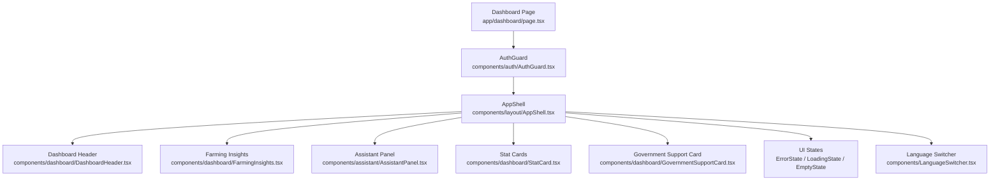

**Diagram sources**
- [page.tsx:32-43](file://Frontend/greenflora/app/dashboard/page.tsx#L32-L43)
- [AppShell.tsx:12-31](file://Frontend/greenflora/components/layout/AppShell.tsx#L12-L31)
- [LoadingState.tsx:14-43](file://Frontend/greenflora/components/ui/LoadingState.tsx#L14-L43)
- [ErrorState.tsx:11-38](file://Frontend/greenflora/components/ui/ErrorState.tsx#L11-L38)
- [EmptyState.tsx:12-33](file://Frontend/greenflora/components/ui/EmptyState.tsx#L12-L33)
- [StatCard.tsx:11-30](file://Frontend/greenflora/components/dashboard/StatCard.tsx#L11-L30)
- [LanguageSwitcher.tsx:5-50](file://Frontend/greenflora/components/LanguageSwitcher.tsx#L5-L50)

**Section sources**
- [page.tsx:19-50](file://Frontend/greenflora/app/dashboard/page.tsx#L19-L50)
- [AppShell.tsx:12-31](file://Frontend/greenflora/components/layout/AppShell.tsx#L12-L31)

## Core Components
- AuthGuard: Protects routes by checking authentication status; shows a full-screen loading skeleton while resolving auth and redirects to login if not authenticated.
- AppShell: Provides the application chrome (Sidebar, TopBar) and a centered main content container with responsive padding and desktop sidebar offset.
- Dashboard Page: Orchestrates data fetching hooks, composes sections, and manages loading/error/empty states. Uses responsive grids and animations.
- UI State Components:
  - StatCardSkeleton/CardSkeleton: Skeleton placeholders for cards during load.
  - ErrorState: Accessible alert banner with optional retry action.
  - EmptyState: Friendly placeholder when no farmer profile exists.
- StatCard: Reusable metric card with icon, label, value, and optional hint.
- LanguageSwitcher: Toggles between English and Urdu via Google Translate cookie and applies RTL and font changes globally.

**Section sources**
- [AuthGuard.tsx:37-58](file://Frontend/greenflora/components/auth/AuthGuard.tsx#L37-L58)
- [AppShell.tsx:12-31](file://Frontend/greenflora/components/layout/AppShell.tsx#L12-L31)
- [page.tsx:95-235](file://Frontend/greenflora/app/dashboard/page.tsx#L95-L235)
- [LoadingState.tsx:14-43](file://Frontend/greenflora/components/ui/LoadingState.tsx#L14-L43)
- [ErrorState.tsx:11-38](file://Frontend/greenflora/components/ui/ErrorState.tsx#L11-L38)
- [EmptyState.tsx:12-33](file://Frontend/greenflora/components/ui/EmptyState.tsx#L12-L33)
- [StatCard.tsx:11-30](file://Frontend/greenflora/components/dashboard/StatCard.tsx#L11-L30)
- [LanguageSwitcher.tsx:5-50](file://Frontend/greenflora/components/LanguageSwitcher.tsx#L5-L50)

## Architecture Overview
The dashboard follows a layered component hierarchy:
- Route-level protection ensures only authenticated users see content.
- AppShell provides consistent layout and spacing.
- The page composes multiple feature sections and uses hooks to fetch data.
- UI state components render appropriate feedback based on loading, error, or empty conditions.

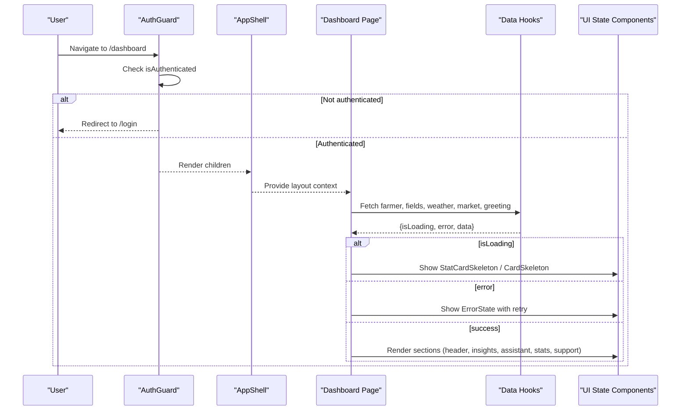

**Diagram sources**
- [AuthGuard.tsx:37-58](file://Frontend/greenflora/components/auth/AuthGuard.tsx#L37-L58)
- [page.tsx:52-93](file://Frontend/greenflora/app/dashboard/page.tsx#L52-L93)
- [LoadingState.tsx:14-43](file://Frontend/greenflora/components/ui/LoadingState.tsx#L14-L43)
- [ErrorState.tsx:11-38](file://Frontend/greenflora/components/ui/ErrorState.tsx#L11-L38)

## Detailed Component Analysis

### Page-based Component Hierarchy
- Entry point: Dashboard page wraps content in AuthGuard and AppShell.
- Sections:
  - DashboardHeader: Displays greeting and farmer name.
  - FarmingInsights: Aggregates weather, market, and crop insights.
  - AssistantPanel: Central AI chat experience with anchor-based scrolling.
  - My Farm snapshot: Grid of StatCards showing fields, area, crops, budget.
  - GovernmentSupportCard: Official support information.
- State handling:
  - Loading: Skeleton placeholders animate with pulse.
  - Error: Alert banner with retry button.
  - Empty: Placeholder prompting profile completion.

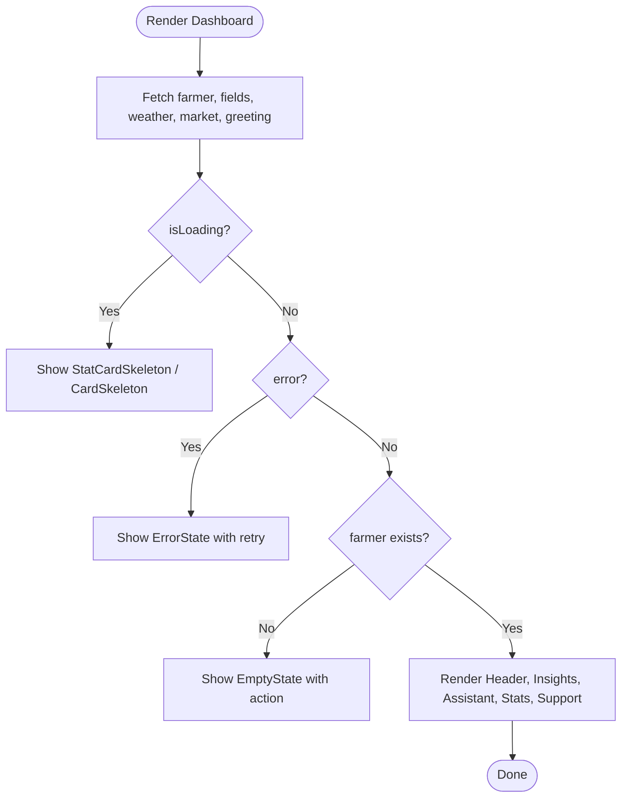

**Diagram sources**
- [page.tsx:95-235](file://Frontend/greenflora/app/dashboard/page.tsx#L95-L235)
- [LoadingState.tsx:14-43](file://Frontend/greenflora/components/ui/LoadingState.tsx#L14-L43)
- [ErrorState.tsx:11-38](file://Frontend/greenflora/components/ui/ErrorState.tsx#L11-L38)
- [EmptyState.tsx:12-33](file://Frontend/greenflora/components/ui/EmptyState.tsx#L12-L33)

**Section sources**
- [page.tsx:95-235](file://Frontend/greenflora/app/dashboard/page.tsx#L95-L235)

### Responsive Grid System
- The dashboard uses Tailwind’s responsive grid utilities to adapt layouts:
  - Two columns on small screens: sm:grid-cols-2
  - Four columns on large screens: lg:grid-cols-4
- This pattern appears in both the loading skeletons and the “My Farm” stat cards section, ensuring consistent alignment across breakpoints.

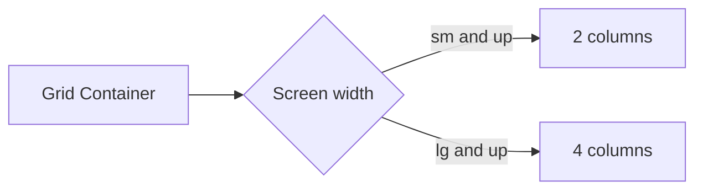

[No sources needed since this diagram shows conceptual workflow, not actual code structure]

**Section sources**
- [page.tsx:102-110](file://Frontend/greenflora/app/dashboard/page.tsx#L102-L110)
- [page.tsx:171-210](file://Frontend/greenflora/app/dashboard/page.tsx#L171-L210)

### Loading States Management
- StatCardSkeleton and CardSkeleton provide structured placeholders that match the final card dimensions and internal layout.
- A top hero placeholder uses a pulsing animation to indicate activity.
- These components are conditionally rendered while data is being fetched.

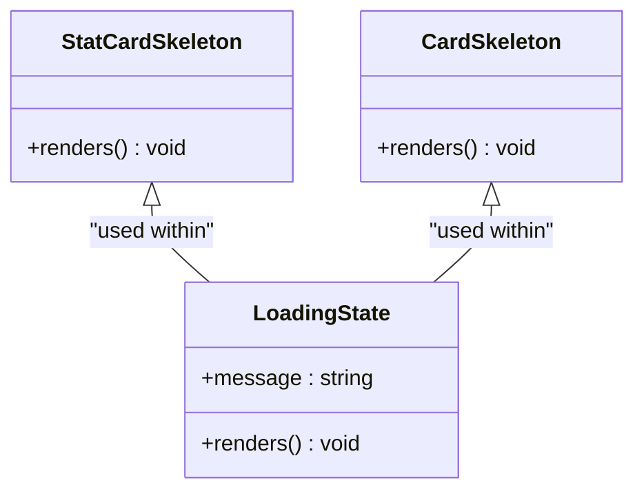

**Diagram sources**
- [LoadingState.tsx:14-43](file://Frontend/greenflora/components/ui/LoadingState.tsx#L14-L43)
- [page.tsx:99-112](file://Frontend/greenflora/app/dashboard/page.tsx#L99-L112)

**Section sources**
- [LoadingState.tsx:14-43](file://Frontend/greenflora/components/ui/LoadingState.tsx#L14-L43)
- [page.tsx:99-112](file://Frontend/greenflora/app/dashboard/page.tsx#L99-L112)

### Error Handling Patterns
- ErrorState renders an accessible alert banner with a warning icon, message, and optional retry button.
- The dashboard passes the aggregated error from data hooks and a refresh function to re-fetch data.

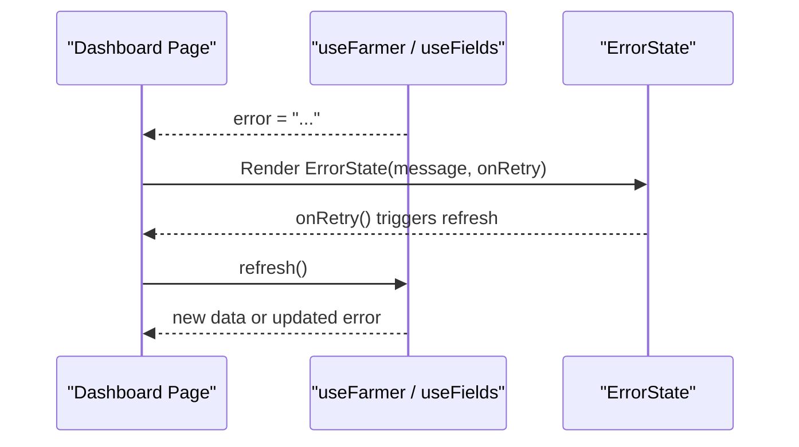

**Diagram sources**
- [page.tsx:114-117](file://Frontend/greenflora/app/dashboard/page.tsx#L114-L117)
- [ErrorState.tsx:11-38](file://Frontend/greenflora/components/ui/ErrorState.tsx#L11-L38)
- [useFarmer.ts:40-51](file://Frontend/greenflora/Hooks/useFarmer.ts#L40-L51)

**Section sources**
- [ErrorState.tsx:11-38](file://Frontend/greenflora/components/ui/ErrorState.tsx#L11-L38)
- [page.tsx:114-117](file://Frontend/greenflora/app/dashboard/page.tsx#L114-L117)
- [useFarmer.ts:40-51](file://Frontend/greenflora/Hooks/useFarmer.ts#L40-L51)

### Empty State Handling
- When no farmer profile exists, EmptyState displays a friendly message and a call-to-action to complete the profile.
- This prevents blank pages and guides users toward next steps.

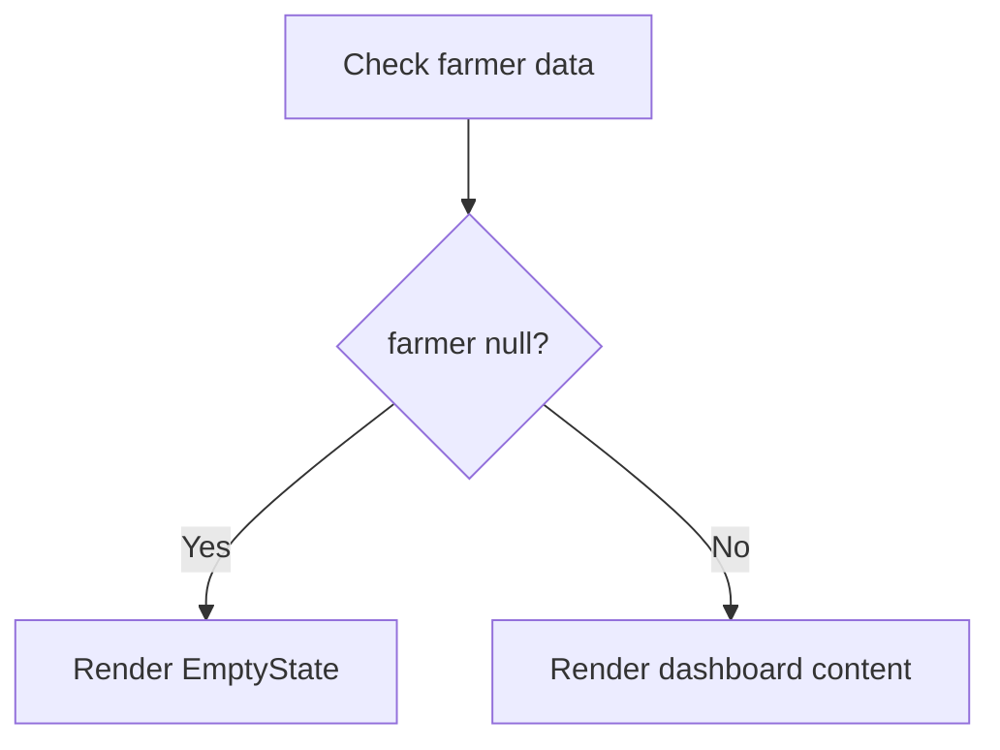

**Diagram sources**
- [page.tsx:220-234](file://Frontend/greenflora/app/dashboard/page.tsx#L220-L234)
- [EmptyState.tsx:12-33](file://Frontend/greenflora/components/ui/EmptyState.tsx#L12-L33)

**Section sources**
- [page.tsx:220-234](file://Frontend/greenflora/app/dashboard/page.tsx#L220-L234)
- [EmptyState.tsx:12-33](file://Frontend/greenflora/components/ui/EmptyState.tsx#L12-L33)

### Language Switcher Integration
- LanguageSwitcher toggles a Google Translate cookie to switch between English and Urdu.
- On mount, it detects the current language mode and sets document direction and language attributes accordingly.
- Global styles apply Urdu fonts and RTL adjustments when in Urdu mode.
- Root layout initializes Google Translate and includes a hidden mount point.

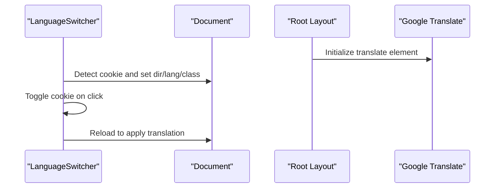

**Diagram sources**
- [LanguageSwitcher.tsx:5-50](file://Frontend/greenflora/components/LanguageSwitcher.tsx#L5-L50)
- [layout.tsx:63-91](file://Frontend/greenflora/app/layout.tsx#L63-L91)
- [globals.css:218-256](file://Frontend/greenflora/app/globals.css#L218-L256)

**Section sources**
- [LanguageSwitcher.tsx:5-50](file://Frontend/greenflora/components/LanguageSwitcher.tsx#L5-L50)
- [layout.tsx:63-91](file://Frontend/greenflora/app/layout.tsx#L63-L91)
- [globals.css:218-256](file://Frontend/greenflora/app/globals.css#L218-L256)

### Scroll Behavior with Anchor Links
- Sections such as the assistant and government support include id anchors.
- The parent container uses scroll-mt-24 to ensure anchored sections do not overlap under the fixed TopBar.

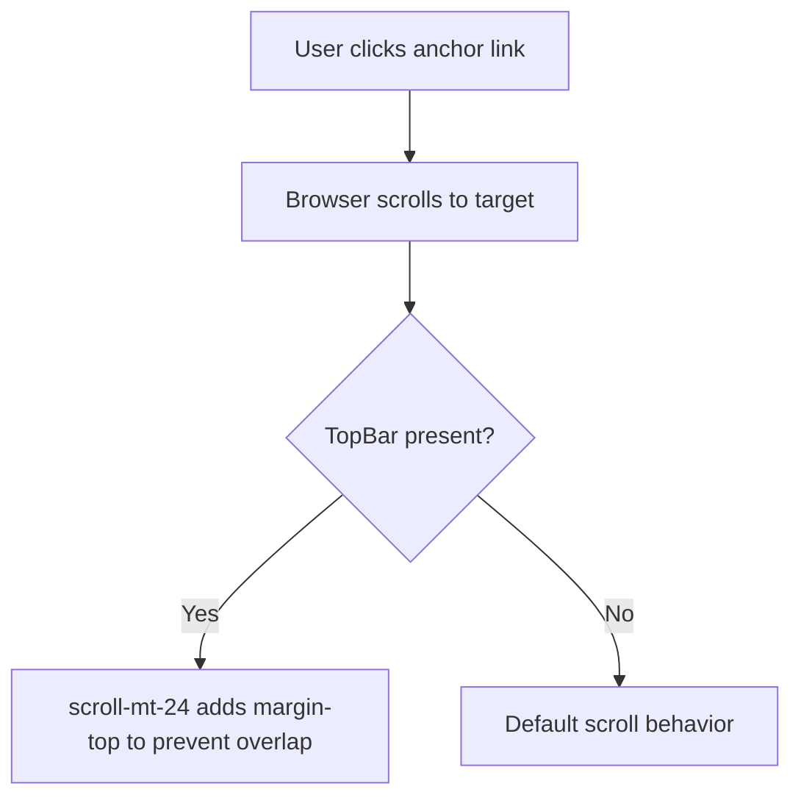

**Diagram sources**
- [page.tsx:146-148](file://Frontend/greenflora/app/dashboard/page.tsx#L146-L148)
- [page.tsx:214-216](file://Frontend/greenflora/app/dashboard/page.tsx#L214-L216)
- [AppShell.tsx:22-31](file://Frontend/greenflora/components/layout/AppShell.tsx#L22-L31)

**Section sources**
- [page.tsx:146-148](file://Frontend/greenflora/app/dashboard/page.tsx#L146-L148)
- [page.tsx:214-216](file://Frontend/greenflora/app/dashboard/page.tsx#L214-L216)
- [AppShell.tsx:22-31](file://Frontend/greenflora/components/layout/AppShell.tsx#L22-L31)

### Animation Patterns
- animate-gf-fade-in: Subtle fade-up transition applied to content sections for smooth appearance.
- animate-gf-pulse: Gentle opacity pulse used on skeleton placeholders and loading indicators.
- Reduced motion: Animations are disabled for users who prefer reduced motion.

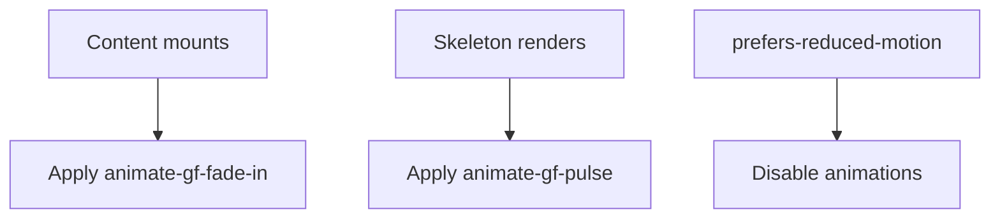

**Diagram sources**
- [page.tsx:121-121](file://Frontend/greenflora/app/dashboard/page.tsx#L121-L121)
- [page.tsx:101-101](file://Frontend/greenflora/app/dashboard/page.tsx#L101-L101)
- [globals.css:277-302](file://Frontend/greenflora/app/globals.css#L277-L302)
- [globals.css:482-500](file://Frontend/greenflora/app/globals.css#L482-L500)

**Section sources**
- [page.tsx:101-121](file://Frontend/greenflora/app/dashboard/page.tsx#L101-L121)
- [globals.css:277-302](file://Frontend/greenflora/app/globals.css#L277-L302)
- [globals.css:482-500](file://Frontend/greenflora/app/globals.css#L482-L500)

## Dependency Analysis
- Dashboard page depends on:
  - AuthGuard for route protection
  - AppShell for layout
  - Data hooks for farmer, fields, weather, market, and greeting
  - UI components for state rendering
- AppShell depends on Sidebar and TopBar for navigation chrome.
- LanguageSwitcher interacts with root layout’s Google Translate initialization and global styles for RTL and typography.

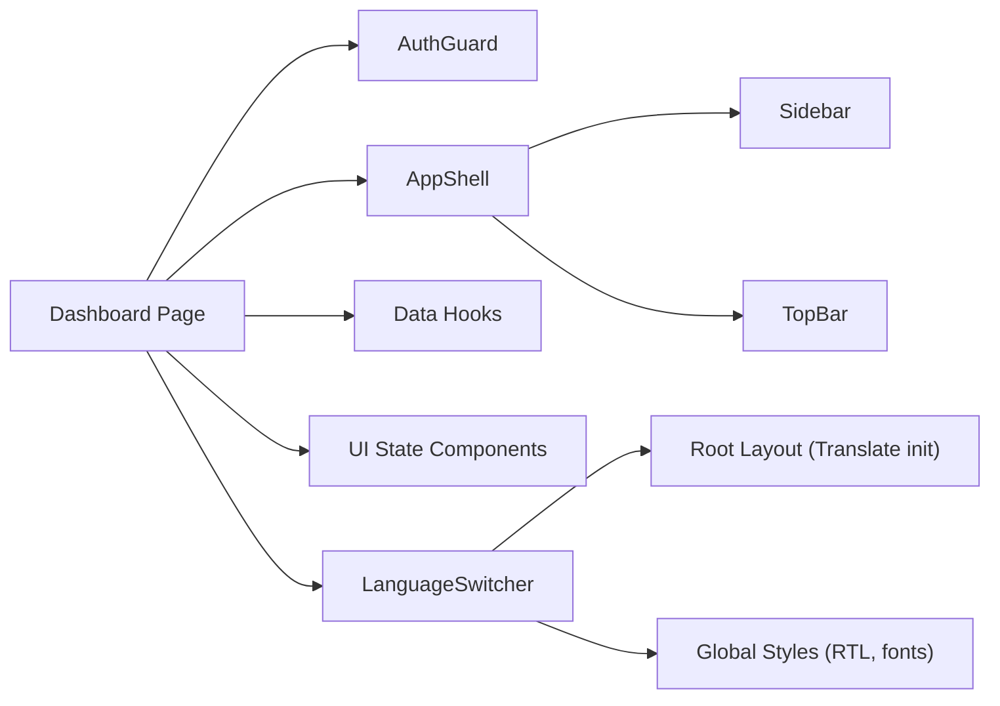

**Diagram sources**
- [page.tsx:32-43](file://Frontend/greenflora/app/dashboard/page.tsx#L32-L43)
- [AppShell.tsx:12-31](file://Frontend/greenflora/components/layout/AppShell.tsx#L12-L31)
- [LanguageSwitcher.tsx:5-50](file://Frontend/greenflora/components/LanguageSwitcher.tsx#L5-L50)
- [layout.tsx:63-91](file://Frontend/greenflora/app/layout.tsx#L63-L91)
- [globals.css:218-256](file://Frontend/greenflora/app/globals.css#L218-L256)

**Section sources**
- [page.tsx:32-43](file://Frontend/greenflora/app/dashboard/page.tsx#L32-L43)
- [AppShell.tsx:12-31](file://Frontend/greenflora/components/layout/AppShell.tsx#L12-L31)
- [LanguageSwitcher.tsx:5-50](file://Frontend/greenflora/components/LanguageSwitcher.tsx#L5-L50)
- [layout.tsx:63-91](file://Frontend/greenflora/app/layout.tsx#L63-L91)
- [globals.css:218-256](file://Frontend/greenflora/app/globals.css#L218-L256)

## Performance Considerations
- Prefer skeleton placeholders over spinners to maintain layout stability during loads.
- Use responsive grids to avoid unnecessary reflows on smaller screens.
- Keep animations subtle and respect reduced motion preferences.
- Avoid excessive re-renders by consolidating loading and error states at the page level.

[No sources needed since this section provides general guidance]

## Troubleshooting Guide
- If the dashboard shows a persistent loading state:
  - Verify data hooks return proper loading flags and resolve errors.
  - Ensure refresh functions are wired to retry actions.
- If errors persist after retry:
  - Check network requests and backend availability.
  - Confirm user authentication status via AuthGuard.
- If language switching does not apply:
  - Ensure Google Translate script is loaded and the hidden mount point exists.
  - Confirm document attributes (dir, lang) and urdu-mode class are applied.
- If anchor links overlap under the TopBar:
  - Verify scroll-mt-24 is applied to the target sections.

**Section sources**
- [AuthGuard.tsx:37-58](file://Frontend/greenflora/components/auth/AuthGuard.tsx#L37-L58)
- [page.tsx:114-117](file://Frontend/greenflora/app/dashboard/page.tsx#L114-L117)
- [LanguageSwitcher.tsx:5-50](file://Frontend/greenflora/components/LanguageSwitcher.tsx#L5-L50)
- [layout.tsx:63-91](file://Frontend/greenflora/app/layout.tsx#L63-L91)
- [page.tsx:146-148](file://Frontend/greenflora/app/dashboard/page.tsx#L146-L148)

## Conclusion
The dashboard page combines robust route protection, a consistent shell layout, and clear state management to deliver a responsive and accessible user experience. Its modular components and Tailwind-based grid system scale gracefully across devices, while language switching and animations enhance usability without compromising performance.

[No sources needed since this section summarizes without analyzing specific files]