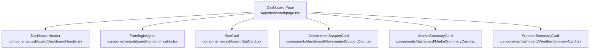
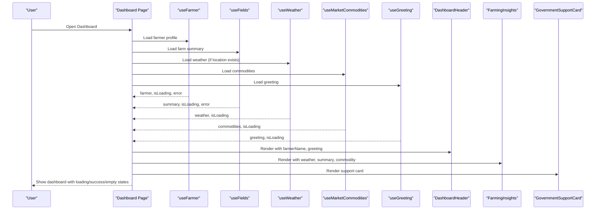
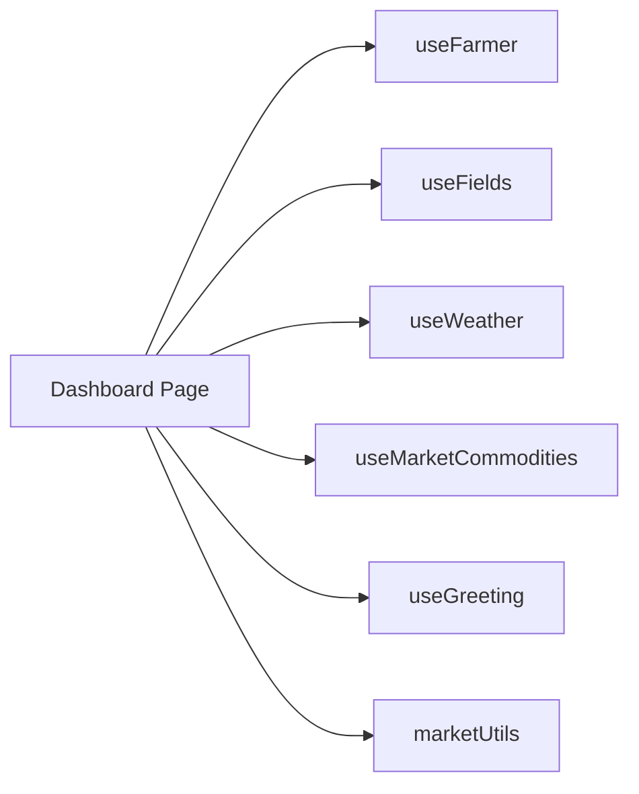

# Dashboard Module

<cite>
**Referenced Files in This Document**
- [page.tsx](file://Frontend/greenflora/app/dashboard/page.tsx)
- [DashboardHeader.tsx](file://Frontend/greenflora/components/dashboard/DashboardHeader.tsx)
- [FarmingInsights.tsx](file://Frontend/greenflora/components/dashboard/FarmingInsights.tsx)
- [StatCard.tsx](file://Frontend/greenflora/components/dashboard/StatCard.tsx)
- [GovernmentSupportCard.tsx](file://Frontend/greenflora/components/dashboard/GovernmentSupportCard.tsx)
- [MarketSummaryCard.tsx](file://Frontend/greenflora/components/dashboard/MarketSummaryCard.tsx)
- [WeatherSummaryCard.tsx](file://Frontend/greenflora/components/dashboard/WeatherSummaryCard.tsx)
- [useFarmer.ts](file://Frontend/greenflora/Hooks/useFarmer.ts)
- [useFields.ts](file://Frontend/greenflora/Hooks/useFields.ts)
- [useWeather.ts](file://Frontend/greenflora/Hooks/useWeather.ts)
- [useMarket.ts](file://Frontend/greenflora/Hooks/useMarket.ts)
- [useAssistant.ts](file://Frontend/greenflora/Hooks/useAssistant.ts)
- [marketUtils.ts](file://Frontend/greenflora/lib/marketUtils.ts)
- [farmer.ts](file://Frontend/greenflora/types/farmer.ts)
</cite>

## Table of Contents
1. [Introduction](#introduction)
2. [Project Structure](#project-structure)
3. [Core Components](#core-components)
4. [Architecture Overview](#architecture-overview)
5. [Detailed Component Analysis](#detailed-component-analysis)
6. [Dependency Analysis](#dependency-analysis)
7. [Performance Considerations](#performance-considerations)
8. [Troubleshooting Guide](#troubleshooting-guide)
9. [Conclusion](#conclusion)

## Introduction
This document explains the Green-Flora dashboard module, which serves as the central farmer overview page. It combines:
- AI assistant integration for conversational help and voice features
- Farming insights that synthesize weather, crops, and market data into actionable messages
- A farm snapshot with key metrics (fields, area, crops, budget)
- Government support information sourced from the backend

The page uses a component-based architecture with clear separation between presentation (cards, header), data fetching (hooks), and utilities (market formatting). It handles loading states, errors, empty states, and responsive design to provide a smooth experience across devices.

## Project Structure
At a high level:
- The dashboard page orchestrates multiple hooks to gather data and renders a set of cards and sections.
- The header displays a rotating scene carousel with localized messaging.
- Insights combine weather, crop distribution, and market prices into concise summaries.
- Stat cards present quick metrics about the farm.
- Government support is shown via a dedicated card that pulls live data from the backend.

**Diagram sources**
- [page.tsx:95-217](file://Frontend/greenflora/app/dashboard/page.tsx#L95-L217)
- [DashboardHeader.tsx:95-238](file://Frontend/greenflora/components/dashboard/DashboardHeader.tsx#L95-L238)
- [FarmingInsights.tsx:314-345](file://Frontend/greenflora/components/dashboard/FarmingInsights.tsx#L314-L345)
- [StatCard.tsx:11-31](file://Frontend/greenflora/components/dashboard/StatCard.tsx#L11-L31)
- [GovernmentSupportCard.tsx:61-130](file://Frontend/greenflora/components/dashboard/GovernmentSupportCard.tsx#L61-L130)
- [MarketSummaryCard.tsx:37-90](file://Frontend/greenflora/components/dashboard/MarketSummaryCard.tsx#L37-L90)
- [WeatherSummaryCard.tsx:37-125](file://Frontend/greenflora/components/dashboard/WeatherSummaryCard.tsx#L37-L125)

**Section sources**
- [page.tsx:1-238](file://Frontend/greenflora/app/dashboard/page.tsx#L1-L238)

## Core Components
- DashboardPage: Orchestrates data fetching via hooks, composes UI sections, and manages global loading/error/empty states.
- DashboardHeader: Rotating hero carousel with language-aware scenes and date display.
- FarmingInsights: Aggregates weather, crop, and market insights into three insight cards with skeletons and fallbacks.
- StatCard: Reusable metric card used for farm snapshot values.
- GovernmentSupportCard: Displays active government helpline info with call-to-action.
- MarketSummaryCard and WeatherSummaryCard: Compact feature cards linking to detailed pages.

Key responsibilities:
- Data orchestration: The page fetches farmer profile, fields summary, weather, market commodities, and AI greeting.
- Presentation: Cards render consistent UI patterns with icons, labels, and values.
- State handling: Loading skeletons, error prompts, and empty state guidance are handled at the page and component levels.

**Section sources**
- [page.tsx:52-238](file://Frontend/greenflora/app/dashboard/page.tsx#L52-L238)
- [DashboardHeader.tsx:95-238](file://Frontend/greenflora/components/dashboard/DashboardHeader.tsx#L95-L238)
- [FarmingInsights.tsx:314-345](file://Frontend/greenflora/components/dashboard/FarmingInsights.tsx#L314-L345)
- [StatCard.tsx:11-31](file://Frontend/greenflora/components/dashboard/StatCard.tsx#L11-L31)
- [GovernmentSupportCard.tsx:61-130](file://Frontend/greenflora/components/dashboard/GovernmentSupportCard.tsx#L61-L130)
- [MarketSummaryCard.tsx:37-90](file://Frontend/greenflora/components/dashboard/MarketSummaryCard.tsx#L37-L90)
- [WeatherSummaryCard.tsx:37-125](file://Frontend/greenflora/components/dashboard/WeatherSummaryCard.tsx#L37-L125)

## Architecture Overview
The dashboard follows a page-level composition pattern:
- Hooks encapsulate data fetching and expose loading/error states.
- The page wires hook outputs into components.
- Components handle their own local loading and fallback logic.

**Diagram sources**
- [page.tsx:52-217](file://Frontend/greenflora/app/dashboard/page.tsx#L52-L217)
- [useFarmer.ts:34-88](file://Frontend/greenflora/Hooks/useFarmer.ts#L34-L88)
- [useFields.ts:51-159](file://Frontend/greenflora/Hooks/useFields.ts#L51-L159)
- [useWeather.ts:21-58](file://Frontend/greenflora/Hooks/useWeather.ts#L21-L58)
- [useMarket.ts:33-64](file://Frontend/greenflora/Hooks/useMarket.ts#L33-L64)
- [useAssistant.ts:673-699](file://Frontend/greenflora/Hooks/useAssistant.ts#L673-L699)

## Detailed Component Analysis

### DashboardPage
Responsibilities:
- Fetches farmer profile, fields summary, weather, market commodities, and AI greeting using hooks.
- Determines featured commodity based on active crops or current crop.
- Renders loading skeletons, error state, success content, and empty state when no farmer data exists.
- Composes sections: header, insights, AI assistant panel, farm snapshot, and government support.

Data flow highlights:
- useFarmer provides farmer data and completeness score; used to check if location is set and to drive some stat values.
- useFields provides farm summary including total fields, area, and crop distribution.
- useWeather conditionally loads weather only if latitude and longitude exist.
- useMarketCommodities provides available commodities; pickDefaultCommodity selects the best match for the user’s crops.
- useGreeting provides a localized, time-aware greeting for the hero section.

Loading and error handling:
- Global loading state shows skeleton placeholders for header and stat cards.
- Error state surfaces a retry action tied to refreshing farmer data.
- Empty state guides users to complete their profile when no farmer data is found.

Responsive design:
- Grid layouts adapt across breakpoints for stat cards and insight cards.
- Language switcher positioned at top-right for accessibility.

**Section sources**
- [page.tsx:52-238](file://Frontend/greenflora/app/dashboard/page.tsx#L52-L238)
- [marketUtils.ts:352-382](file://Frontend/greenflora/lib/marketUtils.ts#L352-L382)

### DashboardHeader
Responsibilities:
- Displays a rotating carousel of farm scenes with localized messages.
- Detects Urdu app mode and adjusts alignment and filtering of scenes accordingly.
- Shows date formatted per locale and a bottom message indicating today’s farm status.

Behavioral details:
- Scene rotation interval updates visibility and index with fade transitions.
- In Urdu mode, only Urdu scenes are shown; text alignment switches to right-to-left where appropriate.
- Demo badge appears when viewing demo data.

**Section sources**
- [DashboardHeader.tsx:95-238](file://Frontend/greenflora/components/dashboard/DashboardHeader.tsx#L95-L238)

### FarmingInsights
Responsibilities:
- Renders three insight cards: Weather, Crops, Market.
- Builds human-readable insights from real data:
  - Weather insight considers rain chance and temperature thresholds.
  - Crop insight summarizes fields, area, and active crops.
  - Market insight formats price and markets reporting with safe fallbacks.

State handling:
- Skeleton placeholders during loading.
- Quiet fallbacks when data is missing or unavailable.
- Links to profile or weather pages for remediation actions.

**Section sources**
- [FarmingInsights.tsx:33-100](file://Frontend/greenflora/components/dashboard/FarmingInsights.tsx#L33-L100)
- [FarmingInsights.tsx:134-221](file://Frontend/greenflora/components/dashboard/FarmingInsights.tsx#L134-L221)
- [FarmingInsights.tsx:223-253](file://Frontend/greenflora/components/dashboard/FarmingInsights.tsx#L223-L253)
- [FarmingInsights.tsx:255-312](file://Frontend/greenflora/components/dashboard/FarmingInsights.tsx#L255-L312)
- [FarmingInsights.tsx:314-345](file://Frontend/greenflora/components/dashboard/FarmingInsights.tsx#L314-L345)

### StatCard
Responsibilities:
- Presents a label, value, optional hint, and icon in a consistent card layout.
- Used for farm snapshot metrics such as total fields, field area, crops count, and budget.

Design notes:
- Uses shared Card component for padding and styling.
- Animations applied for entrance effects.

**Section sources**
- [StatCard.tsx:11-31](file://Frontend/greenflora/components/dashboard/StatCard.tsx#L11-L31)

### GovernmentSupportCard
Responsibilities:
- Loads active government support record from backend.
- Displays name, organization, phone number, hours, and description.
- Provides a “Call Now” action that opens the device dialer with a sanitized tel link.

Error and empty handling:
- Skeleton placeholder while loading.
- Fallback message when data is unavailable.

**Section sources**
- [GovernmentSupportCard.tsx:61-130](file://Frontend/greenflora/components/dashboard/GovernmentSupportCard.tsx#L61-L130)

### MarketSummaryCard and WeatherSummaryCard
Responsibilities:
- Provide compact previews of market prices and current weather.
- Deep-link to full Market Intelligence and Weather pages.
- Handle loading skeletons and informative fallbacks when data is not yet available.

**Section sources**
- [MarketSummaryCard.tsx:37-90](file://Frontend/greenflora/components/dashboard/MarketSummaryCard.tsx#L37-L90)
- [WeatherSummaryCard.tsx:37-125](file://Frontend/greenflora/components/dashboard/WeatherSummaryCard.tsx#L37-L125)

## Dependency Analysis
Hooks and utilities form the backbone of data flow:
- useFarmer: Fetches farmer profile and exposes completeness calculation.
- useFields: Fetches farm summary and exposes CRUD actions for fields and crop cycles.
- useWeather: Conditionally fetches weather based on coordinates.
- useMarketCommodities: Fetches available commodities and availability flag.
- useGreeting: Fetches localized greeting with fallback.
- marketUtils: Formats currency and dates; selects default commodity based on active crops.

**Diagram sources**
- [page.tsx:52-88](file://Frontend/greenflora/app/dashboard/page.tsx#L52-L88)
- [useFarmer.ts:34-88](file://Frontend/greenflora/Hooks/useFarmer.ts#L34-L88)
- [useFields.ts:51-159](file://Frontend/greenflora/Hooks/useFields.ts#L51-L159)
- [useWeather.ts:21-58](file://Frontend/greenflora/Hooks/useWeather.ts#L21-L58)
- [useMarket.ts:33-64](file://Frontend/greenflora/Hooks/useMarket.ts#L33-L64)
- [useAssistant.ts:673-699](file://Frontend/greenflora/Hooks/useAssistant.ts#L673-L699)
- [marketUtils.ts:352-382](file://Frontend/greenflora/lib/marketUtils.ts#L352-L382)

**Section sources**
- [useFarmer.ts:34-88](file://Frontend/greenflora/Hooks/useFarmer.ts#L34-L88)
- [useFields.ts:51-159](file://Frontend/greenflora/Hooks/useFields.ts#L51-L159)
- [useWeather.ts:21-58](file://Frontend/greenflora/Hooks/useWeather.ts#L21-L58)
- [useMarket.ts:33-64](file://Frontend/greenflora/Hooks/useMarket.ts#L33-L64)
- [useAssistant.ts:673-699](file://Frontend/greenflora/Hooks/useAssistant.ts#L673-L699)
- [marketUtils.ts:352-382](file://Frontend/greenflora/lib/marketUtils.ts#L352-L382)

## Performance Considerations
- Conditional weather fetching: Weather is only requested when coordinates exist, avoiding unnecessary API calls.
- Client-side period slicing: Market trend data is fetched once with a wide window and sliced client-side for instant filter switching.
- Lightweight skeletons: Shimmer placeholders reduce perceived latency without blocking interactions.
- Efficient rendering: Insight cards compute short strings from existing data rather than making additional requests.

[No sources needed since this section provides general guidance]

## Troubleshooting Guide
Common issues and resolutions:
- No weather data: Ensure farm location is set in the profile; the weather card links to the profile page for setup.
- Missing market prices: Market data depends on daily AMIS ingestion; the card informs users when data is not yet available.
- Profile incomplete: If no farmer data is found, the empty state directs users to complete their profile.
- Government support unavailable: A quiet fallback ensures the dashboard remains functional even if the support record is missing.

Error handling patterns:
- Hooks centralize error states and provide refresh actions.
- Components show friendly messages and links to relevant pages for remediation.

**Section sources**
- [FarmingInsights.tsx:134-221](file://Frontend/greenflora/components/dashboard/FarmingInsights.tsx#L134-L221)
- [MarketSummaryCard.tsx:37-90](file://Frontend/greenflora/components/dashboard/MarketSummaryCard.tsx#L37-L90)
- [WeatherSummaryCard.tsx:37-125](file://Frontend/greenflora/components/dashboard/WeatherSummaryCard.tsx#L37-L125)
- [GovernmentSupportCard.tsx:61-130](file://Frontend/greenflora/components/dashboard/GovernmentSupportCard.tsx#L61-L130)
- [page.tsx:114-234](file://Frontend/greenflora/app/dashboard/page.tsx#L114-L234)

## Conclusion
The Green-Flora dashboard module integrates multiple data sources through well-structured hooks and presents them via reusable components. It balances rich functionality with robust state handling, ensuring a resilient user experience. The AI greeting system, featured commodity selection, and adaptive behavior based on profile completion make the dashboard personalized and actionable. The modular design allows easy extension and maintenance while keeping performance and usability at the forefront.

[No sources needed since this section summarizes without analyzing specific files]