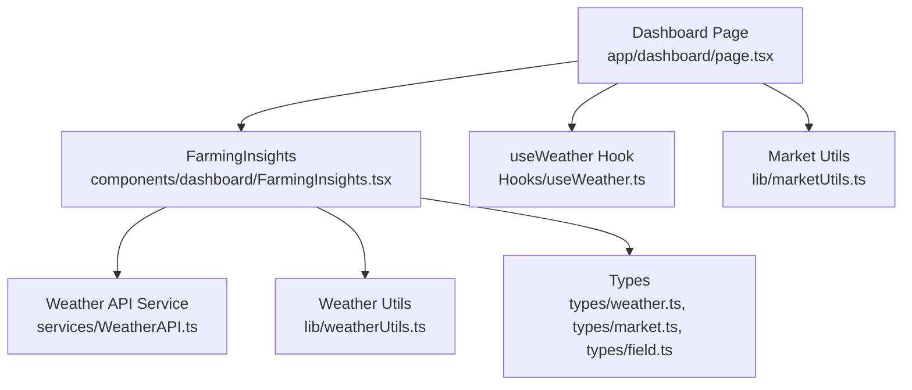
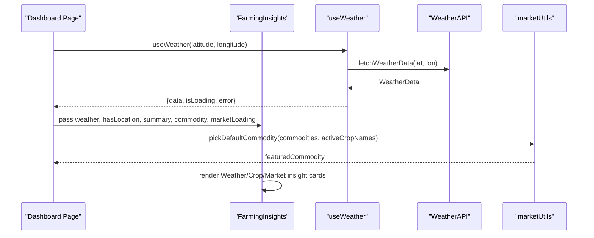
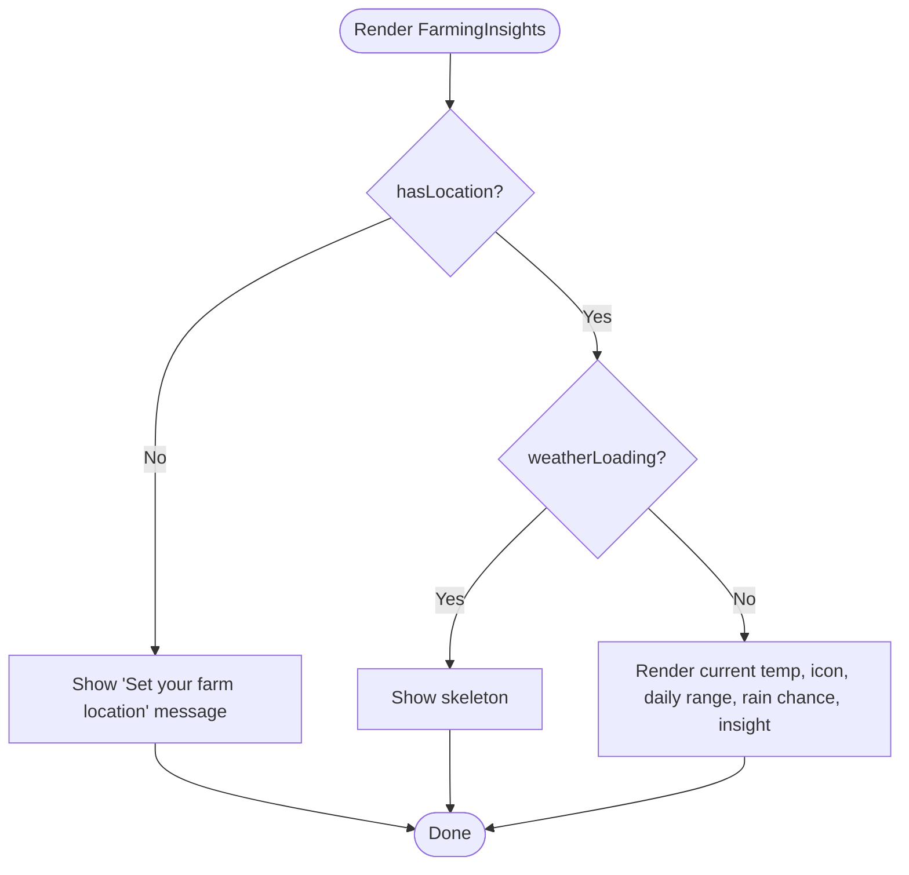
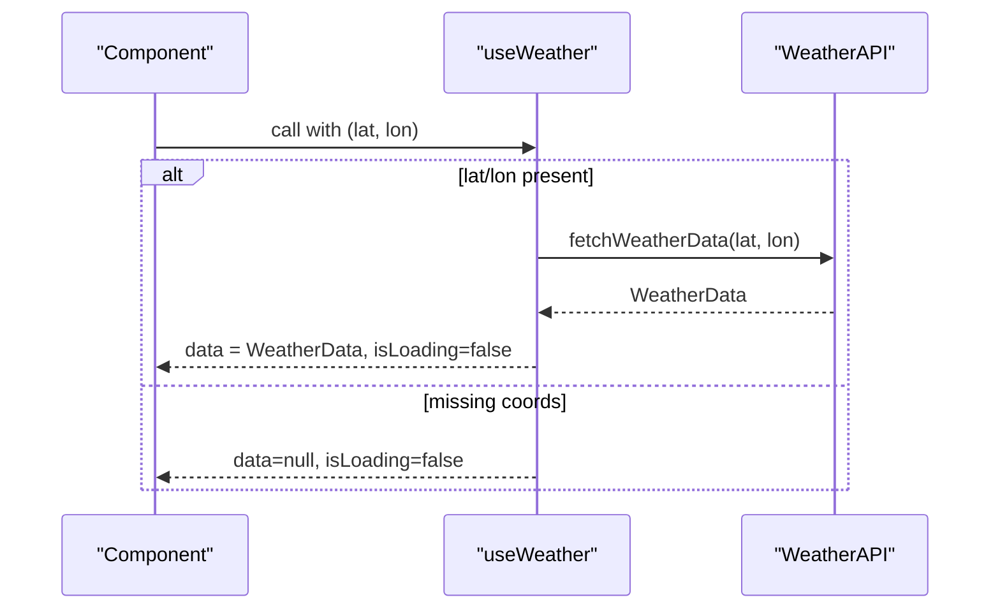
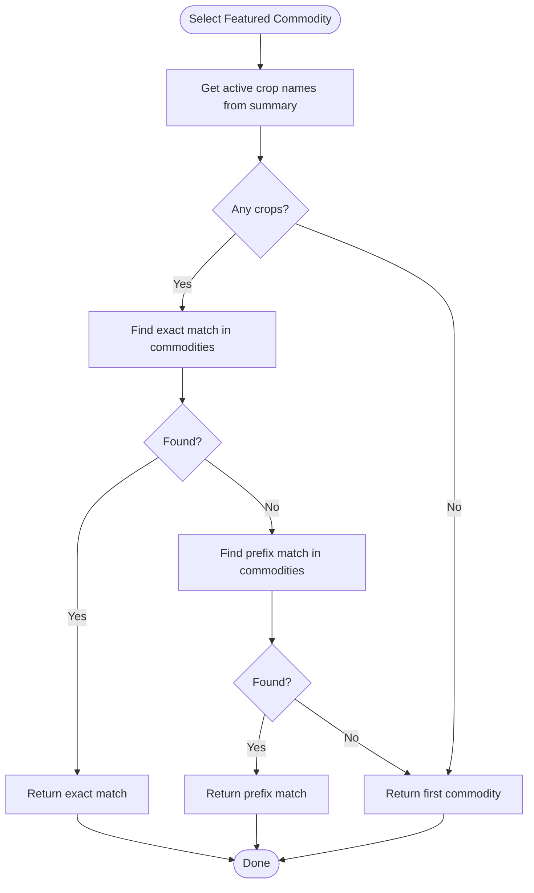
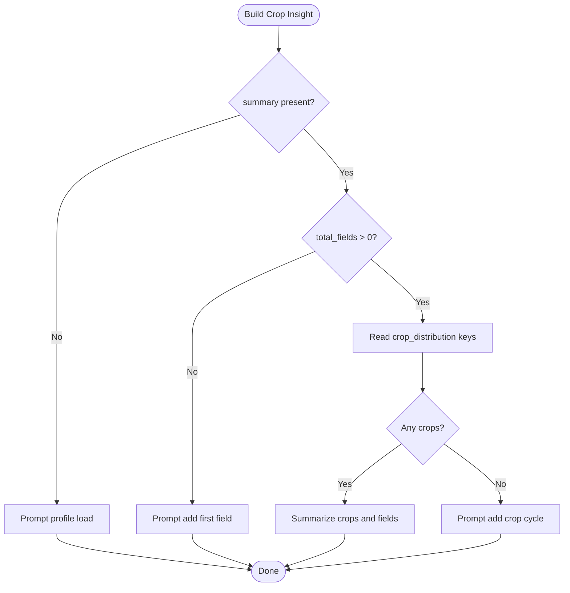
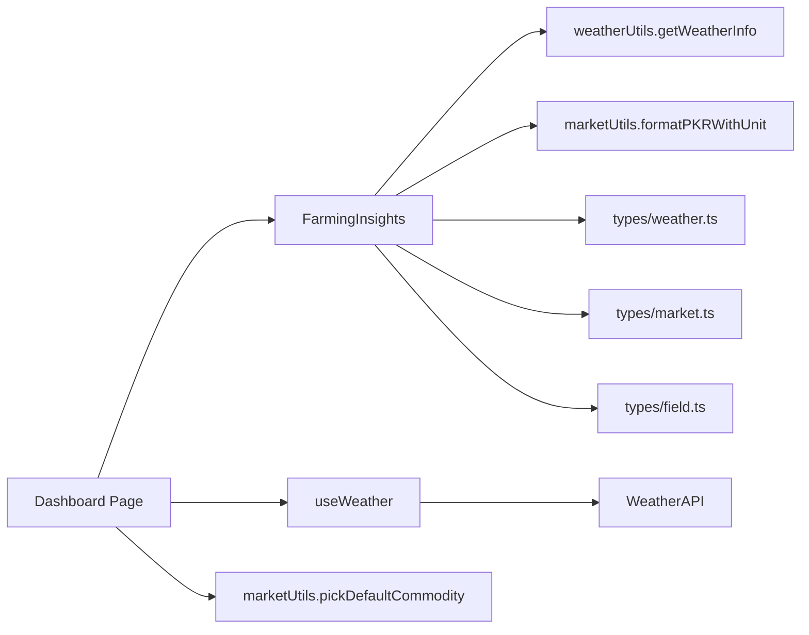

# Farming Insights Component

<cite>
**Referenced Files in This Document**
- [FarmingInsights.tsx](file://Frontend/greenflora/components/dashboard/FarmingInsights.tsx)
- [useWeather.ts](file://Frontend/greenflora/Hooks/useWeather.ts)
- [marketUtils.ts](file://Frontend/greenflora/lib/marketUtils.ts)
- [weatherUtils.ts](file://Frontend/greenflora/lib/weatherUtils.ts)
- [WeatherAPI.ts](file://Frontend/greenflora/services/WeatherAPI.ts)
- [weather.ts](file://Frontend/greenflora/types/weather.ts)
- [market.ts](file://Frontend/greenflora/types/market.ts)
- [field.ts](file://Frontend/greenflora/types/field.ts)
- [page.tsx](file://Frontend/greenflora/app/dashboard/page.tsx)
</cite>

## Table of Contents
1. [Introduction](#introduction)
2. [Project Structure](#project-structure)
3. [Core Components](#core-components)
4. [Architecture Overview](#architecture-overview)
5. [Detailed Component Analysis](#detailed-component-analysis)
6. [Dependency Analysis](#dependency-analysis)
7. [Performance Considerations](#performance-considerations)
8. [Troubleshooting Guide](#troubleshooting-guide)
9. [Conclusion](#conclusion)

## Introduction
This document explains the FarmingInsights component that unifies weather, market, and crop intelligence into a single insight card row on the dashboard. It covers how location-based weather data is fetched, how the default market commodity is selected based on the farmer’s crops, and how field summary data drives crop insights. It also details conditional rendering when farm location is missing, loading state management for weather and market data, and how each insight card adapts to available data.

## Project Structure
The FarmingInsights feature spans several layers:
- UI layer: Insight cards (Weather, Crops, Market) rendered by the FarmingInsights component.
- Data hooks: useWeather fetches Open-Meteo weather using coordinates from the farmer profile.
- Utilities: market formatting helpers and crop accent logic; weather condition mapping utilities.
- Types: strongly-typed shapes for weather, market, and field data.
- Dashboard page: wires together farmer data, fields summary, weather, and market commodities to feed FarmingInsights.

**Diagram sources**
- [page.tsx:52-88](file://Frontend/greenflora/app/dashboard/page.tsx#L52-L88)
- [FarmingInsights.tsx:314-345](file://Frontend/greenflora/components/dashboard/FarmingInsights.tsx#L314-L345)
- [useWeather.ts:21-57](file://Frontend/greenflora/Hooks/useWeather.ts#L21-L57)
- [marketUtils.ts:352-381](file://Frontend/greenflora/lib/marketUtils.ts#L352-L381)
- [WeatherAPI.ts:141-222](file://Frontend/greenflora/services/WeatherAPI.ts#L141-L222)
- [weatherUtils.ts:14-194](file://Frontend/greenflora/lib/weatherUtils.ts#L14-L194)
- [weather.ts:52-60](file://Frontend/greenflora/types/weather.ts#L52-L60)
- [market.ts:11-22](file://Frontend/greenflora/types/market.ts#L11-L22)
- [field.ts:66-77](file://Frontend/greenflora/types/field.ts#L66-L77)

**Section sources**
- [page.tsx:52-88](file://Frontend/greenflora/app/dashboard/page.tsx#L52-L88)
- [FarmingInsights.tsx:314-345](file://Frontend/greenflora/components/dashboard/FarmingInsights.tsx#L314-L345)

## Core Components
- Weather insight: Displays current temperature, icon, daily high/low, rain chance, and an actionable insight derived from today’s forecast. Shows a prompt to set location if none is configured.
- Crop insight: Summarizes active fields and crop distribution from the farm summary. Provides guidance when no fields or cycles exist.
- Market insight: Shows the featured commodity’s latest price, reporting markets, date, and a short narrative about price availability.

Key behaviors:
- Conditional rendering based on hasLocation flag for weather.
- Loading skeletons while fetching weather or market data.
- Graceful fallbacks when data is unavailable or incomplete.

**Section sources**
- [FarmingInsights.tsx:33-100](file://Frontend/greenflora/components/dashboard/FarmingInsights.tsx#L33-L100)
- [FarmingInsights.tsx:134-221](file://Frontend/greenflora/components/dashboard/FarmingInsights.tsx#L134-L221)
- [FarmingInsights.tsx:223-253](file://Frontend/greenflora/components/dashboard/FarmingInsights.tsx#L223-L253)
- [FarmingInsights.tsx:255-312](file://Frontend/greenflora/components/dashboard/FarmingInsights.tsx#L255-L312)

## Architecture Overview
The dashboard composes three independent data streams into one cohesive view:
- Weather: Coordinates from the farmer profile are passed to useWeather, which calls the Open-Meteo API via WeatherAPI and returns typed WeatherData.
- Market: Commodities are loaded and the default commodity is selected using pickDefaultCommodity based on the farmer’s active crops from the field summary.
- Crops: Field summary provides total fields, area, and crop_distribution used to build contextual messages.

**Diagram sources**
- [page.tsx:68-88](file://Frontend/greenflora/app/dashboard/page.tsx#L68-L88)
- [useWeather.ts:21-57](file://Frontend/greenflora/Hooks/useWeather.ts#L21-L57)
- [WeatherAPI.ts:141-222](file://Frontend/greenflora/services/WeatherAPI.ts#L141-L222)
- [marketUtils.ts:352-381](file://Frontend/greenflora/lib/marketUtils.ts#L352-L381)
- [FarmingInsights.tsx:314-345](file://Frontend/greenflora/components/dashboard/FarmingInsights.tsx#L314-L345)

## Detailed Component Analysis

### FarmingInsights Component
Responsibilities:
- Compose three insight cards: Weather, Crops, Market.
- Manage per-card loading states and fallbacks.
- Build human-readable insights from raw data.

Props:
- Weather data and loading/error flags.
- hasLocation to gate location-dependent behavior.
- Farm summary for crop insights.
- Featured commodity and market loading state.

Rendering logic:
- Weather card shows a “set your location” message when hasLocation is false.
- When weather is loading and location exists, it shows a skeleton.
- Otherwise, it displays current conditions, daily range, rain chance, and an insight text generated from today’s forecast.
- Crop card summarizes fields and crops from summary.
- Market card shows latest price, markets reporting, date, and a narrative about availability.

**Diagram sources**
- [FarmingInsights.tsx:134-221](file://Frontend/greenflora/components/dashboard/FarmingInsights.tsx#L134-L221)
- [FarmingInsights.tsx:314-345](file://Frontend/greenflora/components/dashboard/FarmingInsights.tsx#L314-L345)

**Section sources**
- [FarmingInsights.tsx:22-31](file://Frontend/greenflora/components/dashboard/FarmingInsights.tsx#L22-L31)
- [FarmingInsights.tsx:102-132](file://Frontend/greenflora/components/dashboard/FarmingInsights.tsx#L102-L132)
- [FarmingInsights.tsx:134-221](file://Frontend/greenflora/components/dashboard/FarmingInsights.tsx#L134-L221)
- [FarmingInsights.tsx:223-253](file://Frontend/greenflora/components/dashboard/FarmingInsights.tsx#L223-L253)
- [FarmingInsights.tsx:255-312](file://Frontend/greenflora/components/dashboard/FarmingInsights.tsx#L255-L312)
- [FarmingInsights.tsx:314-345](file://Frontend/greenflora/components/dashboard/FarmingInsights.tsx#L314-L345)

### Weather Data Integration with useWeather
- The hook accepts latitude and longitude and triggers a fetch only when both are present.
- It manages loading, error, and data state and exposes a refresh function.
- Errors are normalized to user-friendly messages.

**Diagram sources**
- [useWeather.ts:21-57](file://Frontend/greenflora/Hooks/useWeather.ts#L21-L57)
- [WeatherAPI.ts:141-222](file://Frontend/greenflora/services/WeatherAPI.ts#L141-L222)

**Section sources**
- [useWeather.ts:21-57](file://Frontend/greenflora/Hooks/useWeather.ts#L21-L57)
- [WeatherAPI.ts:141-222](file://Frontend/greenflora/services/WeatherAPI.ts#L141-L222)
- [weather.ts:52-60](file://Frontend/greenflora/types/weather.ts#L52-L60)

### Market Commodity Selection Logic
- The dashboard computes active crop names from the field summary (or falls back to the farmer’s current crop).
- pickDefaultCommodity selects:
  - Exact match first among commodities.
  - Prefix match next (e.g., “Wheat” matches “Wheat Straw”).
  - Otherwise, the first commodity in the list.
- The selected commodity becomes the featured item shown in the Market insight card.

**Diagram sources**
- [marketUtils.ts:352-381](file://Frontend/greenflora/lib/marketUtils.ts#L352-L381)
- [page.tsx:77-88](file://Frontend/greenflora/app/dashboard/page.tsx#L77-L88)

**Section sources**
- [marketUtils.ts:352-381](file://Frontend/greenflora/lib/marketUtils.ts#L352-L381)
- [page.tsx:77-88](file://Frontend/greenflora/app/dashboard/page.tsx#L77-L88)
- [market.ts:11-22](file://Frontend/greenflora/types/market.ts#L11-L22)

### Crop Distribution Analysis from Field Summary
- The crop insight uses FarmSummary.total_fields, total_field_area_acres, and crop_distribution keys to generate a concise message.
- If there are no fields, it prompts adding the first field.
- If fields exist but no active crop cycle, it guides adding a crop cycle.

**Diagram sources**
- [FarmingInsights.tsx:56-81](file://Frontend/greenflora/components/dashboard/FarmingInsights.tsx#L56-L81)
- [field.ts:66-77](file://Frontend/greenflora/types/field.ts#L66-L77)

**Section sources**
- [FarmingInsights.tsx:56-81](file://Frontend/greenflora/components/dashboard/FarmingInsights.tsx#L56-L81)
- [field.ts:66-77](file://Frontend/greenflora/types/field.ts#L66-L77)

### Conditional Rendering Based on hasLocation
- When hasLocation is false, the weather card shows a friendly prompt to set the farm location in the profile.
- When true, it proceeds to show weather data or loading skeletons.

**Section sources**
- [FarmingInsights.tsx:134-168](file://Frontend/greenflora/components/dashboard/FarmingInsights.tsx#L134-L168)

### Loading State Management
- Weather card:
  - Shows skeleton while weatherLoading is true and hasLocation is true.
  - Shows fallback text when weather is null or an error occurred.
- Market card:
  - Shows skeleton while marketLoading is true.
  - Shows fallback text when data is not available or commodity is null.

**Section sources**
- [FarmingInsights.tsx:166-173](file://Frontend/greenflora/components/dashboard/FarmingInsights.tsx#L166-L173)
- [FarmingInsights.tsx:264-275](file://Frontend/greenflora/components/dashboard/FarmingInsights.tsx#L264-L275)

### Weather Condition Display
- Uses getWeatherInfo to map WMO codes to labels and categories.
- Renders a dynamic weather icon with day/night context.
- Displays current temperature rounded, label, and daily high/low plus rain chance.

**Section sources**
- [FarmingInsights.tsx:175-213](file://Frontend/greenflora/components/dashboard/FarmingInsights.tsx#L175-L213)
- [weatherUtils.ts:14-194](file://Frontend/greenflora/lib/weatherUtils.ts#L14-L194)
- [weather.ts:52-60](file://Frontend/greenflora/types/weather.ts#L52-L60)

### Market Price Trend Visualization Within Insight Cards
- The insight card focuses on the latest price snapshot rather than a full trend chart.
- It formats the price with unit and shows the reporting markets and date.
- For richer trend visualization, see the dedicated market charts elsewhere in the app; this card provides a concise summary.

**Section sources**
- [FarmingInsights.tsx:255-312](file://Frontend/greenflora/components/dashboard/FarmingInsights.tsx#L255-L312)
- [marketUtils.ts:41-66](file://Frontend/greenflora/lib/marketUtils.ts#L41-L66)
- [market.ts:11-22](file://Frontend/greenflora/types/market.ts#L11-L22)

## Dependency Analysis
- FarmingInsights depends on:
  - Weather data from useWeather and WeatherAPI.
  - Market data selection via marketUtils.pickDefaultCommodity.
  - Field summary for crop insights.
- The dashboard page orchestrates these dependencies and passes them down as props.

**Diagram sources**
- [page.tsx:68-88](file://Frontend/greenflora/app/dashboard/page.tsx#L68-L88)
- [FarmingInsights.tsx:15-20](file://Frontend/greenflora/components/dashboard/FarmingInsights.tsx#L15-L20)
- [useWeather.ts:21-57](file://Frontend/greenflora/Hooks/useWeather.ts#L21-L57)
- [WeatherAPI.ts:141-222](file://Frontend/greenflora/services/WeatherAPI.ts#L141-L222)
- [marketUtils.ts:41-66](file://Frontend/greenflora/lib/marketUtils.ts#L41-L66)
- [weatherUtils.ts:14-194](file://Frontend/greenflora/lib/weatherUtils.ts#L14-L194)
- [weather.ts:52-60](file://Frontend/greenflora/types/weather.ts#L52-L60)
- [market.ts:11-22](file://Frontend/greenflora/types/market.ts#L11-L22)
- [field.ts:66-77](file://Frontend/greenflora/types/field.ts#L66-L77)

**Section sources**
- [page.tsx:68-88](file://Frontend/greenflora/app/dashboard/page.tsx#L68-L88)
- [FarmingInsights.tsx:15-20](file://Frontend/greenflora/components/dashboard/FarmingInsights.tsx#L15-L20)

## Performance Considerations
- Single weather request: WeatherAPI bundles current, hourly, daily, and soil data in one call to minimize network overhead.
- Client-side period slicing: marketUtils.sliceTrendForPeriod enables instant filter switching without extra requests (used in broader market views; insight card uses latest snapshot).
- Avoid unnecessary re-renders: The dashboard computes featured commodity once per load and passes stable references where possible.

[No sources needed since this section provides general guidance]

## Troubleshooting Guide
Common issues and resolutions:
- Weather not showing:
  - Ensure farm location is set (latitude and longitude). Without it, the weather card prompts to set location.
  - Check network connectivity; WeatherAPI includes timeouts and error handling.
- Market data unavailable:
  - AMIS pipeline may not have ingested data yet; the card shows a message indicating updates occur daily.
  - If no commodity is selected, verify active crop names from field summary and that commodities list is non-empty.
- Incorrect or missing units:
  - Prices are formatted with units; ensure commodity.unit is present for accurate display.

**Section sources**
- [FarmingInsights.tsx:150-173](file://Frontend/greenflora/components/dashboard/FarmingInsights.tsx#L150-L173)
- [FarmingInsights.tsx:264-275](file://Frontend/greenflora/components/dashboard/FarmingInsights.tsx#L264-L275)
- [WeatherAPI.ts:187-222](file://Frontend/greenflora/services/WeatherAPI.ts#L187-L222)

## Conclusion
The FarmingInsights component integrates weather, market, and crop data into a unified, user-friendly insight row. It gracefully handles missing locations, loading states, and partial data, while providing actionable narratives tailored to the farmer’s context. The architecture cleanly separates concerns across hooks, services, utilities, and types, enabling maintainable and scalable enhancements to each insight domain.