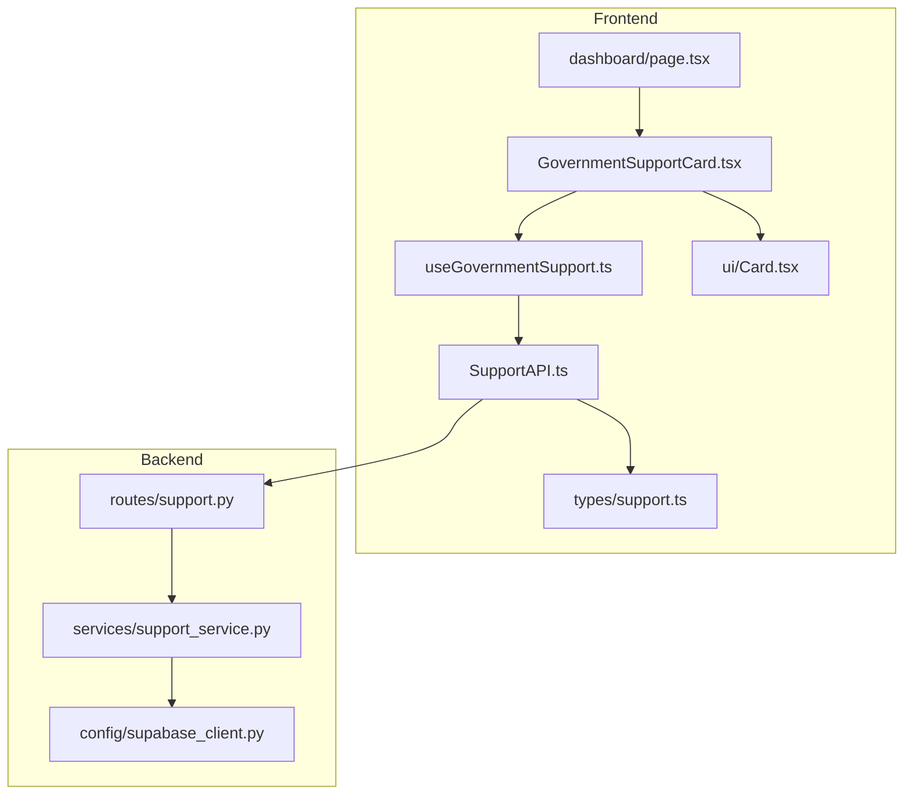
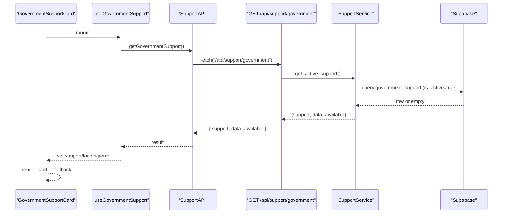
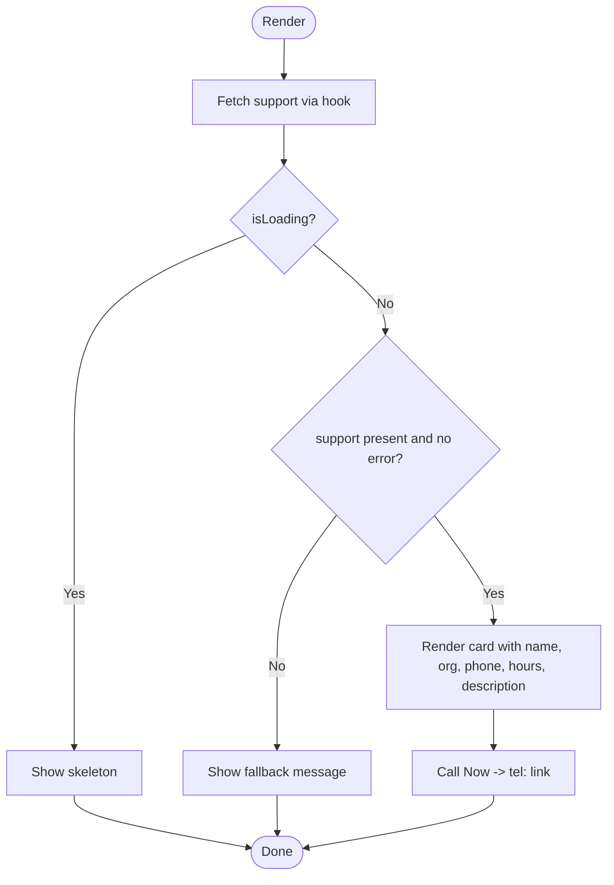
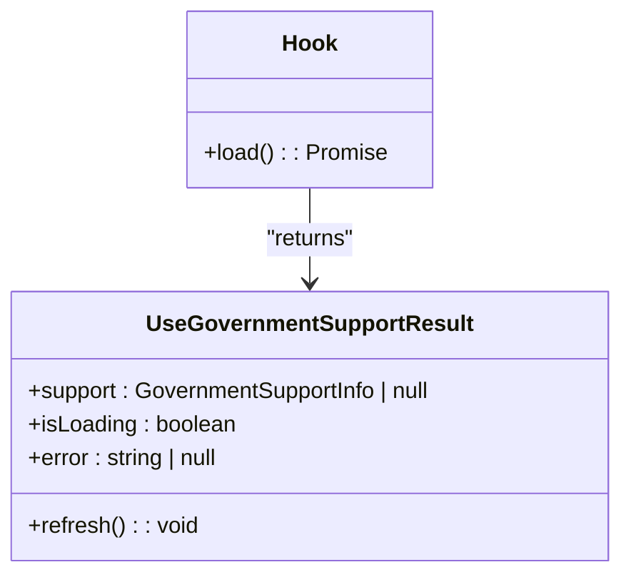
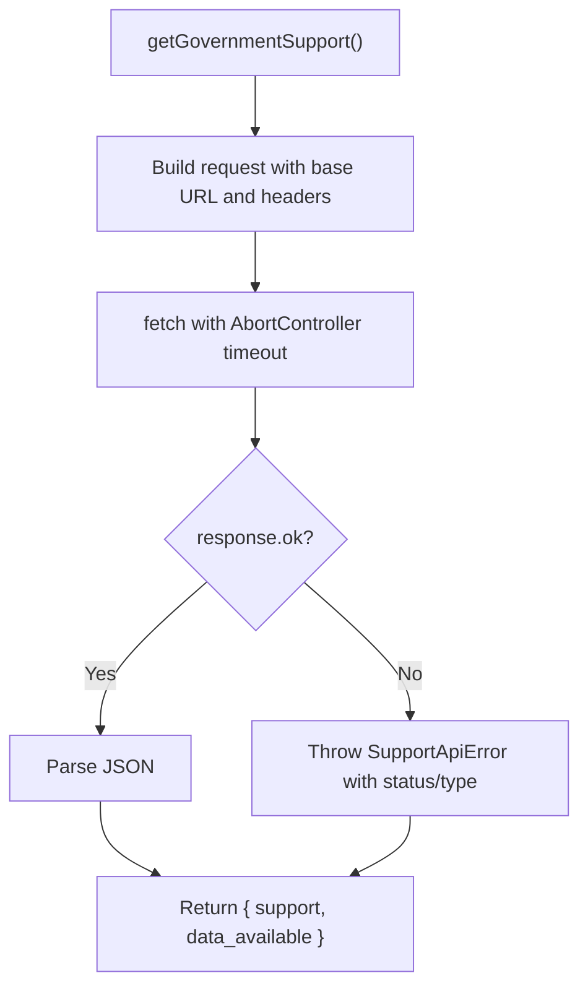
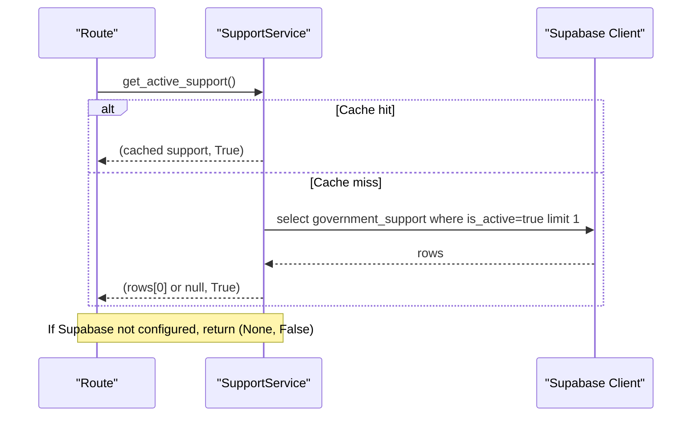
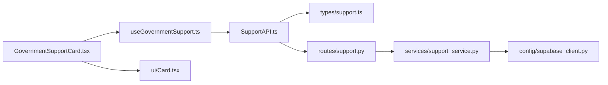

# Government Support Integration

<cite>
**Referenced Files in This Document**
- [GovernmentSupportCard.tsx](file://Frontend/greenflora/components/dashboard/GovernmentSupportCard.tsx)
- [useGovernmentSupport.ts](file://Frontend/greenflora/Hooks/useGovernmentSupport.ts)
- [SupportAPI.ts](file://Frontend/greenflora/services/SupportAPI.ts)
- [support.ts](file://Frontend/greenflora/types/support.ts)
- [page.tsx](file://Frontend/greenflora/app/dashboard/page.tsx)
- [Card.tsx](file://Frontend/greenflora/components/ui/Card.tsx)
- [support.py](file://Backend/routes/support.py)
- [support_service.py](file://Backend/services/support_service.py)
- [supabase_client.py](file://Backend/config/supabase_client.py)
</cite>

## Table of Contents
1. [Introduction](#introduction)
2. [Project Structure](#project-structure)
3. [Core Components](#core-components)
4. [Architecture Overview](#architecture-overview)
5. [Detailed Component Analysis](#detailed-component-analysis)
6. [Dependency Analysis](#dependency-analysis)
7. [Performance Considerations](#performance-considerations)
8. [Troubleshooting Guide](#troubleshooting-guide)
9. [Conclusion](#conclusion)

## Introduction
This document explains the government support component that provides farmers with direct access to official agricultural helpline information and resources. The feature centers on the GovernmentSupportCard, which displays the active government support service (name, organization, phone number, hours, and description) fetched from a Supabase table via a backend API. It integrates with the useGovernmentSupport hook for data fetching, error handling, and refresh behavior, ensuring a resilient user experience even when data is unavailable.

The component plays a critical role in the dashboard by surfacing emergency contacts and official resources prominently, enabling farmers to call helplines directly from their device dialer.

## Project Structure
The government support feature spans frontend components, hooks, services, types, and backend routes, services, and configuration:

- Frontend
  - UI card: GovernmentSupportCard
  - Data hook: useGovernmentSupport
  - API client: SupportApi.getGovernmentSupport
  - Types: GovernmentSupportInfo, GovernmentSupportResponse
  - Dashboard integration: page.tsx
  - Shared UI: Card
- Backend
  - Route: GET /api/support/government
  - Service: SupportService.get_active_support
  - Database client: Supabase client configuration

**Diagram sources**
- [GovernmentSupportCard.tsx:1-130](file://Frontend/greenflora/components/dashboard/GovernmentSupportCard.tsx#L1-L130)
- [useGovernmentSupport.ts:1-52](file://Frontend/greenflora/Hooks/useGovernmentSupport.ts#L1-L52)
- [SupportAPI.ts:1-102](file://Frontend/greenflora/services/SupportAPI.ts#L1-L102)
- [support.ts:1-30](file://Frontend/greenflora/types/support.ts#L1-L30)
- [page.tsx:1-238](file://Frontend/greenflora/app/dashboard/page.tsx#L1-L238)
- [Card.tsx:1-39](file://Frontend/greenflora/components/ui/Card.tsx#L1-L39)
- [support.py:1-57](file://Backend/routes/support.py#L1-L57)
- [support_service.py:1-95](file://Backend/services/support_service.py#L1-L95)
- [supabase_client.py:1-47](file://Backend/config/supabase_client.py#L1-L47)

**Section sources**
- [GovernmentSupportCard.tsx:1-130](file://Frontend/greenflora/components/dashboard/GovernmentSupportCard.tsx#L1-L130)
- [useGovernmentSupport.ts:1-52](file://Frontend/greenflora/Hooks/useGovernmentSupport.ts#L1-L52)
- [SupportAPI.ts:1-102](file://Frontend/greenflora/services/SupportAPI.ts#L1-L102)
- [support.ts:1-30](file://Frontend/greenflora/types/support.ts#L1-L30)
- [page.tsx:1-238](file://Frontend/greenflora/app/dashboard/page.tsx#L1-L238)
- [Card.tsx:1-39](file://Frontend/greenflora/components/ui/Card.tsx#L1-L39)
- [support.py:1-57](file://Backend/routes/support.py#L1-L57)
- [support_service.py:1-95](file://Backend/services/support_service.py#L1-L95)
- [supabase_client.py:1-47](file://Backend/config/supabase_client.py#L1-L47)

## Core Components
- GovernmentSupportCard: Renders a compact dashboard card showing the active government support service. It uses icons, a skeleton loader, and a fallback state to maintain a consistent design system while displaying real-time support info. It also exposes a “Call Now” action that opens the device dialer using a sanitized tel link.
- useGovernmentSupport: A React hook that fetches the active support record from the backend, manages loading and error states, and exposes a refresh function.
- SupportAPI.getGovernmentSupport: HTTP client that calls the backend endpoint with optional auth headers, timeout, and robust error classification.
- Types: Define the shape of the support record and API response, mirroring backend schemas.
- Dashboard integration: The card is embedded into the dashboard page as a dedicated section for quick access to official support.

**Section sources**
- [GovernmentSupportCard.tsx:1-130](file://Frontend/greenflora/components/dashboard/GovernmentSupportCard.tsx#L1-L130)
- [useGovernmentSupport.ts:1-52](file://Frontend/greenflora/Hooks/useGovernmentSupport.ts#L1-L52)
- [SupportAPI.ts:1-102](file://Frontend/greenflora/services/SupportAPI.ts#L1-L102)
- [support.ts:1-30](file://Frontend/greenflora/types/support.ts#L1-L30)
- [page.tsx:213-216](file://Frontend/greenflora/app/dashboard/page.tsx#L213-L216)

## Architecture Overview
The feature follows a layered architecture:
- Frontend UI layer renders the card and delegates data fetching to the hook.
- Hook coordinates request lifecycle and state.
- API client handles HTTP transport, timeouts, and error classification.
- Backend route validates and returns structured responses.
- Service reads from Supabase with caching and returns the active record or null if none exists.
- Supabase client config ensures stable connections and timeouts.

**Diagram sources**
- [GovernmentSupportCard.tsx:61-76](file://Frontend/greenflora/components/dashboard/GovernmentSupportCard.tsx#L61-L76)
- [useGovernmentSupport.ts:22-51](file://Frontend/greenflora/Hooks/useGovernmentSupport.ts#L22-L51)
- [SupportAPI.ts:45-101](file://Frontend/greenflora/services/SupportAPI.ts#L45-L101)
- [support.py:32-56](file://Backend/routes/support.py#L32-L56)
- [support_service.py:51-90](file://Backend/services/support_service.py#L51-L90)
- [supabase_client.py:16-47](file://Backend/config/supabase_client.py#L16-L47)

## Detailed Component Analysis

### GovernmentSupportCard
Responsibilities:
- Display the active government support service details (name, organization, phone, hours, description).
- Provide a “Call Now” action that opens the device dialer via a sanitized tel link.
- Show a skeleton during loading and a quiet fallback when data is missing or an error occurs.
- Maintain consistency with the dashboard’s design system through shared Card and styling tokens.

Key behaviors:
- Loading state: renders a shimmer placeholder.
- Error/missing data state: renders a minimal fallback message.
- Phone sanitization: strips non-digit characters except leading plus sign to ensure reliable dialing.
- Accessibility: includes aria-labels for call actions.

**Diagram sources**
- [GovernmentSupportCard.tsx:30-76](file://Frontend/greenflora/components/dashboard/GovernmentSupportCard.tsx#L30-L76)
- [GovernmentSupportCard.tsx:72-127](file://Frontend/greenflora/components/dashboard/GovernmentSupportCard.tsx#L72-L127)

**Section sources**
- [GovernmentSupportCard.tsx:1-130](file://Frontend/greenflora/components/dashboard/GovernmentSupportCard.tsx#L1-L130)
- [Card.tsx:1-39](file://Frontend/greenflora/components/ui/Card.tsx#L1-L39)

### useGovernmentSupport Hook
Responsibilities:
- Fetch the active government support record from the backend.
- Manage local state for support data, loading, and errors.
- Expose a refresh method to reload data on demand.

Error handling:
- On network or server errors, sets error state and clears support to trigger fallback rendering.
- Uses a consistent pattern aligned with other hooks in the app.

**Diagram sources**
- [useGovernmentSupport.ts:15-51](file://Frontend/greenflora/Hooks/useGovernmentSupport.ts#L15-L51)

**Section sources**
- [useGovernmentSupport.ts:1-52](file://Frontend/greenflora/Hooks/useGovernmentSupport.ts#L1-L52)

### SupportAPI Client
Responsibilities:
- Centralized HTTP client for government support endpoints.
- Adds optional Authorization header when available.
- Implements request timeout and classifies errors into categories (network, timeout, validation, server, unknown).
- Provides getGovernmentSupport() that calls the backend endpoint.

Error handling:
- Converts fetch failures and timeouts into typed exceptions with status codes.
- Ensures consistent error propagation to the hook and UI.

**Diagram sources**
- [SupportAPI.ts:45-101](file://Frontend/greenflora/services/SupportAPI.ts#L45-L101)

**Section sources**
- [SupportAPI.ts:1-102](file://Frontend/greenflora/services/SupportAPI.ts#L1-L102)

### Backend Route and Service
Route:
- GET /api/support/government returns the active government support record wrapped in a response schema.
- Handles database unavailability with 503 and unexpected errors with 500.

Service:
- Reads from Supabase table government_support where is_active is true.
- Caches the result in memory with a short TTL to reduce database load.
- Returns (support, data_available) tuple; support may be null if no active record exists.

Database client:
- Configures a stable HTTPX-backed Supabase client with explicit timeouts and connection limits.

**Diagram sources**
- [support.py:32-56](file://Backend/routes/support.py#L32-L56)
- [support_service.py:51-90](file://Backend/services/support_service.py#L51-L90)
- [supabase_client.py:16-47](file://Backend/config/supabase_client.py#L16-L47)

**Section sources**
- [support.py:1-57](file://Backend/routes/support.py#L1-L57)
- [support_service.py:1-95](file://Backend/services/support_service.py#L1-L95)
- [supabase_client.py:1-47](file://Backend/config/supabase_client.py#L1-L47)

### Dashboard Integration
The GovernmentSupportCard is embedded in the dashboard page under a dedicated section. It appears after key farm insights and assistant sections, ensuring farmers can quickly locate official support resources.

**Section sources**
- [page.tsx:213-216](file://Frontend/greenflora/app/dashboard/page.tsx#L213-L216)

## Dependency Analysis
- GovernmentSupportCard depends on:
  - useGovernmentSupport hook for data and state
  - ui/Card for consistent layout and styling
- useGovernmentSupport depends on:
  - SupportAPI.getGovernmentSupport
  - types/support.ts for type safety
- SupportAPI depends on:
  - Auth token retrieval (optional)
  - Environment-based base URL
- Backend route depends on:
  - SupportService for business logic
  - Supabase client for data access
- SupportService depends on:
  - Supabase client configuration
  - In-memory cache for performance

**Diagram sources**
- [GovernmentSupportCard.tsx:1-130](file://Frontend/greenflora/components/dashboard/GovernmentSupportCard.tsx#L1-L130)
- [useGovernmentSupport.ts:1-52](file://Frontend/greenflora/Hooks/useGovernmentSupport.ts#L1-L52)
- [SupportAPI.ts:1-102](file://Frontend/greenflora/services/SupportAPI.ts#L1-L102)
- [support.ts:1-30](file://Frontend/greenflora/types/support.ts#L1-L30)
- [support.py:1-57](file://Backend/routes/support.py#L1-L57)
- [support_service.py:1-95](file://Backend/services/support_service.py#L1-L95)
- [supabase_client.py:1-47](file://Backend/config/supabase_client.py#L1-L47)
- [Card.tsx:1-39](file://Frontend/greenflora/components/ui/Card.tsx#L1-L39)

**Section sources**
- [GovernmentSupportCard.tsx:1-130](file://Frontend/greenflora/components/dashboard/GovernmentSupportCard.tsx#L1-L130)
- [useGovernmentSupport.ts:1-52](file://Frontend/greenflora/Hooks/useGovernmentSupport.ts#L1-L52)
- [SupportAPI.ts:1-102](file://Frontend/greenflora/services/SupportAPI.ts#L1-L102)
- [support.ts:1-30](file://Frontend/greenflora/types/support.ts#L1-L30)
- [support.py:1-57](file://Backend/routes/support.py#L1-L57)
- [support_service.py:1-95](file://Backend/services/support_service.py#L1-L95)
- [supabase_client.py:1-47](file://Backend/config/supabase_client.py#L1-L47)
- [Card.tsx:1-39](file://Frontend/greenflora/components/ui/Card.tsx#L1-L39)

## Performance Considerations
- Frontend
  - Skeleton loading improves perceived performance during initial fetch.
  - Minimal re-renders due to localized state in the hook.
- Backend
  - In-memory caching with a 10-minute TTL reduces database queries for a rarely changing dataset.
  - Supabase client uses stable HTTP/1.1 with explicit timeouts and connection limits to avoid intermittent socket issues.
- Network
  - Request timeout prevents long hangs; errors are classified to guide retry strategies at higher layers if needed.

[No sources needed since this section provides general guidance]

## Troubleshooting Guide
Common scenarios and how the system responds:

- No active support record in database
  - Backend returns null support; frontend shows a quiet fallback message.
  - Ensure a record with is_active=true exists in the government_support table.

- Supabase not configured
  - Backend returns data_available=false; frontend falls back gracefully.
  - Verify environment variables for Supabase URL and service key.

- Network or timeout errors
  - Frontend sets error state and shows fallback; users can retry via refresh if exposed elsewhere.
  - Check connectivity and backend availability.

- Server errors (5xx)
  - Backend logs and returns appropriate HTTP status; frontend treats as error and shows fallback.
  - Investigate backend logs for database connectivity or query issues.

- Phone dialer not triggering
  - Ensure phone numbers are stored without extraneous formatting; the client sanitizes to digits and plus sign.
  - Test on mobile devices where tel: links are supported.

**Section sources**
- [GovernmentSupportCard.tsx:47-76](file://Frontend/greenflora/components/dashboard/GovernmentSupportCard.tsx#L47-L76)
- [useGovernmentSupport.ts:27-43](file://Frontend/greenflora/Hooks/useGovernmentSupport.ts#L27-L43)
- [SupportAPI.ts:37-92](file://Frontend/greenflora/services/SupportAPI.ts#L37-L92)
- [support_service.py:62-90](file://Backend/services/support_service.py#L62-L90)
- [support.py:45-56](file://Backend/routes/support.py#L45-L56)

## Conclusion
The GovernmentSupportCard delivers a reliable, accessible entry point for farmers to contact official agricultural helplines. By integrating with useGovernmentSupport and a robust backend pipeline, it ensures accurate, up-to-date support information is always visible, with graceful fallbacks when data is unavailable. The implementation adheres to the dashboard’s design system and emphasizes usability, accessibility, and resilience across varying network and data conditions.

[No sources needed since this section summarizes without analyzing specific files]