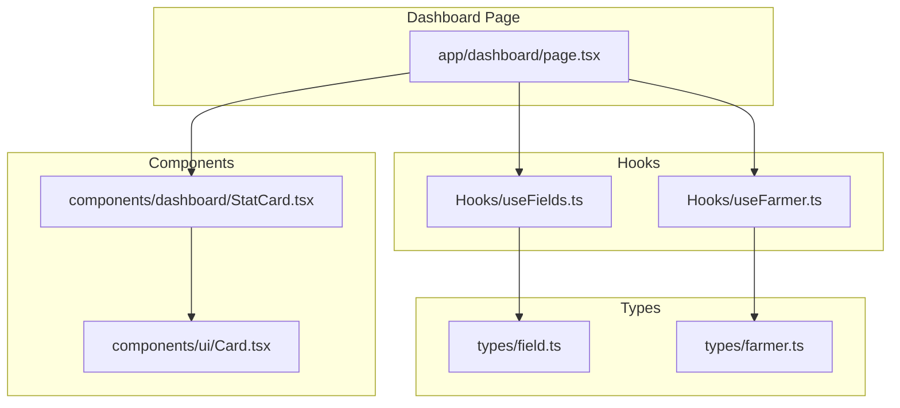
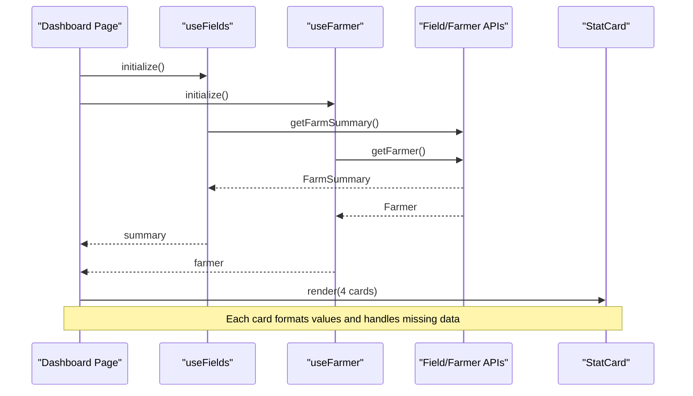
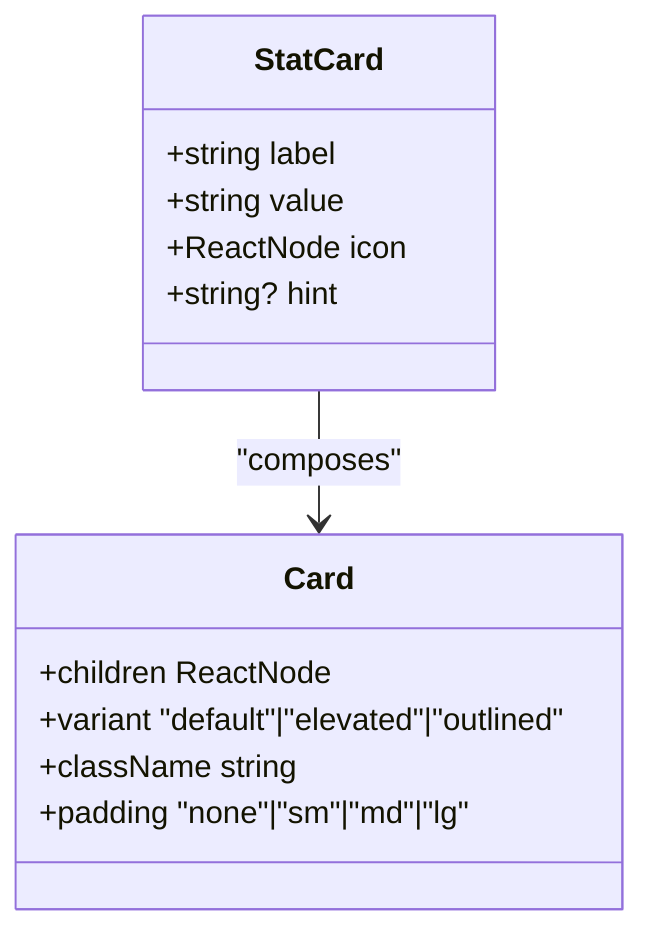
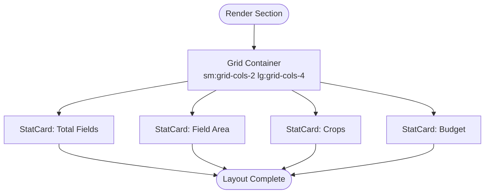
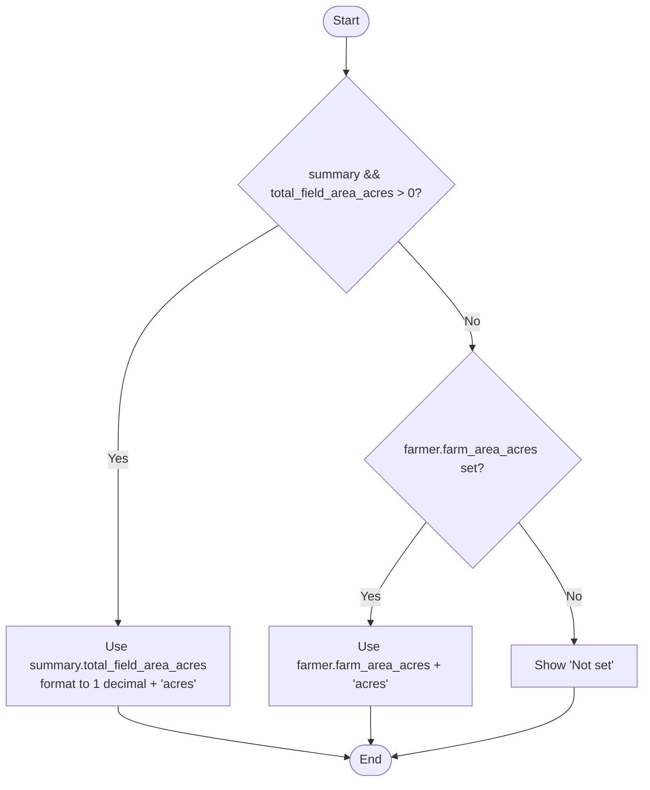
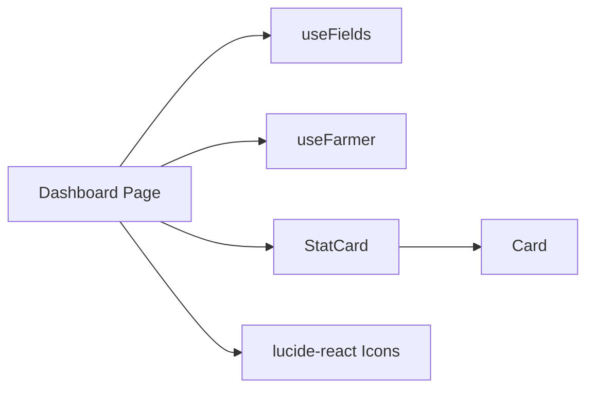

# Stat Cards & Farm Summary

<cite>
**Referenced Files in This Document**
- [StatCard.tsx](file://Frontend/greenflora/components/dashboard/StatCard.tsx)
- [page.tsx](file://Frontend/greenflora/app/dashboard/page.tsx)
- [useFields.ts](file://Frontend/greenflora/Hooks/useFields.ts)
- [useFarmer.ts](file://Frontend/greenflora/Hooks/useFarmer.ts)
- [field.ts](file://Frontend/greenflora/types/field.ts)
- [farmer.ts](file://Frontend/greenflora/types/farmer.ts)
- [Card.tsx](file://Frontend/greenflora/components/ui/Card.tsx)
</cite>

## Table of Contents
1. [Introduction](#introduction)
2. [Project Structure](#project-structure)
3. [Core Components](#core-components)
4. [Architecture Overview](#architecture-overview)
5. [Detailed Component Analysis](#detailed-component-analysis)
6. [Dependency Analysis](#dependency-analysis)
7. [Performance Considerations](#performance-considerations)
8. [Troubleshooting Guide](#troubleshooting-guide)
9. [Conclusion](#conclusion)

## Introduction
This document explains the farm summary stat cards displayed on the dashboard. It focuses on how the StatCard component renders a consistent label-value-icon pattern, how responsive Tailwind CSS classes arrange the cards into a grid, and how data from the fields summary and farmer profile is bound to four key metrics: Total Fields, Field Area, Crops count, and Budget. It also covers formatting logic for area measurements (acres), currency display (PKR), conditional rendering for "Not set" states, icon usage via lucide-react, number formatting with toLocaleString(), and integration with the responsive grid layout system.

## Project Structure
The stat cards are rendered on the dashboard page using reusable UI primitives and hooks that fetch farm data. The structure relevant to this feature includes:
- Dashboard page that composes the stat cards and binds data
- StatCard component that encapsulates the visual pattern
- Hooks that load farm summary and farmer profile
- Type definitions that describe the shape of farm summary and farmer data
- Base Card component used by StatCard

**Diagram sources**
- [page.tsx:150-210](file://Frontend/greenflora/app/dashboard/page.tsx#L150-L210)
- [StatCard.tsx:1-31](file://Frontend/greenflora/components/dashboard/StatCard.tsx#L1-L31)
- [Card.tsx:1-39](file://Frontend/greenflora/components/ui/Card.tsx#L1-L39)
- [useFields.ts:1-159](file://Frontend/greenflora/Hooks/useFields.ts#L1-L159)
- [useFarmer.ts:1-88](file://Frontend/greenflora/Hooks/useFarmer.ts#L1-L88)
- [field.ts:65-77](file://Frontend/greenflora/types/field.ts#L65-L77)
- [farmer.ts:22-40](file://Frontend/greenflora/types/farmer.ts#L22-L40)

**Section sources**
- [page.tsx:150-210](file://Frontend/greenflora/app/dashboard/page.tsx#L150-L210)
- [StatCard.tsx:1-31](file://Frontend/greenflora/components/dashboard/StatCard.tsx#L1-L31)
- [Card.tsx:1-39](file://Frontend/greenflora/components/ui/Card.tsx#L1-L39)
- [useFields.ts:1-159](file://Frontend/greenflora/Hooks/useFields.ts#L1-L159)
- [useFarmer.ts:1-88](file://Frontend/greenflora/Hooks/useFarmer.ts#L1-L88)
- [field.ts:65-77](file://Frontend/greenflora/types/field.ts#L65-L77)
- [farmer.ts:22-40](file://Frontend/greenflora/types/farmer.ts#L22-L40)

## Core Components
- StatCard: A presentational card that accepts label, value, icon, and optional hint. It uses a base Card with small padding and applies consistent typography and spacing. Icons are placed in a fixed-size container with a subtle background color.
- Card: A generic container providing rounded corners, shadow/border variants, and configurable padding. StatCard composes it with a small padding and an animation class.

Key responsibilities:
- StatCard: Render a consistent metric tile with icon, label, value, and optional hint.
- Card: Provide shared styling and layout for content containers.

**Section sources**
- [StatCard.tsx:4-29](file://Frontend/greenflora/components/dashboard/StatCard.tsx#L4-L29)
- [Card.tsx:5-36](file://Frontend/greenflora/components/ui/Card.tsx#L5-L36)

## Architecture Overview
The dashboard page orchestrates data fetching and rendering:
- useFields loads the farm summary including total_fields, total_field_area_acres, crop_distribution, and location metadata.
- useFarmer loads the farmer profile including budget_pkr and fallback values like farm_area_acres and current_crop.
- The dashboard composes four StatCards, each binding to either summary or farmer data, applying formatting and fallbacks.

**Diagram sources**
- [page.tsx:52-93](file://Frontend/greenflora/app/dashboard/page.tsx#L52-L93)
- [useFields.ts:51-72](file://Frontend/greenflora/Hooks/useFields.ts#L51-L72)
- [useFarmer.ts:34-55](file://Frontend/greenflora/Hooks/useFarmer.ts#L34-L55)
- [StatCard.tsx:11-29](file://Frontend/greenflora/components/dashboard/StatCard.tsx#L11-L29)

## Detailed Component Analysis

### StatCard Implementation
- Props: label, value, icon, hint.
- Layout: Uses flexbox to align icon and text; icon sits in a fixed 10x10 container with a primary tinted background; label is small and muted; value is prominent and truncated if too long; hint is conditionally shown below the value.
- Styling: Relies on Tailwind utility classes for spacing, typography, colors, and truncation. Animation class provides a fade-in effect.

**Diagram sources**
- [StatCard.tsx:4-29](file://Frontend/greenflora/components/dashboard/StatCard.tsx#L4-L29)
- [Card.tsx:5-36](file://Frontend/greenflora/components/ui/Card.tsx#L5-L36)

**Section sources**
- [StatCard.tsx:4-29](file://Frontend/greenflora/components/dashboard/StatCard.tsx#L4-L29)
- [Card.tsx:5-36](file://Frontend/greenflora/components/ui/Card.tsx#L5-L36)

### Responsive Grid Layout
- The dashboard uses a responsive grid: sm:grid-cols-2 lg:grid-cols-4. On small screens, cards stack two per row; on large screens, they expand to four per row.
- Each StatCard is placed inside this grid, ensuring consistent spacing and alignment across devices.

**Diagram sources**
- [page.tsx:171-210](file://Frontend/greenflora/app/dashboard/page.tsx#L171-L210)

**Section sources**
- [page.tsx:171-210](file://Frontend/greenflora/app/dashboard/page.tsx#L171-L210)

### Data Binding and Formatting Logic

#### Total Fields
- Source: summary.total_fields from FarmSummary.
- Display: If summary exists, show the numeric count; otherwise show a placeholder dash.
- Icon: Layout grid icon from lucide-react.

**Section sources**
- [page.tsx:172-176](file://Frontend/greenflora/app/dashboard/page.tsx#L172-L176)
- [field.ts:74-75](file://Frontend/greenflora/types/field.ts#L74-L75)

#### Field Area
- Source priority:
  - Prefer summary.total_field_area_acres when available and greater than zero.
  - Fallback to farmer.farm_area_acres if set.
  - Otherwise show "Not set".
- Formatting: Displays acres with one decimal place when derived from summary; uses raw acres from farmer profile when falling back.
- Icon: Ruler icon from lucide-react.

**Diagram sources**
- [page.tsx:177-187](file://Frontend/greenflora/app/dashboard/page.tsx#L177-L187)
- [field.ts:75](file://Frontend/greenflora/types/field.ts#L75)
- [farmer.ts:30](file://Frontend/greenflora/types/farmer.ts#L30)

**Section sources**
- [page.tsx:177-187](file://Frontend/greenflora/app/dashboard/page.tsx#L177-L187)
- [field.ts:75](file://Frontend/greenflora/types/field.ts#L75)
- [farmer.ts:30](file://Frontend/greenflora/types/farmer.ts#L30)

#### Crops Count
- Source: Number of distinct crops in summary.crop_distribution keys.
- Pluralization: Adds "s" when there is more than one crop type.
- Fallback: If no summary, shows farmer.current_crop or "Not set".
- Icon: Sprout icon from lucide-react.

**Section sources**
- [page.tsx:188-200](file://Frontend/greenflora/app/dashboard/page.tsx#L188-L200)
- [field.ts:76](file://Frontend/greenflora/types/field.ts#L76)
- [farmer.ts:34](file://Frontend/greenflora/types/farmer.ts#L34)

#### Budget
- Source: farmer.budget_pkr.
- Formatting: Displays PKR with thousands separators using toLocaleString().
- Fallback: Shows "Not set" when budget is not provided.
- Icon: Wallet icon from lucide-react.

**Section sources**
- [page.tsx:201-209](file://Frontend/greenflora/app/dashboard/page.tsx#L201-L209)
- [farmer.ts:36](file://Frontend/greenflora/types/farmer.ts#L36)

### Icons and Visual Consistency
- Icons are imported from lucide-react and passed directly as React nodes to StatCard.
- StatCard renders icons inside a fixed-size container with a light primary background and primary-colored text, ensuring visual consistency across all metric types.

**Section sources**
- [page.tsx:22-30](file://Frontend/greenflora/app/dashboard/page.tsx#L22-L30)
- [StatCard.tsx:14-17](file://Frontend/greenflora/components/dashboard/StatCard.tsx#L14-L17)

### Loading, Error, and Empty States
- While loading, skeleton placeholders are shown for the stat cards and other sections.
- Errors are surfaced via an error state component with a retry action.
- When no farmer profile exists, an empty state prompts the user to complete their profile.

**Section sources**
- [page.tsx:98-117](file://Frontend/greenflora/app/dashboard/page.tsx#L98-L117)
- [page.tsx:220-234](file://Frontend/greenflora/app/dashboard/page.tsx#L220-L234)

## Dependency Analysis
- Dashboard page depends on:
  - useFields for farm summary data (total_fields, total_field_area_acres, crop_distribution).
  - useFarmer for farmer profile data (budget_pkr, farm_area_acres, current_crop).
  - StatCard for rendering each metric consistently.
  - lucide-react icons for visual cues.
- StatCard depends on:
  - Card for shared container styling.
  - Tailwind CSS utilities for layout and typography.

**Diagram sources**
- [page.tsx:22-30](file://Frontend/greenflora/app/dashboard/page.tsx#L22-L30)
- [page.tsx:45-49](file://Frontend/greenflora/app/dashboard/page.tsx#L45-L49)
- [StatCard.tsx:1-3](file://Frontend/greenflora/components/dashboard/StatCard.tsx#L1-L3)
- [Card.tsx:1-3](file://Frontend/greenflora/components/ui/Card.tsx#L1-L3)

**Section sources**
- [page.tsx:22-49](file://Frontend/greenflora/app/dashboard/page.tsx#L22-L49)
- [StatCard.tsx:1-3](file://Frontend/greenflora/components/dashboard/StatCard.tsx#L1-L3)
- [Card.tsx:1-3](file://Frontend/greenflora/components/ui/Card.tsx#L1-L3)

## Performance Considerations
- Data fetching is centralized in hooks, reducing duplicate requests and simplifying state management.
- Conditional rendering avoids unnecessary computations when data is unavailable.
- Using toLocaleString() for currency formatting ensures correct localization and efficient number formatting.
- Responsive grid minimizes reflows by leveraging CSS grid breakpoints.

[No sources needed since this section provides general guidance]

## Troubleshooting Guide
- Missing farm summary:
  - If summary is null, the dashboard falls back to farmer profile fields where applicable. Ensure the fields hook successfully loads data and check network requests.
- No budget set:
  - Budget displays "Not set" when farmer.budget_pkr is null. Update the farmer profile to include budget information.
- Area not set:
  - Field Area shows "Not set" when neither summary nor farmer profile provides area. Add field areas or update the farmer profile’s farm_area_acres.
- Loading or error states:
  - Skeleton placeholders appear during loading; errors surface with a retry action. Verify API connectivity and authentication status.

**Section sources**
- [page.tsx:98-117](file://Frontend/greenflora/app/dashboard/page.tsx#L98-L117)
- [page.tsx:177-209](file://Frontend/greenflora/app/dashboard/page.tsx#L177-L209)
- [useFields.ts:57-72](file://Frontend/greenflora/Hooks/useFields.ts#L57-L72)
- [useFarmer.ts:40-55](file://Frontend/greenflora/Hooks/useFarmer.ts#L40-L55)

## Conclusion
The stat cards provide a clear, consistent overview of farm metrics through a reusable StatCard component and a responsive grid layout. Data binding leverages the fields summary and farmer profile, with robust fallbacks and formatting for area and currency. Icons from lucide-react enhance readability, while Tailwind CSS ensures a cohesive and adaptive design across screen sizes.

[No sources needed since this section summarizes without analyzing specific files]