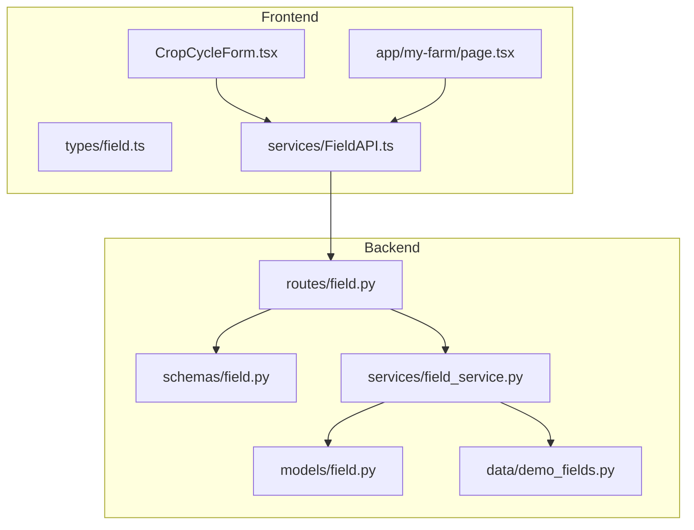
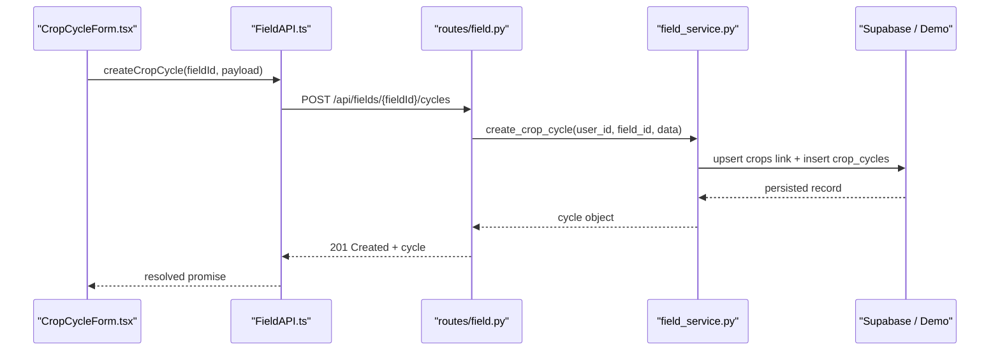
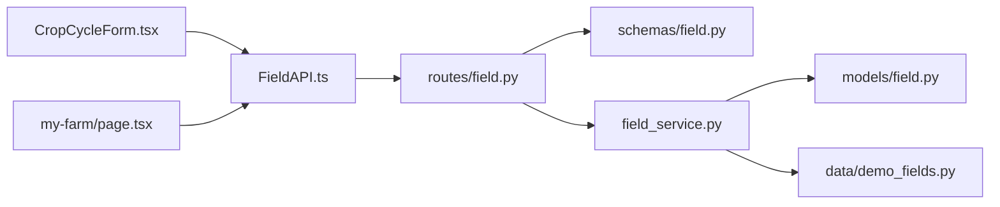
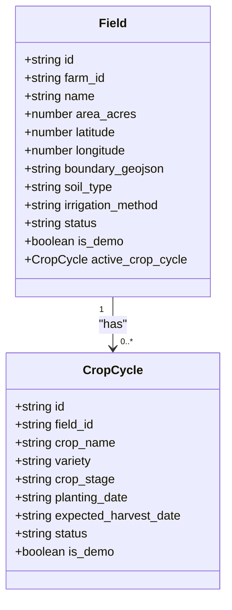
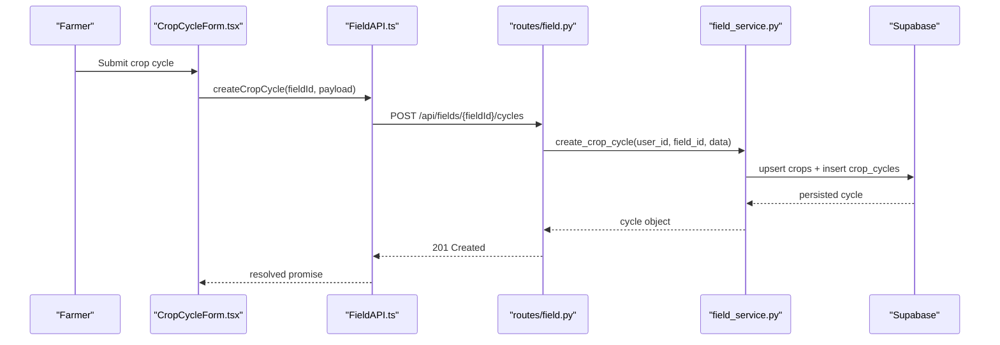

# Crop Cycle Management

<cite>
**Referenced Files in This Document**
- [CropCycleForm.tsx](file://Frontend/greenflora/components/fields/CropCycleForm.tsx)
- [field.ts](file://Frontend/greenflora/types/field.ts)
- [FieldAPI.ts](file://Frontend/greenflora/services/FieldAPI.ts)
- [field.py (schemas)](file://Backend/schemas/field.py)
- [field.py (models)](file://Backend/models/field.py)
- [field.py (routes)](file://Backend/routes/field.py)
- [field_service.py](file://Backend/services/field_service.py)
- [demo_fields.py](file://Backend/data/demo_fields.py)
- [page.tsx (my-farm)](file://Frontend/greenflora/app/my-farm/page.tsx)
</cite>

## Table of Contents
1. [Introduction](#introduction)
2. [Project Structure](#project-structure)
3. [Core Components](#core-components)
4. [Architecture Overview](#architecture-overview)
5. [Detailed Component Analysis](#detailed-component-analysis)
6. [Dependency Analysis](#dependency-analysis)
7. [Performance Considerations](#performance-considerations)
8. [Troubleshooting Guide](#troubleshooting-guide)
9. [Conclusion](#conclusion)
10. [Appendices](#appendices)

## Introduction
This document explains the crop cycle management functionality that enables farmers to plan, track, and manage crop rotations across fields. It focuses on the CropCycleForm component for scheduling planting dates, tracking harvests, and monitoring growth stages; the data model for crop cycles including planting schedules, expected yields via lifecycle stages, and status transitions; and the backend integration for persistence and synchronization with Supabase. It also provides guidance on extending crop types, customizing growth parameters, and automating workflows around crop planning.

## Project Structure
The crop cycle feature spans frontend components, services, and backend routes, schemas, and services:
- Frontend:
  - Form UI for creating/editing crop cycles
  - Type definitions aligned with backend schemas
  - API client for field and crop cycle endpoints
  - Page orchestration for adding cycles to fields
- Backend:
  - Pydantic schemas for validation
  - Internal models for domain entities
  - Routes exposing REST endpoints
  - Service layer implementing business logic, ownership checks, demo mode, and database operations

**Diagram sources**
- [CropCycleForm.tsx:1-169](file://Frontend/greenflora/components/fields/CropCycleForm.tsx#L1-L169)
- [field.ts:1-78](file://Frontend/greenflora/types/field.ts#L1-L78)
- [FieldAPI.ts:1-171](file://Frontend/greenflora/services/FieldAPI.ts#L1-L171)
- [field.py (routes):1-287](file://Backend/routes/field.py#L1-L287)
- [field.py (schemas):1-195](file://Backend/schemas/field.py#L1-L195)
- [field.py (models):1-53](file://Backend/models/field.py#L1-L53)
- [field_service.py:1-788](file://Backend/services/field_service.py#L1-L788)
- [demo_fields.py:1-149](file://Backend/data/demo_fields.py#L1-L149)

**Section sources**
- [CropCycleForm.tsx:1-169](file://Frontend/greenflora/components/fields/CropCycleForm.tsx#L1-L169)
- [field.ts:1-78](file://Frontend/greenflora/types/field.ts#L1-L78)
- [FieldAPI.ts:1-171](file://Frontend/greenflora/services/FieldAPI.ts#L1-L171)
- [field.py (routes):1-287](file://Backend/routes/field.py#L1-L287)
- [field.py (schemas):1-195](file://Backend/schemas/field.py#L1-L195)
- [field.py (models):1-53](file://Backend/models/field.py#L1-L53)
- [field_service.py:1-788](file://Backend/services/field_service.py#L1-L788)
- [demo_fields.py:1-149](file://Backend/data/demo_fields.py#L1-L149)

## Core Components
- CropCycleForm: A React form that captures crop name, variety, stage, planting date, expected harvest date, and status. It supports common crops via a datalist and validates required fields at the UI level before submission.
- Types: TypeScript interfaces mirror backend schemas for type safety across the stack.
- FieldAPI: Centralized HTTP client with timeouts, auth header injection, error classification, and typed methods for fields and crop cycles.
- Backend Schemas: Pydantic models enforce allowed statuses, length constraints, and optional fields for robust API contracts.
- Backend Models: Domain models define core entities for fields and crop cycles.
- Routes: Thin FastAPI endpoints that validate input, call service layer, and return structured responses.
- Service Layer: Implements business logic including ownership verification, demo mode behavior, linking crop names to a crops table, and database translation between API keys and DB columns.

**Section sources**
- [CropCycleForm.tsx:1-169](file://Frontend/greenflora/components/fields/CropCycleForm.tsx#L1-L169)
- [field.ts:1-78](file://Frontend/greenflora/types/field.ts#L1-L78)
- [FieldAPI.ts:1-171](file://Frontend/greenflora/services/FieldAPI.ts#L1-L171)
- [field.py (schemas):1-195](file://Backend/schemas/field.py#L1-L195)
- [field.py (models):1-53](file://Backend/models/field.py#L1-L53)
- [field.py (routes):1-287](file://Backend/routes/field.py#L1-L287)
- [field_service.py:1-788](file://Backend/services/field_service.py#L1-L788)

## Architecture Overview
The system follows a layered architecture:
- UI layer (React) renders forms and orchestrates user actions.
- API client handles network requests, authentication, and error handling.
- Backend routes receive validated payloads and delegate to service layer.
- Service layer enforces business rules, ownership, and integrates with Supabase or demo data.
- Data layer persists fields and crop cycles and links crop names to a crops table.

**Diagram sources**
- [CropCycleForm.tsx:60-70](file://Frontend/greenflora/components/fields/CropCycleForm.tsx#L60-L70)
- [FieldAPI.ts:148-156](file://Frontend/greenflora/services/FieldAPI.ts#L148-L156)
- [field.py (routes):213-237](file://Backend/routes/field.py#L213-L237)
- [field_service.py:417-442](file://Backend/services/field_service.py#L417-L442)
- [field_service.py:694-717](file://Backend/services/field_service.py#L694-L717)

## Detailed Component Analysis

### CropCycleForm Component
Responsibilities:
- Captures crop details: crop name, variety, stage, planting date, expected harvest date, and status.
- Provides a datalist of common crops to streamline selection.
- Validates required inputs at the UI level and forwards normalized data to onSave.

Data flow:
- On submit, the form constructs a payload matching the CropCycleCreate type and calls onSave, which is typically bound to a mutation handler in the parent page.

Validation highlights:
- Required crop name ensures meaningful entries.
- Optional fields allow flexible recording of variety, stage, and dates.
- Status defaults to active and can be changed to harvested or cancelled.

Extensibility:
- Add more common crops by extending the datalist options.
- Integrate additional fields like notes or yield estimates by updating the form state and payload.

**Section sources**
- [CropCycleForm.tsx:22-41](file://Frontend/greenflora/components/fields/CropCycleForm.tsx#L22-L41)
- [CropCycleForm.tsx:43-70](file://Frontend/greenflora/components/fields/CropCycleForm.tsx#L43-L70)
- [CropCycleForm.tsx:72-168](file://Frontend/greenflora/components/fields/CropCycleForm.tsx#L72-L168)

### Data Model for Crop Cycles
Types and schemas align across frontend and backend:
- Frontend types define shapes for CropCycle, CropCycleCreate, and related entities.
- Backend schemas enforce validation rules and allowed statuses.
- Backend models capture domain entities for fields and crop cycles.

Key attributes:
- id, field_id, crop_name, variety, crop_stage, planting_date, expected_harvest_date, status, is_demo.

Lifecycle states:
- active: currently growing or managed.
- harvested: completed harvest.
- cancelled: aborted cycle.

Notes:
- The service layer enriches responses with active crop cycles per field and resolves crop_name from the crops table when needed.

**Section sources**
- [field.ts:8-63](file://Frontend/greenflora/types/field.ts#L8-L63)
- [field.py (schemas):117-168](file://Backend/schemas/field.py#L117-L168)
- [field.py (models):38-53](file://Backend/models/field.py#L38-L53)

### Backend Integration and Persistence
Endpoints:
- List/create/update/delete crop cycles per field.
- Farm summary includes fields and crop distribution.

Ownership and security:
- Routes resolve user context and enforce farm ownership via service layer.
- Demo mode bypasses auth and uses in-memory data.

Database interactions:
- Service translates API keys to DB columns and vice versa.
- Links crop cycles to a crops table via upsert logic to maintain consistent crop metadata.
- Returns enriched data including active crop cycles for each field.

Demo mode:
- Provides seeded fields and cycles for development and testing without a live database.

**Section sources**
- [field.py (routes):189-287](file://Backend/routes/field.py#L189-L287)
- [field_service.py:111-220](file://Backend/services/field_service.py#L111-L220)
- [field_service.py:327-395](file://Backend/services/field_service.py#L327-L395)
- [field_service.py:401-473](file://Backend/services/field_service.py#L401-L473)
- [field_service.py:570-645](file://Backend/services/field_service.py#L570-L645)
- [field_service.py:651-783](file://Backend/services/field_service.py#L651-L783)
- [demo_fields.py:20-133](file://Backend/data/demo_fields.py#L20-L133)

### Workflow Automation for Crop Planning
Integration points:
- The my-farm page allows adding a crop cycle immediately after creating a field, streamlining workflow.
- The form’s datalist accelerates crop selection and reduces errors.

Automation opportunities:
- Pre-populate crop stage based on planting season and crop type.
- Auto-calculate expected harvest date using crop-specific duration heuristics.
- Trigger reminders or tasks when planting dates approach or harvest windows open.

**Section sources**
- [page.tsx (my-farm):177-194](file://Frontend/greenflora/app/my-farm/page.tsx#L177-L194)
- [CropCycleForm.tsx:82-98](file://Frontend/greenflora/components/fields/CropCycleForm.tsx#L82-L98)

### Business Logic for Crop Rotation Patterns and Seasonal Considerations
Current implementation:
- No explicit rotation rules are enforced in the service layer; cycles are linked to fields with status and dates.
- Farm summary aggregates crop distribution by active cycles, enabling visual insights for rotation planning.

Recommendations:
- Add rotation policy checks in the service layer to prevent consecutive plantings of the same crop on the same field within a short period.
- Incorporate seasonal constraints by validating planting dates against known seasons for specific crops.
- Use crop_distribution in the farm summary to guide balanced planting strategies.

**Section sources**
- [field_service.py:479-545](file://Backend/services/field_service.py#L479-L545)
- [field.py (schemas):175-195](file://Backend/schemas/field.py#L175-L195)

### Yield Estimation Algorithms
Current implementation:
- No built-in yield estimation algorithm exists in the codebase.
- Expected harvest date is recorded but not used for yield calculations.

Recommendations:
- Extend the data model to include expected_yield_per_acre and actual_yield fields.
- Implement an estimation function in the service layer that combines crop type, variety, soil type, irrigation method, and historical yields.
- Surface estimated yields in the UI alongside growth stage and harvest dates.

**Section sources**
- [field.py (models):38-53](file://Backend/models/field.py#L38-L53)
- [field.py (schemas):117-168](file://Backend/schemas/field.py#L117-L168)

### Date Calculations for Growth Projections
Current implementation:
- Planting and expected harvest dates are captured but not computed automatically.

Recommendations:
- Add a helper to compute expected harvest date based on crop-specific growth duration.
- Provide UI feedback showing days until harvest and current growth stage progression.
- Validate that expected harvest date is after planting date.

**Section sources**
- [CropCycleForm.tsx:130-146](file://Frontend/greenflora/components/fields/CropCycleForm.tsx#L130-L146)

### Extending Crop Types and Customizing Growth Parameters
Guidance:
- Extend the datalist in CropCycleForm to include additional crops relevant to your region.
- Enrich backend schemas and models with new fields such as growth_duration_days, preferred_soil_types, and irrigation_preferences.
- Update service layer to support new parameters in upsert logic and validation.

**Section sources**
- [CropCycleForm.tsx:28-41](file://Frontend/greenflora/components/fields/CropCycleForm.tsx#L28-L41)
- [field.py (schemas):117-168](file://Backend/schemas/field.py#L117-L168)
- [field.py (models):38-53](file://Backend/models/field.py#L38-L53)

## Dependency Analysis
The crop cycle feature depends on several modules:
- Frontend dependencies:
  - CropCycleForm depends on UI primitives and types.
  - FieldAPI depends on authentication and request utilities.
  - my-farm page composes forms and handlers.
- Backend dependencies:
  - Routes depend on schemas and service layer.
  - Service layer depends on settings, Supabase client, and demo data.
  - Schemas and models define contracts and domain entities.

**Diagram sources**
- [CropCycleForm.tsx:1-169](file://Frontend/greenflora/components/fields/CropCycleForm.tsx#L1-L169)
- [FieldAPI.ts:1-171](file://Frontend/greenflora/services/FieldAPI.ts#L1-L171)
- [field.py (routes):1-287](file://Backend/routes/field.py#L1-L287)
- [field.py (schemas):1-195](file://Backend/schemas/field.py#L1-L195)
- [field.py (models):1-53](file://Backend/models/field.py#L1-L53)
- [field_service.py:1-788](file://Backend/services/field_service.py#L1-L788)
- [demo_fields.py:1-149](file://Backend/data/demo_fields.py#L1-L149)

**Section sources**
- [CropCycleForm.tsx:1-169](file://Frontend/greenflora/components/fields/CropCycleForm.tsx#L1-L169)
- [FieldAPI.ts:1-171](file://Frontend/greenflora/services/FieldAPI.ts#L1-L171)
- [field.py (routes):1-287](file://Backend/routes/field.py#L1-L287)
- [field.py (schemas):1-195](file://Backend/schemas/field.py#L1-L195)
- [field.py (models):1-53](file://Backend/models/field.py#L1-L53)
- [field_service.py:1-788](file://Backend/services/field_service.py#L1-L788)
- [demo_fields.py:1-149](file://Backend/data/demo_fields.py#L1-L149)

## Performance Considerations
- Network efficiency:
  - FieldAPI uses timeouts and abort controllers to avoid hanging requests.
  - Batch operations are not implemented; consider grouping updates if needed.
- Database queries:
  - Service layer performs targeted queries and joins only where necessary.
  - Active cycle enrichment is done per field; ensure indexes exist on field_id and status for performance.
- Demo mode:
  - In-memory data avoids DB overhead during development.

[No sources needed since this section provides general guidance]

## Troubleshooting Guide
Common issues and resolutions:
- Authentication failures:
  - Ensure bearer token is present in requests; FieldAPI injects Authorization header when available.
- Validation errors:
  - Backend schemas enforce allowed statuses and field lengths; check error messages returned by routes.
- Ownership errors:
  - Service layer verifies field and cycle ownership; ensure the user belongs to the correct farm.
- Demo vs live mode:
  - Demo mode returns seeded data; verify settings to switch modes appropriately.

Error handling patterns:
- Routes catch exceptions and return appropriate HTTP status codes.
- FieldAPI classifies errors into network, timeout, validation, server, and unknown categories for better UX.

**Section sources**
- [FieldAPI.ts:24-46](file://Frontend/greenflora/services/FieldAPI.ts#L24-L46)
- [FieldAPI.ts:48-101](file://Frontend/greenflora/services/FieldAPI.ts#L48-L101)
- [field.py (routes):73-89](file://Backend/routes/field.py#L73-L89)
- [field.py (routes):114-135](file://Backend/routes/field.py#L114-L135)
- [field.py (routes):138-164](file://Backend/routes/field.py#L138-L164)
- [field.py (routes):167-182](file://Backend/routes/field.py#L167-L182)
- [field.py (routes):189-210](file://Backend/routes/field.py#L189-L210)
- [field.py (routes):213-237](file://Backend/routes/field.py#L213-L237)
- [field.py (routes):240-266](file://Backend/routes/field.py#L240-L266)
- [field.py (routes):269-287](file://Backend/routes/field.py#L269-L287)

## Conclusion
The crop cycle management feature provides a robust foundation for planning and tracking agricultural activities. The CropCycleForm simplifies data entry, while the backend ensures secure, validated, and persistent storage with clear separation of concerns. Extensibility points exist for adding rotation policies, yield estimation, and automated growth projections. With careful enhancements to validation, business logic, and UI feedback, the system can evolve into a comprehensive crop planning tool.

[No sources needed since this section summarizes without analyzing specific files]

## Appendices

### API Endpoints Summary
- GET /api/farm-summary: Farm overview with fields and crop distribution.
- GET /api/fields: List all fields for the farmer’s farm.
- POST /api/fields: Create a new field.
- PUT /api/fields/{field_id}: Update an existing field.
- DELETE /api/fields/{field_id}: Delete a field and its cycles.
- GET /api/fields/{field_id}/cycles: List crop cycles for a field.
- POST /api/fields/{field_id}/cycles: Create a crop cycle.
- PUT /api/cycles/{cycle_id}: Update a crop cycle.
- DELETE /api/cycles/{cycle_id}: Delete a crop cycle.

**Section sources**
- [field.py (routes):73-287](file://Backend/routes/field.py#L73-L287)

### Data Flow Diagrams

#### Class Relationships

**Diagram sources**
- [field.ts:8-35](file://Frontend/greenflora/types/field.ts#L8-L35)
- [field.py (models):18-53](file://Backend/models/field.py#L18-L53)

#### Sequence: Creating a Crop Cycle

**Diagram sources**
- [CropCycleForm.tsx:60-70](file://Frontend/greenflora/components/fields/CropCycleForm.tsx#L60-L70)
- [FieldAPI.ts:148-156](file://Frontend/greenflora/services/FieldAPI.ts#L148-L156)
- [field.py (routes):213-237](file://Backend/routes/field.py#L213-L237)
- [field_service.py:417-442](file://Backend/services/field_service.py#L417-L442)
- [field_service.py:694-717](file://Backend/services/field_service.py#L694-L717)