# Farm Management Module

<cite>
**Referenced Files in This Document**
- [useFields.ts](file://Frontend/greenflora/Hooks/useFields.ts)
- [FieldAPI.ts](file://Frontend/greenflora/services/FieldAPI.ts)
- [field.ts](file://Frontend/greenflora/types/field.ts)
- [FarmLandView.tsx](file://Frontend/greenflora/components/farm/FarmLandView.tsx)
- [FieldCard.tsx](file://Frontend/greenflora/components/fields/FieldCard.tsx)
- [FieldForm.tsx](file://Frontend/greenflora/components/fields/FieldForm.tsx)
- [CropCycleForm.tsx](file://Frontend/greenflora/components/fields/CropCycleForm.tsx)
- [page.tsx (My Farm)](file://Frontend/greenflora/app/my-farm/page.tsx)
- [field.py (routes)](file://Backend/routes/field.py)
- [field_service.py](file://Backend/services/field_service.py)
- [field.py (models)](file://Backend/models/field.py)
</cite>

## Table of Contents
1. Introduction
2. Project Structure
3. Core Components
4. Architecture Overview
5. Detailed Component Analysis
6. Dependency Analysis
7. Performance Considerations
8. Troubleshooting Guide
9. Conclusion

## Introduction
This document explains the Farm Management module that provides comprehensive farm oversight: field visualization, crop lifecycle tracking, and land area management. It focuses on the page architecture for My Farm, the interactive mapping experience, and the components that manage fields and crop cycles. It also details data modeling for field geometries and crop workflows, state management via hooks, API operations for CRUD, and responsive design patterns used across the UI.

## Project Structure
The module spans both frontend and backend layers:
- Frontend pages orchestrate user flows and compose reusable components.
- Reusable components render field lists, forms, and a static farm canvas.
- A React hook centralizes state and mutations for fields and crop cycles.
- An API service encapsulates HTTP requests with error handling and timeouts.
- Backend routes expose REST endpoints for fields and crop cycles.
- A service layer implements business logic, ownership checks, and database interactions.
- Models define core entities for fields and crop cycles.

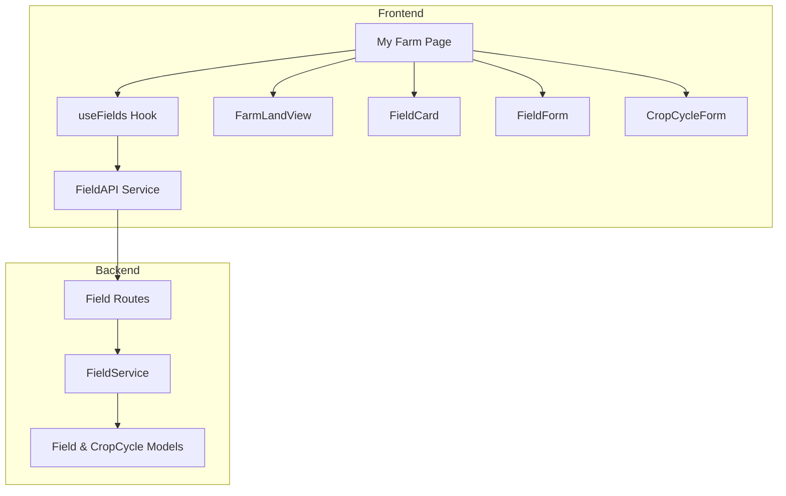

**Diagram sources**
- [page.tsx (My Farm):14-60](file://Frontend/greenflora/app/my-farm/page.tsx#L14-L60)
- [useFields.ts:51-158](file://Frontend/greenflora/Hooks/useFields.ts#L51-L158)
- [FieldAPI.ts:48-171](file://Frontend/greenflora/services/FieldAPI.ts#L48-L171)
- [field.py (routes):73-287](file://Backend/routes/field.py#L73-L287)
- [field_service.py:89-788](file://Backend/services/field_service.py#L89-L788)
- [field.py (models):18-53](file://Backend/models/field.py#L18-L53)

**Section sources**
- [page.tsx (My Farm):14-60](file://Frontend/greenflora/app/my-farm/page.tsx#L14-L60)
- [useFields.ts:51-158](file://Frontend/greenflora/Hooks/useFields.ts#L51-L158)
- [FieldAPI.ts:48-171](file://Frontend/greenflora/services/FieldAPI.ts#L48-L171)
- [field.py (routes):73-287](file://Backend/routes/field.py#L73-L287)
- [field_service.py:89-788](file://Backend/services/field_service.py#L89-L788)
- [field.py (models):18-53](file://Backend/models/field.py#L18-L53)

## Core Components
- My Farm page: orchestrates location onboarding, field/cycle management, and renders the farm canvas and map.
- FarmLandView: static proportional visualization of fields and available land.
- FieldCard: displays individual field info, status, and active crop cycle; supports selection and actions.
- FieldForm: creates/edits fields with optional initial crop name and area budget warnings.
- CropCycleForm: manages crop cycle creation/editing including stage and dates.
- useFields hook: loads farm summary and exposes CRUD actions for fields and crop cycles with loading/error states.
- FieldAPI: typed HTTP client with timeouts, auth headers, and error classification.

Key responsibilities:
- Data modeling: Field and CropCycle types align with backend models and include geometry support via boundary_geojson.
- State management: Centralized in useFields to avoid prop drilling and ensure consistent refresh after mutations.
- User experience: Two-stage onboarding (location picker then static farm view), responsive layouts, and clear feedback.

**Section sources**
- [page.tsx (My Farm):64-694](file://Frontend/greenflora/app/my-farm/page.tsx#L64-L694)
- [FarmLandView.tsx:78-345](file://Frontend/greenflora/components/farm/FarmLandView.tsx#L78-L345)
- [FieldCard.tsx:22-166](file://Frontend/greenflora/components/fields/FieldCard.tsx#L22-L166)
- [FieldForm.tsx:18-230](file://Frontend/greenflora/components/fields/FieldForm.tsx#L18-L230)
- [CropCycleForm.tsx:15-169](file://Frontend/greenflora/components/fields/CropCycleForm.tsx#L15-L169)
- [useFields.ts:25-158](file://Frontend/greenflora/Hooks/useFields.ts#L25-L158)
- [FieldAPI.ts:24-171](file://Frontend/greenflora/services/FieldAPI.ts#L24-L171)
- [field.ts:8-78](file://Frontend/greenflora/types/field.ts#L8-L78)

## Architecture Overview
The module follows a layered architecture:
- Presentation: My Farm page composes UI components and manages local mode/state.
- State: useFields hook encapsulates fetching and mutations, refreshing summary after changes.
- Integration: FieldAPI handles network requests, authentication, timeouts, and errors.
- API: FastAPI routes validate payloads and delegate to service.
- Business Logic: FieldService enforces ownership, maps DB columns, links crops, and computes summaries.
- Data: Supabase tables for farms, fields, crop_cycles, and crops; demo mode supported.

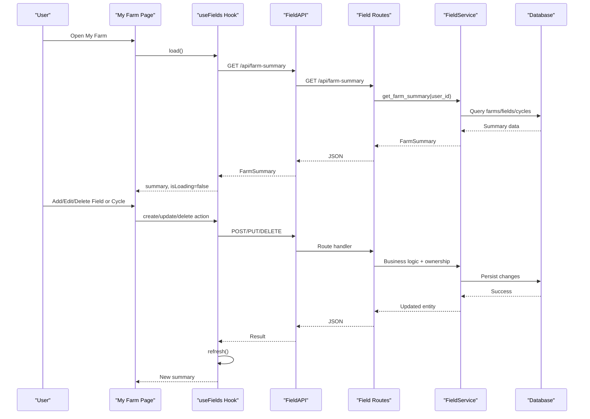

**Diagram sources**
- [useFields.ts:57-158](file://Frontend/greenflora/Hooks/useFields.ts#L57-L158)
- [FieldAPI.ts:48-171](file://Frontend/greenflora/services/FieldAPI.ts#L48-L171)
- [field.py (routes):73-287](file://Backend/routes/field.py#L73-L287)
- [field_service.py:479-545](file://Backend/services/field_service.py#L479-L545)

## Detailed Component Analysis

### My Farm Page
- Two-stage UX: first set farm location using an interactive map; then show static farm canvas plus field list and detail panel.
- Computes remaining acres from farmer profile and summary totals to guide field creation.
- Integrates with Leaflet-based map only during location selection; otherwise uses static FarmLandView.
- Manages modes for add/edit field and add crop cycle, and shows success/error messages.

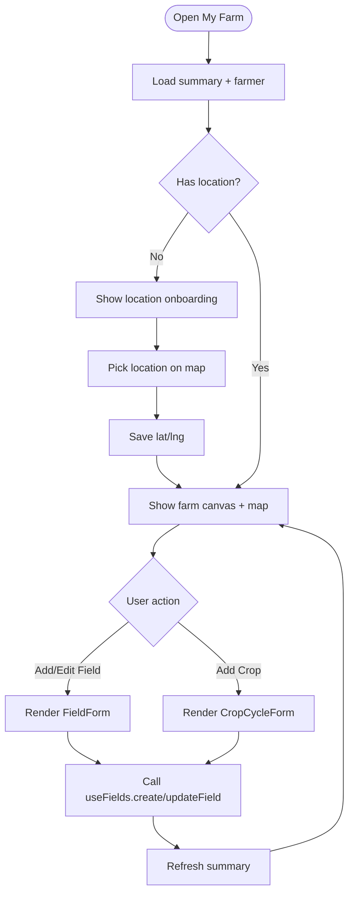

**Diagram sources**
- [page.tsx (My Farm):64-694](file://Frontend/greenflora/app/my-farm/page.tsx#L64-L694)

**Section sources**
- [page.tsx (My Farm):64-694](file://Frontend/greenflora/app/my-farm/page.tsx#L64-L694)

### FarmLandView
- Renders a proportional “farm canvas” where each segment represents a field sized by its area relative to total farm area.
- Shows crop emoji/icon, name, and acreage per segment; includes unallocated land when total farm area is known.
- Supports compact mode for dashboard usage and full mode with stats bar and legend.
- Uses a color palette to differentiate segments and scales typography based on segment size.

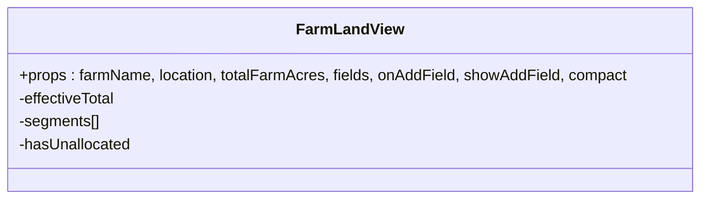

**Diagram sources**
- [FarmLandView.tsx:78-345](file://Frontend/greenflora/components/farm/FarmLandView.tsx#L78-L345)

**Section sources**
- [FarmLandView.tsx:78-345](file://Frontend/greenflora/components/farm/FarmLandView.tsx#L78-L345)

### FieldCard
- Displays field name, status badge, area, irrigation method, soil type, and active crop cycle details.
- Provides selection highlighting and hover-revealed edit/delete actions.
- Uses index-based color accent to visually differentiate cards.

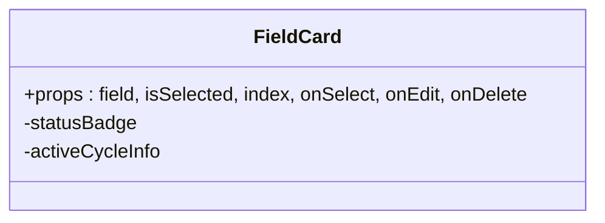

**Diagram sources**
- [FieldCard.tsx:22-166](file://Frontend/greenflora/components/fields/FieldCard.tsx#L22-L166)

**Section sources**
- [FieldCard.tsx:22-166](file://Frontend/greenflora/components/fields/FieldCard.tsx#L22-L166)

### FieldForm
- Creates or edits fields with validation and area budget warnings.
- Auto-generates coordinates near farm center for new fields if not provided.
- Optional crop name triggers immediate creation of an active crop cycle after field creation at the page level.

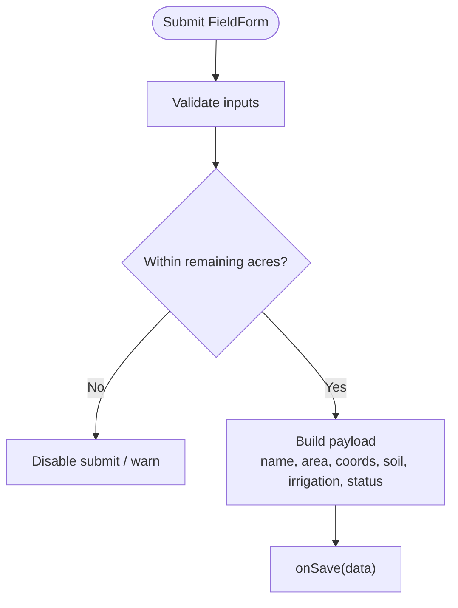

**Diagram sources**
- [FieldForm.tsx:86-108](file://Frontend/greenflora/components/fields/FieldForm.tsx#L86-L108)

**Section sources**
- [FieldForm.tsx:18-230](file://Frontend/greenflora/components/fields/FieldForm.tsx#L18-L230)

### CropCycleForm
- Manages crop cycle creation/editing with fields for crop name, variety, stage, planting date, expected harvest, and status.
- Emits a structured payload aligned with backend expectations.

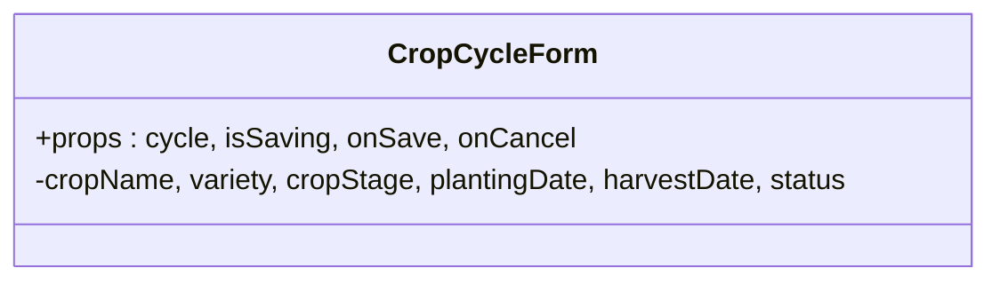

**Diagram sources**
- [CropCycleForm.tsx:15-169](file://Frontend/greenflora/components/fields/CropCycleForm.tsx#L15-L169)

**Section sources**
- [CropCycleForm.tsx:15-169](file://Frontend/greenflora/components/fields/CropCycleForm.tsx#L15-L169)

### useFields Hook
- Loads farm summary once on mount and exposes refresh.
- Wraps mutations with loading state and always refreshes summary after successful changes.
- Provides typed methods for creating/updating/deleting fields and crop cycles.

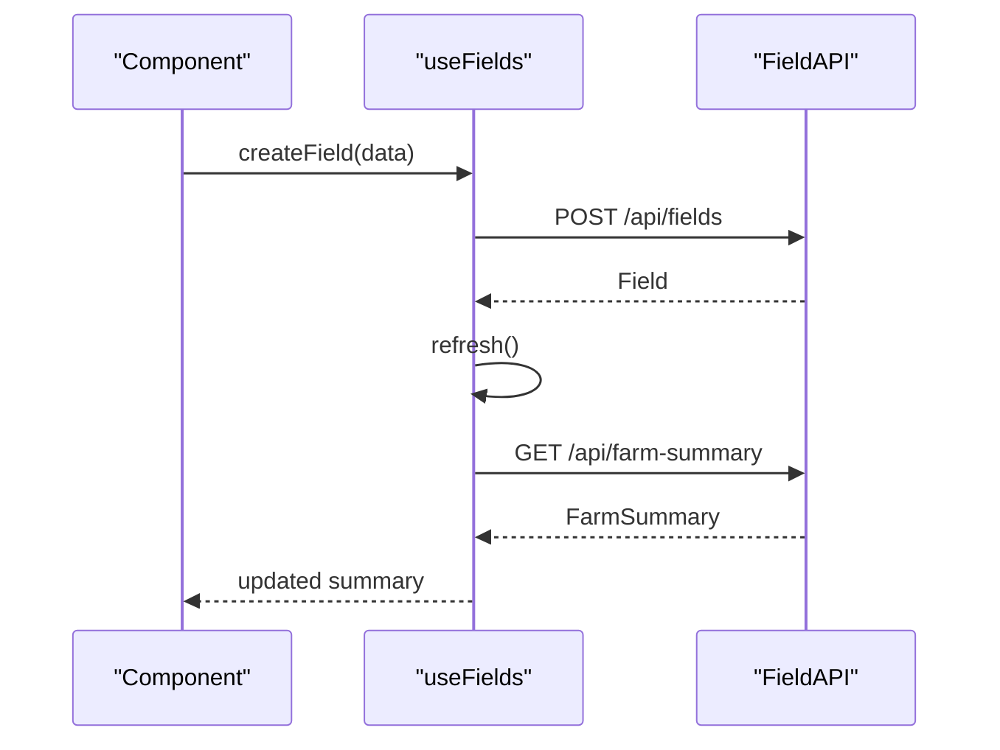

**Diagram sources**
- [useFields.ts:57-158](file://Frontend/greenflora/Hooks/useFields.ts#L57-L158)
- [FieldAPI.ts:107-138](file://Frontend/greenflora/services/FieldAPI.ts#L107-L138)

**Section sources**
- [useFields.ts:51-158](file://Frontend/greenflora/Hooks/useFields.ts#L51-L158)

### FieldAPI
- Centralized fetch wrapper with timeout, authorization header injection, and typed error classification.
- Exposes functions for farm summary, fields CRUD, and crop cycles CRUD.

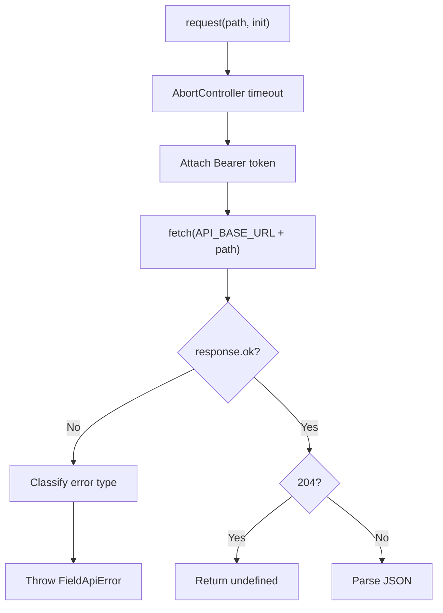

**Diagram sources**
- [FieldAPI.ts:48-101](file://Frontend/greenflora/services/FieldAPI.ts#L48-L101)

**Section sources**
- [FieldAPI.ts:24-171](file://Frontend/greenflora/services/FieldAPI.ts#L24-L171)

### Backend: Routes, Service, Models
- Routes define REST endpoints for farm summary, fields, and crop cycles with input validation and error handling.
- Service enforces farm ownership, translates between API keys and DB columns, links crops, and computes summaries.
- Models define Field and CropCycle structures used throughout the backend.

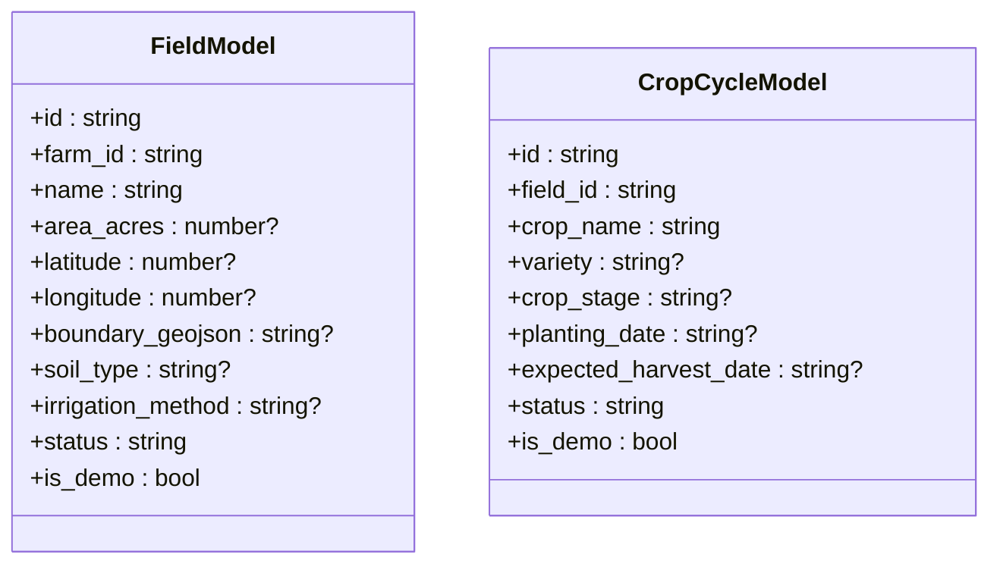

**Diagram sources**
- [field.py (models):18-53](file://Backend/models/field.py#L18-L53)

**Section sources**
- [field.py (routes):73-287](file://Backend/routes/field.py#L73-L287)
- [field_service.py:89-788](file://Backend/services/field_service.py#L89-L788)
- [field.py (models):18-53](file://Backend/models/field.py#L18-L53)

## Dependency Analysis
- The My Farm page depends on useFields for data and mutations, and composes FarmLandView, FieldCard, FieldForm, and CropCycleForm.
- useFields depends on FieldAPI for all network calls.
- FieldAPI depends on environment configuration for base URL and on authentication utilities for tokens.
- Backend routes depend on FieldService for business logic and on settings for demo mode.
- FieldService depends on Supabase client and optionally demo data providers.

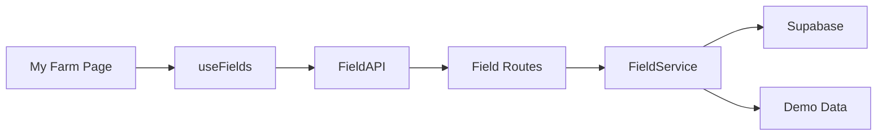

**Diagram sources**
- [page.tsx (My Farm):14-60](file://Frontend/greenflora/app/my-farm/page.tsx#L14-L60)
- [useFields.ts:51-158](file://Frontend/greenflora/Hooks/useFields.ts#L51-L158)
- [FieldAPI.ts:48-171](file://Frontend/greenflora/services/FieldAPI.ts#L48-L171)
- [field.py (routes):73-287](file://Backend/routes/field.py#L73-L287)
- [field_service.py:89-788](file://Backend/services/field_service.py#L89-L788)

**Section sources**
- [page.tsx (My Farm):14-60](file://Frontend/greenflora/app/my-farm/page.tsx#L14-L60)
- [useFields.ts:51-158](file://Frontend/greenflora/Hooks/useFields.ts#L51-L158)
- [FieldAPI.ts:48-171](file://Frontend/greenflora/services/FieldAPI.ts#L48-L171)
- [field.py (routes):73-287](file://Backend/routes/field.py#L73-L287)
- [field_service.py:89-788](file://Backend/services/field_service.py#L89-L788)

## Performance Considerations
- Single summary fetch on mount reduces redundant requests; mutations trigger targeted refresh.
- Static FarmLandView avoids heavy map rendering until needed; interactive map is loaded conditionally.
- API timeout prevents hanging requests; error classification enables better UX responses.
- Backend service batches queries and caches demo data to minimize overhead in development.

[No sources needed since this section provides general guidance]

## Troubleshooting Guide
Common issues and resolutions:
- Network errors or timeouts: FieldAPI classifies errors; surface friendly messages and retry options in UI.
- Unauthorized access: Backend requires Bearer token in live mode; ensure authentication is configured.
- Field not found or ownership mismatch: Service validates ownership; verify user context and IDs.
- Over-allocated land: FieldForm disables submit and warns when entered area exceeds remaining acres.
- Missing location: My Farm page guides users through location onboarding before enabling full features.

**Section sources**
- [FieldAPI.ts:40-101](file://Frontend/greenflora/services/FieldAPI.ts#L40-L101)
- [field.py (routes):51-67](file://Backend/routes/field.py#L51-L67)
- [field_service.py:111-220](file://Backend/services/field_service.py#L111-L220)
- [FieldForm.tsx:80-108](file://Frontend/greenflora/components/fields/FieldForm.tsx#L80-L108)
- [page.tsx (My Farm):119-166](file://Frontend/greenflora/app/my-farm/page.tsx#L119-L166)

## Conclusion
The Farm Management module delivers a cohesive experience for managing agricultural land:
- Clear two-stage onboarding ensures location awareness before field planning.
- Static farm canvas offers quick visual insights into field distribution and available land.
- Robust state management via useFields simplifies data flow and keeps UI consistent.
- Well-defined data models and backend services enforce ownership and maintain data integrity.
- Responsive components and thoughtful UX patterns make land management accessible and efficient.

[No sources needed since this section summarizes without analyzing specific files]