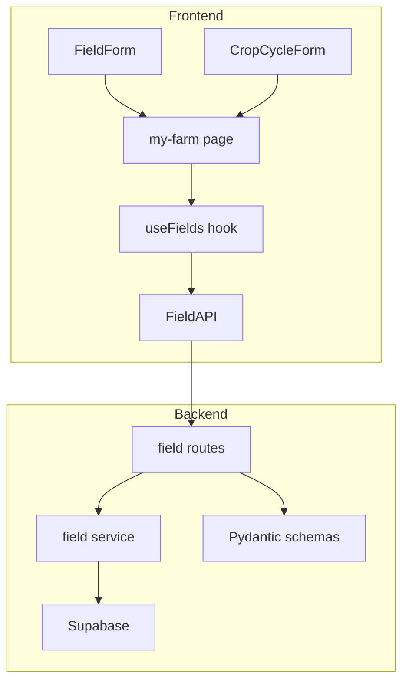
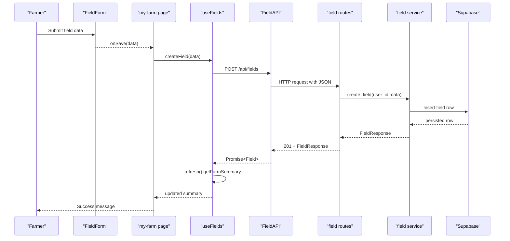
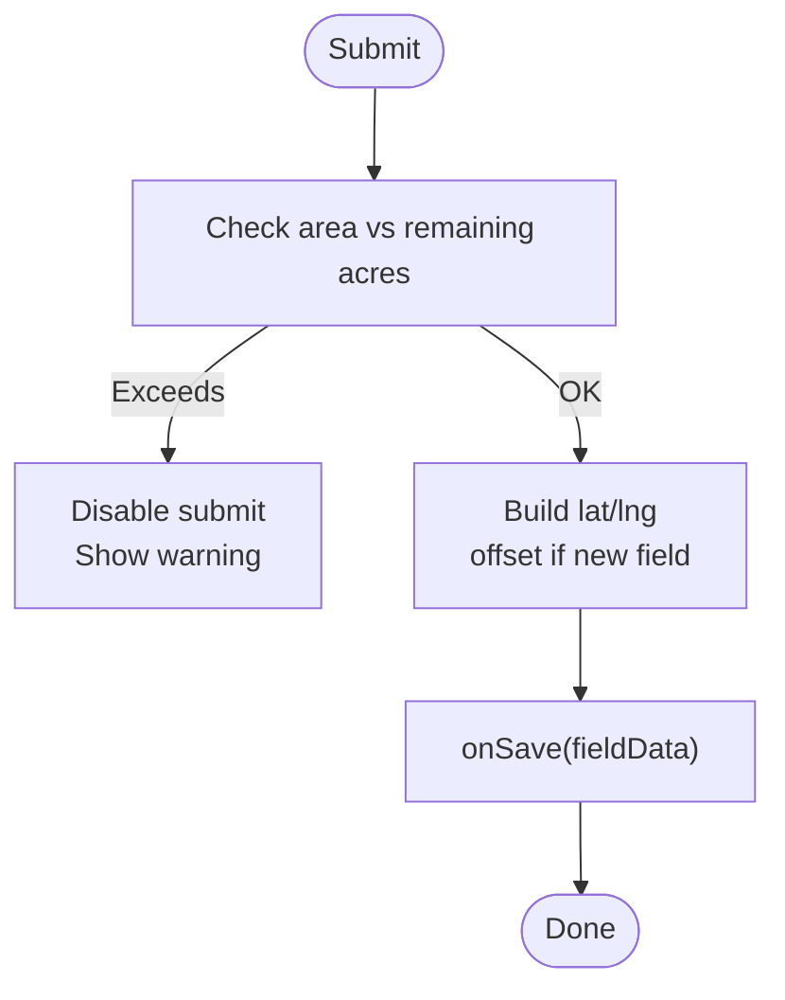
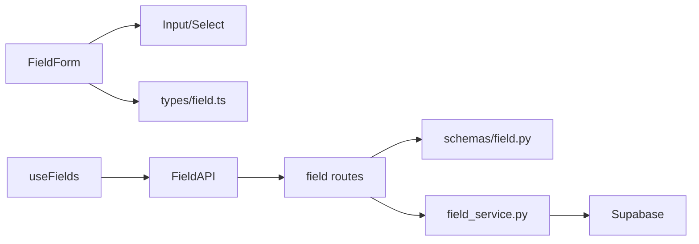

# Field Data Forms and CRUD Operations

<cite>
**Referenced Files in This Document**
- [FieldForm.tsx](file://Frontend/greenflora/components/fields/FieldForm.tsx)
- [CropCycleForm.tsx](file://Frontend/greenflora/components/fields/CropCycleForm.tsx)
- [FieldCard.tsx](file://Frontend/greenflora/components/fields/FieldCard.tsx)
- [Input.tsx](file://Frontend/greenflora/components/ui/Input.tsx)
- [Select.tsx](file://Frontend/greenflora/components/ui/Select.tsx)
- [useFields.ts](file://Frontend/greenflora/Hooks/useFields.ts)
- [FieldAPI.ts](file://Frontend/greenflora/services/FieldAPI.ts)
- [field.ts (types)](file://Frontend/greenflora/types/field.ts)
- [my-farm/page.tsx](file://Frontend/greenflora/app/my-farm/page.tsx)
- [field.py (routes)](file://Backend/routes/field.py)
- [field.py (schemas)](file://Backend/schemas/field.py)
- [field_service.py](file://Backend/services/field_service.py)
- [field.py (models)](file://Backend/models/field.py)
</cite>

## Table of Contents
1. [Introduction](#introduction)
2. [Project Structure](#project-structure)
3. [Core Components](#core-components)
4. [Architecture Overview](#architecture-overview)
5. [Detailed Component Analysis](#detailed-component-analysis)
6. [Dependency Analysis](#dependency-analysis)
7. [Performance Considerations](#performance-considerations)
8. [Troubleshooting Guide](#troubleshooting-guide)
9. [Conclusion](#conclusion)
10. [Appendices](#appendices)

## Introduction
This document explains the field data forms and CRUD operations across the frontend and backend. It focuses on:
- The FieldForm component for creating, editing, and deleting fields with area budgeting, soil type selection, irrigation setup, and optional crop creation.
- The FieldAPI service layer that performs HTTP requests to backend endpoints for fields and crop cycles.
- Backend routes, Pydantic schemas, and service logic that validate inputs, enforce ownership, and persist data.
- Validation patterns, error handling strategies, user feedback, coordinate handling, and guidance for offline synchronization, accessibility, mobile-friendly input, and export.

## Project Structure
The field management feature spans a React frontend and a FastAPI backend:
- Frontend:
  - Form components: FieldForm, CropCycleForm
  - UI primitives: Input, Select
  - Hook: useFields for stateful CRUD orchestration
  - API client: FieldAPI
  - Page: my-farm orchestrates UX flows and messages
- Backend:
  - Routes: /api/... endpoints for fields and crop cycles
  - Schemas: Pydantic models for request/response validation
  - Service: business logic, demo mode, Supabase integration
  - Models: internal data structures

**Diagram sources**
- [FieldForm.tsx:1-230](file://Frontend/greenflora/components/fields/FieldForm.tsx#L1-L230)
- [CropCycleForm.tsx:1-169](file://Frontend/greenflora/components/fields/CropCycleForm.tsx#L1-L169)
- [useFields.ts:1-159](file://Frontend/greenflora/Hooks/useFields.ts#L1-L159)
- [FieldAPI.ts:1-171](file://Frontend/greenflora/services/FieldAPI.ts#L1-L171)
- [field.py (routes):1-287](file://Backend/routes/field.py#L1-L287)
- [field_service.py:1-788](file://Backend/services/field_service.py#L1-L788)
- [field.py (schemas):1-195](file://Backend/schemas/field.py#L1-L195)

**Section sources**
- [FieldForm.tsx:1-230](file://Frontend/greenflora/components/fields/FieldForm.tsx#L1-L230)
- [CropCycleForm.tsx:1-169](file://Frontend/greenflora/components/fields/CropCycleForm.tsx#L1-L169)
- [useFields.ts:1-159](file://Frontend/greenflora/Hooks/useFields.ts#L1-L159)
- [FieldAPI.ts:1-171](file://Frontend/greenflora/services/FieldAPI.ts#L1-L171)
- [field.py (routes):1-287](file://Backend/routes/field.py#L1-L287)
- [field_service.py:1-788](file://Backend/services/field_service.py#L1-L788)
- [field.py (schemas):1-195](file://Backend/schemas/field.py#L1-L195)

## Core Components
- FieldForm: Farmer-friendly form for creating/editing fields with name, area, optional crop name, soil type, irrigation method, and status. Auto-generates coordinates near farm center when creating new fields. Warns if entered area exceeds remaining farm area.
- CropCycleForm: Creates or edits crop cycles with crop name, variety, stage, planting/harvest dates, and status.
- useFields: Centralized hook that loads farm summary and exposes create/update/delete actions for fields and crop cycles, refreshing local state after mutations.
- FieldAPI: HTTP client with typed methods for fields and crop cycles, including timeouts, auth headers, and structured errors.
- Backend routes: Thin FastAPI endpoints validating payloads via Pydantic schemas and delegating to the service layer.
- field_service: Business logic for fields and crop cycles, supporting demo mode and Supabase persistence, ownership checks, and active cycle enrichment.

**Section sources**
- [FieldForm.tsx:1-230](file://Frontend/greenflora/components/fields/FieldForm.tsx#L1-L230)
- [CropCycleForm.tsx:1-169](file://Frontend/greenflora/components/fields/CropCycleForm.tsx#L1-L169)
- [useFields.ts:1-159](file://Frontend/greenflora/Hooks/useFields.ts#L1-L159)
- [FieldAPI.ts:1-171](file://Frontend/greenflora/services/FieldAPI.ts#L1-L171)
- [field.py (routes):1-287](file://Backend/routes/field.py#L1-L287)
- [field_service.py:1-788](file://Backend/services/field_service.py#L1-L788)

## Architecture Overview
End-to-end flow from form submission to persistence and back:

**Diagram sources**
- [FieldForm.tsx:86-108](file://Frontend/greenflora/components/fields/FieldForm.tsx#L86-L108)
- [my-farm/page.tsx:177-194](file://Frontend/greenflora/app/my-farm/page.tsx#L177-L194)
- [useFields.ts:87-94](file://Frontend/greenflora/Hooks/useFields.ts#L87-L94)
- [FieldAPI.ts:119-124](file://Frontend/greenflora/services/FieldAPI.ts#L119-L124)
- [field.py (routes):114-135](file://Backend/routes/field.py#L114-L135)
- [field_service.py:336-359](file://Backend/services/field_service.py#L336-L359)

## Detailed Component Analysis

### FieldForm Component
Responsibilities:
- Collects field name, area (acres), optional crop name, soil type, irrigation method, and status.
- Enforces area budget: disables submit and warns when entered area exceeds remaining acres for new fields.
- Coordinates: auto-generates latitude/longitude near farm center when creating a new field; preserves existing coordinates when editing.
- Submits data via onSave callback to parent page which triggers create/update flows.

Validation and UX:
- Uses numeric input with min and step constraints for area.
- Provides datalist suggestions for common crops.
- Shows remaining area hint and prevents submission if over budget.
- Integrates with reusable Input and Select components for consistent styling and accessibility.

Coordinate handling:
- When no field is provided (create mode) and farmLat/farmLng are available, offsets are applied to generate nearby coordinates.

Error handling:
- Prevents submission if area exceeds budget; actual server-side validation occurs at the backend.

**Diagram sources**
- [FieldForm.tsx:80-108](file://Frontend/greenflora/components/fields/FieldForm.tsx#L80-L108)

**Section sources**
- [FieldForm.tsx:1-230](file://Frontend/greenflora/components/fields/FieldForm.tsx#L1-L230)
- [Input.tsx:1-47](file://Frontend/greenflora/components/ui/Input.tsx#L1-L47)
- [Select.tsx:1-66](file://Frontend/greenflora/components/ui/Select.tsx#L1-L66)

### CropCycleForm Component
Responsibilities:
- Captures crop name, variety, stage, planting date, expected harvest date, and status.
- Emits data via onSave to parent for creation/update.

UX:
- Uses datalist for common crops.
- Date inputs for planting and expected harvest.
- Status dropdown constrained to allowed values.

**Section sources**
- [CropCycleForm.tsx:1-169](file://Frontend/greenflora/components/fields/CropCycleForm.tsx#L1-L169)

### FieldCard Component
Displays a single field with status badge, area, irrigation method, soil type, and active crop cycle details. Supports edit and delete actions triggered by parent handlers.

**Section sources**
- [FieldCard.tsx:1-166](file://Frontend/greenflora/components/fields/FieldCard.tsx#L1-L166)

### useFields Hook
Responsibilities:
- Loads farm summary (fields + crop distribution).
- Exposes create/update/delete actions for fields and crop cycles.
- Wraps mutations with loading/error states and refreshes summary after successful mutations.

State management:
- isLoading, isMutating, error, summary.
- wrapMutation centralizes mutation lifecycle.

**Section sources**
- [useFields.ts:1-159](file://Frontend/greenflora/Hooks/useFields.ts#L1-L159)

### FieldAPI Service Layer
Responsibilities:
- Typed HTTP methods for fields and crop cycles.
- Adds Authorization header using stored access token.
- Implements timeout and structured error classification (network, timeout, validation, server, unknown).
- Handles 204 No Content responses gracefully.

Endpoints used:
- GET /api/farm-summary
- GET /api/fields
- POST /api/fields
- PUT /api/fields/{id}
- DELETE /api/fields/{id}
- GET /api/fields/{id}/cycles
- POST /api/fields/{id}/cycles
- PUT /api/cycles/{id}
- DELETE /api/cycles/{id}

Error handling:
- Throws FieldApiError with status and type for robust upstream handling.

**Section sources**
- [FieldAPI.ts:1-171](file://Frontend/greenflora/services/FieldAPI.ts#L1-L171)

### Backend Routes
Thin FastAPI router that:
- Validates payloads via Pydantic schemas.
- Resolves user identity (demo mode allows unauthenticated access).
- Delegates to field_service for business logic.
- Returns standardized responses and maps exceptions to HTTP status codes.

Key endpoints:
- Farm summary, fields CRUD, crop cycles CRUD.

**Section sources**
- [field.py (routes):1-287](file://Backend/routes/field.py#L1-L287)

### Pydantic Schemas
Define strict contracts for requests and responses:
- FieldCreateRequest/FieldUpdateRequest: name, area_acres, lat/lng bounds, boundary_geojson, soil_type, irrigation_method, status with validators for allowed values.
- CropCycleCreateRequest/CropCycleUpdateRequest: crop_name, variety, stage, dates, status with validators.
- FarmWithFieldsResponse: aggregated farm overview with fields and crop distribution.

Validation highlights:
- Allowed sets for irrigation_method and statuses.
- Numeric bounds for area and coordinates.
- Optional fields except name.

**Section sources**
- [field.py (schemas):1-195](file://Backend/schemas/field.py#L1-L195)

### Field Service
Business logic for fields and crop cycles:
- Demo mode returns in-memory data; live mode queries Supabase.
- Auto-provisions farmer profile and farm if missing.
- Ownership verification for fields and cycles.
- Active crop cycle enrichment for each field.
- Column translation between API keys and DB columns.
- Crop linkage upsert to maintain consistency.

Operations:
- list_fields, create_field, update_field, delete_field
- list_crop_cycles, create_crop_cycle, update_crop_cycle, delete_crop_cycle
- get_farm_summary

**Section sources**
- [field_service.py:1-788](file://Backend/services/field_service.py#L1-L788)

### Internal Models
- FieldModel and CropCycleModel define core internal shapes for fields and cycles, including status descriptions and optional fields.

**Section sources**
- [field.py (models):1-53](file://Backend/models/field.py#L1-L53)

## Dependency Analysis
Frontend dependencies:
- FieldForm depends on Input, Select, types, and parent callbacks.
- useFields depends on FieldAPI and types.
- my-farm page composes FieldForm, CropCycleForm, FieldCard, and useFields.

Backend dependencies:
- Routes depend on schemas and field_service.
- field_service depends on settings, supabase_client, and demo data modules.

**Diagram sources**
- [FieldForm.tsx:1-230](file://Frontend/greenflora/components/fields/FieldForm.tsx#L1-L230)
- [useFields.ts:1-159](file://Frontend/greenflora/Hooks/useFields.ts#L1-L159)
- [FieldAPI.ts:1-171](file://Frontend/greenflora/services/FieldAPI.ts#L1-L171)
- [field.py (routes):1-287](file://Backend/routes/field.py#L1-L287)
- [field_service.py:1-788](file://Backend/services/field_service.py#L1-L788)

**Section sources**
- [FieldForm.tsx:1-230](file://Frontend/greenflora/components/fields/FieldForm.tsx#L1-L230)
- [useFields.ts:1-159](file://Frontend/greenflora/Hooks/useFields.ts#L1-L159)
- [FieldAPI.ts:1-171](file://Frontend/greenflora/services/FieldAPI.ts#L1-L171)
- [field.py (routes):1-287](file://Backend/routes/field.py#L1-L287)
- [field_service.py:1-788](file://Backend/services/field_service.py#L1-L788)

## Performance Considerations
- Request timeout: FieldAPI enforces a 15-second timeout to avoid hanging requests.
- Minimal re-renders: useFields refreshes only the necessary summary after mutations.
- Demo mode: reduces database load during development/testing.
- Efficient queries: field_service uses targeted selects and joins where needed.

[No sources needed since this section provides general guidance]

## Troubleshooting Guide
Common issues and strategies:
- Network errors: FieldAPI classifies network failures and surfaces user-friendly messages; ensure connectivity and correct API base URL.
- Timeouts: Requests exceeding 15 seconds throw a timeout error; consider retry logic or increasing timeout if needed.
- Validation errors: Backend schema validators reject invalid irrigation_method or status; adjust inputs to allowed values.
- Ownership errors: If a field or cycle does not belong to the authenticated user’s farm, the service raises an error; verify user context.
- Area budget exceeded: Frontend prevents submission when area exceeds remaining acres; reduce area or increase farm total.

User feedback mechanisms:
- my-farm page shows success/error toast messages after mutations.
- Loading indicators during save operations.
- Disabled submit button when area exceeds budget.

**Section sources**
- [FieldAPI.ts:24-101](file://Frontend/greenflora/services/FieldAPI.ts#L24-L101)
- [field.py (routes):73-182](file://Backend/routes/field.py#L73-L182)
- [field_service.py:111-220](file://Backend/services/field_service.py#L111-L220)
- [my-farm/page.tsx:93-96](file://Frontend/greenflora/app/my-farm/page.tsx#L93-L96)

## Conclusion
The field data forms and CRUD pipeline provide a cohesive, validated, and user-friendly experience:
- FieldForm and CropCycleForm capture essential agricultural data with sensible defaults and constraints.
- useFields centralizes state and refresh logic, while FieldAPI standardizes HTTP interactions and error handling.
- Backend routes and schemas enforce strict contracts, and the service layer manages persistence and ownership.
- The system supports demo mode, rich user feedback, and scalable architecture suitable for production.

[No sources needed since this section summarizes without analyzing specific files]

## Appendices

### Form Validation Patterns
- Frontend:
  - Numeric inputs with min/step for area.
  - Datalist suggestions for crops.
  - Area budget guard preventing submission when exceeding remaining acres.
- Backend:
  - Pydantic validators for allowed irrigation methods and statuses.
  - Bounds for area and coordinates.
  - Partial updates validated per field.

**Section sources**
- [FieldForm.tsx:124-175](file://Frontend/greenflora/components/fields/FieldForm.tsx#L124-L175)
- [field.py (schemas):51-110](file://Backend/schemas/field.py#L51-L110)

### Error Handling Strategies
- Structured errors in FieldAPI with type classification.
- Route-level exception mapping to HTTP status codes.
- Service-level ownership checks and runtime errors translated to user-facing messages.

**Section sources**
- [FieldAPI.ts:24-101](file://Frontend/greenflora/services/FieldAPI.ts#L24-L101)
- [field.py (routes):73-182](file://Backend/routes/field.py#L73-L182)
- [field_service.py:111-220](file://Backend/services/field_service.py#L111-L220)

### Coordinate System Handling for GPS Data
- Frontend auto-generates coordinates near farm center for new fields using small random offsets.
- my-farm page integrates browser geolocation and interactive map picking to set farm location.
- Backend accepts latitude/longitude within reasonable bounds.

**Section sources**
- [FieldForm.tsx:90-96](file://Frontend/greenflora/components/fields/FieldForm.tsx#L90-L96)
- [my-farm/page.tsx:133-152](file://Frontend/greenflora/app/my-farm/page.tsx#L133-L152)
- [field.py (schemas):51-58](file://Backend/schemas/field.py#L51-L58)

### Offline Data Synchronization Patterns
Current implementation relies on real-time HTTP requests. To support offline scenarios:
- Introduce a local cache (e.g., IndexedDB) to store fields and cycles.
- Queue mutations when offline and reconcile when connectivity resumes.
- Use optimistic UI updates with rollback on failure.
- Implement conflict resolution strategies for concurrent edits.

[No sources needed since this section provides general guidance]

### File Upload Capabilities for Field Images
Not implemented in current codebase. Recommended approach:
- Add multipart upload endpoint in backend routes.
- Store images in object storage (e.g., Supabase Storage) and persist URLs in field records.
- Update FieldAPI to handle file uploads and progress tracking.
- Enhance FieldForm with image picker and preview.

[No sources needed since this section provides general guidance]

### Accessibility and Mobile-Friendly Inputs
- Reusable Input and Select components include labels, hints, and focus styles.
- Datalist suggestions improve typing efficiency on mobile.
- Date inputs leverage native pickers for better mobile UX.
- Ensure touch targets are large enough and keyboard navigation is supported.

**Section sources**
- [Input.tsx:1-47](file://Frontend/greenflora/components/ui/Input.tsx#L1-L47)
- [Select.tsx:1-66](file://Frontend/greenflora/components/ui/Select.tsx#L1-L66)
- [CropCycleForm.tsx:130-146](file://Frontend/greenflora/components/fields/CropCycleForm.tsx#L130-L146)

### Data Export Functionality
Not implemented in current codebase. Recommended approach:
- Add endpoints to export fields and cycles as CSV/JSON.
- Provide a download button in the UI.
- Respect user permissions and include only owned data.

[No sources needed since this section provides general guidance]