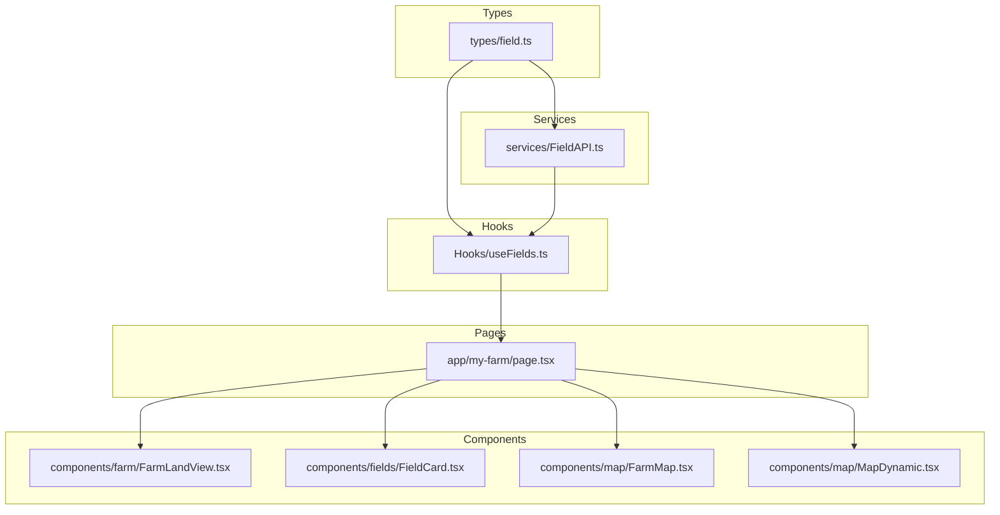
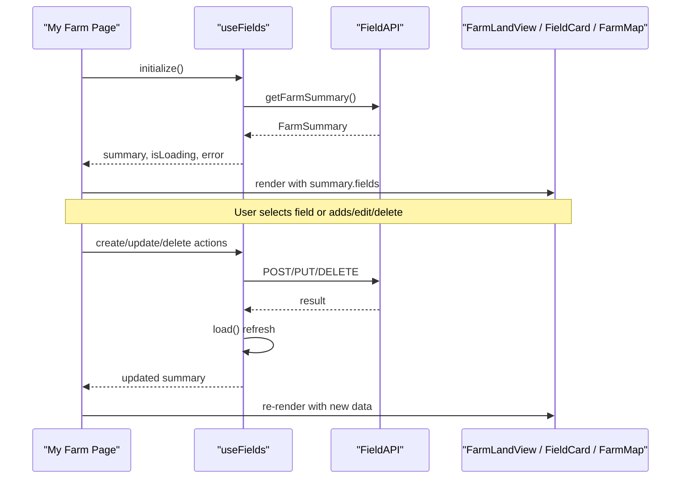
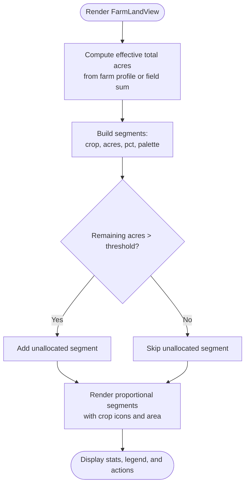
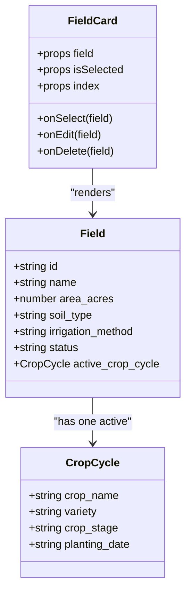
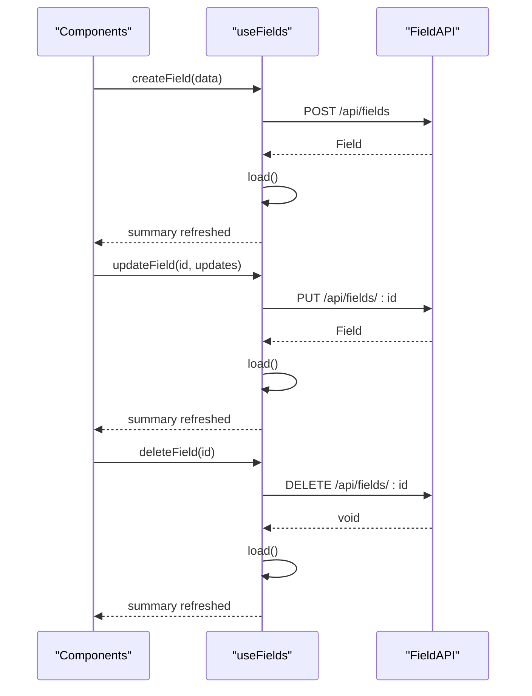
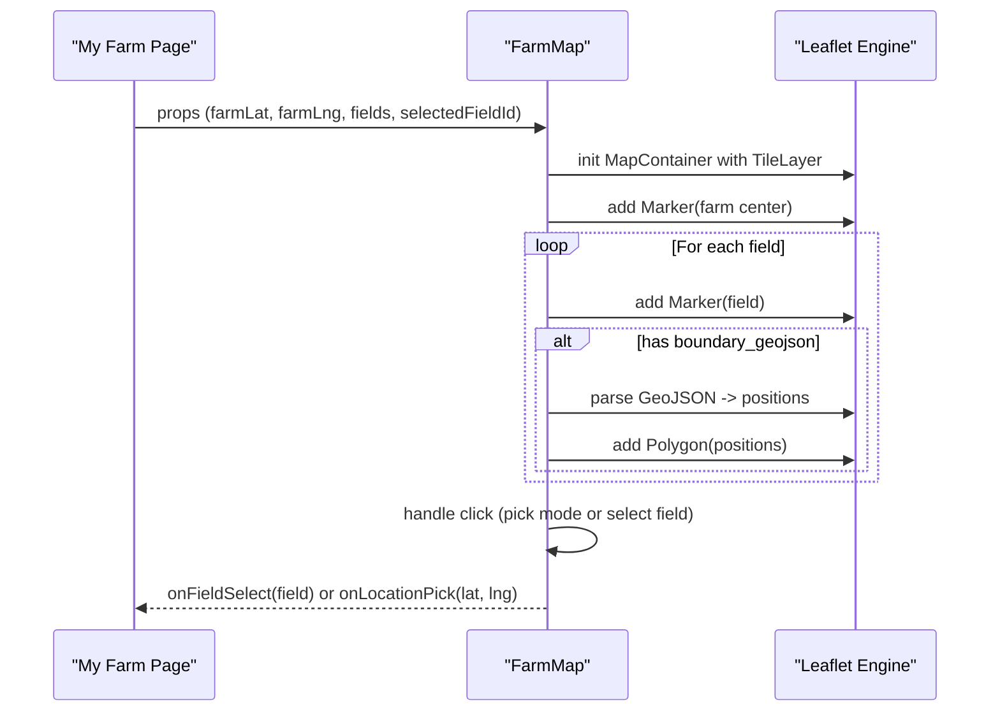
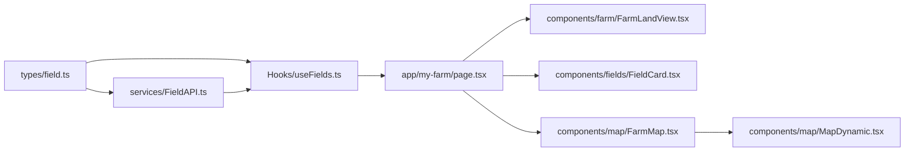

# Field Visualization and Mapping

<cite>
**Referenced Files in This Document**
- [FarmLandView.tsx](file://Frontend/greenflora/components/farm/FarmLandView.tsx)
- [FieldCard.tsx](file://Frontend/greenflora/components/fields/FieldCard.tsx)
- [useFields.ts](file://Frontend/greenflora/Hooks/useFields.ts)
- [field.ts](file://Frontend/greenflora/types/field.ts)
- [FarmMap.tsx](file://Frontend/greenflora/components/map/FarmMap.tsx)
- [MapDynamic.tsx](file://Frontend/greenflora/components/map/MapDynamic.tsx)
- [FieldAPI.ts](file://Frontend/greenflora/services/FieldAPI.ts)
- [page.tsx (My Farm)](file://Frontend/greenflora/app/my-farm/page.tsx)
</cite>

## Table of Contents
1. Introduction
2. Project Structure
3. Core Components
4. Architecture Overview
5. Detailed Component Analysis
6. Dependency Analysis
7. Performance Considerations
8. Troubleshooting Guide
9. Conclusion

## Introduction
This document explains the field visualization and mapping components that power farm planning and management in the application. It focuses on:
- FarmLandView: a static, responsive farm canvas that visualizes field boundaries as proportional segments with crop indicators and area stats.
- FieldCard: an interactive card for individual fields showing crop type, growth stage, area, soil, irrigation, and management actions.
- useFields hook: stateful data access and CRUD operations for fields and crop cycles, keeping UI in sync with backend changes.
- Interactive map integration via FarmMap: markers, polygons from GeoJSON, selection highlighting, and location picking modes.
- User interaction patterns: field selection, zoom controls, visual feedback, and responsive design for mobile farming interfaces.

## Project Structure
The field visualization system spans several layers:
- Types define shared shapes for fields, crop cycles, and farm summaries.
- Services provide HTTP clients to fetch and mutate field data.
- Hooks encapsulate loading, mutation, and refresh logic.
- Components render the farm canvas, field cards, and interactive maps.
- The My Farm page orchestrates user flows, combining all pieces into a cohesive experience.

**Diagram sources**
- [field.ts:1-78](file://Frontend/greenflora/types/field.ts#L1-L78)
- [FieldAPI.ts:1-171](file://Frontend/greenflora/services/FieldAPI.ts#L1-L171)
- [useFields.ts:1-159](file://Frontend/greenflora/Hooks/useFields.ts#L1-L159)
- [FarmLandView.tsx:1-371](file://Frontend/greenflora/components/farm/FarmLandView.tsx#L1-L371)
- [FieldCard.tsx:1-166](file://Frontend/greenflora/components/fields/FieldCard.tsx#L1-L166)
- [FarmMap.tsx:1-353](file://Frontend/greenflora/components/map/FarmMap.tsx#L1-L353)
- [MapDynamic.tsx:1-26](file://Frontend/greenflora/components/map/MapDynamic.tsx#L1-L26)
- [page.tsx (My Farm):1-694](file://Frontend/greenflora/app/my-farm/page.tsx#L1-L694)

**Section sources**
- [field.ts:1-78](file://Frontend/greenflora/types/field.ts#L1-L78)
- [FieldAPI.ts:1-171](file://Frontend/greenflora/services/FieldAPI.ts#L1-L171)
- [useFields.ts:1-159](file://Frontend/greenflora/Hooks/useFields.ts#L1-L159)
- [FarmLandView.tsx:1-371](file://Frontend/greenflora/components/farm/FarmLandView.tsx#L1-L371)
- [FieldCard.tsx:1-166](file://Frontend/greenflora/components/fields/FieldCard.tsx#L1-L166)
- [FarmMap.tsx:1-353](file://Frontend/greenflora/components/map/FarmMap.tsx#L1-L353)
- [MapDynamic.tsx:1-26](file://Frontend/greenflora/components/map/MapDynamic.tsx#L1-L26)
- [page.tsx (My Farm):1-694](file://Frontend/greenflora/app/my-farm/page.tsx#L1-L694)

## Core Components
- FarmLandView renders a proportional farm canvas with per-field segments, crop emoji icons, area labels, and unallocated land visualization. It supports compact mode for dashboards and shows total/allocated/available acreage with over-allocation warnings.
- FieldCard displays a single field’s name, status badge, area, irrigation method, soil type, and active crop cycle details. It supports selection, edit, and delete actions with hover visibility.
- useFields provides farm summary data, loading/error states, and CRUD methods for fields and crop cycles, refreshing local state after mutations.
- FarmMap is an interactive Leaflet-based map showing farm center, field markers, and optional GeoJSON polygons. It supports selection highlighting, click-to-pick modes, and responsive sizing.
- MapDynamic dynamically loads FarmMap to avoid SSR issues and shows a loading placeholder.

**Section sources**
- [FarmLandView.tsx:1-371](file://Frontend/greenflora/components/farm/FarmLandView.tsx#L1-L371)
- [FieldCard.tsx:1-166](file://Frontend/greenflora/components/fields/FieldCard.tsx#L1-L166)
- [useFields.ts:1-159](file://Frontend/greenflora/Hooks/useFields.ts#L1-L159)
- [FarmMap.tsx:1-353](file://Frontend/greenflora/components/map/FarmMap.tsx#L1-L353)
- [MapDynamic.tsx:1-26](file://Frontend/greenflora/components/map/MapDynamic.tsx#L1-L26)

## Architecture Overview
The My Farm page coordinates data and UI:
- Loads farm summary and farmer profile via hooks.
- Presents Stage 1 (interactive map to set farm location) and Stage 2 (static farm canvas + field list).
- Integrates FarmLandView for proportional visualization and FarmMap for geographic context.
- Manages field selection, editing, deletion, and crop cycle creation through handlers that call useFields actions.

**Diagram sources**
- [page.tsx (My Farm):64-244](file://Frontend/greenflora/app/my-farm/page.tsx#L64-L244)
- [useFields.ts:51-159](file://Frontend/greenflora/Hooks/useFields.ts#L51-L159)
- [FieldAPI.ts:107-171](file://Frontend/greenflora/services/FieldAPI.ts#L107-L171)
- [FarmLandView.tsx:99-147](file://Frontend/greenflora/components/farm/FarmLandView.tsx#L99-L147)
- [FieldCard.tsx:48-166](file://Frontend/greenflora/components/fields/FieldCard.tsx#L48-L166)
- [FarmMap.tsx:162-353](file://Frontend/greenflora/components/map/FarmMap.tsx#L162-L353)

## Detailed Component Analysis

### FarmLandView: Proportional Farm Canvas
- Computes effective total area using farm profile or sum of field areas.
- Builds segments per field with percentage widths based on acres; includes unallocated segment when available.
- Displays crop emoji mapped by crop name, with fallbacks.
- Shows stats bar: Total, Allocated, Available, and Over-allocated warning.
- Supports compact mode for dashboard usage and responsive typography scaling based on segment width.

**Diagram sources**
- [FarmLandView.tsx:108-147](file://Frontend/greenflora/components/farm/FarmLandView.tsx#L108-L147)
- [FarmLandView.tsx:147-344](file://Frontend/greenflora/components/farm/FarmLandView.tsx#L147-L344)

**Section sources**
- [FarmLandView.tsx:23-72](file://Frontend/greenflora/components/farm/FarmLandView.tsx#L23-L72)
- [FarmLandView.tsx:78-147](file://Frontend/greenflora/components/farm/FarmLandView.tsx#L78-L147)
- [FarmLandView.tsx:147-344](file://Frontend/greenflora/components/farm/FarmLandView.tsx#L147-L344)

### FieldCard: Individual Field Information and Actions
- Shows field name, status badge, area, irrigation method, soil type.
- Displays active crop cycle info including crop name, variety, stage, and planting date.
- Provides edit and delete actions visible on hover or when selected.
- Uses color-coded left border for visual distinction across fields.

**Diagram sources**
- [field.ts:8-35](file://Frontend/greenflora/types/field.ts#L8-L35)
- [FieldCard.tsx:22-166](file://Frontend/greenflora/components/fields/FieldCard.tsx#L22-L166)

**Section sources**
- [FieldCard.tsx:31-166](file://Frontend/greenflora/components/fields/FieldCard.tsx#L31-L166)
- [field.ts:8-35](file://Frontend/greenflora/types/field.ts#L8-L35)

### useFields: Data Access and State Management
- Loads farm summary once on mount and exposes refresh.
- Wraps mutations with isMutating flag and error handling.
- After each mutation, reloads summary to keep UI consistent.
- Exposes typed methods for creating/updating/deleting fields and crop cycles.

**Diagram sources**
- [useFields.ts:51-159](file://Frontend/greenflora/Hooks/useFields.ts#L51-L159)
- [FieldAPI.ts:115-138](file://Frontend/greenflora/services/FieldAPI.ts#L115-L138)

**Section sources**
- [useFields.ts:1-159](file://Frontend/greenflora/Hooks/useFields.ts#L1-L159)
- [FieldAPI.ts:1-171](file://Frontend/greenflora/services/FieldAPI.ts#L1-L171)

### FarmMap: Interactive Map Features and Geometry Rendering
- Renders farm center marker and numbered field markers with color coding.
- Parses boundary_geojson to draw Polygon overlays with fill opacity and stroke weight based on selection.
- Supports pick modes for setting farm or field locations via click events.
- Dynamically injects Leaflet CSS and uses dynamic import wrapper to avoid SSR issues.

**Diagram sources**
- [FarmMap.tsx:162-353](file://Frontend/greenflora/components/map/FarmMap.tsx#L162-L353)
- [MapDynamic.tsx:10-26](file://Frontend/greenflora/components/map/MapDynamic.tsx#L10-L26)

**Section sources**
- [FarmMap.tsx:32-84](file://Frontend/greenflora/components/map/FarmMap.tsx#L32-L84)
- [FarmMap.tsx:90-128](file://Frontend/greenflora/components/map/FarmMap.tsx#L90-L128)
- [FarmMap.tsx:162-353](file://Frontend/greenflora/components/map/FarmMap.tsx#L162-L353)
- [MapDynamic.tsx:1-26](file://Frontend/greenflora/components/map/MapDynamic.tsx#L1-L26)

### Integration in My Farm Page
- Orchestrates two-stage UX: location picker (interactive map) then static farm canvas plus field management.
- Passes farm summary and fields to FarmLandView and FarmMap.
- Manages field selection state and delegates CRUD to useFields.
- Provides responsive layout with grid columns for field list and detail panel.

**Section sources**
- [page.tsx (My Farm):64-244](file://Frontend/greenflora/app/my-farm/page.tsx#L64-L244)
- [page.tsx (My Farm):444-677](file://Frontend/greenflora/app/my-farm/page.tsx#L444-L677)

## Dependency Analysis
- Types are consumed by services, hooks, and components to ensure consistent data contracts.
- FieldAPI centralizes HTTP requests, error classification, and timeout handling.
- useFields depends on FieldAPI and types; it manages loading/mutation state and triggers refreshes.
- Components depend on types and useFields for data; FarmMap additionally depends on Leaflet and react-leaflet.
- My Farm page composes all parts and handles user interactions.

**Diagram sources**
- [field.ts:1-78](file://Frontend/greenflora/types/field.ts#L1-L78)
- [FieldAPI.ts:1-171](file://Frontend/greenflora/services/FieldAPI.ts#L1-L171)
- [useFields.ts:1-159](file://Frontend/greenflora/Hooks/useFields.ts#L1-L159)
- [page.tsx (My Farm):1-694](file://Frontend/greenflora/app/my-farm/page.tsx#L1-L694)
- [FarmLandView.tsx:1-371](file://Frontend/greenflora/components/farm/FarmLandView.tsx#L1-L371)
- [FieldCard.tsx:1-166](file://Frontend/greenflora/components/fields/FieldCard.tsx#L1-L166)
- [FarmMap.tsx:1-353](file://Frontend/greenflora/components/map/FarmMap.tsx#L1-L353)
- [MapDynamic.tsx:1-26](file://Frontend/greenflora/components/map/MapDynamic.tsx#L1-L26)

**Section sources**
- [field.ts:1-78](file://Frontend/greenflora/types/field.ts#L1-L78)
- [FieldAPI.ts:1-171](file://Frontend/greenflora/services/FieldAPI.ts#L1-L171)
- [useFields.ts:1-159](file://Frontend/greenflora/Hooks/useFields.ts#L1-L159)
- [page.tsx (My Farm):1-694](file://Frontend/greenflora/app/my-farm/page.tsx#L1-L694)

## Performance Considerations
- Use dynamic imports for map components to reduce initial bundle size and avoid SSR errors.
- Keep map rendering efficient by filtering fields with coordinates before adding markers/polygons.
- Avoid excessive re-renders by memoizing derived values in components where appropriate.
- Prefer proportional segments in FarmLandView for large datasets instead of heavy GIS rendering.
- Limit polygon parsing to fields with boundary data and handle invalid JSON gracefully.
- Use responsive styles to optimize mobile performance and readability.

[No sources needed since this section provides general guidance]

## Troubleshooting Guide
- Network and timeout errors: FieldAPI classifies errors and throws typed exceptions; useFields surfaces error messages and allows retry via refresh.
- Missing location: If farm coordinates are null, the map defaults to a regional center; guide users to set location via browser geolocation or map click.
- Invalid boundary data: FarmMap parses GeoJSON safely and skips invalid entries; validate upstream data entry.
- Over-allocation: FarmLandView warns when allocated acres exceed total farm acres; adjust field areas or farm profile.
- SSR issues: Always use MapDynamic wrapper for Leaflet-based components to prevent window/document access during server rendering.

**Section sources**
- [FieldAPI.ts:24-101](file://Frontend/greenflora/services/FieldAPI.ts#L24-L101)
- [useFields.ts:57-85](file://Frontend/greenflora/Hooks/useFields.ts#L57-L85)
- [FarmMap.tsx:177-194](file://Frontend/greenflora/components/map/FarmMap.tsx#L177-L194)
- [FarmMap.tsx:320-348](file://Frontend/greenflora/components/map/FarmMap.tsx#L320-L348)
- [FarmLandView.tsx:120-147](file://Frontend/greenflora/components/farm/FarmLandView.tsx#L120-L147)
- [MapDynamic.tsx:10-26](file://Frontend/greenflora/components/map/MapDynamic.tsx#L10-L26)

## Conclusion
The field visualization and mapping system combines a lightweight proportional farm canvas with an interactive map to deliver a comprehensive farm management experience. FarmLandView offers quick insights into field distribution and area budgets, while FieldCard provides detailed per-field information and actions. The useFields hook ensures consistent state and real-time updates after mutations. FarmMap enhances spatial understanding with markers, polygons, and location picking. Together, these components support responsive design, robust error handling, and scalable performance for large farm datasets.

[No sources needed since this section summarizes without analyzing specific files]