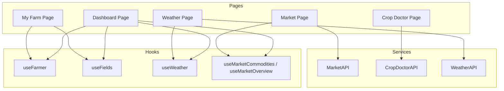
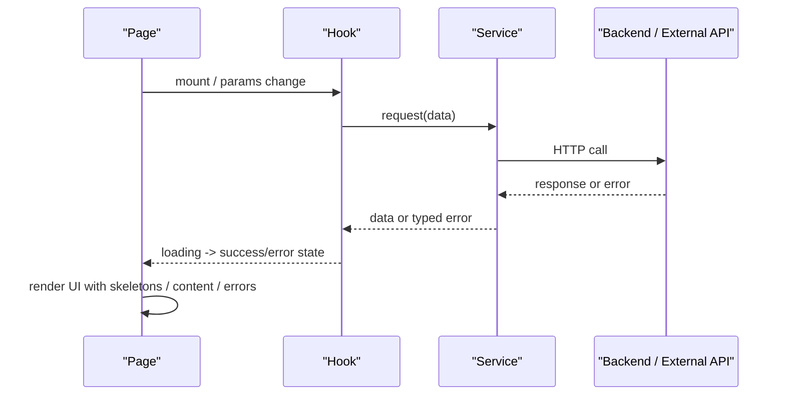
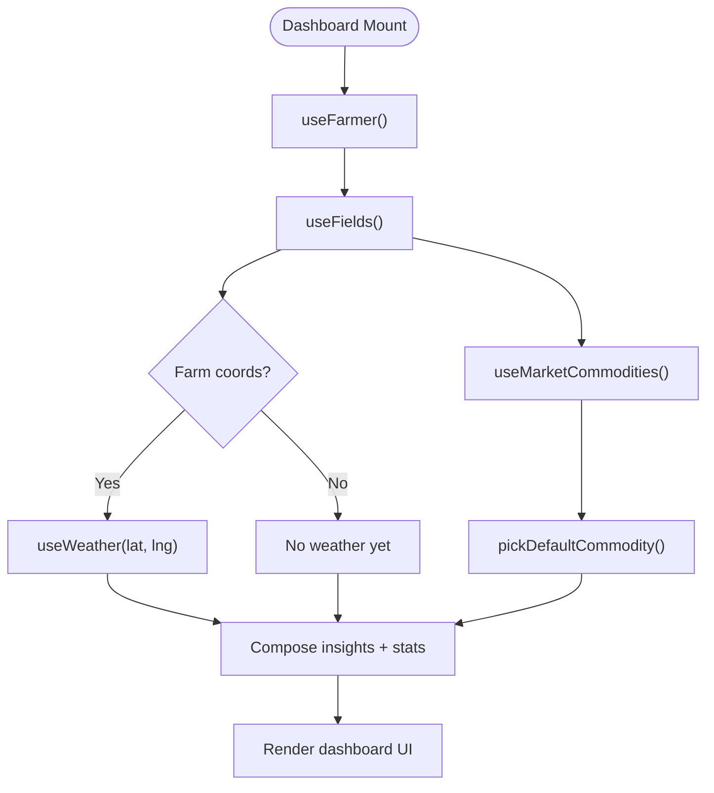
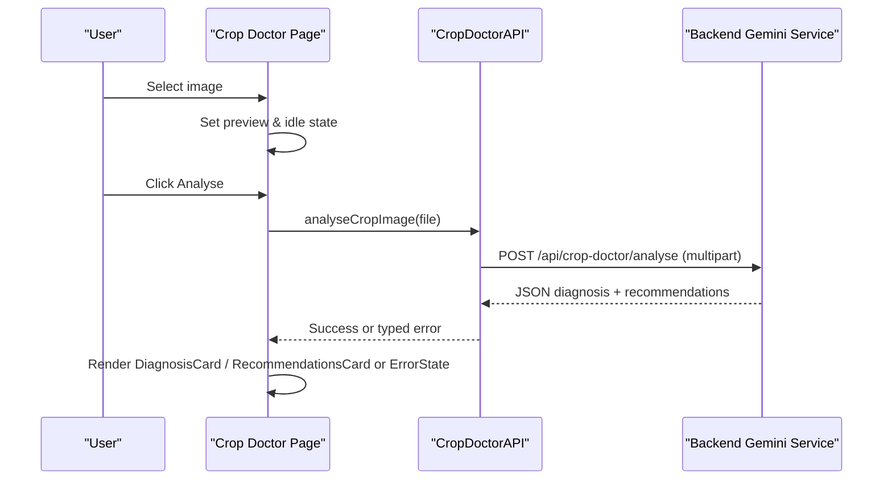
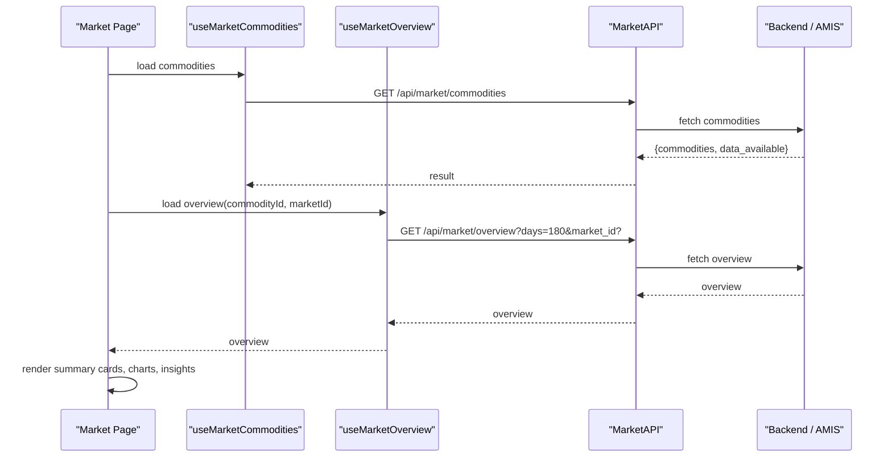
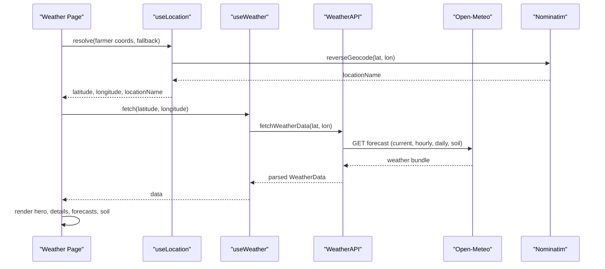
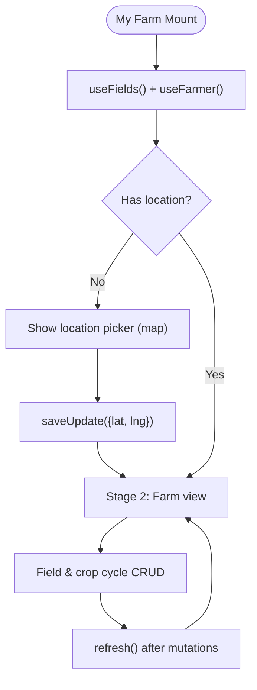
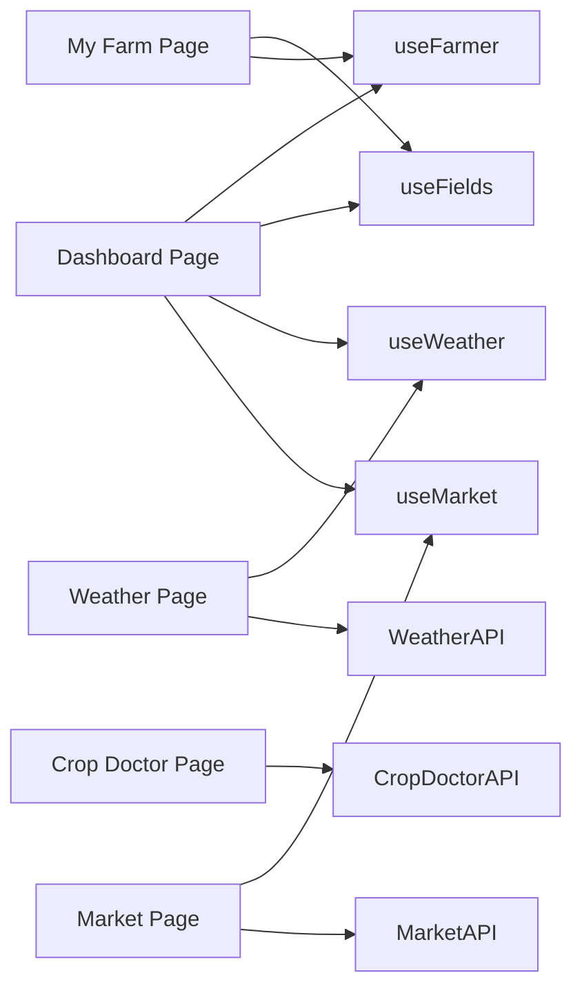

# Feature Modules

<cite>
**Referenced Files in This Document**
- [page.tsx](file://Frontend/greenflora/app/dashboard/page.tsx)
- [page.tsx](file://Frontend/greenflora/app/crop-doctor/page.tsx)
- [page.tsx](file://Frontend/greenflora/app/market/page.tsx)
- [page.tsx](file://Frontend/greenflora/app/weather/page.tsx)
- [page.tsx](file://Frontend/greenflora/app/my-farm/page.tsx)
- [useFarmer.ts](file://Frontend/greenflora/Hooks/useFarmer.ts)
- [useFields.ts](file://Frontend/greenflora/Hooks/useFields.ts)
- [useWeather.ts](file://Frontend/greenflora/Hooks/useWeather.ts)
- [useMarket.ts](file://Frontend/greenflora/Hooks/useMarket.ts)
- [MarketAPI.ts](file://Frontend/greenflora/services/MarketAPI.ts)
- [CropDoctorAPI.ts](file://Frontend/greenflora/services/CropDoctorAPI.ts)
- [WeatherAPI.ts](file://Frontend/greenflora/services/WeatherAPI.ts)
- [FarmingInsights.tsx](file://Frontend/greenflora/components/dashboard/FarmingInsights.tsx)
- [MarketSummaryCards.tsx](file://Frontend/greenflora/components/market/MarketSummaryCards.tsx)
- [CurrentWeatherHero.tsx](file://Frontend/greenflora/components/weather/CurrentWeatherHero.tsx)
</cite>

## Table of Contents
1. Introduction
2. Project Structure
3. Core Components
4. Architecture Overview
5. Detailed Component Analysis
6. Dependency Analysis
7. Performance Considerations
8. Troubleshooting Guide
9. Conclusion

## Introduction
This document explains the Green-Flora feature modules with a page-based architecture: each major feature is a dedicated Next.js page that owns its data fetching, state management, and UI composition. The features covered are Dashboard, Crop Doctor, Market Analysis, Weather Information, and Farm Management. For each page, we describe the feature-specific hooks, API integrations, business logic, data flow from backend services to UI components, and user experience patterns such as loading states, error handling, and empty states.

## Project Structure
Green-Flora’s frontend follows a feature-oriented layout under app/<feature>/page.tsx. Each page composes reusable UI components and consumes domain-specific React hooks that encapsulate data fetching and mutation logic. Services layer abstracts HTTP calls to backend endpoints or third-party APIs.

**Diagram sources**
- [page.tsx](file://Frontend/greenflora/app/dashboard/page.tsx)
- [page.tsx](file://Frontend/greenflora/app/crop-doctor/page.tsx)
- [page.tsx](file://Frontend/greenflora/app/market/page.tsx)
- [page.tsx](file://Frontend/greenflora/app/weather/page.tsx)
- [page.tsx](file://Frontend/greenflora/app/my-farm/page.tsx)
- [useFarmer.ts](file://Frontend/greenflora/Hooks/useFarmer.ts)
- [useFields.ts](file://Frontend/greenflora/Hooks/useFields.ts)
- [useWeather.ts](file://Frontend/greenflora/Hooks/useWeather.ts)
- [useMarket.ts](file://Frontend/greenflora/Hooks/useMarket.ts)
- [MarketAPI.ts](file://Frontend/greenflora/services/MarketAPI.ts)
- [CropDoctorAPI.ts](file://Frontend/greenflora/services/CropDoctorAPI.ts)
- [WeatherAPI.ts](file://Frontend/greenflora/services/WeatherAPI.ts)

**Section sources**
- [page.tsx](file://Frontend/greenflora/app/dashboard/page.tsx)
- [page.tsx](file://Frontend/greenflora/app/crop-doctor/page.tsx)
- [page.tsx](file://Frontend/greenflora/app/market/page.tsx)
- [page.tsx](file://Frontend/greenflora/app/weather/page.tsx)
- [page.tsx](file://Frontend/greenflora/app/my-farm/page.tsx)

## Core Components
- Dashboard aggregates farmer profile, farm summary, AI greeting, weather, and market highlights into a single overview. It composes insight cards and links to deeper pages for details.
- Crop Doctor orchestrates image upload, analysis request, and result presentation (diagnosis and recommendations).
- Market displays AMIS wholesale price intelligence with commodity selection, market filtering, trend charts, comparisons, distributions, and insights.
- Weather resolves location (farmer profile or device), fetches current conditions, hourly/daily forecasts, and soil metrics, then renders hero and detail sections.
- My Farm manages farm location onboarding, field CRUD, crop cycles, and visualizations.

Key responsibilities:
- Data ownership lives in hooks; pages remain thin controllers.
- Services centralize HTTP requests, timeouts, and error classification.
- UI components focus on rendering and user interactions.

**Section sources**
- [page.tsx](file://Frontend/greenflora/app/dashboard/page.tsx)
- [page.tsx](file://Frontend/greenflora/app/crop-doctor/page.tsx)
- [page.tsx](file://Frontend/greenflora/app/market/page.tsx)
- [page.tsx](file://Frontend/greenflora/app/weather/page.tsx)
- [page.tsx](file://Frontend/greenflora/app/my-farm/page.tsx)

## Architecture Overview
The application uses a layered approach:
- Pages: route-level containers that compose UI and orchestrate hook usage.
- Hooks: encapsulate data fetching, caching via local state, mutations, and refresh actions.
- Services: HTTP clients with timeouts, auth header injection, and typed errors.
- Components: presentational and feature-specific UI building blocks.

**Diagram sources**
- [useWeather.ts](file://Frontend/greenflora/Hooks/useWeather.ts)
- [WeatherAPI.ts](file://Frontend/greenflora/services/WeatherAPI.ts)
- [useMarket.ts](file://Frontend/greenflora/Hooks/useMarket.ts)
- [MarketAPI.ts](file://Frontend/greenflora/services/MarketAPI.ts)
- [CropDoctorAPI.ts](file://Frontend/greenflora/services/CropDoctorAPI.ts)

## Detailed Component Analysis

### Dashboard
- Purpose: Central overview combining AI greeting, Today’s Insight (weather, crops, market), assistant panel, farm snapshot, and government support.
- Data flow:
  - Farmer profile via useFarmer.
  - Farm summary via useFields.
  - Weather via useWeather using farm coordinates when available.
  - Market commodities via useMarketCommodities; default commodity selected based on active crops.
- UX patterns:
  - Skeleton placeholders while loading.
  - ErrorState with retry.
  - EmptyState when no farmer profile exists.
  - Language switcher integration.

**Diagram sources**
- [page.tsx](file://Frontend/greenflora/app/dashboard/page.tsx)
- [useFarmer.ts](file://Frontend/greenflora/Hooks/useFarmer.ts)
- [useFields.ts](file://Frontend/greenflora/Hooks/useFields.ts)
- [useWeather.ts](file://Frontend/greenflora/Hooks/useWeather.ts)
- [useMarket.ts](file://Frontend/greenflora/Hooks/useMarket.ts)

**Section sources**
- [page.tsx](file://Frontend/greenflora/app/dashboard/page.tsx)
- [useFarmer.ts](file://Frontend/greenflora/Hooks/useFarmer.ts)
- [useFields.ts](file://Frontend/greenflora/Hooks/useFields.ts)
- [useWeather.ts](file://Frontend/greenflora/Hooks/useWeather.ts)
- [useMarket.ts](file://Frontend/greenflora/Hooks/useMarket.ts)
- [FarmingInsights.tsx](file://Frontend/greenflora/components/dashboard/FarmingInsights.tsx)

### Crop Doctor
- Purpose: Upload an image of a crop and receive AI-powered diagnosis and recommendations.
- Data flow:
  - ImageUploader captures file and preview.
  - analyseCropImage sends multipart form to backend.
  - Result displayed via DiagnosisCard and RecommendationsCard.
- UX patterns:
  - Idle, analyzing, success, and error states.
  - Retry behavior on failure.
  - Clear/reset to start over.

**Diagram sources**
- [page.tsx](file://Frontend/greenflora/app/crop-doctor/page.tsx)
- [CropDoctorAPI.ts](file://Frontend/greenflora/services/CropDoctorAPI.ts)

**Section sources**
- [page.tsx](file://Frontend/greenflora/app/crop-doctor/page.tsx)
- [CropDoctorAPI.ts](file://Frontend/greenflora/services/CropDoctorAPI.ts)

### Market Analysis
- Purpose: Show AMIS wholesale price intelligence per crop and market filter.
- Data flow:
  - useMarketCommodities loads available crops and data availability flag.
  - Default commodity selected based on active farm crops.
  - useMarketOverview fetches overview for selected crop and optional market filter.
  - MarketSummaryCards and charts render derived metrics.
- UX patterns:
  - Skeletons during load.
  - EmptyState when no AMIS data yet.
  - ErrorState with retry.
  - Filter bar resets market when crop changes.

**Diagram sources**
- [page.tsx](file://Frontend/greenflora/app/market/page.tsx)
- [useMarket.ts](file://Frontend/greenflora/Hooks/useMarket.ts)
- [MarketAPI.ts](file://Frontend/greenflora/services/MarketAPI.ts)

**Section sources**
- [page.tsx](file://Frontend/greenflora/app/market/page.tsx)
- [useMarket.ts](file://Frontend/greenflora/Hooks/useMarket.ts)
- [MarketAPI.ts](file://Frontend/greenflora/services/MarketAPI.ts)
- [MarketSummaryCards.tsx](file://Frontend/greenflora/components/market/MarketSummaryCards.tsx)

### Weather Information
- Purpose: Provide current conditions, hourly/daily forecasts, and soil metrics for the farmer’s area.
- Data flow:
  - Location resolution: farmer profile coordinates first, then device geolocation if needed.
  - Reverse geocoding to resolve readable location name.
  - Fetch weather bundle from Open-Meteo including current, hourly, daily, and soil data.
- UX patterns:
  - Loading indicators for location resolution and weather fetch.
  - EmptyState prompting to set or share location.
  - ErrorState with retry on weather fetch failures.
  - Hero section shows resolved location source and date.

**Diagram sources**
- [page.tsx](file://Frontend/greenflora/app/weather/page.tsx)
- [useWeather.ts](file://Frontend/greenflora/Hooks/useWeather.ts)
- [WeatherAPI.ts](file://Frontend/greenflora/services/WeatherAPI.ts)
- [CurrentWeatherHero.tsx](file://Frontend/greenflora/components/weather/CurrentWeatherHero.tsx)

**Section sources**
- [page.tsx](file://Frontend/greenflora/app/weather/page.tsx)
- [useWeather.ts](file://Frontend/greenflora/Hooks/useWeather.ts)
- [WeatherAPI.ts](file://Frontend/greenflora/services/WeatherAPI.ts)
- [CurrentWeatherHero.tsx](file://Frontend/greenflora/components/weather/CurrentWeatherHero.tsx)

### Farm Management (My Farm)
- Purpose: Onboard farm location, manage fields and crop cycles, visualize farm land and map.
- Data flow:
  - useFields provides farm summary and CRUD actions for fields and crop cycles.
  - useFarmer provides farmer profile updates (e.g., saving coordinates).
  - Two-stage UX: Stage 1 picks location on interactive map; Stage 2 shows static farm canvas and list/detail panels.
- UX patterns:
  - Toast messages for success/error feedback.
  - Mode-driven rendering (view, set-location, add/edit field, add/edit cycle).
  - EmptyState when no farm data exists.
  - Confirmation dialogs for destructive actions.

**Diagram sources**
- [page.tsx](file://Frontend/greenflora/app/my-farm/page.tsx)
- [useFields.ts](file://Frontend/greenflora/Hooks/useFields.ts)
- [useFarmer.ts](file://Frontend/greenflora/Hooks/useFarmer.ts)

**Section sources**
- [page.tsx](file://Frontend/greenflora/app/my-farm/page.tsx)
- [useFields.ts](file://Frontend/greenflora/Hooks/useFields.ts)
- [useFarmer.ts](file://Frontend/greenflora/Hooks/useFarmer.ts)

## Dependency Analysis
- Pages depend on hooks for data and actions.
- Hooks depend on services for network calls.
- Services encapsulate HTTP concerns: base URL, timeouts, auth headers, error classification.
- Components consume typed data from hooks/pages and render UI.

**Diagram sources**
- [page.tsx](file://Frontend/greenflora/app/dashboard/page.tsx)
- [page.tsx](file://Frontend/greenflora/app/crop-doctor/page.tsx)
- [page.tsx](file://Frontend/greenflora/app/market/page.tsx)
- [page.tsx](file://Frontend/greenflora/app/weather/page.tsx)
- [page.tsx](file://Frontend/greenflora/app/my-farm/page.tsx)
- [useFarmer.ts](file://Frontend/greenflora/Hooks/useFarmer.ts)
- [useFields.ts](file://Frontend/greenflora/Hooks/useFields.ts)
- [useWeather.ts](file://Frontend/greenflora/Hooks/useWeather.ts)
- [useMarket.ts](file://Frontend/greenflora/Hooks/useMarket.ts)
- [MarketAPI.ts](file://Frontend/greenflora/services/MarketAPI.ts)
- [CropDoctorAPI.ts](file://Frontend/greenflora/services/CropDoctorAPI.ts)
- [WeatherAPI.ts](file://Frontend/greenflora/services/WeatherAPI.ts)

**Section sources**
- [useFarmer.ts](file://Frontend/greenflora/Hooks/useFarmer.ts)
- [useFields.ts](file://Frontend/greenflora/Hooks/useFields.ts)
- [useWeather.ts](file://Frontend/greenflora/Hooks/useWeather.ts)
- [useMarket.ts](file://Frontend/greenflora/Hooks/useMarket.ts)
- [MarketAPI.ts](file://Frontend/greenflora/services/MarketAPI.ts)
- [CropDoctorAPI.ts](file://Frontend/greenflora/services/CropDoctorAPI.ts)
- [WeatherAPI.ts](file://Frontend/greenflora/services/WeatherAPI.ts)

## Performance Considerations
- Request timeouts:
  - Market and Crop Doctor services define explicit timeouts to avoid hanging UI.
  - Weather service sets timeouts for both weather and reverse geocoding calls.
- Efficient data fetching:
  - Weather service bundles current, hourly, daily, and soil data in one request to minimize round-trips.
  - Market overview fetches a wide window (180 days) and slices periods client-side for instant switching.
- State coalescing:
  - useMarketOverview guards against out-of-order responses using request IDs to prevent stale data display.
- UI responsiveness:
  - Skeleton loaders provide perceived performance during data fetches.
  - Conditional rendering avoids unnecessary computations until data is available.

[No sources needed since this section provides general guidance]

## Troubleshooting Guide
Common issues and recovery patterns:
- Network or timeout errors:
  - Services classify errors (network, timeout, validation, server) and expose user-friendly messages.
  - Pages offer retry actions via ErrorState.
- Missing data:
  - Market page shows EmptyState when AMIS data is not yet available.
  - Weather page prompts to set or share location when coordinates are missing.
- Authentication:
  - Services inject Authorization headers when tokens exist; ensure login flows persist tokens correctly.
- Mutations:
  - Field and farmer mutations wrap operations with loading flags and refresh local state on success.

**Section sources**
- [MarketAPI.ts](file://Frontend/greenflora/services/MarketAPI.ts)
- [CropDoctorAPI.ts](file://Frontend/greenflora/services/CropDoctorAPI.ts)
- [WeatherAPI.ts](file://Frontend/greenflora/services/WeatherAPI.ts)
- [useFields.ts](file://Frontend/greenflora/Hooks/useFields.ts)
- [useFarmer.ts](file://Frontend/greenflora/Hooks/useFarmer.ts)
- [page.tsx](file://Frontend/greenflora/app/market/page.tsx)
- [page.tsx](file://Frontend/greenflora/app/weather/page.tsx)

## Conclusion
Green-Flora’s feature modules follow a clear page-based architecture where each feature owns its data lifecycle through dedicated hooks and services. This separation yields maintainable code, consistent UX patterns (loading, error, empty states), and robust error handling. The design enables scalable additions of new features while keeping data flows predictable and testable.

[No sources needed since this section summarizes without analyzing specific files]