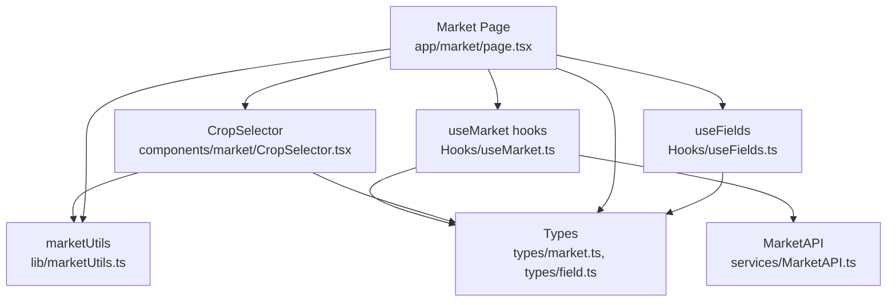
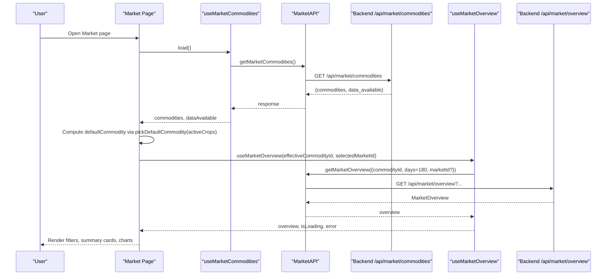
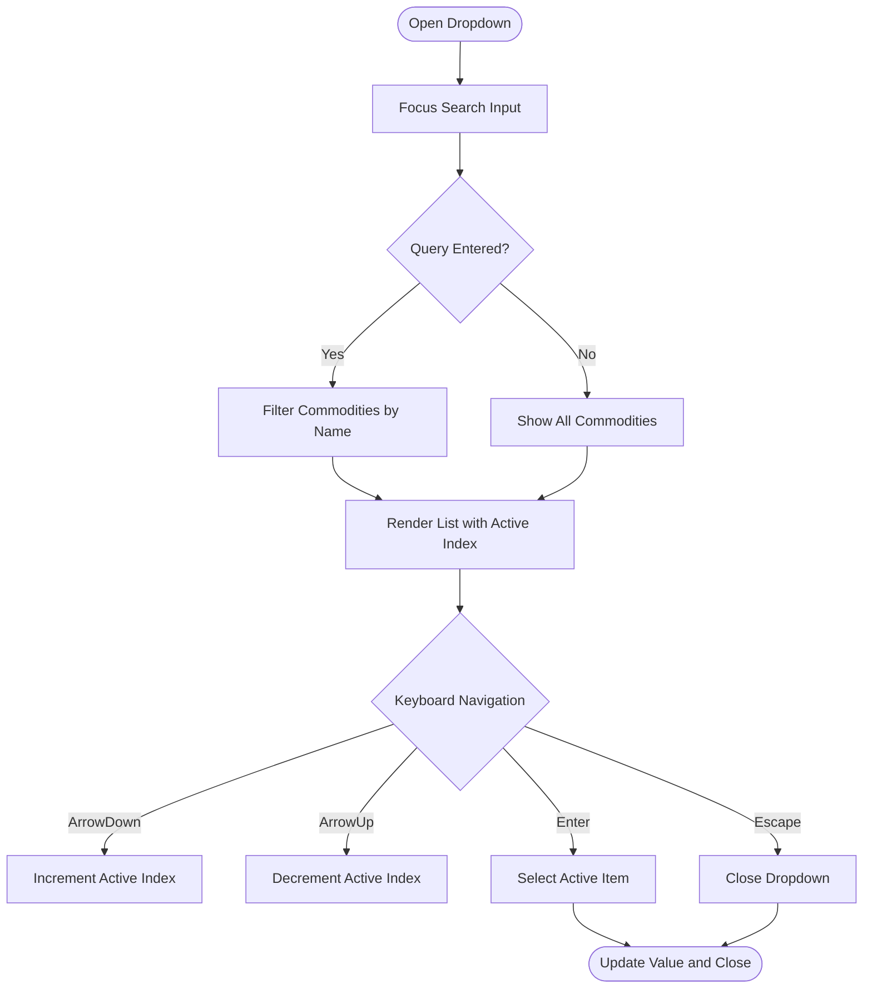
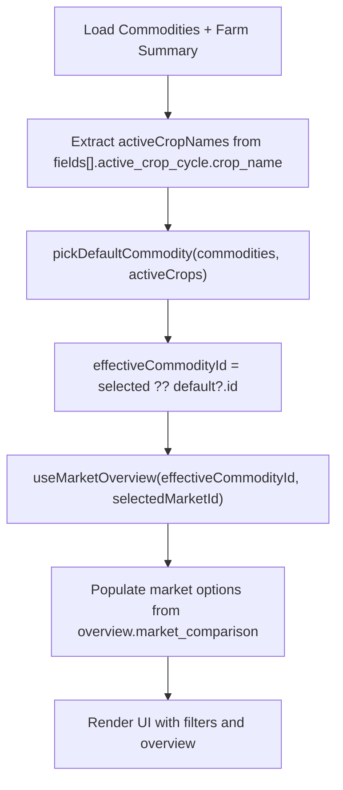
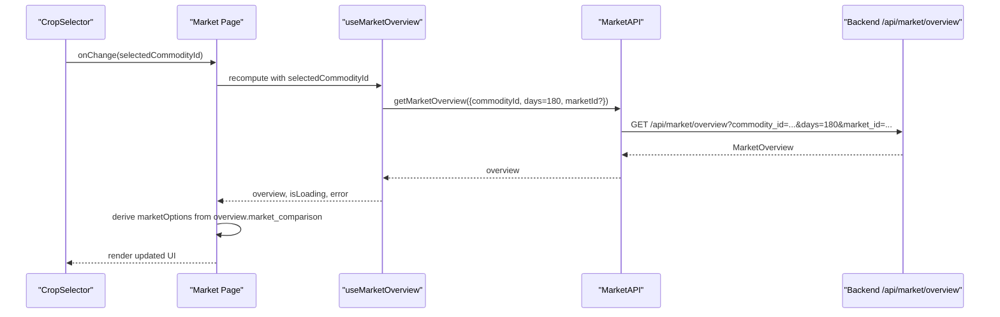
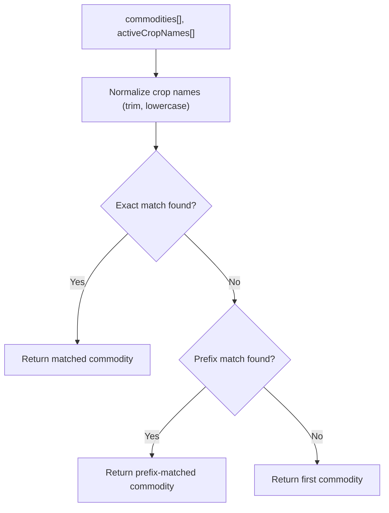
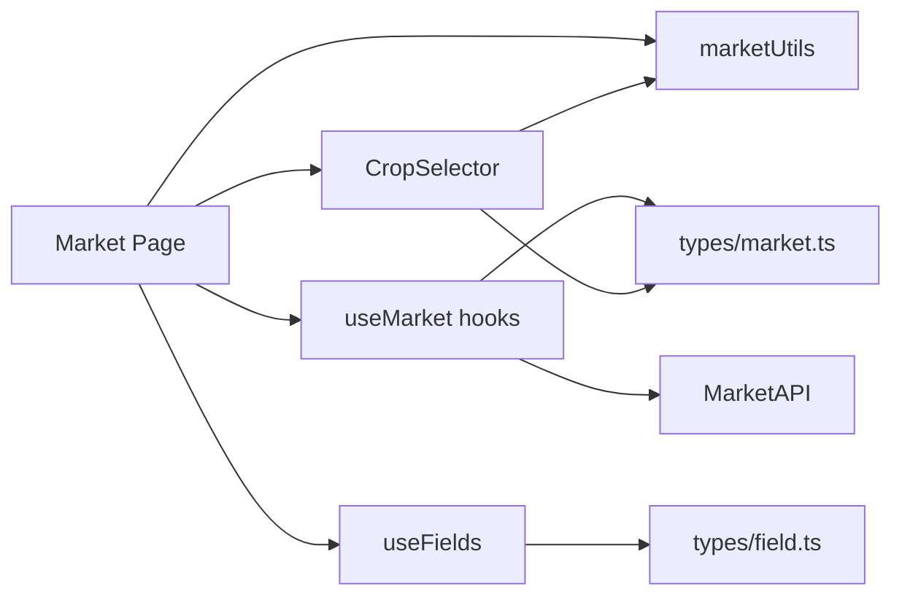

# Crop Selection and Filtering

<cite>
**Referenced Files in This Document**
- [CropSelector.tsx](file://Frontend/greenflora/components/market/CropSelector.tsx)
- [marketUtils.ts](file://Frontend/greenflora/lib/marketUtils.ts)
- [market.ts](file://Frontend/greenflora/types/market.ts)
- [MarketAPI.ts](file://Frontend/greenflora/services/MarketAPI.ts)
- [useMarket.ts](file://Frontend/greenflora/Hooks/useMarket.ts)
- [page.tsx (Market page)](file://Frontend/greenflora/app/market/page.tsx)
- [useFields.ts](file://Frontend/greenflora/Hooks/useFields.ts)
- [field.ts](file://Frontend/greenflora/types/field.ts)
</cite>

## Table of Contents
1. Introduction
2. Project Structure
3. Core Components
4. Architecture Overview
5. Detailed Component Analysis
6. Dependency Analysis
7. Performance Considerations
8. Troubleshooting Guide
9. Conclusion
10. Appendices

## Introduction
This document explains the Crop Selector component and market filtering functionality in the Market Intelligence feature. It covers how the selector integrates with a farmer’s active crops to provide personalized defaults, how selecting commodities drives dynamic market data retrieval, and how utility functions in marketUtils.ts support crop matching, default selection, and data transformation. It also documents user experience patterns for search, keyboard navigation, and state management across sessions.

## Project Structure
The Market Intelligence flow is implemented on the Market page, which composes:
- A searchable CropSelector that lists AMIS commodities with latest price and date
- A market filter dropdown populated from the selected commodity’s market comparison data
- Hooks that fetch commodities and overview data from the backend
- Utility functions that compute defaults and format values

**Diagram sources**
- [page.tsx (Market page):47-117](file://Frontend/greenflora/app/market/page.tsx#L47-L117)
- [CropSelector.tsx:20-48](file://Frontend/greenflora/components/market/CropSelector.tsx#L20-L48)
- [useMarket.ts:33-64](file://Frontend/greenflora/Hooks/useMarket.ts#L33-L64)
- [MarketAPI.ts:100-127](file://Frontend/greenflora/services/MarketAPI.ts#L100-L127)
- [marketUtils.ts:352-381](file://Frontend/greenflora/lib/marketUtils.ts#L352-L381)
- [useFields.ts:51-72](file://Frontend/greenflora/Hooks/useFields.ts#L51-L72)
- [market.ts:10-30](file://Frontend/greenflora/types/market.ts#L10-L30)
- [field.ts:8-35](file://Frontend/greenflora/types/field.ts#L8-L35)

**Section sources**
- [page.tsx (Market page):47-117](file://Frontend/greenflora/app/market/page.tsx#L47-L117)
- [CropSelector.tsx:20-48](file://Frontend/greenflora/components/market/CropSelector.tsx#L20-L48)
- [useMarket.ts:33-64](file://Frontend/greenflora/Hooks/useMarket.ts#L33-L64)
- [MarketAPI.ts:100-127](file://Frontend/greenflora/services/MarketAPI.ts#L100-L127)
- [marketUtils.ts:352-381](file://Frontend/greenflora/lib/marketUtils.ts#L352-L381)
- [useFields.ts:51-72](file://Frontend/greenflora/Hooks/useFields.ts#L51-L72)
- [market.ts:10-30](file://Frontend/greenflora/types/market.ts#L10-L30)
- [field.ts:8-35](file://Frontend/greenflora/types/field.ts#L8-L35)

## Core Components
- CropSelector: Accessible combobox with search, keyboard navigation, click-outside dismissal, and inline display of latest price/date for the selected commodity.
- Market page: Orchestrates commodity loading, default selection based on active crops, market filter population, and overview fetching.
- useMarket hooks: Load commodities list and per-crop overview; manage loading/error states and refresh actions.
- MarketAPI: Centralized HTTP client for market endpoints with timeouts and error classification.
- marketUtils: Formatting helpers, trend slicing, visual accents, and default commodity selection logic.

**Section sources**
- [CropSelector.tsx:26-116](file://Frontend/greenflora/components/market/CropSelector.tsx#L26-L116)
- [page.tsx (Market page):47-117](file://Frontend/greenflora/app/market/page.tsx#L47-L117)
- [useMarket.ts:33-134](file://Frontend/greenflora/Hooks/useMarket.ts#L33-L134)
- [MarketAPI.ts:22-94](file://Frontend/greenflora/services/MarketAPI.ts#L22-L94)
- [marketUtils.ts:17-144](file://Frontend/greenflora/lib/marketUtils.ts#L17-L144)

## Architecture Overview
The Market page loads all available commodities and the farmer’s active crops. It computes a default commodity by matching active crops against the commodity list. When a commodity is selected, the market filter options are derived from the overview’s market comparison entries. The overview is fetched once with a wide window and sliced client-side for different time periods.

**Diagram sources**
- [page.tsx (Market page):47-117](file://Frontend/greenflora/app/market/page.tsx#L47-L117)
- [useMarket.ts:33-64](file://Frontend/greenflora/Hooks/useMarket.ts#L33-L64)
- [MarketAPI.ts:100-127](file://Frontend/greenflora/services/MarketAPI.ts#L100-L127)
- [marketUtils.ts:352-381](file://Frontend/greenflora/lib/marketUtils.ts#L352-L381)

## Detailed Component Analysis

### CropSelector Component
- Purpose: Provide an accessible, searchable crop selector that shows the latest price and date in the trigger and supports keyboard navigation.
- Key behaviors:
  - Maintains open/close state, search query, and active index for keyboard navigation.
  - Filters commodities by name when a query is entered.
  - Uses aria attributes and roles for accessibility.
  - Displays selected commodity’s name, latest price, and formatted date in the trigger.
  - Resets focus to search input on open and scrolls active item into view during keyboard navigation.

**Diagram sources**
- [CropSelector.tsx:70-116](file://Frontend/greenflora/components/market/CropSelector.tsx#L70-L116)
- [CropSelector.tsx:120-233](file://Frontend/greenflora/components/market/CropSelector.tsx#L120-L233)

**Section sources**
- [CropSelector.tsx:26-116](file://Frontend/greenflora/components/market/CropSelector.tsx#L26-L116)
- [CropSelector.tsx:120-233](file://Frontend/greenflora/components/market/CropSelector.tsx#L120-L233)

### Market Page Integration and Default Selection
- Loads commodities via useMarketCommodities.
- Retrieves farm summary via useFields to extract active crop names from fields’ active_crop_cycle.crop_name.
- Computes effectiveCommodityId as either user-selected or defaultCommodity derived from pickDefaultCommodity(commodities, activeCrops).
- On crop change, resets market filter to ensure consistency with the new commodity’s markets.
- Populates market filter options from overview.market_comparison after overview loads.

**Diagram sources**
- [page.tsx (Market page):56-117](file://Frontend/greenflora/app/market/page.tsx#L56-L117)
- [useFields.ts:51-72](file://Frontend/greenflora/Hooks/useFields.ts#L51-L72)
- [marketUtils.ts:352-381](file://Frontend/greenflora/lib/marketUtils.ts#L352-L381)

**Section sources**
- [page.tsx (Market page):56-117](file://Frontend/greenflora/app/market/page.tsx#L56-L117)
- [useFields.ts:51-72](file://Frontend/greenflora/Hooks/useFields.ts#L51-L72)
- [marketUtils.ts:352-381](file://Frontend/greenflora/lib/marketUtils.ts#L352-L381)

### Data Flow: From Commodity Selection to Market Data
- Selecting a commodity triggers useMarketOverview with the chosen commodityId and optional marketId.
- MarketAPI builds query parameters including commodity_id, days (default 180), and optional market_id.
- Backend returns MarketOverview containing current_price, trend, market_comparison, distribution, and insights.
- The Market page uses market_comparison to populate the market filter dropdown and renders summary cards, charts, and insights.

**Diagram sources**
- [page.tsx (Market page):84-117](file://Frontend/greenflora/app/market/page.tsx#L84-L117)
- [useMarket.ts:80-134](file://Frontend/greenflora/Hooks/useMarket.ts#L80-L134)
- [MarketAPI.ts:108-127](file://Frontend/greenflora/services/MarketAPI.ts#L108-L127)

**Section sources**
- [page.tsx (Market page):84-117](file://Frontend/greenflora/app/market/page.tsx#L84-L117)
- [useMarket.ts:80-134](file://Frontend/greenflora/Hooks/useMarket.ts#L80-L134)
- [MarketAPI.ts:108-127](file://Frontend/greenflora/services/MarketAPI.ts#L108-L127)

### Utility Functions in marketUtils.ts
- Default commodity selection:
  - pickDefaultCommodity matches active crop names exactly first, then by prefix against commodity names, falling back to the first commodity if no match.
- Data transformation and formatting:
  - PKR formatting helpers for currency display and units.
  - Date formatting for market dates and axis labels.
  - Trend slicing function to switch between 7D/30D/3M/6M without refetching.
  - Visual accent mapping for chart colors and UI accents based on crop keywords.

**Diagram sources**
- [marketUtils.ts:352-381](file://Frontend/greenflora/lib/marketUtils.ts#L352-L381)

**Section sources**
- [marketUtils.ts:17-144](file://Frontend/greenflora/lib/marketUtils.ts#L17-L144)
- [marketUtils.ts:352-381](file://Frontend/greenflora/lib/marketUtils.ts#L352-L381)

### Types and Contracts
- MarketCommodity: Represents a selectable crop with id, name, category, unit, latest_date, latest_price, and markets_reporting.
- MarketOverview: Aggregates current price, signal, trend points, market comparison, distribution, and insights for a selected commodity.
- Field and CropCycle: Used to extract active crop names from the farm summary.

**Section sources**
- [market.ts:10-30](file://Frontend/greenflora/types/market.ts#L10-L30)
- [market.ts:73-108](file://Frontend/greenflora/types/market.ts#L73-L108)
- [field.ts:8-35](file://Frontend/greenflora/types/field.ts#L8-L35)

## Dependency Analysis
- Market page depends on:
  - useMarketCommodities to load commodities list
  - useFields to retrieve active crop names
  - useMarketOverview to fetch overview for selected commodity and market
  - marketUtils for default selection and formatting
- CropSelector depends on:
  - marketUtils for date and price formatting
  - types/market for commodity shape
- useMarket hooks depend on:
  - MarketAPI for network requests
  - types/market for response shapes

**Diagram sources**
- [page.tsx (Market page):47-117](file://Frontend/greenflora/app/market/page.tsx#L47-L117)
- [useMarket.ts:33-134](file://Frontend/greenflora/Hooks/useMarket.ts#L33-L134)
- [MarketAPI.ts:100-127](file://Frontend/greenflora/services/MarketAPI.ts#L100-L127)
- [marketUtils.ts:352-381](file://Frontend/greenflora/lib/marketUtils.ts#L352-L381)
- [field.ts:8-35](file://Frontend/greenflora/types/field.ts#L8-L35)

**Section sources**
- [page.tsx (Market page):47-117](file://Frontend/greenflora/app/market/page.tsx#L47-L117)
- [useMarket.ts:33-134](file://Frontend/greenflora/Hooks/useMarket.ts#L33-L134)
- [MarketAPI.ts:100-127](file://Frontend/greenflora/services/MarketAPI.ts#L100-L127)
- [marketUtils.ts:352-381](file://Frontend/greenflora/lib/marketUtils.ts#L352-L381)
- [field.ts:8-35](file://Frontend/greenflora/types/field.ts#L8-L35)

## Performance Considerations
- Client-side period slicing: The overview is fetched once with a wide window (180 days) and sliced for 7D/30D/3M/6M using sliceTrendForPeriod, avoiding repeated network calls and enabling instant switching.
- Efficient filtering: CropSelector filters by name locally using useMemo to avoid unnecessary re-renders.
- Request deduplication: useMarketOverview guards against out-of-order responses using a request ID reference to prevent stale updates.
- Minimal re-renders: Derived values like effectiveCommodityId and marketOptions are memoized to reduce recomputation.

[No sources needed since this section provides general guidance]

## Troubleshooting Guide
- No market prices yet:
  - If data_available is false or commodities list is empty, show an EmptyState with a retry action.
- Network errors:
  - MarketAPI classifies errors as network, timeout, validation, server, or unknown; surface user-friendly messages and allow retry.
- Missing crop data:
  - If no active crops exist or none match commodities, default to the first commodity; ensure fallback rendering handles null/undefined gracefully.
- Multiple active crops:
  - pickDefaultCommodity tries exact match first across all active crops, then prefix match; if multiple matches exist, the first found is used.
- Market availability variations:
  - Market filter options are derived from overview.market_comparison; if a market has no data, it will not appear in the dropdown.

**Section sources**
- [page.tsx (Market page):140-163](file://Frontend/greenflora/app/market/page.tsx#L140-L163)
- [MarketAPI.ts:22-94](file://Frontend/greenflora/services/MarketAPI.ts#L22-L94)
- [marketUtils.ts:352-381](file://Frontend/greenflora/lib/marketUtils.ts#L352-L381)

## Conclusion
The Crop Selector and market filtering system provide a responsive, accessible interface for farmers to explore market prices tailored to their active crops. Personalization is achieved through default selection based on active crop names, while dynamic market options are derived from the selected commodity’s overview. Robust utilities handle formatting, trend slicing, and visual accents, ensuring clarity and performance. Error handling and empty states maintain usability even when data is missing or incomplete.

[No sources needed since this section summarizes without analyzing specific files]

## Appendices

### User Experience Patterns
- Search functionality:
  - Real-time filtering by crop name with immediate feedback and clear “no results” messaging.
- Keyboard navigation:
  - Arrow keys navigate the list; Enter selects; Escape closes; active item auto-scrolls into view.
- Preference persistence:
  - Current implementation stores selections in local component state; there is no explicit session persistence in the analyzed code. To persist preferences across sessions, consider adding localStorage or profile-based storage for selected commodity and market.

[No sources needed since this section doesn't analyze specific files]