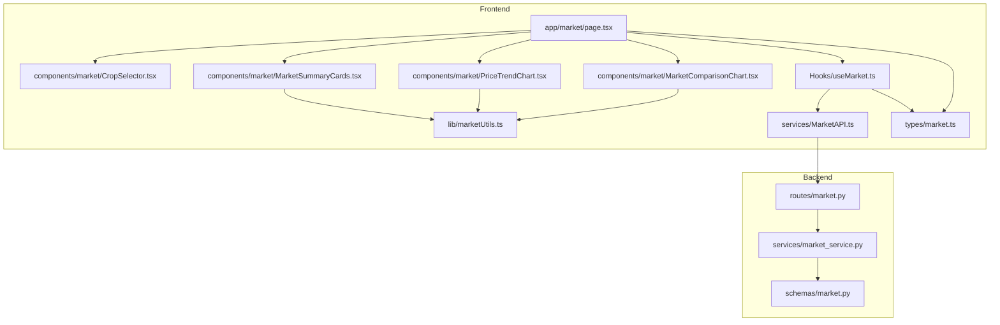
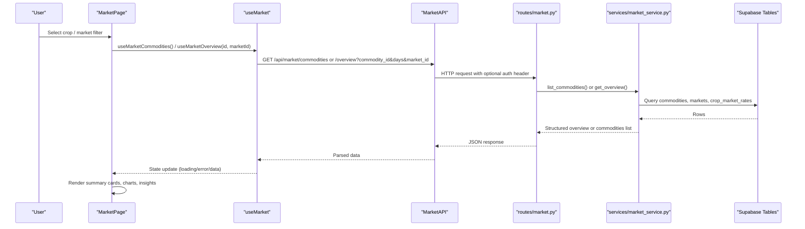
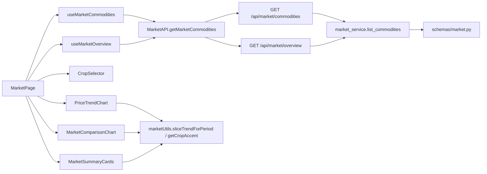

# Market Analysis Module

<cite>
**Referenced Files in This Document**
- [page.tsx](file://Frontend/greenflora/app/market/page.tsx)
- [MarketSummaryCards.tsx](file://Frontend/greenflora/components/market/MarketSummaryCards.tsx)
- [PriceTrendChart.tsx](file://Frontend/greenflora/components/market/PriceTrendChart.tsx)
- [MarketComparisonChart.tsx](file://Frontend/greenflora/components/market/MarketComparisonChart.tsx)
- [CropSelector.tsx](file://Frontend/greenflora/components/market/CropSelector.tsx)
- [useMarket.ts](file://Frontend/greenflora/Hooks/useMarket.ts)
- [MarketAPI.ts](file://Frontend/greenflora/services/MarketAPI.ts)
- [marketUtils.ts](file://Frontend/greenflora/lib/marketUtils.ts)
- [market.ts](file://Frontend/greenflora/types/market.ts)
- [market.py](file://Backend/routes/market.py)
- [market_service.py](file://Backend/services/market_service.py)
- [schemas/market.py](file://Backend/schemas/market.py)
</cite>

## Table of Contents
1. [Introduction](#introduction)
2. [Project Structure](#project-structure)
3. [Core Components](#core-components)
4. [Architecture Overview](#architecture-overview)
5. [Detailed Component Analysis](#detailed-component-analysis)
6. [Dependency Analysis](#dependency-analysis)
7. [Performance Considerations](#performance-considerations)
8. [Troubleshooting Guide](#troubleshooting-guide)
9. [Conclusion](#conclusion)

## Introduction
This document explains the Market Analysis module that provides farmers with real-time agricultural commodity pricing, trend visualization, and comparative market analysis. The page aggregates AMIS wholesale price data through a backend API and renders:
- Key market metrics via summary cards
- Interactive price trends over selectable time windows
- Cross-market price comparisons and arrivals distribution
- Farmer-friendly insights derived from actual data

The design emphasizes honest empty states when data is limited, responsive charts for mobile and desktop, and efficient client-side filtering to keep interactions instant.

## Project Structure
The module spans frontend pages, reusable components, hooks, services, types, and backend routes/services.

**Diagram sources**
- [page.tsx:17-45](file://Frontend/greenflora/app/market/page.tsx#L17-L45)
- [useMarket.ts:13-23](file://Frontend/greenflora/Hooks/useMarket.ts#L13-L23)
- [MarketAPI.ts:11-18](file://Frontend/greenflora/services/MarketAPI.ts#L11-L18)
- [market.py:31-31](file://Backend/routes/market.py#L31-L31)
- [market_service.py:47-53](file://Backend/services/market_service.py#L47-L53)
- [schemas/market.py:22-44](file://Backend/schemas/market.py#L22-L44)

**Section sources**
- [page.tsx:17-45](file://Frontend/greenflora/app/market/page.tsx#L17-L45)
- [market.py:31-31](file://Backend/routes/market.py#L31-L31)

## Core Components
- Market page orchestrates state, filters, and composes UI sections.
- CropSelector provides searchable, accessible crop selection with keyboard navigation.
- MarketSummaryCards displays current price, per-kg conversion, 7-day change, highest/lowest markets, and spread.
- PriceTrendChart renders an area chart with period filters (7D/30D/3M/6M).
- MarketComparisonChart shows horizontal bars comparing prices across markets on the latest date.
- useMarket hook fetches commodities and overview data with robust loading/error handling.
- MarketAPI centralizes HTTP calls with timeouts and error classification.
- marketUtils formats currency, dates, slices trends, and assigns crop-specific accents.
- Types define contracts between frontend and backend.

**Section sources**
- [page.tsx:47-227](file://Frontend/greenflora/app/market/page.tsx#L47-L227)
- [CropSelector.tsx:26-237](file://Frontend/greenflora/components/market/CropSelector.tsx#L26-L237)
- [MarketSummaryCards.tsx:148-263](file://Frontend/greenflora/components/market/MarketSummaryCards.tsx#L148-L263)
- [PriceTrendChart.tsx:66-223](file://Frontend/greenflora/components/market/PriceTrendChart.tsx#L66-L223)
- [MarketComparisonChart.tsx:71-202](file://Frontend/greenflora/components/market/MarketComparisonChart.tsx#L71-L202)
- [useMarket.ts:33-135](file://Frontend/greenflora/Hooks/useMarket.ts#L33-L135)
- [MarketAPI.ts:22-128](file://Frontend/greenflora/services/MarketAPI.ts#L22-L128)
- [marketUtils.ts:31-144](file://Frontend/greenflora/lib/marketUtils.ts#L31-L144)
- [market.ts:10-120](file://Frontend/greenflora/types/market.ts#L10-L120)

## Architecture Overview
End-to-end flow from user interaction to data rendering:

**Diagram sources**
- [page.tsx:89-117](file://Frontend/greenflora/app/market/page.tsx#L89-L117)
- [useMarket.ts:39-63](file://Frontend/greenflora/Hooks/useMarket.ts#L39-L63)
- [useMarket.ts:99-131](file://Frontend/greenflora/Hooks/useMarket.ts#L99-L131)
- [MarketAPI.ts:46-94](file://Frontend/greenflora/services/MarketAPI.ts#L46-L94)
- [market.py:38-62](file://Backend/routes/market.py#L38-L62)
- [market.py:69-107](file://Backend/routes/market.py#L69-L107)
- [market_service.py:59-152](file://Backend/services/market_service.py#L59-L152)
- [market_service.py:158-343](file://Backend/services/market_service.py#L158-L343)

## Detailed Component Analysis

### Market Page (app/market/page.tsx)
Responsibilities:
- Loads commodities and overview using hooks
- Manages selected crop and market filters
- Renders loading skeletons, errors, empty states, and content sections
- Composes CropSelector, MarketSummaryCards, PriceTrendChart, MarketComparisonChart, and insights

Key behaviors:
- Default crop selection based on farmer’s active crops when possible
- Market filter resets when crop changes
- Period slicing handled by chart component; overview fetched once with max window

**Section sources**
- [page.tsx:47-117](file://Frontend/greenflora/app/market/page.tsx#L47-L117)
- [page.tsx:121-227](file://Frontend/greenflora/app/market/page.tsx#L121-L227)

### CropSelector
Features:
- Accessible combobox with keyboard navigation (arrows, enter, escape)
- Searchable dropdown showing latest price and date per crop
- Click-outside dismissal and focus management

Data binding:
- Displays filtered list based on query
- Emits selected commodity id to parent

Accessibility:
- Uses ARIA roles and attributes for combobox/listbox
- Keyboard-first navigation with scroll-to-active behavior

**Section sources**
- [CropSelector.tsx:26-117](file://Frontend/greenflora/components/market/CropSelector.tsx#L26-L117)
- [CropSelector.tsx:120-237](file://Frontend/greenflora/components/market/CropSelector.tsx#L120-L237)

### MarketSummaryCards
Displays:
- Current price with signal pill (rising/falling/stable/insufficient data)
- Price per kg derived from 100 kg rate
- 7-day percentage change with context label
- Highest and lowest markets with prices
- Absolute and percentage spread between markets

Formatting:
- Uses market utilities for PKR formatting, date formatting, and basis labels
- Responsive grid layout adapts to screen sizes

**Section sources**
- [MarketSummaryCards.tsx:148-263](file://Frontend/greenflora/components/market/MarketSummaryCards.tsx#L148-L263)
- [marketUtils.ts:31-93](file://Frontend/greenflora/lib/marketUtils.ts#L31-L93)

### PriceTrendChart
Visualization:
- Recharts AreaChart with gradient fill tinted by crop accent
- Period tabs: 7D, 30D, 3M, 6M
- Custom tooltip showing formatted date and price
- Honest empty state when insufficient history exists

Data handling:
- Client-side slicing of trend series for instant period switching
- Axis formatting switches between day and month labels for long periods

**Section sources**
- [PriceTrendChart.tsx:66-223](file://Frontend/greenflora/components/market/PriceTrendChart.tsx#L66-L223)
- [marketUtils.ts:129-144](file://Frontend/greenflora/lib/marketUtils.ts#L129-L144)
- [marketUtils.ts:150-329](file://Frontend/greenflora/lib/marketUtils.ts#L150-L329)

### MarketComparisonChart
Visualization:
- Horizontal bar chart comparing prices across markets on the latest date
- Highlights highest and lowest markets distinctly
- Scrollable container for many markets
- Tooltip includes price range when available

Data handling:
- Computes rank and flags for highest/lowest
- Dynamic chart height based on number of markets

**Section sources**
- [MarketComparisonChart.tsx:71-202](file://Frontend/greenflora/components/market/MarketComparisonChart.tsx#L71-L202)

### Hooks and Services
- useMarketCommodities: loads commodities list, tracks loading/error, exposes refresh
- useMarketOverview: fetches overview for a specific crop and optional market filter; guards against out-of-order responses
- MarketAPI: centralized fetch wrapper with timeout, auth token injection, and typed error classification

**Section sources**
- [useMarket.ts:33-63](file://Frontend/greenflora/Hooks/useMarket.ts#L33-L63)
- [useMarket.ts:80-135](file://Frontend/greenflora/Hooks/useMarket.ts#L80-L135)
- [MarketAPI.ts:22-94](file://Frontend/greenflora/services/MarketAPI.ts#L22-L94)
- [MarketAPI.ts:100-128](file://Frontend/greenflora/services/MarketAPI.ts#L100-L128)

### Backend Routes and Service
- routes/market.py: defines endpoints for commodities and overview; validates inputs; maps errors to HTTP status codes
- services/market_service.py: builds comprehensive overview including representative price, trend, comparison, distribution, insights; caches commodities and markets lookup; enforces data integrity rules

Key logic highlights:
- Representative price computed via weighted average when quantity data supports it; otherwise simple average or single market
- Trend built per market or all-market average depending on filter
- Change computed vs ~7 days prior with fallbacks; signal derived from threshold
- Distribution computed only when meaningful quantity data exists

**Section sources**
- [market.py:38-62](file://Backend/routes/market.py#L38-L62)
- [market.py:69-107](file://Backend/routes/market.py#L69-L107)
- [market_service.py:59-152](file://Backend/services/market_service.py#L59-L152)
- [market_service.py:158-343](file://Backend/services/market_service.py#L158-L343)
- [market_service.py:361-468](file://Backend/services/market_service.py#L361-L468)
- [market_service.py:474-593](file://Backend/services/market_service.py#L474-L593)

## Dependency Analysis
Component relationships and data flow:

**Diagram sources**
- [page.tsx:89-117](file://Frontend/greenflora/app/market/page.tsx#L89-L117)
- [useMarket.ts:39-63](file://Frontend/greenflora/Hooks/useMarket.ts#L39-L63)
- [useMarket.ts:99-131](file://Frontend/greenflora/Hooks/useMarket.ts#L99-L131)
- [MarketAPI.ts:100-128](file://Frontend/greenflora/services/MarketAPI.ts#L100-L128)
- [market.py:38-107](file://Backend/routes/market.py#L38-L107)
- [market_service.py:59-152](file://Backend/services/market_service.py#L59-L152)
- [market_utils_slice:129-144](file://Frontend/greenflora/lib/marketUtils.ts#L129-L144)

**Section sources**
- [market.py:38-107](file://Backend/routes/market.py#L38-L107)
- [market_service.py:59-152](file://Backend/services/market_service.py#L59-L152)
- [market_service.py:158-343](file://Backend/services/market_service.py#L158-L343)

## Performance Considerations
- Client-side period slicing: Trends are sliced in memory for instant filter switching without extra network calls.
- Single overview fetch: The overview is fetched once with a maximum window (e.g., 180 days), then reused across periods.
- Backend caching: Commodities list and markets lookup are cached in-memory with a short TTL to reduce database load.
- Pagination limits: Service caps scanned rows for lists and overviews to prevent excessive queries.
- Chart responsiveness: Recharts ResponsiveContainer ensures charts adapt to container size efficiently.
- Skeletons and empty states: Reduce perceived latency and avoid misleading visuals when data is incomplete.

[No sources needed since this section provides general guidance]

## Troubleshooting Guide
Common issues and resolutions:
- No market prices yet: Indicates AMIS pipeline has not ingested data; show empty state and allow retry.
- Network or timeout errors: MarketAPI classifies errors and surfaces user-friendly messages; provide retry action.
- Missing trend history: When fewer than two data points exist, display honest message explaining limited history.
- Invalid commodity or market IDs: Backend validates UUIDs and returns appropriate 404 or service unavailable statuses.
- Data availability flag: Frontend checks data_available to decide whether to show empty state or content.

**Section sources**
- [MarketAPI.ts:22-94](file://Frontend/greenflora/services/MarketAPI.ts#L22-L94)
- [market.py:38-62](file://Backend/routes/market.py#L38-L62)
- [market.py:69-107](file://Backend/routes/market.py#L69-L107)
- [market_service.py:176-192](file://Backend/services/market_service.py#L176-L192)
- [page.tsx:140-163](file://Frontend/greenflora/app/market/page.tsx#L140-L163)

## Conclusion
The Market Analysis module delivers a robust, data-driven experience for farmers by combining reliable AMIS data ingestion, clear visualizations, and thoughtful UX patterns. It balances performance with accuracy, ensuring users see honest representations of market conditions even when data is sparse. The modular architecture separates concerns cleanly between UI, hooks, services, and backend logic, making it maintainable and extensible.