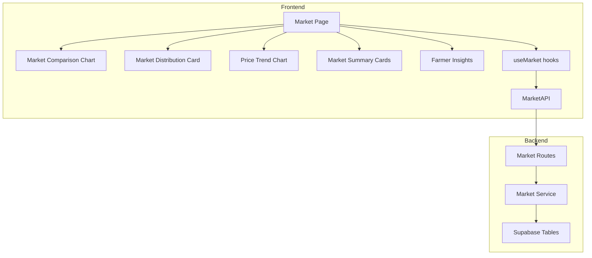
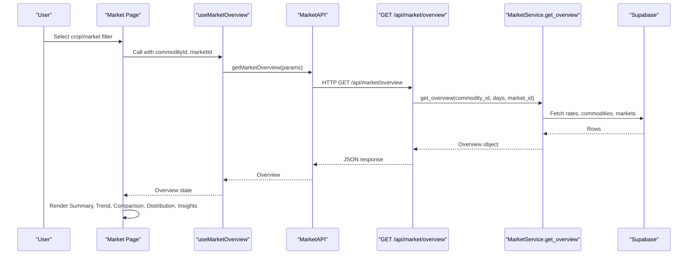
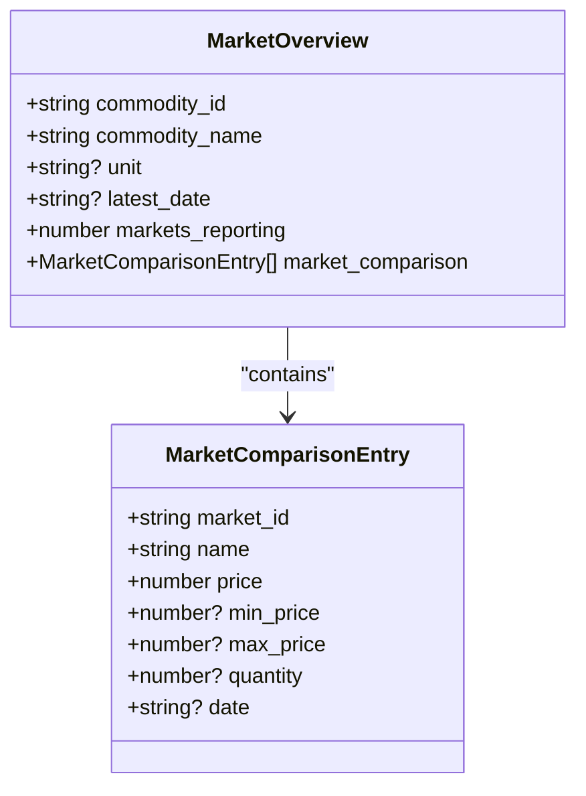
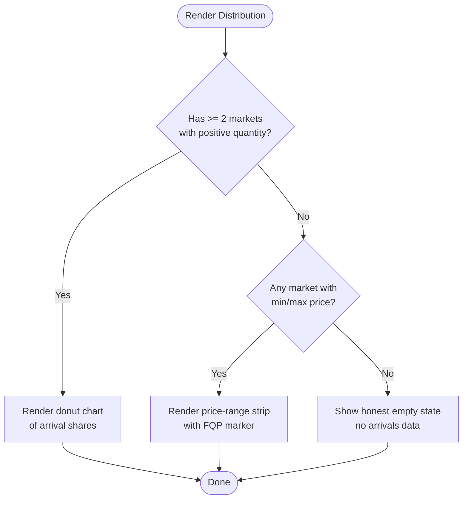
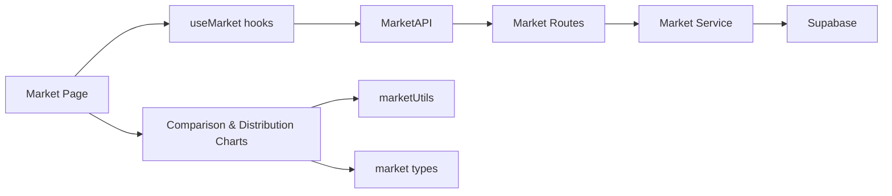

# Market Comparison Analysis

<cite>
**Referenced Files in This Document**
- [MarketComparisonChart.tsx](file://Frontend/greenflora/components/market/MarketComparisonChart.tsx)
- [MarketDistributionCard.tsx](file://Frontend/greenflora/components/market/MarketDistributionCard.tsx)
- [page.tsx](file://Frontend/greenflora/app/market/page.tsx)
- [market.ts](file://Frontend/greenflora/types/market.ts)
- [market.py](file://Backend/routes/market.py)
- [market_service.py](file://Backend/services/market_service.py)
- [market.py (schemas)](file://Backend/schemas/market.py)
- [useMarket.ts](file://Frontend/greenflora/Hooks/useMarket.ts)
- [MarketAPI.ts](file://Frontend/greenflora/services/MarketAPI.ts)
- [marketUtils.ts](file://Frontend/greenflora/lib/marketUtils.ts)
- [PriceTrendChart.tsx](file://Frontend/greenflora/components/market/PriceTrendChart.tsx)
- [MarketSummaryCards.tsx](file://Frontend/greenflora/components/market/MarketSummaryCards.tsx)
- [FarmerInsights.tsx](file://Frontend/greenflora/components/market/FarmerInsights.tsx)
</cite>

## Table of Contents
1. [Introduction](#introduction)
2. [Project Structure](#project-structure)
3. [Core Components](#core-components)
4. [Architecture Overview](#architecture-overview)
5. [Detailed Component Analysis](#detailed-component-analysis)
6. [Dependency Analysis](#dependency-analysis)
7. [Performance Considerations](#performance-considerations)
8. [Troubleshooting Guide](#troubleshooting-guide)
9. [Conclusion](#conclusion)

## Introduction
This document explains the Market Comparison and Distribution components that help farmers compare wholesale prices across markets, identify the best selling opportunities, and understand market concentration patterns. It covers how the comparison chart displays multiple market prices side-by-side, how the distribution card shows price spread analysis or arrivals share, and what data visualization techniques are used to support informed selling decisions. It also documents filtering, sorting, and export considerations based on the current implementation.

## Project Structure
The Market Intelligence feature is composed of:
- A Next.js page that orchestrates filters and renders summary cards, trend chart, comparison chart, distribution card, and farmer insights.
- Reusable UI components for comparison and distribution visualizations.
- Frontend hooks and API service to fetch market data from the backend.
- Backend routes and services that compute market overview metrics, comparisons, trends, and distributions from AMIS data.

**Diagram sources**
- [page.tsx:121-227](file://Frontend/greenflora/app/market/page.tsx#L121-L227)
- [MarketComparisonChart.tsx:71-186](file://Frontend/greenflora/components/market/MarketComparisonChart.tsx#L71-L186)
- [MarketDistributionCard.tsx:65-184](file://Frontend/greenflora/components/market/MarketDistributionCard.tsx#L65-L184)
- [PriceTrendChart.tsx:66-220](file://Frontend/greenflora/components/market/PriceTrendChart.tsx#L66-L220)
- [MarketSummaryCards.tsx:148-260](file://Frontend/greenflora/components/market/MarketSummaryCards.tsx#L148-L260)
- [FarmerInsights.tsx:19-61](file://Frontend/greenflora/components/market/FarmerInsights.tsx#L19-L61)
- [useMarket.ts:80-133](file://Frontend/greenflora/Hooks/useMarket.ts#L80-L133)
- [MarketAPI.ts:100-127](file://Frontend/greenflora/services/MarketAPI.ts#L100-L127)
- [market.py:38-107](file://Backend/routes/market.py#L38-L107)
- [market_service.py:158-343](file://Backend/services/market_service.py#L158-L343)

**Section sources**
- [page.tsx:121-227](file://Frontend/greenflora/app/market/page.tsx#L121-L227)
- [market.py:38-107](file://Backend/routes/market.py#L38-L107)

## Core Components
- Market Comparison Chart: Horizontal bar chart comparing today’s representative price per market, highlighting highest and lowest bars, with tooltips showing exact values and ranges when available.
- Market Distribution Card: Shows either a donut chart of arrival shares by market or a fallback price-range strip using real min/max prices when quantity data is not meaningful.
- Market Summary Cards: Displays current price, signal, change, highest/lowest markets, and spread.
- Price Trend Chart: Interactive area chart with period filters (7D/30D/3M/6M).
- Farmer Insights: Data-driven bullet points summarizing direction, best market, spread, and coverage.

Key data model fields used by these components include latest_date, market_comparison, distribution, trend, highest_market, lowest_market, spread_abs, spread_pct, and insights.

**Section sources**
- [market.ts:32-108](file://Frontend/greenflora/types/market.ts#L32-L108)
- [MarketComparisonChart.tsx:71-186](file://Frontend/greenflora/components/market/MarketComparisonChart.tsx#L71-L186)
- [MarketDistributionCard.tsx:65-184](file://Frontend/greenflora/components/market/MarketDistributionCard.tsx#L65-L184)
- [MarketSummaryCards.tsx:148-260](file://Frontend/greenflora/components/market/MarketSummaryCards.tsx#L148-L260)
- [PriceTrendChart.tsx:66-220](file://Frontend/greenflora/components/market/PriceTrendChart.tsx#L66-L220)
- [FarmerInsights.tsx:19-61](file://Frontend/greenflora/components/market/FarmerInsights.tsx#L19-L61)

## Architecture Overview
The frontend requests market data via hooks and an API client; the backend computes a comprehensive overview including comparison and distribution, then returns it to the UI.

**Diagram sources**
- [useMarket.ts:80-133](file://Frontend/greenflora/Hooks/useMarket.ts#L80-L133)
- [MarketAPI.ts:100-127](file://Frontend/greenflora/services/MarketAPI.ts#L100-L127)
- [market.py:69-107](file://Backend/routes/market.py#L69-L107)
- [market_service.py:158-343](file://Backend/services/market_service.py#L158-L343)

## Detailed Component Analysis

### Market Comparison Chart
Purpose:
- Compare today’s representative price across all reporting markets for the selected crop.
- Highlight the highest and lowest markets visually.
- Provide tooltips with exact PKR values and optional min–max range.

Data flow:
- The component receives an overview object containing market_comparison entries sorted by price descending.
- It maps each entry to include rank, isHighest, and isLowest flags for styling.
- Uses a horizontal bar chart with labels and a custom tooltip.

Visual behavior:
- Highest bar uses a strong accent color; lowest bar uses a distinct color; others use the crop-specific soft accent.
- Long lists scroll within the card; no market is hidden.

Interpretation guidance:
- Look at the top bar for the best selling price today.
- Hover to see the exact price and trading range if available.
- Use the “Highest” and “Lowest” badges to quickly spot the best and worst markets.

Export capability:
- No built-in export functionality is implemented in this component.

Filtering and sorting:
- Sorting is implicit: the backend sorts by price descending; the chart reflects this order.
- Filtering by specific market is handled at the page level for the trend series; the comparison chart always shows all markets for the selected crop.

**Section sources**
- [MarketComparisonChart.tsx:71-186](file://Frontend/greenflora/components/market/MarketComparisonChart.tsx#L71-L186)
- [market_service.py:292-322](file://Backend/services/market_service.py#L292-L322)
- [market.ts:32-41](file://Frontend/greenflora/types/market.ts#L32-L41)

#### Class Diagram: Comparison Data Model

**Diagram sources**
- [market.ts:32-41](file://Frontend/greenflora/types/market.ts#L32-L41)
- [market.ts:74-108](file://Frontend/greenflora/types/market.ts#L74-L108)

### Market Distribution Card
Purpose:
- Show market concentration through arrival shares when quantity data is meaningful.
- When quantity data is not meaningful, show a price-range strip using real min/max prices to avoid misleading visuals.

Behavior:
- If two or more markets report positive quantities, render a donut chart with legend and total arrivals.
- Otherwise, render a price-range strip where each market shows its trading range and the FQP marker.

Interpretation guidance:
- Donut view: Identify which markets dominate supply; higher share indicates larger volume.
- Range strip view: See each market’s min–max range and where the representative price falls; useful when arrivals are missing.

Export capability:
- No built-in export functionality is implemented in this component.

Filtering and sorting:
- Distribution is computed for the latest date; sorting is by quantity descending in the backend.

**Section sources**
- [MarketDistributionCard.tsx:65-184](file://Frontend/greenflora/components/market/MarketDistributionCard.tsx#L65-L184)
- [market_service.py:474-517](file://Backend/services/market_service.py#L474-L517)
- [market.ts:49-61](file://Frontend/greenflora/types/market.ts#L49-L61)

#### Flowchart: Distribution Rendering Logic

**Diagram sources**
- [MarketDistributionCard.tsx:71-184](file://Frontend/greenflora/components/market/MarketDistributionCard.tsx#L71-L184)
- [market_service.py:474-517](file://Backend/services/market_service.py#L474-L517)

### Market Summary Cards
Purpose:
- Present current price, signal, 7-day change, highest/lowest markets, and spread.

Highlights:
- Signal pill indicates rising/falling/stable or insufficient data.
- Spread shows absolute difference and percentage between highest and lowest markets.

Interpretation guidance:
- Combine signal and spread to assess whether there is a clear opportunity to sell in a higher-priced market.

**Section sources**
- [MarketSummaryCards.tsx:148-260](file://Frontend/greenflora/components/market/MarketSummaryCards.tsx#L148-L260)
- [market_service.py:314-332](file://Backend/services/market_service.py#L314-L332)

### Price Trend Chart
Purpose:
- Visualize price history with selectable periods (7D/30D/3M/6M).
- Scope trend to a single market or all-market average.

Features:
- Client-side slicing of the full 180-day trend for instant period switching.
- Honest empty states when insufficient history exists.

**Section sources**
- [PriceTrendChart.tsx:66-220](file://Frontend/greenflora/components/market/PriceTrendChart.tsx#L66-L220)
- [marketUtils.ts:129-144](file://Frontend/greenflora/lib/marketUtils.ts#L129-L144)

### Farmer Insights
Purpose:
- Provide concise, farmer-friendly takeaways derived from real data: direction, best market, spread, coverage.

Usage:
- Displayed below charts to summarize actionable information.

**Section sources**
- [FarmerInsights.tsx:19-61](file://Frontend/greenflora/components/market/FarmerInsights.tsx#L19-L61)
- [market_service.py:523-593](file://Backend/services/market_service.py#L523-L593)

## Dependency Analysis
High-level dependencies:
- Page depends on hooks and components to render the full market intelligence view.
- Hooks depend on MarketAPI to call backend endpoints.
- Backend routes delegate to MarketService for business logic and data aggregation.
- Types define contracts between frontend and backend.

**Diagram sources**
- [page.tsx:121-227](file://Frontend/greenflora/app/market/page.tsx#L121-L227)
- [useMarket.ts:80-133](file://Frontend/greenflora/Hooks/useMarket.ts#L80-L133)
- [MarketAPI.ts:100-127](file://Frontend/greenflora/services/MarketAPI.ts#L100-L127)
- [market.py:38-107](file://Backend/routes/market.py#L38-L107)
- [market_service.py:158-343](file://Backend/services/market_service.py#L158-L343)

**Section sources**
- [market.ts:74-108](file://Frontend/greenflora/types/market.ts#L74-L108)
- [market.py (schemas):92-132](file://Backend/schemas/market.py#L92-L132)

## Performance Considerations
- Caching: The backend caches commodities and markets lookups with a short TTL to keep the crop selector responsive.
- Pagination: Rate scans are paginated to handle large datasets safely.
- Client-side slicing: Trend period switching is instant because the full 180-day series is fetched once and sliced locally.
- Honest empty states: Avoids rendering misleading charts when data is insufficient, reducing confusion and re-renders.

[No sources needed since this section provides general guidance]

## Troubleshooting Guide
Common issues and resolutions:
- No market prices yet: The page shows an empty state until AMIS data is ingested; users can refresh the commodities list.
- Insufficient history: Trend chart shows an honest message when only one day of data is available.
- Missing arrivals data: Distribution card falls back to a price-range strip rather than showing a misleading donut.
- Network errors: The API client classifies errors (network, timeout, validation, server) and surfaces user-friendly messages.

Actions:
- Refresh commodities or overview data using provided controls.
- Verify that the AMIS pipeline has run and Supabase is configured.
- Check browser console for detailed error types returned by the API client.

**Section sources**
- [page.tsx:147-163](file://Frontend/greenflora/app/market/page.tsx#L147-L163)
- [PriceTrendChart.tsx:186-201](file://Frontend/greenflora/components/market/PriceTrendChart.tsx#L186-L201)
- [MarketDistributionCard.tsx:163-184](file://Frontend/greenflora/components/market/MarketDistributionCard.tsx#L163-L184)
- [MarketAPI.ts:22-94](file://Frontend/greenflora/services/MarketAPI.ts#L22-L94)

## Conclusion
The Market Comparison and Distribution components provide farmers with clear, data-driven insights to compare prices across markets and decide where to sell. The comparison chart highlights the best and worst prices, while the distribution card reveals market concentration or price ranges depending on available data. Combined with summary cards, trend analysis, and farmer insights, users can make informed selling decisions. Filtering is supported via crop and market selection; sorting is driven by backend computations. Export functionality is not currently implemented but could be added to support reporting needs.

[No sources needed since this section summarizes without analyzing specific files]