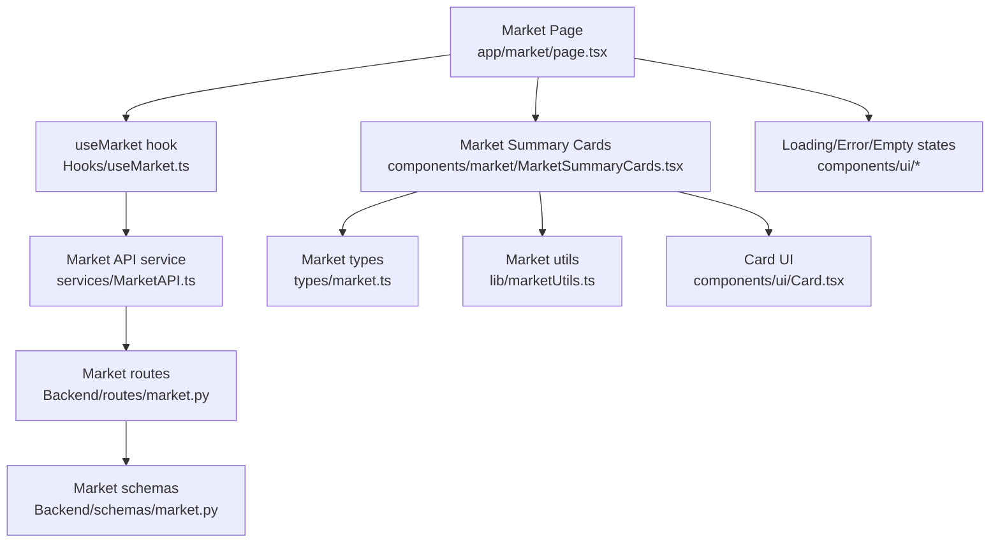
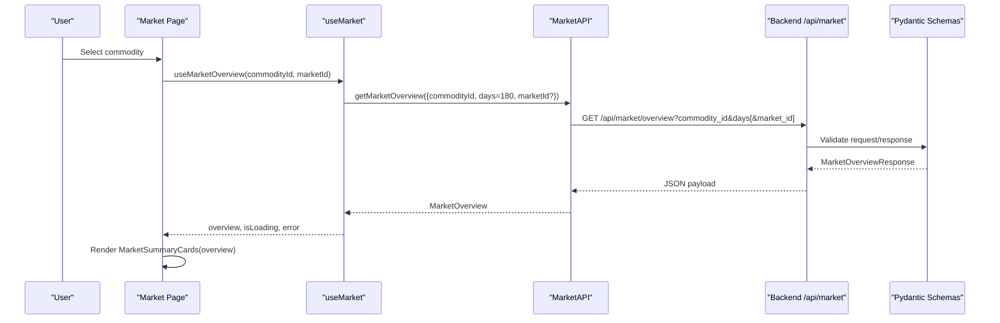
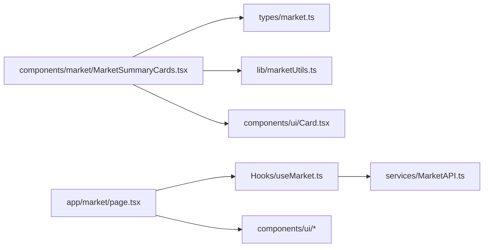
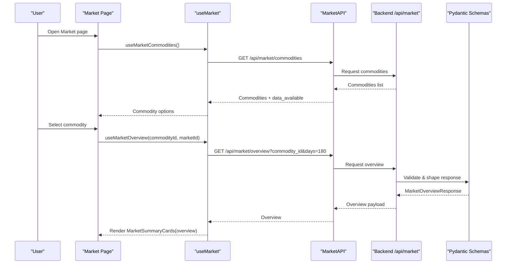

# Market Data Display

<cite>
**Referenced Files in This Document**
- [MarketSummaryCards.tsx](file://Frontend/greenflora/components/market/MarketSummaryCards.tsx)
- [market.ts](file://Frontend/greenflora/types/market.ts)
- [MarketAPI.ts](file://Frontend/greenflora/services/MarketAPI.ts)
- [useMarket.ts](file://Frontend/greenflora/Hooks/useMarket.ts)
- [page.tsx](file://Frontend/greenflora/app/market/page.tsx)
- [market.py (routes)](file://Backend/routes/market.py)
- [market.py (schemas)](file://Backend/schemas/market.py)
- [marketUtils.ts](file://Frontend/greenflora/lib/marketUtils.ts)
- [Card.tsx](file://Frontend/greenflora/components/ui/Card.tsx)
- [LoadingState.tsx](file://Frontend/greenflora/components/ui/LoadingState.tsx)
- [ErrorState.tsx](file://Frontend/greenflora/components/ui/ErrorState.tsx)
- [EmptyState.tsx](file://Frontend/greenflora/components/ui/EmptyState.tsx)
</cite>

## Table of Contents
1. [Introduction](#introduction)
2. [Project Structure](#project-structure)
3. [Core Components](#core-components)
4. [Architecture Overview](#architecture-overview)
5. [Detailed Component Analysis](#detailed-component-analysis)
6. [Dependency Analysis](#dependency-analysis)
7. [Performance Considerations](#performance-considerations)
8. [Troubleshooting Guide](#troubleshooting-guide)
9. [Conclusion](#conclusion)
10. [Appendices](#appendices)

## Introduction
This document explains the Market Summary Cards component that displays key market metrics and current prices for a selected crop. It covers how price information, market signals, high/low values, and price spreads are rendered in a responsive card layout. It also documents the expected data structure from the market overview API, visual design patterns for positive/negative trends and market conditions, responsive behavior across screen sizes, and handling of loading, error, and empty states. Accessibility considerations for financial data display and mobile responsiveness patterns are included.

## Project Structure
The Market Summary Cards component is part of the Market Intelligence feature. The page composes several components: commodity selection, summary cards, trend chart, market comparison, distribution, and insights. Data flows from backend routes to frontend hooks and services into the UI.

**Diagram sources**
- [page.tsx:121-227](file://Frontend/greenflora/app/market/page.tsx#L121-L227)
- [useMarket.ts:80-133](file://Frontend/greenflora/Hooks/useMarket.ts#L80-L133)
- [MarketAPI.ts:116-127](file://Frontend/greenflora/services/MarketAPI.ts#L116-L127)
- [market.py (routes):69-107](file://Backend/routes/market.py#L69-L107)
- [market.py (schemas):92-131](file://Backend/schemas/market.py#L92-L131)
- [market.ts:73-108](file://Frontend/greenflora/types/market.ts#L73-L108)
- [marketUtils.ts:21-93](file://Frontend/greenflora/lib/marketUtils.ts#L21-L93)
- [MarketSummaryCards.tsx:148-261](file://Frontend/greenflora/components/market/MarketSummaryCards.tsx#L148-L261)
- [Card.tsx:25-37](file://Frontend/greenflora/components/ui/Card.tsx#L25-L37)

**Section sources**
- [page.tsx:121-227](file://Frontend/greenflora/app/market/page.tsx#L121-L227)
- [useMarket.ts:80-133](file://Frontend/greenflora/Hooks/useMarket.ts#L80-L133)
- [MarketAPI.ts:116-127](file://Frontend/greenflora/services/MarketAPI.ts#L116-L127)
- [market.py (routes):69-107](file://Backend/routes/market.py#L69-L107)
- [market.py (schemas):92-131](file://Backend/schemas/market.py#L92-L131)
- [market.ts:73-108](file://Frontend/greenflora/types/market.ts#L73-L108)
- [marketUtils.ts:21-93](file://Frontend/greenflora/lib/marketUtils.ts#L21-L93)
- [MarketSummaryCards.tsx:148-261](file://Frontend/greenflora/components/market/MarketSummaryCards.tsx#L148-L261)
- [Card.tsx:25-37](file://Frontend/greenflora/components/ui/Card.tsx#L25-L37)

## Core Components
- Market Summary Cards: Renders six tiles showing current price with signal, price per kg, 7-day change, highest market, lowest market, and market spread. Uses responsive grid and gradient accent based on crop identity.
- Market API service: Fetches commodities and overview data with timeouts and typed errors.
- Hooks: Manage loading, error, and refresh state; fetch overview once with maximum window and slice client-side.
- Utilities: Format PKR, change percentages, dates, and derive crop-specific accents and basis labels.
- UI primitives: Card wrapper, skeleton/error/empty states for consistent UX.

Key responsibilities:
- Present AMIS-derived numbers honestly with null-safe placeholders.
- Apply color coding for positive/negative changes and market signals.
- Provide responsive layouts for small to large screens.
- Handle loading, error, and empty scenarios gracefully.

**Section sources**
- [MarketSummaryCards.tsx:148-261](file://Frontend/greenflora/components/market/MarketSummaryCards.tsx#L148-L261)
- [MarketAPI.ts:22-94](file://Frontend/greenflora/services/MarketAPI.ts#L22-L94)
- [useMarket.ts:33-63](file://Frontend/greenflora/Hooks/useMarket.ts#L33-L63)
- [marketUtils.ts:21-93](file://Frontend/greenflora/lib/marketUtils.ts#L21-L93)
- [Card.tsx:25-37](file://Frontend/greenflora/components/ui/Card.tsx#L25-L37)
- [LoadingState.tsx:14-43](file://Frontend/greenflora/components/ui/LoadingState.tsx#L14-L43)
- [ErrorState.tsx:11-36](file://Frontend/greenflora/components/ui/ErrorState.tsx#L11-L36)
- [EmptyState.tsx:12-31](file://Frontend/greenflora/components/ui/EmptyState.tsx#L12-L31)

## Architecture Overview
The Market Summary Cards consume a MarketOverview object produced by the backend /api/market/overview endpoint. The page orchestrates data fetching via useMarket, which calls MarketAPI.getMarketOverview. The backend route validates parameters, delegates to the service layer, and returns a response shaped by Pydantic schemas. The frontend types mirror these schemas to ensure type safety.

**Diagram sources**
- [page.tsx:89-97](file://Frontend/greenflora/app/market/page.tsx#L89-L97)
- [useMarket.ts:99-133](file://Frontend/greenflora/Hooks/useMarket.ts#L99-L133)
- [MarketAPI.ts:116-127](file://Frontend/greenflora/services/MarketAPI.ts#L116-L127)
- [market.py (routes):69-107](file://Backend/routes/market.py#L69-L107)
- [market.py (schemas):92-131](file://Backend/schemas/market.py#L92-L131)

## Detailed Component Analysis

### Market Summary Cards Rendering Logic
- Current price tile: Displays formatted currency using PKR formatter, unit label derived from price_basis and unit, latest date, and a signal pill indicating rising/falling/stable or insufficient data. The tile uses a gradient background colored by crop accent.
- Price per kg tile: Converts the 100 kg rate to per kg and formats with two decimals.
- Price change tile: Shows percentage change with sign and color-coded tone (success for positive, danger for negative, neutral for zero/missing). Includes context about the period or basis when available.
- Highest/Lowest markets: Show market name and price with appropriate semantic colors (success/danger).
- Market spread: Displays absolute spread and percentage if at least two markets report; otherwise shows a placeholder.

Responsive layout:
- Grid adapts from 2 columns on small screens to 3 on medium, up to 6 on extra-large screens.
- First tile spans 2 columns on small/medium and collapses to 1 column on xl for emphasis.
- Spread tile spans 2 columns on small and 1 on lg+.

Visual design patterns:
- Positive change: green text and upward arrow icon.
- Negative change: red text and downward arrow icon.
- Signal pill: distinct badges for rising/falling/stable/insufficient data with matching icons and colors.
- Crop accent: dynamic gradient and colors based on crop keywords.

Null safety:
- All numeric fields handle null/undefined with fallbacks like “—” or descriptive messages.

Accessibility:
- Use of semantic colors conveys meaning but should be supplemented with text labels and icons for clarity.
- Ensure sufficient contrast for colored badges and gradient tiles.
- Screen readers will read labels and values; consider adding aria-labels where needed for complex visuals.

**Section sources**
- [MarketSummaryCards.tsx:40-100](file://Frontend/greenflora/components/market/MarketSummaryCards.tsx#L40-L100)
- [MarketSummaryCards.tsx:148-261](file://Frontend/greenflora/components/market/MarketSummaryCards.tsx#L148-L261)
- [marketUtils.ts:21-93](file://Frontend/greenflora/lib/marketUtils.ts#L21-L93)
- [marketUtils.ts:150-329](file://Frontend/greenflora/lib/marketUtils.ts#L150-L329)

### Data Structure Expected from Market Overview API
The component expects a MarketOverview object with the following relevant fields:
- commodity_name, unit: For labeling and formatting.
- latest_date: For displaying the date of the current price.
- current_price: Representative price; may be null.
- price_basis: How the representative price was derived; used to compute human-readable basis label.
- change_pct, change_period_days: Percentage change over a period; may be null.
- signal: One of rising, falling, stable, insufficient_data.
- highest_market, lowest_market: Objects with name and price; may be null.
- spread_abs, spread_pct: Absolute and percentage spread between markets; may be null.
- trend, market_comparison, distribution, insights: Used by other components but not required for summary cards.

These fields map directly to backend schemas and frontend types, ensuring consistency.

**Section sources**
- [market.ts:73-108](file://Frontend/greenflora/types/market.ts#L73-L108)
- [market.py (schemas):92-131](file://Backend/schemas/market.py#L92-L131)

### Visual Design Patterns for Trends and Signals
- Change percentage: Color-coded with success (positive), danger (negative), neutral (zero/missing). Icons reflect direction.
- Signal pill: Consistent badge styling with icons and labels for rising/falling/stable/insufficient data.
- Crop accent: Gradient backgrounds and colors vary by crop category to provide visual identity.

Implementation references:
- Change tone logic and icons.
- Signal pill rendering with variants for gradient and default contexts.
- Crop accent mapping and gradient application.

**Section sources**
- [MarketSummaryCards.tsx:153-181](file://Frontend/greenflora/components/market/MarketSummaryCards.tsx#L153-L181)
- [MarketSummaryCards.tsx:40-100](file://Frontend/greenflora/components/market/MarketSummaryCards.tsx#L40-L100)
- [marketUtils.ts:150-329](file://Frontend/greenflora/lib/marketUtils.ts#L150-L329)

### Responsive Behavior Across Screen Sizes
- Grid breakpoints: 2 columns on small screens, 3 on medium, up to 6 on extra-large.
- Spanning: First tile spans 2 columns on smaller screens and 1 on xl; spread tile spans 2 on small and 1 on lg+.
- Text truncation and sizing adapt to available space.

**Section sources**
- [MarketSummaryCards.tsx:163-259](file://Frontend/greenflora/components/market/MarketSummaryCards.tsx#L163-L259)

### Loading, Error, and Empty States
- Loading: Skeleton placeholders mimic card shapes and stat lines; shown while overview is being fetched.
- Error: Alert-style banner with message and retry action; accessible role="alert".
- Empty: Centered message explaining no data yet and offering a refresh action.

Integration points:
- Page renders skeletons during initial load and overview loading.
- Errors bubble up from hooks and are displayed via ErrorState.
- Empty state appears when no commodities are available or data pipeline has not run.

**Section sources**
- [page.tsx:127-163](file://Frontend/greenflora/app/market/page.tsx#L127-L163)
- [page.tsx:189-204](file://Frontend/greenflora/app/market/page.tsx#L189-L204)
- [LoadingState.tsx:14-43](file://Frontend/greenflora/components/ui/LoadingState.tsx#L14-L43)
- [ErrorState.tsx:11-36](file://Frontend/greenflora/components/ui/ErrorState.tsx#L11-L36)
- [EmptyState.tsx:12-31](file://Frontend/greenflora/components/ui/EmptyState.tsx#L12-L31)

### Accessibility Considerations for Financial Data
- Use clear labels for each metric (e.g., “Current price”, “Price change”).
- Combine color with text and icons to convey meaning (e.g., “+4.2%” with green and upward arrow).
- Ensure adequate contrast for colored badges and gradient tiles.
- Provide meaningful alt text for any decorative icons if they carry meaning.
- Make interactive elements (retry buttons) keyboard accessible and focusable.

[No sources needed since this section provides general guidance]

## Dependency Analysis
The component depends on:
- Types: MarketOverview, MarketSignal, PriceBasis.
- Services: MarketAPI for fetching overview data.
- Hooks: useMarket for state management and data fetching.
- Utilities: Formatting functions and crop accent mapping.
- UI primitives: Card wrapper and shared state components.

**Diagram sources**
- [market.ts:73-108](file://Frontend/greenflora/types/market.ts#L73-L108)
- [marketUtils.ts:21-93](file://Frontend/greenflora/lib/marketUtils.ts#L21-L93)
- [MarketAPI.ts:116-127](file://Frontend/greenflora/services/MarketAPI.ts#L116-L127)
- [useMarket.ts:80-133](file://Frontend/greenflora/Hooks/useMarket.ts#L80-L133)
- [page.tsx:121-227](file://Frontend/greenflora/app/market/page.tsx#L121-L227)
- [MarketSummaryCards.tsx:148-261](file://Frontend/greenflora/components/market/MarketSummaryCards.tsx#L148-L261)
- [Card.tsx:25-37](file://Frontend/greenflora/components/ui/Card.tsx#L25-L37)

**Section sources**
- [market.ts:73-108](file://Frontend/greenflora/types/market.ts#L73-L108)
- [marketUtils.ts:21-93](file://Frontend/greenflora/lib/marketUtils.ts#L21-L93)
- [MarketAPI.ts:116-127](file://Frontend/greenflora/services/MarketAPI.ts#L116-L127)
- [useMarket.ts:80-133](file://Frontend/greenflora/Hooks/useMarket.ts#L80-L133)
- [page.tsx:121-227](file://Frontend/greenflora/app/market/page.tsx#L121-L227)
- [MarketSummaryCards.tsx:148-261](file://Frontend/greenflora/components/market/MarketSummaryCards.tsx#L148-L261)
- [Card.tsx:25-37](file://Frontend/greenflora/components/ui/Card.tsx#L25-L37)

## Performance Considerations
- Single fetch with maximum window: The hook fetches a 180-day overview once and slices client-side for different periods, making filter switching instant without additional network requests.
- Null-safe formatting: Avoids unnecessary computations and prevents re-renders due to invalid values.
- Lightweight components: StatTile wraps content in a reusable Card with minimal overhead.
- Efficient grid: Tailwind responsive classes reduce layout complexity and improve performance across devices.

[No sources needed since this section provides general guidance]

## Troubleshooting Guide
Common issues and resolutions:
- No data yet: Empty state indicates the pipeline has not ingested data; user can refresh.
- Network errors: ErrorState displays a message and retry button; check connectivity and backend availability.
- Timeout errors: MarketAPI classifies timeouts and surfaces friendly messages; adjust timeout if necessary.
- Missing fields: Component handles null values gracefully; verify backend schema and data completeness.

Backend error handling:
- Route handlers return 404 for missing commodities and 503 for temporary unavailability; frontend maps these to user-friendly states.

**Section sources**
- [MarketAPI.ts:22-94](file://Frontend/greenflora/services/MarketAPI.ts#L22-L94)
- [market.py (routes):38-62](file://Backend/routes/market.py#L38-L62)
- [market.py (routes):69-107](file://Backend/routes/market.py#L69-L107)
- [ErrorState.tsx:11-36](file://Frontend/greenflora/components/ui/ErrorState.tsx#L11-L36)
- [EmptyState.tsx:12-31](file://Frontend/greenflora/components/ui/EmptyState.tsx#L12-L31)

## Conclusion
The Market Summary Cards component delivers a clear, responsive, and accessible presentation of key market metrics. It relies on a well-defined data contract from the backend, uses robust formatting utilities, and integrates seamlessly with loading, error, and empty states. The design emphasizes honesty in data representation, with null-safe placeholders and transparent signal indicators. The architecture supports efficient data fetching and client-side slicing for quick interactions.

[No sources needed since this section summarizes without analyzing specific files]

## Appendices

### Data Flow Sequence for Market Overview

**Diagram sources**
- [page.tsx:47-97](file://Frontend/greenflora/app/market/page.tsx#L47-L97)
- [useMarket.ts:33-63](file://Frontend/greenflora/Hooks/useMarket.ts#L33-L63)
- [useMarket.ts:99-133](file://Frontend/greenflora/Hooks/useMarket.ts#L99-L133)
- [MarketAPI.ts:100-127](file://Frontend/greenflora/services/MarketAPI.ts#L100-L127)
- [market.py (routes):38-107](file://Backend/routes/market.py#L38-L107)
- [market.py (schemas):22-44](file://Backend/schemas/market.py#L22-L44)
- [market.py (schemas):92-131](file://Backend/schemas/market.py#L92-L131)