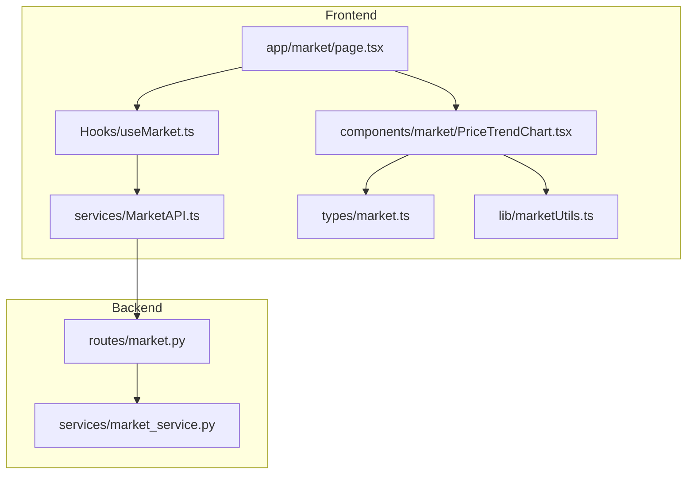
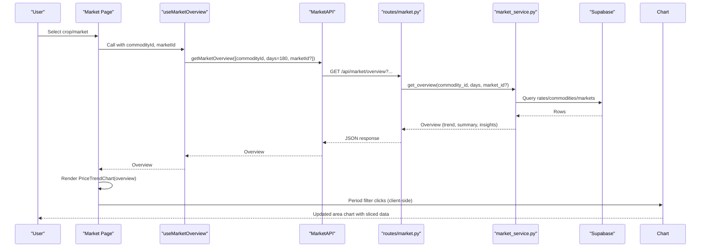
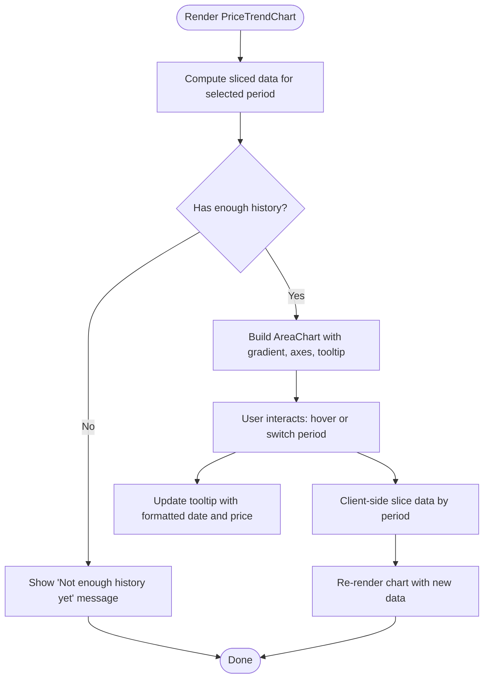
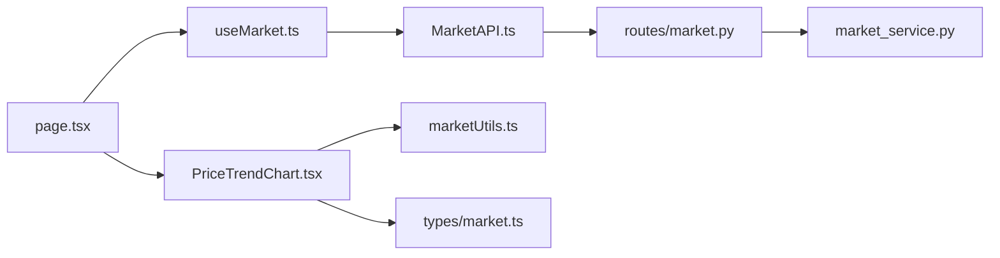

# Price Trend Visualization

<cite>
**Referenced Files in This Document**
- [PriceTrendChart.tsx](file://Frontend/greenflora/components/market/PriceTrendChart.tsx)
- [useMarket.ts](file://Frontend/greenflora/Hooks/useMarket.ts)
- [MarketAPI.ts](file://Frontend/greenflora/services/MarketAPI.ts)
- [market.ts](file://Frontend/greenflora/types/market.ts)
- [marketUtils.ts](file://Frontend/greenflora/lib/marketUtils.ts)
- [page.tsx](file://Frontend/greenflora/app/market/page.tsx)
- [market_service.py](file://Backend/services/market_service.py)
- [market.py](file://Backend/routes/market.py)
</cite>

## Table of Contents
1. [Introduction](#introduction)
2. [Project Structure](#project-structure)
3. [Core Components](#core-components)
4. [Architecture Overview](#architecture-overview)
5. [Detailed Component Analysis](#detailed-component-analysis)
6. [Dependency Analysis](#dependency-analysis)
7. [Performance Considerations](#performance-considerations)
8. [Troubleshooting Guide](#troubleshooting-guide)
9. [Conclusion](#conclusion)

## Introduction
This document explains the Price Trend Chart component that visualizes historical commodity price data using Recharts. It covers chart configuration, time series formatting, axis scaling, interactive features (hover tooltips and period filters), handling of different data ranges, date formatting for agricultural markets, trend calculations, integration with market hooks, customization options, responsive behavior, performance considerations, caching strategies, and user interaction patterns for exploring price trends across time periods.

## Project Structure
The Price Trend feature spans frontend components, hooks, services, types, utilities, and backend routes and services:

- Frontend
  - Page orchestrating Market Intelligence UI and rendering charts
  - PriceTrendChart component for the area chart
  - useMarket hook to fetch overview data
  - MarketAPI service to call backend endpoints
  - Types defining shapes for market data
  - Utilities for formatting dates, currency, and slicing trends
- Backend
  - Routes exposing /api/market endpoints
  - Service computing overview, trend, signals, and distributions from Supabase

**Diagram sources**
- [page.tsx:121-228](file://Frontend/greenflora/app/market/page.tsx#L121-L228)
- [PriceTrendChart.tsx:66-222](file://Frontend/greenflora/components/market/PriceTrendChart.tsx#L66-L222)
- [useMarket.ts:80-134](file://Frontend/greenflora/Hooks/useMarket.ts#L80-L134)
- [MarketAPI.ts:116-127](file://Frontend/greenflora/services/MarketAPI.ts#L116-L127)
- [market.py:69-107](file://Backend/routes/market.py#L69-L107)
- [market_service.py:158-343](file://Backend/services/market_service.py#L158-L343)

**Section sources**
- [page.tsx:121-228](file://Frontend/greenflora/app/market/page.tsx#L121-L228)
- [PriceTrendChart.tsx:66-222](file://Frontend/greenflora/components/market/PriceTrendChart.tsx#L66-L222)
- [useMarket.ts:80-134](file://Frontend/greenflora/Hooks/useMarket.ts#L80-L134)
- [MarketAPI.ts:116-127](file://Frontend/greenflora/services/MarketAPI.ts#L116-L127)
- [market.py:69-107](file://Backend/routes/market.py#L69-L107)
- [market_service.py:158-343](file://Backend/services/market_service.py#L158-L343)

## Core Components
- PriceTrendChart: Renders an AreaChart with a gradient fill, responsive container, X/Y axes, tooltips, and period filter tabs. Handles empty states when insufficient history exists.
- useMarketOverview: Fetches the full market overview (trend + summary) once per crop/market filter with a maximum window; client-side period switching is instant.
- MarketAPI.getMarketOverview: Builds query parameters and calls the backend endpoint with optional market scoping.
- marketUtils: Provides date formatting, PKR formatting, crop accent colors, and sliceTrendForPeriod for client-side filtering.
- Backend market_service: Computes representative prices, trend series, change/signal, distribution, and insights from AMIS data stored in Supabase.

Key responsibilities:
- Data fetching and state management via hooks
- Rendering interactive chart with responsive layout
- Formatting and slicing data for display
- Computing business logic on the backend (trend, signal, insights)

**Section sources**
- [PriceTrendChart.tsx:66-222](file://Frontend/greenflora/components/market/PriceTrendChart.tsx#L66-L222)
- [useMarket.ts:80-134](file://Frontend/greenflora/Hooks/useMarket.ts#L80-L134)
- [MarketAPI.ts:116-127](file://Frontend/greenflora/services/MarketAPI.ts#L116-L127)
- [marketUtils.ts:129-144](file://Frontend/greenflora/lib/marketUtils.ts#L129-L144)
- [market_service.py:398-417](file://Backend/services/market_service.py#L398-L417)

## Architecture Overview
End-to-end flow from user selection to chart rendering:

**Diagram sources**
- [useMarket.ts:99-127](file://Frontend/greenflora/Hooks/useMarket.ts#L99-L127)
- [MarketAPI.ts:116-127](file://Frontend/greenflora/services/MarketAPI.ts#L116-L127)
- [market.py:69-107](file://Backend/routes/market.py#L69-L107)
- [market_service.py:158-343](file://Backend/services/market_service.py#L158-L343)
- [page.tsx:207-226](file://Frontend/greenflora/app/market/page.tsx#L207-L226)
- [PriceTrendChart.tsx:73-76](file://Frontend/greenflora/components/market/PriceTrendChart.tsx#L73-L76)

## Detailed Component Analysis

### PriceTrendChart Component
Responsibilities:
- Displays an area chart with gradient fill based on crop accent color
- Uses ResponsiveContainer for responsive sizing
- Configures XAxis with date formatting and YAxis with compact PKR formatting
- Shows hover tooltip with formatted date and price
- Implements period filter tabs (7D, 30D, 3M, 6M) for client-side slicing
- Handles empty states when there is insufficient history

Chart configuration highlights:
- AreaChart with monotone type and animationDuration
- Gradient fill defined per commodity id
- CartesianGrid with dashed lines and subtle vertical grid
- XAxis tickFormatter switches between short date and month labels depending on period length
- YAxis domain auto-scaled with compact formatting
- Tooltip content custom component showing formatted values

Data handling:
- Uses useMemo to compute sliced data for selected period
- Checks hasHistory and hasMinData to decide whether to render chart or empty state
- Uses formatMarketDate and formatPKR for consistent presentation

Customization:
- Crop accent colors derived from utility mapping
- Tailwind classes for styling tabs, cards, and typography
- Responsive design via ResponsiveContainer

**Diagram sources**
- [PriceTrendChart.tsx:73-80](file://Frontend/greenflora/components/market/PriceTrendChart.tsx#L73-L80)
- [PriceTrendChart.tsx:123-202](file://Frontend/greenflora/components/market/PriceTrendChart.tsx#L123-L202)
- [marketUtils.ts:129-144](file://Frontend/greenflora/lib/marketUtils.ts#L129-L144)

**Section sources**
- [PriceTrendChart.tsx:66-222](file://Frontend/greenflora/components/market/PriceTrendChart.tsx#L66-L222)
- [marketUtils.ts:99-144](file://Frontend/greenflora/lib/marketUtils.ts#L99-L144)

### useMarket Hook
Responsibilities:
- Loads commodities list and market overview
- Manages loading/error states and refresh capability
- Ensures only current filter results are shown to avoid stale data
- Fetches maximum 180-day window once and slices client-side for instant period changes

Integration points:
- Calls MarketAPI.getMarketCommodities and getMarketOverview
- Exposes overview, isLoading, error, refresh to consumers

Error handling:
- Sets error messages on failure
- Guards against out-of-order responses using request IDs

**Section sources**
- [useMarket.ts:33-64](file://Frontend/greenflora/Hooks/useMarket.ts#L33-L64)
- [useMarket.ts:80-134](file://Frontend/greenflora/Hooks/useMarket.ts#L80-L134)

### MarketAPI Service
Responsibilities:
- Centralized HTTP client for market endpoints
- Adds Authorization header if token present
- Classifies errors into network/timeout/validation/server categories
- Builds query parameters for overview endpoint including optional market scoping

Timeouts and retries:
- Uses AbortController with timeout
- Throws typed MarketApiError with status and type

**Section sources**
- [MarketAPI.ts:22-94](file://Frontend/greenflora/services/MarketAPI.ts#L22-L94)
- [MarketAPI.ts:116-127](file://Frontend/greenflora/services/MarketAPI.ts#L116-L127)

### Types and Utilities
Types:
- MarketOverview includes trend array, market comparison, distribution, insights, and coverage metadata
- MarketPeriod defines available filters and their day spans

Utilities:
- Date formatting for market context (en-PK locale)
- PKR formatting with compact variants for axes
- Client-side sliceTrendForPeriod for instant period switching
- Crop accent mapping for visual consistency

**Section sources**
- [market.ts:73-119](file://Frontend/greenflora/types/market.ts#L73-L119)
- [marketUtils.ts:21-144](file://Frontend/greenflora/lib/marketUtils.ts#L21-L144)

### Backend Service and Routes
Routes:
- GET /api/market/commodities returns crops with latest info
- GET /api/market/overview returns full intelligence bundle for one crop

Service:
- Computes representative price using FQP or midpoint of min/max
- Builds daily trend series per market or all-market average
- Calculates percent change over ~7 days and derives signal (rising/falling/stable)
- Generates farmer-friendly insights based on real data
- Caches commodities and markets lookup with TTL

Data integrity:
- Never fabricates prices or trends
- Returns honest empty states when data is missing

**Section sources**
- [market.py:38-107](file://Backend/routes/market.py#L38-L107)
- [market_service.py:47-45](file://Backend/services/market_service.py#L47-L45)
- [market_service.py:158-343](file://Backend/services/market_service.py#L158-L343)
- [market_service.py:398-468](file://Backend/services/market_service.py#L398-L468)

## Dependency Analysis
Component relationships and coupling:

- page.tsx depends on useMarket and PriceTrendChart
- useMarket depends on MarketAPI
- PriceTrendChart depends on marketUtils and types
- MarketAPI depends on routes
- routes depend on service

Potential circular dependencies: None observed; clear layering from UI to service.

External dependencies:
- Recharts for charting
- Supabase via backend service for data persistence
- FastAPI for backend routing

**Diagram sources**
- [page.tsx:121-228](file://Frontend/greenflora/app/market/page.tsx#L121-L228)
- [useMarket.ts:80-134](file://Frontend/greenflora/Hooks/useMarket.ts#L80-L134)
- [MarketAPI.ts:116-127](file://Frontend/greenflora/services/MarketAPI.ts#L116-L127)
- [market.py:69-107](file://Backend/routes/market.py#L69-L107)
- [market_service.py:158-343](file://Backend/services/market_service.py#L158-L343)

**Section sources**
- [page.tsx:121-228](file://Frontend/greenflora/app/market/page.tsx#L121-L228)
- [useMarket.ts:80-134](file://Frontend/greenflora/Hooks/useMarket.ts#L80-L134)
- [MarketAPI.ts:116-127](file://Frontend/greenflora/services/MarketAPI.ts#L116-L127)
- [market.py:69-107](file://Backend/routes/market.py#L69-L107)
- [market_service.py:158-343](file://Backend/services/market_service.py#L158-L343)

## Performance Considerations
- Client-side period slicing: The hook fetches up to 180 days once; switching periods uses sliceTrendForPeriod for instant updates without additional network calls.
- Responsive rendering: ResponsiveContainer ensures efficient reflows and avoids unnecessary recalculations.
- Animation duration: Area animations set to moderate durations to balance responsiveness and smoothness.
- Backend pagination and caps: Service paginates rate scans and caps rows to prevent excessive memory usage.
- Caching: Commodities and markets lookups cached with TTL to reduce database load.
- Error timeouts: Requests abort after a configured timeout to avoid hanging UI.

Recommendations:
- Keep trend data minimal by relying on backend aggregation where possible
- Debounce rapid period changes if needed to avoid excessive re-renders
- Monitor chart size and consider virtualization if datasets grow significantly beyond current expectations

[No sources needed since this section provides general guidance]

## Troubleshooting Guide
Common issues and resolutions:
- No data available: The page shows an empty state when no AMIS data has been ingested; users can retry fetching commodities.
- Insufficient history: When only one day of data exists, the chart displays an honest message instead of a misleading line.
- Network errors: MarketAPI classifies errors and surfaces friendly messages; users can retry via provided actions.
- Stale data: useMarket guards against out-of-order responses using request IDs to ensure UI reflects current filters.

Debugging tips:
- Verify environment variables for API base URL
- Check browser console for MarketApiError details
- Confirm Supabase configuration on backend for data availability

**Section sources**
- [MarketAPI.ts:22-94](file://Frontend/greenflora/services/MarketAPI.ts#L22-L94)
- [useMarket.ts:99-127](file://Frontend/greenflora/Hooks/useMarket.ts#L99-L127)
- [page.tsx:147-163](file://Frontend/greenflora/app/market/page.tsx#L147-L163)
- [PriceTrendChart.tsx:186-202](file://Frontend/greenflora/components/market/PriceTrendChart.tsx#L186-L202)

## Conclusion
The Price Trend Chart component delivers an interactive, responsive visualization of historical commodity prices with careful attention to data integrity, performance, and user experience. It integrates seamlessly with market hooks and backend services to provide accurate trend lines, meaningful tooltips, and customizable appearance. Client-side period filtering ensures instant interactions, while backend computations guarantee reliable signals and insights. The design supports large datasets through pagination and caching, and handles edge cases gracefully with honest empty states.