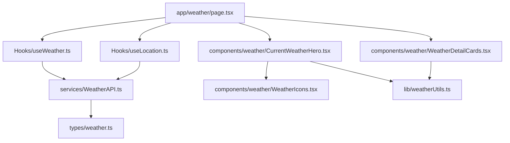
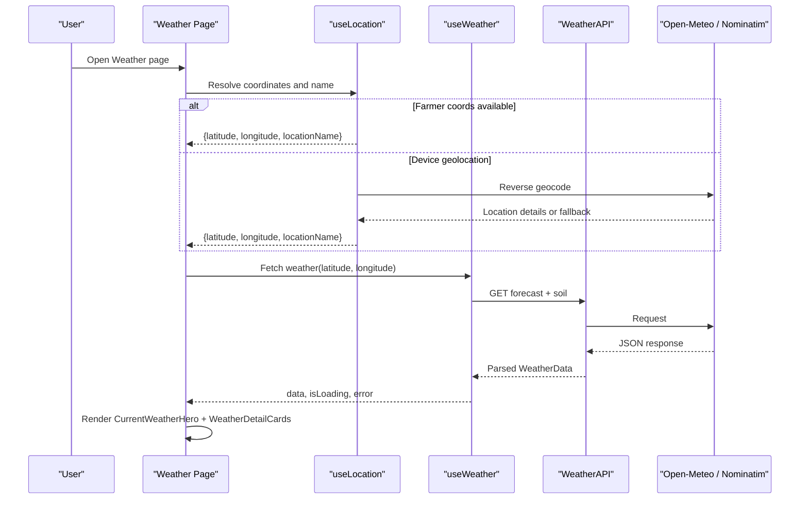
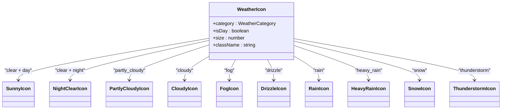
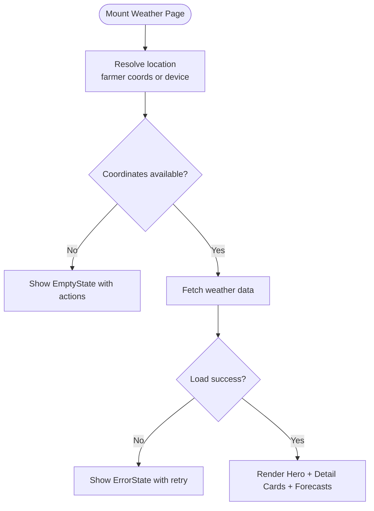
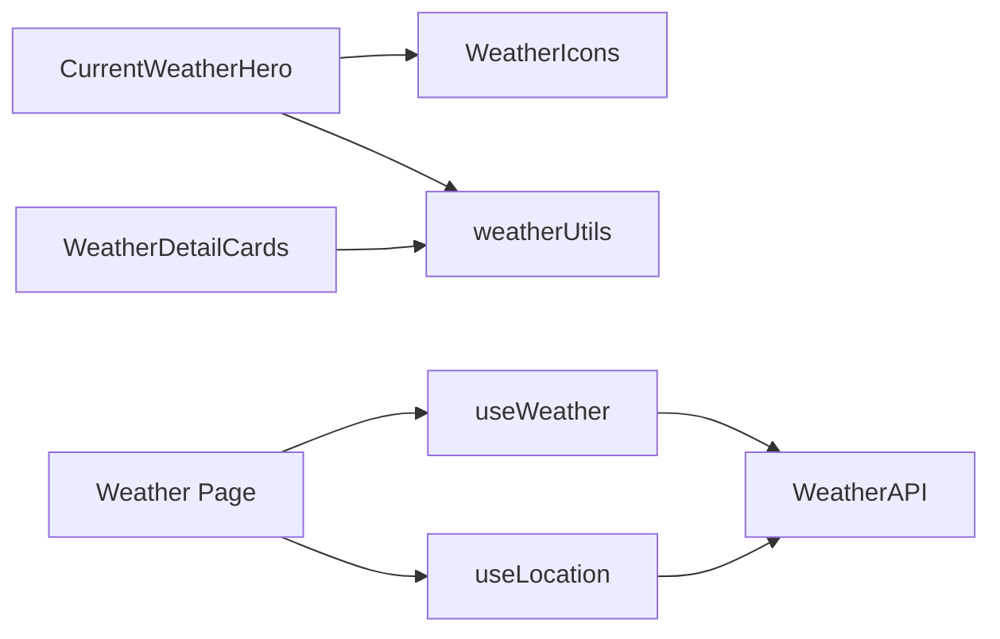

# Current Weather Display

<cite>
**Referenced Files in This Document**
- [CurrentWeatherHero.tsx](file://Frontend/greenflora/components/weather/CurrentWeatherHero.tsx)
- [WeatherDetailCards.tsx](file://Frontend/greenflora/components/weather/WeatherDetailCards.tsx)
- [WeatherIcons.tsx](file://Frontend/greenflora/components/weather/WeatherIcons.tsx)
- [useWeather.ts](file://Frontend/greenflora/Hooks/useWeather.ts)
- [WeatherAPI.ts](file://Frontend/greenflora/services/WeatherAPI.ts)
- [weatherUtils.ts](file://Frontend/greenflora/lib/weatherUtils.ts)
- [weather.ts](file://Frontend/greenflora/types/weather.ts)
- [useLocation.ts](file://Frontend/greenflora/Hooks/useLocation.ts)
- [page.tsx](file://Frontend/greenflora/app/weather/page.tsx)
</cite>

## Table of Contents
1. Introduction
2. Project Structure
3. Core Components
4. Architecture Overview
5. Detailed Component Analysis
6. Dependency Analysis
7. Performance Considerations
8. Troubleshooting Guide
9. Conclusion

## Introduction
This document explains the current weather display components that visualize real-time weather conditions for farmers. It focuses on:
- CurrentWeatherHero: primary metrics (temperature, feels-like, condition label), dynamic background, and location controls.
- WeatherDetailCards: expanded statistics including humidity, rain chance, wind, cloud cover, UV index, and sunrise/sunset.
- Dynamic icon selection based on WMO weather codes and day/night context.
- Responsive layout patterns and integration with location services.
- Real-time update considerations, error handling, and accessibility guidance.

## Project Structure
The weather feature is composed of a page orchestrating hooks and UI components, backed by an API service and utility functions.

**Diagram sources**
- [page.tsx:41-187](file://Frontend/greenflora/app/weather/page.tsx#L41-L187)
- [useLocation.ts:49-175](file://Frontend/greenflora/Hooks/useLocation.ts#L49-L175)
- [useWeather.ts:21-57](file://Frontend/greenflora/Hooks/useWeather.ts#L21-L57)
- [WeatherAPI.ts:141-222](file://Frontend/greenflora/services/WeatherAPI.ts#L141-L222)
- [CurrentWeatherHero.tsx:25-113](file://Frontend/greenflora/components/weather/CurrentWeatherHero.tsx#L25-L113)
- [WeatherDetailCards.tsx:31-183](file://Frontend/greenflora/components/weather/WeatherDetailCards.tsx#L31-L183)
- [WeatherIcons.tsx:403-437](file://Frontend/greenflora/components/weather/WeatherIcons.tsx#L403-L437)
- [weatherUtils.ts:14-194](file://Frontend/greenflora/lib/weatherUtils.ts#L14-L194)
- [weather.ts:9-80](file://Frontend/greenflora/types/weather.ts#L9-L80)

**Section sources**
- [page.tsx:41-187](file://Frontend/greenflora/app/weather/page.tsx#L41-L187)
- [useLocation.ts:49-175](file://Frontend/greenflora/Hooks/useLocation.ts#L49-L175)
- [useWeather.ts:21-57](file://Frontend/greenflora/Hooks/useWeather.ts#L21-L57)
- [WeatherAPI.ts:141-222](file://Frontend/greenflora/services/WeatherAPI.ts#L141-L222)
- [CurrentWeatherHero.tsx:25-113](file://Frontend/greenflora/components/weather/CurrentWeatherHero.tsx#L25-L113)
- [WeatherDetailCards.tsx:31-183](file://Frontend/greenflora/components/weather/WeatherDetailCards.tsx#L31-L183)
- [WeatherIcons.tsx:403-437](file://Frontend/greenflora/components/weather/WeatherIcons.tsx#L403-L437)
- [weatherUtils.ts:14-194](file://Frontend/greenflora/lib/weatherUtils.ts#L14-L194)
- [weather.ts:9-80](file://Frontend/greenflora/types/weather.ts#L9-L80)

## Core Components
- CurrentWeatherHero displays the primary weather hero section with temperature, feels-like, condition label, animated icon, gradient background, and location actions.
- WeatherDetailCards presents a responsive grid of cards for humidity, rain chance, wind, cloud cover, UV index, and sunrise/sunset with visual bars and badges.

Key responsibilities:
- CurrentWeatherHero: derive weather info from code, render large icon and temperature, show location name/source, provide refresh and change-location actions.
- WeatherDetailCards: compute UV label, format times, rotate wind icon, and present progress bars for humidity/rain/cloud.

**Section sources**
- [CurrentWeatherHero.tsx:25-113](file://Frontend/greenflora/components/weather/CurrentWeatherHero.tsx#L25-L113)
- [WeatherDetailCards.tsx:31-183](file://Frontend/greenflora/components/weather/WeatherDetailCards.tsx#L31-L183)

## Architecture Overview
The weather page composes stateful hooks to resolve location and fetch data, then renders UI components.

**Diagram sources**
- [page.tsx:41-187](file://Frontend/greenflora/app/weather/page.tsx#L41-L187)
- [useLocation.ts:49-175](file://Frontend/greenflora/Hooks/useLocation.ts#L49-L175)
- [useWeather.ts:21-57](file://Frontend/greenflora/Hooks/useWeather.ts#L21-L57)
- [WeatherAPI.ts:141-222](file://Frontend/greenflora/services/WeatherAPI.ts#L141-L222)

## Detailed Component Analysis

### CurrentWeatherHero
Responsibilities:
- Derives human-readable condition and gradient via weather utilities.
- Renders a large animated WeatherIcon sized appropriately for the hero.
- Shows rounded temperature, feels-like, and condition label.
- Displays resolved location name and source badge (“From your farm profile” or “From your device”).
- Provides action buttons to change location and refresh data.

Dynamic icon selection:
- Uses category mapping from WMO code to choose between clear/partly-cloudy/cloudy/fog/drizzle/rain/heavy_rain/snow/thunderstorm icons.
- For clear skies, selects day vs night variant based on isDay flag.

Responsive layout:
- Flex column on small screens; row on medium+ screens.
- Large typography scales up on larger viewports.

Integration with location services:
- Receives locationName and locationSource from useLocation, ensuring consistent display even if reverse geocoding fails (fallback to coordinate string).

Accessibility notes:
- Icons are decorative; ensure surrounding text conveys meaning.
- Buttons have descriptive labels and visible focus states via base Button component.

**Section sources**
- [CurrentWeatherHero.tsx:25-113](file://Frontend/greenflora/components/weather/CurrentWeatherHero.tsx#L25-L113)
- [weatherUtils.ts:14-194](file://Frontend/greenflora/lib/weatherUtils.ts#L14-L194)
- [WeatherIcons.tsx:403-437](file://Frontend/greenflora/components/weather/WeatherIcons.tsx#L403-L437)
- [useLocation.ts:49-175](file://Frontend/greenflora/Hooks/useLocation.ts#L49-L175)

#### Class Diagram: Icon Selection

**Diagram sources**
- [WeatherIcons.tsx:403-437](file://Frontend/greenflora/components/weather/WeatherIcons.tsx#L403-L437)

### WeatherDetailCards
Responsibilities:
- Humidity: value plus a moisture bar proportional to humidity percentage.
- Rain chance: max precipitation probability from today’s daily forecast with a probability bar.
- Wind: speed with compass direction derived from degrees; icon rotation reflects windDirection.
- Cloud cover: percentage with a fill bar.
- UV Index: numeric value plus a Badge indicating risk level.
- Sunrise/Sunset: formatted times using utility formatter.

Responsive layout:
- Grid adapts from 2 columns on mobile to 3 columns on large screens.

Performance considerations:
- Bars animate smoothly with CSS transitions.
- Minimal re-renders since props are primitive values.

Accessibility notes:
- Each card includes a label and value; bars provide visual reinforcement but not sole meaning.
- Badge variants communicate severity visually and via text.

**Section sources**
- [WeatherDetailCards.tsx:31-183](file://Frontend/greenflora/components/weather/WeatherDetailCards.tsx#L31-L183)
- [weatherUtils.ts:196-265](file://Frontend/greenflora/lib/weatherUtils.ts#L196-L265)

### Data Flow and State Management
- useLocation resolves coordinates and a readable place name, prioritizing farmer profile coordinates and falling back to device geolocation. It also handles reverse geocoding errors gracefully.
- useWeather triggers a single request to fetch current, hourly, daily, and soil data, parsing it into typed structures.
- The page composes these hooks and renders loading, empty, and error states before showing the weather UI.

**Diagram sources**
- [page.tsx:41-187](file://Frontend/greenflora/app/weather/page.tsx#L41-L187)
- [useLocation.ts:49-175](file://Frontend/greenflora/Hooks/useLocation.ts#L49-L175)
- [useWeather.ts:21-57](file://Frontend/greenflora/Hooks/useWeather.ts#L21-L57)

## Dependency Analysis
- CurrentWeatherHero depends on:
  - WeatherIcons for dynamic icon rendering.
  - weatherUtils for condition mapping and gradients.
  - UI primitives (Button) and types.
- WeatherDetailCards depends on:
  - weatherUtils for wind direction, time formatting, UV labeling.
  - UI primitives (Card, Badge).
- Hooks and Services:
  - useWeather calls WeatherAPI.fetchWeatherData.
  - useLocation calls WeatherAPI.reverseGeocode.
  - WeatherAPI uses Open-Meteo and Nominatim endpoints with timeouts and typed parsing.

**Diagram sources**
- [CurrentWeatherHero.tsx:25-113](file://Frontend/greenflora/components/weather/CurrentWeatherHero.tsx#L25-L113)
- [WeatherDetailCards.tsx:31-183](file://Frontend/greenflora/components/weather/WeatherDetailCards.tsx#L31-L183)
- [useWeather.ts:21-57](file://Frontend/greenflora/Hooks/useWeather.ts#L21-L57)
- [useLocation.ts:49-175](file://Frontend/greenflora/Hooks/useLocation.ts#L49-L175)
- [WeatherAPI.ts:141-222](file://Frontend/greenflora/services/WeatherAPI.ts#L141-L222)

**Section sources**
- [CurrentWeatherHero.tsx:25-113](file://Frontend/greenflora/components/weather/CurrentWeatherHero.tsx#L25-L113)
- [WeatherDetailCards.tsx:31-183](file://Frontend/greenflora/components/weather/WeatherDetailCards.tsx#L31-L183)
- [useWeather.ts:21-57](file://Frontend/greenflora/Hooks/useWeather.ts#L21-L57)
- [useLocation.ts:49-175](file://Frontend/greenflora/Hooks/useLocation.ts#L49-L175)
- [WeatherAPI.ts:141-222](file://Frontend/greenflora/services/WeatherAPI.ts#L141-L222)

## Performance Considerations
- Single consolidated API call: WeatherAPI fetches current, hourly, daily, and soil data in one request to minimize network overhead.
- Timeouts and abort controllers prevent hanging requests and free resources promptly.
- Lightweight SVG icons with CSS animations reduce layout thrashing; animations are GPU-accelerated where possible.
- Conditional rendering ensures heavy components only mount when data is ready.
- Debouncing or throttling user-triggered refreshes can be added if needed; currently refresh is user-initiated.

[No sources needed since this section provides general guidance]

## Troubleshooting Guide
Common issues and resolutions:
- No location available:
  - If farmer profile lacks coordinates, the page prompts for device location. If denied, shows an actionable EmptyState with options to enable permissions or set farm location in profile.
- Reverse geocoding failure:
  - Falls back to displaying coordinates as a readable label so users still see relevant weather.
- Weather API failure:
  - Errors are surfaced via ErrorState with a retry button that calls refresh.
  - Network/timeout/server errors are categorized and surfaced with user-friendly messages.

Operational tips:
- Verify internet connectivity and browser geolocation permissions.
- Check that the Open-Meteo and Nominatim endpoints are reachable.
- Inspect console for timeout or abort errors during development.

**Section sources**
- [page.tsx:103-160](file://Frontend/greenflora/app/weather/page.tsx#L103-L160)
- [useLocation.ts:95-132](file://Frontend/greenflora/Hooks/useLocation.ts#L95-L132)
- [WeatherAPI.ts:190-222](file://Frontend/greenflora/services/WeatherAPI.ts#L190-L222)

## Conclusion
The current weather display combines robust location resolution, efficient data fetching, and accessible, responsive UI components to deliver real-time weather insights tailored to farmers. CurrentWeatherHero highlights key metrics with dynamic visuals, while WeatherDetailCards expands into actionable statistics like UV index, wind, and precipitation probability. The architecture cleanly separates concerns across hooks, services, and components, enabling maintainability and scalability. With thoughtful error handling and performance optimizations, the feature provides a reliable experience under varying network and permission conditions.