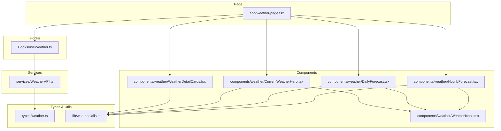
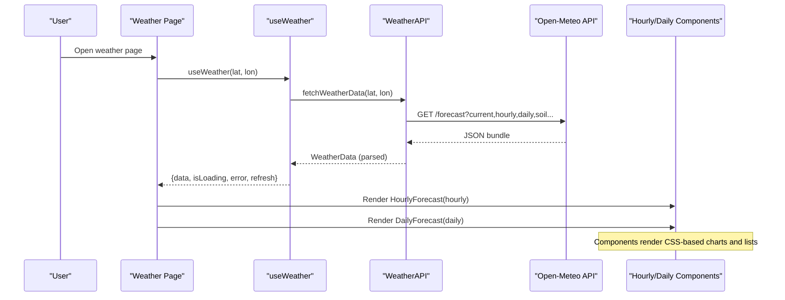
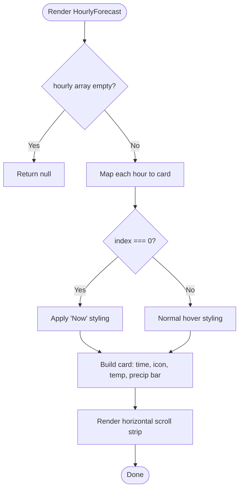
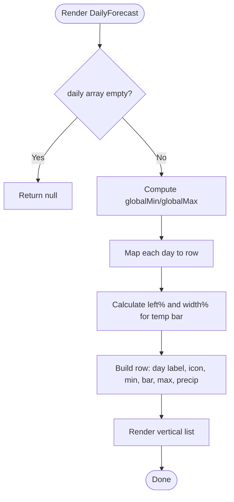
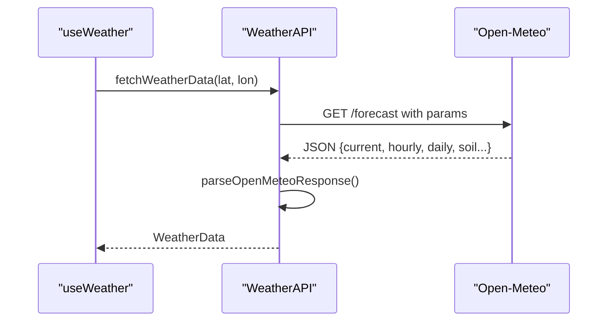
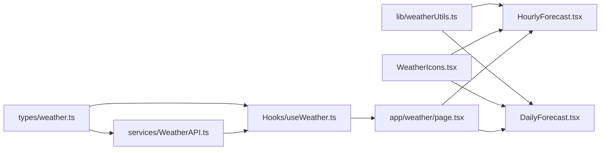

# Forecast Visualizations

<cite>
**Referenced Files in This Document**
- [HourlyForecast.tsx](file://Frontend/greenflora/components/weather/HourlyForecast.tsx)
- [DailyForecast.tsx](file://Frontend/greenflora/components/weather/DailyForecast.tsx)
- [useWeather.ts](file://Frontend/greenflora/Hooks/useWeather.ts)
- [WeatherAPI.ts](file://Frontend/greenflora/services/WeatherAPI.ts)
- [weather.ts](file://Frontend/greenflora/types/weather.ts)
- [weatherUtils.ts](file://Frontend/greenflora/lib/weatherUtils.ts)
- [WeatherIcons.tsx](file://Frontend/greenflora/components/weather/WeatherIcons.tsx)
- [page.tsx](file://Frontend/greenflora/app/weather/page.tsx)
- [CurrentWeatherHero.tsx](file://Frontend/greenflora/components/weather/CurrentWeatherHero.tsx)
- [WeatherDetailCards.tsx](file://Frontend/greenflora/components/weather/WeatherDetailCards.tsx)
</cite>

## Table of Contents
1. [Introduction](#introduction)
2. [Project Structure](#project-structure)
3. [Core Components](#core-components)
4. [Architecture Overview](#architecture-overview)
5. [Detailed Component Analysis](#detailed-component-analysis)
6. [Dependency Analysis](#dependency-analysis)
7. [Performance Considerations](#performance-considerations)
8. [Troubleshooting Guide](#troubleshooting-guide)
9. [Conclusion](#conclusion)
10. [Appendices](#appendices)

## Introduction
This document provides comprehensive documentation for the forecast visualization components that present temporal weather predictions to farmers. It focuses on:
- HourlyForecast: a horizontal, scrollable strip showing 24-hour predictions with temperature, precipitation probability, and wind cues via small icons and compact bars.
- DailyForecast: a vertical list of 7-day forecasts with high/low temperatures, weather conditions, and actionable insights derived from weather data (e.g., rain chance).

It also covers technical implementation details such as chart-like rendering using CSS-based visualizations, data transformation from Open-Meteo API responses, user interaction patterns for time navigation, responsive design considerations for mobile devices, performance optimization strategies for large datasets, caching approaches for forecast data, and accessibility guidance for navigating charts and interactive elements.

## Project Structure
The forecast feature is implemented primarily in the Frontend Next.js application under the weather module. The key files include:
- Data fetching and transformation: useWeather hook and WeatherAPI service
- Types and utilities: weather types and formatting helpers
- UI components: HourlyForecast, DailyForecast, CurrentWeatherHero, WeatherDetailCards, and WeatherIcons
- Page orchestration: weather page composes all pieces together

**Diagram sources**
- [page.tsx:16-217](file://Frontend/greenflora/app/weather/page.tsx#L16-L217)
- [useWeather.ts:1-58](file://Frontend/greenflora/Hooks/useWeather.ts#L1-L58)
- [WeatherAPI.ts:1-291](file://Frontend/greenflora/services/WeatherAPI.ts#L1-L291)
- [weather.ts:1-124](file://Frontend/greenflora/types/weather.ts#L1-L124)
- [weatherUtils.ts:1-285](file://Frontend/greenflora/lib/weatherUtils.ts#L1-L285)
- [HourlyForecast.tsx:1-80](file://Frontend/greenflora/components/weather/HourlyForecast.tsx#L1-L80)
- [DailyForecast.tsx:1-105](file://Frontend/greenflora/components/weather/DailyForecast.tsx#L1-L105)
- [CurrentWeatherHero.tsx:1-115](file://Frontend/greenflora/components/weather/CurrentWeatherHero.tsx#L1-L115)
- [WeatherDetailCards.tsx:1-185](file://Frontend/greenflora/components/weather/WeatherDetailCards.tsx#L1-L185)
- [WeatherIcons.tsx:1-473](file://Frontend/greenflora/components/weather/WeatherIcons.tsx#L1-L473)

**Section sources**
- [page.tsx:16-217](file://Frontend/greenflora/app/weather/page.tsx#L16-L217)
- [useWeather.ts:1-58](file://Frontend/greenflora/Hooks/useWeather.ts#L1-L58)
- [WeatherAPI.ts:1-291](file://Frontend/greenflora/services/WeatherAPI.ts#L1-L291)
- [weather.ts:1-124](file://Frontend/greenflora/types/weather.ts#L1-L124)
- [weatherUtils.ts:1-285](file://Frontend/greenflora/lib/weatherUtils.ts#L1-L285)
- [HourlyForecast.tsx:1-80](file://Frontend/greenflora/components/weather/HourlyForecast.tsx#L1-L80)
- [DailyForecast.tsx:1-105](file://Frontend/greenflora/components/weather/DailyForecast.tsx#L1-L105)
- [CurrentWeatherHero.tsx:1-115](file://Frontend/greenflora/components/weather/CurrentWeatherHero.tsx#L1-L115)
- [WeatherDetailCards.tsx:1-185](file://Frontend/greenflora/components/weather/WeatherDetailCards.tsx#L1-L185)
- [WeatherIcons.tsx:1-473](file://Frontend/greenflora/components/weather/WeatherIcons.tsx#L1-L473)

## Core Components
- HourlyForecast: Renders a horizontally scrollable strip of 24 hourly entries. Each entry shows time label, small weather icon, rounded temperature, and a vertical bar representing precipitation probability. The first hour is highlighted as “Now.”
- DailyForecast: Renders a vertical list of 7 days. Each row includes day label, small weather icon, min/max temperatures, a gradient temperature range bar computed from global min/max across the week, and precipitation probability badge.

Both components are lightweight, rely on utility functions for formatting and mapping, and use Tailwind classes for responsive layout and animations.

**Section sources**
- [HourlyForecast.tsx:1-80](file://Frontend/greenflora/components/weather/HourlyForecast.tsx#L1-L80)
- [DailyForecast.tsx:1-105](file://Frontend/greenflora/components/weather/DailyForecast.tsx#L1-L105)

## Architecture Overview
The data flow starts at the weather page, which orchestrates location resolution and weather data fetching. The useWeather hook calls the WeatherAPI service to fetch a single bundle from Open-Meteo containing current, hourly, daily, and soil data. The service parses the response into typed structures used by the UI components.

**Diagram sources**
- [page.tsx:41-187](file://Frontend/greenflora/app/weather/page.tsx#L41-L187)
- [useWeather.ts:21-57](file://Frontend/greenflora/Hooks/useWeather.ts#L21-L57)
- [WeatherAPI.ts:141-222](file://Frontend/greenflora/services/WeatherAPI.ts#L141-L222)
- [WeatherAPI.ts:224-290](file://Frontend/greenflora/services/WeatherAPI.ts#L224-L290)

## Detailed Component Analysis

### HourlyForecast Component
Purpose:
- Present the next 24 hours of weather in a horizontal, scrollable interface.
- Show time labels, small weather icons, temperature values, and precipitation probability indicators.

Key behaviors:
- Highlights the current hour (“Now”) with a distinct background and color.
- Uses a vertical bar whose height corresponds to precipitation probability percentage.
- Formats time using a utility function to display human-readable hour labels.

Rendering approach:
- No external charting library; uses CSS flexbox and inline styles for bars and gradients.
- Responsive scrolling container ensures usability on mobile.

Accessibility considerations:
- Ensure keyboard navigability through the scrollable strip if needed.
- Provide meaningful alt or title attributes for icons where applicable.

**Diagram sources**
- [HourlyForecast.tsx:18-79](file://Frontend/greenflora/components/weather/HourlyForecast.tsx#L18-L79)

**Section sources**
- [HourlyForecast.tsx:1-80](file://Frontend/greenflora/components/weather/HourlyForecast.tsx#L1-L80)
- [weatherUtils.ts:245-252](file://Frontend/greenflora/lib/weatherUtils.ts#L245-L252)
- [WeatherIcons.tsx:442-473](file://Frontend/greenflora/components/weather/WeatherIcons.tsx#L442-L473)

### DailyForecast Component
Purpose:
- Display a 7-day forecast with high/low temperatures, weather conditions, and precipitation probability.

Key behaviors:
- Computes global min/max temperatures across all days to normalize the temperature range bar.
- Calculates left offset and width percentages for each day’s temperature bar.
- Shows precipitation probability when available.

Rendering approach:
- Vertical list with consistent spacing and hover states.
- Gradient temperature bar visually communicates the daily range relative to the weekly range.

Accessibility considerations:
- Use semantic HTML structure for list items.
- Provide descriptive titles for weather icons and ensure contrast for text and bars.

**Diagram sources**
- [DailyForecast.tsx:19-104](file://Frontend/greenflora/components/weather/DailyForecast.tsx#L19-L104)

**Section sources**
- [DailyForecast.tsx:1-105](file://Frontend/greenflora/components/weather/DailyForecast.tsx#L1-L105)
- [weatherUtils.ts:238-243](file://Frontend/greenflora/lib/weatherUtils.ts#L238-L243)
- [WeatherIcons.tsx:442-473](file://Frontend/greenflora/components/weather/WeatherIcons.tsx#L442-L473)

### Data Transformation from Open-Meteo
The WeatherAPI service performs a single request to Open-Meteo to fetch current, hourly, daily, and soil data. It then transforms the raw response into clean, typed structures consumed by the UI.

Key steps:
- Build query parameters for current, hourly (limited to 24), daily (7 entries), and soil fields.
- Fetch with timeout and handle errors, categorizing them as network, timeout, server, or unknown.
- Parse arrays into structured objects for current, hourly, daily, and soil.

**Diagram sources**
- [WeatherAPI.ts:141-222](file://Frontend/greenflora/services/WeatherAPI.ts#L141-L222)
- [WeatherAPI.ts:224-290](file://Frontend/greenflora/services/WeatherAPI.ts#L224-L290)

**Section sources**
- [WeatherAPI.ts:1-291](file://Frontend/greenflora/services/WeatherAPI.ts#L1-L291)
- [weather.ts:1-124](file://Frontend/greenflora/types/weather.ts#L1-L124)

### User Interaction Patterns for Time Navigation
- Horizontal scrolling: Users can swipe or drag to navigate through hourly entries on mobile devices.
- Highlighted current hour: The first entry is visually emphasized as “Now,” aiding orientation.
- Refresh capability: The weather page exposes a refresh action to reload data.

Responsive considerations:
- Scrollable container adapts to screen size.
- Compact cards ensure readability on small screens.

**Section sources**
- [HourlyForecast.tsx:21-77](file://Frontend/greenflora/components/weather/HourlyForecast.tsx#L21-L77)
- [page.tsx:163-187](file://Frontend/greenflora/app/weather/page.tsx#L163-L187)

### Responsive Design Considerations
- Flexbox layouts and min-width constraints ensure proper alignment and scrolling behavior.
- Tailwind classes provide consistent spacing, typography, and colors across breakpoints.
- Small icons and concise labels optimize space usage on mobile.

**Section sources**
- [HourlyForecast.tsx:27-76](file://Frontend/greenflora/components/weather/HourlyForecast.tsx#L27-L76)
- [DailyForecast.tsx:33-101](file://Frontend/greenflora/components/weather/DailyForecast.tsx#L33-L101)

### Accessibility Compliance for Chart Navigation
- Semantic structure: Use appropriate headings and list semantics for forecast rows.
- Keyboard navigation: Ensure scrollable areas are accessible via keyboard if possible.
- ARIA attributes: Add aria-labels or roles to interactive elements like buttons and scroll containers.
- Color contrast: Maintain sufficient contrast for text and bars to meet WCAG guidelines.

[No sources needed since this section provides general guidance]

## Dependency Analysis
The components depend on shared types and utilities, while the page orchestrates hooks and services.

**Diagram sources**
- [weather.ts:1-124](file://Frontend/greenflora/types/weather.ts#L1-L124)
- [WeatherAPI.ts:1-291](file://Frontend/greenflora/services/WeatherAPI.ts#L1-L291)
- [useWeather.ts:1-58](file://Frontend/greenflora/Hooks/useWeather.ts#L1-L58)
- [weatherUtils.ts:1-285](file://Frontend/greenflora/lib/weatherUtils.ts#L1-L285)
- [WeatherIcons.tsx:1-473](file://Frontend/greenflora/components/weather/WeatherIcons.tsx#L1-L473)
- [HourlyForecast.tsx:1-80](file://Frontend/greenflora/components/weather/HourlyForecast.tsx#L1-L80)
- [DailyForecast.tsx:1-105](file://Frontend/greenflora/components/weather/DailyForecast.tsx#L1-L105)
- [page.tsx:16-217](file://Frontend/greenflora/app/weather/page.tsx#L16-L217)

**Section sources**
- [weather.ts:1-124](file://Frontend/greenflora/types/weather.ts#L1-L124)
- [WeatherAPI.ts:1-291](file://Frontend/greenflora/services/WeatherAPI.ts#L1-L291)
- [useWeather.ts:1-58](file://Frontend/greenflora/Hooks/useWeather.ts#L1-L58)
- [weatherUtils.ts:1-285](file://Frontend/greenflora/lib/weatherUtils.ts#L1-L285)
- [WeatherIcons.tsx:1-473](file://Frontend/greenflora/components/weather/WeatherIcons.tsx#L1-L473)
- [HourlyForecast.tsx:1-80](file://Frontend/greenflora/components/weather/HourlyForecast.tsx#L1-L80)
- [DailyForecast.tsx:1-105](file://Frontend/greenflora/components/weather/DailyForecast.tsx#L1-L105)
- [page.tsx:16-217](file://Frontend/greenflora/app/weather/page.tsx#L16-L217)

## Performance Considerations
- Single API request: The WeatherAPI bundles current, hourly, daily, and soil data in one call to minimize round-trips.
- Timeout handling: Requests have timeouts to prevent hanging UI during slow networks.
- Lightweight rendering: Components avoid heavy chart libraries; they use CSS-based visualizations for better performance.
- Minimal re-renders: Hooks manage loading and error states efficiently; components render only necessary data.

Optimization opportunities:
- Implement client-side caching (e.g., in-memory cache keyed by coordinates) to reduce repeated requests.
- Debounce refresh actions to avoid excessive network calls.
- Virtualize long lists if hourly/daily data grows significantly beyond current sizes.

[No sources needed since this section provides general guidance]

## Troubleshooting Guide
Common issues and resolutions:
- Location not resolved: If no coordinates are available, the page prompts users to allow device location or set farm location in profile.
- Weather API errors: Errors are categorized (network, timeout, server) and surfaced to users with retry options.
- Empty data: Components gracefully handle empty arrays by returning null or showing skeletons.

Error handling specifics:
- useWeather sets error state and clears loading flags after attempts.
- WeatherAPI throws typed errors with messages suitable for user feedback.

**Section sources**
- [useWeather.ts:29-56](file://Frontend/greenflora/Hooks/useWeather.ts#L29-L56)
- [WeatherAPI.ts:127-222](file://Frontend/greenflora/services/WeatherAPI.ts#L127-L222)
- [page.tsx:103-160](file://Frontend/greenflora/app/weather/page.tsx#L103-L160)

## Conclusion
The forecast visualization components deliver clear, actionable weather insights tailored for farming decisions. HourlyForecast and DailyForecast leverage lightweight, CSS-based visualizations to present temperature trends, precipitation probabilities, and weather conditions effectively across devices. The architecture emphasizes efficient data fetching, robust error handling, and responsive design. Future enhancements can focus on caching, virtualization, and richer interactivity while maintaining accessibility and performance.

[No sources needed since this section summarizes without analyzing specific files]

## Appendices

### Additional Contextual Components
- CurrentWeatherHero: Displays current conditions with animated icons, temperature, and location context.
- WeatherDetailCards: Provides detailed metrics (humidity, rain chance, wind, cloud cover, UV index, sunrise/sunset) with visual bars and badges.

These components complement the forecast views by offering immediate context and deeper insights.

**Section sources**
- [CurrentWeatherHero.tsx:1-115](file://Frontend/greenflora/components/weather/CurrentWeatherHero.tsx#L1-L115)
- [WeatherDetailCards.tsx:1-185](file://Frontend/greenflora/components/weather/WeatherDetailCards.tsx#L1-L185)