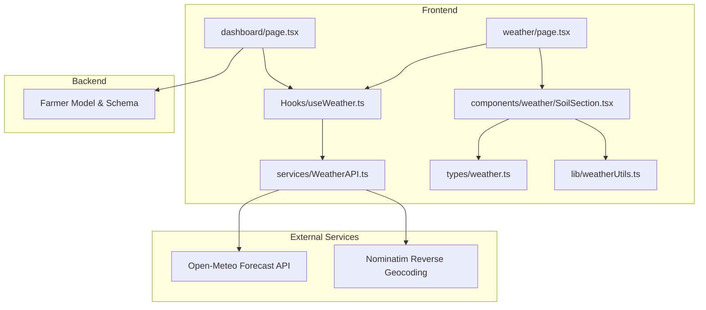
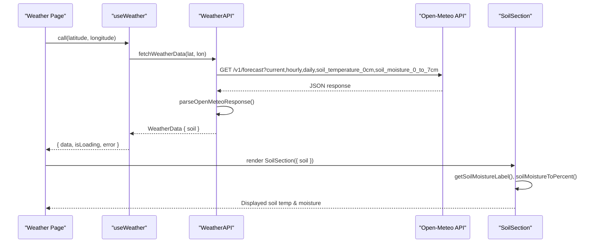
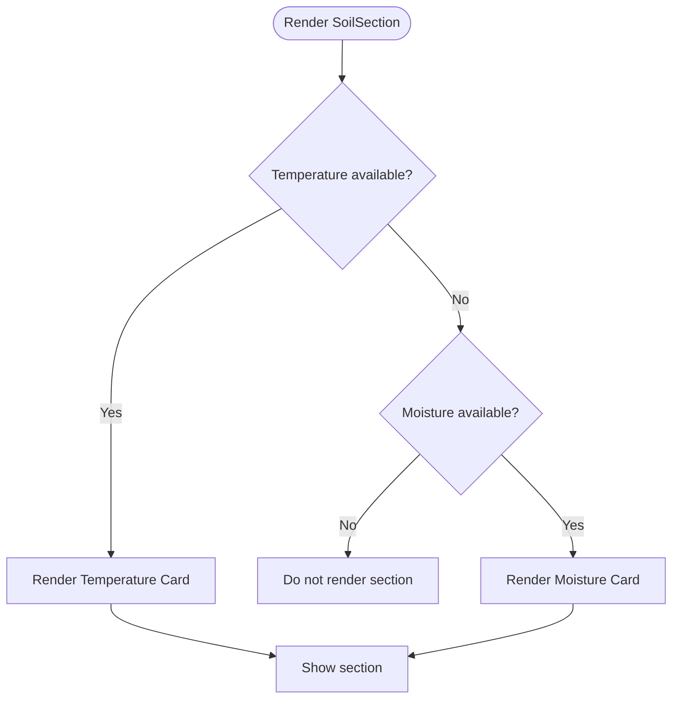
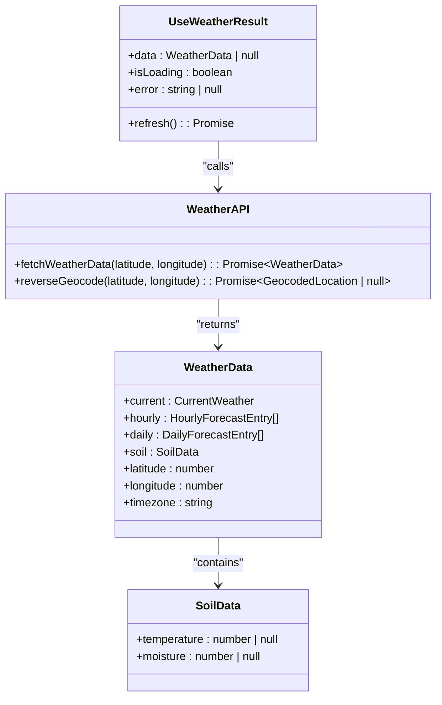
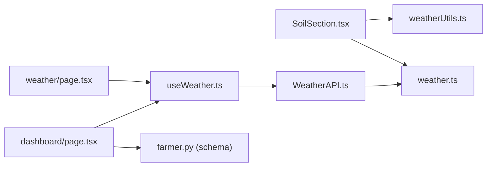

# Soil Condition Monitoring

<cite>
**Referenced Files in This Document**
- [SoilSection.tsx](file://Frontend/greenflora/components/weather/SoilSection.tsx)
- [useWeather.ts](file://Frontend/greenflora/Hooks/useWeather.ts)
- [WeatherAPI.ts](file://Frontend/greenflora/services/WeatherAPI.ts)
- [weather.ts](file://Frontend/greenflora/types/weather.ts)
- [weatherUtils.ts](file://Frontend/greenflora/lib/weatherUtils.ts)
- [weather/page.tsx](file://Frontend/greenflora/app/weather/page.tsx)
- [dashboard/page.tsx](file://Frontend/greenflora/app/dashboard/page.tsx)
- [farmer.py (model)](file://Backend/models/farmer.py)
- [farmer.py (schema)](file://Backend/schemas/farmer.py)
</cite>

## Table of Contents
1. Introduction
2. Project Structure
3. Core Components
4. Architecture Overview
5. Detailed Component Analysis
6. Dependency Analysis
7. Performance Considerations
8. Troubleshooting Guide
9. Conclusion
10. Appendices

## Introduction
This document explains the soil condition monitoring feature for agricultural soil health assessment and irrigation planning. It focuses on the SoilSection component that displays estimated soil moisture and temperature, how data is obtained from Open-Meteo’s soil APIs, and how the values are interpreted to support farming decisions. It also covers visualization of soil health metrics, thresholds used for interpretation, alerting considerations for irrigation needs, and recommendations tied to crop types and growth stages stored in the farmer profile. Data accuracy, seasonal variations, and integration with farm management workflows are addressed to help optimize water usage and maintain crop health.

## Project Structure
The soil monitoring feature spans the frontend UI, a React hook for data fetching, an API service layer, type definitions, and utility functions. The backend stores farmer context such as soil type, irrigation method, current crop, and crop stage, which can be used by higher-level logic or AI tools to tailor recommendations.

**Diagram sources**
- [weather/page.tsx:41-66](file://Frontend/greenflora/app/weather/page.tsx#L41-L66)
- [dashboard/page.tsx:70-75](file://Frontend/greenflora/app/dashboard/page.tsx#L70-L75)
- [useWeather.ts:21-56](file://Frontend/greenflora/Hooks/useWeather.ts#L21-L56)
- [WeatherAPI.ts:141-222](file://Frontend/greenflora/services/WeatherAPI.ts#L141-L222)
- [weather.ts:45-60](file://Frontend/greenflora/types/weather.ts#L45-L60)
- [weatherUtils.ts:267-284](file://Frontend/greenflora/lib/weatherUtils.ts#L267-L284)
- [SoilSection.tsx:23-51](file://Frontend/greenflora/components/weather/SoilSection.tsx#L23-L51)
- [farmer.py (model):21-42](file://Backend/models/farmer.py#L21-L42)
- [farmer.py (schema):40-58](file://Backend/schemas/farmer.py#L40-L58)

**Section sources**
- [weather/page.tsx:41-66](file://Frontend/greenflora/app/weather/page.tsx#L41-L66)
- [dashboard/page.tsx:70-75](file://Frontend/greenflora/app/dashboard/page.tsx#L70-L75)
- [useWeather.ts:21-56](file://Frontend/greenflora/Hooks/useWeather.ts#L21-L56)
- [WeatherAPI.ts:141-222](file://Frontend/greenflora/services/WeatherAPI.ts#L141-L222)
- [weather.ts:45-60](file://Frontend/greenflora/types/weather.ts#L45-L60)
- [weatherUtils.ts:267-284](file://Frontend/greenflora/lib/weatherUtils.ts#L267-L284)
- [SoilSection.tsx:23-51](file://Frontend/greenflora/components/weather/SoilSection.tsx#L23-L51)
- [farmer.py (model):21-42](file://Backend/models/farmer.py#L21-L42)
- [farmer.py (schema):40-58](file://Backend/schemas/farmer.py#L40-L58)

## Core Components
- SoilSection: Renders estimated soil temperature and moisture cards with contextual labels and visual indicators. It hides itself when neither value is available.
- useWeather: Loads weather and soil data for given coordinates using the WeatherAPI service.
- WeatherAPI: Calls Open-Meteo to fetch current, hourly, daily, and soil data in one request; parses responses into typed structures.
- weatherUtils: Provides human-readable labels for soil moisture and conversion to percentage for display.
- Types: Define shapes for weather and soil data, including the latest soil readings.
- Pages: Integrate weather and soil data into the Weather page and Dashboard.

Key responsibilities:
- Fetching and parsing soil data from Open-Meteo.
- Converting volumetric water content to percentages and labels.
- Rendering accessible, informative visuals for farmers.
- Handling missing or invalid data gracefully.

**Section sources**
- [SoilSection.tsx:23-51](file://Frontend/greenflora/components/weather/SoilSection.tsx#L23-L51)
- [useWeather.ts:21-56](file://Frontend/greenflora/Hooks/useWeather.ts#L21-L56)
- [WeatherAPI.ts:141-222](file://Frontend/greenflora/services/WeatherAPI.ts#L141-L222)
- [weatherUtils.ts:267-284](file://Frontend/greenflora/lib/weatherUtils.ts#L267-L284)
- [weather.ts:45-60](file://Frontend/greenflora/types/weather.ts#L45-L60)

## Architecture Overview
The system retrieves soil conditions via Open-Meteo’s forecast endpoint, extracts the latest valid soil temperature and moisture values, and presents them through the SoilSection component. The dashboard and weather pages consume this data to inform farmers about soil health and potential irrigation needs.

**Diagram sources**
- [weather/page.tsx:41-66](file://Frontend/greenflora/app/weather/page.tsx#L41-L66)
- [useWeather.ts:21-56](file://Frontend/greenflora/Hooks/useWeather.ts#L21-L56)
- [WeatherAPI.ts:141-222](file://Frontend/greenflora/services/WeatherAPI.ts#L141-L222)
- [WeatherAPI.ts:224-290](file://Frontend/greenflora/services/WeatherAPI.ts#L224-L290)
- [SoilSection.tsx:23-51](file://Frontend/greenflora/components/weather/SoilSection.tsx#L23-L51)
- [weatherUtils.ts:267-284](file://Frontend/greenflora/lib/weatherUtils.ts#L267-L284)

## Detailed Component Analysis

### SoilSection Component
- Purpose: Displays estimated soil temperature and moisture with contextual labels and visual bars.
- Behavior:
  - If both temperature and moisture are unavailable, the section does not render.
  - Temperature card shows rounded Celsius value and a label indicating cold/cool/good/warm/hot ranges.
  - Moisture card converts volumetric water content to a percentage and provides a label (very dry/dry/moist/wet/saturated).
  - Visual indicators include gradient backgrounds and dynamic positioning for temperature and width-based moisture bar.

**Diagram sources**
- [SoilSection.tsx:23-51](file://Frontend/greenflora/components/weather/SoilSection.tsx#L23-L51)

**Section sources**
- [SoilSection.tsx:23-51](file://Frontend/greenflora/components/weather/SoilSection.tsx#L23-L51)
- [SoilSection.tsx:56-106](file://Frontend/greenflora/components/weather/SoilSection.tsx#L56-L106)
- [SoilSection.tsx:110-155](file://Frontend/greenflora/components/weather/SoilSection.tsx#L110-L155)

### Weather Data Integration (useWeather + WeatherAPI)
- useWeather:
  - Manages loading state, errors, and refresh capability.
  - Calls WeatherAPI only when latitude and longitude are provided.
- WeatherAPI:
  - Constructs a single request to Open-Meteo for current, hourly, daily, and soil layers.
  - Parses the response and extracts the latest valid soil temperature and moisture arrays.
  - Returns a clean WeatherData object with soil fields.

**Diagram sources**
- [useWeather.ts:14-56](file://Frontend/greenflora/Hooks/useWeather.ts#L14-L56)
- [WeatherAPI.ts:141-222](file://Frontend/greenflora/services/WeatherAPI.ts#L141-L222)
- [weather.ts:45-60](file://Frontend/greenflora/types/weather.ts#L45-L60)

**Section sources**
- [useWeather.ts:21-56](file://Frontend/greenflora/Hooks/useWeather.ts#L21-L56)
- [WeatherAPI.ts:141-222](file://Frontend/greenflora/services/WeatherAPI.ts#L141-L222)
- [WeatherAPI.ts:224-290](file://Frontend/greenflora/services/WeatherAPI.ts#L224-L290)
- [weather.ts:45-60](file://Frontend/greenflora/types/weather.ts#L45-L60)

### Soil Health Metrics and Thresholds
- Soil moisture thresholds (volumetric water content m³/m³):
  - Very dry: < 0.1
  - Dry: < 0.2
  - Moist: < 0.35
  - Wet: < 0.45
  - Saturated: ≥ 0.45
- Percentage conversion:
  - Approximate mapping uses 0.5 m³/m³ ≈ 100% for display purposes.
- Temperature interpretation:
  - Very cold: < 5°C
  - Cool: < 15°C
  - Good for crops: < 25°C
  - Warm: < 35°C
  - Very hot: ≥ 35°C

These thresholds drive the labels and colors shown in the UI to help farmers quickly assess soil conditions.

**Section sources**
- [weatherUtils.ts:267-284](file://Frontend/greenflora/lib/weatherUtils.ts#L267-L284)
- [SoilSection.tsx:56-106](file://Frontend/greenflora/components/weather/SoilSection.tsx#L56-L106)

### Data Interpretation for Farming Decisions
- Low moisture (< 0.2 m³/m³) suggests irrigation may be needed, especially during active crop growth stages.
- High moisture (> 0.45 m³/m³) indicates saturated conditions; over-irrigation risk and potential root stress.
- Temperature below 5°C may slow germination and early growth; above 35°C can increase evapotranspiration and water demand.
- Combine with current weather (precipitation, humidity, wind) to refine irrigation timing and volume.

Note: These interpretations are derived from displayed thresholds and current weather context. For precise agronomic guidance, integrate crop-specific requirements and local soil characteristics.

[No sources needed since this section synthesizes thresholds already cited]

### Alert Systems for Irrigation Needs
Current implementation:
- No explicit alert system is implemented in the codebase for automated notifications based on soil thresholds.
- The UI visually communicates status via labels and color-coded bars.

Recommended enhancements:
- Add threshold checks in useWeather or a dedicated service to trigger alerts when moisture falls below crop-specific targets.
- Surface alerts in the Weather page and Dashboard, with severity levels (e.g., warning vs. critical).
- Allow farmers to configure thresholds per crop and growth stage.

[No sources needed since this section proposes enhancements beyond current code]

### Recommendations Based on Crop Types and Growth Stages
- Farmer profile includes:
  - soil_type
  - irrigation_method
  - current_crop
  - crop_stage
- These fields enable tailored advice:
  - Sandy soils drain faster; may require more frequent irrigation.
  - Clay soils retain moisture longer; reduce irrigation frequency.
  - Early vegetative stages often need consistent moisture; flowering/fruiting may have different water demands.
  - Irrigation method affects efficiency (e.g., drip vs. canal).

Integration points:
- Dashboard and Weather pages can reference these fields to contextualize soil insights.
- Future modules could compute recommended irrigation volumes based on crop stage, soil type, and recent precipitation.

**Section sources**
- [farmer.py (model):21-42](file://Backend/models/farmer.py#L21-L42)
- [farmer.py (schema):40-58](file://Backend/schemas/farmer.py#L40-L58)

### Visualization of Soil Health Metrics
- Temperature card:
  - Shows rounded Celsius value.
  - Uses a gradient bar with a moving indicator dot positioned according to temperature range.
- Moisture card:
  - Converts volumetric water content to percentage.
  - Displays a width-based progress bar colored by moisture level.
- Both cards hide gracefully when data is unavailable.

**Section sources**
- [SoilSection.tsx:56-106](file://Frontend/greenflora/components/weather/SoilSection.tsx#L56-L106)
- [SoilSection.tsx:110-155](file://Frontend/greenflora/components/weather/SoilSection.tsx#L110-L155)

### Evapotranspiration and Weather Context
- The current codebase does not compute evapotranspiration directly.
- However, it fetches comprehensive weather data (temperature, humidity, precipitation, wind, UV index) that can be used to estimate evapotranspiration in future modules.
- Combining soil moisture with weather variables helps determine actual water loss and irrigation needs.

[No sources needed since this section references existing weather data without adding new computation]

## Dependency Analysis
The soil monitoring feature depends on:
- Frontend components and hooks for rendering and state management.
- WeatherAPI for external data retrieval and parsing.
- Type definitions ensuring consistent data shapes.
- Backend farmer schema/model for contextual information (crop, soil type, irrigation method).

**Diagram sources**
- [SoilSection.tsx:23-51](file://Frontend/greenflora/components/weather/SoilSection.tsx#L23-L51)
- [weatherUtils.ts:267-284](file://Frontend/greenflora/lib/weatherUtils.ts#L267-L284)
- [weather.ts:45-60](file://Frontend/greenflora/types/weather.ts#L45-L60)
- [useWeather.ts:21-56](file://Frontend/greenflora/Hooks/useWeather.ts#L21-L56)
- [WeatherAPI.ts:141-222](file://Frontend/greenflora/services/WeatherAPI.ts#L141-L222)
- [weather/page.tsx:41-66](file://Frontend/greenflora/app/weather/page.tsx#L41-L66)
- [dashboard/page.tsx:70-75](file://Frontend/greenflora/app/dashboard/page.tsx#L70-L75)
- [farmer.py (schema):40-58](file://Backend/schemas/farmer.py#L40-L58)

**Section sources**
- [SoilSection.tsx:23-51](file://Frontend/greenflora/components/weather/SoilSection.tsx#L23-L51)
- [useWeather.ts:21-56](file://Frontend/greenflora/Hooks/useWeather.ts#L21-L56)
- [WeatherAPI.ts:141-222](file://Frontend/greenflora/services/WeatherAPI.ts#L141-L222)
- [weather.ts:45-60](file://Frontend/greenflora/types/weather.ts#L45-L60)
- [weather/page.tsx:41-66](file://Frontend/greenflora/app/weather/page.tsx#L41-L66)
- [dashboard/page.tsx:70-75](file://Frontend/greenflora/app/dashboard/page.tsx#L70-L75)
- [farmer.py (schema):40-58](file://Backend/schemas/farmer.py#L40-L58)

## Performance Considerations
- Single request strategy:
  - WeatherAPI requests current, hourly, daily, and soil data in one call to minimize network overhead.
- Timeout handling:
  - Requests abort after a defined timeout to avoid hanging UI states.
- Graceful degradation:
  - SoilSection hides itself if no data is available; error states are surfaced in pages.
- Parsing robustness:
  - lastValid ensures only non-null, non-NaN values are used for soil metrics.

Recommendations:
- Cache weather data briefly to reduce repeated calls.
- Debounce location changes before triggering new requests.
- Implement retry logic with exponential backoff for transient failures.

[No sources needed since this section provides general guidance]

## Troubleshooting Guide
Common issues and resolutions:
- Missing location:
  - Ensure farmer profile has coordinates or device geolocation permission is granted.
  - The Weather page prompts to set location or use device location.
- Weather API failure:
  - Network errors or timeouts result in error states with retry options.
  - Check internet connectivity and try refreshing.
- No soil data:
  - If Open-Meteo returns empty or invalid arrays, SoilSection will not render; verify coordinates and region coverage.
- Incorrect labels:
  - Verify thresholds in weatherUtils and ensure correct units (m³/m³ for moisture).

Operational tips:
- Use the refresh function in useWeather to reload data.
- Inspect parsed WeatherData in browser dev tools to confirm soil fields.

**Section sources**
- [weather/page.tsx:103-160](file://Frontend/greenflora/app/weather/page.tsx#L103-L160)
- [useWeather.ts:29-56](file://Frontend/greenflora/Hooks/useWeather.ts#L29-L56)
- [WeatherAPI.ts:187-222](file://Frontend/greenflora/services/WeatherAPI.ts#L187-L222)
- [SoilSection.tsx:23-51](file://Frontend/greenflora/components/weather/SoilSection.tsx#L23-L51)

## Conclusion
The soil condition monitoring feature integrates Open-Meteo’s soil data into a user-friendly interface that helps farmers assess soil moisture and temperature at a glance. While evapotranspiration is not currently computed, the rich weather dataset enables future enhancements for precise irrigation planning. By leveraging farmer profile data (soil type, irrigation method, crop, growth stage), the system can provide actionable insights and targeted recommendations. Adding alerting and threshold-based automation will further improve water usage efficiency and crop health maintenance.

[No sources needed since this section summarizes without analyzing specific files]

## Appendices

### Data Accuracy Considerations
- Soil data source:
  - Estimated model outputs from Open-Meteo, not physical sensor readings.
  - Values represent the latest available time step; availability varies by region and update frequency.
- Volumetric water content:
  - Expressed in m³/m³; conversion to percentage is approximate for display.
- Seasonal variations:
  - Soil moisture and temperature fluctuate with seasons; interpret trends rather than single snapshots.
- Local factors:
  - Soil type, topography, and irrigation practices influence actual field conditions; combine with local knowledge.

[No sources needed since this section provides general guidance]

### Integration with Farm Management Workflows
- Profile-driven context:
  - Use soil_type, irrigation_method, current_crop, and crop_stage to tailor irrigation schedules and alerts.
- Dashboard integration:
  - Surface soil insights alongside market and crop data for holistic decision-making.
- Future modules:
  - Compute evapotranspiration using weather variables to refine irrigation volumes.
  - Implement threshold-based alerts and scheduling aligned with crop growth stages.

**Section sources**
- [farmer.py (model):21-42](file://Backend/models/farmer.py#L21-L42)
- [farmer.py (schema):40-58](file://Backend/schemas/farmer.py#L40-L58)
- [dashboard/page.tsx:70-75](file://Frontend/greenflora/app/dashboard/page.tsx#L70-L75)