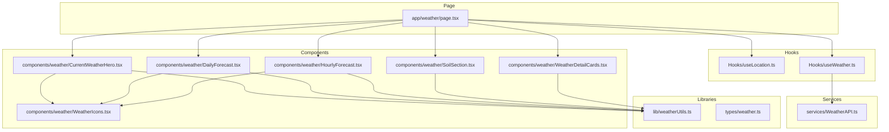
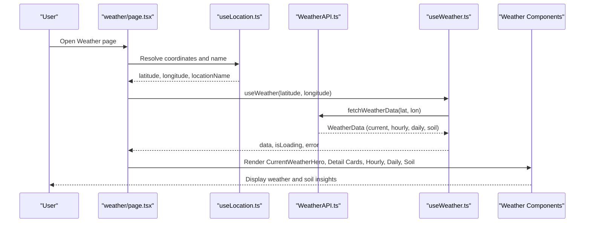
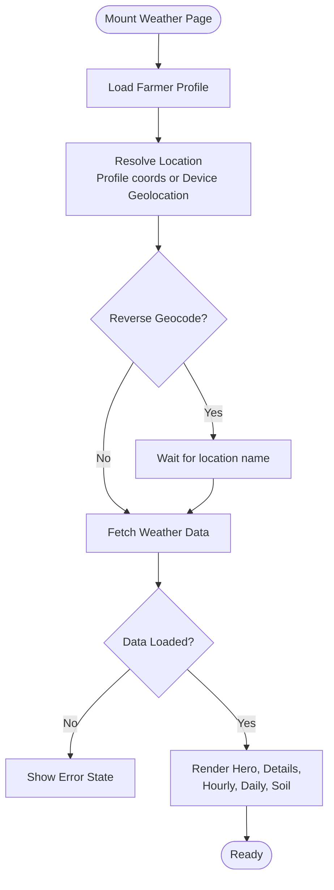
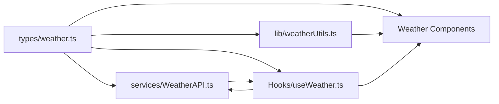

# Weather Module

<cite>
**Referenced Files in This Document**
- [page.tsx](file://Frontend/greenflora/app/weather/page.tsx)
- [CurrentWeatherHero.tsx](file://Frontend/greenflora/components/weather/CurrentWeatherHero.tsx)
- [DailyForecast.tsx](file://Frontend/greenflora/components/weather/DailyForecast.tsx)
- [HourlyForecast.tsx](file://Frontend/greenflora/components/weather/HourlyForecast.tsx)
- [SoilSection.tsx](file://Frontend/greenflora/components/weather/SoilSection.tsx)
- [WeatherDetailCards.tsx](file://Frontend/greenflora/components/weather/WeatherDetailCards.tsx)
- [WeatherIcons.tsx](file://Frontend/greenflora/components/weather/WeatherIcons.tsx)
- [WeatherAPI.ts](file://Frontend/greenflora/services/WeatherAPI.ts)
- [useWeather.ts](file://Frontend/greenflora/Hooks/useWeather.ts)
- [useLocation.ts](file://Frontend/greenflora/Hooks/useLocation.ts)
- [weatherUtils.ts](file://Frontend/greenflora/lib/weatherUtils.ts)
- [weather.ts](file://Frontend/greenflora/types/weather.ts)
</cite>

## Table of Contents
1. [Introduction](#introduction)
2. [Project Structure](#project-structure)
3. [Core Components](#core-components)
4. [Architecture Overview](#architecture-overview)
5. [Detailed Component Analysis](#detailed-component-analysis)
6. [Dependency Analysis](#dependency-analysis)
7. [Performance Considerations](#performance-considerations)
8. [Troubleshooting Guide](#troubleshooting-guide)
9. [Conclusion](#conclusion)

## Introduction
This document explains the Weather module that provides agricultural weather forecasting and soil condition monitoring for farmers. It integrates Open-Meteo to deliver current conditions, hourly and daily forecasts, and estimated soil temperature and moisture. The page resolves the farm location from the farmer profile or device geolocation, reverse-geocodes coordinates to a readable name, and renders components that help farmers make irrigation and fieldwork decisions based on real-time and forecasted data.

## Project Structure
The Weather feature is implemented as a Next.js client page that composes several focused components:
- Page orchestration and state wiring
- Current conditions hero with alerts and refresh controls
- Hourly and daily forecast panels
- Soil environment cards for irrigation planning
- Utility layers for API calls, types, and formatting

**Diagram sources**
- [page.tsx:16-39](file://Frontend/greenflora/app/weather/page.tsx#L16-L39)
- [useLocation.ts:49-163](file://Frontend/greenflora/Hooks/useLocation.ts#L49-L163)
- [useWeather.ts:21-57](file://Frontend/greenflora/Hooks/useWeather.ts#L21-L57)
- [WeatherAPI.ts:141-222](file://Frontend/greenflora/services/WeatherAPI.ts#L141-L222)
- [CurrentWeatherHero.tsx:25-32](file://Frontend/greenflora/components/weather/CurrentWeatherHero.tsx#L25-L32)
- [DailyForecast.tsx:19-20](file://Frontend/greenflora/components/weather/DailyForecast.tsx#L19-L20)
- [HourlyForecast.tsx:18-19](file://Frontend/greenflora/components/weather/HourlyForecast.tsx#L18-L19)
- [SoilSection.tsx:23-28](file://Frontend/greenflora/components/weather/SoilSection.tsx#L23-L28)
- [WeatherDetailCards.tsx:31-37](file://Frontend/greenflora/components/weather/WeatherDetailCards.tsx#L31-L37)
- [weatherUtils.ts:14-194](file://Frontend/greenflora/lib/weatherUtils.ts#L14-L194)
- [weather.ts:9-60](file://Frontend/greenflora/types/weather.ts#L9-L60)

**Section sources**
- [page.tsx:16-39](file://Frontend/greenflora/app/weather/page.tsx#L16-L39)
- [useLocation.ts:49-163](file://Frontend/greenflora/Hooks/useLocation.ts#L49-L163)
- [useWeather.ts:21-57](file://Frontend/greenflora/Hooks/useWeather.ts#L21-L57)
- [WeatherAPI.ts:141-222](file://Frontend/greenflora/services/WeatherAPI.ts#L141-L222)

## Core Components
- CurrentWeatherHero: Displays current temperature, feels-like, weather icon, location name, and actions (refresh/change location). Uses dynamic gradient backgrounds based on weather category.
- WeatherDetailCards: Shows humidity, rain chance, wind speed/direction, cloud cover, UV index, and sunrise/sunset times.
- HourlyForecast: Horizontal strip of next 24 hours with time, icon, temperature, and precipitation probability bar.
- DailyForecast: Vertical list of 7-day forecasts with min/max temperature bars and precipitation probability badges.
- SoilSection: Estimated soil temperature and moisture with labels and visual indicators to guide irrigation planning.

These components are composed by the weather page after resolving location and fetching data.

**Section sources**
- [CurrentWeatherHero.tsx:25-114](file://Frontend/greenflora/components/weather/CurrentWeatherHero.tsx#L25-L114)
- [WeatherDetailCards.tsx:31-182](file://Frontend/greenflora/components/weather/WeatherDetailCards.tsx#L31-L182)
- [HourlyForecast.tsx:18-79](file://Frontend/greenflora/components/weather/HourlyForecast.tsx#L18-L79)
- [DailyForecast.tsx:19-104](file://Frontend/greenflora/components/weather/DailyForecast.tsx#L19-L104)
- [SoilSection.tsx:23-155](file://Frontend/greenflora/components/weather/SoilSection.tsx#L23-L155)

## Architecture Overview
The data flow starts at the weather page, which uses two hooks:
- useLocation: Resolves coordinates from the farmer profile or device geolocation and reverse-geocodes to a human-readable name using Nominatim.
- useWeather: Fetches a complete weather bundle from Open-Meteo for the resolved coordinates.

The service layer makes a single request to Open-Meteo to retrieve current, hourly, daily, and soil fields, then parses the response into typed structures. UI components consume this data to render forecasts and soil insights.

**Diagram sources**
- [page.tsx:41-66](file://Frontend/greenflora/app/weather/page.tsx#L41-L66)
- [useLocation.ts:49-163](file://Frontend/greenflora/Hooks/useLocation.ts#L49-L163)
- [WeatherAPI.ts:141-222](file://Frontend/greenflora/services/WeatherAPI.ts#L141-L222)
- [useWeather.ts:21-57](file://Frontend/greenflora/Hooks/useWeather.ts#L21-L57)

## Detailed Component Analysis

### Page Orchestration and Data Flow
The weather page orchestrates loading states, location resolution, and rendering of all weather sections. It waits until both location name and weather data are available before showing content. It also handles empty/error states and exposes refresh and change-location actions.

**Diagram sources**
- [page.tsx:41-187](file://Frontend/greenflora/app/weather/page.tsx#L41-L187)
- [useLocation.ts:49-163](file://Frontend/greenflora/Hooks/useLocation.ts#L49-L163)
- [useWeather.ts:21-57](file://Frontend/greenflora/Hooks/useWeather.ts#L21-L57)

**Section sources**
- [page.tsx:41-187](file://Frontend/greenflora/app/weather/page.tsx#L41-L187)

### CurrentWeatherHero
Displays the most important current conditions with an animated weather icon, temperature, feels-like, location name, and source badge. Provides refresh and change-location actions. Background gradient adapts to the weather category via utility mapping.

Key behaviors:
- Derives weather info from WMO code to select category and gradient.
- Renders date string and location source label.
- Delegates refresh and location changes to parent handlers.

**Section sources**
- [CurrentWeatherHero.tsx:25-114](file://Frontend/greenflora/components/weather/CurrentWeatherHero.tsx#L25-L114)
- [weatherUtils.ts:14-194](file://Frontend/greenflora/lib/weatherUtils.ts#L14-L194)

### HourlyForecast
Renders a horizontally scrollable strip for the next 24 hours. Each hour shows time, small weather icon, temperature, and a vertical bar indicating precipitation probability.

Design notes:
- Highlights the current hour.
- Uses formatted time helpers.
- Omits component when no hourly data is present.

**Section sources**
- [HourlyForecast.tsx:18-79](file://Frontend/greenflora/components/weather/HourlyForecast.tsx#L18-L79)
- [weatherUtils.ts:245-252](file://Frontend/greenflora/lib/weatherUtils.ts#L245-L252)

### DailyForecast
Shows a 7-day forecast with day labels, icons, min-max temperature bars, and precipitation probability badges. Computes global min/max across days to normalize the temperature bar width.

Design notes:
- Highlights today’s row.
- Uses formatted day labels.
- Omits component when no daily data is present.

**Section sources**
- [DailyForecast.tsx:19-104](file://Frontend/greenflora/components/weather/DailyForecast.tsx#L19-L104)
- [weatherUtils.ts:238-243](file://Frontend/greenflora/lib/weatherUtils.ts#L238-L243)

### SoilSection
Presents estimated soil temperature and moisture with earth-tone visuals and helpful labels. Both values are modeled estimates from Open-Meteo, not sensor readings. If neither value is available, the section is hidden.

Irrigation guidance:
- Soil moisture is converted to a percentage for display and labeled as very dry to saturated.
- Soil temperature is categorized to indicate crop suitability ranges.

**Section sources**
- [SoilSection.tsx:23-155](file://Frontend/greenflora/components/weather/SoilSection.tsx#L23-L155)
- [weatherUtils.ts:267-284](file://Frontend/greenflora/lib/weatherUtils.ts#L267-L284)

### WeatherDetailCards
Provides quick-glance metrics: humidity, rain chance, wind speed/direction, cloud cover, UV index, and sunrise/sunset. Wind direction is rotated visually; UV index is labeled with severity.

**Section sources**
- [WeatherDetailCards.tsx:31-182](file://Frontend/greenflora/components/weather/WeatherDetailCards.tsx#L31-L182)
- [weatherUtils.ts:196-218](file://Frontend/greenflora/lib/weatherUtils.ts#L196-L218)
- [weatherUtils.ts:254-265](file://Frontend/greenflora/lib/weatherUtils.ts#L254-L265)

### Weather Icons
Animated SVG icons per weather category, including day/night variants for clear skies. Small icons are used in forecast lists to reduce animation overhead.

**Section sources**
- [WeatherIcons.tsx:15-473](file://Frontend/greenflora/components/weather/WeatherIcons.tsx#L15-L473)

## Dependency Analysis
The module has clear separation between presentation, hooks, services, and utilities:
- Presentation components depend on typed data and formatting utilities.
- Hooks encapsulate side effects (location and weather fetching).
- Service layer isolates external API calls and parsing.
- Types define contracts across layers.

**Diagram sources**
- [weather.ts:9-124](file://Frontend/greenflora/types/weather.ts#L9-L124)
- [weatherUtils.ts:14-284](file://Frontend/greenflora/lib/weatherUtils.ts#L14-L284)
- [WeatherAPI.ts:141-290](file://Frontend/greenflora/services/WeatherAPI.ts#L141-L290)
- [useWeather.ts:21-57](file://Frontend/greenflora/Hooks/useWeather.ts#L21-L57)
- [CurrentWeatherHero.tsx:25-114](file://Frontend/greenflora/components/weather/CurrentWeatherHero.tsx#L25-L114)
- [DailyForecast.tsx:19-104](file://Frontend/greenflora/components/weather/DailyForecast.tsx#L19-L104)
- [HourlyForecast.tsx:18-79](file://Frontend/greenflora/components/weather/HourlyForecast.tsx#L18-L79)
- [SoilSection.tsx:23-155](file://Frontend/greenflora/components/weather/SoilSection.tsx#L23-L155)

**Section sources**
- [weather.ts:9-124](file://Frontend/greenflora/types/weather.ts#L9-L124)
- [WeatherAPI.ts:141-290](file://Frontend/greenflora/services/WeatherAPI.ts#L141-L290)
- [useWeather.ts:21-57](file://Frontend/greenflora/Hooks/useWeather.ts#L21-L57)

## Performance Considerations
- Single API call: The service requests current, hourly, daily, and soil data in one Open-Meteo call to minimize network round-trips.
- Timeouts and aborts: Requests include timeouts and AbortController usage to avoid hanging requests.
- Conditional rendering: Components hide themselves when data is missing to reduce unnecessary layout work.
- Lightweight icons: Forecast lists use simplified small icons without heavy animations.
- Efficient updates: Hooks manage loading and error states locally to prevent re-renders unless necessary.

Recommendations:
- Add caching at the hook level (e.g., in-memory cache keyed by coordinates) to avoid refetching on navigation back to the page.
- Debounce rapid location changes to avoid excessive reverse-geocoding calls.
- Consider background refresh strategies (e.g., periodic refresh every 10–15 minutes) with stale-while-revalidate patterns.

[No sources needed since this section provides general guidance]

## Troubleshooting Guide
Common issues and resolutions:
- No location available:
  - If the farmer profile lacks coordinates and device geolocation is denied, the page prompts to enable location or set farm location in profile.
  - Reverse geocoding may fail; a coordinate-based fallback label is shown.
- Weather API errors:
  - Network failures, timeouts, or server errors surface as user-friendly messages with a retry action.
- Missing soil data:
  - If soil temperature or moisture is unavailable, the relevant card is hidden gracefully.

Operational tips:
- Use the Refresh button in the hero to retry failed loads.
- Ensure browser supports geolocation and permissions are granted.
- Check internet connectivity if repeated timeouts occur.

**Section sources**
- [page.tsx:103-160](file://Frontend/greenflora/app/weather/page.tsx#L103-L160)
- [useLocation.ts:96-132](file://Frontend/greenflora/Hooks/useLocation.ts#L96-L132)
- [WeatherAPI.ts:187-222](file://Frontend/greenflora/services/WeatherAPI.ts#L187-L222)

## Conclusion
The Weather module delivers actionable agricultural insights through a clean architecture that separates concerns across components, hooks, services, and utilities. It integrates Open-Meteo for comprehensive weather data and models soil conditions to support irrigation planning. The design emphasizes responsive UX, robust error handling, and efficient data fetching. With optional caching and background refresh strategies, it can scale to meet real-world farming workflows where timely and accurate weather information is critical.

[No sources needed since this section summarizes without analyzing specific files]