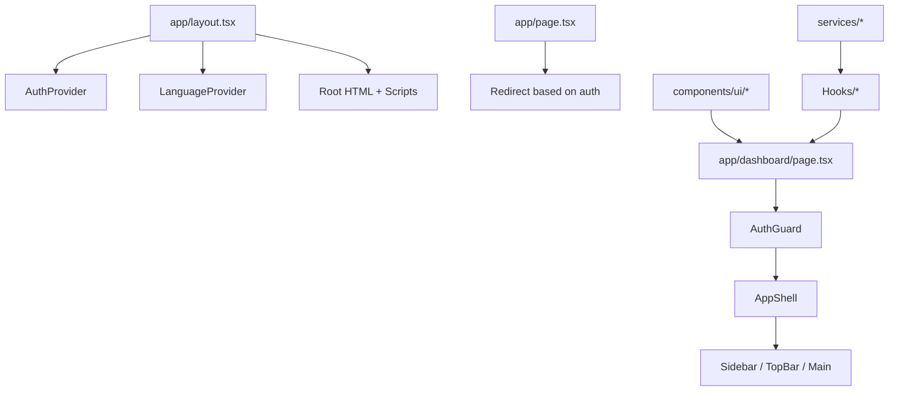
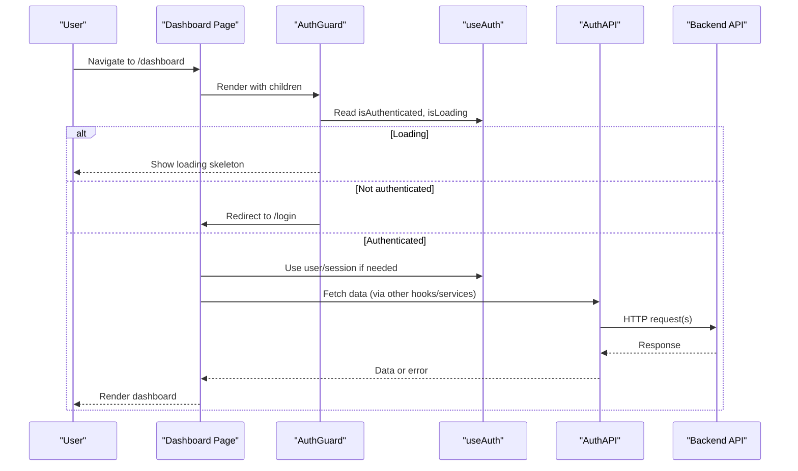
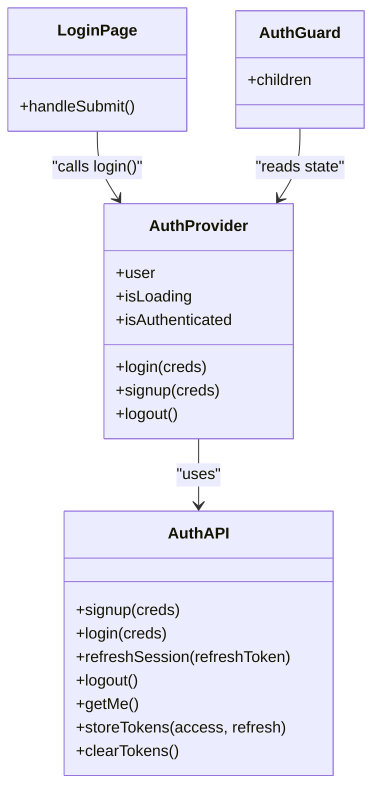
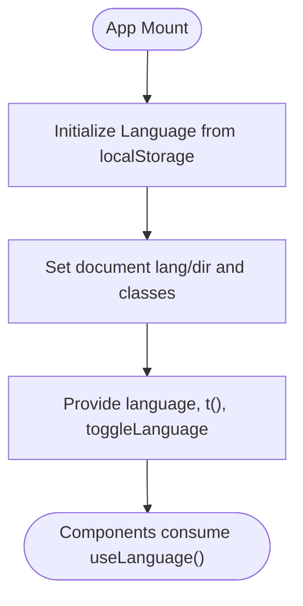
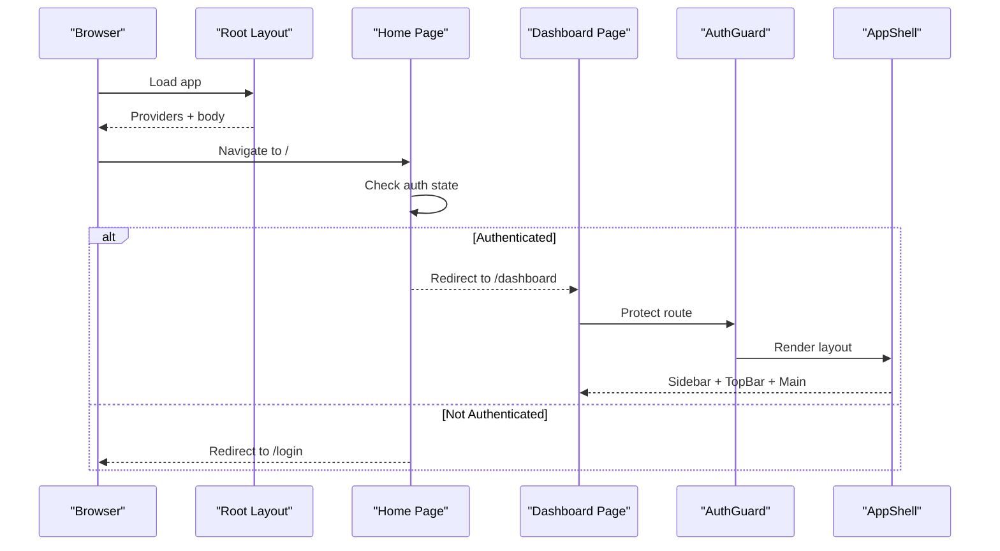
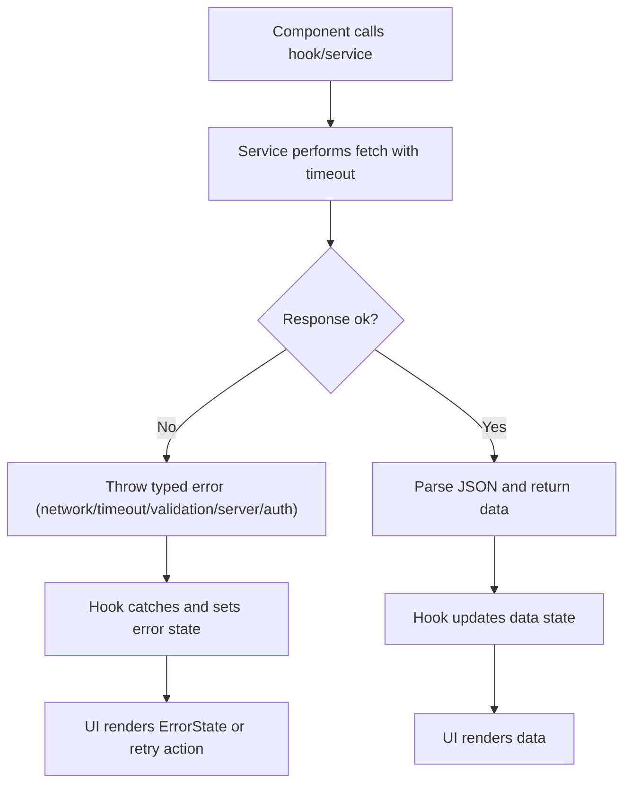
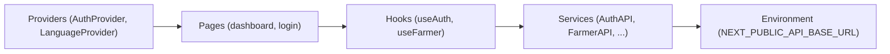

# Frontend Application

<cite>
**Referenced Files in This Document**
- [README.md](file://Frontend/greenflora/README.md)
- [package.json](file://Frontend/greenflora/package.json)
- [next.config.ts](file://Frontend/greenflora/next.config.ts)
- [layout.tsx](file://Frontend/greenflora/app/layout.tsx)
- [page.tsx](file://Frontend/greenflora/app/page.tsx)
- [dashboard/page.tsx](file://Frontend/greenflora/app/dashboard/page.tsx)
- [login/page.tsx](file://Frontend/greenflora/app/login/page.tsx)
- [useAuth.tsx](file://Frontend/greenflora/Hooks/useAuth.tsx)
- [LanguageContext.tsx](file://Frontend/greenflora/contexts/LanguageContext.tsx)
- [AppShell.tsx](file://Frontend/greenflora/components/layout/AppShell.tsx)
- [AuthGuard.tsx](file://Frontend/greenflora/components/auth/AuthGuard.tsx)
- [Button.tsx](file://Frontend/greenflora/components/ui/Button.tsx)
- [AuthAPI.ts](file://Frontend/greenflora/services/AuthAPI.ts)
- [useFarmer.ts](file://Frontend/greenflora/Hooks/useFarmer.ts)
- [auth.ts](file://Frontend/greenflora/types/auth.ts)
</cite>

## Table of Contents
1. Introduction
2. Project Structure
3. Core Components
4. Architecture Overview
5. Detailed Component Analysis
6. Dependency Analysis
7. Performance Considerations
8. Troubleshooting Guide
9. Conclusion

## Introduction
This document explains the Green-Flora frontend application built with Next.js and React. It focuses on the App Router organization, page layout hierarchy, component composition patterns, authentication using custom hooks and protected routes, state management via React Context, responsive design with Tailwind CSS, service-layer API integration, error handling strategies, and performance techniques such as code splitting and efficient data fetching.

The project is a client-side rich application that uses Next.js for routing and layout, React Context for global state (authentication and language), and a service layer to communicate with the backend APIs.

**Section sources**
- [README.md:1-37](file://Frontend/greenflora/README.md#L1-L37)
- [package.json:1-32](file://Frontend/greenflora/package.json#L1-L32)

## Project Structure
Green-Flora follows the Next.js App Router structure:
- app/: Defines pages and layouts. The root layout wraps providers and global scripts. Pages include dashboard, login, signup, and feature pages.
- components/: Reusable UI and layout components grouped by feature (assistant, cropDoctor, dashboard, fields, layout, map, market, profile, ui, weather).
- Hooks/: Custom React hooks encapsulating business logic and data fetching (e.g., useAuth, useFarmer, useFields, useWeather).
- contexts/: Global state providers (e.g., LanguageContext).
- services/: API clients for each domain (Auth, Farmer, Fields, Market, Weather, etc.).
- types/: TypeScript interfaces aligned with backend schemas.

**Diagram sources**
- [layout.tsx:23-95](file://Frontend/greenflora/app/layout.tsx#L23-L95)
- [page.tsx:15-34](file://Frontend/greenflora/app/page.tsx#L15-L34)
- [dashboard/page.tsx:52-238](file://Frontend/greenflora/app/dashboard/page.tsx#L52-L238)
- [AppShell.tsx:12-36](file://Frontend/greenflora/components/layout/AppShell.tsx#L12-L36)

**Section sources**
- [layout.tsx:1-95](file://Frontend/greenflora/app/layout.tsx#L1-L95)
- [page.tsx:1-35](file://Frontend/greenflora/app/page.tsx#L1-L35)
- [dashboard/page.tsx:1-238](file://Frontend/greenflora/app/dashboard/page.tsx#L1-L238)

## Core Components
- Root Layout: Provides font variables, global styles, and wraps children with AuthProvider and LanguageProvider. Also injects Google Translate script safely after interactive load.
- App Shell: Composes Sidebar, TopBar, and main content area with responsive margins and padding.
- UI Primitives: Button with variants, sizes, loading states, and accessibility attributes.
- Protected Route Guard: Renders a loading screen while checking authentication; redirects unauthenticated users to login.

These components are composed throughout pages to ensure consistent UX and maintainability.

**Section sources**
- [layout.tsx:23-95](file://Frontend/greenflora/app/layout.tsx#L23-L95)
- [AppShell.tsx:12-36](file://Frontend/greenflora/components/layout/AppShell.tsx#L12-L36)
- [Button.tsx:1-75](file://Frontend/greenflora/components/ui/Button.tsx#L1-L75)
- [AuthGuard.tsx:1-59](file://Frontend/greenflora/components/auth/AuthGuard.tsx#L1-L59)

## Architecture Overview
The application architecture centers around:
- Providers at the root for authentication and language context.
- Client pages that consume hooks for data and actions.
- Service layer modules that encapsulate HTTP requests, token persistence, and error normalization.
- Protected routes enforced by a guard component.

**Diagram sources**
- [dashboard/page.tsx:52-238](file://Frontend/greenflora/app/dashboard/page.tsx#L52-L238)
- [AuthGuard.tsx:37-59](file://Frontend/greenflora/components/auth/AuthGuard.tsx#L37-L59)
- [useAuth.tsx:46-128](file://Frontend/greenflora/Hooks/useAuth.tsx#L46-L128)
- [AuthAPI.ts:72-137](file://Frontend/greenflora/services/AuthAPI.ts#L72-L137)

## Detailed Component Analysis

### Authentication System
- Context and Provider: AuthProvider manages user session, loading state, and exposes login, signup, logout. On mount, it restores session from stored tokens and refreshes if necessary.
- Hook: useAuth provides typed access to user, flags, and actions.
- Service Layer: AuthAPI centralizes token storage, fetch wrapper with timeout, error classification, and endpoints for login, signup, refresh, logout, and getMe.
- Protected Routes: AuthGuard ensures only authenticated users can view protected pages; shows loading and redirects when needed.

**Diagram sources**
- [useAuth.tsx:46-128](file://Frontend/greenflora/Hooks/useAuth.tsx#L46-L128)
- [AuthAPI.ts:143-179](file://Frontend/greenflora/services/AuthAPI.ts#L143-L179)
- [AuthGuard.tsx:37-59](file://Frontend/greenflora/components/auth/AuthGuard.tsx#L37-L59)
- [login/page.tsx:24-141](file://Frontend/greenflora/app/login/page.tsx#L24-L141)

**Section sources**
- [useAuth.tsx:1-141](file://Frontend/greenflora/Hooks/useAuth.tsx#L1-L141)
- [AuthAPI.ts:1-179](file://Frontend/greenflora/services/AuthAPI.ts#L1-L179)
- [AuthGuard.tsx:1-59](file://Frontend/greenflora/components/auth/AuthGuard.tsx#L1-L59)
- [login/page.tsx:1-141](file://Frontend/greenflora/app/login/page.tsx#L1-L141)
- [auth.ts:1-36](file://Frontend/greenflora/types/auth.ts#L1-L36)

### State Management with React Context
- LanguageContext: Manages current language, persists selection, toggles RTL/LTR direction, and provides a translation function.
- AuthContext: Centralized authentication state and actions as described above.

**Diagram sources**
- [LanguageContext.tsx:24-66](file://Frontend/greenflora/contexts/LanguageContext.tsx#L24-L66)

**Section sources**
- [LanguageContext.tsx:1-66](file://Frontend/greenflora/contexts/LanguageContext.tsx#L1-L66)

### App Router Organization and Page Layout Hierarchy
- Root layout sets up fonts, providers, and global scripts.
- Home page redirects to dashboard or login based on authentication state.
- Dashboard page composes multiple sections: greeting hero, insights, assistant panel, farm snapshot, and government support. It uses guards and shell for consistent layout.

**Diagram sources**
- [layout.tsx:23-95](file://Frontend/greenflora/app/layout.tsx#L23-L95)
- [page.tsx:15-34](file://Frontend/greenflora/app/page.tsx#L15-L34)
- [dashboard/page.tsx:52-238](file://Frontend/greenflora/app/dashboard/page.tsx#L52-L238)
- [AuthGuard.tsx:37-59](file://Frontend/greenflora/components/auth/AuthGuard.tsx#L37-L59)
- [AppShell.tsx:12-36](file://Frontend/greenflora/components/layout/AppShell.tsx#L12-L36)

**Section sources**
- [page.tsx:1-35](file://Frontend/greenflora/app/page.tsx#L1-L35)
- [dashboard/page.tsx:1-238](file://Frontend/greenflora/app/dashboard/page.tsx#L1-L238)

### Responsive Design System with Tailwind CSS
- Utility-first styling via Tailwind classes for spacing, typography, colors, and responsive breakpoints.
- Consistent UI primitives (Button, Input, Cards) enforce visual consistency and accessibility.
- AppShell adapts layout for mobile vs desktop with margin offsets and grid systems.

**Section sources**
- [AppShell.tsx:12-36](file://Frontend/greenflora/components/layout/AppShell.tsx#L12-L36)
- [Button.tsx:1-75](file://Frontend/greenflora/components/ui/Button.tsx#L1-L75)

### Integration with Backend APIs and Error Handling
- Service layer encapsulates fetch calls, timeouts, token injection, and error classification into typed errors.
- Hooks like useFarmer manage loading, error, and refresh cycles, providing a clean interface to pages.
- Login page integrates with useAuth and displays localized error messages.

**Diagram sources**
- [AuthAPI.ts:72-137](file://Frontend/greenflora/services/AuthAPI.ts#L72-L137)
- [useFarmer.ts:40-68](file://Frontend/greenflora/Hooks/useFarmer.ts#L40-L68)
- [login/page.tsx:35-54](file://Frontend/greenflora/app/login/page.tsx#L35-L54)

**Section sources**
- [AuthAPI.ts:1-179](file://Frontend/greenflora/services/AuthAPI.ts#L1-L179)
- [useFarmer.ts:1-88](file://Frontend/greenflora/Hooks/useFarmer.ts#L1-L88)
- [login/page.tsx:1-141](file://Frontend/greenflora/app/login/page.tsx#L1-L141)

## Dependency Analysis
Key dependencies and relationships:
- Pages depend on hooks for data and actions.
- Hooks depend on services for network operations.
- Services depend on environment configuration for base URL and handle token persistence.
- Providers wrap the entire app to supply global state.

**Diagram sources**
- [dashboard/page.tsx:52-238](file://Frontend/greenflora/app/dashboard/page.tsx#L52-L238)
- [useAuth.tsx:46-128](file://Frontend/greenflora/Hooks/useAuth.tsx#L46-L128)
- [AuthAPI.ts:16-18](file://Frontend/greenflora/services/AuthAPI.ts#L16-L18)
- [layout.tsx:63-67](file://Frontend/greenflora/app/layout.tsx#L63-L67)

**Section sources**
- [dashboard/page.tsx:1-238](file://Frontend/greenflora/app/dashboard/page.tsx#L1-L238)
- [useAuth.tsx:1-141](file://Frontend/greenflora/Hooks/useAuth.tsx#L1-L141)
- [AuthAPI.ts:1-179](file://Frontend/greenflora/services/AuthAPI.ts#L1-L179)
- [layout.tsx:1-95](file://Frontend/greenflora/app/layout.tsx#L1-L95)

## Performance Considerations
- Code Splitting: Next.js automatically splits code per route; client-only pages and components reduce initial bundle size.
- Lazy Loading: Use dynamic imports for heavy features (maps, charts) where applicable to defer non-critical assets.
- Efficient Data Fetching:
  - Coalesce related data in hooks to minimize re-renders.
  - Use AbortController for request timeouts to avoid stale updates.
  - Prefer optimistic UI updates where safe, then reconcile with server state.
- Rendering Optimization:
  - Memoize derived values with useMemo and useCallback to prevent unnecessary recalculations.
  - Keep UI components pure and split large pages into smaller reusable components.
- Network Efficiency:
  - Cache responses at the service layer or use SWR/React Query patterns if adopted later.
  - Batch requests when possible to reduce round trips.

[No sources needed since this section provides general guidance]

## Troubleshooting Guide
Common issues and strategies:
- Authentication failures:
  - Token expiration triggers refresh flow; if refresh fails, tokens are cleared and user redirected to login.
  - Errors are classified (auth, server, network, timeout) to guide UI feedback.
- Network errors:
  - Requests time out after a fixed duration; UI should show retry options.
  - Validate environment variable NEXT_PUBLIC_API_BASE_URL to ensure correct backend address.
- Profile loading errors:
  - useFarmer surfaces error messages and offers refresh actions.
- UI responsiveness:
  - Ensure Tailwind classes are correctly applied; verify build toolchain for PostCSS/Tailwind integration.

**Section sources**
- [useAuth.tsx:50-88](file://Frontend/greenflora/Hooks/useAuth.tsx#L50-L88)
- [AuthAPI.ts:72-137](file://Frontend/greenflora/services/AuthAPI.ts#L72-L137)
- [useFarmer.ts:40-68](file://Frontend/greenflora/Hooks/useFarmer.ts#L40-L68)

## Conclusion
Green-Flora’s frontend leverages Next.js App Router for structured routing and layout, React Context for global state, and a robust service layer for API integration. Authentication is centralized with clear separation of concerns, protected routes ensure security, and Tailwind CSS enables a responsive, consistent UI. Performance is addressed through code splitting, efficient data fetching, and memoization. The modular architecture supports scalability and maintainability as features grow.

[No sources needed since this section summarizes without analyzing specific files]