# State Management

<cite>
**Referenced Files in This Document**
- [useFarmer.ts](file://Frontend/greenflora/Hooks/useFarmer.ts)
- [useFields.ts](file://Frontend/greenflora/Hooks/useFields.ts)
- [useMarket.ts](file://Frontend/greenflora/Hooks/useMarket.ts)
- [useWeather.ts](file://Frontend/greenflora/Hooks/useWeather.ts)
- [useAuth.tsx](file://Frontend/greenflora/Hooks/useAuth.tsx)
- [LanguageContext.tsx](file://Frontend/greenflora/contexts/LanguageContext.tsx)
- [translations.ts](file://Frontend/greenflora/lib/translations.ts)
- [dataStates.ts](file://Frontend/greenflora/lib/dataStates.ts)
- [FarmerAPI.tsx](file://Frontend/greenflora/services/FarmerAPI.tsx)
- [FieldAPI.ts](file://Frontend/greenflora/services/FieldAPI.ts)
- [MarketAPI.ts](file://Frontend/greenflora/services/MarketAPI.ts)
- [AuthAPI.ts](file://Frontend/greenflora/services/AuthAPI.ts)
- [useAssistant.ts](file://Frontend/greenflora/Hooks/useAssistant.ts)
- [useGovernmentSupport.ts](file://Frontend/greenflora/Hooks/useGovernmentSupport.ts)
- [useLocation.ts](file://Frontend/greenflora/Hooks/useLocation.ts)
</cite>

## Table of Contents
1. Introduction
2. Project Structure
3. Core Components
4. Architecture Overview
5. Detailed Component Analysis
6. Dependency Analysis
7. Performance Considerations
8. Troubleshooting Guide
9. Conclusion

## Introduction
This document explains the Green-Flora state management system built around custom React hooks and context-based global state. Each major domain (farmer, fields, market, weather, assistant, government support, location, authentication) is encapsulated in a dedicated hook that manages local state, API calls, loading/error states, and data synchronization. A LanguageContext provides internationalization and persistent language preferences. The system emphasizes robust error handling, graceful fallbacks, and performance-conscious patterns such as memoization, selective re-renders, and efficient data fetching strategies.

## Project Structure
The frontend organizes stateful logic into:
- Hooks: per-domain state and side effects
- Services: HTTP clients with timeouts, auth injection, and typed errors
- Contexts: global app-wide state (authentication, language)
- Utilities: shared helpers for formatting, completeness scoring, and translations

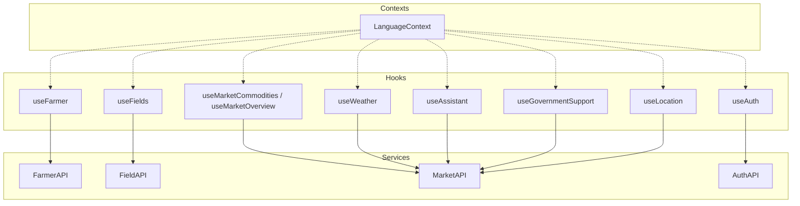

**Diagram sources**
- [useFarmer.ts:1-88](file://Frontend/greenflora/Hooks/useFarmer.ts#L1-L88)
- [useFields.ts:1-159](file://Frontend/greenflora/Hooks/useFields.ts#L1-L159)
- [useMarket.ts:1-135](file://Frontend/greenflora/Hooks/useMarket.ts#L1-L135)
- [useWeather.ts:1-58](file://Frontend/greenflora/Hooks/useWeather.ts#L1-L58)
- [useAuth.tsx:1-141](file://Frontend/greenflora/Hooks/useAuth.tsx#L1-L141)
- [LanguageContext.tsx:1-66](file://Frontend/greenflora/contexts/LanguageContext.tsx#L1-L66)
- [FarmerAPI.tsx:1-109](file://Frontend/greenflora/services/FarmerAPI.tsx#L1-L109)
- [FieldAPI.ts:1-171](file://Frontend/greenflora/services/FieldAPI.ts#L1-L171)
- [MarketAPI.ts:1-128](file://Frontend/greenflora/services/MarketAPI.ts#L1-L128)
- [AuthAPI.ts:1-179](file://Frontend/greenflora/services/AuthAPI.ts#L1-L179)

**Section sources**
- [useFarmer.ts:1-88](file://Frontend/greenflora/Hooks/useFarmer.ts#L1-L88)
- [useFields.ts:1-159](file://Frontend/greenflora/Hooks/useFields.ts#L1-L159)
- [useMarket.ts:1-135](file://Frontend/greenflora/Hooks/useMarket.ts#L1-L135)
- [useWeather.ts:1-58](file://Frontend/greenflora/Hooks/useWeather.ts#L1-L58)
- [useAuth.tsx:1-141](file://Frontend/greenflora/Hooks/useAuth.tsx#L1-L141)
- [LanguageContext.tsx:1-66](file://Frontend/greenflora/contexts/LanguageContext.tsx#L1-L66)
- [FarmerAPI.tsx:1-109](file://Frontend/greenflora/services/FarmerAPI.tsx#L1-L109)
- [FieldAPI.ts:1-171](file://Frontend/greenflora/services/FieldAPI.ts#L1-L171)
- [MarketAPI.ts:1-128](file://Frontend/greenflora/services/MarketAPI.ts#L1-L128)
- [AuthAPI.ts:1-179](file://Frontend/greenflora/services/AuthAPI.ts#L1-L179)

## Core Components
- Domain hooks encapsulate lifecycle, loading, error, and mutation actions per feature area.
- Services centralize HTTP requests, timeouts, token injection, and typed error classification.
- Contexts provide cross-cutting concerns: authentication state and language preferences.
- Utilities standardize display values, currency formatting, and profile completeness calculation.

Key responsibilities:
- Farmer: load/update profile, compute completeness, expose refresh/saveUpdate.
- Fields: farm summary CRUD for fields and crop cycles; centralized mutation wrapper.
- Market: commodities list and overview with request deduplication and safe filter changes.
- Weather: fetch by coordinates with null-guarding and error mapping.
- Assistant: streaming chat, voice capture/transcription/TTS, resilient error handling.
- Government Support: lightweight dashboard card data.
- Location: resolve coordinates from farmer profile or device, reverse geocode to name.
- Auth: session restore, login/signup/logout, token persistence via service layer.
- Language: persist language choice, set document direction, provide translation function.

**Section sources**
- [useFarmer.ts:1-88](file://Frontend/greenflora/Hooks/useFarmer.ts#L1-L88)
- [useFields.ts:1-159](file://Frontend/greenflora/Hooks/useFields.ts#L1-L159)
- [useMarket.ts:1-135](file://Frontend/greenflora/Hooks/useMarket.ts#L1-L135)
- [useWeather.ts:1-58](file://Frontend/greenflora/Hooks/useWeather.ts#L1-L58)
- [useAssistant.ts:1-699](file://Frontend/greenflora/Hooks/useAssistant.ts#L1-L699)
- [useGovernmentSupport.ts:1-52](file://Frontend/greenflora/Hooks/useGovernmentSupport.ts#L1-L52)
- [useLocation.ts:1-176](file://Frontend/greenflora/Hooks/useLocation.ts#L1-L176)
- [useAuth.tsx:1-141](file://Frontend/greenflora/Hooks/useAuth.tsx#L1-L141)
- [LanguageContext.tsx:1-66](file://Frontend/greenflora/contexts/LanguageContext.tsx#L1-L66)
- [dataStates.ts:1-54](file://Frontend/greenflora/lib/dataStates.ts#L1-L54)

## Architecture Overview
The application follows a hook-driven architecture where each feature owns its state and side effects. Services abstract network details and enforce consistent error handling and timeouts. Contexts provide global state for authentication and language. Data flows from services into hooks, which expose stable interfaces to components.

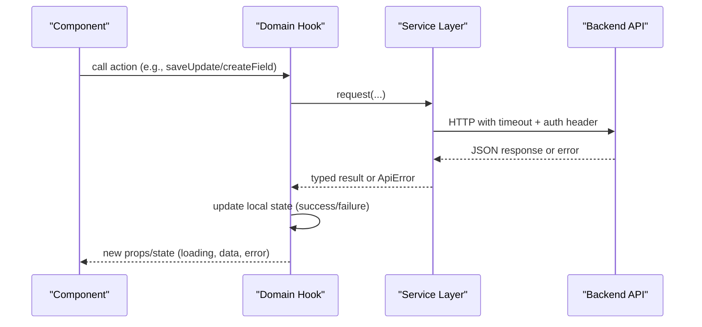

**Diagram sources**
- [useFarmer.ts:34-88](file://Frontend/greenflora/Hooks/useFarmer.ts#L34-L88)
- [useFields.ts:51-159](file://Frontend/greenflora/Hooks/useFields.ts#L51-L159)
- [FarmerAPI.tsx:42-109](file://Frontend/greenflora/services/FarmerAPI.tsx#L42-L109)
- [FieldAPI.ts:48-171](file://Frontend/greenflora/services/FieldAPI.ts#L48-L171)

## Detailed Component Analysis

### Farmer Domain Hook
- Loads current farmer profile on mount, exposes refresh/saveUpdate, tracks loading/saving/error, and computes completeness using a utility.
- Uses useCallback for stable functions and useMemo for derived metrics.

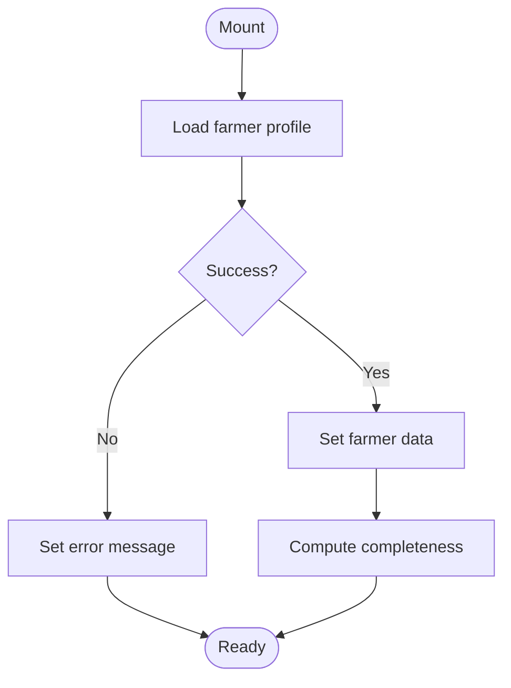

**Diagram sources**
- [useFarmer.ts:34-88](file://Frontend/greenflora/Hooks/useFarmer.ts#L34-L88)
- [dataStates.ts:38-54](file://Frontend/greenflora/lib/dataStates.ts#L38-L54)

**Section sources**
- [useFarmer.ts:1-88](file://Frontend/greenflora/Hooks/useFarmer.ts#L1-L88)
- [dataStates.ts:1-54](file://Frontend/greenflora/lib/dataStates.ts#L1-L54)

### Fields Domain Hook
- Manages farm summary and CRUD for fields and crop cycles.
- Centralizes mutation lifecycle with a wrapMutation helper to track isMutating and reset errors.
- After each mutation, reloads summary to keep UI consistent.

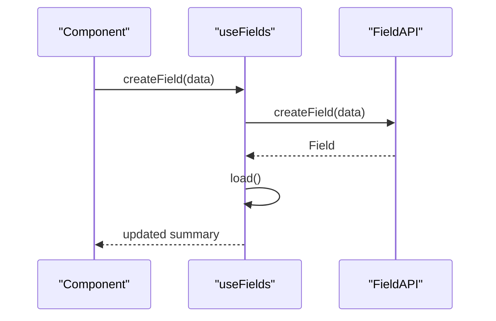

**Diagram sources**
- [useFields.ts:74-143](file://Frontend/greenflora/Hooks/useFields.ts#L74-L143)
- [FieldAPI.ts:119-138](file://Frontend/greenflora/services/FieldAPI.ts#L119-L138)

**Section sources**
- [useFields.ts:1-159](file://Frontend/greenflora/Hooks/useFields.ts#L1-L159)
- [FieldAPI.ts:1-171](file://Frontend/greenflora/services/FieldAPI.ts#L1-L171)

### Market Domain Hook
- useMarketCommodities loads available crops once.
- useMarketOverview fetches a 180-day overview per (commodityId, marketId), guarding against out-of-order responses with a requestId ref and only showing results for the current filter key.

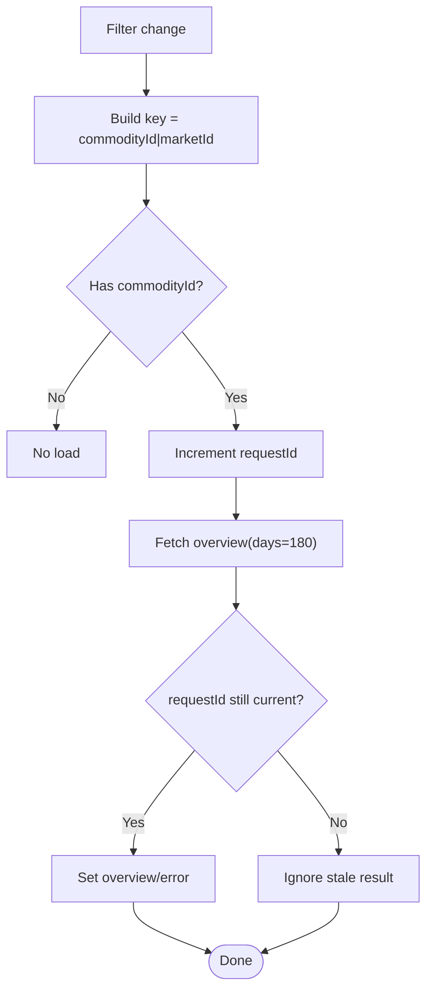

**Diagram sources**
- [useMarket.ts:80-135](file://Frontend/greenflora/Hooks/useMarket.ts#L80-L135)

**Section sources**
- [useMarket.ts:1-135](file://Frontend/greenflora/Hooks/useMarket.ts#L1-L135)
- [MarketAPI.ts:1-128](file://Frontend/greenflora/services/MarketAPI.ts#L1-L128)

### Weather Domain Hook
- Fetches weather data for given latitude/longitude with null guards and maps errors to user-friendly messages.

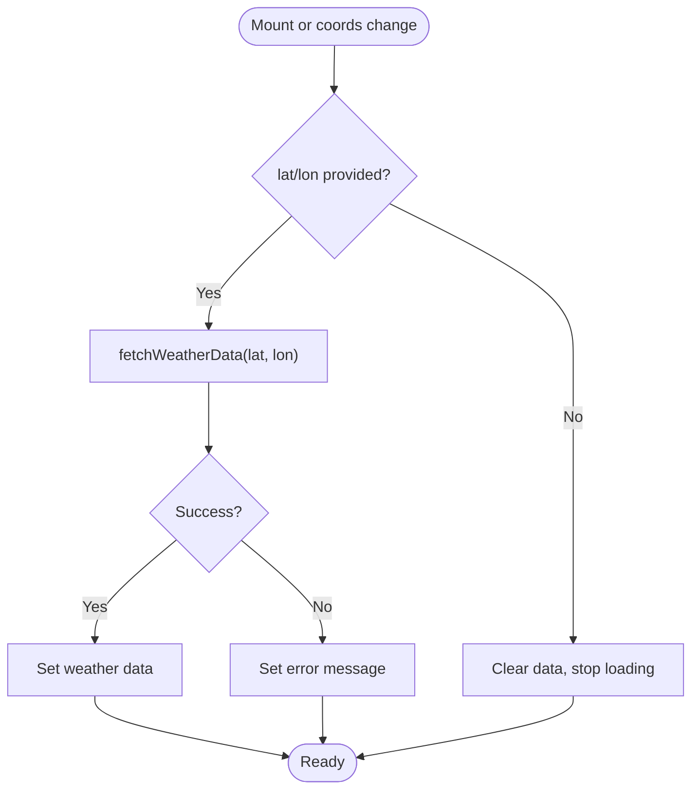

**Diagram sources**
- [useWeather.ts:21-58](file://Frontend/greenflora/Hooks/useWeather.ts#L21-L58)

**Section sources**
- [useWeather.ts:1-58](file://Frontend/greenflora/Hooks/useWeather.ts#L1-L58)

### Authentication Context and Hook
- Restores session on mount by reading stored tokens, refreshing if needed, and fetching current user.
- Provides login/signup/logout with token persistence handled entirely in the service layer.

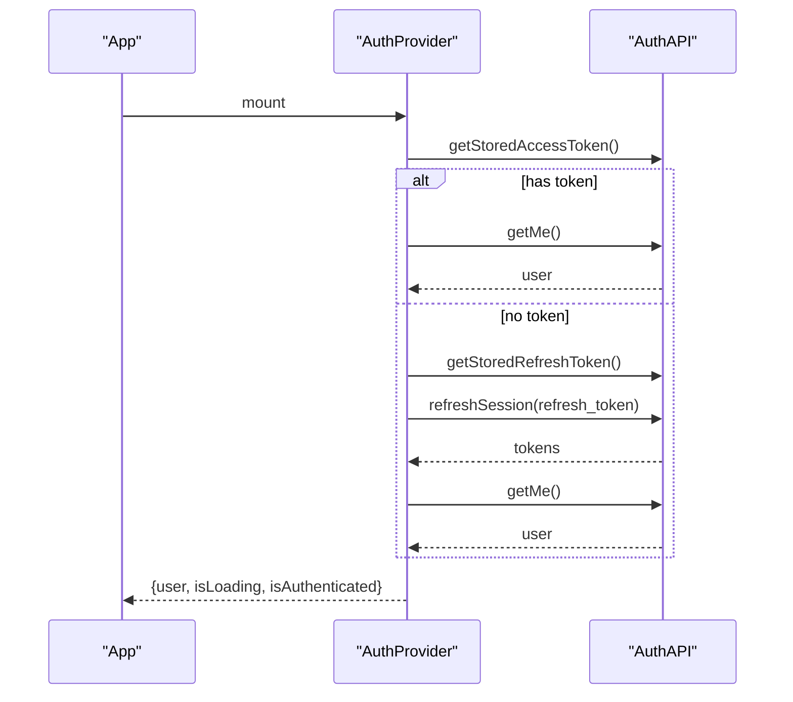

**Diagram sources**
- [useAuth.tsx:46-128](file://Frontend/greenflora/Hooks/useAuth.tsx#L46-L128)
- [AuthAPI.ts:28-179](file://Frontend/greenflora/services/AuthAPI.ts#L28-L179)

**Section sources**
- [useAuth.tsx:1-141](file://Frontend/greenflora/Hooks/useAuth.tsx#L1-L141)
- [AuthAPI.ts:1-179](file://Frontend/greenflora/services/AuthAPI.ts#L1-L179)

### Language Context
- Persists selected language in localStorage and applies RTL/LTR direction to the document root.
- Exposes t(key) to retrieve localized strings from translations.

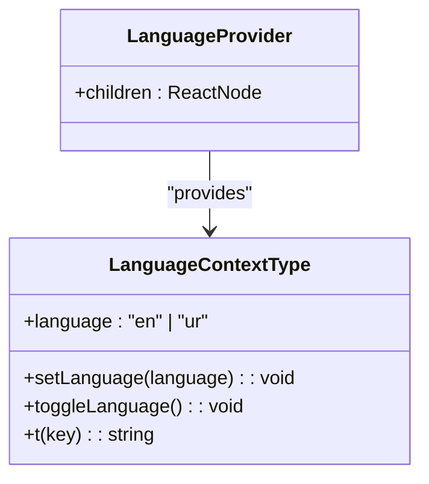

**Diagram sources**
- [LanguageContext.tsx:15-66](file://Frontend/greenflora/contexts/LanguageContext.tsx#L15-L66)
- [translations.ts:1-32](file://Frontend/greenflora/lib/translations.ts#L1-L32)

**Section sources**
- [LanguageContext.tsx:1-66](file://Frontend/greenflora/contexts/LanguageContext.tsx#L1-L66)
- [translations.ts:1-32](file://Frontend/greenflora/lib/translations.ts#L1-L32)

### Assistant Hook (Streaming Chat, Voice, TTS)
- Implements a phase machine: ready → listening → transcribing → thinking → generating → speaking → ready.
- Streams deltas to build assistant replies, supports retryable errors, and integrates microphone capture and text-to-speech playback.
- Uses refs to manage async flows safely and avoid stale updates.

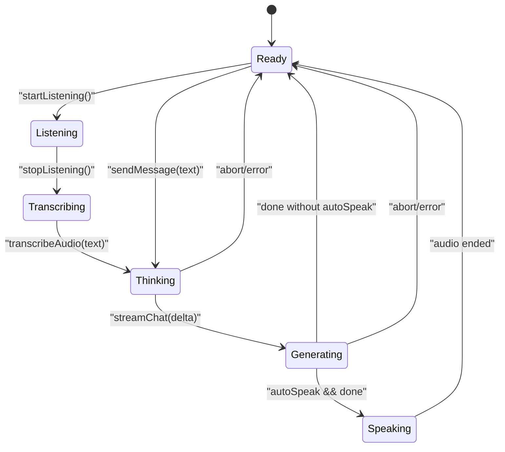

**Diagram sources**
- [useAssistant.ts:42-699](file://Frontend/greenflora/Hooks/useAssistant.ts#L42-L699)

**Section sources**
- [useAssistant.ts:1-699](file://Frontend/greenflora/Hooks/useAssistant.ts#L1-L699)

### Government Support Hook
- Loads active government support info for dashboard cards with standard loading/error/refresh pattern.

**Section sources**
- [useGovernmentSupport.ts:1-52](file://Frontend/greenflora/Hooks/useGovernmentSupport.ts#L1-L52)

### Location Hook
- Resolves coordinates from farmer profile first, then falls back to device geolocation.
- Reverse geocodes to a readable name with staleness protection via request id ref.

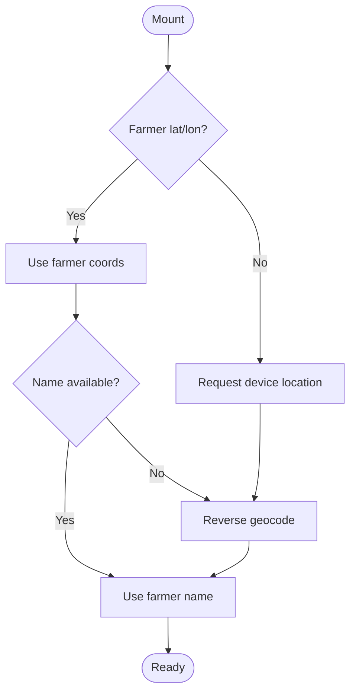

**Diagram sources**
- [useLocation.ts:49-176](file://Frontend/greenflora/Hooks/useLocation.ts#L49-L176)

**Section sources**
- [useLocation.ts:1-176](file://Frontend/greenflora/Hooks/useLocation.ts#L1-L176)

## Dependency Analysis
- Hooks depend on their respective services for networking.
- Services depend on AuthAPI for token retrieval and optional inclusion in headers.
- LanguageContext depends on translations and persists preference to localStorage.
- Assistant hook composes multiple capabilities (SSE streaming, media recording, TTS) while remaining isolated from other domains.

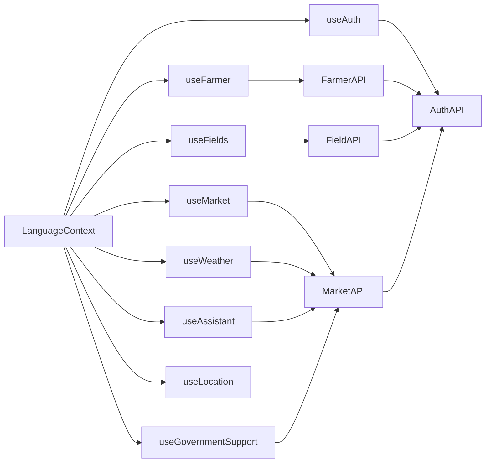

**Diagram sources**
- [useFarmer.ts:1-88](file://Frontend/greenflora/Hooks/useFarmer.ts#L1-L88)
- [useFields.ts:1-159](file://Frontend/greenflora/Hooks/useFields.ts#L1-L159)
- [useMarket.ts:1-135](file://Frontend/greenflora/Hooks/useMarket.ts#L1-L135)
- [useWeather.ts:1-58](file://Frontend/greenflora/Hooks/useWeather.ts#L1-L58)
- [useAuth.tsx:1-141](file://Frontend/greenflora/Hooks/useAuth.tsx#L1-L141)
- [useAssistant.ts:1-699](file://Frontend/greenflora/Hooks/useAssistant.ts#L1-L699)
- [useGovernmentSupport.ts:1-52](file://Frontend/greenflora/Hooks/useGovernmentSupport.ts#L1-L52)
- [useLocation.ts:1-176](file://Frontend/greenflora/Hooks/useLocation.ts#L1-L176)
- [FarmerAPI.tsx:1-109](file://Frontend/greenflora/services/FarmerAPI.tsx#L1-L109)
- [FieldAPI.ts:1-171](file://Frontend/greenflora/services/FieldAPI.ts#L1-L171)
- [MarketAPI.ts:1-128](file://Frontend/greenflora/services/MarketAPI.ts#L1-L128)
- [AuthAPI.ts:1-179](file://Frontend/greenflora/services/AuthAPI.ts#L1-L179)
- [LanguageContext.tsx:1-66](file://Frontend/greenflora/contexts/LanguageContext.tsx#L1-L66)

**Section sources**
- [useFarmer.ts:1-88](file://Frontend/greenflora/Hooks/useFarmer.ts#L1-L88)
- [useFields.ts:1-159](file://Frontend/greenflora/Hooks/useFields.ts#L1-L159)
- [useMarket.ts:1-135](file://Frontend/greenflora/Hooks/useMarket.ts#L1-L135)
- [useWeather.ts:1-58](file://Frontend/greenflora/Hooks/useWeather.ts#L1-L58)
- [useAuth.tsx:1-141](file://Frontend/greenflora/Hooks/useAuth.tsx#L1-L141)
- [useAssistant.ts:1-699](file://Frontend/greenflora/Hooks/useAssistant.ts#L1-L699)
- [useGovernmentSupport.ts:1-52](file://Frontend/greenflora/Hooks/useGovernmentSupport.ts#L1-L52)
- [useLocation.ts:1-176](file://Frontend/greenflora/Hooks/useLocation.ts#L1-L176)
- [FarmerAPI.tsx:1-109](file://Frontend/greenflora/services/FarmerAPI.tsx#L1-L109)
- [FieldAPI.ts:1-171](file://Frontend/greenflora/services/FieldAPI.ts#L1-L171)
- [MarketAPI.ts:1-128](file://Frontend/greenflora/services/MarketAPI.ts#L1-L128)
- [AuthAPI.ts:1-179](file://Frontend/greenflora/services/AuthAPI.ts#L1-L179)
- [LanguageContext.tsx:1-66](file://Frontend/greenflora/contexts/LanguageContext.tsx#L1-L66)

## Performance Considerations
- Memoization:
  - useCallback stabilizes handlers to prevent unnecessary re-renders in consumers.
  - useMemo derives expensive values like completeness from stable dependencies.
- Selective Re-renders:
  - Hooks return minimal, focused objects so components subscribe only to relevant state slices.
  - Market overview isolates results per filter key to avoid stale UI updates.
- Efficient Data Fetching:
  - Single source of truth per domain: hooks trigger refresh after mutations to keep UI consistent.
  - Request timeouts and abort controllers prevent hanging requests and memory leaks.
  - Market overview uses a 180-day window and client-side slicing for instant period switching.
- Streaming and Real-time Updates:
  - Assistant hook streams deltas to render progressive responses and reduces perceived latency.
  - Microphone and TTS are managed with refs to avoid re-renders during audio events.
- Error Handling and Resilience:
  - Services classify errors (network, timeout, validation, server) for targeted UX.
  - Hooks surface friendly messages and maintain loading states even on failure.
  - Assistant gracefully degrades when TTS fails without breaking text replies.

[No sources needed since this section provides general guidance]

## Troubleshooting Guide
Common issues and recovery mechanisms:
- Network/Timeout Errors:
  - Services throw typed errors with status and type; hooks catch and set user-facing messages.
  - AbortController ensures requests can be canceled on unmount or when superseded.
- Stale Results:
  - Market overview and location resolution use request id refs to ignore outdated responses.
- Session Issues:
  - Auth provider attempts refresh on failed getMe and clears tokens on failure.
- Voice Features:
  - Microphone permission denials and transcription failures show notices without blocking typing.
  - TTS failures do not break text replies; a one-time notice informs users.

**Section sources**
- [FarmerAPI.tsx:18-90](file://Frontend/greenflora/services/FarmerAPI.tsx#L18-L90)
- [FieldAPI.ts:24-101](file://Frontend/greenflora/services/FieldAPI.ts#L24-L101)
- [MarketAPI.ts:22-94](file://Frontend/greenflora/services/MarketAPI.ts#L22-L94)
- [AuthAPI.ts:52-137](file://Frontend/greenflora/services/AuthAPI.ts#L52-L137)
- [useMarket.ts:80-135](file://Frontend/greenflora/Hooks/useMarket.ts#L80-L135)
- [useLocation.ts:62-93](file://Frontend/greenflora/Hooks/useLocation.ts#L62-L93)
- [useAssistant.ts:221-255](file://Frontend/greenflora/Hooks/useAssistant.ts#L221-L255)
- [useAssistant.ts:457-489](file://Frontend/greenflora/Hooks/useAssistant.ts#L457-L489)

## Conclusion
Green-Flora’s state management leverages a consistent hook-based pattern with clear separation between UI state, side effects, and networking. Each domain hook encapsulates loading, error, and mutation logic, while services standardize HTTP behavior and error classification. Global contexts handle authentication and internationalization with persistence. The system emphasizes resilience through timeouts, abort control, stale-result guards, and graceful degradation—especially for real-time features like streaming chat and voice interactions. These patterns collectively deliver a responsive, maintainable, and user-friendly experience across the application.

[No sources needed since this section summarizes without analyzing specific files]