# UI Components

<cite>
**Referenced Files in This Document**
- [Button.tsx](file://Frontend/greenflora/components/ui/Button.tsx)
- [Card.tsx](file://Frontend/greenflora/components/ui/Card.tsx)
- [Input.tsx](file://Frontend/greenflora/components/ui/Input.tsx)
- [Badge.tsx](file://Frontend/greenflora/components/ui/Badge.tsx)
- [LoadingState.tsx](file://Frontend/greenflora/components/ui/LoadingState.tsx)
- [ErrorState.tsx](file://Frontend/greenflora/components/ui/ErrorState.tsx)
- [EmptyState.tsx](file://Frontend/greenflora/components/ui/EmptyState.tsx)
- [ProgressBar.tsx](file://Frontend/greenflora/components/ui/ProgressBar.tsx)
- [Select.tsx](file://Frontend/greenflora/components/ui/Select.tsx)
- [globals.css](file://Frontend/greenflora/app/globals.css)
- [postcss.config.mjs](file://Frontend/greenflora/postcss.config.mjs)
- [package.json](file://Frontend/greenflora/package.json)
- [StatCard.tsx](file://Frontend/greenflora/components/dashboard/StatCard.tsx)
- [FeatureCard.tsx](file://Frontend/greenflora/components/dashboard/FeatureCard.tsx)
</cite>

## Table of Contents
1. Introduction
2. Project Structure
3. Core Components
4. Architecture Overview
5. Detailed Component Analysis
6. Dependency Analysis
7. Performance Considerations
8. Troubleshooting Guide
9. Conclusion

## Introduction
This document describes the Green-Flora reusable UI component library focused on the base component system built with React and Tailwind CSS. It covers the core components (Button, Card, Input, Badge, LoadingState, ErrorState), their props, styling options, usage patterns, accessibility considerations, and how they integrate with the design system. It also explains composition principles, theme support via CSS custom properties, responsive behavior, customization strategies, and performance techniques such as memoization and efficient re-rendering.

## Project Structure
The UI components live under a dedicated ui folder and are styled using Tailwind CSS v4 with a centralized design token system defined in global styles. The project uses Next.js and React 19, with Tailwind configured via PostCSS.

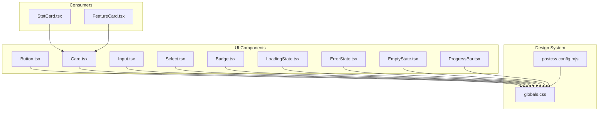

**Diagram sources**
- [Button.tsx:1-75](file://Frontend/greenflora/components/ui/Button.tsx#L1-L75)
- [Card.tsx:1-39](file://Frontend/greenflora/components/ui/Card.tsx#L1-L39)
- [Input.tsx:1-47](file://Frontend/greenflora/components/ui/Input.tsx#L1-L47)
- [Select.tsx:1-66](file://Frontend/greenflora/components/ui/Select.tsx#L1-L66)
- [Badge.tsx:1-31](file://Frontend/greenflora/components/ui/Badge.tsx#L1-L31)
- [LoadingState.tsx:1-56](file://Frontend/greenflora/components/ui/LoadingState.tsx#L1-L56)
- [ErrorState.tsx:1-39](file://Frontend/greenflora/components/ui/ErrorState.tsx#L1-L39)
- [EmptyState.tsx:1-34](file://Frontend/greenflora/components/ui/EmptyState.tsx#L1-L34)
- [ProgressBar.tsx:1-50](file://Frontend/greenflora/components/ui/ProgressBar.tsx#L1-L50)
- [globals.css:1-175](file://Frontend/greenflora/app/globals.css#L1-L175)
- [postcss.config.mjs:1-7](file://Frontend/greenflora/postcss.config.mjs#L1-L7)
- [StatCard.tsx:1-31](file://Frontend/greenflora/components/dashboard/StatCard.tsx#L1-L31)
- [FeatureCard.tsx:1-52](file://Frontend/greenflora/components/dashboard/FeatureCard.tsx#L1-L52)

**Section sources**
- [globals.css:1-175](file://Frontend/greenflora/app/globals.css#L1-L175)
- [postcss.config.mjs:1-7](file://Frontend/greenflora/postcss.config.mjs#L1-L7)
- [package.json:1-32](file://Frontend/greenflora/package.json#L1-L32)

## Core Components
This section summarizes each base component’s purpose, props, styling options, and accessibility notes.

- Button
  - Purpose: Primary interactive element with variants and sizes; supports loading state.
  - Props: children, variant (primary, secondary, ghost, danger), size (sm, md, lg), isLoading, disabled, className, plus standard button attributes.
  - Styling: Uses design tokens for colors, focus rings, transitions, and rounded corners.
  - Accessibility: Focus-visible ring, aria-hidden on decorative spinner, disabled state handled.
  - Usage pattern: Wrap content; combine with icons; use isLoading to disable and show spinner.

- Card
  - Purpose: Container with consistent padding and visual elevation.
  - Props: children, variant (default, elevated, outlined), padding (none, sm, md, lg), className.
  - Styling: Applies surface colors, borders, shadows, and border radius from design tokens.
  - Accessibility: Semantic div container; compose with semantic elements inside.
  - Usage pattern: Enclose related content; choose variant based on hierarchy.

- Input
  - Purpose: Accessible text input with label, hint, and error states.
  - Props: label, error, hint, id/name, className, plus standard input attributes.
  - Styling: Focus ring, error border color, neutral placeholder and text.
  - Accessibility: Label linked via htmlFor/id; error message visually distinct.
  - Usage pattern: Pair with form state; display hints unless errors exist.

- Badge
  - Purpose: Small status or category indicator.
  - Props: children, variant (default, success, warning, danger, info, neutral), className.
  - Styling: Background and text colors mapped to semantic tokens.
  - Accessibility: Semantic span; avoid conveying meaning solely by color.
  - Usage pattern: Use alongside labels or data points to indicate status.

- LoadingState
  - Purpose: Centered spinner with optional message; includes skeleton helpers for cards/stat cards.
  - Props: message, className.
  - Styling: Spinner animation and subtle pulse skeletons using design tokens.
  - Accessibility: Provides visible loading feedback; pair with aria-live regions at higher levels if needed.
  - Usage pattern: Show while fetching data; use skeletons for list/card placeholders.

- ErrorState
  - Purpose: Displays an error message with optional retry action.
  - Props: message, onRetry, retryLabel, className.
  - Styling: Danger-themed background, border, and icon; integrates Button.
  - Accessibility: role="alert" for screen readers; clear error text.
  - Usage pattern: Render when requests fail; provide retry handler.

- EmptyState
  - Purpose: Placeholder for empty lists or features with optional icon, title, description, and action.
  - Props: icon, title, description, action, className.
  - Styling: Neutral dashed border and centered layout.
  - Accessibility: Semantic headings and paragraphs; ensure actions are keyboard accessible.
  - Usage pattern: Show when no data is available; add call-to-action if appropriate.

- ProgressBar
  - Purpose: Visual progress indicator with label and percentage.
  - Props: value, max, label, showPercentage, className.
  - Styling: Dynamic color based on percentage thresholds; smooth width transition.
  - Accessibility: Provide context via label or surrounding text; consider ARIA attributes at consumer level.
  - Usage pattern: Display completion or capacity metrics.

- Select
  - Purpose: Styled select dropdown with label, hint, error, and placeholder.
  - Props: label, error, hint, options, placeholder, id/name, className, plus standard select attributes.
  - Styling: Consistent with Input; focus ring and error state.
  - Accessibility: Label association via htmlFor/id; error messaging.
  - Usage pattern: Present a fixed set of choices; use placeholder for prompts.

**Section sources**
- [Button.tsx:1-75](file://Frontend/greenflora/components/ui/Button.tsx#L1-L75)
- [Card.tsx:1-39](file://Frontend/greenflora/components/ui/Card.tsx#L1-L39)
- [Input.tsx:1-47](file://Frontend/greenflora/components/ui/Input.tsx#L1-L47)
- [Badge.tsx:1-31](file://Frontend/greenflora/components/ui/Badge.tsx#L1-L31)
- [LoadingState.tsx:1-56](file://Frontend/greenflora/components/ui/LoadingState.tsx#L1-L56)
- [ErrorState.tsx:1-39](file://Frontend/greenflora/components/ui/ErrorState.tsx#L1-L39)
- [EmptyState.tsx:1-34](file://Frontend/greenflora/components/ui/EmptyState.tsx#L1-L34)
- [ProgressBar.tsx:1-50](file://Frontend/greenflora/components/ui/ProgressBar.tsx#L1-L50)
- [Select.tsx:1-66](file://Frontend/greenflora/components/ui/Select.tsx#L1-L66)

## Architecture Overview
The component architecture follows a layered approach:
- Design tokens (colors, surfaces, shadows, radii) are defined as CSS custom properties and exposed to Tailwind via @theme.
- Base UI components consume these tokens through Tailwind utility classes.
- Higher-level feature components compose base components to build screens.

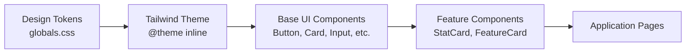

**Diagram sources**
- [globals.css:101-175](file://Frontend/greenflora/app/globals.css#L101-L175)
- [Button.tsx:13-28](file://Frontend/greenflora/components/ui/Button.tsx#L13-L28)
- [Card.tsx:12-23](file://Frontend/greenflora/components/ui/Card.tsx#L12-L23)
- [StatCard.tsx:1-31](file://Frontend/greenflora/components/dashboard/StatCard.tsx#L1-L31)
- [FeatureCard.tsx:1-52](file://Frontend/greenflora/components/dashboard/FeatureCard.tsx#L1-L52)

## Detailed Component Analysis

### Button
- Props and types: Supports standard HTML button attributes plus variant, size, isLoading, disabled, and className.
- Styling: Variant maps to color schemes; size maps to spacing and typography; focus-visible ring ensures accessibility.
- Loading state: Renders an animated spinner and disables interaction when isLoading is true.
- Composition: Can be combined with icons and text; supports full-width via parent containers.

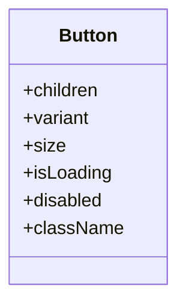

**Diagram sources**
- [Button.tsx:6-11](file://Frontend/greenflora/components/ui/Button.tsx#L6-L11)
- [Button.tsx:13-28](file://Frontend/greenflora/components/ui/Button.tsx#L13-L28)
- [Button.tsx:30-75](file://Frontend/greenflora/components/ui/Button.tsx#L30-L75)

**Section sources**
- [Button.tsx:1-75](file://Frontend/greenflora/components/ui/Button.tsx#L1-L75)

### Card
- Props and types: Accepts children, variant, padding, and className.
- Styling: Variants control background, border, and shadow; padding presets standardize internal spacing.
- Composition: Used as a shell for StatCard and FeatureCard to maintain consistent look and feel.

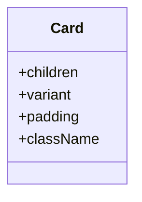

**Diagram sources**
- [Card.tsx:5-10](file://Frontend/greenflora/components/ui/Card.tsx#L5-L10)
- [Card.tsx:12-23](file://Frontend/greenflora/components/ui/Card.tsx#L12-L23)
- [Card.tsx:25-39](file://Frontend/greenflora/components/ui/Card.tsx#L25-L39)

**Section sources**
- [Card.tsx:1-39](file://Frontend/greenflora/components/ui/Card.tsx#L1-L39)
- [StatCard.tsx:1-31](file://Frontend/greenflora/components/dashboard/StatCard.tsx#L1-L31)
- [FeatureCard.tsx:1-52](file://Frontend/greenflora/components/dashboard/FeatureCard.tsx#L1-L52)

### Input
- Props and types: Extends native input attributes; adds label, error, hint, id/name, and className.
- Styling: Focus ring, error border color, and neutral placeholder/text; consistent with Select.
- Accessibility: Label associated via htmlFor/id; error message displayed below input.

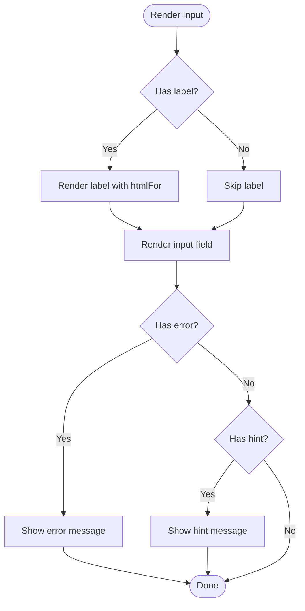

**Diagram sources**
- [Input.tsx:9-47](file://Frontend/greenflora/components/ui/Input.tsx#L9-L47)

**Section sources**
- [Input.tsx:1-47](file://Frontend/greenflora/components/ui/Input.tsx#L1-L47)

### Badge
- Props and types: Accepts children, variant, and className.
- Styling: Maps to semantic color tokens for status indication.
- Accessibility: Semantic span; avoid relying solely on color for meaning.

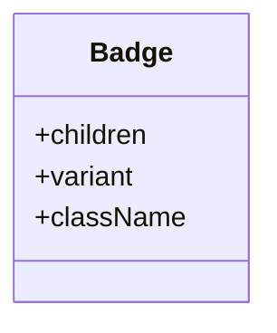

**Diagram sources**
- [Badge.tsx:3-7](file://Frontend/greenflora/components/ui/Badge.tsx#L3-L7)
- [Badge.tsx:9-16](file://Frontend/greenflora/components/ui/Badge.tsx#L9-L16)
- [Badge.tsx:18-31](file://Frontend/greenflora/components/ui/Badge.tsx#L18-L31)

**Section sources**
- [Badge.tsx:1-31](file://Frontend/greenflora/components/ui/Badge.tsx#L1-L31)

### LoadingState
- Props and types: Accepts message and className; exports skeleton components for card-like placeholders.
- Styling: Spinner animation and pulsing skeletons using design tokens.
- Accessibility: Provides clear loading feedback; consumers can wrap with aria-live for dynamic updates.

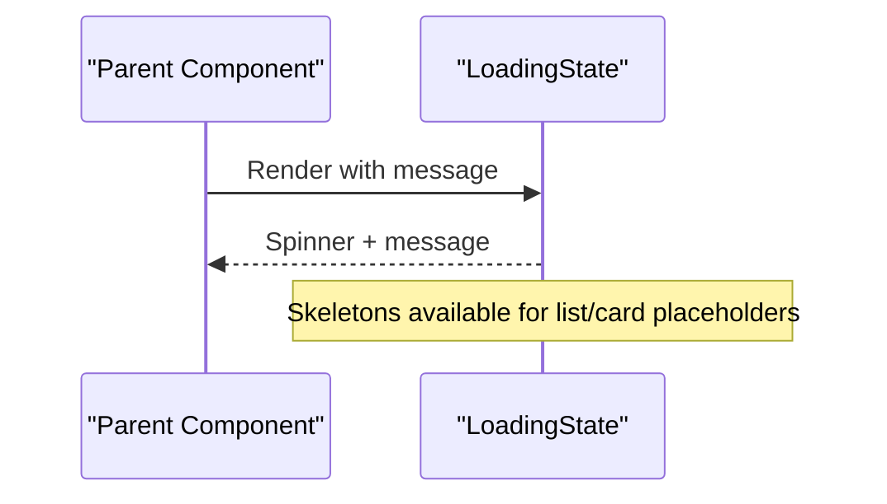

**Diagram sources**
- [LoadingState.tsx:1-56](file://Frontend/greenflora/components/ui/LoadingState.tsx#L1-L56)

**Section sources**
- [LoadingState.tsx:1-56](file://Frontend/greenflora/components/ui/LoadingState.tsx#L1-L56)

### ErrorState
- Props and types: Accepts message, onRetry, retryLabel, and className.
- Styling: Danger-themed container with icon and optional Button.
- Accessibility: role="alert" ensures screen reader announcement.

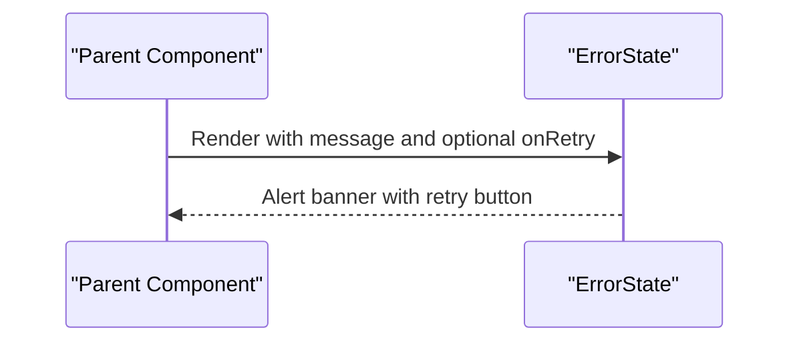

**Diagram sources**
- [ErrorState.tsx:1-39](file://Frontend/greenflora/components/ui/ErrorState.tsx#L1-L39)

**Section sources**
- [ErrorState.tsx:1-39](file://Frontend/greenflora/components/ui/ErrorState.tsx#L1-L39)

### EmptyState
- Props and types: Accepts icon, title, description, action, and className.
- Styling: Dashed border and centered layout with neutral tones.
- Accessibility: Semantic heading and paragraph; ensure action is keyboard accessible.

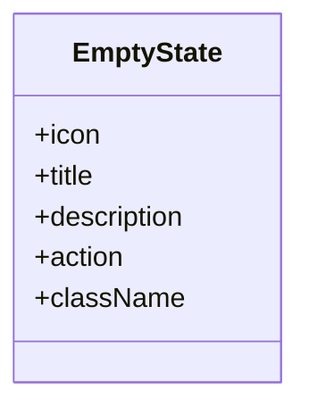

**Diagram sources**
- [EmptyState.tsx:4-10](file://Frontend/greenflora/components/ui/EmptyState.tsx#L4-L10)
- [EmptyState.tsx:12-34](file://Frontend/greenflora/components/ui/EmptyState.tsx#L12-L34)

**Section sources**
- [EmptyState.tsx:1-34](file://Frontend/greenflora/components/ui/EmptyState.tsx#L1-L34)

### ProgressBar
- Props and types: Accepts value, max, label, showPercentage, and className.
- Styling: Dynamic color based on percentage thresholds; smooth width transition.
- Accessibility: Provide context via label or surrounding text.

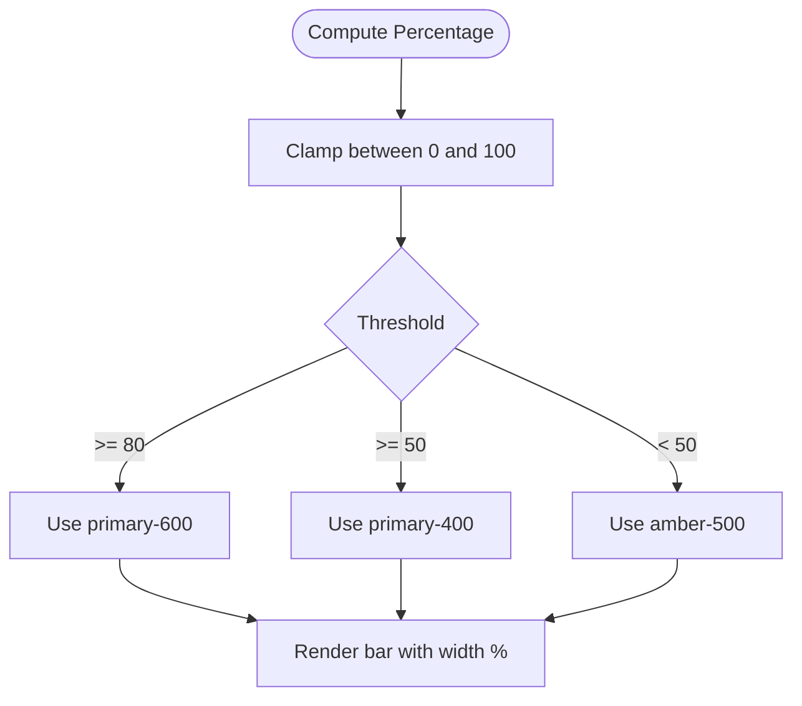

**Diagram sources**
- [ProgressBar.tsx:9-50](file://Frontend/greenflora/components/ui/ProgressBar.tsx#L9-L50)

**Section sources**
- [ProgressBar.tsx:1-50](file://Frontend/greenflora/components/ui/ProgressBar.tsx#L1-L50)

### Select
- Props and types: Extends native select attributes; adds label, error, hint, options, placeholder, id/name, and className.
- Styling: Consistent with Input; focus ring and error state.
- Accessibility: Label association via htmlFor/id; error messaging.

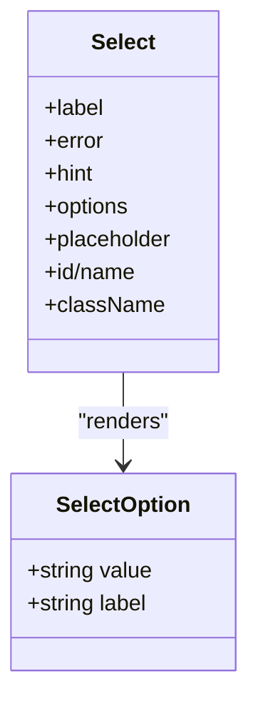

**Diagram sources**
- [Select.tsx:3-6](file://Frontend/greenflora/components/ui/Select.tsx#L3-L6)
- [Select.tsx:8-14](file://Frontend/greenflora/components/ui/Select.tsx#L8-L14)
- [Select.tsx:16-66](file://Frontend/greenflora/components/ui/Select.tsx#L16-L66)

**Section sources**
- [Select.tsx:1-66](file://Frontend/greenflora/components/ui/Select.tsx#L1-L66)

## Dependency Analysis
- Components depend on Tailwind utilities that map to design tokens defined in globals.css.
- ErrorState composes Button; other components remain independent.
- Feature-level components (StatCard, FeatureCard) compose Card to maintain consistency.

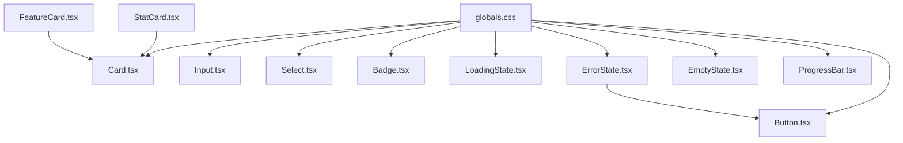

**Diagram sources**
- [globals.css:101-175](file://Frontend/greenflora/app/globals.css#L101-L175)
- [ErrorState.tsx:1-39](file://Frontend/greenflora/components/ui/ErrorState.tsx#L1-L39)
- [StatCard.tsx:1-31](file://Frontend/greenflora/components/dashboard/StatCard.tsx#L1-L31)
- [FeatureCard.tsx:1-52](file://Frontend/greenflora/components/dashboard/FeatureCard.tsx#L1-L52)

**Section sources**
- [ErrorState.tsx:1-39](file://Frontend/greenflora/components/ui/ErrorState.tsx#L1-L39)
- [StatCard.tsx:1-31](file://Frontend/greenflora/components/dashboard/StatCard.tsx#L1-L31)
- [FeatureCard.tsx:1-52](file://Frontend/greenflora/components/dashboard/FeatureCard.tsx#L1-L52)

## Performance Considerations
- Memoization: Wrap expensive child trees with React.memo where appropriate to prevent unnecessary re-renders. For example, memoize complex lists rendered inside Card or FeatureCard.
- Stable keys: Ensure stable key props for lists (e.g., option items in Select) to optimize reconciliation.
- Avoid prop churn: Keep frequently changing props minimal; lift state up when necessary to reduce re-renders.
- Efficient animations: Prefer CSS-based animations and transitions already provided; avoid heavy JS-driven animations.
- Conditional rendering: Use early returns for empty/error/loading states to skip rendering heavy content until ready.
- Debounce inputs: For search or filter inputs, debounce handlers to limit re-renders during typing.
- Tree-shaking: Only import icons used; keep dependencies lean.

[No sources needed since this section provides general guidance]

## Troubleshooting Guide
- Missing design tokens: If colors or shadows appear incorrect, verify globals.css is imported and Tailwind theme mapping is active.
- Focus visibility: Ensure focus-visible styles are not overridden; test keyboard navigation across browsers.
- Form accessibility: Confirm label htmlFor matches input id/name; ensure error messages are programmatically associated when possible.
- Loading and error states: Verify ErrorState displays role="alert"; ensure LoadingState is shown only during actual async operations.
- Animation preferences: Respect prefers-reduced-motion; animations are disabled automatically for reduced motion users.

**Section sources**
- [globals.css:482-500](file://Frontend/greenflora/app/globals.css#L482-L500)
- [ErrorState.tsx:11-39](file://Frontend/greenflora/components/ui/ErrorState.tsx#L11-L39)
- [Input.tsx:9-47](file://Frontend/greenflora/components/ui/Input.tsx#L9-L47)

## Conclusion
Green-Flora’s UI component library provides a cohesive, accessible, and theme-driven foundation built with React and Tailwind CSS. The base components follow consistent composition patterns, leverage design tokens for theming, and include robust accessibility features. By combining these primitives, teams can rapidly assemble feature-rich interfaces while maintaining visual and behavioral consistency across the application.

[No sources needed since this section summarizes without analyzing specific files]