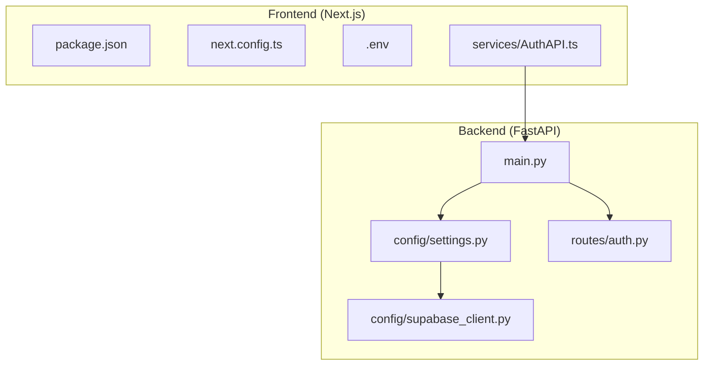
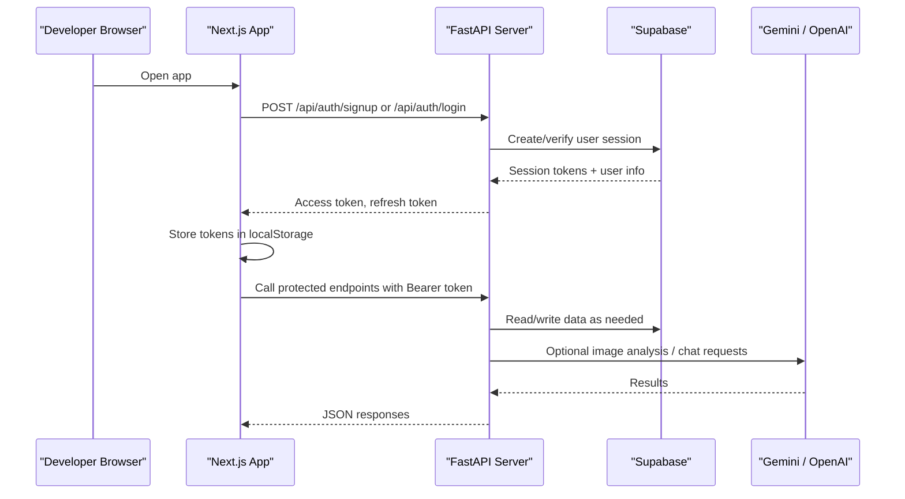
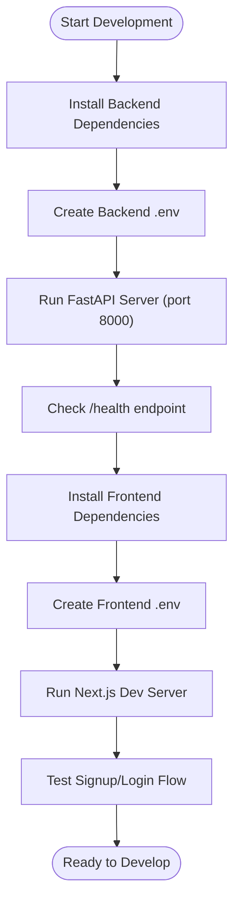
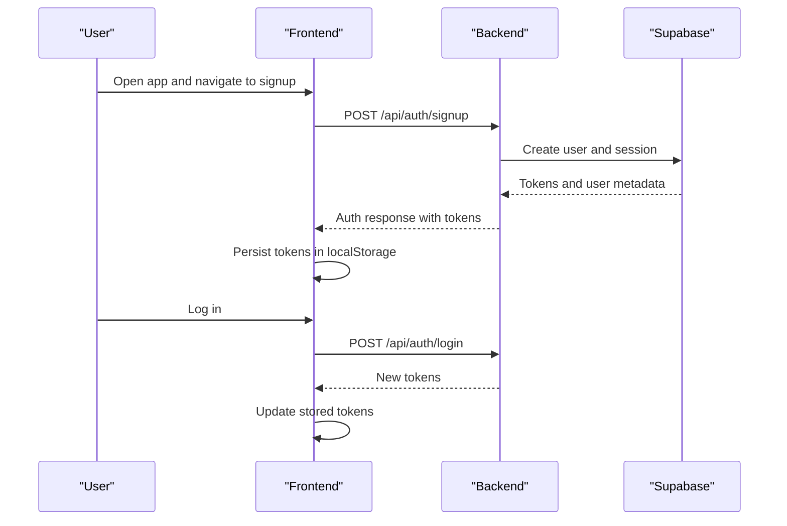
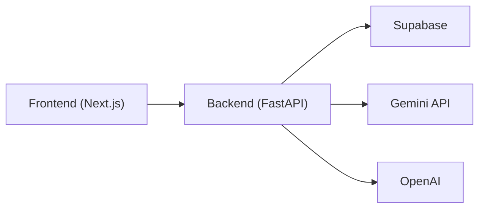

# Getting Started

<cite>
**Referenced Files in This Document**
- [README.md](file://README.md)
- [requirements.txt](file://requirements.txt)
- [Backend/main.py](file://Backend/main.py)
- [Backend/config/settings.py](file://Backend/config/settings.py)
- [Backend/config/supabase_client.py](file://Backend/config/supabase_client.py)
- [Backend/routes/auth.py](file://Backend/routes/auth.py)
- [Frontend/greenflora/package.json](file://Frontend/greenflora/package.json)
- [Frontend/greenflora/next.config.ts](file://Frontend/greenflora/next.config.ts)
- [Frontend/greenflora/.env](file://Frontend/greenflora/.env)
- [Frontend/greenflora/services/AuthAPI.ts](file://Frontend/greenflora/services/AuthAPI.ts)
</cite>

## Table of Contents
1. Introduction
2. Project Structure
3. Core Components
4. Architecture Overview
5. Detailed Component Analysis
6. Dependency Analysis
7. Performance Considerations
8. Troubleshooting Guide
9. Conclusion

## Introduction
Green Flora is a voice-first, AI-powered agricultural dashboard for farmers. It combines Next.js (frontend), FastAPI (backend), Supabase (database and auth), Gemini API (image analysis), and OpenAI GPT models (voice assistant). This guide helps you set up the environment, install dependencies, configure secrets, and run both frontend and backend locally so you can explore features like crop disease diagnosis, market insights, weather data, and an AI assistant.

## Project Structure
At a high level:
- Frontend: Next.js app under Frontend/greenflora with React components, hooks, services, and types.
- Backend: FastAPI application under Backend with routes, services, schemas, and configuration.
- Shared configuration: Environment variables drive behavior; the backend reads from a .env file in Backend/, while the frontend uses NEXT_PUBLIC_* variables.

**Diagram sources**
- [Frontend/greenflora/package.json:1-32](file://Frontend/greenflora/package.json#L1-L32)
- [Frontend/greenflora/next.config.ts:1-8](file://Frontend/greenflora/next.config.ts#L1-L8)
- [Frontend/greenflora/.env:1-8](file://Frontend/greenflora/.env#L1-L8)
- [Frontend/greenflora/services/AuthAPI.ts:1-47](file://Frontend/greenflora/services/AuthAPI.ts#L1-L47)
- [Backend/main.py:1-57](file://Backend/main.py#L1-L57)
- [Backend/config/settings.py:1-123](file://Backend/config/settings.py#L1-L123)
- [Backend/config/supabase_client.py:1-47](file://Backend/config/supabase_client.py#L1-L47)
- [Backend/routes/auth.py:1-132](file://Backend/routes/auth.py#L1-L132)

**Section sources**
- [README.md:17-24](file://README.md#L17-L24)
- [Backend/main.py:15-57](file://Backend/main.py#L15-L57)
- [Frontend/greenflora/package.json:1-32](file://Frontend/greenflora/package.json#L1-L32)

## Core Components
- Backend API server (FastAPI): Exposes REST endpoints, CORS middleware, and health check. Routers include authentication, farmer, field, crop doctor, market, support, and assistant.
- Configuration: Centralized settings loaded from environment variables, including database URL, Supabase credentials, external API keys, and AI model selections.
- Supabase client: Initialized only when required credentials are present; otherwise, features degrade gracefully.
- Frontend: Next.js app that calls backend APIs and persists tokens via localStorage.

Key environment variables to know:
- Backend: DEMO_MODE, DATABASE_URL, SUPABASE_URL, SUPABASE_SERVICE_KEY, SUPABASE_ANON_KEY, OPENWEATHER_API_KEY, ALIBABA_MODEL_STUDIO_KEY, ALIBABA_OSS_KEY, ALIBABA_OSS_SECRET, GEMINI_API_KEY, OPENAI_API_KEY, AI_MAIN_MODEL, AI_UTILITY_MODEL, AI_TRANSCRIBE_MODEL, AI_TTS_MODEL, AI_FALLBACK_MODEL, AI_STREAM_TIMEOUT_SECONDS, AI_AUDIO_TIMEOUT_SECONDS, CORS_ORIGINS, ENVIRONMENT.
- Frontend: NEXT_PUBLIC_API_BASE_URL, SUPABASE_URL, SUPABASE_SERVICE_KEY, SUPABASE_ANON_KEY.

**Section sources**
- [Backend/config/settings.py:48-123](file://Backend/config/settings.py#L48-L123)
- [Backend/config/supabase_client.py:16-47](file://Backend/config/supabase_client.py#L16-L47)
- [Frontend/greenflora/.env:1-8](file://Frontend/greenflora/.env#L1-L8)
- [Frontend/greenflora/services/AuthAPI.ts:16-18](file://Frontend/greenflora/services/AuthAPI.ts#L16-L18)

## Architecture Overview
The frontend communicates with the backend over HTTP. The backend integrates with Supabase for authentication and data, and optionally with Gemini and OpenAI for image analysis and conversational AI.

**Diagram sources**
- [Backend/routes/auth.py:68-132](file://Backend/routes/auth.py#L68-L132)
- [Backend/config/supabase_client.py:19-47](file://Backend/config/supabase_client.py#L19-L47)
- [Frontend/greenflora/services/AuthAPI.ts:25-47](file://Frontend/greenflora/services/AuthAPI.ts#L25-L47)

## Detailed Component Analysis

### Prerequisites
- Node.js 18+
- Python 3.10+
- API keys for:
  - Gemini API
  - OpenAI (GPT-4.6-turbo or configured model)
  - Supabase (project URL and keys)

**Section sources**
- [README.md:55-58](file://README.md#L55-L58)

### Installation and Setup

1) Clone the repository
- Use your preferred Git client to clone the project into a local directory.

2) Set up the Backend (FastAPI)
- Install Python dependencies:
  - Use the requirements file to install packages such as FastAPI, Uvicorn, Pydantic, python-dotenv, Supabase client, Google Generative AI, Multipart, OpenAI, and Google GenAI.
- Create a .env file inside Backend/ with required keys:
  - At minimum, provide SUPABASE_URL, SUPABASE_SERVICE_KEY, SUPABASE_ANON_KEY.
  - For AI features, add GEMINI_API_KEY and OPENAI_API_KEY.
  - Optionally set DEMO_MODE=true to run without a live database or external APIs.
  - Configure CORS_ORIGINS if your frontend runs on a different origin.
- Start the development server:
  - Run the FastAPI app using Uvicorn with hot reload enabled. It binds to 0.0.0.0 on port 8000 by default.

3) Set up the Frontend (Next.js)
- Navigate to the Frontend/greenflora directory.
- Install Node dependencies using your package manager.
- Create or update .env in Frontend/greenflora:
  - NEXT_PUBLIC_API_BASE_URL should point to your running backend (default http://localhost:8000).
  - Add SUPABASE_URL, SUPABASE_SERVICE_KEY, SUPABASE_ANON_KEY if the frontend needs direct access.
- Start the development server:
  - Run the dev script to launch the Next.js app.

4) Verify connectivity
- Check the backend health endpoint to confirm it is running.
- In the browser, open the frontend and attempt to sign up or log in to validate the full flow.

**Section sources**
- [requirements.txt:1-10](file://requirements.txt#L1-L10)
- [Backend/config/settings.py:24-29](file://Backend/config/settings.py#L24-L29)
- [Backend/main.py:50-57](file://Backend/main.py#L50-L57)
- [Frontend/greenflora/package.json:5-9](file://Frontend/greenflora/package.json#L5-L9)
- [Frontend/greenflora/.env:4-7](file://Frontend/greenflora/.env#L4-L7)
- [Frontend/greenflora/services/AuthAPI.ts:16-18](file://Frontend/greenflora/services/AuthAPI.ts#L16-L18)

### Configuration of Environment Variables

- Backend (.env in Backend/)
  - DEMO_MODE: Enable demo mode to avoid requiring a live database or external APIs.
  - DATABASE_URL: Database connection string (optional in demo mode).
  - SUPABASE_URL, SUPABASE_SERVICE_KEY, SUPABASE_ANON_KEY: Required for authentication and data operations.
  - OPENWEATHER_API_KEY, ALIBABA_* keys: Optional integrations.
  - GEMINI_API_KEY, OPENAI_API_KEY: Required for image analysis and AI assistant features.
  - AI_* models and timeouts: Control which models and streaming timeouts are used.
  - CORS_ORIGINS: Origins allowed to call the backend during development.
  - ENVIRONMENT: Application environment label.

- Frontend (.env in Frontend/greenflora)
  - NEXT_PUBLIC_API_BASE_URL: Base URL for backend API calls.
  - SUPABASE_URL, SUPABASE_SERVICE_KEY, SUPABASE_ANON_KEY: If the frontend directly interacts with Supabase.

Notes:
- The backend loads environment variables from Backend/.env at startup.
- The frontend reads NEXT_PUBLIC_* variables at build time.

**Section sources**
- [Backend/config/settings.py:55-123](file://Backend/config/settings.py#L55-L123)
- [Backend/config/supabase_client.py:19-47](file://Backend/config/supabase_client.py#L19-L47)
- [Frontend/greenflora/.env:1-8](file://Frontend/greenflora/.env#L1-L8)
- [Frontend/greenflora/services/AuthAPI.ts:16-18](file://Frontend/greenflora/services/AuthAPI.ts#L16-L18)

### Development Server Startup

- Backend (FastAPI)
  - Run the main module to start Uvicorn with reload enabled on port 8000.
  - Health check endpoint returns a simple status.

- Frontend (Next.js)
  - Use the dev script to start the development server.
  - Ensure NEXT_PUBLIC_API_BASE_URL points to the backend.

**Diagram sources**
- [Backend/main.py:50-57](file://Backend/main.py#L50-L57)
- [Frontend/greenflora/package.json:5-9](file://Frontend/greenflora/package.json#L5-L9)

**Section sources**
- [Backend/main.py:15-57](file://Backend/main.py#L15-L57)
- [Frontend/greenflora/package.json:5-9](file://Frontend/greenflora/package.json#L5-L9)

### Initial Setup Steps

- Database Connection
  - Provide DATABASE_URL if not using demo mode.
  - Alternatively, enable DEMO_MODE to use seeded data without a live database.

- API Key Configuration
  - Add GEMINI_API_KEY and OPENAI_API_KEY to Backend/.env to unlock image analysis and AI assistant features.
  - Ensure SUPABASE_URL and keys are set for authentication and data persistence.

- First-Time User Onboarding
  - Start the backend and frontend servers.
  - Open the frontend and create a new account using the signup endpoint.
  - Log in to receive tokens stored in the browser’s localStorage.
  - Explore protected endpoints and features once authenticated.

**Diagram sources**
- [Backend/routes/auth.py:68-132](file://Backend/routes/auth.py#L68-L132)
- [Frontend/greenflora/services/AuthAPI.ts:25-47](file://Frontend/greenflora/services/AuthAPI.ts#L25-L47)

**Section sources**
- [Backend/config/settings.py:55-89](file://Backend/config/settings.py#L55-L89)
- [Backend/routes/auth.py:68-132](file://Backend/routes/auth.py#L68-L132)
- [Frontend/greenflora/services/AuthAPI.ts:25-47](file://Frontend/greenflora/services/AuthAPI.ts#L25-L47)

## Dependency Analysis
- Backend depends on:
  - FastAPI and Uvicorn for serving the API.
  - python-dotenv for loading environment variables.
  - Supabase client for authentication and data.
  - Google Generative AI and OpenAI SDKs for AI features.
- Frontend depends on:
  - Next.js and React for UI.
  - Calls to backend APIs and optional Supabase integration.

**Diagram sources**
- [requirements.txt:1-10](file://requirements.txt#L1-L10)
- [Backend/config/settings.py:70-114](file://Backend/config/settings.py#L70-L114)
- [Frontend/greenflora/package.json:11-20](file://Frontend/greenflora/package.json#L11-L20)

**Section sources**
- [requirements.txt:1-10](file://requirements.txt#L1-L10)
- [Backend/config/settings.py:70-114](file://Backend/config/settings.py#L70-L114)
- [Frontend/greenflora/package.json:11-20](file://Frontend/greenflora/package.json#L11-L20)

## Performance Considerations
- Backend timing header: Every response includes X-Process-Time to help measure request latency during development.
- Streaming timeouts: Adjust AI_STREAM_TIMEOUT_SECONDS and AI_AUDIO_TIMEOUT_SECONDS for long-running AI operations.
- CORS origins: Keep CORS_ORIGINS minimal in production to reduce exposure.
- Demo mode: Use DEMO_MODE to avoid network calls and speed up local iteration.

**Section sources**
- [Backend/main.py:31-38](file://Backend/main.py#L31-L38)
- [Backend/config/settings.py:107-114](file://Backend/config/settings.py#L107-L114)

## Troubleshooting Guide
Common issues and resolutions:
- Backend cannot connect to Supabase
  - Ensure SUPABASE_URL, SUPABASE_SERVICE_KEY, and SUPABASE_ANON_KEY are set in Backend/.env.
  - If missing, the Supabase client will not initialize; features may degrade gracefully.

- Authentication returns service unavailable
  - When Supabase is not configured, auth endpoints return a service unavailable error.
  - Provide valid Supabase credentials or enable DEMO_MODE.

- CORS errors from the frontend
  - Confirm CORS_ORIGINS includes the frontend origin (e.g., http://localhost:3000).
  - Ensure NEXT_PUBLIC_API_BASE_URL matches the backend address.

- AI features not working
  - Add GEMINI_API_KEY and OPENAI_API_KEY to Backend/.env.
  - Verify model names and timeouts in environment variables.

- Frontend cannot reach backend
  - Check NEXT_PUBLIC_API_BASE_URL in Frontend/greenflora/.env.
  - Confirm the backend is running on the expected host and port.

- Health check fails
  - Verify the backend process started successfully and is listening on port 8000.

**Section sources**
- [Backend/config/supabase_client.py:19-47](file://Backend/config/supabase_client.py#L19-L47)
- [Backend/routes/auth.py:45-61](file://Backend/routes/auth.py#L45-L61)
- [Backend/config/settings.py:64-73](file://Backend/config/settings.py#L64-L73)
- [Frontend/greenflora/services/AuthAPI.ts:16-18](file://Frontend/greenflora/services/AuthAPI.ts#L16-L18)
- [Backend/main.py:50-57](file://Backend/main.py#L50-L57)

## Conclusion
You now have the essentials to set up Green Flora locally: install dependencies, configure environment variables for Supabase and AI providers, and run both the Next.js frontend and FastAPI backend. With these steps, you can explore core features like authentication, market insights, weather data, and AI-powered assistance. Refer back to this guide whenever you need to reconfigure or troubleshoot your setup.