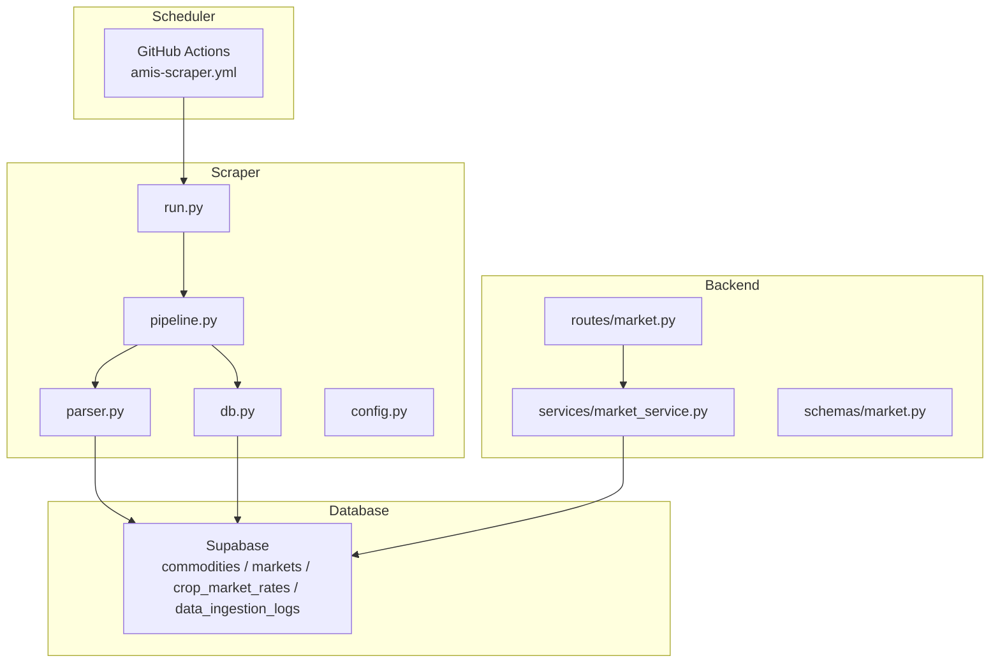
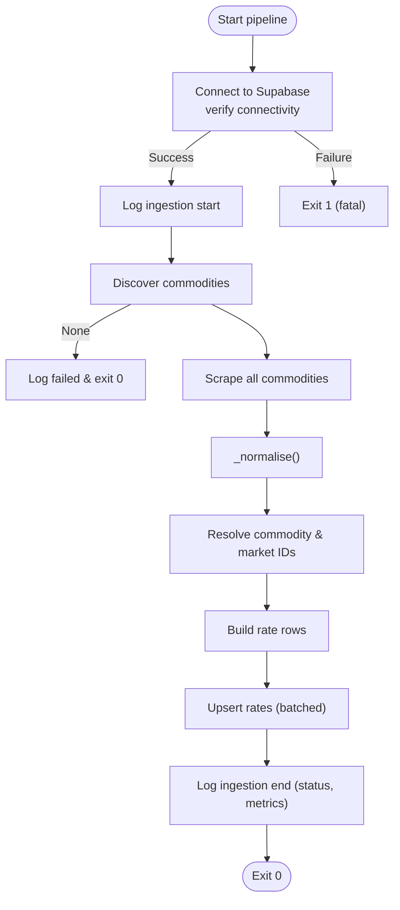
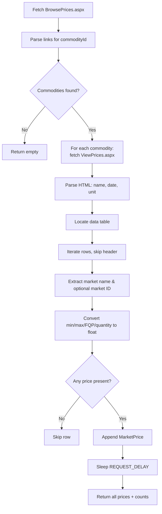
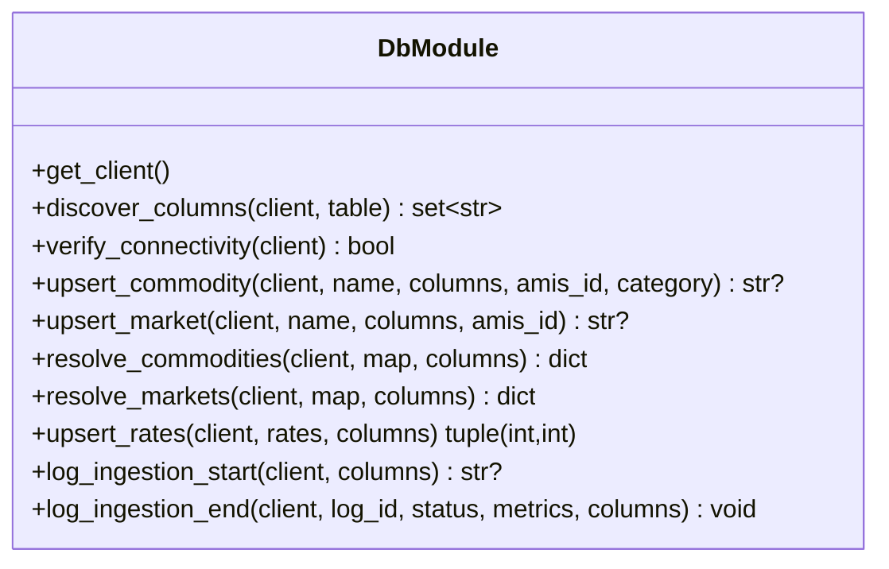
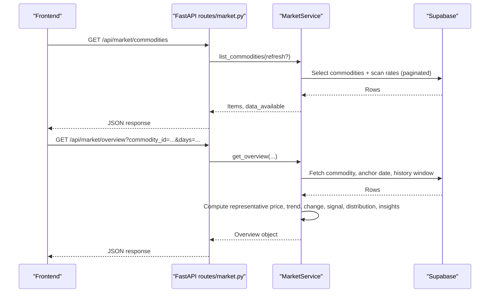
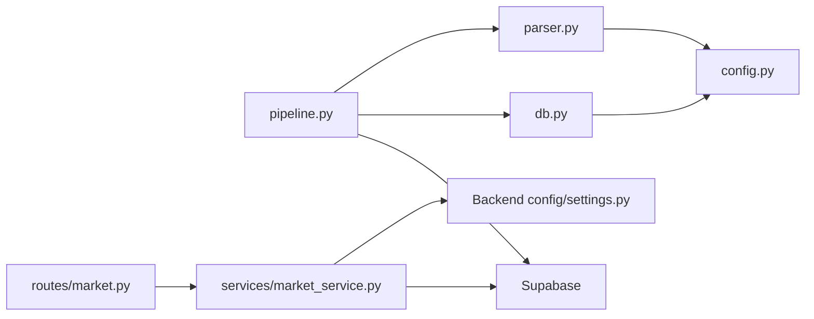

# Market Data Pipeline

<cite>
**Referenced Files in This Document**
- [pipeline.py](file://Scraper/pipeline.py)
- [parser.py](file://Scraper/parser.py)
- [db.py](file://Scraper/db.py)
- [config.py](file://Scraper/config.py)
- [run.py](file://Scraper/run.py)
- [market.py](file://Backend/routes/market.py)
- [market_service.py](file://Backend/services/market_service.py)
- [market.py (schemas)](file://Backend/schemas/market.py)
- [amis-scraper.yml](file://.github/workflows/amis-scraper.yml)
- [settings.py](file://Backend/config/settings.py)
</cite>

## Table of Contents
1. [Introduction](#introduction)
2. [Project Structure](#project-structure)
3. [Core Components](#core-components)
4. [Architecture Overview](#architecture-overview)
5. [Detailed Component Analysis](#detailed-component-analysis)
6. [Dependency Analysis](#dependency-analysis)
7. [Performance Considerations](#performance-considerations)
8. [Troubleshooting Guide](#troubleshooting-guide)
9. [Conclusion](#conclusion)
10. [Appendices](#appendices)

## Introduction
This document describes Green-Flora’s market data pipeline that automates scraping commodity prices from AMIS (Agriculture Marketing Information Service, Pakistan), transforms the data into a consistent schema, and stores it in Supabase. The backend exposes REST endpoints to serve market intelligence to the frontend, including current prices, trends, comparisons, and farmer insights. It also documents configuration options, retry mechanisms, monitoring via ingestion logs, scheduling via GitHub Actions, and caching strategies for performance.

## Project Structure
The system is split into three main parts:
- Scraper: Python module that discovers commodities, scrapes HTML pages, parses price tables, normalizes data, and upserts into Supabase with idempotent behavior and ingestion logging.
- Backend: FastAPI routes and service layer that read from Supabase, compute summaries/trends/insights, and expose public API endpoints for the frontend.
- CI/CD: GitHub Actions workflow that runs the scraper daily at a fixed time.



**Diagram sources**
- [amis-scraper.yml:1-46](file://.github/workflows/amis-scraper.yml#L1-L46)
- [run.py:1-78](file://Scraper/run.py#L1-L78)
- [pipeline.py:1-377](file://Scraper/pipeline.py#L1-L377)
- [parser.py:1-525](file://Scraper/parser.py#L1-L525)
- [db.py:1-497](file://Scraper/db.py#L1-L497)
- [market.py:1-108](file://Backend/routes/market.py#L1-L108)
- [market_service.py:1-653](file://Backend/services/market_service.py#L1-L653)

**Section sources**
- [amis-scraper.yml:1-46](file://.github/workflows/amis-scraper.yml#L1-L46)
- [run.py:1-78](file://Scraper/run.py#L1-L78)
- [pipeline.py:1-377](file://Scraper/pipeline.py#L1-L377)
- [parser.py:1-525](file://Scraper/parser.py#L1-L525)
- [db.py:1-497](file://Scraper/db.py#L1-L497)
- [market.py:1-108](file://Backend/routes/market.py#L1-L108)
- [market_service.py:1-653](file://Backend/services/market_service.py#L1-L653)

## Core Components
- Scraper orchestration: Coordinates discovery, scraping, normalization, resolution of foreign keys, and upserting rates; writes ingestion logs for success/partial/failure states.
- Web parser: Fetches AMIS browse and price pages, extracts commodity names, dates, units, and per-market price rows using robust selectors and fallbacks.
- Database integration: Handles schema discovery, idempotent upserts with unique constraints, and safe row-by-row fallback when constraints are missing.
- Backend API: Exposes public endpoints for commodity list and market overview; computes representative prices, trends, signals, distributions, and farmer insights.
- Scheduling: Runs the scraper daily via GitHub Actions with environment-based secrets.

Key responsibilities and boundaries are isolated by module to ensure resilience and testability.

**Section sources**
- [pipeline.py:1-377](file://Scraper/pipeline.py#L1-L377)
- [parser.py:1-525](file://Scraper/parser.py#L1-L525)
- [db.py:1-497](file://Scraper/db.py#L1-L497)
- [market.py:1-108](file://Backend/routes/market.py#L1-L108)
- [market_service.py:1-653](file://Backend/services/market_service.py#L1-L653)

## Architecture Overview
The pipeline follows an extract-transform-load pattern:
- Extract: Discover commodities from AMIS browse page; fetch each commodity’s price page.
- Transform: Parse HTML into structured price records; normalize values; resolve commodity and market IDs.
- Load: Upsert rate rows into Supabase with idempotency; log ingestion results.

The backend reads from Supabase to serve the frontend with computed analytics and cached lookups.

```mermaid
sequenceDiagram
participant GH as "GitHub Actions"
participant CLI as "run.py"
participant PIPE as "pipeline.run_pipeline"
participant PAR as "parser"
participant DB as "db"
participant SUP as "Supabase"
GH->>CLI : Trigger daily job
CLI->>PIPE : run_pipeline(dry_run=False)
PIPE->>DB : get_client() + verify_connectivity()
PIPE->>PAR : discover_commodities(session)
PAR-->>PIPE : list of commodities
PIPE->>PAR : scrape_all(commodities)
PAR-->>PIPE : all_prices, success_count, fail_count
PIPE->>PIPE : _normalise(all_prices)
PIPE->>DB : resolve_commodities(), resolve_markets()
PIPE->>DB : upsert_rates(rates)
DB->>SUP : UPSERT crop_market_rates
PIPE->>DB : log_ingestion_end(status, metrics)
SUP-->>PIPE : Acknowledgement
PIPE-->>CLI : Exit code 0 or 1
```

**Diagram sources**
- [amis-scraper.yml:1-46](file://.github/workflows/amis-scraper.yml#L1-L46)
- [run.py:1-78](file://Scraper/run.py#L1-L78)
- [pipeline.py:36-257](file://Scraper/pipeline.py#L36-L257)
- [parser.py:120-157](file://Scraper/parser.py#L120-L157)
- [parser.py:476-525](file://Scraper/parser.py#L476-L525)
- [db.py:320-378](file://Scraper/db.py#L320-L378)
- [db.py:424-497](file://Scraper/db.py#L424-L497)

## Detailed Component Analysis

### Scraper Orchestration (pipeline.py)
- Entry point orchestrates the full ingestion: connects to Supabase, discovers schemas, starts ingestion log, discovers commodities, scrapes all pages, normalizes data, resolves foreign keys, builds rate rows, upserts, and finalizes ingestion log with status and metrics.
- Error handling:
  - Fatal on Supabase connectivity failure.
  - Partial success if some commodities fail; still writes ingestion log with partial status.
  - No deletion of existing data; only insert/update.
- Normalization:
  - Strips whitespace from names.
  - Ensures non-negative numeric fields; invalid negatives become None.
- Rate building:
  - Maps commodity and market names to resolved IDs; sets source explicitly.
  - Skips rows where IDs cannot be resolved.



**Diagram sources**
- [pipeline.py:36-257](file://Scraper/pipeline.py#L36-L257)
- [pipeline.py:265-333](file://Scraper/pipeline.py#L265-L333)

**Section sources**
- [pipeline.py:1-377](file://Scraper/pipeline.py#L1-L377)

### Web Parser (parser.py)
- HTTP helpers:
  - Session with browser-like User-Agent.
  - Retry with exponential backoff and timeout; handles encoding issues.
- Commodity discovery:
  - Parses browse page links to extract commodity IDs and names; deduplicates and sorts.
- Price parsing:
  - Robust extraction of commodity name via multiple strategies.
  - Date extraction from header text; unit detection from specific span.
  - Table location via known ID patterns or header cell keywords.
  - Row parsing skips headers, validates columns, extracts market name and optional AMIS market ID from links.
  - Converts cell values to floats; treats missing values gracefully.
- Batch scraping:
  - Iterates over discovered commodities, optionally filtered by IDs; sleeps between requests to be polite.



**Diagram sources**
- [parser.py:72-112](file://Scraper/parser.py#L72-L112)
- [parser.py:120-157](file://Scraper/parser.py#L120-L157)
- [parser.py:165-225](file://Scraper/parser.py#L165-L225)
- [parser.py:233-331](file://Scraper/parser.py#L233-L331)
- [parser.py:334-403](file://Scraper/parser.py#L334-L403)
- [parser.py:406-468](file://Scraper/parser.py#L406-L468)
- [parser.py:476-525](file://Scraper/parser.py#L476-L525)

**Section sources**
- [parser.py:1-525](file://Scraper/parser.py#L1-L525)

### Database Integration (db.py)
- Client creation and connectivity checks using service-role credentials.
- Schema discovery:
  - Reads one row to infer column names; falls back to standard assumptions for empty tables.
- Idempotent upserts:
  - Bulk upsert with ON CONFLICT on unique constraint (commodity_id, market_id, price_date).
  - If constraint missing, falls back to row-by-row SELECT then UPDATE/INSERT.
- Resolution helpers:
  - Ensure commodities/markets exist by AMIS ID or name; return stable IDs for foreign key mapping.
- Ingestion logging:
  - Start/end entries with timestamps, status, metrics, and error messages.



**Diagram sources**
- [db.py:43-90](file://Scraper/db.py#L43-L90)
- [db.py:98-178](file://Scraper/db.py#L98-L178)
- [db.py:186-259](file://Scraper/db.py#L186-L259)
- [db.py:267-312](file://Scraper/db.py#L267-L312)
- [db.py:320-416](file://Scraper/db.py#L320-L416)
- [db.py:424-497](file://Scraper/db.py#L424-L497)

**Section sources**
- [db.py:1-497](file://Scraper/db.py#L1-L497)

### Configuration (config.py)
- Environment-driven settings:
  - Supabase URL and service key.
  - AMIS URLs and search type.
  - HTTP behavior: timeouts, delays, retries, backoff, user agent.
  - Upsert batch size.
  - Table names and ingestion source identifier.

**Section sources**
- [config.py:1-70](file://Scraper/config.py#L1-L70)

### CLI and Scheduling (run.py, amis-scraper.yml)
- CLI entry-point supports dry-run mode and filtering by commodity IDs; configures logging levels.
- GitHub Actions workflow:
  - Scheduled daily at a fixed UTC time.
  - Installs dependencies and runs the scraper module.
  - Uses secrets for Supabase access.

**Section sources**
- [run.py:1-78](file://Scraper/run.py#L1-L78)
- [amis-scraper.yml:1-46](file://.github/workflows/amis-scraper.yml#L1-L46)

### Backend API (routes/market.py, services/market_service.py, schemas/market.py)
- Public endpoints:
  - GET /api/market/commodities: Returns crops available for selection with latest date and representative price; supports refresh flag.
  - GET /api/market/overview: Returns comprehensive market intelligence for a commodity including current price, change, signal, highest/lowest markets, spread, trend series, distribution, and insights; supports days window and optional market scope.
- Service logic:
  - Reads from Supabase tables commodities, markets, crop_market_rates.
  - Computes representative price using FQP when available, otherwise midpoint of min/max; weighted average when quantity data is sufficient.
  - Builds trend series per day; computes percent change vs ~7-day reference; derives signal thresholds.
  - Calculates arrivals distribution across markets; generates farmer-friendly insights based on real data.
  - Caches commodities list and markets lookup with TTL to reduce database load.
- Response schemas:
  - Pydantic models define response structures for commodities list and market overview, ensuring consistent contracts for the frontend.



**Diagram sources**
- [market.py:38-108](file://Backend/routes/market.py#L38-L108)
- [market_service.py:59-152](file://Backend/services/market_service.py#L59-L152)
- [market_service.py:158-343](file://Backend/services/market_service.py#L158-L343)
- [market_service.py:349-468](file://Backend/services/market_service.py#L349-L468)
- [market_service.py:474-593](file://Backend/services/market_service.py#L474-L593)
- [market_service.py:599-648](file://Backend/services/market_service.py#L599-L648)

**Section sources**
- [market.py:1-108](file://Backend/routes/market.py#L1-L108)
- [market_service.py:1-653](file://Backend/services/market_service.py#L1-L653)
- [market.py (schemas):1-132](file://Backend/schemas/market.py#L1-L132)

## Dependency Analysis
- Scraper depends on:
  - External website AMIS for raw HTML.
  - Supabase for persistent storage and ingestion logging.
  - Config for URLs, HTTP behavior, and table names.
- Backend depends on:
  - Supabase for reading market data.
  - Settings for environment configuration.
  - Schemas for response validation.



**Diagram sources**
- [parser.py:18-28](file://Scraper/parser.py#L18-L28)
- [pipeline.py:23-26](file://Scraper/pipeline.py#L23-L26)
- [db.py:28-34](file://Scraper/db.py#L28-L34)
- [market.py:18-27](file://Backend/routes/market.py#L18-L27)
- [market_service.py:25-31](file://Backend/services/market_service.py#L25-L31)
- [settings.py:48-122](file://Backend/config/settings.py#L48-L122)

**Section sources**
- [parser.py:1-525](file://Scraper/parser.py#L1-L525)
- [pipeline.py:1-377](file://Scraper/pipeline.py#L1-L377)
- [db.py:1-497](file://Scraper/db.py#L1-L497)
- [market.py:1-108](file://Backend/routes/market.py#L1-L108)
- [market_service.py:1-653](file://Backend/services/market_service.py#L1-L653)
- [settings.py:1-123](file://Backend/config/settings.py#L1-L123)

## Performance Considerations
- Scraping:
  - Polite delay between requests reduces server load and avoids throttling.
  - Retry with exponential backoff improves resilience against transient failures.
  - Filtering by commodity IDs enables targeted runs during debugging or recovery.
- Database:
  - Batched upserts minimize round-trips; fallback ensures continuity even without unique constraints.
  - Schema discovery prevents crashes due to evolving table structures.
- Backend:
  - In-memory caches for commodities list and markets lookup with short TTL reduce repeated queries.
  - Paginated scans cap memory usage and prevent large payloads.
  - Representative price computation uses efficient aggregation strategies.

[No sources needed since this section provides general guidance]

## Troubleshooting Guide
Common issues and resolutions:
- Supabase connectivity failure:
  - Verify environment variables for Supabase URL and service key; pipeline exits with fatal status if unreachable.
- Missing unique constraint on crop_market_rates:
  - Pipeline detects missing constraint and falls back to row-by-row upsert; add the unique constraint for optimal performance.
- No price data found:
  - Indicates either no data available today or all commodities failed; check ingestion logs for error messages and adjust filter_ids for targeted runs.
- Website structure changes:
  - Parser uses multiple strategies to locate data; if parsing fails consistently, inspect selectors and update parser logic accordingly.
- Frontend receives empty data:
  - Ensure the daily scraper has run successfully; check ingestion logs for status and metrics; use refresh flag on commodities endpoint to bypass cache.

**Section sources**
- [pipeline.py:62-80](file://Scraper/pipeline.py#L62-L80)
- [pipeline.py:106-151](file://Scraper/pipeline.py#L106-L151)
- [db.py:353-378](file://Scraper/db.py#L353-L378)
- [market_service.py:67-91](file://Backend/services/market_service.py#L67-L91)

## Conclusion
Green-Flora’s market data pipeline provides a robust, automated flow from AMIS website scraping to Supabase storage and backend API exposure. It emphasizes resilience through retries, schema discovery, idempotent upserts, and detailed ingestion logging. The backend delivers actionable market intelligence with transparent computations and caching for performance. Daily scheduling ensures fresh data availability for the frontend.

[No sources needed since this section summarizes without analyzing specific files]

## Appendices

### Database Schema Summary
- Tables involved:
  - commodities: Stores commodity metadata including AMIS ID, name, category, unit, active flags.
  - markets: Stores market metadata including AMIS ID, name, district, province, coordinates, active flags.
  - crop_market_rates: Stores daily price records with unique constraint on commodity_id, market_id, price_date; includes min_price, max_price, fqp, quantity, unit, source, created_at.
  - data_ingestion_logs: Tracks ingestion runs with timestamps, status, metrics, and error messages.

**Section sources**
- [db.py:17-26](file://Scraper/db.py#L17-L26)

### Configuration Options
- Scraper:
  - SUPABASE_URL, SUPABASE_SERVICE_KEY: Required for database access.
  - AMIS_BASE_URL, AMIS_PRICES_URL, AMIS_BROWSE_URL, AMIS_SEARCH_TYPE: Define AMIS endpoints and search parameters.
  - REQUEST_TIMEOUT, REQUEST_DELAY, MAX_RETRIES, RETRY_BACKOFF, USER_AGENT: Control HTTP behavior.
  - BATCH_SIZE: Upsert batch size.
  - TABLE_COMMODITIES, TABLE_MARKETS, TABLE_RATES, TABLE_LOGS: Table names.
  - INGESTION_SOURCE: Identifier for ingestion origin.
- Backend:
  - DEMO_MODE, DATABASE_URL, CORS_ORIGINS, SUPABASE_* keys, external API keys, AI model settings, timeouts, app info.

**Section sources**
- [config.py:18-70](file://Scraper/config.py#L18-L70)
- [settings.py:48-122](file://Backend/config/settings.py#L48-L122)

### API Endpoints
- GET /api/market/commodities
  - Query params: refresh (boolean)
  - Response: List of commodities with latest date, representative price, reporting market count; indicates whether data is available.
- GET /api/market/overview
  - Query params: commodity_id (required), days (default 180, range 1–365), market_id (optional)
  - Response: Comprehensive market intelligence bundle including current price, change, signal, highest/lowest markets, spread, trend series, distribution, and insights.

**Section sources**
- [market.py:38-108](file://Backend/routes/market.py#L38-L108)
- [market.py (schemas):22-44](file://Backend/schemas/market.py#L22-L44)
- [market.py (schemas):92-132](file://Backend/schemas/market.py#L92-L132)

### Caching Strategies
- Commodities list cache:
  - Cached in memory with TTL to avoid frequent database scans for the crop selector.
- Markets lookup cache:
  - Cached mapping of market IDs to details for quick enrichment in overview responses.
- Refresh control:
  - Commodities endpoint supports refresh flag to bypass cache when necessary.

**Section sources**
- [market_service.py:47-53](file://Backend/services/market_service.py#L47-L53)
- [market_service.py:59-76](file://Backend/services/market_service.py#L59-L76)
- [market_service.py:626-640](file://Backend/services/market_service.py#L626-L640)