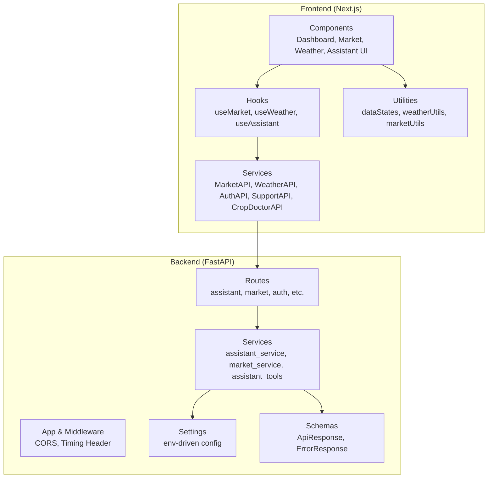
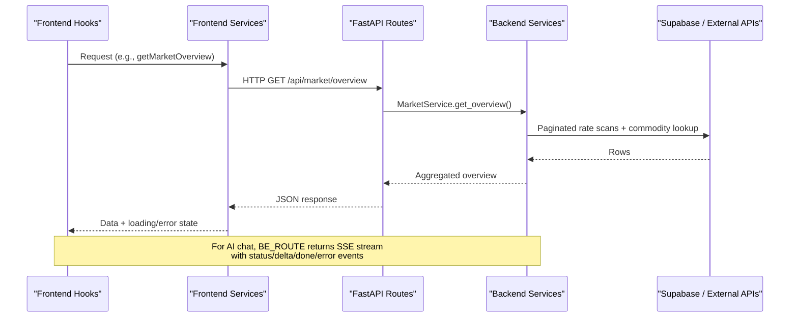
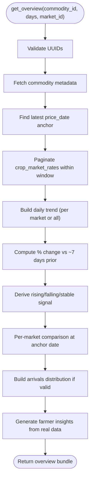
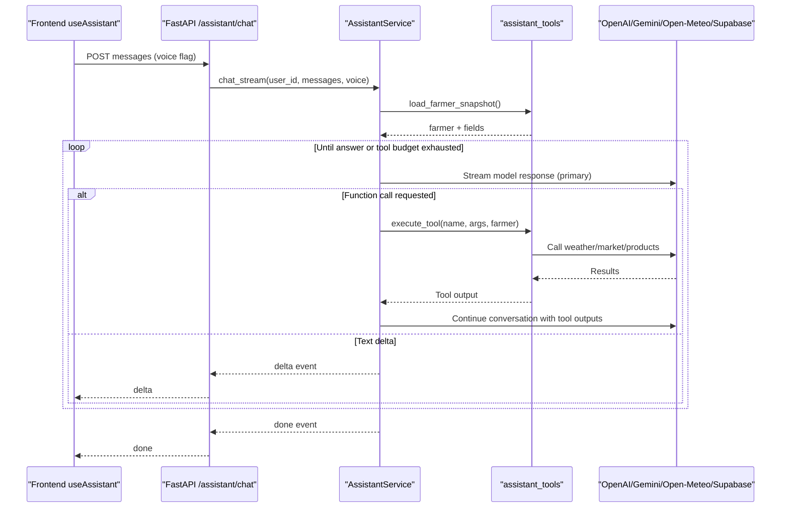
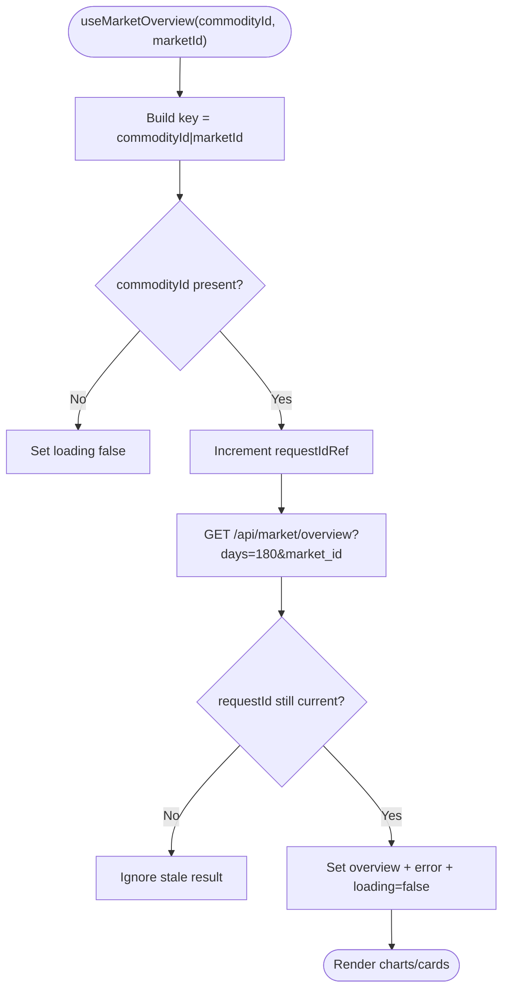
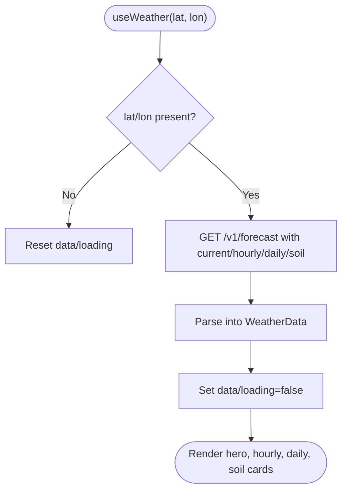
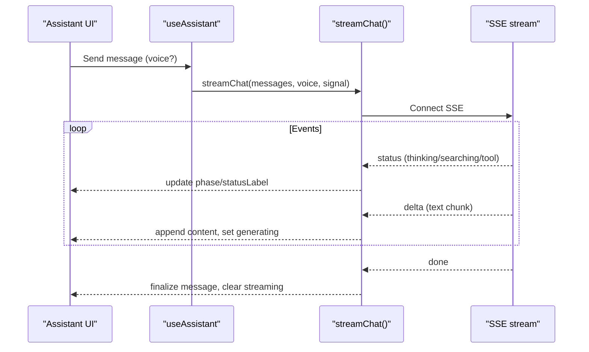
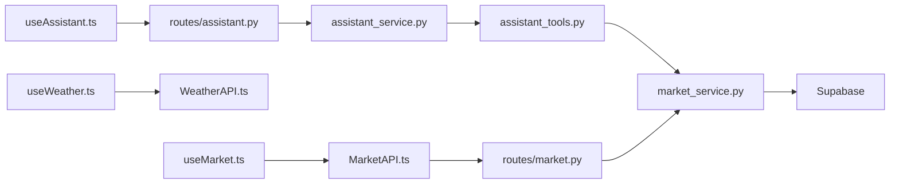

# Performance Optimization

<cite>
**Referenced Files in This Document**
- [main.py](file://Backend/main.py)
- [settings.py](file://Backend/config/settings.py)
- [market_service.py](file://Backend/services/market_service.py)
- [assistant_service.py](file://Backend/services/assistant_service.py)
- [assistant_tools.py](file://Backend/services/assistant_tools.py)
- [assistant.py](file://Backend/routes/assistant.py)
- [common.py](file://Backend/schemas/common.py)
- [useMarket.ts](file://Frontend/greenflora/Hooks/useMarket.ts)
- [useWeather.ts](file://Frontend/greenflora/Hooks/useWeather.ts)
- [useAssistant.ts](file://Frontend/greenflora/Hooks/useAssistant.ts)
- [MarketAPI.ts](file://Frontend/greenflora/services/MarketAPI.ts)
- [WeatherAPI.ts](file://Frontend/greenflora/services/WeatherAPI.ts)
- [AuthAPI.ts](file://Frontend/greenflora/services/AuthAPI.ts)
- [SupportAPI.ts](file://Frontend/greenflora/services\SupportAPI.ts)
- [CropDoctorAPI.ts](file://Frontend/greenflora/services/CropDoctorAPI.ts)
- [next.config.ts](file://Frontend/greenflora/next.config.ts)
- [package.json](file://Frontend/greenflora/package.json)
- [dataStates.ts](file://Frontend/greenflora/lib/dataStates.ts)
- [weatherUtils.ts](file://Frontend/greenflora/lib/weatherUtils.ts)
- [marketUtils.ts](file://Frontend/greenflora/lib/marketUtils.ts)
</cite>

## Table of Contents
1. Introduction
2. Project Structure
3. Core Components
4. Architecture Overview
5. Detailed Component Analysis
6. Dependency Analysis
7. Performance Considerations
8. Troubleshooting Guide
9. Conclusion
10. Appendices

## Introduction
This document provides comprehensive performance optimization guidance for Green-Flora across frontend and backend layers. It focuses on:
- Backend: database query optimization, API response caching, efficient data processing for AI services, streaming responses, and robust fallbacks.
- Frontend: component loading strategies, image and bundle considerations, efficient state management patterns, and resilient network requests.
- Monitoring and profiling: request timing headers, structured error types, timeouts, and streaming events to identify bottlenecks.
- Caching strategies: market prices, weather data, and AI analysis results.
- Mobile and PWA readiness: progressive rendering, skeleton states, and efficient data fetching.

## Project Structure
Green-Flora is a Next.js frontend paired with a FastAPI backend. The backend centralizes configuration, routes, services, and schemas. The frontend organizes hooks, services, components, and utilities by feature area.

**Diagram sources**
- [main.py:15-47](file://Backend/main.py#L15-L47)
- [settings.py:48-122](file://Backend/config/settings.py#L48-L122)
- [market_service.py:47-652](file://Backend/services/market_service.py#L47-L652)
- [assistant_service.py:106-800](file://Backend/services/assistant_service.py#L106-L800)
- [assistant_tools.py:116-576](file://Backend/services/assistant_tools.py#L116-L576)
- [useMarket.ts:33-135](file://Frontend/greenflora/Hooks/useMarket.ts#L33-L135)
- [useWeather.ts:21-58](file://Frontend/greenflora/Hooks/useWeather.ts#L21-L58)
- [useAssistant.ts:81-125](file://Frontend/greenflora/Hooks/useAssistant.ts#L81-L125)

**Section sources**
- [main.py:15-47](file://Backend/main.py#L15-L47)
- [settings.py:48-122](file://Backend/config/settings.py#L48-L122)
- [package.json:1-32](file://Frontend/greenflora/package.json#L1-L32)

## Core Components
- Backend app and middleware: CORS, request timing header, health endpoint, route registration.
- Configuration: environment-driven settings for databases, external APIs, and AI models/timeouts.
- Market service: paginated queries, in-memory caches for commodities and markets, representative price computation, trend and distribution building.
- Assistant service: streaming chat via SSE, provider strategy (OpenAI primary, Gemini fallback), tool execution, greeting cache, speech endpoints.
- Frontend hooks: standardized loading/error/refresh patterns; request deduplication and supersession guards.
- Frontend services: unified fetch wrappers with timeouts, token injection, typed errors.

Key performance characteristics:
- Backend uses in-process caches with TTLs for frequently accessed reference data.
- Streaming responses reduce perceived latency for AI answers.
- Frontend hooks avoid race conditions and unnecessary re-renders using request IDs and scoped state.

**Section sources**
- [main.py:21-52](file://Backend/main.py#L21-L52)
- [settings.py:55-122](file://Backend/config/settings.py#L55-L122)
- [market_service.py:47-652](file://Backend/services/market_service.py#L47-L652)
- [assistant_service.py:106-800](file://Backend/services/assistant_service.py#L106-L800)
- [useMarket.ts:33-135](file://Frontend/greenflora/Hooks/useMarket.ts#L33-L135)
- [useWeather.ts:21-58](file://Frontend/greenflora/Hooks/useWeather.ts#L21-L58)
- [MarketAPI.ts:46-128](file://Frontend/greenflora/services/MarketAPI.ts#L46-L128)
- [WeatherAPI.ts:141-291](file://Frontend/greenflora/services/WeatherAPI.ts#L141-L291)

## Architecture Overview
The system streams AI responses and serves cached market data efficiently while keeping the frontend responsive through optimized hooks and typed services.

**Diagram sources**
- [useMarket.ts:80-135](file://Frontend/greenflora/Hooks/useMarket.ts#L80-L135)
- [MarketAPI.ts:100-128](file://Frontend/greenflora/services/MarketAPI.ts#L100-L128)
- [market_service.py:158-343](file://Backend/services/market_service.py#L158-L343)
- [assistant.py:75-113](file://Backend/routes/assistant.py#L75-L113)
- [assistant_service.py:175-287](file://Backend/services/assistant_service.py#L175-L287)

## Detailed Component Analysis

### Backend: Market Intelligence Service
Optimizations implemented:
- In-memory caches for commodities list and markets map with TTL to avoid repeated DB reads.
- Paginated scans with page size caps to prevent large payloads and long-running queries.
- Representative price calculation that prefers quantity-weighted averages when available, falling back to simple average or single-market values.
- Trend series built per day with optional market scoping to minimize client-side filtering.
- Distribution computed only when meaningful (multiple markets with positive arrivals).

**Diagram sources**
- [market_service.py:158-343](file://Backend/services/market_service.py#L158-L343)
- [market_service.py:398-468](file://Backend/services/market_service.py#L398-L468)
- [market_service.py:474-517](file://Backend/services/market_service.py#L474-L517)
- [market_service.py:523-593](file://Backend/services/market_service.py#L523-L593)

**Section sources**
- [market_service.py:47-652](file://Backend/services/market_service.py#L47-L652)

### Backend: AI Assistant Orchestration
Optimizations implemented:
- Streaming SSE responses with sanitized text deltas to improve perceived responsiveness and safety.
- Provider strategy: OpenAI primary with Gemini fallback on transient failures; avoids parallel calls to prevent contention.
- Tool budget limits to cap function-call rounds and ensure timely answers even under heavy tool usage.
- Greeting cache with TTL to avoid unnecessary model calls for dashboard greetings.
- Structured timeouts for streaming and audio endpoints via settings.

**Diagram sources**
- [assistant_service.py:175-287](file://Backend/services/assistant_service.py#L175-L287)
- [assistant_service.py:293-425](file://Backend/services/assistant_service.py#L293-L425)
- [assistant_service.py:431-540](file://Backend/services/assistant_service.py#L431-L540)
- [assistant_tools.py:116-137](file://Backend/services/assistant_tools.py#L116-L137)
- [assistant_tools.py:220-319](file://Backend/services/assistant_tools.py#L220-L319)
- [assistant_tools.py:361-428](file://Backend/services/assistant_tools.py#L361-L428)
- [assistant.py:75-113](file://Backend/routes/assistant.py#L75-L113)

**Section sources**
- [assistant_service.py:106-800](file://Backend/services/assistant_service.py#L106-L800)
- [assistant_tools.py:116-576](file://Backend/services/assistant_tools.py#L116-L576)
- [assistant.py:75-113](file://Backend/routes/assistant.py#L75-L113)

### Frontend: Market Data Hook
Optimizations implemented:
- Single fetch per (commodity, market) filter pair with a 180-day window; UI slices periods client-side for instant switching.
- Request ID guard prevents stale updates when filters change rapidly.
- Centralized loading/error/refresh pattern consistent with other hooks.

**Diagram sources**
- [useMarket.ts:80-135](file://Frontend/greenflora/Hooks/useMarket.ts#L80-L135)
- [MarketAPI.ts:108-128](file://Frontend/greenflora/services/MarketAPI.ts#L108-L128)

**Section sources**
- [useMarket.ts:33-135](file://Frontend/greenflora/Hooks/useMarket.ts#L33-L135)
- [MarketAPI.ts:46-128](file://Frontend/greenflora/services/MarketAPI.ts#L46-L128)

### Frontend: Weather Data Hook
Optimizations implemented:
- Single request bundles current, hourly (24h), daily (7d), and soil data to minimize round-trips.
- Reverse geocoding with timeout and graceful null handling.
- Consistent loading/error/refresh lifecycle.

**Diagram sources**
- [useWeather.ts:21-58](file://Frontend/greenflora/Hooks/useWeather.ts#L21-L58)
- [WeatherAPI.ts:141-291](file://Frontend/greenflora/services/WeatherAPI.ts#L141-L291)

**Section sources**
- [useWeather.ts:21-58](file://Frontend/greenflora/Hooks/useWeather.ts#L21-L58)
- [WeatherAPI.ts:141-291](file://Frontend/greenflora/services/WeatherAPI.ts#L141-L291)

### Frontend: Assistant Streaming Hook
Optimizations implemented:
- Event-driven state machine for thinking/generating phases.
- Superseded request guard ensures only the latest stream updates UI.
- Microphone support detection cached to avoid runtime checks.

**Diagram sources**
- [useAssistant.ts:339-377](file://Frontend/greenflora/Hooks/useAssistant.ts#L339-L377)
- [useAssistant.ts:81-125](file://Frontend/greenflora/Hooks/useAssistant.ts#L81-L125)
- [assistant.py:75-113](file://Backend/routes/assistant.py#L75-L113)

**Section sources**
- [useAssistant.ts:81-125](file://Frontend/greenflora/Hooks/useAssistant.ts#L81-L125)
- [useAssistant.ts:339-377](file://Frontend/greenflora/Hooks/useAssistant.ts#L339-L377)
- [assistant.py:75-113](file://Backend/routes/assistant.py#L75-L113)

## Dependency Analysis
Coupling and cohesion:
- Market service depends on Supabase tables and exposes a stable overview shape; tightly cohesive around AMIS data.
- Assistant service orchestrates tools and providers; loosely coupled via tool definitions and settings.
- Frontend hooks encapsulate data fetching and state; services are thin wrappers around fetch with typed errors.

External dependencies:
- Open-Meteo for weather (frontend and assistant tools).
- Supabase for market and product data.
- OpenAI and Gemini for AI capabilities.

Potential circular dependencies:
- None observed; assistant tools import market_service but not vice versa.

**Diagram sources**
- [useMarket.ts:33-135](file://Frontend/greenflora/Hooks/useMarket.ts#L33-L135)
- [MarketAPI.ts:100-128](file://Frontend/greenflora/services/MarketAPI.ts#L100-L128)
- [useWeather.ts:21-58](file://Frontend/greenflora/Hooks/useWeather.ts#L21-L58)
- [WeatherAPI.ts:141-291](file://Frontend/greenflora/services/WeatherAPI.ts#L141-L291)
- [assistant.py:75-113](file://Backend/routes/assistant.py#L75-L113)
- [assistant_service.py:175-287](file://Backend/services/assistant_service.py#L175-L287)
- [assistant_tools.py:361-428](file://Backend/services/assistant_tools.py#L361-L428)
- [market_service.py:158-343](file://Backend/services/market_service.py#L158-L343)

**Section sources**
- [assistant_tools.py:116-137](file://Backend/services/assistant_tools.py#L116-L137)
- [market_service.py:47-652](file://Backend/services/market_service.py#L47-L652)

## Performance Considerations
Backend optimizations already implemented:
- Database query optimization:
  - Paginated scans with capped page sizes and row limits to avoid heavy loads.
  - Narrow field selection and ordering to minimize payload and sorting overhead.
- API response caching:
  - In-memory caches for commodities and markets with TTL to reduce DB pressure.
  - Greeting cache with TTL to avoid unnecessary model calls.
- Efficient AI data processing:
  - Tool budget limits to prevent runaway tool chains.
  - Sanitized streaming deltas to reduce UI churn and ensure safe content.
  - Provider fallback to maintain responsiveness during transient failures.

Frontend optimizations already implemented:
- Efficient state management:
  - Per-hook loading/error/refresh patterns with request ID guards to prevent race conditions.
  - Scoped state so UI shows skeletons for non-current filters.
- Network efficiency:
  - Unified fetch wrappers with timeouts and typed errors.
  - Single bundled weather request to minimize round-trips.
- Bundle and image considerations:
  - Current Next.js config is minimal; consider enabling image optimization and code splitting where applicable.
  - Use lightweight icon libraries and avoid heavy chart libraries unless necessary.

Monitoring and profiling:
- Backend adds an X-Process-Time header to every response for quick latency diagnostics.
- Frontend uses AbortController-based timeouts to detect slow or hanging requests.
- Streaming events provide granular visibility into AI processing stages.

[No sources needed since this section provides general guidance]

## Troubleshooting Guide
Common issues and mitigations:
- Slow or hanging requests:
  - Frontend services abort after configured timeouts and surface typed errors (network/timeout/server).
  - Backend timing header helps pinpoint slow endpoints.
- AI streaming interruptions:
  - Assistant service emits error events with retry flags; frontend hook resets UI state and allows retry.
  - Fallback provider activates on transient failures without restarting mid-stream.
- Missing or partial data:
  - Market service returns empty states when no data is ingested; UI can render honest empty states.
  - Weather reverse geocoding returns null gracefully when unavailable.

Operational tips:
- Inspect X-Process-Time to identify slow routes.
- Use structured error types in frontend to display user-friendly messages and trigger retries.
- Leverage streaming status events to inform users about ongoing operations.

**Section sources**
- [main.py:31-38](file://Backend/main.py#L31-L38)
- [MarketAPI.ts:46-94](file://Frontend/greenflora/services/MarketAPI.ts#L46-L94)
- [WeatherAPI.ts:187-222](file://Frontend/greenflora/services/WeatherAPI.ts#L187-L222)
- [assistant_service.py:175-287](file://Backend/services/assistant_service.py#L175-L287)
- [useAssistant.ts:339-377](file://Frontend/greenflora/Hooks/useAssistant.ts#L339-L377)

## Conclusion
Green-Flora’s architecture emphasizes efficient data access, resilient streaming, and responsive UI patterns. Backend caching, paginated queries, and provider fallbacks ensure reliable performance under variable conditions. Frontend hooks and services standardize loading states, timeouts, and error handling, improving perceived performance and stability. Continued focus on bundle optimization, image handling, and monitoring will further enhance scalability and user experience.

[No sources needed since this section summarizes without analyzing specific files]

## Appendices

### Caching Strategies Summary
- Market prices:
  - Commodities list and markets map cached in memory with TTL to keep selector snappy.
  - Overview computed once per (crop, market) with client-side period slicing.
- Weather data:
  - Bundled single request for current, hourly, daily, and soil metrics; reverse geocoding with timeout.
- AI analysis results:
  - Greeting cache with TTL reduces model calls.
  - Streaming deltas minimize perceived latency; fallback provider maintains continuity.

**Section sources**
- [market_service.py:47-652](file://Backend/services/market_service.py#L47-L652)
- [assistant_service.py:683-735](file://Backend/services/assistant_service.py#L683-L735)
- [WeatherAPI.ts:141-291](file://Frontend/greenflora/services/WeatherAPI.ts#L141-L291)

### Mobile and Progressive Web App Considerations
- Progressive rendering:
  - Skeleton placeholders during loading; empty states when data is unavailable.
- Efficient state:
  - Request ID guards prevent flicker when filters change quickly.
- Network resilience:
  - Timeouts and typed errors improve UX on unstable connections.
- Bundle and images:
  - Keep dependencies lean; leverage Next.js image optimization features where applicable.

**Section sources**
- [useMarket.ts:80-135](file://Frontend/greenflora/Hooks/useMarket.ts#L80-L135)
- [dataStates.ts:9-53](file://Frontend/greenflora/lib/dataStates.ts#L9-L53)
- [MarketAPI.ts:46-94](file://Frontend/greenflora/services/MarketAPI.ts#L46-L94)
- [next.config.ts:1-8](file://Frontend/greenflora/next.config.ts#L1-L8)