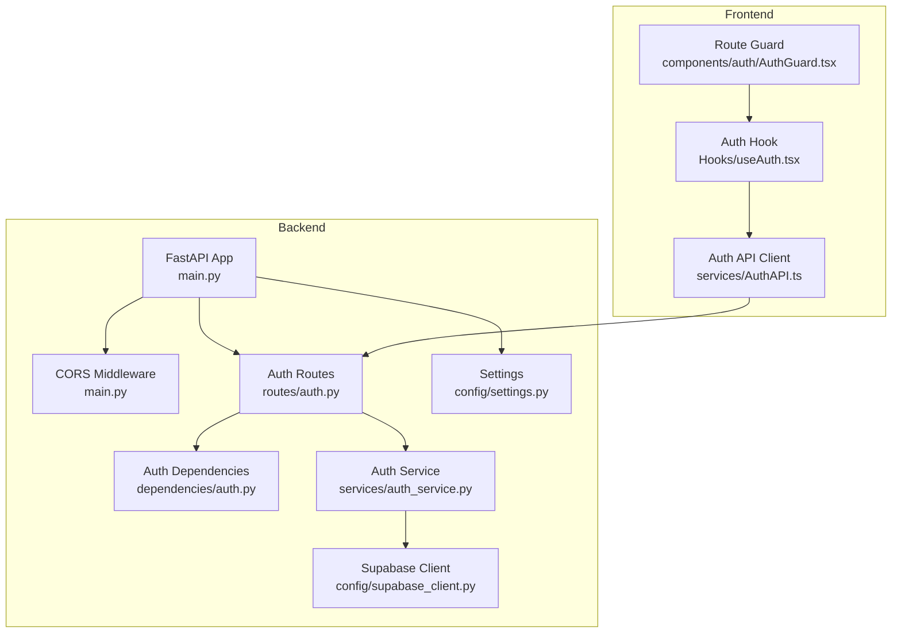
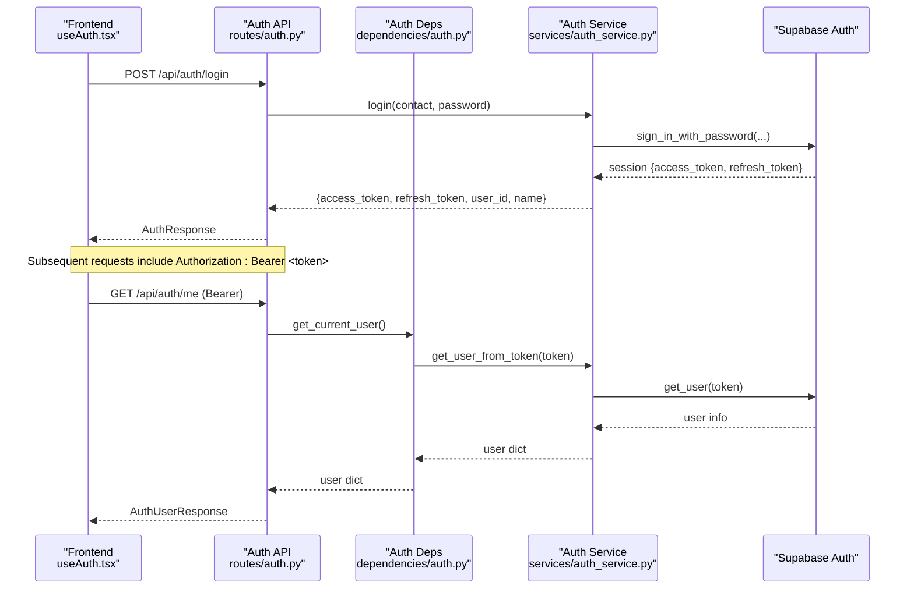
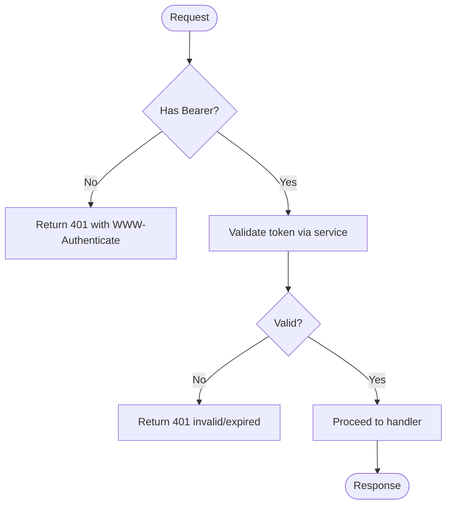
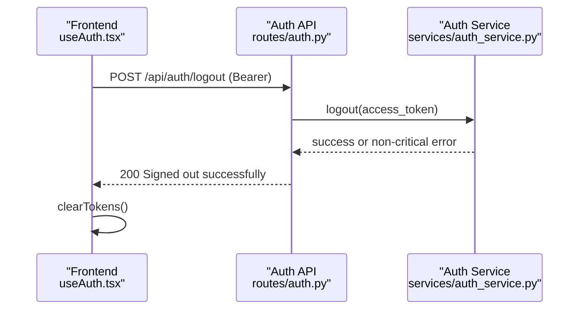
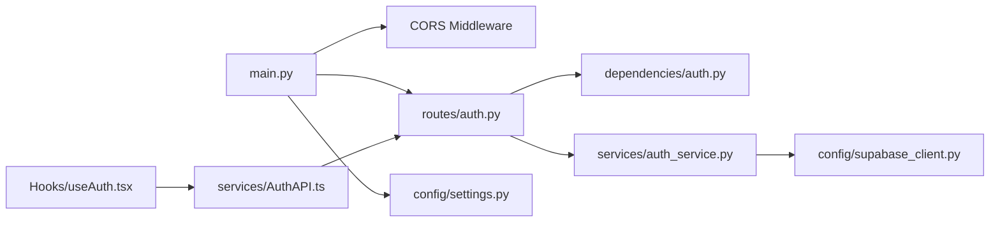

# Security Considerations

<cite>
**Referenced Files in This Document**
- [main.py](file://Backend/main.py)
- [settings.py](file://Backend/config/settings.py)
- [supabase_client.py](file://Backend/config/supabase_client.py)
- [auth.py (dependencies)](file://Backend/dependencies/auth.py)
- [auth.py (routes)](file://Backend/routes/auth.py)
- [auth_service.py](file://Backend/services/auth_service.py)
- [farmer.py (routes)](file://Backend/routes/farmer.py)
- [field.py (routes)](file://Backend/routes/field.py)
- [auth.py (schemas)](file://Backend/schemas/auth.py)
- [AuthAPI.ts](file://Frontend/greenflora/services/AuthAPI.ts)
- [useAuth.tsx](file://Frontend/greenflora/Hooks/useAuth.tsx)
- [AuthGuard.tsx](file://Frontend/greenflora/components/auth/AuthGuard.tsx)
</cite>

## Table of Contents
1. Introduction
2. Project Structure
3. Core Components
4. Architecture Overview
5. Detailed Component Analysis
6. Dependency Analysis
7. Performance Considerations
8. Troubleshooting Guide
9. Conclusion

## Introduction
This document provides comprehensive security guidance for Green Flora, focusing on authentication, authorization, and data protection across the backend API and frontend application. It explains how JWT-based authentication is implemented via Supabase Auth, how access to sensitive farmer data is enforced, and how input validation and CORS are configured. It also covers session management, logout procedures, secure handling of secrets, and recommended practices for development and production environments.

## Project Structure
The security-relevant parts of the system are organized into:
- Backend FastAPI application with middleware, routes, dependencies, services, schemas, and configuration
- Frontend Next.js application with auth hooks, API client, and route guards

**Diagram sources**
- [main.py:15-47](file://Backend/main.py#L15-L47)
- [settings.py:48-88](file://Backend/config/settings.py#L48-L88)
- [auth.py (dependencies):36-100](file://Backend/dependencies/auth.py#L36-L100)
- [auth.py (routes):68-132](file://Backend/routes/auth.py#L68-L132)
- [auth_service.py:51-192](file://Backend/services/auth_service.py#L51-L192)
- [supabase_client.py:16-47](file://Backend/config/supabase_client.py#L16-L47)
- [useAuth.tsx:46-128](file://Frontend/greenflora/Hooks/useAuth.tsx#L46-L128)
- [AuthAPI.ts:143-178](file://Frontend/greenflora/services/AuthAPI.ts#L143-L178)
- [AuthGuard.tsx:37-58](file://Frontend/greenflora/components/auth/AuthGuard.tsx#L37-L58)

**Section sources**
- [main.py:15-47](file://Backend/main.py#L15-L47)
- [settings.py:48-88](file://Backend/config/settings.py#L48-L88)

## Core Components
- Authentication endpoints: signup, login, refresh, logout, and current user info
- Authorization dependencies: enforce Bearer token presence and validity
- Input validation: Pydantic schemas for request payloads
- CORS configuration: controlled by environment settings
- Secret management: centralized via environment variables
- Session management: tokens stored in browser localStorage and refreshed as needed
- Route-level protection: optional vs required authentication per route

Key responsibilities:
- Backend routes validate inputs and delegate to services
- Services interact with Supabase Auth for token operations
- Dependencies extract and validate Bearer tokens
- Frontend manages token lifecycle and protects routes client-side

**Section sources**
- [auth.py (routes):68-132](file://Backend/routes/auth.py#L68-L132)
- [auth.py (dependencies):36-100](file://Backend/dependencies/auth.py#L36-L100)
- [auth_service.py:51-192](file://Backend/services/auth_service.py#L51-L192)
- [auth.py (schemas):42-77](file://Backend/schemas/auth.py#L42-L77)
- [main.py:21-28](file://Backend/main.py#L21-L28)
- [settings.py:64-88](file://Backend/config/settings.py#L64-L88)
- [AuthAPI.ts:25-46](file://Frontend/greenflora/services/AuthAPI.ts#L25-L46)
- [useAuth.tsx:50-88](file://Frontend/greenflora/Hooks/useAuth.tsx#L50-L88)

## Architecture Overview
Green Flora uses a JWT-based flow backed by Supabase Auth:
- Clients obtain access and refresh tokens from /api/auth/login or /api/auth/signup
- Protected endpoints require a valid Bearer token validated via get_current_user
- Expired sessions can be renewed using /api/auth/refresh
- Logout clears server-side session best-effort and removes local tokens

**Diagram sources**
- [auth.py (routes):79-132](file://Backend/routes/auth.py#L79-L132)
- [auth.py (dependencies):36-69](file://Backend/dependencies/auth.py#L36-L69)
- [auth_service.py:94-178](file://Backend/services/auth_service.py#L94-L178)
- [useAuth.tsx:90-113](file://Frontend/greenflora/Hooks/useAuth.tsx#L90-L113)
- [AuthAPI.ts:150-178](file://Frontend/greenflora/services/AuthAPI.ts#L150-L178)

## Detailed Component Analysis

### Authentication Endpoints and Token Lifecycle
- Signup creates a new account and returns tokens; may require email/phone confirmation
- Login authenticates and returns tokens
- Refresh exchanges a refresh token for a new session
- Logout signs out server-side best-effort and returns success regardless
- Current user endpoint returns minimal profile fields

**Diagram sources**
- [auth.py (dependencies):36-69](file://Backend/dependencies/auth.py#L36-L69)
- [auth_service.py:156-178](file://Backend/services/auth_service.py#L156-L178)

**Section sources**
- [auth.py (routes):68-132](file://Backend/routes/auth.py#L68-L132)
- [auth_service.py:51-192](file://Backend/services/auth_service.py#L51-L192)
- [auth.py (dependencies):36-100](file://Backend/dependencies/auth.py#L36-L100)

### Authorization Model and Role-Based Access Control
- Farmer and field routes use an optional-user pattern:
  - In demo mode, no authentication is required and demo data is served
  - In live mode without a valid token, a 401 is returned
  - With a valid token, the authenticated user_id is used to scope data
- Ownership enforcement occurs at the service layer based on user_id
- No explicit role checks are present in the analyzed routes; authorization is primarily user-scoped

Recommendations for role-based access control:
- Introduce roles (e.g., farmer, admin) in user metadata or a dedicated roles table
- Add dependency decorators to enforce role requirements on sensitive endpoints
- Centralize policy checks in a reusable middleware or dependency

**Section sources**
- [farmer.py:50-68](file://Backend/routes/farmer.py#L50-L68)
- [field.py:51-66](file://Backend/routes/field.py#L51-L66)

### Input Validation and Sanitization
- Pydantic models define strict request shapes and constraints:
  - Name length limits
  - Contact must be a valid email or phone format
  - Password minimum length
  - Refresh token presence
- Validators reject malformed contact values early
- Responses are typed to avoid leaking unexpected fields

Mitigations against common vulnerabilities:
- SQL injection: Use parameterized queries through Supabase PostgREST; avoid raw SQL concatenation
- XSS: Ensure responses are JSON and rendered safely on the frontend; sanitize any user-generated content before rendering
- CSRF: Not applicable for stateless JWT APIs behind CORS; ensure proper CORS and origin checks

**Section sources**
- [auth.py (schemas):42-77](file://Backend/schemas/auth.py#L42-L77)

### CORS Configuration
- CORS is enabled via FastAPI middleware
- Allowed origins are read from environment variables with a safe default for development
- Credentials are allowed to support cookie-based flows if needed

Production recommendations:
- Restrict CORS_ORIGINS to known domains
- Avoid wildcard methods/headers in production unless necessary
- Monitor and log cross-origin requests

**Section sources**
- [main.py:21-28](file://Backend/main.py#L21-L28)
- [settings.py:64-68](file://Backend/config/settings.py#L64-L68)

### Rate Limiting and API Security
- No explicit rate limiting middleware is present in the analyzed code
- External providers (e.g., AI services) implement their own rate limiting and timeouts

Recommended measures:
- Add a rate limiter (e.g., slowapi or reverse proxy rules) to protect auth endpoints
- Enforce request size limits and timeouts at the gateway or WAF level
- Implement retry/backoff for external calls and fail fast on repeated failures

[No sources needed since this section provides general guidance]

### Secure Handling of Sensitive Data
- Secrets are loaded from environment variables via a centralized Settings class
- Supabase client is created only when credentials are configured
- Tokens are persisted in browser localStorage by the frontend API client
- Logout clears server-side session best-effort and removes local tokens

Best practices:
- Never commit secrets; use environment variable managers or secret stores
- Rotate keys regularly and restrict permissions to least privilege
- Prefer short-lived access tokens and secure refresh token storage strategies

**Section sources**
- [settings.py:61-88](file://Backend/config/settings.py#L61-L88)
- [supabase_client.py:16-47](file://Backend/config/supabase_client.py#L16-L47)
- [AuthAPI.ts:25-46](file://Frontend/greenflora/services/AuthAPI.ts#L25-L46)
- [useAuth.tsx:105-113](file://Frontend/greenflora/Hooks/useAuth.tsx#L105-L113)

### Session Management and Logout Procedures
- Frontend restores sessions on app start by calling /api/auth/me and refreshing tokens if needed
- On logout, the frontend calls /api/auth/logout and clears stored tokens
- Server-side logout is best-effort and does not block successful responses

**Diagram sources**
- [auth.py (routes):105-120](file://Backend/routes/auth.py#L105-L120)
- [auth_service.py:180-192](file://Backend/services/auth_service.py#L180-L192)
- [useAuth.tsx:105-113](file://Frontend/greenflora/Hooks/useAuth.tsx#L105-L113)
- [AuthAPI.ts:164-170](file://Frontend/greenflora/services/AuthAPI.ts#L164-L170)

**Section sources**
- [useAuth.tsx:50-88](file://Frontend/greenflora/Hooks/useAuth.tsx#L50-L88)
- [auth.py (routes):105-120](file://Backend/routes/auth.py#L105-L120)
- [auth_service.py:180-192](file://Backend/services/auth_service.py#L180-L192)
- [AuthAPI.ts:164-170](file://Frontend/greenflora/services/AuthAPI.ts#L164-L170)

### Security Headers and Transport Security
- Requests include Authorization headers for protected endpoints
- The server sets WWW-Authenticate on 401 responses to indicate Bearer scheme
- Process timing header is added for debugging; consider removing in production

Production hardening:
- Enforce HTTPS at the reverse proxy or load balancer
- Add security headers such as Strict-Transport-Security, Content-Security-Policy, X-Content-Type-Options
- Remove debug headers like process timing in production builds

**Section sources**
- [auth.py (dependencies):46-60](file://Backend/dependencies/auth.py#L46-L60)
- [main.py:31-38](file://Backend/main.py#L31-L38)

### Frontend Route Protection
- AuthGuard wraps protected pages and redirects unauthenticated users to login
- Loading states prevent flashes of protected content during session restoration

**Section sources**
- [AuthGuard.tsx:37-58](file://Frontend/greenflora/components/auth/AuthGuard.tsx#L37-L58)

## Dependency Analysis
The following diagram shows key security-related dependencies between modules:

**Diagram sources**
- [main.py:15-47](file://Backend/main.py#L15-L47)
- [auth.py (routes):68-132](file://Backend/routes/auth.py#L68-L132)
- [auth.py (dependencies):36-100](file://Backend/dependencies/auth.py#L36-L100)
- [auth_service.py:51-192](file://Backend/services/auth_service.py#L51-L192)
- [supabase_client.py:16-47](file://Backend/config/supabase_client.py#L16-L47)
- [settings.py:48-88](file://Backend/config/settings.py#L48-L88)
- [useAuth.tsx:46-128](file://Frontend/greenflora/Hooks/useAuth.tsx#L46-L128)
- [AuthAPI.ts:143-178](file://Frontend/greenflora/services/AuthAPI.ts#L143-L178)

**Section sources**
- [main.py:15-47](file://Backend/main.py#L15-L47)
- [auth.py (routes):68-132](file://Backend/routes/auth.py#L68-L132)
- [auth.py (dependencies):36-100](file://Backend/dependencies/auth.py#L36-L100)
- [auth_service.py:51-192](file://Backend/services/auth_service.py#L51-L192)
- [supabase_client.py:16-47](file://Backend/config/supabase_client.py#L16-L47)
- [settings.py:48-88](file://Backend/config/settings.py#L48-L88)
- [useAuth.tsx:46-128](file://Frontend/greenflora/Hooks/useAuth.tsx#L46-L128)
- [AuthAPI.ts:143-178](file://Frontend/greenflora/services/AuthAPI.ts#L143-L178)

## Performance Considerations
- Token validation adds network latency to Supabase Auth; cache where appropriate on the client
- Use refresh tokens to minimize re-authentication overhead
- Configure timeouts and connection limits for the Supabase HTTP client to avoid resource exhaustion
- Consider adding caching for non-sensitive read endpoints behind authentication

[No sources needed since this section provides general guidance]

## Troubleshooting Guide
Common issues and mitigations:
- Missing or invalid token: Expect 401 with WWW-Authenticate; ensure Authorization header is set correctly
- Service unavailable: 503 indicates Supabase not configured; verify environment variables
- Unexpected errors: Routes map service exceptions to appropriate HTTP status codes; check logs for stack traces
- Frontend session restore: If /api/auth/me fails, attempt refresh; on failure, clear tokens and redirect to login

Operational tips:
- Enable structured logging for auth events
- Monitor failed login attempts and token refresh failures
- Add health checks for Supabase connectivity

**Section sources**
- [auth.py (routes):45-61](file://Backend/routes/auth.py#L45-L61)
- [auth.py (dependencies):46-69](file://Backend/dependencies/auth.py#L46-L69)
- [auth_service.py:39-45](file://Backend/services/auth_service.py#L39-L45)
- [useAuth.tsx:50-88](file://Frontend/greenflora/Hooks/useAuth.tsx#L50-L88)

## Conclusion
Green Flora implements a robust JWT-based authentication flow using Supabase Auth, with clear separation of concerns across routes, dependencies, and services. Input validation via Pydantic reduces exposure to malformed requests, while CORS is configurable through environment variables. Authorization currently scopes data by user identity; extending to role-based access control will further strengthen protection of sensitive administrative functions. For production, add rate limiting, enforce HTTPS, configure restrictive CORS, and adopt secure secret management and monitoring to maintain a strong security posture.