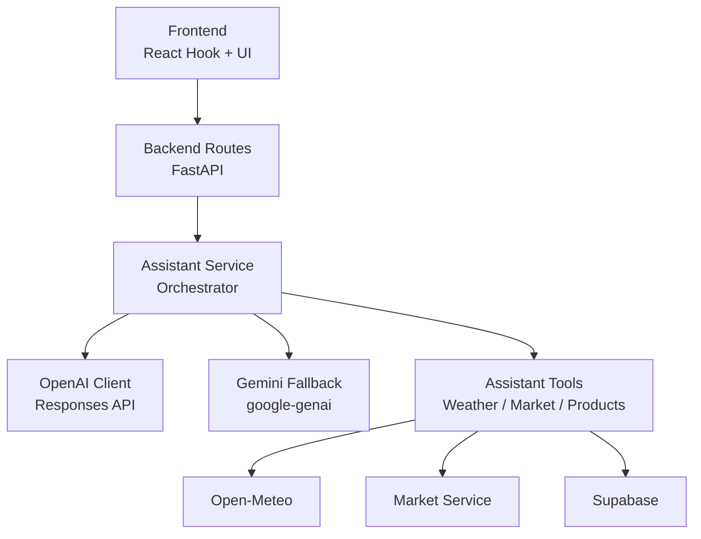
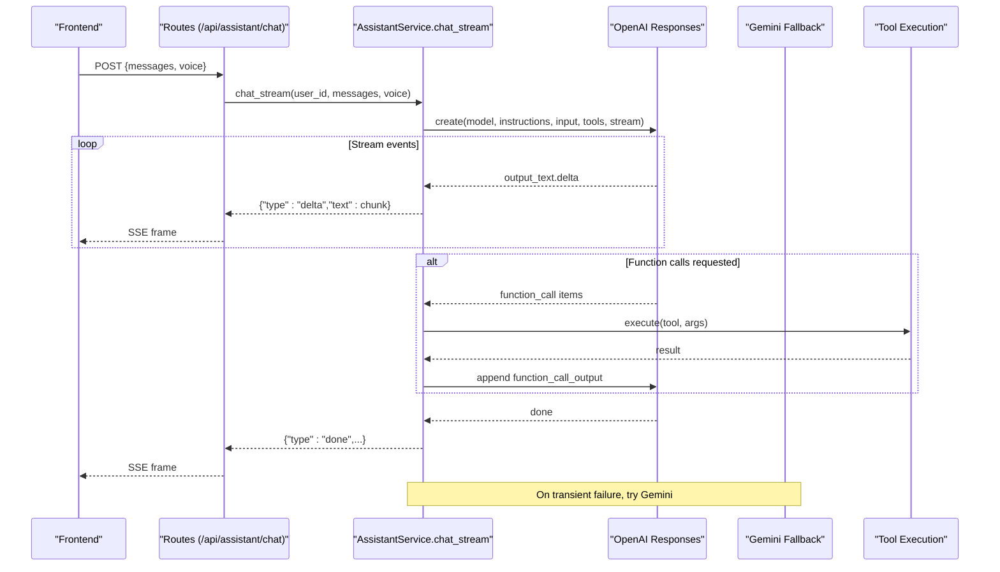
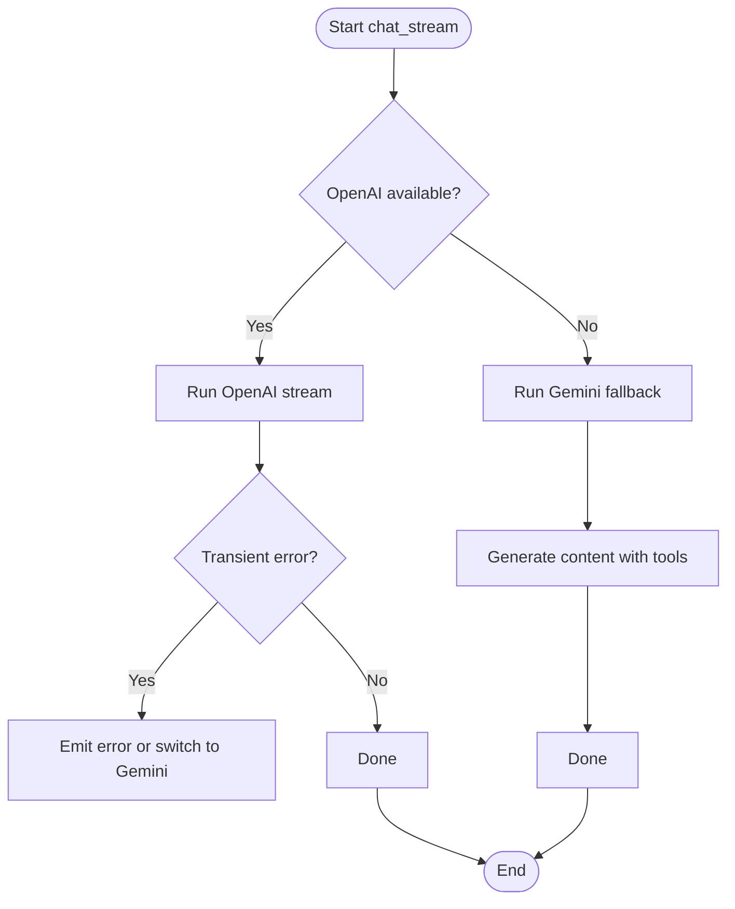
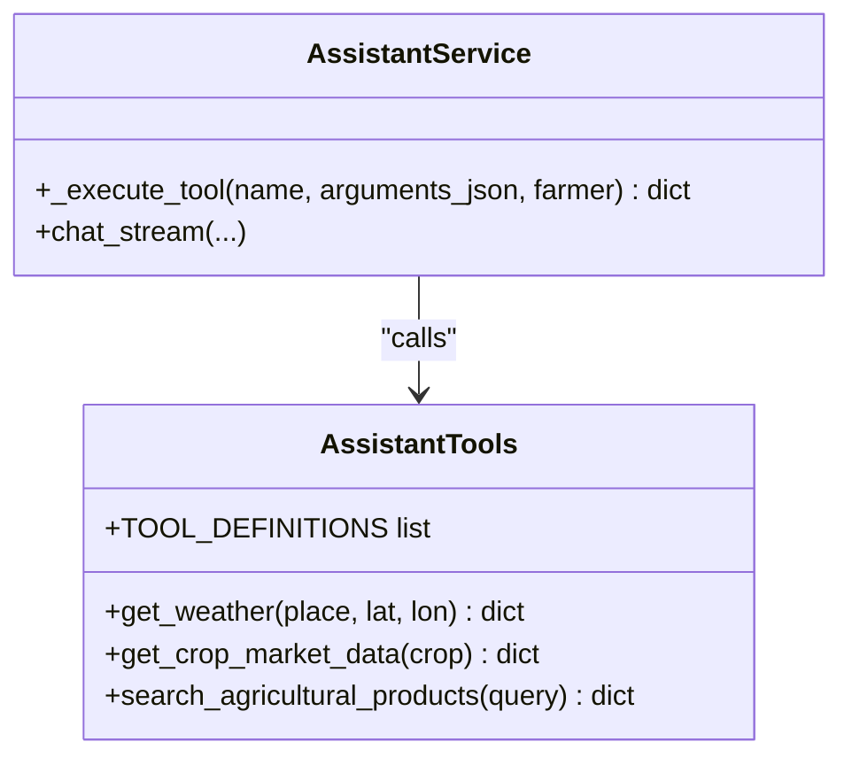
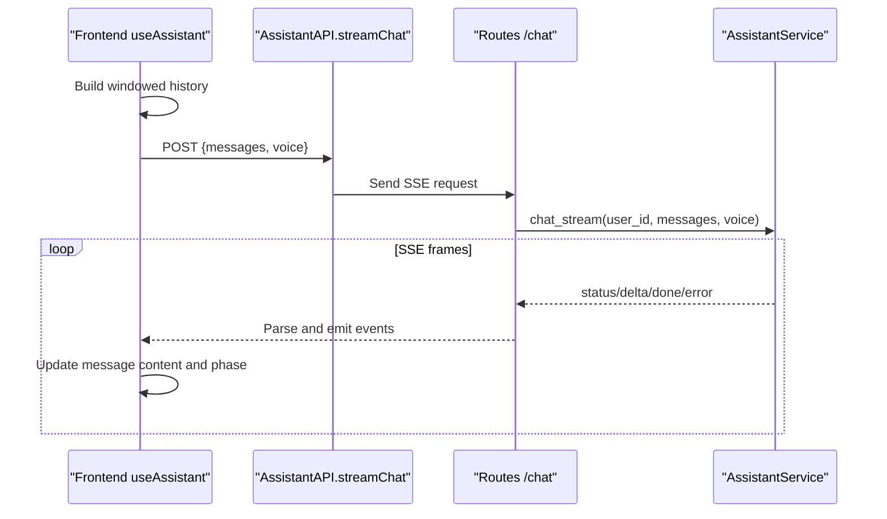
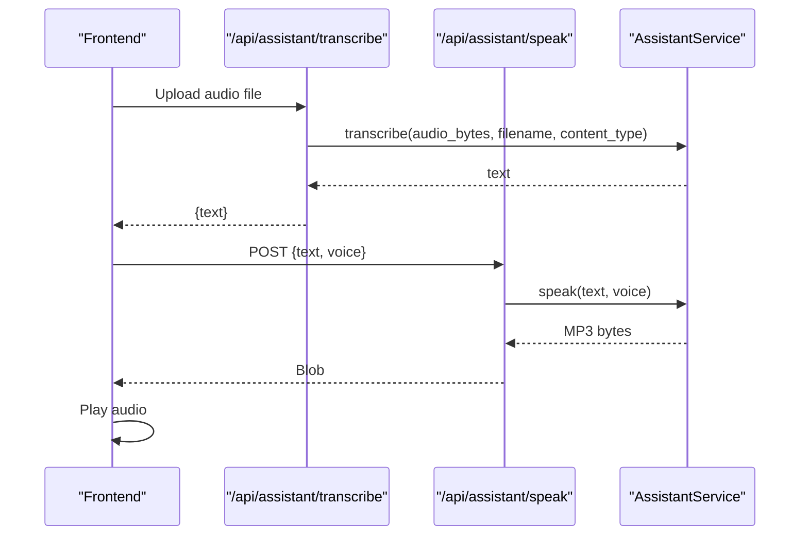

# Assistant Service

<cite>
**Referenced Files in This Document**
- [main.py](file://Backend/main.py)
- [settings.py](file://Backend/config/settings.py)
- [assistant.py](file://Backend/routes/assistant.py)
- [assistant_service.py](file://Backend/services/assistant_service.py)
- [assistant_tools.py](file://Backend/services/assistant_tools.py)
- [assistant.py (schemas)](file://Backend/schemas/assistant.py)
- [AssistantAPI.ts](file://Frontend/greenflora/services/AssistantAPI.ts)
- [useAssistant.ts](file://Frontend/greenflora/Hooks/useAssistant.ts)
- [AssistantPanel.tsx](file://Frontend/greenflora/components/assistant/AssistantPanel.tsx)
- [assistant.ts (types)](file://Frontend/greenflora/types/assistant.ts)
</cite>

## Table of Contents
1. [Introduction](#introduction)
2. [Project Structure](#project-structure)
3. [Core Components](#core-components)
4. [Architecture Overview](#architecture-overview)
5. [Detailed Component Analysis](#detailed-component-analysis)
6. [Dependency Analysis](#dependency-analysis)
7. [Performance Considerations](#performance-considerations)
8. [Troubleshooting Guide](#troubleshooting-guide)
9. [Conclusion](#conclusion)
10. [Appendices](#appendices)

## Introduction
This document explains the conversational assistant service that powers Green Flora’s AI assistant. It covers how the backend integrates with OpenAI for natural language processing and response generation, how tool calling enables actions like weather queries, market data retrieval, and agricultural product search, and how conversation state and multi-turn dialogue are managed end-to-end from the frontend to the backend. It also documents voice processing integration (speech-to-text and text-to-speech), rate limiting behavior, conversation persistence strategy, and error recovery mechanisms.

## Project Structure
The assistant feature spans both backend and frontend:

- Backend
  - Routes expose REST endpoints for chat streaming, transcription, TTS, and greeting.
  - The assistant service orchestrates provider calls (OpenAI primary, Gemini fallback), tool execution, and SSE event emission.
  - Tools encapsulate external data sources (weather via Open-Meteo, market prices via internal services, product search via Supabase).
  - Settings centralize model names, timeouts, and API keys.
- Frontend
  - A React hook manages conversation state, streaming events, voice recording, and playback.
  - An API client handles SSE parsing, authentication headers, and friendly errors.
  - UI components render messages, status labels, and controls for voice and auto-read-aloud.

**Diagram sources**
- [assistant.py:68-112](file://Backend/routes/assistant.py#L68-L112)
- [assistant_service.py:175-287](file://Backend/services/assistant_service.py#L175-L287)
- [assistant_tools.py:220-319](file://Backend/services/assistant_tools.py#L220-L319)
- [settings.py:87-114](file://Backend/config/settings.py#L87-L114)
- [AssistantAPI.ts:231-305](file://Frontend/greenflora/services/AssistantAPI.ts#L231-L305)

**Section sources**
- [main.py:41-47](file://Backend/main.py#L41-L47)
- [assistant.py:68-112](file://Backend/routes/assistant.py#L68-L112)
- [assistant_service.py:175-287](file://Backend/services/assistant_service.py#L175-L287)
- [assistant_tools.py:220-319](file://Backend/services/assistant_tools.py#L220-L319)
- [AssistantAPI.ts:231-305](file://Frontend/greenflora/services/AssistantAPI.ts#L231-L305)

## Core Components
- Assistant routes: Validate requests, resolve user context, stream SSE events for chat, handle audio upload for transcription, return MP3 for TTS, and provide a localized greeting.
- Assistant service: Central orchestrator that:
  - Builds system prompts using farmer snapshot and fields.
  - Streams responses from OpenAI (primary) or Gemini (fallback).
  - Executes tools based on model function calls and feeds results back.
  - Provides speech-to-text and text-to-speech.
  - Emits typed SSE events: status, delta, done, error.
- Assistant tools: Provider-neutral tool definitions and implementations for:
  - Weather: geocoding and forecast via Open-Meteo.
  - Market: AMIS price overview and comparison via internal market service.
  - Products: keyword-based search over agricultural products in Supabase.
- Frontend:
  - useAssistant hook: maintains conversation history, streams events, manages voice recording and playback, and exposes methods to send messages, speak replies, retry, and clear conversation.
  - AssistantAPI client: parses SSE frames, attaches auth headers, and converts transport errors into friendly errors.
  - UI panel: renders phase indicators, messages, and controls.

**Section sources**
- [assistant.py:68-208](file://Backend/routes/assistant.py#L68-L208)
- [assistant_service.py:106-287](file://Backend/services/assistant_service.py#L106-L287)
- [assistant_tools.py:518-575](file://Backend/services/assistant_tools.py#L518-L575)
- [useAssistant.ts:285-455](file://Frontend/greenflora/Hooks/useAssistant.ts#L285-L455)
- [AssistantAPI.ts:157-305](file://Frontend/greenflora/services/AssistantAPI.ts#L157-L305)

## Architecture Overview
The assistant uses a provider-first architecture with robust fallbacks and tool-driven data access.

**Diagram sources**
- [assistant.py:68-112](file://Backend/routes/assistant.py#L68-L112)
- [assistant_service.py:293-425](file://Backend/services/assistant_service.py#L293-L425)
- [assistant_service.py:431-540](file://Backend/services/assistant_service.py#L431-L540)

## Detailed Component Analysis

### OpenAI GPT Integration and Response Streaming
- Primary provider: OpenAI Responses API with streaming. The service sends instructions, conversation, and tool definitions, then streams deltas and function call events.
- Tool augmentation: The model can request web search and internal tools; results are appended to the conversation and the model continues reasoning.
- Fallback: If OpenAI fails transiently (timeout, connection, rate limit, server error), the service switches to Gemini without restarting mid-stream if text has already been emitted.

**Diagram sources**
- [assistant_service.py:175-287](file://Backend/services/assistant_service.py#L175-L287)
- [assistant_service.py:293-425](file://Backend/services/assistant_service.py#L293-L425)
- [assistant_service.py:431-540](file://Backend/services/assistant_service.py#L431-L540)

**Section sources**
- [assistant_service.py:293-425](file://Backend/services/assistant_service.py#L293-L425)
- [assistant_service.py:431-540](file://Backend/services/assistant_service.py#L431-L540)

### Tool Calling System
- Tool definitions are provider-neutral and converted to OpenAI function tools and Gemini function declarations.
- Tools:
  - Weather: resolves place or farm coordinates, fetches current conditions and 7-day forecast from Open-Meteo.
  - Market: maps crop names (including Urdu/Roman Urdu aliases) to AMIS commodities, returns latest price bundle, trend summary, and per-market comparisons.
  - Products: searches agricultural products by keywords against Supabase tables with safe query construction.
- Execution flow:
  - Model emits function_call items.
  - Service executes corresponding tool, emits status events, appends outputs, and resumes model reasoning.

**Diagram sources**
- [assistant_tools.py:220-319](file://Backend/services/assistant_tools.py#L220-L319)
- [assistant_tools.py:361-428](file://Backend/services/assistant_tools.py#L361-L428)
- [assistant_tools.py:435-508](file://Backend/services/assistant_tools.py#L435-L508)
- [assistant_tools.py:518-575](file://Backend/services/assistant_tools.py#L518-L575)
- [assistant_service.py:556-585](file://Backend/services/assistant_service.py#L556-L585)

**Section sources**
- [assistant_tools.py:220-319](file://Backend/services/assistant_tools.py#L220-L319)
- [assistant_tools.py:361-428](file://Backend/services/assistant_tools.py#L361-L428)
- [assistant_tools.py:435-508](file://Backend/services/assistant_tools.py#L435-L508)
- [assistant_service.py:556-585](file://Backend/services/assistant_service.py#L556-L585)

### Conversation State Management and Multi-Turn Dialogue
- Frontend maintains a rolling window of conversation history (up to a configured limit) and sends it with each request.
- Each message is tagged with role and content; assistant replies stream incrementally and finalize when done or error.
- The backend sanitizes messages and enforces character limits to protect prompt size and stability.

**Diagram sources**
- [useAssistant.ts:285-455](file://Frontend/greenflora/Hooks/useAssistant.ts#L285-L455)
- [AssistantAPI.ts:231-305](file://Frontend/greenflora/services/AssistantAPI.ts#L231-L305)
- [assistant.py:68-112](file://Backend/routes/assistant.py#L68-L112)
- [assistant_service.py:175-287](file://Backend/services/assistant_service.py#L175-L287)

**Section sources**
- [useAssistant.ts:285-455](file://Frontend/greenflora/Hooks/useAssistant.ts#L285-L455)
- [AssistantAPI.ts:231-305](file://Frontend/greenflora/services/AssistantAPI.ts#L231-L305)
- [assistant.py:68-112](file://Backend/routes/assistant.py#L68-L112)
- [assistant_service.py:175-287](file://Backend/services/assistant_service.py#L175-L287)

### Voice Processing Integration
- Speech-to-text:
  - Frontend records audio and uploads via multipart form to /api/assistant/transcribe.
  - Backend validates size and MIME type, transcribes using OpenAI audio endpoint, and returns text.
- Text-to-speech:
  - Frontend requests MP3 via /api/assistant/speak with optional voice selection.
  - Backend generates audio using OpenAI TTS and returns binary content.
- Auto-read aloud:
  - Frontend can automatically play the final answer after completion.

**Diagram sources**
- [assistant.py:119-173](file://Backend/routes/assistant.py#L119-L173)
- [assistant_service.py:591-677](file://Backend/services/assistant_service.py#L591-L677)
- [AssistantAPI.ts:315-385](file://Frontend/greenflora/services/AssistantAPI.ts#L315-L385)

**Section sources**
- [assistant.py:119-173](file://Backend/routes/assistant.py#L119-L173)
- [assistant_service.py:591-677](file://Backend/services/assistant_service.py#L591-L677)
- [AssistantAPI.ts:315-385](file://Frontend/greenflora/services/AssistantAPI.ts#L315-L385)

### Examples of Assistant Interactions
- Weather query:
  - User asks about local weather; assistant calls get_weather tool and returns current conditions plus a 7-day forecast.
- Market data:
  - User asks for crop prices; assistant normalizes crop name, retrieves AMIS overview, and presents latest price, change, signal, and market comparison.
- Product search:
  - User asks for pest control options; assistant searches agricultural products and returns brands, dosages, and price ranges.
- Voice interaction:
  - User speaks a question; frontend transcribes, sends text to assistant, and optionally reads reply aloud.

[No sources needed since this section provides conceptual examples grounded by referenced files above]

### Custom Tool Implementation
- Add a new tool by:
  - Defining a provider-neutral entry in TOOL_DEFINITIONS with name, description, and parameters.
  - Implementing the tool function in assistant_tools.py.
  - Routing the tool name in _execute_tool to call the implementation.
  - Optionally adding a user-facing label in _TOOL_LABELS for status updates.

**Section sources**
- [assistant_tools.py:518-575](file://Backend/services/assistant_tools.py#L518-L575)
- [assistant_service.py:556-585](file://Backend/services/assistant_service.py#L556-L585)

### Rate Limiting, Conversation Persistence, and Error Recovery
- Rate limiting:
  - Transient OpenAI errors include rate limit cases; the service treats them as transient and attempts Gemini fallback if appropriate.
  - Frontend uses AbortController for cancellation and friendly timeout handling.
- Conversation persistence:
  - Conversation state is maintained in-memory on the frontend; no server-side persistence is implemented for chat history.
  - Farmer profile and field context are loaded per request for personalization but not stored as chat logs.
- Error recovery:
  - Backend emits structured error events with retryable flags; frontend marks messages as retryable and offers retry actions.
  - Graceful degradation: missing farmer data, unavailable tools, or provider failures do not block the entire experience.

**Section sources**
- [assistant_service.py:228-287](file://Backend/services/assistant_service.py#L228-L287)
- [assistant_service.py:347-367](file://Backend/services/assistant_service.py#L347-L367)
- [assistant_service.py:556-585](file://Backend/services/assistant_service.py#L556-L585)
- [AssistantAPI.ts:82-93](file://Frontend/greenflora/services/AssistantAPI.ts#L82-L93)
- [useAssistant.ts:336-455](file://Frontend/greenflora/Hooks/useAssistant.ts#L336-L455)

## Dependency Analysis
- Routes depend on schemas for validation and on assistant_service for orchestration.
- Assistant service depends on settings for model configuration and timeouts, and on assistant_tools for data retrieval.
- Tools depend on external APIs (Open-Meteo) and internal services (market_service, Supabase).
- Frontend depends on types and the AssistantAPI client for SSE parsing and error handling.

**Diagram sources**
- [assistant.py:68-112](file://Backend/routes/assistant.py#L68-L112)
- [assistant_service.py:175-287](file://Backend/services/assistant_service.py#L175-L287)
- [assistant_tools.py:220-319](file://Backend/services/assistant_tools.py#L220-L319)
- [AssistantAPI.ts:231-305](file://Frontend/greenflora/services/AssistantAPI.ts#L231-L305)

**Section sources**
- [assistant.py:68-112](file://Backend/routes/assistant.py#L68-L112)
- [assistant_service.py:175-287](file://Backend/services/assistant_service.py#L175-L287)
- [assistant_tools.py:220-319](file://Backend/services/assistant_tools.py#L220-L319)
- [AssistantAPI.ts:231-305](file://Frontend/greenflora/services/AssistantAPI.ts#L231-L305)

## Performance Considerations
- Streaming reduces perceived latency by emitting deltas as they arrive.
- Tool budget limits prevent excessive tool rounds, ensuring responsiveness.
- Character caps on messages and TTS inputs constrain payload sizes.
- Audio endpoints have shorter timeouts than chat streaming to improve UX.
- Greeting generation uses a cheap utility model and caches results briefly to reduce load.

[No sources needed since this section provides general guidance derived from referenced code behaviors]

## Troubleshooting Guide
- Chat stream interruptions:
  - Frontend detects aborted streams and marks the last assistant message as interrupted with a retryable error.
- Transcription failures:
  - Backend validates audio size and MIME type; returns friendly errors for empty recordings or timeouts.
- TTS unavailability:
  - Backend returns a friendly error; frontend surfaces a non-blocking notice while keeping text replies intact.
- Provider fallback:
  - When OpenAI fails transiently, the service emits a connecting backup status and retries with Gemini.

**Section sources**
- [assistant_service.py:228-287](file://Backend/services/assistant_service.py#L228-L287)
- [assistant_service.py:591-677](file://Backend/services/assistant_service.py#L591-L677)
- [assistant.py:119-173](file://Backend/routes/assistant.py#L119-L173)
- [useAssistant.ts:336-455](file://Frontend/greenflora/Hooks/useAssistant.ts#L336-L455)

## Conclusion
The assistant service delivers a resilient, multi-provider conversational experience tailored for farmers. It combines streaming responses, robust tool calling, and voice features with careful error handling and graceful fallbacks. Conversation state is managed client-side with bounded history, while personalized context is loaded per request. The design prioritizes reliability, clarity, and accessibility for diverse users.

## Appendices

### API Surface Summary
- POST /api/assistant/chat: Streamed assistant replies via SSE.
- POST /api/assistant/transcribe: Speech-to-text endpoint returning text.
- POST /api/assistant/speak: Text-to-speech endpoint returning MP3.
- GET /api/assistant/greeting: Localized dashboard greeting.

**Section sources**
- [assistant.py:68-208](file://Backend/routes/assistant.py#L68-L208)
- [assistant.py (schemas):14-56](file://Backend/schemas/assistant.py#L14-L56)
- [assistant.ts (types):9-48](file://Frontend/greenflora/types/assistant.ts#L9-L48)