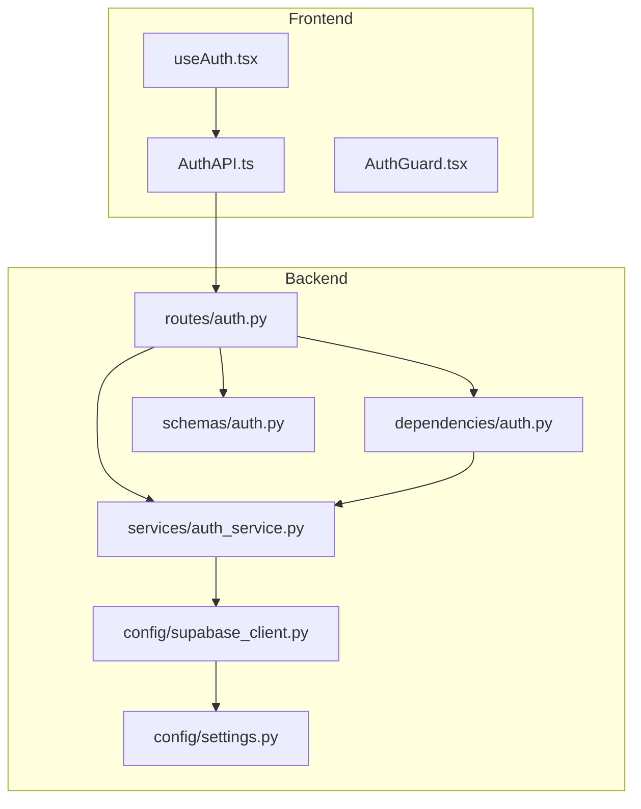
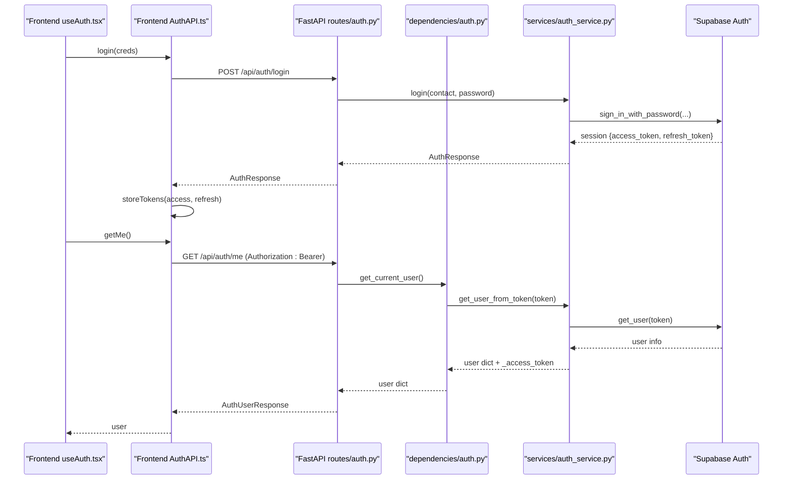
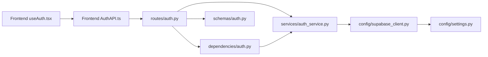

# Authentication Service

<cite>
**Referenced Files in This Document**
- [auth_service.py](file://Backend/services/auth_service.py)
- [auth.py (routes)](file://Backend/routes/auth.py)
- [auth.py (dependencies)](file://Backend/dependencies/auth.py)
- [supabase_client.py](file://Backend/config/supabase_client.py)
- [settings.py](file://Backend/config/settings.py)
- [auth.py (schemas)](file://Backend/schemas/auth.py)
- [useAuth.tsx](file://Frontend/greenflora/Hooks/useAuth.tsx)
- [AuthAPI.ts](file://Frontend/greenflora/services/AuthAPI.ts)
- [AuthGuard.tsx](file://Frontend/greenflora/components/auth/AuthGuard.tsx)
- [auth.ts (types)](file://Frontend/greenflora/types/auth.ts)
</cite>

## Table of Contents
1. [Introduction](#introduction)
2. [Project Structure](#project-structure)
3. [Core Components](#core-components)
4. [Architecture Overview](#architecture-overview)
5. [Detailed Component Analysis](#detailed-component-analysis)
6. [Dependency Analysis](#dependency-analysis)
7. [Performance Considerations](#performance-considerations)
8. [Troubleshooting Guide](#troubleshooting-guide)
9. [Conclusion](#conclusion)
10. [Appendices](#appendices)

## Introduction
This document explains the authentication service layer for Green Flora, focusing on JWT token-based authentication via Supabase Auth. It covers user registration, login, logout, token refresh, session management, dependency injection for route protection, error handling, and security best practices. It also includes examples of protected routes and client-side token management patterns used by the Next.js frontend.

## Project Structure
The authentication system is split across backend services, routes, dependencies, configuration, schemas, and a frontend that manages tokens and UI state.

**Diagram sources**
- [useAuth.tsx:46-127](file://Frontend/greenflora/Hooks/useAuth.tsx#L46-L127)
- [AuthAPI.ts:72-179](file://Frontend/greenflora/services/AuthAPI.ts#L72-L179)
- [auth.py (routes):68-132](file://Backend/routes/auth.py#L68-L132)
- [auth_service.py:32-193](file://Backend/services/auth_service.py#L32-L193)
- [auth.py (dependencies):36-101](file://Backend/dependencies/auth.py#L36-L101)
- [supabase_client.py:16-47](file://Backend/config/supabase_client.py#L16-L47)
- [settings.py:48-74](file://Backend/config/settings.py#L48-L74)
- [auth.py (schemas):42-100](file://Backend/schemas/auth.py#L42-L100)

**Section sources**
- [auth_service.py:1-193](file://Backend/services/auth_service.py#L1-L193)
- [auth.py (routes):1-132](file://Backend/routes/auth.py#L1-L132)
- [auth.py (dependencies):1-101](file://Backend/dependencies/auth.py#L1-L101)
- [supabase_client.py:1-47](file://Backend/config/supabase_client.py#L1-L47)
- [settings.py:1-123](file://Backend/config/settings.py#L1-L123)
- [auth.py (schemas):1-100](file://Backend/schemas/auth.py#L1-L100)
- [useAuth.tsx:1-141](file://Frontend/greenflora/Hooks/useAuth.tsx#L1-L141)
- [AuthAPI.ts:1-179](file://Frontend/greenflora/services/AuthAPI.ts#L1-L179)
- [AuthGuard.tsx:1-59](file://Frontend/greenflora/components/auth/AuthGuard.tsx#L1-L59)
- [auth.ts (types):1-36](file://Frontend/greenflora/types/auth.ts#L1-L36)

## Core Components
- AuthService: Centralizes all Supabase Auth interactions (signup, login, refresh, get_user_from_token, logout).
- Routes: Thin FastAPI endpoints that validate input via Pydantic schemas and delegate to AuthService.
- Dependencies: FastAPI dependency functions for protecting routes using Bearer tokens.
- Configuration: Centralized settings and a configured Supabase client with HTTPX options.
- Frontend: React context/hook for auth state, API service for token persistence and requests, and a guard component for route protection.

Key responsibilities:
- Validate and normalize inputs at the schema layer.
- Enforce authentication at the dependency layer.
- Handle business logic and external calls in the service layer.
- Persist and manage tokens securely on the client side.

**Section sources**
- [auth_service.py:32-193](file://Backend/services/auth_service.py#L32-L193)
- [auth.py (routes):68-132](file://Backend/routes/auth.py#L68-L132)
- [auth.py (dependencies):36-101](file://Backend/dependencies/auth.py#L36-L101)
- [supabase_client.py:16-47](file://Backend/config/supabase_client.py#L16-L47)
- [settings.py:48-74](file://Backend/config/settings.py#L48-L74)
- [auth.py (schemas):42-100](file://Backend/schemas/auth.py#L42-L100)
- [useAuth.tsx:46-127](file://Frontend/greenflora/Hooks/useAuth.tsx#L46-L127)
- [AuthAPI.ts:25-179](file://Frontend/greenflora/services/AuthAPI.ts#L25-L179)

## Architecture Overview
The flow uses JWT access tokens issued by Supabase Auth. The frontend stores both access and refresh tokens and attaches the access token to protected requests. The backend validates tokens via Supabase’s get_user endpoint and returns user info.

**Diagram sources**
- [useAuth.tsx:90-103](file://Frontend/greenflora/Hooks/useAuth.tsx#L90-L103)
- [AuthAPI.ts:150-179](file://Frontend/greenflora/services/AuthAPI.ts#L150-L179)
- [auth.py (routes):79-132](file://Backend/routes/auth.py#L79-L132)
- [auth.py (dependencies):36-69](file://Backend/dependencies/auth.py#L36-L69)
- [auth_service.py:94-178](file://Backend/services/auth_service.py#L94-L178)

## Detailed Component Analysis

### AuthService (Backend)
Responsibilities:
- Ensure Supabase client is initialized before any operation.
- Signup: create user via email or phone; return tokens and metadata.
- Login: authenticate user and return tokens and metadata.
- Refresh: exchange refresh token for new session.
- Get user from token: verify JWT and return user details.
- Logout: best-effort sign-out.

Error handling:
- ServiceUnavailableError when Supabase is not configured.
- AuthError for known failures (e.g., invalid credentials, expired token).

Complexity:
- All operations are O(1) relative to local processing; network latency dominates.

Optimization opportunities:
- Cache short-lived user info if needed (not required due to lightweight token validation).
- Use connection pooling already provided by httpx.

Security notes:
- Passwords are handled by Supabase Auth; no local hashing here.
- Tokens are validated server-side against Supabase.

**Section sources**
- [auth_service.py:24-193](file://Backend/services/auth_service.py#L24-L193)

### Routes (Backend)
Endpoints:
- POST /api/auth/signup: create account.
- POST /api/auth/login: authenticate.
- POST /api/auth/refresh: refresh session.
- POST /api/auth/logout: protected sign-out.
- GET /api/auth/me: protected current user info.

Validation:
- Input validated via Pydantic schemas (email/phone/password constraints).

Error mapping:
- Maps service exceptions to appropriate HTTP status codes (400, 503, 500).

Protected routes:
- Use get_current_user dependency to enforce Bearer token presence and validity.

**Section sources**
- [auth.py (routes):1-132](file://Backend/routes/auth.py#L1-L132)
- [auth.py (schemas):42-100](file://Backend/schemas/auth.py#L42-L100)

### Dependency Injection for Route Protection
Functions:
- get_current_user: requires valid Bearer token; raises 401 on missing/invalid/expired; 503 if Supabase unavailable.
- get_optional_user: returns None if no token or invalid; useful for mixed demo/live modes.

Behavior:
- Extracts Authorization header.
- Validates token via AuthService.get_user_from_token.
- Attaches raw token to user dict for downstream use (e.g., logout).

Usage example:
- Protected route pattern: def handler(user: dict = Depends(get_current_user)): ...

**Section sources**
- [auth.py (dependencies):1-101](file://Backend/dependencies/auth.py#L1-L101)
- [auth_service.py:156-178](file://Backend/services/auth_service.py#L156-L178)

### Supabase Client and Settings
Client:
- Created only when SUPABASE_URL and SUPABASE_SERVICE_KEY are set.
- Uses HTTPX with explicit timeouts and limits to avoid HTTP/2 issues on Windows.

Settings:
- Centralized environment variables for Supabase keys and other config.
- Supports optional features and graceful degradation when keys are missing.

**Section sources**
- [supabase_client.py:1-47](file://Backend/config/supabase_client.py#L1-L47)
- [settings.py:48-74](file://Backend/config/settings.py#L48-L74)

### Frontend Authentication Flow
Components:
- useAuth hook: provides user state, loading flag, and actions (login, signup, logout); restores session on mount using stored tokens; handles refresh on failure.
- AuthAPI service: centralizes API calls, token storage in localStorage, request helper with timeout and auth header injection, and typed errors.
- AuthGuard component: protects pages by redirecting unauthenticated users to /login while showing a loading state.

Token management:
- Stores access and refresh tokens under dedicated keys.
- Attaches Authorization header to protected requests.
- On startup, attempts to restore session; if invalid, tries refresh; otherwise clears tokens.

**Section sources**
- [useAuth.tsx:46-127](file://Frontend/greenflora/Hooks/useAuth.tsx#L46-L127)
- [AuthAPI.ts:25-179](file://Frontend/greenflora/services/AuthAPI.ts#L25-L179)
- [AuthGuard.tsx:37-59](file://Frontend/greenflora/components/auth/AuthGuard.tsx#L37-L59)
- [auth.ts (types):8-36](file://Frontend/greenflora/types/auth.ts#L8-L36)

### Data Models and Schemas
Backend schemas define strict contracts for requests and responses:
- SignupRequest: name, contact (email or phone), password with length constraints and contact validation.
- LoginRequest: contact and password.
- TokenRefreshRequest: refresh_token.
- AuthResponse: access_token, refresh_token, user_id, name, is_new.
- AuthUserResponse: user_id, name, email, phone.

Frontend types mirror these shapes for type safety.

**Section sources**
- [auth.py (schemas):42-100](file://Backend/schemas/auth.py#L42-L100)
- [auth.ts (types):8-36](file://Frontend/greenflora/types/auth.ts#L8-L36)

## Dependency Analysis

**Diagram sources**
- [auth.py (routes):20-34](file://Backend/routes/auth.py#L20-L34)
- [auth_service.py:14-21](file://Backend/services/auth_service.py#L14-L21)
- [auth.py (dependencies):26-31](file://Backend/dependencies/auth.py#L26-L31)
- [supabase_client.py:8-13](file://Backend/config/supabase_client.py#L8-L13)
- [settings.py:24-29](file://Backend/config/settings.py#L24-L29)
- [auth.py (schemas):15-17](file://Backend/schemas/auth.py#L15-L17)
- [useAuth.tsx:24-25](file://Frontend/greenflora/Hooks/useAuth.tsx#L24-L25)
- [AuthAPI.ts:9-14](file://Frontend/greenflora/services/AuthAPI.ts#L9-L14)

**Section sources**
- [auth.py (routes):1-132](file://Backend/routes/auth.py#L1-L132)
- [auth_service.py:1-193](file://Backend/services/auth_service.py#L1-L193)
- [auth.py (dependencies):1-101](file://Backend/dependencies/auth.py#L1-L101)
- [supabase_client.py:1-47](file://Backend/config/supabase_client.py#L1-L47)
- [settings.py:1-123](file://Backend/config/settings.py#L1-L123)
- [auth.py (schemas):1-100](file://Backend/schemas/auth.py#L1-L100)
- [useAuth.tsx:1-141](file://Frontend/greenflora/Hooks/useAuth.tsx#L1-L141)
- [AuthAPI.ts:1-179](file://Frontend/greenflora/services/AuthAPI.ts#L1-L179)

## Performance Considerations
- Network-bound: Most latency comes from Supabase Auth calls; ensure reasonable timeouts and retries on the client where appropriate.
- Connection pooling: Backend uses HTTPX with limits to avoid socket errors and improve throughput.
- Token validation: Lightweight server-side verification via Supabase; consider caching user info only if necessary.
- Frontend requests: Centralized fetch helper enforces timeouts and consistent error handling.

[No sources needed since this section provides general guidance]

## Troubleshooting Guide
Common issues and resolutions:
- Missing Supabase configuration:
  - Symptom: 503 Service Unavailable on auth endpoints.
  - Cause: SUPABASE_URL or SUPABASE_SERVICE_KEY not set; supabase client remains None.
  - Resolution: Set environment variables in Backend/.env and restart.

- Invalid or expired token:
  - Symptom: 401 Unauthorized on protected routes.
  - Cause: Access token missing, malformed, or expired.
  - Resolution: Ensure Authorization header is present; handle refresh flow on the frontend.

- Session expired during refresh:
  - Symptom: 400 Bad Request with message indicating session expiry.
  - Cause: Refresh token invalid or expired.
  - Resolution: Clear tokens and prompt re-login.

- Network or timeout errors:
  - Symptom: AuthApiError with type "network" or "timeout".
  - Cause: Connectivity issues or slow responses.
  - Resolution: Retry with backoff; check network; adjust timeouts if needed.

- Logout failures:
  - Behavior: Best-effort; does not block success response.
  - Resolution: Client should clear local tokens regardless of server outcome.

**Section sources**
- [auth_service.py:24-45](file://Backend/services/auth_service.py#L24-L45)
- [auth_service.py:127-178](file://Backend/services/auth_service.py#L127-L178)
- [auth.py (routes):45-61](file://Backend/routes/auth.py#L45-L61)
- [auth.py (dependencies):46-69](file://Backend/dependencies/auth.py#L46-L69)
- [AuthAPI.ts:98-137](file://Frontend/greenflora/services/AuthAPI.ts#L98-L137)

## Conclusion
The authentication system leverages Supabase Auth for secure, managed JWT issuance and validation. The backend cleanly separates concerns: routes validate inputs, dependencies enforce authentication, and the service layer encapsulates Supabase interactions. The frontend maintains a robust session lifecycle with token persistence, automatic refresh, and guarded routes. Security best practices include server-side token validation, minimal exposure of secrets via environment variables, and best-effort logout to avoid blocking user flows.

[No sources needed since this section summarizes without analyzing specific files]

## Appendices

### Example: Protected Route Pattern
- Define a route that requires authentication using the dependency:
  - Endpoint: GET /api/farmer/profile
  - Handler signature: def get_profile(user: dict = Depends(get_current_user))
  - Inside handler, access user_id and other fields from the user dict.

**Section sources**
- [auth.py (dependencies):6-13](file://Backend/dependencies/auth.py#L6-L13)
- [auth.py (dependencies):36-69](file://Backend/dependencies/auth.py#L36-L69)

### Example: Client-Side Token Management Patterns
- Store tokens after successful login/signup:
  - Call storeTokens(access_token, refresh_token).
- Attach token to protected requests:
  - Use includeAuth: true in request helper to add Authorization header.
- Restore session on app start:
  - Try getMe(); if it fails, attempt refreshSession(refresh_token); if still failing, clear tokens.
- Guard protected pages:
  - Wrap page content with AuthGuard to redirect unauthenticated users.

**Section sources**
- [AuthAPI.ts:38-46](file://Frontend/greenflora/services/AuthAPI.ts#L38-L46)
- [AuthAPI.ts:84-89](file://Frontend/greenflora/services/AuthAPI.ts#L84-L89)
- [useAuth.tsx:51-88](file://Frontend/greenflora/Hooks/useAuth.tsx#L51-L88)
- [AuthGuard.tsx:37-59](file://Frontend/greenflora/components/auth/AuthGuard.tsx#L37-L59)

### Security Best Practices Summary
- Never hardcode secrets; use environment variables.
- Validate all inputs at the schema layer.
- Always validate tokens server-side via Supabase.
- Use HTTPS in production to protect tokens in transit.
- Implement least privilege: only expose necessary user fields.
- Treat logout as best-effort; always clear local state on the client.

**Section sources**
- [settings.py:48-74](file://Backend/config/settings.py#L48-L74)
- [auth.py (schemas):42-77](file://Backend/schemas/auth.py#L42-L77)
- [auth_service.py:156-178](file://Backend/services/auth_service.py#L156-L178)
- [auth.py (routes):105-120](file://Backend/routes/auth.py#L105-L120)